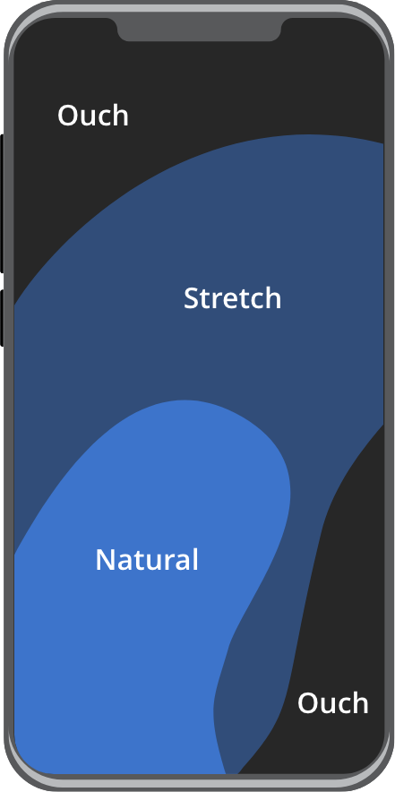
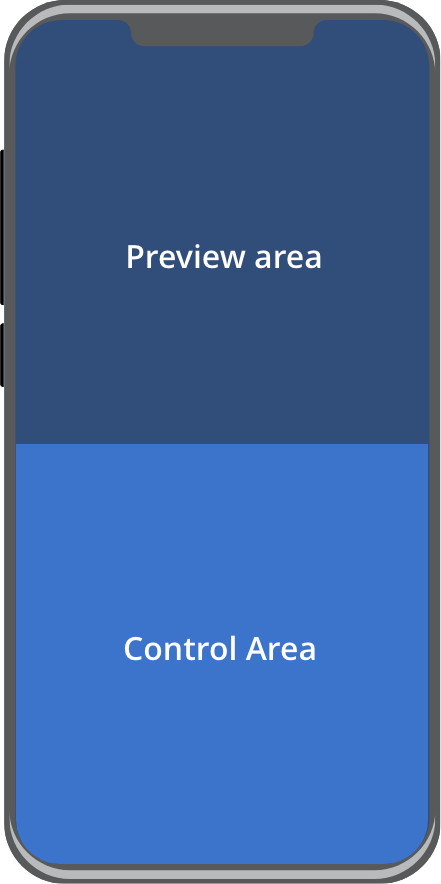

# EUDI Wallet Design Guide
*for the EUDI Wallet ecosystem*

_November 2023_
_v1.0.0_

*This is a working document that holds no legal value and does not
reflect any common agreement or position of the co-legislators. It
presents a state-of-play of ongoing work of the eIDAS Expert Group. This
document is being continuously updated and should not be considered
final.*

## 1 List of Figures

[Figure 1: Document Management example 6](#_Toc134618056)

[Figure 2: Interactive Elements example 6](#_Toc134618057)

[Figure 3: Document Presentation example 7](#_Toc134618058)

[Figure 4: Labels example 8](#_Toc134618059)

[Figure 5: Icons example 8](#_Toc134618060)

[Figure 6: Undo & Redo example 9](#_Toc134618061)

[Figure 7: Confirmation Dialogs example 10](#_Toc134618062)

[Figure 8: Flexible Inputs example 10](#_Toc134618063)

[Figure 9: iOS 3d touch example 11](#_Toc134618064)

[Figure 10: Bookmarks example 12](#_Toc134618065)

[Figure 11: Quick Proofs example 13](#_Toc134618066)

[Figure 12: Error Messages examples 14](#_Toc134618067)

[Figure 13: Layout 15](#_Toc134618068)

[Figure 14: Target Sizes 16](#_Toc134618069)

## 2 Introduction

### 2.1 Purpose of the design guide

This design guide outlines the principles, guidelines, and best
practices for creating consistent and effective design solutions for the
EUDI wallet. The purpose of a design guide is to ensure that all design
work produced by a team or across different teams is consistent,
coherent, adheres to certain standards and aligns with the overall goals
and values of the project.

As many sections will be subject to national implementation this
document includes guidelines to assist in creating a user interface that
is useful, usable, and enjoyable to use. It also provides specific
instructions and tips for creating accessible and inclusive designs.

### 2.2 Boundaries of the design guide
It shall be highlighted that this design guide does not aim to provide
detailed design elements to be adopted by national EUDI Wallet
implementations. Overall, the objective of the EUDI Wallet Design Guide
is to:

-   Identify key design principles and provide guidelines against these
    design principles;

-   Identify specific areas of the EUDI Wallet for which design
    principles are considered important and expand on those in future
    iterations of the EUDI Wallet Design Guide.

The design guidelines listed in this document shall not be considered as
mandatory towards the implementations of the EUDI Wallet, but rather
stand as recommendations to ensure a common user experience across the
different national implementations.

### 2.3 Importance of design consistency

UI (User Interface) consistency is important because it provides a
better user experience and helps users navigate a mobile application
more easily. When elements such as icons, colours, and fonts are
consistent throughout an application, users can quickly learn how to use
it and understand the application's intention.

Familiarity:

Consistent UI elements give users a sense of familiarity and they can
feel more comfortable using the application. If the user interface
changes too often, it can cause confusion and frustration.

Efficiency:

Consistency in the user interface can make navigation easier and more
efficient. Users will know where to find the features they need, and
they reduce cognitive load.

Accessibility:

Consistent UI elements make it easier for users with disabilities to
navigate the application. Users with visual impairments, for example,
can more easily use screen readers when consistent UI elements are used.

Overall, UI consistency is an essential aspect of good user interface
design. It makes the application more user-friendly, efficient, and
accessible.

### 2.4 Overview of design criteria
Twelve design criteria have been selected which we go over in details in
'Section 2'. The first 10 are the [usability heuristics from the Nielsen
Norman
group](https://www.nngroup.com/articles/ten-usability-heuristics/)[^1].
They are called \"heuristics\" because they are broad rules of thumb and
not specific usability guidelines. These are used to evaluate a User
Interface, so it is good to have them as guiding principles during the
design phase as well. These 10 principles are:

-   Visibility of system status

-   Match between system and the real world

-   User control and freedom

-   Consistency and standards

-   Error prevention

-   Recognition rather than recall

-   Flexibility and efficiency of use

-   Aesthetic and minimalist design

-   Help users recognize, diagnose, and recover from errors

-   Help and documentation

An additional 2 were added to address these important areas:

-   Accessibility

-   Writing

## 3 Design criteria

> Disclaimer: The design guidelines listed in this document shall not be
> considered as mandatory towards the implementations of the EUDI Wallet,
> but rather stand as recommendations to ensure a common user experience
> across the different national implementations. Any design elements
> included in the following chapter are indicative and are only used to
> better illustrate the corresponding design criteria.

### 3.1 Visibility of system status

> The design should always keep users informed about what is going on
> through appropriate feedback within a reasonable amount of time

#### 3.1.1 Indicative examples

**Document management**

When adding or removing a document the application should let the user
know whether the process was completed successfully of not.

*Figure 1: Document Management example*

**Interactive elements**

Interactive elements such as buttons must have a pressed and focused
state.

*Figure 2: Interactive Elements example*

### 3.2 Match between system and the real world

> The design should speak the users\' language. Use words, phrases, and concepts familiar to the user, rather than internal jargon. Follow real-world conventions, making information appear in a natural and logical order.
 
#### 3.2.1 Indicative examples

**Document representation**

Documents should be (where possible) represented in the UI by what is
familiar to the user instead of generic / ambiguous icons.

*Figure 3: Document Presentation example*

**Labels**

Stay away from technical terms and jargon. Use labels that people use in
their everyday life.

*Figure 4: Labels example*

**Icons**

People spend most of their time in other apps/websites. Use icons that
are familiar and clear to them instead on ambiguous ones.

*Figure 5: Icons example*

### 3.3 User control and freedom
------------------------

> Users often perform actions by mistake. They need a clearly marked
> \"emergency exit\" to leave the unwanted action without having to go
> through an extended process.

#### 3.3.1 Indicative examples

**Undo & Redo**

The third principle talks about giving the freedom to the user to
navigate and perform actions - for instance, the freedom to undo or redo
any accidental moves

*Figure 6: Undo & Redo example*

### 3.4 Consistency and standards

> Users should not have to wonder whether different words, situations, or
> actions mean the same thing. Follow platform and industry conventions.

App should follow interface standards and platform conventions.
Conventions have been established that users are familiar with. This
knowledge should be capitalised upon to make the app have a higher level
of intuitiveness.

E.g. Position of menu, Navigation bar, Search location

### 3.5 Error prevention

> Good error messages are important, but the best designs carefully
> prevent problems from occurring in the first place. Either eliminate
> error-prone conditions or check for them and present users with a
> confirmation option before they commit to the action.

#### 3.5.1 Indicative examples

**Confirmation dialogs**

For accidental actions such as miss-clicks

*Figure 7: Confirmation Dialogs example*

**Flexible inputs**

Flexible inputs allow people to answer questions the way they want
instead of the way a database requires them to. But these input fields
come with a promise to users: \"whatever format you choose, we\'ll take
it.\" For example, a phone number can be entered in various ways by
different people. The field can either format it accordingly on each own
or provide a hint of the expected format instead of producing in-line
errors or result in guesswork.

*Figure 8: Flexible Inputs example*

### 3.6 Recognition rather than recall

> Minimize the user\'s memory load by making elements, actions, and
> options visible. The user should not have to remember information from
> one part of the interface to another. Information required to use the
> design (e.g. field labels or menu items) should be visible or easily
> retrievable when needed.

### 3.7 Flexibility and efficiency of use

> Offer shortcuts---quick ways to get one or more tasks done with your
> apps. They should speed up the interaction with an app for the expert
> user

#### 3.7.1 Indicative examples

It's possible to improve the efficiency of interaction with an app for
experienced users with ways that will allow them to complete frequent
actions faster.

**iOS 3d touch**

Shortcuts for quick proofs through iOS 3d touch

*Figure 9: iOS 3d touch example*

**Bookmarked or Recently used documents on homepage**

Users can customise their home screens with the documents most relevant
for them

*Figure 10: Bookmarks example*

**Quick proofs within the app**

Quick proofs can give quick access to specific information serving both
convenience and privacy

*Figure 11: Quick Proofs example*

### 3.8 Aesthetic and minimalist design

> Interfaces should not contain information which is irrelevant or rarely
> needed. Every extra unit of information in an interface competes with
> the relevant units of information and diminishes their relative
> visibility. Use whitespace in harmony with your content.

### 3.9 Help users recognize, diagnose, and recover from errors

> Error messages should be expressed in plain language (no error codes),
> precisely indicate the problem, and constructively suggest a solution.

#### 3.9.1 Indicative examples

*Figure 12: Error Messages examples*

### 3.10 Help and documentation

> It\'s best if the system doesn\'t need any additional explanation.
> However, it may be necessary to provide documentation to help users
> understand how to complete their tasks.

#### 3.10.1 Indicative examples

This can come in the form of App-onboarding, tutorials, F.A.Q.s or a
Help section.

### 3.11 Accessibility

An estimated 100 million people in the EU have some form of disability,
and so represent an important segment of its population and a large user
group.

With Europe's aging population this number is only going to rise.
Keeping this in mind, it is important to distinguish accessibility from
disabilities. Accessibility in this case, refers to making a website
accessible to users who due to their temporary or permanent condition,
their age, or their situation may face issues with accessing website
content. For example, individuals with reduced manual dexterity due to
injury or neurological conditions (permanent), or with an injured arm
(temporary), or a new parent holding a baby (situational) all experience
difficulties that may impede movement, coordination, or sensation or
what is most commonly referred to as motor disability. Therefore, it
concerns a much wider audience that one may initially think. The
definition of disability differs as the term disability refers to
'long-term physical, mental, intellectual or sensory impairments which
in interaction with various barriers may hinder a person's full and
effective participation in society on an equal basis with others. By
delivering the user experience in a way that is accessible to people
with the aforementioned needs, we are providing equal access to
information for all citizens regardless of their situation or condition.

#### 3.11.1 Layout

Aim to have at least the main controls for the app at the bottom half of
the screen when they are easily reachable with the thumb when operating
the phone with one hand. The top half should be used for displaying
information, documents, QR codes etc.

|  |  |
|--|--|
|  |  |

*Figure 13: Layout*

#### 3.11.2 Target sizes

A target size is the area that can be activated in order to interact
with an element. Individuals with dexterity challenges may find it more
challenging to utilize a website if the target size is smaller. In this
section, we\'ll examine methods[^2] for generating target sizes that are
user-friendly, uniform, and properly spaced. A person\'s ability to
interact with smaller controls may be impacted by a disability or a
combination of disabilities that affect their motor movements and
dexterity, as well as by the act of using a website while on the move,
such as while walking or commuting.

*Figure 14: Target Sizes*

#### 3.11.3 Colour contrast guidelines

Text to background colour contrast should meet a **4.5:1** ratio.

How to check: enter the hex codes for the foreground and background
colours using

<https://whocanuse.com/>

#### 3.11.4 Font size guidelines

The UI should be designed to support up to x2 the text size without
breaking.

#### 3.11.5 Animations

Avoid adding flashing, blinking, and rotating animations on the
background. Excessive screen movement with no mechanism to control can
make it difficult for users to gather information.

Animations and transitions should be:

-   **Informative** (Motion design informs users by highlighting
    relationships between elements, action availability, and action
    outcomes.)

-   **Focused** (Motion focuses attention on what\'s important, without
    creating unnecessary distraction.)

-   **Expressive** (Motion celebrates moments in user journeys, adds
    character to common interactions, and can express a brand's style.)

#### 3.11.6 Screen readers

Make sure you provide the relative support for screen readers. Consider
how the reader is going to read the screen and place items accordingly
for convenience. In case of having to read through a lot of content to
get to the main controls, consider providing a skip button.

### 3.12 Writing

Text should be understandable by anyone, anywhere, regardless of their
culture or language. UI text can make interfaces more usable and build
trust. Text should be clear, accurate, and concise.

#### 3.12.1 Write in the present tense.

Use the present tense to describe product behaviour. Avoid using the
future tense as this usually requires later updates.

Use the present tense to describe product behaviour. Avoid using the
future tense to describe the way a product always acts. When you need to
write in the past or future tenses, use simple verb forms. This may not
be applicable to all languages; the overall goal is to be as concise as
possible without compromising clarity.

------------------------------------------ --------------
   Document added
------------------------------------------ --------------

*Write in the present tense.*

  ---------------------------------------- -------------------------
   Document has been added
  ---------------------------------------- -------------------------

*Don't write in different variations of the present tense, such as the
present perfect tense.*

#### 3.12.2 Begin with the objective.

When a phrase describes a goal and the action needed to achieve it,
start the sentence with the goal.

  ---------------------------------------- --------------------------------
   To add a document, click **+**
  ---------------------------------------- --------------------------------

*Start a statement with the objective ("to add a document") and end it
with the user action ("click **+**").*

  ---------------------------------------- -------------------------------
   Click **+** to add a document
  ---------------------------------------- -------------------------------

*Don\'t state the action the user takes ("Click **+**") before the
objective ("to add a document").*

#### 3.12.3 Avoid combining first and second person.

To avoid confusing the user, avoid using \"me\" or \"my,\" and \"you\"
or \"your,\" in the same phrase.

  ---------------------------------------- -----------------------------------------------
   Change **your** preferences in **My** Account
  ---------------------------------------- -----------------------------------------------

*Don\'t refer to the user in both the second person and the first person
within the same phrase.*

  ---------------------------------------- ----------------------------------------
   Change **your** preferences in Account
  ---------------------------------------- ----------------------------------------

## 4 EUDI Wallet -- Design Considerations

This section lists specific areas/features on which design
considerations are deemed important to ensure a common user experience
across the national implementations of the EUDI Wallets. It shall be
noted that this list highlights specific areas which are prioritised as
important but does not aim to be an exhaustive list.

### 4.1 User authentication 

-   Covering common user authentication aspects, e.g. PIN, biometrics
    etc.

-   Exploring the balance between the corresponding security aspects
    comparing to the user friction points throughout the entire user
    flow (e.g. required only at the point of sharing data? Or at login
    as well?)

-   Guidelines around 'user consent' in data sharing scenarios (e.g.
    requesting user consent, enforcing trust)

### 4.2 Browsing credentials/documents

-   Guidelines in relation to displaying a list of
    credentials/attestations in the EUDI Wallet

### 4.3 QR code presentation

-   Guidelines in relation to presenting the QR code for the
    corresponding proximity use cases

### 4.4 Confirmation/Summary/Authentication results

-   Guidelines in relation to the authentication results presentation,
    i.e. successful/unsuccessful identification and authentication

-   Guidelines in relation to data transfer results for proximity
    sharing use cases, i.e. successful/unsuccessful data transfer)

-   Covering guidelines related to the confirmation/summary results
    presented to the user

### 4.5 Error Messages

-   Handling/Display of error messages in different scenarios

    -   Erroneous user credentials

    -   User is not authenticated.

    -   Document is considered invalid.

    -   Relying party is not considered trusted.

-   Principles/guidelines on how these shall be presented/structured
    etc.

### 4.6 Privacy/Security by Design

-   Covering applicability of privacy/security aspects in the data
    sharing process (e.g. visual representation of 'password' field)

### 4.7 Trust Mark

-   Establish trust through the use of the EUDI Wallet Trust Mark

-   Applicability and placement in the corresponding sharing processes

### 4.8 Notification guidelines 

-   Guidelines in relation to displaying user notifications (where
    applicable) in the EUDI Wallet

## 5 Conclusion

In conclusion, this EUDI Wallet Design Guide document represents the
first iteration of what intends to be a \'living\' document, which will
be further elaborated for the specificities of the EUDI Wallet
functionalities, as listed in section 3 of the document. As such, it is
recognized that there may be areas for further elaboration and analysis
on which feedback and improvement suggestions from stakeholders is
anticipated.

Taking into consideration that the EUDI Wallet Design Guide shall be
applicable for the national implementations of the EUDI Wallet, the
boundaries of this document are set to common principles that shall be
applicable to all national implementations. These shall be considered as
recommendations to ensure a similar user experience across the different
national implementations. By taking a collaborative approach and
continuously improving upon this document, the aim is to create an EUDI
Wallet Design Guide that assists in the national implementations, while
at the same time meets the user expectations. We encourage stakeholders
to review this EUDI Wallet Design Guide document thoroughly and kindly
provide feedback that will assist if further shaping this design guide.

[^1]: NNGroup https://www.nngroup.com/articles/ten-usability-heuristics/

[^2]: Methods examined: By Apple
    https://developer.apple.com/design/human-interface-guidelines/layout
    and Google
    https://m3.material.io/foundations/layout/understanding-layout/overview
    &
    https://m3.material.io/foundations/accessible-design/accessibility-basics
