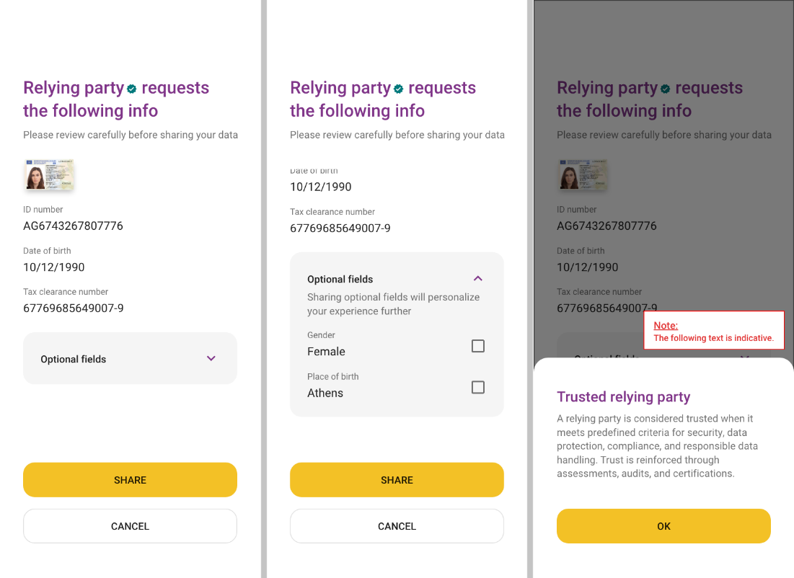
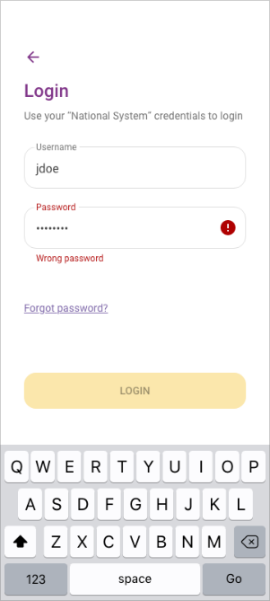
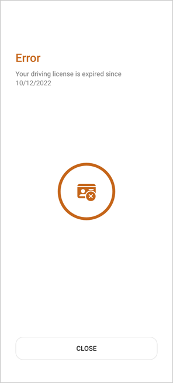
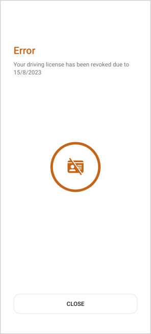
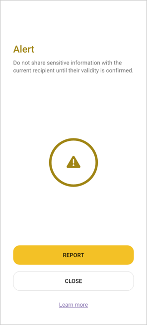
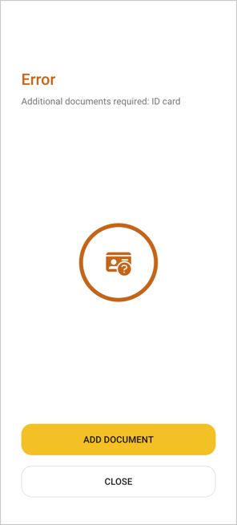

# EUDI Wallet Design Guide - Data Sharing Scenarios

_Version: 1.10_

## 1 Situations for identification/authorization 
In alignment with section '6.4' of the Architecture Reference Framework
(ARF), there are four main types of flows that the EUDI Wallet must
support. These main flows are as follows:

-   Remote same-device flow

-   Remote cross-device flow

-   Proximity supervised flow

-   Proximity unsupervised flow

It shall be noted that remote supervised cases are also considered as
possible in some use cases, but the document focuses mainly on the types
of flows detailed in the ARF, as listed in the above list.

The 'EUDI Wallet Design Guide' aims to expand on the defined 'Service
Blueprints' (published in 'ARF v1.1.0' where the focus is on the 'remote
same-device' and 'proximity' flows. However, design interactions
applicable for the 'remote cross-device' flow will also be analysed at a
high-level.

In relation to the remote flows, it shall be noted that the data exchange occurs over the Internet, but the key differentiator is related to the devices being utilized in the flows. In the 'remote same-device' flow, the EUDI Wallet User is on a mobile device, requesting access to a Relying Party's service (i.e. app or browser) and authorizes by using the EUDI Wallet app, which is also installed on the same device. 

In contrast, in the 'remote cross-device' flow, the EUDI Wallet user
consumes information from a Relying Party service on another device than
the EUDI Wallet device, e.g. user visits the relying party's service on
their web browser on a PC and uses the EUDI Wallet app to scan a QR Code
on a login page in order to get access to a service provided by the
Relying Party.

In relation to the 'proximity' flows, both flows are related to
scenarios where the EUDI Wallet User is physically close to a Relying
Party, the user does not necessarily have internet connectivity and the
data presentation occurs using proximity protocols (NFC, Bluetooth,
QR-Code, etc.). The key differentiator in the two proximity flows, is
that in the supervised flow, the EUDI Wallet presents data (e.g. a
mobile driving licence) to, or under the supervision of, a human acting
as a Relying Party (who may operate a device of their own). In the
unsupervised flow, the EUDI Wallet presents verifiable attributes to a
machine without human supervision.

## 2 Identifications

### 2.1 Identification Points

The following points are depicted as identification points within the
described user flows:

-   identification on application launch

-   identification when authorizing disclosure of data in proximity
    flows (possibility to be disabled via corresponding settings)
    (authorization process)

-   identification when presenting via deep link (authorization process)

-   identification after being idle

### 2.2 Identification Methods

A set of 'authentication means' applicable for the EUDI Wallet are being
analysed in this Design Guide. These are:

-   PIN

-   Pattern

-   Biometrics

-   Password

-   OTP

It shall be clarified that different levels of security shall be
required per use case, e.g. sharing a user's 'Person Identification
Data' is associated with 'High Level of Assurance', while showing a
'quick proof' that user is over 18 years of age may be associated with
simpler means of authentication.

Thus, it is expected that a combination of 'authentication means' are
available for the user to select and be used as per the needs of the
applicable use case. However, it shall be clarified that the available
authentication means are defined by the 'EUDI Wallet Provider' and the
'Device Manufacturer' and in principle shall adhere to the native way of
the operating system, e.g. password and biometrics.

It shall be noted that this section reflects a preliminary analysis
which is based on desk research and not on usability testing/field
research and it shall further be expanded and validated with detailed
research/user testing.

The analysed authentication means are being scored-in a scale of 0 to
10-against a set of design-related criteria, aiming to quantify the pros
and cons of each mean.

The criteria used for the rating are:

-   Convenience: The level of intuitiveness of each authentication
    method

-   Experience: Overall user experience from a user perspective (i.e.
    smooth experience)

-   Speed: Speed of use for the user's authentication process

-   Error Prevention: Assisting users to minimize potential errors in
    the authentication process

-   Accessibility: Adherence to accessibility standards/specificities

[\[CHART\]]{.chart}

*Ratings have been based on a desk study and not actual first-hand
testing*

| Method | Pros | Cons  |
|---|---|---|
| PIN | • Short and easy authentication method  | • Slower unlocking compared to other authentication methods   |
|  | • Flexibility in PIN requirements | • Requires users to memorize numbers   |
|  |  | • Recovery can be hard if you forget the PIN   |
|  |  | • Often predictable   |
| Pattern | • Simple and intuitive to use | • Many people choose simple, predictable patterns   |
|  |  | • Input method is visible to those around you   |
|  |  | • Belongs to a third party   |
| Password | • More secure than a PIN  | • Easy to guess   |
|  | • Flexibility in password requirements | • Slower unlocking   |
|  |  | • Password recovery can be as hard as a PIN recovery  |
| Biometrics (fingerprint) | • Fast and convenient authentication method  | • Fingerprints can be replicated.   |
|  |  | • Fingerprint distortion can cause failures.   |
|  |  | • Belongs to a third party   |
| Biometrics | • Fast unlocking method  | • Light effects and facial changes can cause failures   |
| (face scan) | • It doesn’t require memorizing codes and passwords. | • Screen orientation and distance from the camera can impact readability   |

## 3 Receiving & Configuring data request (by the user)

The EUDI Wallet should provide a secure and user-friendly environment by
empowering users with granular control over presenting their data,
ensuring transparency and clarity, and enabling user control and
consent.

-   **Selective Disclosure**: The EUDI Wallet should empower users to
    have granular control over the information they present. The EUDI
    Wallet should provide clear options for selective disclosure,
    allowing users to choose between mandatory and optional information
    to be presented, intending to emphasize on the data points which are
    required to be shared by the user. It is recommended that optional
    data shall be grouped in collapsed sections and be unselected by
    default. On the other hand, it should be clearly depicted that
    mandatory data cannot be unselected. The app should show users a
    concise summary of the requested data, clearly indicating which
    fields are mandatory and which are optional, as per each Member
    State (MS) / Relying Party (RP) policy decision. This empowers users
    to make informed decisions about what information they want to
    disclose, ensuring their privacy preferences are respected, with the
    risk of not completing a data request in a later step (more details
    in section 5 Error Cases).

-   **Transparency and Clarity**: Transparency is key in ensuring that
    users are always aware of what information is being presented. The
    EUDI Wallet should include clear and concise explanations about the
    purpose of each data request, the relying party\'s identity, and how
    the data will be used, highlighting data storage and 'intent to
    store' aspects to the user. Utilising plain language and avoiding
    technical jargon can enhance understanding and minimise user
    confusion.

-   **User Control and Consent**: To promote a sense of trust and
    control, the EUDI Wallet should prioritise user consent throughout
    the data-sharing process. The app should provide intuitive controls
    to enable users to configure their preferences easily. Clear
    notifications should be presented when changes are made, ensuring
    users are always aware of their data-sharing settings and can adjust
    them as needed.

-   **Pre-authorisation**: Pre-authorisation is a feature allowing the
    user to give automatic consent for releasing certain attributes,
    prior to any interaction. 'Pre-authorisation' as a concept may be
    implemented in the form of one or multiple 'profiles'. For example,
    if the user selects an 'age verification' profile, the EUDI Wallet
    will always release the corresponding attribute (e.g. age\_over\_NN)
    when requested by a Relying Party. However, if the user chooses to
    set a 'law enforcement' profile, the EUDI Wallet will release all
    attributes with a Relying Party, without giving the User the option
    of withholding consent during the transaction.

It shall be highlighted that the 'pre-authorisation' concept may
optionally be implemented, under the following conditions:

-   The pre-authorisation mechanism shall give the user the possibility
    to select which attribute(s) the EUDI Wallet Instance must release
    with which specific Relying Parties without asking for user consent
    during the interaction. User consent shall never apply
    indiscriminately to all Relying Parties or to all attributes.

-   A Relying Party for which pre-consent is given shall have been
    authenticated by the EUDI Wallet at least once. This is a
    consequence of the previous point as it is not possible to select a
    Relying Party if that Relying Party is not unambiguously known to
    the Wallet Instance. It shall be noted that this requirement holds
    for both proximity use cases and remote use cases.

-   Giving pre-authorisation shall be a 'friction-full' process, meaning
    that it shall not be too easy and requires a considered user
    decision. Possibly, giving pre-authorisation should require an
    additional user authentication step.

-   The EUDI Wallet shall be able to present to the user a clear
    overview of all pre-authorisation given, with the ability to easily
    change or withdraw one or more of these pre-authorisations. 

-   It shall be noted that pre-authorisations shall have a validity
    limit or the user should be regularly prompted to review any set up
    pre-authorisations.

-   If pre-authorisation applies for one or more requested attributes,
    the EUDI Wallet shall release these attributes without first
    notifying the user. However, immediately afterwards the EUDI Wallet
    shall notify the User that one or more attributes were released on
    the basis of pre-consent. That notification shall include an option
    to withdraw the applicable user consent, but also highlight 'intent
    to store' aspects to the user.

-   It shall be noted in the case where request also includes additional
    optional data request, it would be proposed pre-authorisation would
    prevail the potential request of optional data, since the concept of
    pre-authorisation would be introduced to simplify the user flow.
    However, further exploration and user research would be required for
    such flows.

-   Solution providers shall duly consider the associated
    security/privacy risks associated with the pre-authorisation feature
    in conjunction with the specific conditions listed above.

-   **Relying Party Trustworthiness**: Trust in relying parties is
    crucial for users to feel confident sharing their personal
    information. The EUDI Wallet should incorporate clear information
    and visual indicators or badges e.g. Trust Mark could be utilised to
    indicate whether the Relying Party is considered trusted, based on
    the underpinning trust framework established. Providing users with
    this data helps them make informed decisions about which parties
    they trust and are comfortable sharing their data with. Further
    information must be provided upon clicking on the badge regarding
    what it means to be a trusted party and how you become one.

The EUDI Wallet aims to promote user confidence and foster a sense of
control and privacy, thereby enhancing the overall adoption and utility
of the app.

## 4 Authorization

### 4.1 Remote (Online) Authorization and Authentication

To enable authorization for data sharing during online processes, the
following methods can be employed:

#### 4.1.1 Same Device

-   Deep Link (Notification): When sharing data on the same device as
    the wallet app, users can simply click on a deep link provided by
    the third-party service, such as \"Log in via EUDI Wallet.\" This
    action will instantly launch the EUDI Wallet app and present the
    authorization screen.

#### 4.1.2 Cross Device

-   QR Code: When sharing data from a different device, users can scan a
    QR code generated by the third-party service using their EUDI
    Wallet. This will seamlessly open the app and display the
    authorization screen.

### 4.2 Proximity-Based Authorization

To enable authorization for data sharing during offline processes, the
following methods can be employed:

#### 4.2.1 Cross Device (Attended)

-   QR/Bluetooth: When presenting data to a Relying Party (attended
    service), users can display a QR code on their EUDI Wallet to be
    scanned by the Relying Party's reader device and transmit the
    information via Bluetooth using their EUDI Wallet.

-   NFC/Bluetooth: Alternatively, users can use Near Field Communication
    (NFC) to engage with the Relying Party's device and Bluetooth to
    transmit the data to the Relying Party service through their EUDI
    Wallet.

#### 4.2.2 Cross Device (Unattended)

-   QR/Bluetooth: When presenting data to a Relying Party (unattended
    service), users can display a QR code and present the information
    via Bluetooth through their EUDI Wallet.

-   NFC/Bluetooth: Similarly, users can utilize NFC and Bluetooth to
    transmit the data to the Relying Party service through their EUDI
    Wallet.

During the authorization processes, a comprehensive screen will be
presented to the citizen which shall clearly display both mandatory and
optional data requested by the third-party service (as presented in
'section 3'). The citizens will have the freedom to choose which
optional information they wish to share, providing them with complete
control over their personal data. Additionally, a clear indication of
the data transfer outcome shall be presented to the users in all
scenarios described above, e.g. descriptive message regarding successful
data transfer.

## 5 Error cases

Handling/Display of error messages in different scenarios
(Principles/guidelines/consequences on how these shall be
presented/structured etc.)

### 5.1 Erroneous user credentials

When the user attempts to log in to the app, expects to receive feedback
indicating the success or failure of their login attempt.

The user gets an error message indicating that his credentials were wrong:\

### 5.2 Multiple failed attempts to login or present information

When the user is facing multiple failed attempts (e.g., 3) when trying
to log in, they get an error message as feedback from the app.

The error message typically indicates that the entered credentials are
incorrect or that there has been a problem with the identification
process. It can also guide the user in resolving the issue by reviewing
the credentials or checking for typos, etc., and prompts the user to try
again in 2 minutes or try to recover their password, hence the recovery
functionality may be presented as a fallback option for the user in case
his/her log-in attempts are not successful.

By limiting the number of login attempts, the app reduces the risk of
malicious factors attempting to gain unauthorized access by repeatedly
guessing passwords or usernames.

The user gets an error message indicating that they must try again later.
                                                                                
                                                                                

### 5.3 The document is considered invalid (expired/revoked)

When the user presents an invalid document through the app, (e.g., a
driver\'s licence to a police officer) the app displays an error message
on the user's screen, indicating that the document could not be verified
because it is expired or revoked.

The user gets a message indicating the status of the document.
  
However, the user should be warned if a document they have saved within
the app is expired or revoked. The warning could be presented as a
notification or prompt within the app, indicating that a saved document
is approaching or has already passed its expiration date. The message
could include information on how to renew or update the document,
directing the user to the appropriate authorities, or providing relevant
instructions.

The user gets a message indicating that the document expires shortly.

By providing proactive reminders about expired documents, the app can
contribute to a smoother user experience, help users remain compliant
with regulations, and foster trust and confidence in the app\'s
functionality and user support.

### 5.4 The Relying party is not considered trusted. Is not verified or could not be verified (Maybe address safety)

When the user attempts to share information through the app with a third
party -a physical person or a digital service- and it turns out that the
third party is not valid or is a fraud, they must get an alert warning
message.

The user gets a message indicating that they must not share information with that party. The options are to report it, to close the app, or to search for information about security.                                                                                                       

### 5.5 The user fails to present requested document

When a user scans their QR code using a QR code scanning device, they
receive a prompt to provide additional documents, such as an ID. If the
required document is not present in the user\'s app, an error message is
displayed, notifying the user that the document is not stored in their
app.

The error message then suggests adding the document from the available documents list. 
