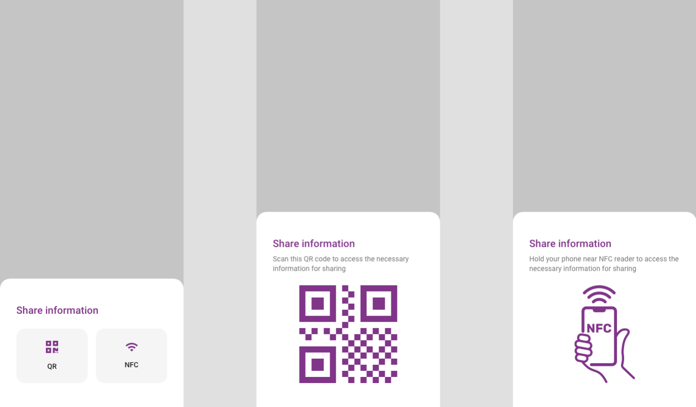
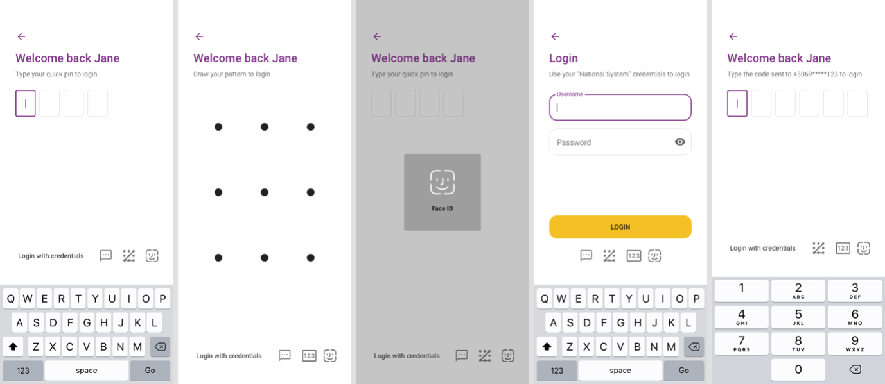
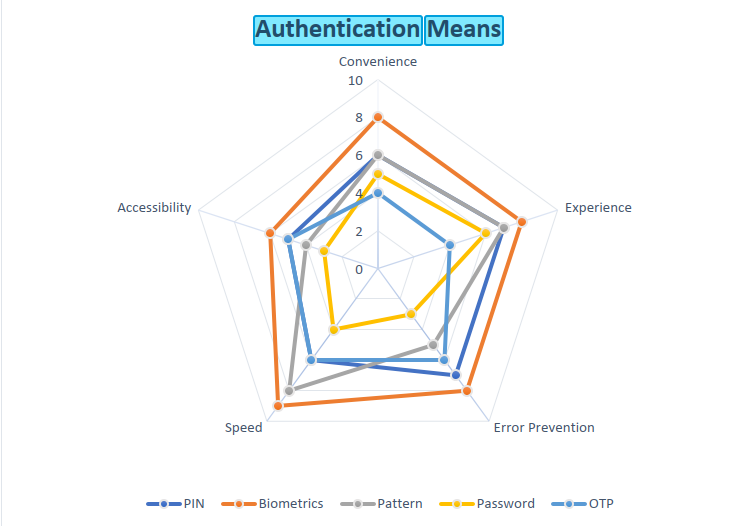
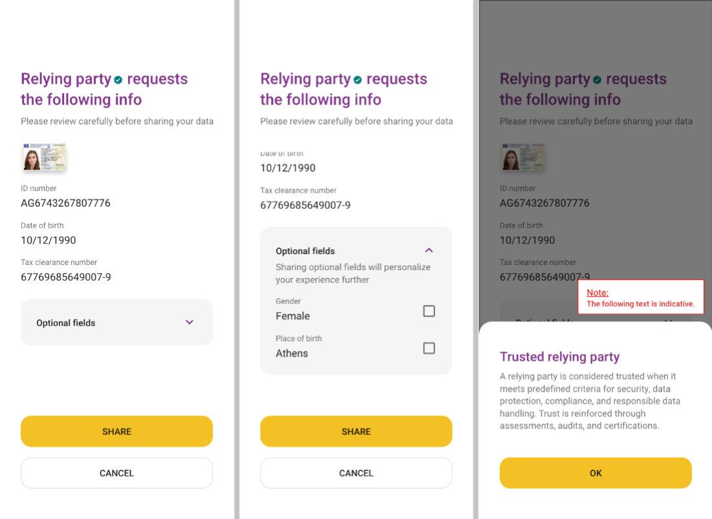
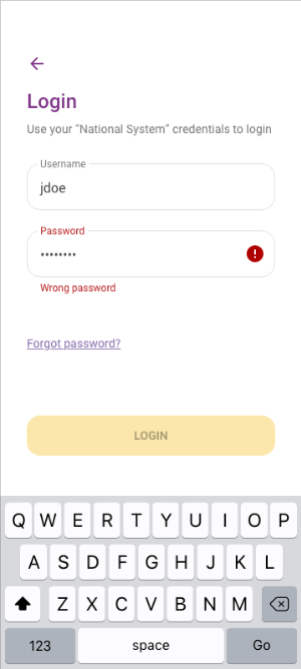
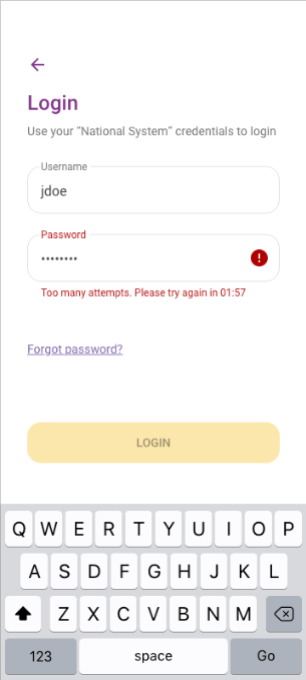
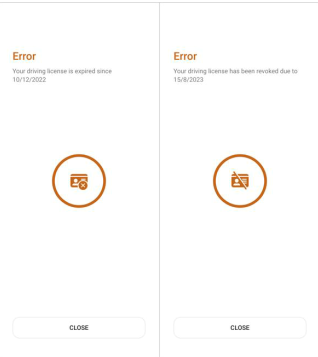
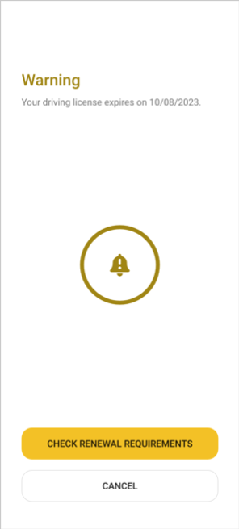
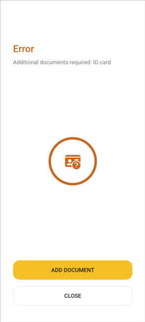

# EUDI WALLET DESIGN GUIDE – DATA SHARING SCENARIOS

_v1.11.0_

## **1 Situations for Identification/Authorization**

In alignment with section '6.4' of the Architecture Reference Framework (ARF), there are four main types of flows that the EUDI Wallet must support. These main flows are as follows:

- Remote same-device flow
- Remote cross-device flow
- Proximity supervised flow
- Proximity unsupervised flow

It shall be noted that remote supervised cases are also considered as possible in some use cases, but the document focuses mainly on the types of flows detailed in the ARF, as listed in the above list.

The 'EUDI Wallet Design Guide' aims to expand on the defined 'Service Blueprints' (published in 'ARF v1.1.0' where the focus is on the 'remote same-device' and 'proximity' flows. However, design interactions applicable for the 'remote cross-device' flow will also be analysed at a high-level.

---

In relation to the remote flows, it shall be noted that the data exchange occurs over the Internet, but the key differentiator is related to the devices being utilized in the flows. In the 'remote same-device' flow, the EUDI Wallet User is on a mobile device, requesting access to a Relying Party's service (i.e. app
or browser) and authorizes by using the EUDI Wallet app, which is also installed on the same device.

In contrast, in the 'remote cross-device' flow, the EUDI Wallet user consumes information from a Relying Party service on another device than the EUDI Wallet device, e.g. user visits the relying party's service on their web browser on a PC and uses the EUDI Wallet app to scan a QR Code on a login page in order to get access to a service provided by the Relying Party.

In relation to the 'proximity' flows, both flows are related to scenarios where the EUDI Wallet User is physically close to a Relying Party, the user does not necessarily have internet connectivity and the data presentation occurs using proximity protocols (NFC, Bluetooth, QR- Code, etc.). The key differentiator in the two proximity flows, is that in the supervised flow, the EUDI Wallet presents data (e.g. a mobile driving license) to, or under the supervision of, a human acting as a Relying Party (who may operate a device of their own). In the unsupervised flow, the EUDI Wallet presents verifiable attributes to a machine without human supervision.

---

## **2 Identifications**

### **2.1 Identification Points**

The following points are depicted as identification points within the described user flows:

- identification on application launch
- identification when authorizing disclosure of data in proximity flows (possibility to be disabled via corresponding settings) (authorization process)
- identification when presenting via deep link (authorization process)
- identification after being idle

---

### **2.2 Identification Methods**

A set of 'authentication means' applicable for the EUDI Wallet are being analysed in this
Design Guide. These are:

- PIN
- Pattern
- Biometrics
- Password
- OTP

It shall be clarified that different levels of security shall be required per use case, e.g. sharing a user's 'Person Identification Data' is associated with 'High Level of Assurance', while presenting a 'loyalty card' may be associated with simpler means of authentication.

Thus, it is expected that a combination of 'authentication means' are available for the user to select and be used as per the needs of the applicable use case. However, it shall be clarified that the available authentication means are defined by the 'EUDI Wallet Provider' and the 'Device Manufacturer' and in principle shall adhere to the native way of the operating system, e.g. password and biometrics.

It shall be noted that this section reflects a preliminary analysis which is based on desk research and not on usability testing/field research and it shall further be expanded and validated with detailed research/user testing.

---

The analysed authentication means are being scored-in a scale of 0 to 10-against a set of design- related criteria, aiming to quantify the pros and cons of each mean.

The criteria used for the rating are:

- **Convenience**: The level of intuitiveness of each authentication method
- **Experience**: Overall user experience from a user perspective (i.e. smooth experience)
- **Speed**: Speed of use for the user's authentication process
- **Error Prevention**: Assisting users to minimize potential errors in the authentication process
- **Accessibility**: Adherence to accessibility standards/specificities

> **_NOTE:_** _Ratings have been based on a desk study and not actual first-hand testing._

---

# **Authentication Methods Comparison**

| Method | Pros | Cons |
|--------|------|------|
| **PIN** | • Short and easy authentication method • Flexibility in PIN requirements | • Slower unlocking compared to other authentication methods • Requires users to memorize numbers • Recovery can be hard if you forget the PIN • Often predictable |
| **Pattern** | • Simple and intuitive to use | • Many people choose simple, predictable patterns • Input method is visible to those around you • Belongs to a third party |
| **Password** | • More secure than a PIN • Flexibility in password requirements | • Easy to guess • Slower unlocking • Password recovery can be as hard as a PIN recovery |
| **Biometrics (fingerprint)** | • Fast and convenient authentication method | • Fingerprints can be replicated • Fingerprint distortion can cause failures • Belongs to a third party |
| **Biometrics (face scan)** | • Fast unlocking method • It doesn't require memorizing codes and passwords | • Light effects and facial changes can cause failures • Screen orientation and distance from the camera can impact readability • The scanner can be fooled by user's photos or sometimes familial similarities • Provided by a third party |
| **One Time Password (OTP)** | • Alleviates the burden associated with memorizing passwords • Usually utilized as 2FA on top of PIN/Passwords but may also   &nbsp;  be used as an alternative to passwords (applicable after first    &nbsp; registration to a service)  • Offers a sense of advanced safety for the user | • Associated with higher 'interaction cost' (i.e. users are requested to type a code) • May raise confusion if OTP is not received on time – multiple attempts to receive an OTP • May require clear and concise OTP text (e.g. SMS or email) |

---

## **3 Receiving & Configuring Data Request (by the User)**

The EUDI Wallet should provide a secure and user-friendly environment by empowering users with granular control over presenting their data, ensuring transparency and clarity, and enabling user control and consent.

- **Selective Disclosure**: The EUDI Wallet should empower users to have granular control over the information they present. The EUDI Wallet should provide clear options for selective disclosure, allowing users to choose between mandatory and optional information to be presented, intending to emphasize on the data points which are required to be shared by the user. It is recommended that optional data shall be grouped in collapsed sections and be unselected by default. On the other hand, it should be clearly depicted that mandatory data cannot be unselected. The app should show users a concise summary of the requested data, clearly indicating which fields are mandatory and which are optional, as per each Member State (MS) / Relying Party (RP) policy decision. This empowers users to make informed decisions about what information they want to disclose, ensuring their privacy preferences are respected, with the risk of not completing a data request in a later step (more details in section 5 Error Cases).

- **Transparency and Clarity**: Transparency is key in ensuring that users are always aware of what information is being presented. The EUDI Wallet should include clear and concise explanations about the purpose of each data request, the relying party's identity, and how the data will be used, highlighting data storage and 'intent to store' aspects to the user. Utilising plain language and avoiding technical jargon can enhance understanding and minimise user confusion.

- **User Control and Consent**: To promote a sense of trust and control, the EUDI Wallet should prioritise user consent throughout the data-sharing process. The app should provide intuitive controls to enable users to configure their preferences easily. Clear notifications should be presented when changes are made, ensuring users are always aware of their data-sharing settings and can adjust them as needed.

- **Pre-authorisation**: Pre-authorisation is a feature allowing the user to give automatic consent for releasing certain attributes, prior to any interaction. 'Pre-authorisation' as a concept may be implemented in the form of one or multiple 'profiles'. For example, if the user selects an 'age verification' profile, the EUDI Wallet will always release the corresponding attribute (e.g. age_over_NN) when requested by a Relying Party. However, if the user chooses to set a 'law enforcement' profile, the EUDI Wallet will release all attributes with a Relying Party, without giving the User the option of withholding consent during the transaction.

  It shall be highlighted that the 'pre-authorisation' concept may optionally be implemented, under the following conditions:
  
  - The pre-authorisation mechanism shall give the user the possibility to select which attribute(s) the EUDI Wallet Instance must release with which specific Relying Parties without asking for user consent during the interaction. User consent shall never apply indiscriminately to all Relying Parties or to all attributes.
  
  - A Relying Party for which pre-consent is given shall have been authenticated by the EUDI Wallet at least once. This is a consequence of the previous point as it is not possible to select a Relying Party if that Relying Party is not unambiguously known to the Wallet Instance. It shall be noted that this requirement holds for both proximity use cases and remote use cases.

  - Giving pre-authorisation shall be a 'friction-full' process, meaning that it shall not be too easy and requires a considered user decision. Possibly, giving pre-authorisation should require an additional user authentication step.

  - The EUDI Wallet shall be able to present to the user a clear overview of all pre-authorisation given, with the ability to easily change or withdraw one or more of these pre-authorisations.

  - It shall be noted that pre-authorisations shall have a validity limit or the user should be regularly prompted to review any set up pre-authorisations.

  - If pre-authorisation applies for one or more requested attributes, the EUDI Wallet shall release these attributes without first notifying the user. However, immediately afterwards the EUDI Wallet shall notify the User that one or more attributes were released on the basis of pre-consent. That notification shall include an option to withdraw the applicable user consent, but also highlight 'intent to store' aspects to the user.

  - It shall be noted in the case where request also includes additional optional data request, it would be proposed pre-authorisation would prevail the potential request of optional data, since the concept of pre-authorisation would be introduced to simplify the user flow. However, further exploration and user research would be required for such flows.

  - Solution providers shall duly consider the associated security/privacy risks associated with the pre-authorisation feature in conjunction with the specific conditions listed above.

- **Relying Party Trustworthiness**: Trust in relying parties is crucial for users to feel confident sharing their personal information. The EUDI Wallet should incorporate clear information and visual indicators or badges e.g. Trust Mark could be utilised to indicate whether the Relying Party is considered trusted, based on the underpinning trust framework established. Providing users with this data helps them make informed decisions about which parties they trust and are comfortable sharing their data with. Further information must be provided upon clicking on the badge regarding what it means to be a trusted party and how you become one.

The EUDI Wallet aims to promote user confidence and foster a sense of control and privacy, thereby enhancing the overall adoption and utility of the app.

---

## **4 Authorization**

### **4.1 Remote (Online) Authorization and Authentication**

To enable authorization for data sharing during online processes, the following methods can be employed:

#### **4.1.1 Same Device**

- **Deep Link**: When sharing data on the same device as the wallet app, users can simply click on a deep link provided by the third-party service, such as "Log in via EUDI Wallet." This action will instantly launch the EUDI Wallet app and present the authorization screen.

---

#### **4.1.2 Cross Device**

- **QR Code**: When sharing data from a different device, users can scan a QR code generated by the third-party service using their EUDI Wallet. This will seamlessly open the app and display the authorization screen.

---

### **4.2 Proximity-Based Authorization**

To enable authorization for data sharing during offline processes, the following methods can be employed:

#### **4.2.1 Cross Device (Attended)**

- **QR/Bluetooth**: When presenting data to a Relying Party (attended service), users can display a QR code on their EUDI Wallet to be scanned by the Relying Party's reader device and transmit the information via Bluetooth using their EUDI Wallet.
- **NFC/Bluetooth**: Alternatively, users can use Near Field Communication (NFC) to engage with the Relying Party's device and Bluetooth to transmit the data to the Relying Party service through their EUDI Wallet.

---

#### **4.2.2 Cross Device (Unattended)**

- **QR/Bluetooth**: When presenting data to a Relying Party (unattended service), users can display a QR code and present the information via Bluetooth through their EUDI Wallet.
- **NFC/Bluetooth**: Similarly, users can utilize NFC and Bluetooth to transmit the data to the Relying Party service through their EUDI Wallet.

During the authorization processes, a comprehensive screen will be presented to the citizen which shall clearly display both mandatory and optional data requested by the third-party service (as presented in 'section 3'). The citizens will have the freedom to choose which optional information they wish to share, providing them with complete control over their personal data. Additionally, a clear indication of the data transfer outcome shall be presented to the users in all scenarios described above, e.g. descriptive message regarding successful data transfer.

---

## **5 Error Cases**

Handling/Display of error messages in different scenarios.
(Principles/guidelines/consequences on how these shall be presented/structured etc.)

- **5.1 Erroneous user credentials**

  When the user attempts to log in to the app, expects to receive feedback indicating the success or failure of their login attempt.

  
 
  _The user gets an error message indicating that his credentials were wrong:_

- **5.2 Multiple failed attempts to login or present information**

  When the user is facing multiple failed attempts (e.g., 3) when trying to log in, they get an error message as feedback from the app.
  The error message typically indicates that the entered credentials are incorrect or that there has been a problem with the identification process. It can also guide the user in resolving the issue by reviewing the credentials or checking for typos, etc., and prompts the user to try again in 2 minutes or try to recover their password, hence the recovery functionality may be presented as a fallback option for the user in case his/her log-in attempts are not successful. By limiting the number of login attempts, the app reduces the risk of malicious factors attempting to gain unauthorized access by repeatedly guessing passwords or usernames.

  

  _The user gets an error message indicating that they must try again later:_

- **5.3 The document is considered invalid (expired/revoked)**

  When the user presents an invalid document through the app, (e.g., a driver's license to a police officer) the app displays an error message on the user's screen, indicating that the document could not be verified because it is expired or revoked.

  
  
  _The user gets a message indicating the status of the document:_

  However, the user should be warned if a document they have saved within the app is expired or revoked. The warning could be presented as a notification or prompt within the app, indicating that a saved document is approaching or has already passed its expiration date. The message could include information on how to renew or update the document, directing the user to the appropriate authorities, or providing relevant instructions.

  
  
  _The user gets a message indicating that the document expires shortly:_

  By providing proactive reminders about expired documents, the app can contribute to a smoother user experience, help users remain compliant with regulations, and foster trust and confidence in the app's functionality and user support.

- **5.4 The Relying party is not considered trusted. Is not verified or could not be verified (Maybe address safety)**

  When the user attempts to share information through the app with a third party -a physical person or a digital service- and it turns out that the third party is not valid or is a fraud, they must get an alert warning message.

  
  
  _The user gets a message indicating that they must not share information with that party. The options are to report it, to close the app, or to search for information about security:_

- **5.5 The user fails to present requested document**

  When a user scans their QR code using a QR code scanning device, they receive a prompt to provide additional documents, such as an ID. If the required document is not present in the user's app, an error message is displayed, notifying the user that the document is not stored in their app.

  
  
  _The error message then suggests adding the document from the available documents list._