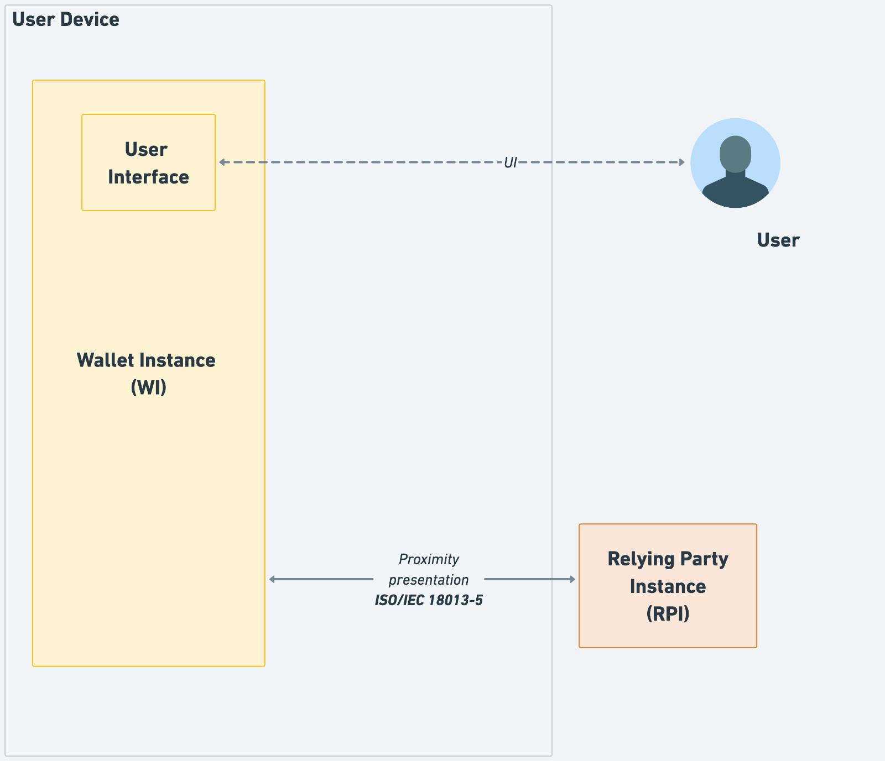
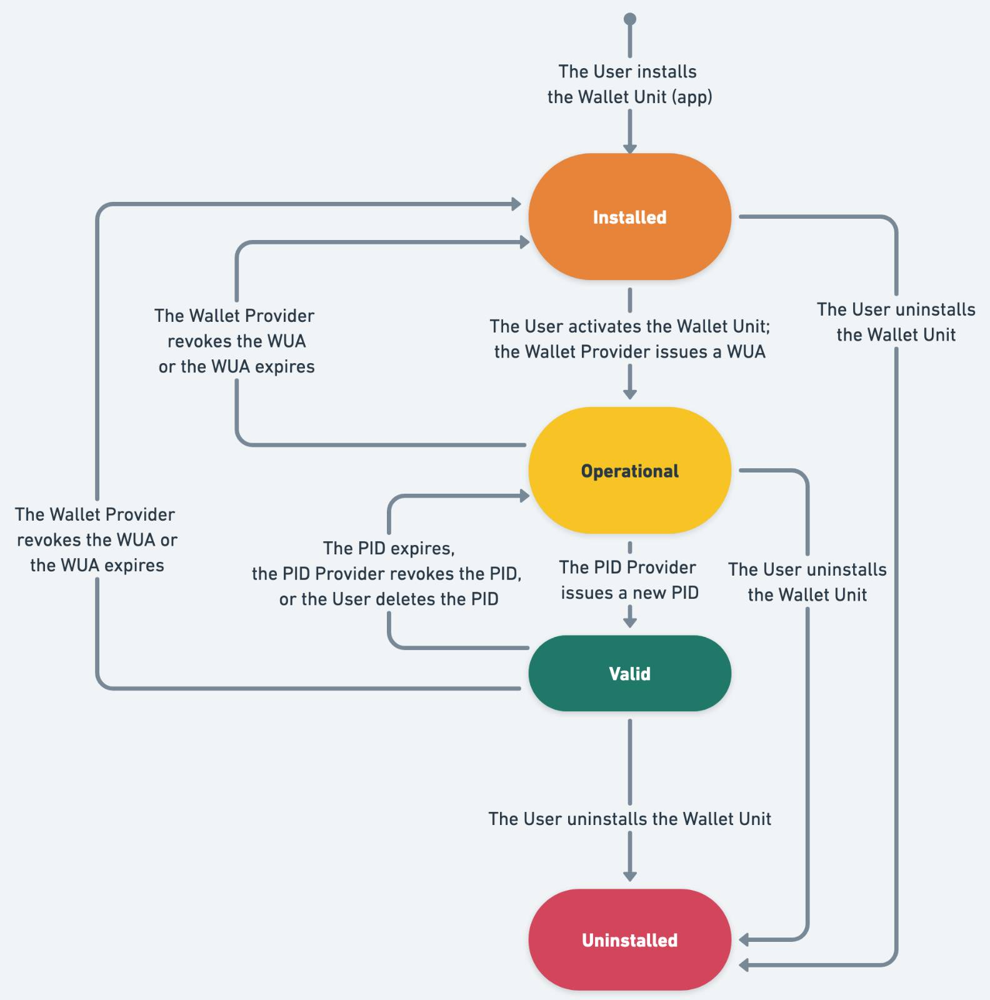

---
title: European Digital Identity Wallet
...

# Architecture and Reference Framework

## 1 Introduction

### 1.1 EUDI Wallet ecosystem

The European Digital Identity (EUDI) Wallet is a secure, user-controlled digital
application that empowers citizens to manage their official identity and other
personal data. It allows Users to request verified digital
information (known as "attestations") from trusted issuers (known as PID Providers and Attestation Providers), store that information, and present it to trusted parties (called Relying Parties) in a way that
prioritizes privacy and security.

This framework defines the architecture for the entire EUDI Wallet ecosystem,
which is built on a few core roles:

- the User: The citizen in full control of their Wallet Unit and their verified information.
- the Wallet Unit: The secure application on the User's device.
- PID Providers and Attestation Providers: Trusted entities (like a government, university, or bank)
that issues attestations to the User's Wallet Unit.
- Attestations: A verifiable digital credential, for example a national
ID, a diploma, or a mobile driving licence.
- Relying Party: A service, such as a website, an airline kiosk, or a police officer, that
needs to verify an attestation to be able to provide a service to a citizen.

### 1.2 Legal context

On 3 June 2021, the European Commission adopted a Recommendation ([COMMISSION
RECOMMENDATION (EU) 2021/946 of 3 June 2021 on a
[Common Union Toolbox](https://digital-strategy.ec.europa.eu/en/policies/eudi-wallet-toolbox)
for a coordinated approach towards a [European Digital Identity Framework](https://eur-lex.europa.eu/eli/reco/2021/946),
 [OJ L 210/51, 14.6.2021](https://eur-lex.europa.eu/legal-content/EN/TXT/HTML/?uri=OJ%3AL%3A2021%3A210%3AFULL))
calling on Member States to work closely together with the Commission towards
the development of a Toolbox including a technical Architecture and Reference
Framework (hereinafter the ARF), a set of common standards and technical
specifications and a set of common guidelines and best practices.

The Recommendation specifies that these outcomes will serve as a basis for the
implementation of the [European Digital Identity Regulation],
without the process of developing the Toolbox interfering with, or prejudging
the legislative process.

The Recommendation establishes a structured framework for cooperation between
Member States, the Commission, and, where relevant, private sector operators to
develop the Toolbox. The European Digital Identity Cooperation Group (EDICG),
formerly known as the eIDAS Expert Group, is responsible for:

- exchange best practices and cooperate with the Commission on emerging
policy initiatives in the field of digital identity wallets, electronic
identification means and trust services;
- advising the Commission in the preparation of draft implementing and delegated
acts;
- supporting Supervisory Bodies in the implementation of the [European Digital
Identity Regulation];
- organising peer reviews of electronic identification schemes;
- engaging with the Commission and other relevant stakeholders to develop a
[Common Union Toolbox](https://digital-strategy.ec.europa.eu/en/policies/eudi-wallet-toolbox);

The European Digital Identity Cooperation Group's page can be found
[at the official page](https://digital-strategy.ec.europa.eu/en/policies/european-digital-identity-cooperation-group).

The European Digital Identity Cooperation Group has since further developed the
concepts and specifications for the European Digital Identity Framework. The
current ARF version is based on the legal text adopted by the
co-legislators, including the adopted Commission Implementing Regulations:

- [CIR 2024/2977](https://data.europa.eu/eli/reg_impl/2024/2977/oj)
regarding PID and EAA,
- [CIR 2024/2979](https://data.europa.eu/eli/reg_impl/2024/2979/oj)
regarding integrity and core functionalities,
- [CIR 2024/2980](https://data.europa.eu/eli/reg_impl/2024/2980/oj)
regarding ecosystem notifications,
- [CIR 2024/2981](https://data.europa.eu/eli/reg_impl/2024/2981/oj)
regarding certification of Wallet Solutions,
- [CIR 2024/2982](https://data.europa.eu/eli/reg_impl/2024/2982/oj)
regarding protocols and interfaces,
- [CIR 2025/846](https://data.europa.eu/eli/reg_impl/2025/846/oj)
regarding cross border identity matching,
- [CIR 2025/847](https://data.europa.eu/eli/reg_impl/2025/847/oj)
regarding security breaches of European Digital Identity Wallets,
- [CIR 2025/848](https://data.europa.eu/eli/reg_impl/2025/848/oj)
regarding registration of Wallet Relying Parties,
- [CIR 2025/849](https://data.europa.eu/eli/reg_impl/2025/849/oj)
regarding the list of certified European Digital Identity Wallets,
- [CIR 2025/1566](http://data.europa.eu/eli/reg_impl/2025/1566/oj)
regarding the verification the identity and attributes of a QC or QEAA holder,
- [CIR 2025/1567](http://data.europa.eu/eli/reg_impl/2025/1567/oj)
regarding management of remote QSCDs as qualified trust services,
- [CIR 2025/1568](http://data.europa.eu/eli/reg_impl/2025/1568/oj)
regarding peer reviews of eID schemes,
- [CIR 2025/1569](http://data.europa.eu/eli/reg_impl/2025/1569/oj)
regarding QEAAs and EAAs provided by or on behalf of a public sector body
responsible for an authentic source,
- [CIR 2025/1570](http://data.europa.eu/eli/reg_impl/2025/1570/oj)
regarding notification of information on certified QSCDs,
- [CIR 2025/1571](http://data.europa.eu/eli/reg_impl/2025/1571/oj)
regarding the formats and procedures for annual reports by supervisory bodies,
- [CIR 2025/1572](http://data.europa.eu/eli/reg_impl/2025/1572/oj)
regarding the format and procedures for notification of intention and
verification with regard to the initiation of qualified trust services,
- [CIR 2025/1929](http://data.europa.eu/eli/reg_impl/2025/1929/oj) regarding the
binding of date and time to data and establishing the accuracy of the time
sources for the provision of qualified electronic time stamps,
- [CIR 2025/1942](http://data.europa.eu/eli/reg_impl/2025/1942/oj) regarding
qualified validation services for qualified electronic signatures and qualified
validation services for qualified electronic seals,
- [CIR 2025/1943](http://data.europa.eu/eli/reg_impl/2025/1943/oj) regarding
reference standards for qualified certificates for electronic signatures and
qualified certificates for electronic seals,
- [CIR 2025/1944](http://data.europa.eu/eli/reg_impl/2025/1944/oj) regarding
reference standards for processes for sending and receiving data in qualified
electronic registered delivery services and as regards interoperability of those
services,
- [CIR 2025/1945](http://data.europa.eu/eli/reg_impl/2025/1945/oj) regarding the
validation of qualified electronic signatures and of qualified electronic seals
and the validation of advanced electronic signatures based on qualified
certificates and of advanced electronic seals based on qualified certificates,
- [CIR 2025/1946](http://data.europa.eu/eli/reg_impl/2025/1946/oj) regarding
qualified preservation services for qualified electronic signatures and for
qualified electronic seals,
- [CIR 2025/2160](http://data.europa.eu/eli/reg_impl/2025/2160/oj) regarding
reference standards, specifications and procedures for the management of risks
to the provision of non-qualified trust services,
- [CIR 2025/2162](http://data.europa.eu/eli/reg_impl/2025/2162/oj) regarding the
accreditation of conformity assessment bodies performing the assessment of
qualified trust service providers and the qualified trust services they provide,
the conformity assessment report and the conformity assessment scheme,
- [CID 2025/2164](http://data.europa.eu/eli/dec_impl/2025/2164/oj) regarding the
version of the standard on which the common template for the trusted lists is
based.

### 1.3 Purpose, scope and audience

This **EUDI Wallet Architecture and Reference Framework (ARF)** defines the
architecture, components, and interactions of the EUDI Wallet ecosystem. It
provides the technical foundation for ensuring ecosystem-wide
**interoperability, security, and privacy**.

Specifically, this document serves three primary purposes:

- **Explains the architecture:** It details the system components and their
interactions, serving as background information for the High-Level Requirements
(HLRs) found in Annex 2.
- **Guides implementation:** It acts as a common reference for the harmonised
implementation of the [European Digital Identity Regulation], guiding the
development of technical specifications, standards, and operational procedures.
- **Supports development of reference implementation:** It is used to develop the Wallet Solution
[reference implementation](https://github.com/eu-digital-identity-wallet/.github/blob/main/profile/reference-implementation.md)
and will serve as a foundation for future updates to implementing acts based on
technological advancements.

This ARF is **informative** and intended to support implementation; it **does
not replace** the legally binding [European Digital Identity Regulation] or its
adopted implementing and delegated acts, which are the only mandatory
requirements.

This document applies exclusively to EUDI Wallet ecosystems compliant with the
Regulation. It represents the current state-of-play of the European Digital
Identity Cooperation Group and will be updated over time.

The audience of the ARF consists of:

- Public authorities acting as PID Providers, QEAA Providers, PuB-EAA Providers, or EAA Providers,
- Wallet Providers,
- Relying Parties,
- Conformity Assessment Bodies (CABs), and
- Supervisory Bodies.

### 1.4 Relation to the Large-Scale Pilots (LSP)

To support the development of a reference implementation of a Wallet Solution
and to pilot its usage across different priority use cases, the Commission
launched a call for proposals on 22 February 2022 under the Digital Europe
Programme to pilot use cases for the EUDI Wallet ecosystem at a large scale.

The objective of the Large-Scale Pilots (LSP) call is to support the piloting of
the EUDI Wallet ecosystem around a range of use cases involving both public and
private sector stakeholders. The LSPs will test the EUDI Wallet ecosystem in
both national and cross-borders contexts and integrate with the iterative
development of the reference application.

The works of the LSPs will be aligned with the ARF, which will guide pilot
system design and architecture development together with the release of the
reference implementation.

The LSPs are expected to provide feedback on the ARF as they develop and
interact with Relying Party services, Qualified or non-qualified Electronic
Attestations of Attributes (Q)EAA Providers, Person Identification Data (PID)
Providers, Qualified and non-qualified Trust Service Providers and Users in
meaningful interactions under the proposed use cases.

### 1.5 Definitions

The definitions used in this document can be found in
[Annex 1](./annexes/annex-1/annex-1-definitions.md) of this document.

### 1.6 Change Log v2.7.2

#### 1.6.1 Overview

In this version of the ARF:  

- The original Annex 2 has been replaced by a .csv file, which allows for easy sorting and filtering of requirements. Please see [Section 1.6.1](#161-changed-formats-for-annex-2) for more details.
- The latest version of [the Discussion Paper for Topic F](./discussion-topics/f-digital-credential-api.md)
resulted in a number of changed High-Level Requirements in Annex 2 and in
[Section 4.4.3.1](#4431-introduction).
- The [Discussion Paper for Topic P](./discussion-topics/p-secure-cryptographic-interface-between-the-Wallet-Instance-and-WSCA.md)
was integrated into [Section 4.5](#45-wscd-architecture-types).
- The [Discussion Paper for Topic Q](./discussion-topics/q-interface-user-wallet-instance.md)
was integrated into [Topic 54](./annexes/annex-2/annex-2.02-high-level-requirements-by-topic.md#a2332-topic-54---accessibility).
- The [Discussion Paper for Topic R](./discussion-topics/r-authentication-of-user-to-device.md)
was integrated into [Sections 2.2](#22-identification-and-authentication),
[4.3.2](#432-components-of-a-wallet-unit) and
[6.5.3.3](#6533-wallet-unit-requests-user-to-set-up-two-user-authentication-mechanisms),
and into [Topic 40](./annexes/annex-2/annex-2.02-high-level-requirements-by-topic.md#a2322-topic-40---wallet-instance-installation-and-wallet-unit-activation-and-management).
Moreover, the distinction between the WSCA/WSCD and a keystore, which was
introduced in this Topic, has been made throughout the ARF main document and
Annex 2. A definition of 'keystore' was added to Annex 1.
- The [Discussion Paper for Topic S](./discussion-topics/s-certificate-transparancy.md)
was integrated into [Sections 6.3.2.3](#6323-pid-provider-or-attestation-provider-receives-an-access-certificate-and-a-registration-certificate)
and [6.4.2](#642-relying-party-registration). In addition, in Annex 2, a new
[Topic 55](./annexes/annex-2/annex-2.02-high-level-requirements-by-topic.md#a2333-topic-55---certificate-transparency)
was created for the high-level requirements on Certificate Transparency for
access certificates.
- All figures in the ARF have been re-created using and the source files
(in XML format) are made available in the GitHub repository of the ARF.
- Several issues raised via Confluence and GitHub have been resolved.

Apart from these changes, a limited number of editorial mistakes were corrected.

#### 1.6.1 Changed formats for Annex 2

All high-level requirements in Annex 2
are now included in the [high-level-requirements.csv file](https://raw.githubusercontent.com/eu-digital-identity-wallet/eudi-doc-architecture-and-reference-framework/refs/heads/main/hltr/high-level-requirements.csv), which allows for easy sorting and filtering of
requirements. Insofar relevant, the texts in the introduction to each Topic in
Annex 2 were moved to suitable sections in the ARF main document.

or the convenience of readers, the high-level requirements in the .csv file are also included in two new .md files, called [annex-2.02-high-level-requirements-by-topic.md](./annexes/annex-2/annex-2.02-high-level-requirements-by-topic.md) and [annex-2.03-high-level-requirements-by-category.md](./annexes/annex-2/annex-2.03-high-level-requirements-by-category.md), which were generated from the .csv file. Note that in case of deviations between the .csv file and the .md files, the .csv file takes precedence.

The requirements in these files are identical, but they are ordered in a different manner.  The file [annex-2.02-high-level-requirements-by-topic.md](./annexes/annex-2/annex-2.02-high-level-requirements-by-topic.md) contains the high-level requirements in the same order as the original (i.e., pre-v2.7.0) Annex 2 file, meaning ordered per discussion topic. It also contains the same Topic numbers and section indicators. However, Topics in the original file that did not contain any high-level requirements have been removed from the .csv file and hence from the resulting .md file.

The file [annex-2.03-high-level-requirements-by-category.md](./annexes/annex-2/annex-2.03-high-level-requirements-by-category.md) orders the high-level requirements on the basis of their subject, meaning the entity that has to comply with each requirement. To enable this, a new system of requirement identifiers was developed, next to the existing identifiers which are based on topic. These new requirement identifiers have a simple, hierarchical format: PART-CATEGORY-SUBCATEGORY-ID, where
  
- PART is either actor-specific requirements (AS) or ecosystem-wide requirements (EW).
- CATEGORY is a two or three-letter code based on the six main categories established below. This provides immediate context.
- TOPIC is the number of of the topic in which this requirement was originally included.
- ID is a three-digit sequential number (e.g., 001, 002) to ensure uniqueness.

Categories under Part 1: Actor-Specific Requirements:

- **Wallet Providers (WP)**: This category includes all HLRs that are the direct responsibility of the entities developing and maintaining the EUDI Wallet solutions. It covers core functionalities, security, user interface elements, and lifecycle management of the wallet.
- **Member States & Registrars (MS)**: This category includes all requirements for Member States, including their designated Registrars and authorities. It focuses on establishing the legal and trust infrastructure, such as setting up registries, notifying the Commission, and defining national policies.
- **Attestation Providers & PID Providers (AP)**: In this categories, all HLRs for the organizations that issue digital credentials are placed. This includes requirements for identity verification, issuance protocols, data formats, and revocation procedures.
- **Relying Parties (RP)**: This category consolidates all requirements for the services that accept EUDI Wallet Units. It covers how they must register, authenticate themselves to the wallet, request user attributes, and handle User attributes.

Categories under Part 2: Ecosystem-Wide Requirements:

- **Protocols & Interoperability (PIO)**: This category includes the HLRs that define the common communication standards and protocols. It ensures that a Wallet Unit from one Wallet Provider can interact seamlessly with a Relying Party service in another, covering how different components talk to each other.
- **Data Models & Attestation Rules (DM)**: Finally, this category defines the structure and rules for the data (attestations) itself. It includes HLRs for PIDs, Attestation Rulebooks, and Catalogues, ensuring that the information exchanged is consistent and understandable across the entire ecosystem.

### 1.7 Additional topics

In this version of the **Architecture and Reference Framework (ARF)**, several
areas still require further exploration and refinement. These topics will be
addressed through discussions with Member States, the European Digital Identity
Cooperation Group, civil society, industry representatives, and professionals,
ensuring broad and comprehensive feedback from all relevant stakeholders.  

The outcomes of these discussions will be incorporated into future versions of
the ARF. The document will continue to evolve iteratively, improving its content
and addressing new topics as they emerge. The process for providing feedback and
details on how updates are managed is described in [Chapter 9](#9-document-development).

The current areas identified for further discussion include:  

- Definition of support and maintenance responsibilities of Wallet Providers  

A detailed list of these topics, along with progress updates, is available on [GitHub](https://github.com/orgs/eu-digital-identity-wallet/projects/36).

### 1.8 Drafting Process and Discussion Papers

The development of the **Architecture and Reference Framework (ARF)** is guided
by discussions with Member States and experts from the European Digital Identity
Cooperation Group, as well as by feedback from industry and the wider community
through GitHub.  

For each [discussion topic](https://github.com/orgs/eu-digital-identity-wallet/projects/36),
a **Discussion Paper** is created and iteratively refined until consensus is
reached. Once finalised, the paper is integrated into the next release of the
ARF. An overview of all Discussion Papers and the ARF versions into which they
were integrated can be found in the [corresponding README file](./discussion-topics/README.md).

Once a Discussion Paper has been integrated into the ARF, it is **no longer
updated**. Over time, its content may therefore become outdated, for example,
when high-level requirements are modified in later ARF versions. This can happen
for several reasons:

- **Adjustments at integration**  
  Requirements or descriptions may already be slightly modified when a
  Discussion Paper is integrated into the ARF, to ensure consistency of language
  and style
  across the ARF. Sometimes further refinements are made in collaboration
  between the ARF editors and the authors of the paper, for example to solve
  contradictions between high-level requirements proposed in the discussion
  paper and existing requirements in other parts of the ARF.  
- **Interdependence of topics**  
  Discussion topics are not entirely separate. The introduction of new
  Discussion Papers may lead to adjustments of existing requirements or
  descriptions in the ARF.  
- **Continuous feedback**  
  The Commission receives feedback via Confluence, GitHub, and internal reviews.
  When accepted, these comments lead to further changes in the ARF.  

Although the ARF may reference Discussion Papers as background information,
**historic Discussion Papers (including their proposed high-level requirements)
are not normative**. The final requirements are those in the latest
version of the Annex 2 of the ARF.  

## 2 EUDI Wallet functionalities

### 2.1 Introduction

The EUDI Wallet ecosystem is designed as a secure, User-controlled digital
environment that enables Users to use their Wallet Unit to manage and present
their person identification data (PID) and attestations across both public and
private services in the EU. Its functionalities are built around security,
privacy, and User control, ensuring seamless interactions with Relying Parties
and other entities, while adhering to data
protection principles.

This chapter outlines the core functionalities of Wallet Solutions, as defined
by the [European Digital Identity Regulation], and examines how the requirements
for its implementation align with real-world use cases where Users will use
their Wallet Unit.

The functionalities of a Wallet Unit can be grouped into the following
categories:

- **Secure identification and authentication**, ensuring that Users can present
person identification data in a trusted environment.
- **Exchanging qualified and non-qualified User attributes** through secure and
verifiable electronic attestations of attributes.
- **Electronic signing of documents or data**, allowing Users to create
legally recognised qualified electronic signatures and seals.
- **Generate and use pseudonyms** for authentication, to enhance privacy and
prevent tracking.

These functionalities are discussed in the next four sections.

### 2.2 Identification and authentication

Using their Wallet Units, Users are able to:

- **Identify and authenticate** to online and offline services, while using
**selective disclosure** of attributes as well as **User approval**. This
*ensures that only necessary and User-approved attributes are presented to
*Relying Parties, which minimises exposure of personal information.
- **Securely authenticate Relying Parties or other Wallet Units**, making sure
that attributes are only presented to trusted entities.
- **Onboard seamlessly with PID Providers or attestation Providers** by
leveraging existing electronic identification schemes, for a smooth and secure
registration process.
- **Be informed** whether a Relying Party is registered to receive
the requested attributes.
- **Access a transaction log via a dashboard**, allowing Users to:  
    - **Review past interactions** with Relying Parties and Wallet Units.  
    - **Request data erasure** under the GDPR Article 17 to maintain privacy.  
    - **Report suspicious Relying Parties** to the relevant national data
    protection authority.

These identification and authentication functions are closely linked to the
concept of the Wallet Unit as an **electronic identity (eID) means**. The
[European Digital Identity Regulation], Article 3 (42) defines a Wallet Unit as
an eID means that allows the User to store and manage a PID. The combination of
a Wallet Unit and a PID therefore is an eID means.

Article 5a (5) d requires a Wallet Unit to meet the requirements with regard to
assurance level high. This means that **a PID within a Wallet Unit** needs to be
issued and managed on Level of Assurance High. However, this is not true for
other attestations in that Wallet Unit. In fact, the term 'Level of Assurance',
legally speaking, only applies to eID means, and therefore is meaningless for
other attestations. For other attestations, the ARF therefore uses 'level of
security' to indicate that different attestations may need to be issued and
managed at different security levels. Each Attestation Provider will specify the
required level of security for its attestations.

### 2.3 Attribute exchange mechanism using attestations

Using their Wallet Units, Users are able to:

- **Request, store, and present** personal identification data and electronic
attestations of attributes under their sole
control, ensuring secure usage in both online and offline scenarios.
- **Backup a list of their attributes, attestations, and configurations**,
guaranteeing compliance with data portability rights.
- **Prevent tracking by Relying Parties** when using attestations,
ensuring privacy-preserving interactions.

### 2.4 Qualified electronic signatures

Using their Wallet Units, Users are able to:

- **Create qualified electronic signatures and seals** for legally binding
digital transactions.
- **Sign documents using qualified electronic signatures**, which are provided
by default and free of charge within the Wallet Unit, ensuring universal
accessibility and compliance with legal standards.

These functionalities are implemented by using the authentication and signing
capabilities of the Wallet Unit as a part of a local QSCD, or a remote QSCD
managed by a QTSP. See [Topic 16](./annexes/annex-2/annex-2.02-high-level-requirements-by-topic.md#a2310-topic-16---signing-documents-with-a-wallet-unit)
and [Topic 37](./annexes/annex-2/annex-2.02-high-level-requirements-by-topic.md#a2337-topic-37---qes----remote-signing---technical-requirements).

### 2.5 Pseudonyms

Pseudonyms can be used to authenticate a User when it is not necessary for a
Relying Party to learn the identity of the User. As specified in [CIR
2024/2979], [W3C WebAuthn] defines the technical specification for pseudonyms.
Passkeys are a widely used type of credential which are created and asserted
using the WebAuthn API. [Section 4.7](#47-pseudonyms) gives more information on
the architecture and message flows of Passkeys.

A User uses a pseudonym when they wish to create an account at a Relying Party
without identifying themselves. The Relying Party associates the pseudonym with
the account, such that it can be used for subsequent authentication in later
interactions with that Relying Party. The User may additionally present
attributes from a PID or attestation to the Relying Party, either during
registration of the pseudonym or at a later interaction.

See also [Topic 11](./annexes/annex-2/annex-2.02-high-level-requirements-by-topic.md#a238-topic-11---pseudonyms)
and the [Discussion Paper on Topic E](./discussion-topics/e-pseudonyms-including-user-authentication-mechanism.md).

### 2.6 The role of Use Cases

#### 2.6.1 Overview

The development of the Architecture and Reference Framework (ARF) is strategically
driven by real-world use cases, ensuring that the User experience, value
proposition, and requirements of the EUDI Wallet ecosystem are
effectively addressed. To achieve this, the European Digital Identity
Cooperation Group initially created service blueprints for each use case, which
detail service touch points, components, and processes.

These blueprints serve a dual purpose: they play a crucial role in service
design, enhancing both User experience and operational efficiency, while also
identifying areas for improvement. As a foundational element, these blueprints
shape the development of common specifications, providing comprehensive yet
flexible solutions that can accommodate alternative approaches and optional
steps.

User journeys may vary based on the specific implementation approach,
influencing aspects such as data retrieval and User approval processes. The
Annexes contain detailed descriptions of these blueprints, ensuring transparency
and adaptability.

The European Digital Identity Cooperation Group has outlined service blueprints
for the following main use cases:

- Identification and authentication to access online services, see [Section 2.6.2](#262-identification-and-authentication-to-access-online-services-using-pid),
- Qualified Electronic Signature, see [Section 2.4](#24-qualified-electronic-signatures),
- Mobile Driving Licence, see [Section 2.6.3](#263-mobile-driving-licence),
- Strong User Authentication for electronic payments, see [Section 2.6.4](#264-strong-user-authentication-for-electronic-payments)
- A natural person representing another natural person, see [Section 2.6.5](#265-natural-person-representing-another-natural-person).
- Additional use cases that will be introduced in the future, see [Section 2.6.6](#266-examples-of-other-use-cases).

These blueprints, along with all relevant information on use cases
implementation, will be compiled in a standardised format within a dedicated
document titled the "Use Cases Manual", and distributed together with this document.

#### 2.6.2 Identification and authentication to access online services using PID

One of the main use cases of the EUDI Wallet ecosystem is secure User
identification and authentication. A User presents data from their PID, which is
issued and managed at Level of Assurance (LoA) High, to various online services,
both public and private. This capability is crucial, as it allows Relying
Parties to confidently verify the identity of Users they interact with.

In this use case, a User utilises their Wallet Unit to present specific
attributes from a PID to a Relying Party in order to access online services.
Before doing so, the Wallet Unit first authenticates the User. The User is
particularly mindful of the privacy and security implications of presenting data
when accessing online services. Their primary objective is to securely and
reliably access online services that require authentication, while maintaining
full control over how their personal data is presented.

#### 2.6.3 Mobile Driving Licence

A significant use case for the Wallet Unit involves allowing Users to request,
store, and present a mobile Driving Licence (mDL) as an attestation in their
Wallet Unit, allowing them mainly to prove their driving privileges. In this use
case, the User employs a Wallet Unit to present an mDL to a Relying Party, for
instance a police officer.

Like any other attestation type, an mDL can be presented in proximity as well as
online, over the internet.

For more details and high-level requirements for this use case, please see
[Topic 4](./annexes/annex-2/annex-2.02-high-level-requirements-by-topic.md#a233-topic-4---mdl-rulebook).

##### 2.6.4 Strong User Authentication for electronic payments

Users would like to be able to authenticate themselves and their electronic
payments securely and conveniently using their Wallet Units, so that
they can enjoy a seamless and protected shopping and payment experience.

A Wallet Unit facilitates complying with strong customer authentication (SCA)
requirements for electronic payments, ensuring a high level of security and
compliance with [Article 97 of the PSD2](https://eur-lex.europa.eu/eli/dir/2015/2366/oj#d1e5540-35-1)
(and with the future PSD3/PSR).

Note: Whereas the PSD2 speaks about 'strong *customer* authentication', the
[European Digital Identity Regulation], Article 5f(2), uses the term strong
*user* authentication, and says that Relying Parties in (among others) the
banking and financial sector shall accept EUDI Wallet Units to comply with legal
requirements regarding strong user authentication. The ARF assumes that this
means that Wallet Units must comply with the requirements for SCA in the PSD2.

[Commission Delegated Regulation (EU) 2018/389](https://eur-lex.europa.eu/eli/reg_del/2018/389/oj)
lays down the requirements for strong customer authentication (SCA), which needs
to be complied with when accessing a payment account online and for initiating
electronic payments, or carrying out any action through a remote channel which
may imply a risk of payment fraud or other abuses. The use of a Wallet Unit for
SCA will be in full compliance with those requirements. This implies that the
Wallet Unit must enable the User to authenticate payment information, such as
amount and payee, originating from a Relying Party, and to return the
authenticated data to the Relying Party.

In general, the life cycle of a Wallet Unit in the role of an authenticator for
Strong User Authentication comprises the following phases:

- **Registration**: The User registers the Wallet Unit as an authenticator for a
service. This process includes:
    - User identification and authentication, for example by presenting a PID,
    - User consent for the registration,
    - Linking a Wallet Unit with the service and a User account in that service.
      This happens by issuing a dedicated SUA attestation to the Wallet Unit,
      containing User attributes relevant for the service. The issuance process
      for this SUA attestation complies with all requirements for attestation
      issuance in this ARF. The SUA attestation is device-bound, which means it
      contains a public key, and the associated private key is stored in a
      WSCA/WSCD or in a keystore.
- **Strong User Authentication**: A Relying Party sends a presentation request
to the Wallet Unit to request relevant attributes from the SUA attestation. This
presentation request includes transactional data. In the context of electronic
payments, the transactional data will include at least the payment amount and
the payee. After presenting the data to the User and obtaining the User's
consent, the Wallet Unit signs the transactional data. It does so by including
(a representation of) the transactional data in the signature creation process
used for device binding. Note that the syntax and semantics of the transactional
data, as well as rules for how the data must be presented to the User and how
the data will be prepared for inclusion in the device binding signature, will be
defined in the Attestation Rulebook (or a Technical Specification) for the SUA attestation.
- **De-registration**: Unlinking the Wallet Unit from the service and/or the
User's account in that service. This will involve deletion or revocation of the
SUA attestation.

For more information, please refer to [Sections 5.6.2](#562-transactional-data-using-isoiec-18013-5-and-openid4vp)
and [6.6.3.8](#6638-relying-party-instance-verifies-device-binding). For
high-level requirements, see [Topic 20](./annexes/annex-2/annex-2.02-high-level-requirements-by-topic.md#a2313-topic-20---strong-user-authentication-for-electronic-payments).

#### 2.6.5 Natural person representing another natural person

The [European Digital Identity Regulation] considers the representation of one
natural person by another.

One common use case is the legal representation of minors or individuals with
diminished legal capacity. For example, parents or legal guardians must be
empowered to make decisions and act on behalf of their children and represent
them when accessing educational platforms, healthcare services, government
benefits, or other services. The EUDI Wallet ecosystem must therefore
accommodate such representation in a secure, verifiable manner.

Another significant use case is the management of affairs for elderly or
incapacitated individuals. In these cases, individuals can be assigned as legal
representatives to manage healthcare, financial, and personal matters. For
instance, a caregiver or relative could hold a delegation to access health
records or submit applications for social care services on behalf of the person
they represent.

Power of attorney is another use case of a natural person (the agent) acting on
behalf of another natural person (the principal).

It should therefore be possible to issue a dedicated representation attestation
for a natural person to a representative, in accordance with applicable national
and European legislation. For certain use cases (e.g., parent-child
relationships), the Attestation Provider of such attestations will be able to
retrieve the relevant information from Authentic Sources at the national level.
In other cases (e.g., power of attorney), the represented natural person may be
required to explicitly authorize the representative.

Representation attestations for a natural person issued to a representative have
a distinct attestation type. The Attestation Rulebook describing this
attestation type specifies the nature of the representation and clearly defines
the operations that the representative is authorized to perform, thereby
restricting the scope of their authority.

Furthermore, representation attestations (like any other attestations) are
either short-lived or revocable. In the case of revocable representation
attestations, all entities that, according to applicable law, are entitled to
revoke them have the capability to request the Attestation Provider to do so. It
is emphasized that the high-level requirements concerning attestation
revocation, as defined in [Topic 7](./annexes/annex-2/annex-2.02-high-level-requirements-by-topic.md#a235-topic-7---attestation-revocation-and-revocation-checking),
also apply to this attestation type.

A User holding a representation attestation is able to represent another natural
person when interacting with a Relying Party. The Relying Party is always aware
that it is interacting with a legal representative or agent. This is ensured by
the fact that the corresponding Wallet Unit presents an attestation having a
distinct type, specifically for representation attestations.

For more details and high-level requirements for this use case, please see
[Topic 29](./annexes/annex-2/annex-2.02-high-level-requirements-by-topic.md#a2318-topic-29---representation-paradigm).

#### 2.6.6 Examples of other use cases

##### 2.6.6.1 Health data

Easy access to health data is crucial in both national and cross-border
contexts. A Wallet Unit may enable access to patient summary, ePrescriptions,
etc.

##### 2.6.6.2 Educational attestations and professional qualifications

Providing credentials for qualification recognition procedures can be costly and
time-consuming for Users, Relying Parties (such as companies and employers), and
Attestation Providers (such as education and training providers or academic
institutions). A Wallet Unit may be a repository for educational credentials and
a means for presenting them by the User to relevant Relying Parties.

##### 2.6.6.3 Digital Travel Credential

Digital Travel Credential (DTC) Providers may issue DTCs to Wallet Units in a
supported format, to enable Relying Parties to identify Users, thus facilitating
a smooth travel experience and User journey. Relying Parties for a DTC may
include governments, transportation providers, hospitality agents, or any other
actors operating in a regulated environment which requires the use of a DTC.

##### 2.6.6.4 Central Bank Digital Currencies

In the future, a Wallet Unit could also be used for payments with Central Bank
Digital Currencies.

##### 2.6.6.5 Social Security

Documents related to social security are important for many EU citizens to prove
their rights and obligations under social security legislation in the EU.
Examples include:

- **Portable Document ("PDA1")** This is a statement of applicable legislation
which is useful to prove that a person pays social contributions in another EU
country, for example if they are a posted worker or work in several countries at
the same time.
- **Electronic Health Insurance Card ("EHIC")** This is a free card that provides
every citizen with access to medically necessary government-provided healthcare
during a temporary stay in one of the 27 EU countries, Iceland, Liechtenstein,
Norway, and Switzerland, under the same conditions and at the same cost (free in
some countries) as persons insured in that country. This includes, for example,
services related to chronic or existing illnesses, as well as in connection with
pregnancy and childbirth.

## 3. EUDI Wallet ecosystem

### 3.1 Introduction

This chapter describes the EUDI Wallet ecosystem as it is foreseen in the [European
Digital Identity Regulation]. The different roles in the EUDI Wallet ecosystem
are described in Figure 1 and detailed in the following sections.

Note that a single entity may combine multiple of the primary roles depicted in
the figure, as long as that entity complies with all requirements, both legal
and technical, for each of the roles. In addition, potential conflicts of
interest are to be avoided, but this issue is outside the scope of this ARF.

*Figure 1: Overview of the EUDI Wallet ecosystem roles*

The table below summarizes the key roles in the EUDI Wallet ecosystem. Each role
is detailed in the corresponding key reference section.

| Role | Primary Responsibility | Key Reference Section |
| ------------------------------ | ------------------------------------ | --------------------- |
| **User of Wallet Unit** | Manage, store, and present PIDs/attestations. | [Section 3.2](#32-users-of-wallet-units) |
| **Wallet Provider** | Make the certified Wallet Solution available to Users. | [Section 3.3](#33-wallet-providers) |
| **PID Provider** | Issue Person Identification Data (PID) to Users. | [Section 3.4](#34-person-identification-data-pid-providers) |
| **Trusted List Provider (TLP)** | Maintain, manage, and publish Trusted Lists. | [Section 3.5](#35-trusted-list-provider) |
| **QEAA Provider** | Issue Qualified Electronic Attestations of Attributes (QEAAs). | [Section 3.6](#36-qualified-electronic-attestation-of-attributes-qeaa-providers) |
| **PuB-EAA Provider** | Issue EAAs on behalf of a public sector body. | [Section 3.7](#37-eaa-issued-by-or-on-behalf-of-a-public-sector-body-responsible-for-an-authentic-source-pub-eaa-providers) |
| **EAA Provider** | Issue Non-Qualified Electronic Attestations of Attributes (EAAs). | [Section 3.8](#38-non-qualified-electronic-attestation-of-attributes-eaa-providers) |
| **QESRC Provider** | Provide Qualified Electronic Signature Remote Creation services. | [Section 3.9](#39-qualified-electronic-signature-remote-creation-qesrc-providers) |
| **Authentic Source** | Act as the definitive repository for specific attributes. | [Section 3.10](#310-authentic-sources) |
| **Relying Party (RP) / Intermediary** | Request and receive attributes from a Wallet Unit. | [Section 3.11](#311-relying-parties-relying-party-instances-and-intermediaries) |
| **Conformity Assessment Body (CAB)** | Certify Wallet Solutions and audit Trust Service Providers. | [Section 3.12](#312-conformity-assessment-bodies-cab) |
| **Supervisory Body** | Review the proper functioning of ecosystem actors. | [Section 3.13](#313-supervisory-bodies) |
| **Device Manufacturers / Subsystems** | Provide the underlying platform (hardware, OS, secure elements). | [Section 3.14](#314-device-manufacturers-and-related-subsystems-providers) |
| **Attestation Scheme Provider** | Define and publish the Attestation Rulebooks and schemes. | [Section 3.15](#315-attestation-scheme-providers-for-qeaas-pub-eaas-and-eaas) |
| **National Accreditation Body (NAB)**| Accredit CABs according to EU regulations. | [Section 3.16](#316-national-accreditation-bodies) |
| **Registrar** | Manages the registration of Providers and Relying Parties. | [Section 3.17](#317-registrars) |
| **Access Certificate Authority (Access CA)** | Issue access certificates for authentication. | [Section 3.18](#318-access-certificate-authorities) |
| **Provider of Registration Certificates** | Issue certificates detailing registration status and scope. | [Section 3.19](#319-providers-of-registration-certificates) |

### 3.2 Users of Wallet Units

Users of Wallet Units use the Wallet Unit to receive, store, and present PID,
QEAA, PuB-EAA, or non-qualified EAA to Relying Parties. Users can also create
qualified electronic signatures and seals (QES) and create and present
pseudonyms.

[CIR 2024/2982](https://eur-lex.europa.eu/legal-content/EN/TXT/?uri=OJ:L_202402982)
(among others) defines 'wallet user' as 'a user who is in control of the wallet
unit'. Being in control of the Wallet Unit implies being able to present a PID
or attestation to a Relying Party. Within the use cases described in the current
version of the ARF, the User is the subject of the PID(s) in the Wallet Unit.
The User is also the subject of most of the attestations in the Wallet Unit, but
there could be attestations that have no subject, such as vouchers, or that
relate to objects owned or used by the User, such as a vehicle registration card.

Please note that this ARF assumes that a User device is a personal device,
meaning that the User will not share it with other people, and that only the
User can access and control the Wallet Unit. This also implies that all PIDs and
attestations on the Wallet Unit pertain to that User (or to entities represented
by, or objects owned by or linked to, that User).

The use of a Wallet Unit by citizens is not mandatory under the [European
Digital Identity Regulation]. However, each Member State will provide at least
one European Digital Identity Wallet within 24 months after the entry into force
of the implementing acts referred to in the [European Digital Identity
Regulation].

### 3.3 Wallet Providers

Wallet Providers are Member States or organisations either mandated or
recognised by Member States making a Wallet Solution available to Users. All
Wallet Solutions must be certified as described in [Chapter 7](#7-certification-and-risk-management).

A Wallet Provider makes a combination of several products and Trust Services
available to a User, which give the User sole control over the use of their
Person Identification Data (PID) and Electronic Attestations of Attributes
(QEAA, PuB-EAA or EAA), and any other personal data within their Wallet Unit.
This also implies guaranteeing a User sole control over sensitive cryptographic
material (e.g., private keys) related to their Wallet Unit.

Wallet Providers are responsible for ensuring compliance with the requirements
for Wallet Solutions.

From the viewpoint of the other actors in the EUDI Wallet ecosystem, the Wallet
Provider is responsible for all components of the Wallet Unit. These components
are described in [Section 4.3.2](#432-components-of-a-wallet-unit). In
particular, the Wallet Provider is responsible for ensuring that the Wallet
Instance can access a Wallet Secure Cryptographic Device (WSCD) that has a level
of security sufficient to ensure that the Wallet Unit can achieve Level of
Assurance High, as required in the [European Digital Identity Regulation].
This is true even if the WSCD is not delivered by the Wallet Provider but
is integrated into the User device.
For more information, see [Section 4.5](#45-wscd-architecture-types). Other actors
in the ecosystem do not need to interact with or explicitly trust a WSCA or WSCD
supplier. As explained in [Section 6.5.3.4](#6534-wallet-provider-issues-one-or-more-wallet-unit-attestations-to-the-wallet-unit)),
Wallet Providers provide Wallet Unit Attestations (WUA) to the Wallet Unit. The WUA
attests that the Wallet Unit and all of its components, including the WSCA/WSCD,
comply with the relevant requirements.

### 3.4 Person Identification Data (PID) Providers

PID Providers are trusted entities responsible for:

- verifying the identity of the User in compliance with LoA high requirements,
- issuing a PID to the Wallet Unit, and
- making available, in a privacy-preserving way, information for Relying Parties
to verify the validity of the PID.

The terms and conditions of these services are for each Member State to determine.

PID Providers may be the same organisations that today issue official identity
documents, electronic identity means, etc. PID Providers may be the same
organisations as Wallet Providers. In case an organisation acts as both a PID
Provider and a Wallet Provider, it complies with all requirements for both PID
Providers and Wallet Providers.

### 3.5 Trusted List Provider

A Trusted List Provider (TLP) is a body responsible for maintaining, managing,
and publishing a Trusted List. Within the EUDI
Wallet ecosystem, Trusted Lists exist for the following entities:

- Wallet Providers, see [Section 3.3](#33-wallet-providers),
- PID Providers, see [Section 3.4](#34-person-identification-data-pid-providers),
- QEAA Providers, see [Section 3.6](#36-qualified-electronic-attestation-of-attributes-qeaa-providers),
- PuB-EAA Providers, see [Section 3.7](#37-eaa-issued-by-or-on-behalf-of-a-public-sector-body-responsible-for-an-authentic-source-pub-eaa-providers),
- Qualified Electronic Signature Remote Creation (QESRC) Providers, see
[Section 3.9](#39-qualified-electronic-signature-remote-creation-qesrc-providers),
- Access Certificate Authorities, see [Section 3.18](#318-access-certificate-authorities),
- Providers of registration certificates, see [Section 3.19](#319-providers-of-registration-certificates).

Notes:

- There is no Trusted List for Relying Parties. The expected number of Relying
Party throughout the Union would make this infeasible. Instead, a Relying Party
receives an access certificate from an Access Certificate Authority, and this
certificate allows a Wallet Unit to authenticate the Relying Party.
- Wallet Providers, PID Providers, Access Certificate Authorities and Providers
of registration certificates are not trust service providers in the sense of the
[European Digital Identity Regulation]. Therefore, the Trusted Lists for these
entities are -legally speaking- not trusted lists in the sense of [Article 22](https://eur-lex.europa.eu/legal-content/EN/TXT/?uri=uriserv%3AOJ.L_.2014.257.01.0073.01.ENG#d1e2162-73-1).
However, the technical requirements for all Trusted Lists and Trusted List
Providers are the same. For that reason, the ARF does not distinguish between
Trusted Lists for these entities and those for QEAA Providers and PuB-EAA
Providers, who are trust service providers in the sense of the Regulation.
- Non-qualified EAA Providers are trust service providers in the sense of the
[European Digital Identity Regulation]. Therefore, Trusted Lists and Trusted
List Providers may also exist for non-qualified EAA Providers. However, this is
out of scope of the ARF.

These Trusted Lists are described in more detail in [Sections 6.2.2](#622-wallet-provider-registration-and-notification),
[6.3.2](#632-pid-provider-or-attestation-provider-registration-and-notification)
and [6.4.2](#642-relying-party-registration). Some
Trusted Lists contain the trust anchors of the relevant entities. A trust anchor
is a combination of a public key and the identifier of the associated entity and
may be used to verify signatures created by that entity.

An entity's status as a trusted entity can be verified by checking whether they
are present on the relevant Trusted List. In order to be put on a Trusted List,
relevant entities must be notified to the Commission by a Member State. This
happens after the entity has been registered by a Registrar in the Member State,
see [Section 3.17](#317-registrars).

For more information and high-level requirements, please refer to [Topic 27](./annexes/annex-2/annex-2.02-high-level-requirements-by-topic.md#a2316-topic-27---registration-of-pid-providers-providers-of-qeaas-pub-eaas-and-non-qualified-eaas-and-relying-parties)
and to [Topic 31](./annexes/annex-2/annex-2.02-high-level-requirements-by-topic.md#a2320-topic-31---pid-provider-wallet-provider-attestation-provider-and-access-certificate-authority-notification-and-publication).

### 3.6 Qualified Electronic Attestation of Attributes (QEAA) Providers

Qualified EAAs are provided by Qualified Trust Service Providers (QTSPs). The
general trust framework for QTSPs (see Chapter III, Section 3 of the [European
Digital Identity Regulation] applies also to QEAA Providers, but specific rules
for the Trust Service of issuing QEAAs may be defined as well.

QEAA Providers maintain an interface to Wallet Units to provide QEAAs upon
request. Potentially, they also maintain an interface towards Authentic Sources
to verify the value of User attributes, as specified in
[Topic 42](./annexes/annex-2/annex-2.02-high-level-requirements-by-topic.md#a2324-topic-42---requirements-for-qtsps-to-access-authentic-sources).

It is likely that for most QEAAs, a QEAA Provider will need to verify the
identity of a User when issuing a QEAA. It is up to each QEAA Provider to
implement the necessary User authentication processes, in compliance with all
applicable national and Union legislation. Note that, when User identity
verification is necessary, it is likely that the User requesting a QEAA already
possesses a PID. This would enable the QEAA Provider to carry out User
identification and authentication at LoA high, by requesting and verifying
User attributes from the PID in the Wallet Unit.

The terms and conditions of these services are for each QEAA Provider to
determine, beyond what is specified in the [European Digital Identity Regulation].

### 3.7 EAA issued by or on behalf of a public sector body responsible for an authentic source (PuB-EAA) Providers

As specified in the [European Digital Identity Regulation], an attestation may
be issued by or on behalf of a public sector body responsible for an Authentic
Source. This ARF calls such an attestation a PuB-EAA. For a description of
Authentic Sources, see [Section 3.10](#310-authentic-sources). A public sector
body primarily is a state, regional or local authority, or a body governed by
public law.

A PuB-EAA Provider, meaning a public sector body issuing PuB-EAAs, is not a
QTSP. However, a PuB-EAA Provider has a qualified certificate, issued by a QTSP,
that allows it to sign PuB-EAAs. A Relying Party verifies a PuB-EAA by first
verifying the signature over the PuB-EAA, and subsequently verifying the
signature of the qualified PuB-EAA Provider certificate. For more details, refer
to [Section 6.6.3.6](#6636-relying-party-instance-verifies-the-authenticity-of-the-pid-or-attestation).
The [European Digital Identity Regulation] stipulates that PuB-EAAs, like QEAAs,
have the same legal effect as attestations in paper form. It is up to the Member
States to define terms and conditions for the provisioning of PuB-EAAs, but
PuB-EAA Providers will comply with the same technical specifications and
standards as Providers of PIDs and other attestations.

For the precise and legally binding definitions and obligations regarding the
issuance of PuB-EAAs, please refer to the [European Digital Identity Regulation].

### 3.8 Non-Qualified Electronic Attestation of Attributes (EAA) Providers

Non-qualified EAAs can be provided by any (non-qualified) Trust Service
Provider. While they will be supervised under the [European Digital Identity
Regulation], it can be assumed that other legal or contractual frameworks will
mostly govern the rules for provision, use and recognition of EAAs. Those other
frameworks may cover policy areas such as educational credentials, digital
payments, although they may also rely on Qualified Electronic Attestation of
Attributes Providers. For non-qualified EAAs to be used, EAA Providers offer
Users a way to request and obtain these EAAs. This implies that these
non-qualified EAA Providers comply with the Wallet Unit interface
specifications. The terms and conditions of issuing EAAs and related services
are subject to sectoral rules.

### 3.9 Qualified Electronic Signature Remote Creation (QESRC) Providers

The Wallet Unit will allow the User to create qualified electronic signatures or
seals over any data. This will also enhance the use of the Wallet Unit for
signing, in a natural and convenient way. The creation of a qualified electronic
signature or seal by means of the Wallet Unit can be achieved in several ways:

- the Wallet Unit itself could be certified as a qualified signature or seal
creation device (QSCD), or
- the Wallet Unit could implement secure authentication into an electronic
signature or electronic seal invocation capability, as part of a local QSCD or
a remote QSCD managed by a QTSP.

As part of the ecosystem, the use of common interfaces and protocols for
provisioning qualified electronic signatures and seals will create a unified
European market for QTSPs offering remote signature services.

Besides providers of qualified electronic signatures and seals, also providers
of non-qualified electronic signatures or seals may exist. However, such
providers are out of scope of this ARF.

### 3.10 Authentic Sources

Authentic Sources are public or private repositories or systems, recognised or
required by law, containing attributes about natural or legal persons. Authentic
Sources are sources for attributes on, for instance, address, age, gender, civil
status, family composition, nationality, education and training qualifications
titles and licences, professional qualifications titles and licences, public
permits and licences, or financial and company data.

Authentic Sources are required to provide an interface to QEAA Providers to
verify the authenticity of the above attributes, either directly or via
designated intermediaries recognised at national level. Authentic Sources may
act as PuB-EAA Providers if they meet the requirements of the [European Digital
Identity] Regulation, see [Section 3.7](#37-eaa-issued-by-or-on-behalf-of-a-public-sector-body-responsible-for-an-authentic-source-pub-eaa-providers).
In [Figure 1](#31-introduction) this is indicated by the arrow 'provides
qualified data'.

### 3.11 Relying Parties, Relying Party Instances, and intermediaries

#### 3.11.1 Relying Parties

A Relying Party is a service provider requesting attributes contained within a
PID, QEAA, PuB-EAA or EAA from the Wallet Unit, subject to the approval of the
User and within the limits of applicable legislation and rules.

> Note: As specified in the [European Digital Identity Regulation], legally
speaking, the term 'Relying Party' includes Attestation Providers (i.e., QEAA
Providers, PuB-EAA Providers, and non-qualified EAA Providers), as well as
service providers. However, technically speaking the responsibilities of
Attestation Providers are quite different from those of service providers, as is
the way they interact with Wallet Units. Therefore, for clarity the term
'Relying Party' is used in all parts of the ARF exclusively to mean a service
provider interacting with a Wallet Unit to request and receive attributes from
an attestation.

The reason for a Relying Party to rely on the Wallet Unit may be a legal
requirement, a contractual agreement, or their own decision. In particular, the
[European Digital Identity Regulation] requires that providers of very large
online platforms must accept the EUDI Wallet for their user authentication
processes.

To rely on Wallet Units for the purpose of providing a service, Relying Parties
register at a Registrar in the Member State where they are established.
Registration includes the attributes that the Relying Party intends to request
from Wallet Units. See [Section 6.4.2](#642-relying-party-registration) for more
information on Relying Party registration. When processing a presentation
request, a Wallet Unit verifies that the Relying Party only requests attributes
that it registered, if the User has indicated that such a check must be
performed. The Wallet Unit will warn the User if this is not the case. This is
explained in [Section 6.6.3.3](#6633-wallet-unit-allows-user-to-verify-that-relying-party-does-not-request-more-attributes-than-it-registered).

In addition, an Attestation Provider may embed a disclosure policy in an
attestation. Such a policy indicates to which Relying Parties a Wallet Unit
should (or should not) present that attestation. When processing a presentation
request, the Wallet Unit evaluates the policy based on data provided by the
Relying Party, and warns the User if the outcome of that evaluation is
negative. Please refer to [Section 6.6.3.4](#6634-wallet-unit-evaluates-embedded-disclosure-policy-if-present)
for more information.

#### 3.11.2 Relying Party Instances

A Relying Party uses a system consisting of software and hardware to interact
with Wallet Units. The ARF calls such a system a Relying Party Instance. It
maintains an interface with Wallet Units to request PIDs and attestations. A
Relying Party Instance implements Relying Party authentication, using an access
certificate obtained by the Relying Party, as described in
[Section 6.6.3.2](#6632-wallet-unit-authenticates-the-relying-party-instance).
Note that a Relying Party can operate multiple Relying Party Instances.  If a
Wallet Unit presents attributes from a PID or attestation to a Relying Party,
the Relying Party can verify the authenticity of these attributes.

#### 3.11.3 Intermediaries

So-called intermediaries form a special class of Relying Party. Article 5b (10)
of the [European Digital Identity Regulation] states "Intermediaries acting on
behalf of relying parties shall be deemed to be relying parties and shall not
store data about the content of the transaction". Such an intermediary is a
party that offers services to Relying Parties to, on their behalf, connect to
Wallet Units and request the User attributes that these Relying Parties need.
The intermediary then sends the presented attributes to the intermediated
Relying Party.  This implies that an intermediary performs all tasks assigned to
a Relying Party in this ARF on behalf of the intermediated Relying Party.

For a more detailed description of the interactions between an intermediated Relying Party, an intermediary, and a Wallet Unit, see [Section 6.6.5](#665-pid-or-attestation-presentation-to-an-intermediary).

### 3.12 Conformity Assessment Bodies (CAB)

Conformity Assessment Bodies (CAB) are public or private bodies that are
accredited by a national accreditation body, which itself is designated by
a Member State according to [Regulation 765/2008](https://eur-lex.europa.eu/legal-content/EN/TXT/?uri=celex:32008R0765)
Article 6c (3). In particular, CABs are accredited to carry out assessments on
which Member States will rely before issuing a Wallet Solution or providing the
'qualified' status to a Trust Service Provider.

Wallet Solutions will be certified by CABs. QTSPs will be audited regularly by CABs.

The standards and schemes used by CABs to fulfil their tasks to certify Wallet
Solutions are discussed in [Chapter 7](#7-certification-and-risk-management).

### 3.13 Supervisory Bodies

Supervisory Bodies review the proper functioning of Wallet Providers and other
actors in the EUDI Wallet ecosystem. Supervisory Bodies will be created and
appointed by the Member States. The Supervisory Bodies will be notified to the
Commission by the Member States.

### 3.14 Device Manufacturers and Related Subsystems Providers

In the EUDI Wallet ecosystem, commercial actors such as device manufacturers and
related subsystems providers fulfil an important role to enable a Wallet Unit to
work smoothly and securely. Device manufacturers and related subsystem providers
provide a platform on which a Wallet Unit can be built. Wallet Providers ensure
that their Wallet Units use that platform to ensure usability, security,
stability and connectivity. The components provided by device manufacturers and
providers of related subsystems may include, among others, hardware, operating
systems, secure cryptographic hardware, libraries, and app stores.

### 3.15 Attestation Scheme Providers for QEAAs, PuB-EAAs and EAAs

An Attestation Scheme Provider defines a specific attestation type (e.g., QEAA,
PuB-EAA, or EAA) and publishes two complementary artefacts:

1. A human-readable Attestation Rulebook; see [Section 5.4](#54-attestation-rulebooks-and-attestation-schemes),
the authoritative documentation that explains what the attestation represents
and how it works, detailing identifiers, semantics, encodings, constraints, and
processing rules, trust model; and 2. A machine-readable attestation scheme that
mirrors the Rulebook so software can build requests to Wallet Units and validate
responses at runtime.

Relying Parties use the Rulebook to decide whether and how to adopt an
attestation and to prepare their systems, while their Relying Party Instances
rely on the attestation scheme in production.

For PID, the European Commission publishes the applicable
Rulebook.

Moreover, the Commission operates a catalogue of schemes and Rulebooks, setting
the related technical specifications, standards, and procedures, so ecosystem
participants can discover available attestations and understand how to request
and verify their attributes; A broad array of attestation schemes, including
sector-specific ones, is critical for interoperability and uptake. For more
information see [Section 5.5](#55-catalogue-of-attributes-and-catalogue-of-attestation-schemes).

### 3.16 National Accreditation Bodies

National Accreditation Bodies (NAB), under [Regulation (EC) No 765/2008](https://eur-lex.europa.eu/legal-content/EN/TXT/?uri=celex:32008R0765),
are the bodies in Member States that perform accreditation with authority
derived from the Member State. NABs accredit CABs ([Section 3.12](#312-conformity-assessment-bodies-cab))
as competent, independent, and supervised professional certification bodies in
charge of certifying Wallet Solutions against normative document(s) establishing
the relevant requirements. NABs monitor the CABs to which they have issued an
accreditation certificate.

### 3.17 Registrars

All PID Providers, QEAA Providers, PuB-EAA Providers, non-qualified EAA
Providers and Relying Parties in the EUDI Wallet ecosystem are registered by a
Registrar in the Member State where they reside. As a result of registering an
entity,

- Data about the entity is registered by the Registrar and made available online
in human-readable and machine-readable format to any interested party. In
particular,
    - For a Relying Party, the Registrar mainly registers which attributes the
    Relying Party intends to request from Wallet Units, and for what purpose.
    The Registrar also registers if the Relying Party intends to use the
    services of an intermediary (see [Section 3.11.3](#3113-intermediaries)) to
    interact with Wallet
    Units, and if so, which one.
    - For a PID Provider, QEAA Provider, PuB-EAA Provider, or non-qualified EAA
    Provider, the Registrar registers the attestation type(s) this entity wants
    to issue to Wallet Units, for example, diplomas, driving licenses, or vehicle
    registration cards.
- Registered entities receive an access certificate from an Access Certificate
Authority, as described in [Section 3.18](#318-access-certificate-authorities).
- If supported by the Registrar, a registered entity also receives a
registration certificate, as discussed in [Section 3.19](#319-providers-of-registration-certificates).

The process and terms and conditions for registering will be determined by each
Member State.

### 3.18 Access Certificate Authorities

Access Certificate Authorities issue access certificate to all PID Providers,
QEAA Providers, PuB-EAA Providers, non-qualified EAA Providers and Relying
Parties in the EUDI Wallet ecosystem. When these entities interact with a Wallet
Unit to issue or request a PID or attestation, they will present an access
certificate to prove their authenticity and validity. In order to receive an
access certificate, an entity must be registered by a Registrar as described in
[Section 3.17](#317-registrars).

Access Certificate Authorities are notified by a Member State to the Commission.
As part of the notification process, the trust anchors of the Access CA are
included in a Trusted List by a Trusted List Provider. A trust anchor is the
combination of a public key and an identifier for the associated entity. Wallet
Units need these trust anchors to verify the signatures over the access
certificates presented to them when a new PID or attestation is issued or when
they receive an attribute presentation request from a Relying Party.

The Trusted List Provider signs and publishes the Access CA Trusted List and
makes the URL of the Trusted List available to a common trust infrastructure
maintained by the Commission, the so-called List of Trusted Lists. Using the
common infrastructure, any entity in the EUDI Wallet ecosystem will be able to
find all Trusted Lists in the ecosystem.

### 3.19 Providers of registration certificates

If a Registrar has a policy of issuing registration certificates, it has one or
more associated Provider(s) of registration certificates. Such a Provider issues
one or more registration certificates to each registered Relying Party, PID
Provider, QEAA Provider, PuB-EAA Provider, and non-qualified EAA Provider. Each
registration certificate contains (a subset of) the data registered for that
entity, as described in [Section 3.17](#317-registrars).

A registration certificate is signed by the Provider of registration
certificates that issued it. Commission Implementing Regulation 2024/2982
requires a Wallet Unit to authenticate and validate the registration
certificate, if available. If no registration certificate is available, the same
information can also be retrieved from the Registrar's online service. This
enables Users:

- for a Relying Party they are interacting with, to verify that the attributes
being requested by the Relying Party are within the scope of their registered
attributes. This provides assurance that the request is legitimate and
trustworthy.
- for a PID Provider or Attestation Provider they are interacting with, to
verify that the issued attestation is within the scope of their registered
attestations. This provides assurance that the attestation is legitimate and
trustworthy.

Like Access Certificate Authorities (see previous section), Providers of
registration certificates are notified by a Member State to the Commission.
Their trust anchors are put on a Trusted List, such that they can be found by
Wallet Units and used to verify a registration certificate received from a
Relying Party.

## 4 High level architecture

### 4.1 Introduction

This chapter provides a broad overview of the EUDI Wallet ecosystem's core
components, their interfaces, and the overall design principles. This chapter is
structured as follows:

- [Section 4.2](#42-design-principles) discusses the design principles that
guided the design of the EUDI Wallet ecosystem, as described in this ARF.
- [Section 4.3](#43-reference-architecture) presents an overview of the
ecosystem's architecture, focussing on the components that make up a Wallet Unit
and on the interfaces between a Wallet Unit and other entities, as well as the
protocols used on these interfaces.
- [Section 4.4](#44-data-presentation-flows) discusses the different attestation
presentation flows enabled by this architecture, and in particular the
mechanisms foreseen to enable and secure remote presentation flows in which the
Wallet Unit and the Relying Party interact over the internet.
- [Section 4.5](#45-wscd-architecture-types) briefly discusses the different
architecture types a Wallet Providers may use for implementing one or more Wallet
Secure Cryptographic Device(s) into their Wallet Solutions.
- [Section 4.6](#46-state-diagrams) presents state diagrams for all of the main
entities and components in the EUDI Wallet ecosystem, discussing all of the
states a particular component can be in, as well as the conditions triggering
state transitions.
- [Section 4.7](#47-pseudonyms) discusses how pseudonyms will be implemented and
used within a Wallet Unit.

### 4.2 Design principles

To effectively translate the [European Digital Identity Regulation] into a
User-friendly, privacy-focused, and secure technical architecture, establishing
design principles is crucial. These principles, rooted in the regulatory
framework and enriched by industry best practices, will serve as fundamental
guidelines. This approach ensures compliance with requirements emphasising
User-centricity, accessibility, privacy, security, and cross-border
interoperability. It demonstrates a commitment to both regulatory alignment and
excellence in the EUDI Wallet architecture's design.

#### 4.2.1 User-centricity

The EUDI Wallet ecosystem prioritises User-centricity as a core design
principle. This means placing User needs and experience at the forefront of
every design decision. The Wallet Unit should be intuitive and easy to use, with
seamless integration into existing use cases. Wallet Units make it easy for
Users to exercise their legal rights to full control over their attributes and
privacy, with transparent information about what attributes are being presented
and to whom. Additionally, the Wallet Unit should be accessible and inclusive,
catering to Users with varying technical backgrounds and abilities. By
prioritising User-centricity, the EUDI Wallet ecosystem fosters trust and
encourages widespread adoption, ultimately achieving its goal of empowering
Users with secure and convenient digital identity management.

#### 4.2.2 Accessibility

Regarding the accessibility of Wallet Units for Users, it is essential to ensure
that Wallet Units are inclusive by design and fully aligned with the
applicable European legal and technical frameworks on accessibility. The same
applies to any other User-facing component of the EUDI Wallet ecosystem, such as
websites and User authentication methods of PID Providers and Attestation
Providers, registries (see [Section 3.17](#317-registrars)), et cetera. This is
not only a matter of legal compliance but also a fundamental component of
ensuring equal access, User trust, and widespread adoption across all segments
of the population, including persons with disabilities.

For more information, please refer to [Chapter 8](#8-accessibility).

#### 4.2.3 Interoperability

The EUDI Wallet ecosystem prioritises interoperability as a core design
principle. This ensures a Wallet Unit functions seamlessly across borders within
the EU. Users can travel freely and confidently utilise their digital identity
wallets for various services, from e-government platforms to private online
interactions. Interoperability fosters secure data exchange through standardised
protocols, allowing trusted entities to verify credentials effortlessly. This
not only simplifies the User experience but also strengthens overall security
within the system. Moreover, interoperability prevents market fragmentation by
creating a level playing field for different Wallet Solutions. It fosters
competition and collaboration, ultimately driving innovation in the EUDI Wallet
ecosystem. By prioritising interoperability, the EUDI Wallet architecture lays
the foundation for a trusted and universally accepted EUDI Wallet ecosystem
across the EU.

#### 4.2.4 Privacy by design

The EUDI Wallet architecture embodies the principle of privacy by design. This
means that the protection of User data is a fundamental pillar of the
architecture's design. The principle of data minimisation guides the collection
of personal information, ensuring that Relying Parties gather only the
attributes they need and have registered for. By enabling selective disclosure
of attributes, the Wallet Unit empowers Users with granular control over what
data is presented and to whom. Transparency is built into the system, with clear
explanations of how data is used and protected. By making privacy a cornerstone
from the beginning, the EUDI Wallet ecosystem aims to foster trust and protect
the fundamental rights of its Users. Finally, measures are taken to prevent
Users from being tracked by Relying Parties, PID Providers, or Attestation
Providers.

For more information, please refer to [Sections 7.4.3.4](#7434-risks-and-mitigation-measures-related-to-authorisation)
and [7.4.3.5](#7435-risks-and-mitigation-measures-related-to-user-privacy).

#### 4.2.5 Security by design

The EUDI Wallet architecture embraces the principle of security by design. This
means security considerations are woven into the very fabric of the
architecture's design. Throughout the design process, potential vulnerabilities
are identified and mitigated. Secure coding practices are mandated, and the
architecture itself minimises attack surfaces by compartmentalising sensitive
data and access controls. By prioritising security from the outset, the EUDI
Wallet architecture aims to be inherently resistant to cyberattacks and data
breaches, fostering trust and User confidence in this EUDI Wallet ecosystem.

For more information, please refer to [Sections 7.4.3.2](#7432-risks-and-mitigation-measures-related-to-confidentiality-integrity-and-authenticity)
and [7.4.3.3](#7433-risks-and-mitigation-measures-related-to-tampering-of-cryptographic-keys-and-sensitive-data).

### 4.3 Reference architecture

#### 4.3.1 Overview

The figure below gives an overview of the architecture of the EUDI Wallet
ecosystem and its components. In comparison to [Figure 1](#31-introduction),
this figure presents more detail on the composition of a Wallet Unit and its
interfaces to other entities. The depicted components of a Wallet Unit are
described in [Section 4.3.2](#432-components-of-a-wallet-unit),
while the interfaces are described in [Section 4.3.3](#433-wallet-unit-interfaces-and-protocols).
The other entities shown in the figure were already described in [Chapter 3](#3-eudi-wallet-ecosystem).

*Figure 2: EUDI Wallet ecosystem reference architecture*

Figure 2 maps the high-level components and interfaces of the EUDI Wallet
ecosystem. The **Wallet Unit** is shown interacting with external entities through standardized
protocols for its entire lifecycle. The components of the Wallet Unit are
detailed in [Section 4.3.2](#432-components-of-a-wallet-unit).

Note that a User device can host more than one Wallet Instance, either provided by
multiple Wallet Providers or by the same one, if supported by that Wallet
Provider. If a User device hosts multiple Wallet Instances, it is part of multiple Wallet Units. In such a case, all requirements in this
ARF for a single Wallet Unit and its components apply to each one independently.

#### 4.3.2 Components of a Wallet Unit

The following have been identified as the core components of a Wallet Unit:

- **User device (UD)**: A User Device comprises the hardware, operating system,
and software environment required to host and execute the Wallet Instance. The
minimum hardware and software requirements for the User device will be
determined by the Wallet Provider.

- **Wallet Instance (WI)**: The app or application installed on a User device,
which is an instance of a Wallet Solution and belongs to and is controlled by a
User. This component implements the core business logic and interfaces as
depicted in Figure 2. It directly interacts with the WSCA (which is interacting
with the WSCD, see bullets hereafter) to securely manage critical assets and
execute cryptographic functions. It interfaces with one or more key stores for
the management of non-critical cryptographic assets.

- **Wallet Secure Cryptographic Device (WSCD)**: A tamper-resistant device that
provides an environment that is linked to and used by the Wallet Secure
Cryptographic Application (WSCA) to protect critical assets and to securely
execute cryptographic functions. This includes a keystore, but also the
environment where the security-critical functions are executed. The WSCD is
tamper-proof and duplication-proof. In fact, [CIR 2024/2981], Annex IV, section
2 (3) states "As a prerequisite to the certification under national
certification schemes, the WSCD shall be assessed against the requirements of
assurance level high as set out in Implementing Regulation (EU) 2015/1502".
Therefore, a WSCD by legal definition complies with requirements of LoA High.
One WSCD may be a part of multiple Wallet Units, e.g. in case of a remote HSM.
The WSCD consists of two parts: the WSCD hardware covers the hardware issued by
the WSCD vendor and the WSCD firmware covers security-related software, such as
an operating system and cryptographic libraries provided by the WSCD vendor.
Figure 2 shows four different possible security architectures for the WSCD (for
more details see [Section 4.5](#45-wscd-architecture-types)):
    - a remote WSCD, which is a remote device, such as a Hardware Security
    Module (HSM), accessed over a network.
    - a local external WSCD, which is an external device, such as a smart card issued
    to the User specifically for this purpose,
    - a local internal WSCD, which is a component within the User device, such
    as a SIM, e-SIM, or embedded Secure Element,
    - a local native WSCD, which is a component embedded in the User device and
    accessed via an API provided by the operating system.

- **Wallet Secure Cryptographic Application (WSCA)**: an application that
manages critical assets by being linked to and using the cryptographic and
non-cryptographic functions provided by the Wallet Secure Cryptographic Device.
Different types of WSCD generally use different types of WSCA. For example, if
the WSCD is a remote HSM, the WSCA may be (but does not have to be) a dedicated
firmware module. If the WSCD is a external smartcard or an internal e-SIM or
embedded Secure Element, the WSCA takes the form of a dedicated Java Card applet
running on the smart card, e-SIM, or SE. If the WSCD is a local native WSCD, the
WSCA is integrated into the OS of the User device. In all cases, the WSCA
interfaces directly with the Wallet Instance. For more details see [Section 4.5](#45-wscd-architecture-types).

- **Keystore (KS)**: In addition to a WSCA/WSCD, a Wallet Unit may also have
available one or more other keystores. A keystore is a hardware-backed
repository and service in which non-critical cryptographic assets are generated,
stored, and used exclusively inside a dedicated hardware security boundary.
Examples of a keystore include a Secure Element, a TPM, TEE, or secure enclave,
or a remote HSM. A keystore may be used for generating and using the private
keys associated with attestations that don't need a level of security High. A
keystore cannot be used for PID or WUA keys, since these must be managed on
Level of Assurance High, which can only be done using a WSCA/WSCD. See [Section
2.2](#22-identification-and-authentication) for the distinction between 'Level
of Assurance' and 'level of security'.

- **Wallet Provider backend (WPB**): The Wallet Provider backend offers Users
  support with their Wallet Units, performs essential maintenance, and issues
  Wallet Unit Attestations through the Wallet Provider Interface (WPI).

#### 4.3.3 Wallet Unit interfaces and protocols

Figure 2 shows the following interfaces between components of a Wallet Unit, or
between the Wallet Unit and other entities in the EUDI Wallet ecosystem:

- The **Wallet Provider Interface (WPI)** is used by the Wallet Instance to
communicate with the Wallet Provider to request and issue the Wallet Unit
Attestation, as well as to provide support to the User and collect aggregated
and User-consented information in a privacy-preserving manner to provision the
Wallet Unit, in compliance with applicable legislation. Because the Wallet
Provider is responsible for both sides of this interface, it will not be
standardised in the scope of the EUDI Wallet ecosystem.

- The **User Interface (UI)** is the point of interaction and communication
between the User and the Wallet Instance. This interface will not be
standardised in the scope of the EUDI Wallet ecosystem.

- The **Presentation Interface (PI)** enables Relying Party Instances to securely
request and receive PIDs, QEAAs, PuB-EAAs and EAAs from Wallet Units. This
interface accommodates both remote and proximity interactions. For remote
presentation flows, as detailed in [Section 4.4.3](#443-remote-presentation-transaction-flows),
the Wallet Instance implements the OpenID for Verifiable Presentation protocol
[OpenID4VP] in combination with the [W3C Digital Credentials API]. In contrast,
for the proximity presentation flow, this interface adheres to the [ISO/IEC 18013-5]
standard, see [Section 4.4.2](#442-proximity-presentation-flows).
The same interface can also be used by another Wallet Unit to request User attributes,
see [Section 6.6.4](#664-pid-or-attestation-presentation-to-another-wallet-unit).

- The **Secure Cryptographic Interface (SCI)** enables the Wallet Unit to
communicate with the Wallet Secure Cryptographic Application (WSCA). This
interface is specifically designed for managing cryptographic assets and
executing cryptographic functions. In case the WSCA is delivered by the Wallet
Provider, the Wallet Provider is responsible for both sides of this interface,
and hence standardisation is not needed within the scope of the EUDI Wallet
ecosystem. In case the WSCA is delivered by the provider of the WSCD, this
interface will comply with an existing specification that is not specifically
designed for the EUDI Wallet ecosystem. Rather, each type of WSCA/WSCD will
expose a provider-defined interface to the Wallet Units. For example, in case
the WSCD is a secure element, [CIR 2024/2979] requires support for the [GP
OMAPI] interface specification (or an equivalent one). To be able to support
different types of WSCA/WSCD, Wallet Units may therefore need to be able to
handle multiple flavours of this interface.

- The **WSCA - WSCD Interface (WWI)** enables the WSCA to communicate with the
WSCD. This interface is not specifically designed for the EUDI Wallet ecosystem.
Rather, each type of WSCD will expose a manufacturer-defined interface to the
WSCA making use of it, for example syscalls of the operating system. In case the
WSCA is delivered by the Wallet Provider, the Wallet Provider is responsible for
correctly implementing this interface.

- The **PID Issuance Interface (PII)** complies with the [OpenID4VCI] standard
and is used when the Wallet Unit communicates with a PID Provider to request and
receive PIDs to be stored within the Wallet Unit.

- The **Attestation Issuance Interface** **(AII)** complies with the
[OpenID4VCI] standard and is used by the Wallet Unit to request various
attestations that the User wants to include in their Wallet Unit.

- The **Remote Signing or Sealing Interface (RSI)** facilitates communication
between the Wallet Unit and a Qualified Electronic Signature Remote
Creation (QESRC) Provider. This interface is used by the Wallet Unit to generate
a qualified electronic signature or seal.

>*Note that the "Attribute Deletion Request to Relying Party Interface" and the
"Reporting Relying Party to DPA Interface", which are mentioned in the
Regulation, are not depicted as interfaces in Figure 2. Functionality enabling a
User to request a Relying Party to delete personal data (i.e., User attributes)
obtained from the User's Wallet Unit is seen as a feature of the Wallet
Solution. The same applies to functionalities enabling the User to report a
Relying Party to a Data Protection Authority.

### 4.4 Data presentation flows

#### 4.4.1 Overview

This section defines four distinct communication flows that can be used when a
Wallet Unit presents a PID or attestation to a Relying Party Instance:

- **Proximity Supervised Flow**: In this flow, the User and their User
Device are physically near the Relying Part Instance. PIDs and attestations
are exchanged using proximity technology (e.g., NFC, Bluetooth) between the
Wallet Unit and the Relying Party Instance. Both devices may be with or without
internet connectivity. A human representative of the Relying Party supervises
the process.
- **Proximity Unsupervised Flow**: This flow is like the supervised flow, but
the Wallet Unit presents attestations to a machine, without human supervision.
The interfaces and protocols used in this flow are the same as for the proximity
supervised flow, and are described in [Section 4.4.2](#442-proximity-presentation-flows).
- **Remote Same-Device Flow**: In this flow, the User utilises a web browser or
another application on their User device to access a Relying Party's a service.
If consuming the service requires the Relying Party to obtain specific
attributes from the User's Wallet Unit, the Relying Party sends a presentation
request to the Wallet Unit. As explained in [Section 4.4.3.2](#4432-same-device-remote-presentation-flows),
this request is managed by the web browser on the User's device, utilising a
solution like the [W3C Digital Credentials API].
- **Remote Cross-Device Flow**: In this flow, the User uses a web browser on a
device other than the User device on which their Wallet Unit is installed to
access the Relying Party's service. This other device could be for instance a
desktop, laptop, or another mobile device. If the Relying Party needs to send a
presentation request to the User's Wallet Unit, it presents this request to the
web browser on the other device. Again using the [W3C Digital Credentials API],
this web browser sets up a secure communication channel between the other device
and the User's device. [Section 4.4.3.3](#4433-cross-device-remote-presentation-flows)
explains this in more detail.

Specific use cases integrate one or more of these flows. Each of these flows is
described in more detail in one of the next sections.

#### 4.4.2 Proximity presentation flows

Figure 3 shows how attestation presentation works when the User and their User
Device are physically near the Relying Part Instance and do not have (or do not
want to use) an internet connection between them. In this case, the [ISO/IEC
18013-5] standard specifies how a communication channel is set up and how a
presentation request and the corresponding response are exchanged using
short-range communication technologies.

*Figure 3: Proximity presentations*

An attribute presentation flow according to ISO/IEC 18013-5 begins when the User
opens the Wallet Instance and instructs it to display a QR code or present an
NFC tag. This QR code or NFC tag contains the information necessary to establish
an NFC, BLE, or Wi-Fi Aware connection. The Relying Party Instance scans the QR
code or the NFC tag and sets up a connection towards the Wallet Unit. The QR
code or NFC tag also contains the information necessary to create an
authenticated and encrypted secure channel on top of the NFC, BLE, or Wi-Fi
Aware connection between both entities.

For high-level requirements, see [Topic 24](./annexes/annex-2/annex-2.02-high-level-requirements-by-topic.md#a2314-topic-24---user-identification-in-proximity-scenarios).

Note that a Wallet Unit and a Relying Party do not have to use proximity
technologies if they are close together.  They are still free to use a remote
flow according to [Section 4.4.3](#443-remote-presentation-transaction-flows).
However, there may be situations where either the Wallet Unit or the Relying
Party Instance does not have an internet connection. In such cases, Wallet Units
must be able to use a proximity presentation flow, if it is close to a Relying
Party Instance supporting the [ISO/IEC 18013-5] standard.

#### 4.4.3 Remote presentation transaction flows

##### 4.4.3.1 Introduction

Remote presentation transaction flows are use cases in which the Relying Party
Instance is remote from the User and the User device. The Relying Party Instance
requests data from the Wallet Unit over the internet, using a browser. These use
cases can be further distinguished as same-device flows, in which the browser is
running on the same device as the Wallet Unit, and cross-device flows, where the
browser is on a different device.

Remote presentation flows come with a number of challenges that are not present
for proximity flows:

1. **Secure Cross-Device Flows**: Cross-device flows are vulnerable to phishing
and relay attacks, necessitating enhanced security measures. Proximity checks,
managed by the operating system of the User device, can mitigate the risks
derived from these vulnerabilities by leveraging built-in security features to
verify the authenticity of interactions, ensuring they are both secure and
reliable.
1. **Wallet Unit Selection**: In remote flows, where interactions
do not originate from the Wallet Unit, Users may encounter difficulties in
selecting the appropriate Wallet Unit to fulfil a specific
presentation request, particularly when multiple Wallet Units are present on the
device. A unified interface provided by the web browser and the device operating
system can streamline this process, offering a seamless and intuitive User
experience.
1. **Invocation Mechanism**: Establishing a communication channel between the
Wallet Unit and the remote Relying Party Instance presents challenges due to
inconsistent invocation methods. One approach considered by standardisation
bodies involves using custom URI schemes, such as "mdoc://" or "openid4vp://".
In this approach, the device operating system would trigger the Wallet Unit when
the Relying Party Instance requests a connection via a custom URI. Another
approach is the use of domain-bound universal links (a.k.a. app links). However,
relying on custom URI schemes or universal links introduces variability in User
experiences across different browsers and operating systems, resulting in
operational inefficiencies and potential security risks. An interface provided by
the web browser and the device OS does not need custom URL schemes or universal links
for invoking a Wallet Unit.
1. **Clear Origin Verification**: Protecting against relay attacks requires precise
identification of the Relying Party Instance's origin. Including the origin
information, such as the website domain or app package name, within the
presentation request ensures the authenticity of the request and enhances trust
for both Wallet Units and Users.
1. **Session binding**: When presenting a PID or attestation to a remote Relying
Party Instance, Users have to switch contexts. Existing protocols may enable
attacks where the contexts are not bound to each other, resulting in session
hijacking. Using an interface provided by the web browser and the device OS
allows information about a session to be embedded in a presentation request. At
the same time, the browser and the operating system handle proper context
switching, preventing session hijacking.

The next sections describe how these challenges might be solved for both
same-device and cross-device remote presentation flows, by using the [W3C
Digital Credentials API]. This API is expected to establish a consistent method
for invoking Wallet Units, addressing these challenges.

The current version of the [W3C Digital Credentials API] extends the Credential Management
Level 1 API (the same API used by WebAuthn / Passkeys, see [Section 4.7](#47-pseudonyms))
to allow websites to request an attestation. This is achieved by providing a
sequence of "presentation requests", where each presentation request includes an
"exchange protocol" and "request data". The format of the request data are
specific to the exchange protocol. The Digital Credentials API specifications
will include a registry of supported protocols. For more information see the
[Topic F: Digital Credentials API](./discussion-topics/f-digital-credential-api.md)
discussion paper.

However, the **[W3C Digital Credentials API]** is still under development and
has not yet been released as a **W3C Recommendation**.  The use of this API by
Wallet Units and Relying Parties is optional, and custom URL schemes may be used
as well.
If a Wallet Unit implements a custom URL scheme, it will need to implement
mitigations for the challenges described in this section.

For the [W3C Digital Credentials API] to be mandated by this ARF in the future,
it will have to align with the following principles and expectations:

###### Alignment with EUDI Wallet Principles

The DC API implementations must meet critical expectations regarding **functionality,
neutrality, privacy,** and **governance**.

- **Expected Functionality**: It must support both Wallet Selection and
Invocation for attestation **presentation** and **issuance**, and it **shall**
support the protocols specified in the Implementing Acts for remote
presentation and issuance. It must also enable **Secure Cross-Device Flows**
to mitigate phishing and relay attacks.
- **Technological Neutrality**: The API **shall** preserve neutrality, avoiding
vendor-specific extensions. Implementations **shall not** restrict, block, or
discriminate against specific protocols, credential formats, or attestation
types. Any EUDI Wallet Solution must be able to use the API **without additional
vendor vetting**.
- **Privacy and Responsibility**: The API must not compromise User privacy. The
Wallet Unit and Relying Parties are responsible for **user consent**. The Wallet
Unit retains **full responsibility** over attestation management, ensuring the
operating system does not override or disrupt its security functions. The
attestation matching mechanism used by the operating system must be
**privacy-preserving**, only accessing the minimum necessary information without
disclosing attributes or values.
- **Availability**: It must prevent Denial-of-Service attacks against Wallet
Units by ensuring Attestation Providers or Relying Parties cannot send multiple
invalid requests.

###### Status and Cross-Device Protocol Requirements

Moreover, the API has not been implemented yet by all browsers and operating
systems, though it is currently a **W3C Working Draft** (latest from October
2025). For cross-device flows, the underlying **CTAP protocol** must also meet
specific requirements:

- **Transport Preferences**: Browsers and operating systems **shall** prefer
short-range CTAP transports (e.g., USB, NFC, or BLE) but **shall additionally
support** the **Hybrid transport** (which uses a tunnel server to link
the devices) and apply a policy-based selection with graceful fallback.
- **Alternative Tunnel Endpoints**: The CTAP Hybrid flow specification shall be
extended to support tunnel endpoints that are regulated under EU legislation and
supervised by EU authorities. Such endpoints SHALL be supported by corresponding
browsers and operating systems, and users SHOULD be able to select and configure
their preferred regulated endpoint.

##### 4.4.3.2 Same-device remote presentation flows

*Figure 4: Remote same-device presentations*

Compared to Figure 2, Figure 4 shows additional detail. In particular, it shows
the browser on the User device and the relevant interfaces of this browser:

- The **Remote same-device presentation** interface establishes communication
between the web browser and a remote Relying Party Instance, which may operate
on a server managed by the Relying Party. This interface may comply with the
[Digital Credentials API], which is a browser API that is currently being
standardised within the W3C.
- The **WI-platform API** interface is a mechanism provided by the device's
operating system that may implement the Digital Credentials API mechanism at OS
level. There are however no current plans to standardise this interface on the
level of the API calls. These calls will be specified in the developer
documentation for the respective OS. One of the main properties of this API is
that a Wallet Unit receives reliable information regarding the origin of the
presentation request.

Obviously, the browser also has a User interface allowing the User to interact
with it. This interface will not be standardised in the context of the EUDI
Wallet ecosystem.

A remote same-device attribute presentation flow begins when the User accesses
the Relying Party's website using a browser on their device. The website may
provide an option for the User to present attributes from their Wallet Unit,
typically via a button or similar interface. When the User selects this option,
the browser may ask the User for permission to initiate the presentation flow. Upon
granting permission, the Relying Party Instance sends a presentation request
compliant with the OpenID4VP specification to the browser via the Digital
Credentials API. The browser, working in tandem with the device's operating
system (OS), forwards the request to the Wallet Unit using the WI-platform API.
If the device hosts multiple Wallet Units, the browser and OS will determine
which Wallet Unit should handle the request. This decision may involve
consulting the User.

The selected Wallet Unit processes the presentation request and seeks the
User's approval before returning the requested attributes in an encrypted format
to the browser. The browser then forwards this encrypted response to the remote
Relying Party Instance.

Figure 4 also illustrates an inter-app attribute presentation flow. In this
scenario, an application on the User's device, such as a banking or shopping
app, interacts with the Wallet Unit over the WI-platform API. This app acts as
the Relying Party Instance, possibly in cooperation with a remote server of the
entity that provisioned the app. The app can use the User attributes retrieved
from the Wallet Unit itself, for example for User authentication or to
automatically fill in data fields like User name and address. Alternatively, the
app can send these User attributes to the remote server. All requirements on
Relying Parties in this ARF, such as those regarding Relying Party registration
and authentication, User consent, and other aspects, are applicable in this use
case as well.

In this use case, the attribute presentation flow begins when the User opens the
app and initiates a request for attributes from the Wallet Unit via the
WI-platform API. Notably, this is the same API used in remote same-device
presentation flow involving a browser. The primary difference lies in the origin
information included in the presentation request, which may vary.

##### 4.4.3.3 Cross-device remote presentation flows

Figure 5: Remote cross-device presentations

A remote cross-device attribute presentation flow begins when the User uses a
browser on a device different from their User device to visit the website of the
Relying Party. The website may offer the User the possibility to present
attributes from their Wallet Unit, for example by clicking a button. If the User
does so, the browser may ask the User for permission to initiate the
presentation flow. If the User allows this, the Relying Party Instance sends a
presentation request to the browser over the Digital Credentials API. The
browser then establishes a tunnel towards the User device, using the FIDO CTAP
2.2 hybrid flow, see section 11.5 of [CTAP]. Note that this flow is also used
for FIDO Passkeys. This is done as follows:

 1. The browser presents a QR code that includes information about the tunnel
 endpoint, as well as keys that will be used for establishing a secure channel
 over this tunnel.
 2. The User scans the QR code using the camera on the User device.
 3. The User device emits a BLE advertisement, which is received by the browser.
 The advertisement includes, in an encrypted form, information required for
 establishing the secure tunnel. This advertisement is used as a proximity
 check: the tunnel cannot be established if the User device and the device on
 which the browser runs are not close to each other.
 4. A tunnel is established between the two devices.

The browser then sends the OpenID4VP-compliant presentation request to the User
device. If there are multiple Wallet Instances present on the User device, the
device OS will determine to which of these the request will be forwarded,
possibly after consulting the User. The selected Wallet Unit will process the
presentation request and, after requesting approval from the User, will return
the requested attributes in encrypted format to the browser, using the
established tunnel. The browser will forward the response to the remote Relying
Party Instance.

Note that the Wallet Instance does not see any difference between the
cross-device flow and the same-device flow. In both cases, it receives an
OpenID4VP-compliant presentation request over the WI-platform API described in
the previous section.

##### 4.4.3.4 Profiling the use of [OpenID4VP] in remote presentation flows

As mentioned above, for both same-device and cross-device remote presentation
flows, the messages used to request and present attestations comply with
[OpenID4VP]. The OpenID Foundation is standardising a profile for the W3C
Digital Credentials API, that will define how OpenID4VP will be used over this
API.

### 4.5 WSCD architecture types

#### 4.5.1 Introduction

[Figure 2](#431-overview) showed four different types of architecture for the
WSCD, which are:

- Remote WSCD, see [Section 4.5.2](#452-remote-wscd)
- Local external WSCD, see [Section 4.5.3](#453-local-external-wscd)
- Local internal WSCD, see [Section 4.5.4](#454-local-internal-wscd)
- Local native WSCD, see [Section 4.5.5](#455-local-native-wscd)

In addition, [Section 4.5.6](#456-hybrid-architecture) describes a hybrid
architecture. Within the EUDI Wallet ecosystem, a Wallet Provider is allowed to
use any of these architectures.

For more information, please refer to the [Discussion Paper for Topic P](./discussion-topics/p-secure-cryptographic-interface-between-the-Wallet-Instance-and-WSCA.md).

Notes:

- Regardless of the chosen architecture, the Wallet Provider is responsible for
ensuring that the Wallet Instance can access a WSCA/WSCD with a security level
sufficient to meet **Level of Assurance High**, as required by the [European
Digital Identity Regulation] for PIDs. Although this section discusses a few
specific WSCD architectures and technologies, this does not necessarily imply
that a given implementation of these architectures or technologies will be able
to pass the required security certification.
- The Wallet Provider must manage the
cryptographic keys on the WSCD (through the WSCA) throughout the lifetime of the
Wallet Unit, and attest the properties of the WSCD, including relevant
certifications, in the Wallet Unit Attestation. See [Section 6.5.3.4](#6534-wallet-provider-issues-one-or-more-wallet-unit-attestations-to-the-wallet-unit).
- User access to the WSCA/WSCD always requires **two User authentication
mechanisms**, one implemented by the User's device OS, and the other by the
WSCA/WSCD, irrespective of the architecture used. See [Section 6.5.3.3](#6533-wallet-unit-requests-user-to-set-up-two-user-authentication-mechanisms).
  
#### 4.5.2 Remote WSCD

In this architecture, the Wallet Secure Cryptographic Device is situated
remotely from the User device. Typically, it will be implemented by the Wallet
Provider using an HSM running on a secure server. The Wallet Provider will also
provide the WSCA with which the Wallet Unit interacts. The WSCA does not
necessary run (fully) on the HSM hardware.

This architecture is typically used if the User device lacks sufficiently secure
hardware, or if the Wallet Provider does not want to have a dependency on such
hardware.

#### 4.5.3 Local external WSCD

If the User device lacks sufficiently secure hardware, another option is to use
a local external hardware component as the WSCD. This local external WSCD is
typically a smart card or a secure token. It is connected to the User device via
NFC or another short-range connection, and is able to perform all of the
cryptographic operations required from a WSCA/WSCD in the ARF. Note that many
existing smart cards, such as identity cards, will not be able to do this.

The WSCA typically takes the form of a Java Card applet. The WSCA is installed
prior to issuance of the smart card or secure token to the User. The issuer of
the WSCD and of the WSCA is the Wallet Provider or another entity acting on
behalf of or in cooperation with the Wallet Provider.

#### 4.5.4 Local internal WSCD

In this architecture, the Wallet Secure Cryptographic Device is integrated
directly within the User's device. This includes solutions like UICCs,
e-SIM/SAMs, or embedded Secure Elements. Such solutions typically are compliant
with the GlobalPlatform Card Specifications [GP CS] or with the GSMA Secured
Applications for Mobile [GSMA SAM] specification.

The WSCA will typically be a Java Card applet, and it is remotely issued to the
WSCD by the Wallet Provider, at the moment the Wallet Unit is activated; see
[Section 6.5.3](#653-wallet-unit-activation). In order to do this, the Wallet
Provider may need to connect to and collaborate with other entities, such as a
Trusted Service Manager employed by the owner of the WSCD.

A local internal WSCD is typically not provided by the Wallet Provider. However,
the Wallet Provider is responsible for verifying that the local internal WSCD is
compliant with all applicable requirements, in particular regarding security
certification. In this regard, Implementing Act 2024/2981, Annex IV, (3) states:
  > When the WSCA is not provided by the wallet provider, national certification
  schemes shall formulate assumptions for this evaluation of the WSCA under
  which resistance against attackers with high attack potential in accordance
  with Implementing Regulation (EU) 2015/1502 [...]
  
  This implies that a local internal WSCD may be covered by an assumption
  regarding its resistance against attackers with high attack potential. This
  assumption can be based, for instance, on a security evaluation of the local
  internal WSCD by a third party.

#### 4.5.5 Local native WSCD

A local native WSCD is integrated into the User device, just like the local
internal WSCD discussed in the previous section. However, the API to access the
WSCD is included in the operating system of the User device.  Therefore, no
separate WSCA is necessary. Alternatively, the API offered by the OS may be
viewed as the WSCA.

The Wallet Provider is responsible for verifying that the local native WSCD is
compliant with all applicable requirements, in particular regarding security
certification. In this regard, the statements regarding certification of local
internal WSCDs in the previous section apply to local native WSCDs as well.

#### 4.5.6 Hybrid architecture

In this architecture, two or more of the different types of WSCD described above
are combined. For example, a remote HSM may manage the cryptographic keys of the
Wallet Unit and of PIDs and device-bound attestations present in the Wallet
Unit, while an embedded Secure Element is used to manage the access to the
remote HSM.

### 4.6 State diagrams

#### 4.6.1 Introduction

In this section, state diagrams are presented for Wallet Solutions, Wallet
Units, PID Providers and Attestation Providers, PIDs and attestations, and
Relying Parties.

#### 4.6.2 Wallet Solution

A Wallet Solution has a state diagram of its own. The state of a Wallet Solution
affects the state of all Wallet Units of that Wallet Solution. Figure 6 below
shows the states of the Wallet Solution:

Figure 6: State diagram of Wallet Solution

The **Candidate** state is the first state of a Wallet Solution. This means it
is fully implemented and the Wallet Provider requests the solution to be
certified as a Wallet Solution as part of an EUDI Wallet eID scheme.

If all the legal and technical criteria have been met, a Member State may decide
to allow a Wallet Provider to start providing the Wallet Solution to Users. The
state of the Wallet Solution becomes **Valid**. This means the Wallet Solution
can be officially launched, and can be provided to Users. The issuing Member
State informs the Commission of each change in the certification status of their
EUDI Wallet eID schemes and the Wallet Solutions provided under that scheme.

The issuing Member State can temporarily suspend a Wallet Solution. This would
for example be the result of a critical security issue. This leads to the
**Suspended** state. The issuing Member State can unsuspend the Wallet Solution,
bringing the Solution back to the **Valid** state. The issuing Member State can
also decide to completely cancel the Wallet Solution, which brings the Wallet
Solution in the **Cancelled** state.

A Wallet Unit that is part of a suspended or cancelled Wallet Solution
cannot request the issuance of a PID or attestation. Nor will a PID or
attestation presented by such a Wallet Unit be accepted by a Relying Party.

#### 4.6.3 Wallet Unit

Figure 7 below shows the states of a Wallet Unit.

Figure 7: State diagram of Wallet Unit

A Wallet Unit lifecycle begins when the User installs a Wallet Instance on their
User device, see [Section 6.5.2](#652-wallet-instance-installation). The Wallet
Unit's state is then **Installed**. In this state, the User and the Wallet
Provider can perform only one action, namely activating the Wallet Unit, as
described in [Section 6.5.3](#653-wallet-unit-activation). As part of the
activation process, the Wallet Provider issues one or more Wallet Unit
Attestations (WUA) to the Wallet Unit.

Once a Wallet Unit is activated, it is in the **Operational** state. In this
state, the User and the Wallet Provider manage the Wallet Unit and can perform
the same actions as in the **Valid** state, see below. However, obviously, the
User cannot identify nor authenticate themselves by presenting a PID to a
Relying Party, nor can any other action with a PID be performed, because by
definition no valid PID is present in this state.

If, in the **Operational** state, a PID Provider issues a PID to a Wallet Unit,
it transitions to the **Valid** state. If, in either of these two states, the
Wallet Provider revokes the WUA(s) or the WUA(s) expire(s) without being
re-issued, the Wallet Unit moves back to **Installed**.

The following actions can be performed in the **Valid** state:

- The Wallet Provider updates the Wallet Unit to a new version,
- The Wallet Provider revokes the Wallet Unit, for instance at the User's
request or if the security of the Wallet Instance is broken. Revocation of the
Wallet Unit is accomplished by revoking the Wallet Unit Attestation (see
[Topic 9](./annexes/annex-2/annex-2.02-high-level-requirements-by-topic.md#a236-topic-9---wallet-unit-attestation)
and [Topic 38](./annexes/annex-2/annex-2.02-high-level-requirements-by-topic.md#a2322-topic-38---wallet-unit-revocation)).
- The User requests issuance of a PID, a QEAA, a PuB-EAA, or an EAA.
- The User presents attributes from a PID, a QEAA, a PuB-EAA, or an EAA to a
Relying Party.
- The User deletes a PID, a QEAA, a PuB-EAA, or an EAA.
- A PID, a QEAA, a PuB-EAA, or an EAA is revoked by its Provider (if it is valid
for more than 24 hours).
- The User uninstalls the Wallet Instance.

If the last or only PID in the Wallet Unit expires, is revoked, or is deleted,
the Wallet Unit's state is moved back to **Operational**. Note that if there are
multiple PIDs in the Wallet Unit, it does not move to the **Operational** state
as long as at least one of them is valid.

#### 4.6.4 PID Provider or Attestation Provider

Figure 8 shows the possible states of a PID Provider or Attestation Provider.

Figure 8: State diagram of PID Provider or Attestation Provider

The **Registered** state is the first state of a PID Provider or Attestation
Provider. This means it is registered by a Member State Registrar and notified
to the Commission, as described in [Section 6.3.2](#632-pid-provider-or-attestation-provider-registration-and-notification).

The Registrar can temporarily suspend a PID Provider or Attestation Provider.
This leads to the **Suspended** state. The Registrar can unsuspend the PID
Provider or Attestation Provider, bringing it back to the
**Registered** state. The Registrar can also decide to completely
cancel registration of the PID Provider or Attestation Provider, which brings it
in the **Cancelled** state. For more information about suspension or
cancellation, please refer to [Section 6.3.3](#633-suspension-or-cancellation-of-the-registration-of-a-pid-provider-or-attestation-provider)).
A PID Provider or Attestation Provider with suspended or cancelled registration
cannot issue PIDs or attestations to Wallet Units, nor will a PID or attestation
issued by such a PID Provider or Attestation Provider be accepted by Relying
Parties.

#### 4.6.5 PID or attestation

Figure 9 shows the possible states of a PID or attestation.

In the context of the EUDI Wallet ecosystem, a PID or attestation begins its
lifecycle when being issued to a Wallet Unit. Please note that this means that
the management of attributes in the Authentic Source (adhering to national
structures and attribute definitions) is outside the scope of the ARF.

For certain use cases, a PID or attestation may be pre-provisioned, meaning it
is not yet valid when issued. In that case, its state is **Issued**, and it will
transition to **Valid** when it reaches the beginning of its validity period.
However, if a PID or attestation is issued on or after the validity start date,
its state directly changes to **Valid**.

Figure 9: State diagram of PID or attestation

There are two possible transitions for a valid PID or attestation: it expires by
passing through the validity end date and transitions to the **Expired** state,
or it is revoked by its PID Provider or Attestation Provider, ending up in the
**Revoked** state. Expiration and revocation are independent transitions. Once a
PID or attestation is expired or revoked, it cannot transition back to
**Valid**.

#### 4.6.6 Relying Party

Figure 10 shows the possible states of a Relying Party.

Figure 10: State diagram of Relying Party

The **Registered** state is the first state of a Relying Party. This means it has
been registered by a Registrar, as described in [Section 6.4.2](#642-relying-party-registration).

The Registrar can suspend registration of a Relying Party. This leads to the
**Suspended** state. The Registrar can unsuspend the Relying Party, bringing it
back to the **Registered** state. The Registrar can also decide to completely
cancel registration of the Relying Party, which brings it
in the **Cancelled** state. For more information about suspension or cancellation,
please refer to [Section 6.4.3](#643-relying-party-suspension-or-cancellation).
A Wallet Unit will not present a PID or attestation to a Relying Party that has its
registration suspended or cancelled.

### 4.7 Pseudonyms

#### 4.7.1 Introduction to Passkeys

As specified in [CIR 2024/2979], [W3C WebAuthn] defines the technical
specification for pseudonyms. Passkeys are a widely used type of credential
which are created and asserted using the WebAuthn API.

Passkeys are to be seen as an alternative to passwords. The idea is that a User,
when registering a user account at a service, uses a secure device to generate a
public-private key pair, registers the public key at the service, and can then
subsequently use the private key to authenticate towards the service at later
points in time.

In a bit more detail, the flow for using Passkeys is as follows:

**Registration:**

1. The User generates a public-private key pair and stores both the public and
the private key at their secure device (referred to as an Authenticator).
2. The User registers the public key at the desired Relying Party service.

**Authentication:**

1. When the User wishes to authenticate towards a service, the service will send
them a challenge consisting of a random value.
2. The User uses the private key stored on their Authenticator to sign the
challenge and sends this back to the service.
3. The service verifies that the signature on the challenge can be verified
using the registered public key. If the signature verifies and the origin
matches the expected origin, the User is considered authenticated and thereby
granted access to the service.

For high-level requirements on the use of WebAuthn and Passkeys, see [Topic 11](./annexes/annex-2/annex-2.02-high-level-requirements-by-topic.md#a238-topic-11---pseudonyms).
Note that the Commission will create or reference a technical specification
containing all details necessary for Wallet Units and Relying Parties to
generate, register, and use Pseudonyms.

#### 4.7.2 Introduction to [W3C WebAuthn]

##### 4.7.2.1 Overview

[W3C WebAuthn] defines an API for the creation and use of Passkeys.
Conceptually, in addition to the User, there are four different logical
components in this specification:

- **Relying Party Server:** The Relying Party that wishes to offer a service
based on authentication using Passkeys.
- **Relying Party Client:** The program provided by the Relying Party that runs
in the Client of the User and communicates with the Relying Party Server. The
Relying Party Client is typically some JavaScript code, provided by the Relying
Party, that runs on the Client (i.e., browser).
- **Client:** The client that the User uses to interact with the Relying Party's
server and with the User's authenticator. The Client can be thought of as the
browser that the User uses to access the Relying Party's service.
- **Authenticator:** The device controlled by the User to create, store, and use
the Passkeys. In the context of the EUDI Wallet, the Wallet Unit is the
Authenticator.

Note that the Relying Party Client and the Client are two programs that are
executed on the same physical machine.

[W3C WebAuthn] defines a model dividing the responsibilities between these
different entities and defines an interface between the Relying Party Client and
the Client. Additionally, it defines a challenge/response protocol to
authenticate with Passkeys. The interface is referred to as the *WebAuthn API*.

However, [W3C WebAuthn] does not specify how the Authenticator and the Client
must communicate.

[W3C WebAuthn] relies on several different types of identifiers, including:

- **Relying Party ID:** An identifier unique to the Relying Party, which must be
a valid domain string. This what the User will identify the Relying Party by and
let the Authenticator learn which Relying Party is asking for
registration/authentication.
- **Credential ID:** A unique identifier chosen by the Authenticator for each
Passkey.
- **User ID:** An identifier unique to each User, which is assigned by the
Relying Party. This will be provided to the Authenticator when registering a new
Passkey. Subsequently, it will be provided by the Authenticator when
authenticating towards the Relying Party. The Authenticator will keep track of
which Passkeys are available for which User IDs and Relying Party IDs. The
Relying Party keeps track of a User Name for each User ID.
- **User Name:** An alias that may be chosen by the User or the Relying Party
and assigned to a specific Passkey on the Authenticator. This allows the User to
easily distinguish and select which Passkey they want to authenticate with, if
several are present in the Authenticator for the given Relying Party.

The next sections elaborate on how the different components work together to
allow the registration and subsequent authentication using Passkeys.

##### 4.7.2.2 Registration

The flow for registering a Passkey in [W3C WebAuthn] is the following:

0. The User requests (out of band of WebAuthn) the Relying Party to create a new
Pseudonym.
1. The Relying Party Server creates a challenge and sends this along with the
User ID, the Relying Party ID, and the User Name to the Relying Party Client.
2. The Relying Party Client forwards the information to the Client using the WebAuthnAPI.
3. The Client checks that the Relying Party ID is consistent with the caller's
origin and forwards the information to the Authenticator along with other
contextual data.
4. The Authenticator authenticates the User (for example using a PIN or via
biometrics). It then generates a new key pair with a new Credential ID and set
the scope of this to the specific Relying Party ID and User ID. Finally, the
Authenticator may generate an attestation (explained in [Section
4.7.2.3](#4723-pseudonym-attestation)) and send this, as well as the public key
and its Credential ID, to the Client.
5. The Client then forwards the information to the Relying Party Client that
again forwards it to the Relying Party Server.
6. The Relying Party Server verifies the attestation (if present) and registers
the received public key for this User ID.

Note that the Authenticator stores the public key in a way such that it is
scoped uniquely to a specific Relying Party, aligning with the requirements of
[CIR 2024/2979], Article 14 (2), which states that the pseudonyms must be unique
to each Relying Party.

##### 4.7.2.3 Pseudonym attestation

The term 'attestation' is here used differently than elsewhere in the ARF. In
this context, the attestation is not about attributes of the User, but rather
about attributes of the Authenticator. The attestation serves to ensure the
Relying Party that they are talking with an Authenticator with certain
attributes. The attestation often takes the form of a signature on the challenge
as well as some other contextual data.

In [W3C WebAuthn], five different types of attestations are mentioned:

- **Basic Attestation:** The Authenticator stores a single master public and
private key. The private key is used to sign all attestations and a certificate
on the public key is included in the attestation data to allow the Relying Party
to verify the signature.

- **Attestation CA:** Similar to the above, in the sense that the Authenticator
stores a single master public and private key. However, instead of using this to
attest Passkeys, the Authenticator uses this to authenticate towards a
Certificate Authority (CA), which is configured to issue certificates to the
Authenticator on multiple attestation key pairs. The Authenticator then uses
these attestation private keys to sign attestations.

- **Anonymisation CA:** Similar to the second bullet above, except that it is
explicit that the Authenticator requests a certificate for a new attestation key
pair per generated Passkey.

- **Self Attestation:** The attestation is signed with the private key of the
newly generated key pair in the Passkey. Note that this does not give any
guarantees for the Relying Party about the Authenticator they are interacting
with.

- **No Attestation Statement:** No attestation is given. Note that this does not
give any guarantees for the Relying Party about the Authenticator they are
interacting with.

Please note that Article 5a (5) a) viii) of the [European Digital Identity
Regulation] states "*European Digital Identity Wallets shall, in particular
support common protocols and interfaces: ... for relying parties to verify the
authenticity and validity of European Digital Identity Wallets;...*". The latter
two forms of attestation do not align with this requirement.
[Section 5.1 of the Discussion Paper for Topic E](./discussion-topics/e-pseudonyms-including-user-authentication-mechanism.md#51-topic-a-privacy-risks-and-mitigations)
discusses how the other three possibilities relate to privacy risks about User
surveillance identified in [Section
7.4.3.5](#7435-risks-and-mitigation-measures-related-to-user-privacy).

#### 4.7.2.4 Authentication

The flow for authentication using a Passkey following [W3C WebAuthn] is:

1. The Relying Party Server creates a challenge and sends this along with its
Relying Party ID to the Relying Party Client.
2. The Relying Party Client forwards the information to the Client using the
WebAuthn API.
3. The Client checks that the Relying Party ID is consistent with the caller's
origin and forwards the information to the Authenticator along with other
contextual data.
4. The Authenticator authenticates the User (for example using a PIN or via
biometrics). It then prompts the User to select one of the Passkeys scoped to
this Relying Party ID, if there are multiple. For this step the User Name can be
presented to the User. Finally, the Authenticator uses the private key of the
chosen key pair (= Passkey) to sign the challenge as well as some contextual
data including the User ID, Credential ID, and the Relying Party ID. The
Authenticator then sends this to the Client.
5. The Client forwards the information to the Relying Party Client, which again
forwards it to the Relying Party Server.
6. The Relying Party Server verifies the signature with the stored public key
for this User ID and Credential ID, and, depending on the outcome of this
verification, considers the User to be authenticated.

## 5 Data model and data exchange protocols

### 5.1 Attestation elements

Within the EUDI Wallet ecosystem, data is exchanged in the form of Electronic
Attestations of Attributes (EAA), hereafter referred to as 'attestations.' Apart
from EAA, the [European Digital Identity Regulation] explicitly defines another
category of data, called Person Identification Data (PID), see [Section 5.2](#52-attestation-categories).

The subject of a PID is a natural person. The subject of an attestation is a natural
person, a legal person, or an object. For example, the subject of a digital
product passport would be a product. In addition, some attestations do not have
a subject. For example, a voucher may be valid for any User that can present it
to a Relying Party. This is comparable to the concept of a 'bearer token'.

Each PID and attestation consists of the following key elements:

- A set of **attributes**, which provide information, typically about the
subject of the attestation. A Relying Party will request one or more of these
attributes to get the reliable information they need to provide some service to
the User. The set of attributes that an attestation may contain is defined in an
attestation scheme, see below.

- A set of **metadata**, meaning information about the attestation itself, such
as its attestation type (PID, mDL, diploma, etc.), its Attestation Provider, and
its administrative validity period, if applicable. This kind of metadata is also
defined in an attestation scheme. In addition, metadata also includes
information that is necessary to ensure the security of the attestation. This
includes at least its technical validity period. For PIDs and device-bound
attestations, it also includes a public key of the PID or attestation, which a
Relying Party will use to verify that the PID or attestation was not copied, see
[Section 6.6.3.8](#6638-relying-party-instance-verifies-device-binding).
It may also include information allowing the Relying Party to verify that the
PID or attestation was not revoked, see [Section 6.6.3.7](#6637-relying-party-verifies-that-the-pid-or-attestation-is-not-revoked).

- A **proof**, which ensures the integrity, authenticity, and support of
selective disclosure of the attestation. The format of the proof complies with
the proof mechanism specified for this type of attestation, see below. The proof
includes information that enables a Relying Party to verify the proof, for
example a Attestation Provider certificate and a reference to a trust anchor
that can be used to verify that certificate.

An **attestation scheme** defines the logical organisation of all mandatory and
optional attributes within an attestation, as well as the format of each
attribute, meaning its unique identifier, encoding, allowed values, and
serialisation. In addition, an attestation scheme specifies some of the
attestation metadata, such as its attestation type and information about its
Attestation Provider, validity period, etc. Within the EUDI Wallet ecosystem,
the attestation scheme for each attestation type may be specified by an Attestation
Scheme Provider, next to an Attestation Rulebook; see [Section 5.4](#54-attestation-rulebooks-and-attestation-schemes).

A **proof mechanism** defines the method used to create the attestation proof.
For example, a 'standard' digital signature is a proof ensuring integrity and
authenticity, but not allowing selective disclosure. Proof mechanisms are
specified in standards or technical specifications. The attestation formats
listed in [Section 5.3](#53-attestation-formats-and-proof-mechanisms) either
specify a proof mechanism that allows for selective disclosure, or leave it to
other technical specifications to do so.

### 5.2 Attestation categories

#### 5.2.1 Overview

Within the European Digital Identity Wallet ecosystem, the [European Digital
Identity Regulation] distinguishes four legal categories of attestations:

- Person Identification Data (PID),
- Qualified Electronic Attestation of Attributes (QEAA),
- Electronic attestation of attributes issued by or on behalf of a public sector
body responsible for an authentic source (PuB-EAA),
- Non-Qualified EAA.

The next subsections give more information about each of these categories.
Please note that the differences between them are purely legal. For example, a
diploma may be a QEAA or a non-qualified EAA, depending on whether it is issued
by a qualified trust service provider (QTSP) or by an unqualified one.
Similarly, an mDL may be issued as a PuB-EAA, a QEAA, or a non-qualified EAA,
depending on the legal status of the party issuing mobile driving licences in
each Member State. From a technical point of view, all PIDs, QEAAs, PuB-EAAs,
and EAAs comply with one of the attestation formats listed in [Section 5.3](#53-attestation-formats-and-proof-mechanisms).

#### 5.2.2 Person Identification Data (PID)

A PID is a set of data that is issued in
accordance with Union or national law and that enables the establishment of the
identity of a natural or legal person, or of a natural person representing
another natural person or a legal person.

Besides the fact that the Regulation defines the PID as a category of data that
is legally distinct from Electronic Attestations of Attributes (EAA), another
difference between PID and EAA is that the presence or absence of a valid PID
determines whether a Wallet Unit is in the Operational or the Valid state, as
discussed in [Section 4.6.3](#463-wallet-unit).

As implied in that section, it is possible for a Wallet Unit to contain multiple
PIDs. If the User has multiple nationalities, they may be able to
receive a PID from multiple PID Providers in a single Wallet Unit. However,
please note that a Wallet Provider is free to decide that its Wallet Unit does
not support all PID Providers, and that, conversely, a PID Provider may decide
that it does not support all Wallet Solutions; see [Section 6.5.2.3](#6523-user-validates-that-wallet-solution-is-usable-with-relevant-pid).
Note that the subject of all PIDs in the Wallet Unit will be
the same person, namely the User of the Wallet Unit.

For more information, please refer to [Section 3.4](#34-person-identification-data-pid-providers).

#### 5.2.3 Qualified Electronic Attestation of Attributes (QEAA)

A QEAA is an electronic attestation of attributes which is issued by a qualified
trust service provider (QTSP) and meets the requirements laid down in Annex V of
the Regulation. For more information, please refer to [Section 3.6](#36-qualified-electronic-attestation-of-attributes-qeaa-providers).

#### 5.2.4  Electronic attestation of attributes issued by or on behalf of a public sector body responsible for an authentic source (PuB-EAA)

A PuB-EAA is an electronic attestation of attributes issued by a public sector
body that is responsible for an authentic source or by a public sector body that
is designated by the Member State to issue such attestations of attributes on
behalf of the public sector bodies responsible for authentic sources in
accordance with Article 45f and with Annex VII of the Regulation.

For more information, please refer to [Section 3.7](#37-eaa-issued-by-or-on-behalf-of-a-public-sector-body-responsible-for-an-authentic-source-pub-eaa-providers).

#### 5.2.5 Non-Qualified Electronic Attestation of Attributes (EAA)

A non-qualified EAA is an EAA which is not a QEAA or a PuB-EAA. For more
information, please refer to [Section 3.8](#38-non-qualified-electronic-attestation-of-attributes-eaa-providers).

### 5.3 Attestation formats and proof mechanisms

#### 5.3.1 Overview

| Feature | ISO/IEC 18013-5 / 23220-2 | SD-JWT VC | W3C VCDM v2.0 |
| :--- | :--- | :--- | :--- |
| **Data Format** | CBOR (Binary) | JSON Web Token (JSON) | JSON-LD (Linked Data) |
| **Proof Type** | Embedded (Salted Hashes) | Embedded (Salted Hashes) | Detached or Embedded |
| **Key Use Case** | Proximity (e.g., mDL) | Remote (e.g., remote identification) | General (requires profiling) |
| **Wallet Support** | Mandatory | Mandatory | Optional |

[Section 5.1](#51-attestation-elements) listed a proof mechanism as one of the
key elements needed to define a type of attestation. The proof mechanism for an
attestation is closely related to the format of that attestation. Within the
EUDI Wallet ecosystem, the following standardised formats for electronic
attestations of attributes can be used:

- The format specified in [ISO/IEC 18013-5] and generalised in [ISO/IEC 23220-2],
- The format specified in 'SD-JWT-based Verifiable Credentials' [SD-JWT VC],
- The format specified in 'W3C Verifiable Credentials Data Model v2.0' [W3C VCDM
2.0].

The next subsections give more information about each of these formats and
specifications, and explain where the different elements of an attestation, as
explained in [Section 5.1](#51-attestation-elements) are defined for that
attestation format.

Within the EUDI Wallet ecosystem, Wallet Units will support the first two
formats above. Support for the third format is optional and meant for
non-qualified EAAs only. [Topic 12](./annexes/annex-2/annex-2.02-high-level-requirements-by-topic.md#a239-topic-12---attestation-rulebooks)
states the detailed requirements regarding support by Wallet Units, PID
Providers, and Attestation Providers for these formats and specifications.

#### 5.3.2 ISO/IEC 18013-5 and ISO/IEC 23220-2

The ISO/IEC 18013-5 standard was originally developed as a standard for mobile
driving licences (mDL) and mDL readers. In terms of this ARF, an mDL is a Wallet
Unit containing an mDL attestation (as defined in the [mDL Rulebook](./annexes/annex-3/annex-3.02-mDL-rulebook.md)),
while an mDL reader is a Relying Party requesting such an attestation.

ISO/IEC 18013-5 specifies:

- An attestation scheme containing all attributes and metadata for an mDL. The
scheme specifies the semantics of these attributes and metadata, as well as
their encoding in Concise Binary Object Representation (CBOR), see [RFC 8949].
The standard also specifies the use of namespaces to avoid collision of
attribute identifiers.
- A proof mechanism ensuring the authenticity and integrity of a PID or
attestation, while allowing selective disclosure of attributes.
- A mandatory security mechanism enabling device binding of PIDs and
attestations, see [Section 6.6.3.8](#6638-relying-party-instance-verifies-device-binding),
- All other aspects necessary to securely request, present, and verify an mDL
attestation in proximity flows, see [Section 5.6.1.2](#5612-proximity-attestation-presentation-using-isoiec-18013-5)).

Points to note about ISO/IEC 18013-5:

- the mDL attestation scheme (see first bullet above) is the only aspect of
ISO/IEC 18013-5 that is specific for mDLs.  All other aspects are generic and
can be used for any other attestation type, including PIDs. This means that
another ISO/IEC 18013-5-compliant attestation type can be created simply by
specifying an appropriate attestation scheme using CBOR, and referring to ISO/IEC
18013-5 for all other details. Please refer to Chapter 3 of the [PID Rulebook](./annexes/annex-3/annex-3.01-pid-rulebook.md)
for an example. Within the EUDI Wallet ecosystem, such an attestation scheme is
specified in an Attestation Rulebook, see [Section 5.4](#54-attestation-rulebooks-and-attestation-schemes).
ISO/IEC 23220-2 specifies a generic set of attributes for use in different
attestation types, and also specifies how these can be encoded in CBOR.  
- An
ISO/IEC standard for mobile documents in general (not mDLs specifically) is in
preparation and will become ISO/IEC 23220-4. This standard will generalise
ISO/IEC 18013-5, in the sense that it will allow more options and communication
flows. Once that standard is published, all references in this ARF to ISO/IEC
18013-5 may be replaced by appropriate references to ISO/IEC 23220-4. However,
at the moment ISO/IEC 23220-4 is not finished yet and therefore cannot be
referenced.

#### 5.3.3 SD-JWT VC

'SD-JWT-based Verifiable Credentials' [SD-JWT VC] specifies a data format and
processing rules to express verifiable credentials (i.e., attestations).
"SD-JWT" here stands for 'Selectively Disclosable JSON Web Token'. As that name
suggests, SD-JWTs are a special form of JWTs [RFC 7519] that are selectively
disclosable. The mechanisms used to make them selectively disclosable is often
described as using 'salted hashes', and is conceptually identical to the
mechanism used for the same purpose in [ISO/IEC 18013-5].

[SD-JWT VC] specifies the following aspects:

- The encoding to be used for attributes and metadata, namely JSON, as well as
rules to prevent collisions of claim names,
- A proof mechanisms ensuring the authenticity and integrity of a PID or
attestation, while allowing selective disclosure of attributes, see above.
- A security mechanism enabling device binding of PIDs and attestations, see
[Section 6.6.3.8](#6638-relying-party-instance-verifies-device-binding).
This mechanism is optional in [SD-JWT VC].

In addition to these aspects, within the EUDI Wallet ecosystem,

- attestation schemes for specific SD-JWT VC-compliant attestation types will be
specified in Attestation Rulebooks, see [Section 5.4](#54-attestation-rulebooks-and-attestation-schemes).
Please refer to Chapter 4 of the [PID Rulebook](./annexes/annex-3/annex-3.01-pid-rulebook.md)
for an example.
- SD-JWT VC-compliant attestations will be requested and presented using
[OpenID4VP], see [Section 5.6.1.3](#5613-remote-attestation-presentation-using-openid4vp).

Since [SD-JWT VC] contains a number of options, the use of the profile for
SD-JWT VCs specified in [HAIP] is necessary to ensure interoperability between
Wallet Units and Relying Parties.

#### 5.3.4 W3C Verifiable Credentials

The W3C Verifiable Credentials Data Model [W3C VCDM 2.0] defines a general data model,
offering a high-level structure but leaving many technical aspects open for further
definition, including:

- Security mechanisms
- Signature formats
- Transport protocols

Key features of W3C VCDM are:

- JSON-LD (Linked Data)-based: The use of JSON-LD ensures structured and
interoperable data exchange, but introduces complexity.
- Extensible Framework: Allows different implementations but requires
additional specifications.
- Security and Signature Formats: Not inherently defined  must be specified separately.

To implement W3C VCDM-based attestations, separate specifications are needed for
security mechanisms and signatures, such as:

1. 'Securing Verifiable Credentials using JOSE and COSE' [W3C VC-JOSE-COSE]:
Defines how to use one of the following to secure attestations in the VCDM
model:
    - a JWT (see [RFC 7519]),
    - a SD-JWT (see the [previous section](#533-sd-jwt-vc)), or
    - a CBOR Web Token (CWT, see [RFC 8392]).
1. 'Verifiable Credential Data Integrity' [W3C VC Data Integrity]: Provides a
cryptographic proof format independent of JWT or CWT, relying on detached proofs
(not embedded signatures) for better flexibility.

These mechanisms offer different trade-offs, allowing PID Providers or
Attestation Providers and Relying Parties to choose the appropriate security
model based on their privacy, interoperability, and trust requirements. In order
to achieve interoperability, the specification of a profile standard making
specific choices will be necessary.

In addition to these aspects, within the EUDI Wallet ecosystem,

- attestation schemes for specific W3C VCDM-compliant attestation types (if any)
will be specified in Attestation Rulebooks, see [Section 5.4](#54-attestation-rulebooks-and-attestation-schemes).
- W3C VCDM-compliant attestations may be requested and presented using
[OpenID4VP], see [Section 5.6.1.3](#5613-remote-attestation-presentation-using-openid4vp).
However, this ARF does not require this, and for any W3C VCDM-compliant
attestation, the applicable transport protocol must be defined in the
corresponding Rulebook.

See [chapters 3 and 4 of the Discussion Paper for Topic V](./discussion-topics/v-pid-rulebook.md#3-attestation-formats)
for more considerations regarding the SD-JWT VC and W3C Verifiable Credential
formats and their interoperability within the EUDI Wallet ecosystem.

### 5.4 Attestation Rulebooks and Attestation schemes

#### 5.4.1 Introduction

An **Attestation Scheme Provider** defines a type of attestation (e.g., PID,
mDL, diploma) and publishes a **human-readable Attestation Rulebook** that
explains what the attestation is and how it works: which attributes it contains,
what each attribute means, how the attributes are encoded, how proofs are
produced, and, where needed, how trust and presentation are handled. When the
attestation is listed in the European Commission's **catalogue of attestation
schemes** (the official index that lets ecosystem participants discover and
reuse attestation types), the Attestation Scheme Provider also includes a
**machine-readable attestation scheme**, so software can automatically build
requests to Wallet Units and verify responses.

In short: the **Rulebook** is the documentation for people, the **scheme** is
the specification for software, and the **catalogue** is where everyone finds
them.

[Section 5.1](#51-attestation-elements) listed an attestation scheme as a key
element of any attestation type. This section introduces the **Attestation
Rulebook**, which, for each attestation type, **specifies**:

- the **attestation scheme** and proof mechanisms;
- where required, the **trust mechanisms** for authentication and authorisation;
- the **unique identifiers, syntax/encodings, and semantics** of all attributes
that may appear in the attestation;  
- the **presentation protocol(s)** that relevant attestations must support.  
The requirements for Rulebooks are defined in [Topic 12](./annexes/annex-2/annex-2.02-high-level-requirements-by-topic.md#a239-topic-12---attestation-rulebooks).

#### 5.4.2 Who defines Rulebooks and schemes

Attestation Rulebooks are defined by **Attestation Scheme Providers** (see
[Section 3.15](#315-attestation-scheme-providers-for-qeaas-pub-eaas-and-eaas)).
This role can be held by:

- **The European Commission**, in consultation with EDICG, currently the [PID Rulebook](https://github.com/eu-digital-identity-wallet/eudi-doc-attestation-rulebooks-catalog/blob/main/rulebooks/pid/pid-rulebook.md)
and the [mDL Rulebook](https://github.com/eu-digital-identity-wallet/eudi-doc-attestation-rulebooks-catalog/blob/main/rulebooks/mdl/mdl-rulebook.md).
- **Public Administration, sectoral or cross-border organisations** representing
relevant stakeholders, to avoid duplicative Rulebooks (e.g., for diplomas) and
unnecessary syntax/semantic divergence. Selection of the responsible
organisation is out of scope for this document.  
- **Individual Attestation Providers**, when they must include **domestic or
provider-specific attributes** not covered by the EU-wide or sectoral Rulebook
(see [Topic 12](./annexes/annex-2/annex-2.02-high-level-requirements-by-topic.md#a239-topic-12---attestation-rulebooks)).
- **Single organisations** for attestations intended solely for internal use.

#### 5.4.3 Publication in the catalogue

An Attestation Scheme Provider may publish a new attestation in the
**catalogue of attestation schemes** to enable discovery by
Relying Parties and other actors (see [Section 5.5.3](#553-catalogue-of-attestation-schemes)).
When doing so, the provider **also supplies the machine-readable attestation scheme**
in accordance with [Technical Specification 11](./technical-specifications/ts11-interfaces-and-formats-for-catalogue-of-attributes-and-catalogue-of-schemes.md).

### 5.5 Catalogue of attributes and catalogue of attestation schemes

#### 5.5.1 Introduction

[Article 45e(2) of Regulation (EU) 2024/1183](https://eur-lex.europa.eu/legal-content/EN/ALL/?uri=CELEX:32024R1183#d1e3883-1-1)
empowers the Commission to establish **specifications and procedures** for: (i)
the **catalogue of attributes**, (ii) the **catalogue of attestation schemes**,
and (iii) **verification procedures** for qualified electronic attestations of
attributes.

The objective of this provision is to reach a high level of interoperability:

- **Technical interoperability** through common standards, protocols, and
technical specifications enabling issuance, presentation, and processing of
attestations (see [Sections 5.3](#53-attestation-formats-and-proof-mechanisms) and
[5.6](#56-protocols-for-secure-data-exchange-between-wallet-units-and-relying-parties)).
- **Semantic interoperability** through clear definitions of
attestation contents, i.e., which attributes exist for each attestation type and
their identifiers, syntax, and semantics (see [Section 5.4](#54-attestation-rulebooks-and-attestation-schemes)).

To support discovery and re-use across the EUDI Wallet ecosystem, two
Commission-run catalogues are defined:

- a **Catalogue of attributes** that draws on authentic public-sector sources
(see [Section 5.5.2](#552-catalogue-of-attributes)); and
- a **Catalogue of attestation schemes** for QEAAs, PuB-EAAs, and EAAs (see
[Section 5.5.3](#553-catalogue-of-attestation-schemes)).

#### 5.5.2 Catalogue of attributes

The catalogue of attributes is exclusively intended for use by QTSPs issuing
QEAAs, and enables them to find the access point of the Authentication Source
responsible for a given attribute, at which the QTSP can verify the value of that
attribute for a given User. This verification is discussed in [Topic 42](./annexes/annex-2/annex-2.02-high-level-requirements-by-topic.md#a2324-topic-42---requirements-for-qtsps-to-access-authentic-sources)
in Annex 2.

See [Topic 25](./annexes/annex-2/annex-2.02-high-level-requirements-by-topic.md#a2315-topic-25---unified-definition-and-controlled-vocabularies-for-attributes)
and [Commission Implementing Regulation 2025/1569](http://data.europa.eu/eli/reg_impl/2025/1569/oj),
particularly Article 7, for the high-level requirements for the catalogue of attributes.

For more details, see also the [Discussion Paper on Topic O](./discussion-topics/o-catalogues-for-attestations.md).
Detailed interface specifications for registering and managing attributes in the
catalogue and for querying the catalogue can be found in
[Technical Specification 11](./technical-specifications/ts11-interfaces-and-formats-for-catalogue-of-attributes-and-catalogue-of-schemes.md).

#### 5.5.3 Catalogue of attestation schemes

The catalogue of attestation schemes is intended for use by Relying Parties,
Attestation Providers, and other actors in the EUDI Wallet ecosystem. It enables
them to discover which types of attestations already exist within the ecosystem,
and to understand the identifiers, syntax, and semantics of all attributes
within each type of attestation.

This section defines the following principles for the catalogue of attestation schemes:

- Attestation schemes are machine-readable, and each attestation scheme
published in the catalogue refers to the corresponding human-readable
Attestation Rulebook.
- Attestation schemes for QEAAs and PuB-EAAs used within the EUDI Wallet
ecosystem may be registered and published in the catalogue of attestation
schemes, but this is not mandatory.
- The catalogue of attestation schemes may also include attestation schemes for
non-qualified EAAs. Registration and publication of non-qualified EEAs is not mandatory.
- The Commission will take measures to establish and maintain the catalogue of
attestation schemes.
- The catalogue of attestation schemes will be publicly accessible.
- Registration of attestation scheme in the catalogue does not create any
obligation for acceptance of the relevant type of attestation by any actor in
the EUDI Wallet ecosystem. Neither does it automatically imply cross-border
recognition of the type of attestation.
- Where possible, existing tools created by Member States, the
Commission and cross-border organisations, will be used to connect to the
catalogue and to interact with its stakeholders. Also, mechanisms to add new and
existing data sets to the catalogue will be implemented.

See [Commission Implementing Regulation 2025/1569](http://data.europa.eu/eli/reg_impl/2025/1569/oj),
particularly Article 8, for the high-level requirements for the catalogue of attributes.

For more details, see also the [Discussion Paper on Topic O](./discussion-topics/o-catalogues-for-attestations.md).
Detailed interface specifications for registering and managing attestation
schemes in the catalogue and for querying the catalogue can be found in
[Technical Specification 11](./technical-specifications/ts11-interfaces-and-formats-for-catalogue-of-attributes-and-catalogue-of-schemes.md).

### 5.6 Protocols for secure data exchange between Wallet Units and Relying Parties

#### 5.6.1 Attestation presentation

##### 5.6.1.1 Introduction

Within the EUDI Wallet ecosystem, the protocol specified in ISO/IEC 18013-5 is
used for proximity attestation presentation flows, while the protocol specified
in OpenID4VP is used for remote attestation presentation flows. This section
briefly describes both of these protocols.

##### 5.6.1.2 Proximity attestation presentation using ISO/IEC 18013-5

ISO/IEC 18013-5 specifies the following aspects related to secure data exchange
for attestation presentations:

1. Message structures and transaction flows allowing a Wallet Unit and a Relying
Party to request and present attestations.
2. Proximity interface specifications, allowing a Wallet Unit and a Relying
Party to set up a communication channel using QR code or NFC, and to
subsequently communicate over BLE, NFC, or Wi-Fi Aware.
3. Security mechanisms ensuring
    - the confidentiality and authenticity of all data exchanged between a
    Wallet Unit and a Relying Party,
    - Relying Party authentication, see [Section 6.6.3.2](#6632-wallet-unit-authenticates-the-relying-party-instance).

As already explained in [Section 5.3.2](#532-isoiec-18013-5-and-isoiec-23220-2),
although ISO/IEC 18013-5 nominally specifies the mobile driving licence, all of
the above aspects are generic and can be used for any type of attestation.

Whereas ISO/IEC 18013-5 specifies proximity transaction flows only.
ISO/IEC 18013-7 specifies how to request and present ISO/IEC 18013-5-compliant
attestations in remote transaction flows.

##### 5.6.1.3 Remote attestation presentation using [OpenID4VP]

The [OpenID4VP] standard defines message structures, transaction flows, and an
HTTP-based interface specification for attestation presentations by Wallet Units
to Relying Parties. [OpenID4VP] also specifies security mechanisms ensuring:

- the confidentiality and authenticity of all data exchanged between a Wallet
Unit and a Relying Party,
- Relying Party authentication.

[OpenID4VP] is suitable only for remote presentation transaction flows.

[OpenID4VP] can be used for presenting attestations in different formats,
including especially the formats used within the EUDI Wallet ecosystem. Within
this ecosystem, [SD-JWT VC]-compliant attestations are always requested and
presented using [OpenID4VP], while [ISO/IEC 18013-5]-compliant attestations are
requested and presented using [OpenID4VP] in remote transaction flows.

Since [OpenID4VP] contains a number of options, the use of the profile for
'OpenID for Verifiable Presentations for IETF SD-JWT VC' specified in [HAIP] is
necessary to ensure interoperability between Wallet Units and Relying Parties.

#### 5.6.2 Transactional data using [ISO/IEC 18013-5] and [OpenID4VP]

In some use cases, a Relying Party must be able to include additional data in
the attestation presentation request. Primary examples include strong customer
authentication for payments, see [Section 2.6.4](#264-strong-user-authentication-for-electronic-payments),
and the creation of qualified electronic signatures, see [Section 2.4](#24-qualified-electronic-signatures).
In the case of strong customer authentication for payments, the Relying Party
sends payment information, such as the payment amount and the payee, to the
Wallet Unit. In the case of electronic signatures, the Relying Party may send (a
representation of) data to be signed to the Wallet Unit. In [Topic 20](./annexes/annex-2/annex-2.02-high-level-requirements-by-topic.md#a2313-topic-20---strong-user-authentication-for-electronic-payments),
such data is called transactional data.

The Wallet Unit will process the transactional data in a use-case specific way,
and, after consulting the User, will sign a (representation of the)
transactional data to authenticate it. The Wallet Unit will then return the
signed data in the presentation response, together with the presented
attributes, if any.

Both [ISO/IEC 18013-5] and [OpenID4VP] allow for sending, authenticating, and
returning transactional data. In both protocols, the presentation request can be
extended with use-case specific (proprietary) transactional data. The Wallet
Unit can subsequently sign this data by including it in the device binding
process, see [Section 6.6.3.8](#6638-relying-party-instance-verifies-device-binding).
Therefore, no extensions of the presentation response are necessary to return
the signed transactional data.

## 6 Trust model

### 6.1 Scope

This chapter explains how trust works in the EUDI Wallet system, how it is established,
maintained, validated, and managed. It describes the rules and assumptions that decide
whether different parts of the system, like a wallet app, a user's device, or a
service provider, can be trusted.

Figure 11 illustrates the main entities and their relationships in the trust model
of the EUDI Wallet ecosystem.

At its core is the **Wallet Unit** (top middle, blue), which interacts with
various entities throughout its lifecycle. The Wallet Unit lifecycle is detailed
in [Section 6.5](#65-trust-throughout-a-wallet-unit-lifecycle) and consists of
installation, activation, management, and uninstallation.  Each Wallet Unit is a
configuration of a **Wallet Solution**, comprising a
**Wallet Instance**, a **WSCA/WSCD**, and one or more **keystores**, provided by
*a **Wallet
Provider** or by the **User's device**. The Wallet Provider oversees these
components and manages their
registration, cancellation, or suspension (see [Section 6.2](#62-trust-throughout-a-wallet-solution-lifecycle)).
The Wallet Provider ensures that a valid Wallet Unit is in possession of at
least one **Wallet Unit Attestation (WUA)**, to enable other entities to
authenticate the Wallet Unit.  The Wallet Provider can revoke the WUAs if
needed.

The Wallet Unit handles User **PIDs** and **attestations** (QEAAs, PuB-EAAs, and
non-qualified EAAs). PIDs are issued by **PID Providers** and attestations by
**Attestation Providers**, both positioned to the left of the Wallet Unit in
[Figure 11](#61-scope). Before interacting with a Wallet Unit, these Providers
must be registered by a **Registrar**. Upon registration, they receive an
**access certificate** from a
**Access Certificate Authority** associated with the Registrar. They may
optionally obtain a **registration certificate** from an associated
**Provider of registration certificates**.
See [Section 6.3](#63-trust-throughout-a-pid-provider-or-an-attestation-provider-lifecycle).

After a Wallet Unit has received a PID or attestation, it can present **User
attributes** to **Relying Party Instances** (right side of [Figure
11](#61-scope)).  These instances are hardware/software setups enabling
**Relying Parties** to interact with Wallet Units. Like PID Provider or
Attestation Providers, Relying Parties register with a
**Registrar** in their Member State, and receive an **access certificate** for
*each of their Relying Party Instances.
A Relying Party may optionally obtain one or more
**registration certificates** from a Provider of registration certificates
*associated with the Registrar. This is discussed in [Section 6.4](#64-trust-throughout-a-relying-party-lifecycle).

Notes:

- This conceptual trust model may be implemented with slight variations across
Member States, such as adopting one or multiple Certification Authorities or
leveraging existing entities that already fulfil this role.
- For PIDs, qualified EAAs, PuB-EAAs, access certificates, and registration
certificates, interoperability is essential ([Section
4.2.3](#423-interoperability)). Interoperability is achieved by using a PKI
following X.509 certificate standards
([RFC5280](https://datatracker.ietf.org/doc/html/rfc5280),
[RFC3647](https://datatracker.ietf.org/doc/html/rfc3647)). Non-qualified EAAs
may adopt alternative trust models and verification mechanisms.
- The model supports both remote and proximity use cases, though technical
measures and authentication mechanisms may vary.
- This version of the ARF does not yet include trust interactions for
qualified electronic signatures or seals; see [Topic 16](./annexes/annex-2/annex-2.02-high-level-requirements-by-topic.md#a2310-topic-16---signing-documents-with-a-wallet-unit)
and [Topic 37](./annexes/annex-2/annex-2.02-high-level-requirements-by-topic.md#a2337-topic-37---qes----remote-signing---technical-requirements)
in Annex 2.
- Besides the trust relationships described in this chapter, other trust
relations are established as well. For instance, Users, PID Providers,
Attestation Providers, and Relying Parties trust certification bodies and
Trusted List Providers. This trust is primarily rooted in authority and in
procedural measures, such as public oversight, published security and
operational policies, and audits, rather than in technical measures. To verify
that entities are indeed interacting with a trusted authority, standard
technical measures suitable for the context will be used.

### 6.2 Trust throughout a Wallet Solution lifecycle

#### 6.2.1 Wallet Solution lifecycle

[Section 4.6.2](#462-wallet-solution) presented the lifecycle of a Wallet Solution:

1. The Wallet Provider responsible for the Wallet Solution is notified to the
Commission by a Member State. As a result, the Wallet Solution enters the Valid
state.  This is discussed in [Section
6.2.2](#622-wallet-provider-registration-and-notification).
1. Under specific conditions, a Member State may decide to suspend or cancel a
registered Wallet Provider. This is discussed in [Section
6.2.3](#623-wallet-provider-suspension-or-cancellation).

#### 6.2.2 Wallet Provider registration and notification

[Figure 11](#61-scope) depicts the Wallet Provider to the top of the Wallet
Unit. To the left and below of this, the figure also shows that a Wallet
Provider registers itself and its Wallet Solution with a Wallet Provider Trusted
List Provider in its Member State. Subsequently, the Member State notifies the
Wallet Provider to the European Commission.

The Wallet Solution provided by the Wallet Provider is certified as described in
[Chapter 7](#7-certification-and-risk-management).

If the registration and notification processes are successful, the trust anchors
of the Wallet Provider are included in a Wallet Provider Trusted List. During
issuance of a PID or an attestation, the PID Provider or the Attestation
Provider can use these trust anchors to verify the authenticity of a Wallet Unit
Attestation signed by the Wallet Provider, so they can be sure they are dealing
with an authentic Wallet Unit from a trusted Wallet Provider.
See [Section 6.6.2.3](#6623-pid-provider-or-attestation-provider-validates-the-wallet-unit),
[Topic 9](./annexes/annex-2/annex-2.02-high-level-requirements-by-topic.md#a236-topic-9---wallet-unit-attestation)
and [Topic 38](./annexes/annex-2/annex-2.02-high-level-requirements-by-topic.md#a2322-topic-38---wallet-unit-revocation).

If a certain entity offers multiple Wallet Solutions, they will register as a
separate Wallet Provider for each of these Wallet Solutions. This implies that
such an entity will register different trust anchors for each of their Wallet
Solutions.

More details on the Wallet Provider notification process can be found in [Topic 31](./annexes/annex-2/annex-2.02-high-level-requirements-by-topic.md#a2320-topic-31---pid-provider-wallet-provider-attestation-provider-and-access-certificate-authority-notification-and-publication).

#### 6.2.3 Wallet Provider suspension or cancellation

Under specific conditions, a Member State may decide to suspend or cancel a
Wallet Provider. This implies that the Wallet Provider's status in the
respective Trusted List will be changed to Invalid. As a result of this status
change, PID Providers, Attestation Providers, and Relying Parties will no longer
trust the trust anchors of the Wallet Provider and will therefore refuse to
interact with any Wallet Unit provided by that Wallet Provider.

When a Member State cancels a Wallet Provider, the Wallet Provider
revokes all valid WUAs for all Wallet Units.

If an entity has registered multiple Wallet Providers, each offering a different
Wallet Solution, and one of these Wallet Providers is suspended or cancelled,
only the applicable Wallet Solution will be impacted. It may happen that the
reason for suspension or cancellation is applicable to all Wallet Solutions
offered by that entity, in which case all of the Wallet Providers registered by
that entity will be cancelled or suspended separately.

### 6.3 Trust throughout a PID Provider or an Attestation Provider lifecycle

#### 6.3.1 PID Provider or Attestation Provider lifecycle

[Section 4.6.4](#464-pid-provider-or-attestation-provider) presented the
lifecycle of a PID Provider or Attestation Provider:

1. A PID Provider or an Attestation Provider is registered by a Trusted List
Provider in its Member State. This is discussed in [Section 6.3.2](#632-pid-provider-or-attestation-provider-registration-and-notification).
2. Under specific conditions, a Trusted List Provider may decide to suspend or
cancel registration of a registered PID Provider or Attestation Provider. This
is discussed in [Section 6.3.3](#633-suspension-or-cancellation-of-the-registration-of-a-pid-provider-or-attestation-provider).

#### 6.3.2 PID Provider or Attestation Provider registration and notification

##### 6.3.2.1 Introduction

[Figure 11](#61-scope) depicts the PID Providers and Attestation Providers to
the left of the Wallet Unit. To the left and below of this, the figure also
shows that each PID Provider and Attestation Provider will register itself with
a Registrar in its Member
State. The Member State notifies the PID Provider or Attestation Provider to the
European Commission.

If the registration and notification processes are successful, at least the
following happens:

- Data about the PID Provider or Attestation Provider is included in the
registry of the relevant Registrar.
- The PID Provider or Attestation Provider receives an access certificate and
optionally one or more registration certificates.
- The trust anchors of the PID Provider or Attestation Provider are included in
a Trusted List.

These processes are discussed in the next subsections.

##### 6.3.2.2 Data about the PID Provider or Attestation Provider is included in the registry

When a PID Provider or Attestation Provider is registered, the Registrar
registers a set of data about the PID Provider or Attestation Provider in its
register. The Registrar makes the contents of the register available to the
general public, both in machine-readable and human-readable format. High-level
requirements on the registration process can be found in [Topic 27](./annexes/annex-2/annex-2.02-high-level-requirements-by-topic.md#a2316-topic-27---registration-of-pid-providers-providers-of-qeaas-pub-eaas-and-non-qualified-eaas-and-relying-parties).

The data to be registered about a PID Provider, QEAA Provider, PuB-EAA Provider,
or EAA Provider includes the attestation type(s) that the Provider intends to
issue to Wallet Units. This enables Wallet Units and Relying Parties to verify
that a given PID Provider or Attestation Provider registered its intent to issue
a specific attestation type. For example, a PuB-EAA Provider may have registered
for issuing mDLs, but not to issue diplomas.

Regarding PID Providers or QEAA Providers it may be argued that Wallet Units do
not have to do this verification, since these are trusted parties. Nevertheless,
it is beneficial if a Wallet Unit verifies if a PID Provider or QEAA Provider is
registered for issuing a PID or a particular type of QEAA, prior to requesting
the issuance of such a PID or QEAA. Doing this helps to prevent attempts to
issue a PID or attestation while not being entitled to do so, either
fraudulently or as a result of an error.

##### 6.3.2.3 PID Provider or Attestation Provider receives an access certificate and a registration certificate

When a PID Provider or Attestation Provider is registered by a Member State, a
Access Certificate Authority (see [Section 3.18](#318-access-certificate-authorities)
issues one or more access certificates to the PID Provider or to the Attestation
Provider. A PID Provider or an Attestation Provider needs such a certificate to
authenticate itself towards a Wallet Unit when issuing a PID or an attestation
to it, as described in [Section 6.6.2.2](#6622-wallet-unit-authenticates-the-pid-provider-or-attestation-provider).

In order to enable detection of any event in which an access certificate was
issued to a PID Provider or Attestation Provider erroneously or fraudulently, an
Access Certificate Authority logs all access certificates in a Certificate
Transparency (CT) log, once such a log is available for access certificates. For
more information, see the [Discussion Paper for Topic S](./discussion-topics/s-certificate-transparancy.md).
For high-level requirements on CT, see [Topic 55](./annexes/annex-2/annex-2.02-high-level-requirements-by-topic.md#a2333-topic-55---certificate-transparency).

A PID Provider access certificate does not indicate that its subject is a PID
Provider. Similarly, an Attestation Provider access certificate does not
indicate that its subject is a QEAA Provider, a PuB-EAA Provider, or a
non-qualified EAA Provider. Furthermore, the access certificate of a PID
Provider or Attestation Provider does not contain the Provider's registration to
issue attestations of a specific type, for instance an mDL or diploma. Such
information is included in the registration certificates (if issued), and in any
case available in the Registrar's online service.

Such information is instead available via the Registrar's online service.
Additionally, the same information is included in a registration certificate
issued to the PID Provider or Attestation Provider by a Provider of registration
certificates, if the Registrar has a policy of issuing such certificates - see
[Section 3.17](#317-registrars). To manage both situations, either with use of a
registration certificate or without, the Credential Issuer metadata of a PID
Provider or Attestation Provider contains a URL to the Registrar's online
service, which a Wallet Unit can use to obtain information on the Provider's
registration. A Wallet Unit can use the information in the registration
certificate (or obtained from the Registrar service) to verify that an
Attestation Provider it is contacting to issue a specific type of attestation is
in fact registered for that type of attestation.

Note that an Attestation Provider may simultaneously be a Relying Party, for
instance in case it intends to request data from the User's PID during issuance
of an attestation. Such an Attestation Provider would then register both as a
Relying Party (which is called a Service Provider in [Technical Specification 5](./technical-specifications/ts5-common-formats-and-api-for-rp-registration-information.md))
and as a QEAA Provider, PuB-EAA Provider, or non-qualified EAA Provider. In that
case, the Attestation Provider will receive a single registration certificate
including both roles. Registration certificates for Relying Parties are
discussed in [Section 6.4.2](#642-relying-party-registration).

See [Section 6.6.2.2](#6622-wallet-unit-authenticates-the-pid-provider-or-attestation-provider)
to learn more about how Wallet Units may use a PID Provider's or Attestation
Provider's registration certificate.

##### 6.3.2.4 PID Provider or Attestation Provider trust anchors are included in a Trusted List

For a PID Provider, a QEAA Provider, or a PuB-EAA Provider, successful
registration and notification also means that the Provider is notified to the
European Commission and that its trust anchors are included in a Trusted List.
Relying Parties can use these trust anchors to verify the authenticity of PIDs,
QEAAs, and PuB-EAAs they obtain from Wallet Units.

Non-qualified EAA Providers are not included in a Trusted List by a Member
State. However, if a Relying Party requests a non-qualified EAA from a Wallet
Instance, it must know how to obtain the domain-specific trust anchor it needs
to verify the signature over that EAA. To help with this, [Topic 12](./annexes/annex-2/annex-2.02-high-level-requirements-by-topic.md#a239-topic-12---attestation-rulebooks)
recommends that the applicable Rulebook specifies the mechanisms enabling this.
This mechanism may be similar to the one for PIDs, QEAAs, or PuB-EAAs, namely
that the relevant non-qualified EAA Providers and their trust anchors are
included in a trusted list. However, other methods may be used as well, and even
if such a trusted list exists, it does not have to comply with the requirements
in [Topic 31](./annexes/annex-2/annex-2.02-high-level-requirements-by-topic.md#a2320-topic-31---pid-provider-wallet-provider-attestation-provider-and-access-certificate-authority-notification-and-publication).

High-level requirements on the PID Provider or Attestation Provider notification
process, as well as on the information registered and published in the PID
Provider Trusted List or Attestation Provider Trusted List, can be found in
[Topic 31](./annexes/annex-2/annex-2.02-high-level-requirements-by-topic.md#a2320-topic-31---pid-provider-wallet-provider-attestation-provider-and-access-certificate-authority-notification-and-publication).

#### 6.3.3 Suspension or cancellation of the registration of a PID Provider or Attestation Provider

Under specific conditions, a Registrar may decide to suspend or cancel the
registration of a PID Provider or Attestation Provider. The conditions for this
will be specified by each Registrar.

Suspension or cancellation implies that the PID Provider or Attestation Provider
access certificates are revoked. As a result, the PID Provider or Attestation
Provider will no longer be able to issue PIDs or attestations to Wallet Units.

For a PID Provider, QEAA Provider, or PuB-EAA Provider, suspension or
cancellation also implies that its status in the respective Trusted List will be
changed to Invalid. As a result, Relying Parties will no longer trust PIDs or
attestations issued by that Provider. For non-qualified EAA Providers, the
applicable Rulebook (see [Topic 12](./annexes/annex-2/annex-2.02-high-level-requirements-by-topic.md#a239-topic-12---attestation-rulebooks))
may define similar mechanisms ensuring that Relying Parties will no longer
trust the trust anchors of EAA Providers of which the registration was suspended
or cancelled.

When a Registrar suspends or cancels registration of a PID Provider or Attestation
Provider, the PID Provider or Attestation Provider revokes all of their PIDs or
attestations as described in [Section 6.6.3.7](#6637-relying-party-verifies-that-the-pid-or-attestation-is-not-revoked).

### 6.4 Trust throughout a Relying Party lifecycle

#### 6.4.1 Relying Party lifecycle

[Section 4.6.6](#466-relying-party) presented the lifecycle of a Relying Party:

1. A Relying Party is registered by a Registrar in the Member State where it
resides. Relying Party registration is discussed in [Section 6.4.2](#642-relying-party-registration).
2. Under specific conditions, a Registrar may decide to suspend or cancel
registration of a Relying Party. This is discussed in [Section 6.4.3](#643-relying-party-suspension-or-cancellation).

#### 6.4.2 Relying Party registration

[Figure 11](#61-scope) depicts the Relying Party Instance to the right of the
Wallet Unit. A Relying Party Instance is a combination of hardware and software
used by a Relying Party to interact with a Wallet Unit. A Relying Party can operate
multiple Relying Party Instances. This will happen especially in case the
interactions with the Wallet Unit take place in proximity; for instance, a
border control agency at an airport employing multiple lines (each operated by
an agency employee) where arriving passengers can present their PID. However, a
single Relying Party operating multiple Relying Party Instances can also happen
in a remote context, for example if there is an operational system (including a
remote Relying Party Instance) next to a fallback system used for business
continuity purposes. A Relying Party may also use multiple remote Relying Party
Instances for load distribution.

[Figure 11](#61-scope) also shows the Relying Party. Below that, it shows that
each Relying Party will register itself with a Registrar in its Member State.
If the registration process is successful, the Registrar includes the Relying
Party in its public registry.

A Relying Party may register in the context of several services, having different
intended uses. Each intended use will require a different set of attributes to be
obtained from a Wallet Unit. As a result, a single Relying Party may register
multiple times and may be issued more than one registration certificate.

As a result of successful registration,

- a Provider of registration certificates (see [Section 3.19](#319-providers-of-registration-certificates))
associated with the Registrar will issue one or more registration certificates
to the Relying Party, if the Registrar has a policy of issuing such registration
certificates. The purpose of the registration certificate is described in
[Section 6.6.3.3](#6633-wallet-unit-allows-user-to-verify-that-relying-party-does-not-request-more-attributes-than-it-registered).
It is up to each Registrar to decide if it issues registration certificates.
- an Access Certificate Authority (see [Section 3.18](#318-access-certificate-authorities))
associated with the Registrar issues an access certificate to each Relying Party
Instance of the Relying Party. A Relying Party Instance needs such a certificate
to authenticate itself towards Wallet Units when requesting the presentation of
attributes, as described in [Section 6.6.3.2](#6632-wallet-unit-authenticates-the-relying-party-instance).
Issuing access certificates to a registered Relying Party is mandatory.

In order to enable detection of any event in which an access certificate was
issued to a Relying Party erroneously or fraudulently, an Access Certificate
Authority logs all access certificates in a Certificate Transparency (CT) log,
once such a log is available for access certificates. For more information, see
the [Discussion Paper for Topic S](./discussion-topics/s-certificate-transparancy.md).
For high-level requirements on CT, see [Topic 55](./annexes/annex-2/annex-2.02-high-level-requirements-by-topic.md#a2333-topic-55---certificate-transparency).

High-level requirements on the Relying Party registration process can be found
in [Topic 27](./annexes/annex-2/annex-2.02-high-level-requirements-by-topic.md#a2316-topic-27---registration-of-pid-providers-providers-of-qeaas-pub-eaas-and-non-qualified-eaas-and-relying-parties).

#### 6.4.3 Relying Party suspension or cancellation

Under specific conditions, a Registrar may decide to suspend or cancel
registration of a registered Relying Party. The conditions for this will be
specified by each Registrar.

Suspension or cancellation involves revocation of all valid Relying Party
Instance access certificates by the relevant Access CA, such that the Relying
Party is no longer able to interact with Wallet Units.

### 6.5 Trust throughout a Wallet Unit lifecycle

#### 6.5.1 Wallet Unit lifecycle

[Section 4.6.3](#463-wallet-unit) above presented the lifecycle of a Wallet Unit:

1. The Wallet Instance that is part of the Wallet Unit is installed on a device
by a User. The required trust relationships for installation are discussed in
[Section 6.5.2](#652-wallet-instance-installation) below.
2. Next, the Wallet Unit is activated by the Wallet Provider and the User and
becomes operational. The goals and required trust relationships for activation
are discussed in [Section 6.5.3](#653-wallet-unit-activation).
3. Once in the **Operational** or **Valid** state, the Wallet Unit is managed by
the User and the Wallet Provider. This management includes at least revoking the
Wallet Unit when necessary. This is discussed in [Section
6.5.4](#654-wallet-unit-management). Management will also include regular
updates of the Wallet Instance application to ensure its continued security and
functionality. However, this is not further defined in this chapter.
4. The User may uninstall the Wallet Instance; see [Section 6.5.5](#655-wallet-instance-uninstallation).

#### 6.5.2 Wallet Instance installation

##### 6.5.2.1 Required trust relationships

The lifecycle of a Wallet Unit starts when a User decides to install a Wallet
Instance application on their device. This application in an instance of a
Wallet Solution, which is provided to the User by a Wallet Provider.

When downloading and installing the Wallet Instance, the following trust
relationships are established:

1. On behalf of the User, the OS of the User's device and the relevant app store
verify that the Wallet Instance (i.e., the application the User is installing)
is genuine and authentic and does not contain any malware or other threats.
2. The User verifies that they can obtain the PID(s) they need in an instance of
this Wallet Solution. If the relevant PID Provider does not support the Wallet
Solution, the User will not be able to use the Wallet Unit for obtaining those
PID(s).

The next two sections discuss these trust relationships. For high-level
requirements regarding Wallet Instance installation, see [Topic 40](./annexes/annex-2/annex-2.02-high-level-requirements-by-topic.md#a2323-topic-40---wallet-instance-installation-and-wallet-unit-activation-and-management),
section A.

##### 6.5.2.2 Wallet Solution authenticity is verified

To ensure that the User can trust the Wallet Solution, Wallet Providers
preferably make their certified Wallet Solutions available for installation via
the official app store of the relevant operating system (e.g., Android, iOS).
This allows the operating system of the device to perform relevant checks
regarding the authenticity of the app. It also allows Users to use the same
well-known channel for obtaining a Wallet Instance as they use for obtaining
other apps. Finally, it avoids a situation where a User must allow side-loading
of apps, which would increase the risk of unintentionally installing malicious
apps.

If a Wallet Provider makes its Wallet Solution available for installation
through other means than the official OS app store, it implements a mechanism
allowing the User to verify the authenticity of the Wallet Unit. Moreover, the
Wallet Provider provides clear instructions to the User on how to install the
Wallet Unit, including:

- instructions on how to verify the authenticity of the Wallet Instance to be
installed. This can be done, for example, by comparing the hash value of the
application downloaded by the User with a hash value published by the Wallet
Provider.
- instructions on bypassing of any operating system limitations on side-loading
of apps, if applicable, and ensuring that these limitations are restored after
the Wallet Instance has been installed.

Note: The [European Digital Identity Regulation] does not exclude the
possibility that a Wallet Instance may be installed on a non-mobile device, for
example a server. The requirements above also apply for the installation of a
Wallet Unit on a User device that is not a mobile device, and for which no
official operating system app store may exist.

##### 6.5.2.3 User validates that Wallet Solution is usable with relevant PID

A User installs a Wallet Unit because they want to obtain and use one or more
PIDs. However, PID Providers are not required to support all Wallet Solutions in
the EUDI Wallet ecosystem. 'Support' here means that the PID Provider is willing
to issue a PID to an instance of a given Wallet Solution on request of the User.
Instead, a PID Provider may choose to support only a single Wallet Solution or a
limited number of Wallet Solutions. Therefore, each PID Provider will publish a
list of Wallet Solutions that they support, such that a User that wants to
request a PID from that PID Provider knows which Wallet Unit they should
install. This list could be published, for example, on the PID Provider's
website.

Conversely, a Wallet Solution is not required to support all PID Providers,
where 'support' means that it is able to request the issuance of a PID from a
PID Provider. Each Wallet Provider will, prior to or during installation of a
Wallet Instance, let the User know which PID Providers are supported by this
Wallet Solution.

For QEAAs, PuB-EAAs, and non-qualified EAAs, the situation is different.
Providers of such attestations will support all Wallet Solutions and are not
allowed to discriminate between them when processing a request for the issuance
of an attestation. Conversely, a Wallet Solution supports all Attestation
Providers, and cannot discriminate between different Attestation Providers when
requesting the issuance of an attestation at the User's request.

#### 6.5.3 Wallet Unit activation

##### 6.5.3.1 Introduction

After installation of the Wallet Instance, the new Wallet Instance will contact
the Wallet Provider to start the activation process. For successful Wallet Unit
activation, the following trust relations are established:

1. The Wallet Instance authenticates the Wallet Provider, meaning that
the instance is sure that it is dealing with the genuine Wallet Provider who
provided it to the User.
2. The Wallet Provider authenticates the Wallet Instance. This means
that the Wallet Provider is sure that the instance is indeed a true
instance of their Wallet Solution, and not a fake app.

Both of these trust relationships are the responsibility of the Wallet Provider.
The ARF does not specify how these trust relationships can be satisfied.

During the activation process, at least the following steps happen:

1. The Wallet Provider requests data about the User's device from the Wallet
Instance.
2. The Wallet Provider requests the User to set up at least one User
authentication mechanism.
3. The Wallet Provider issues one or more Wallet Unit Attestations to the Wallet
Unit.
4. The Wallet Provider sets up a User account for the User.

These steps are described in the sections below. For high-level requirements
regarding Wallet Unit activation, see [Topic 40](./annexes/annex-2/annex-2.02-high-level-requirements-by-topic.md#a2323-topic-40---wallet-instance-installation-and-wallet-unit-activation-and-management),
section B.

##### 6.5.3.2 Wallet Provider requests data about the User's device from the Wallet Instance

The Wallet Instance connects to the Wallet Provider to be activated. Then, the
Wallet Provider requests data about the User's device from the Wallet Instance.
This data may include the communication technologies supported by the device and
the characteristics of the WSCD(s) available to the device for securely storing
cryptographic keys and data associated with the Wallet Unit itself, as well as
those associated with the PIDs and device-bound attestations in that Wallet
Unit.

Notes:

- As discussed in [Section 4.5](#45-wscd-architecture-types), a WSCD may be
integrated directly within the User's device. Examples of this include an e-SIM,
a UICC, an embedded Secure Element, or native secure hardware accessible via the
device's OS. If so, the Wallet Instance will discover the presence of such a
WSCD during activation and will communicate the characteristics of the WSCD to
the Wallet Provider. In some cases, the Wallet Provider will subsequently deploy
a WSCA to the WSCD to facilitate communication between the Wallet Instance and
the WSCD.
- Sometimes, the User's device does not contain a local WSCD, or the local WSCD
does not have the security posture necessary to enable the Wallet Unit to be an
identity means at LoA High, or the Wallet Provider does not want to use a local
WSCD. In such a case, the Wallet Provider ensures the Wallet Unit gets access to
a remote HSM operated by the Wallet Provider.

##### 6.5.3.3 Wallet Unit requests User to set up two User authentication mechanisms

###### 6.5.3.3.1 Introduction

During Wallet Unit activation, the Wallet Unit ensures that the Users sets up
two User authentication mechanisms. The first of these mechanisms is implemented
by the OS of the User's device and will be used before any operation of the
Wallet Unit. The second mechanism is implemented by the WSCA/WSCD and will be
used when a PID or an attestation at level of security High is issued,
presented, or deleted.

These two mechanisms are described in the next two subsections. See also the
requirements on User authentication in [Topic 40](./annexes/annex-2/annex-2.02-high-level-requirements-by-topic.md#a2323-topic-40---wallet-instance-installation-and-wallet-unit-activation-and-management),
Section C.

###### 6.5.3.3.2 OS-level User authentication before any operation

During Wallet Unit activation, the Wallet Instance forces the operating system
of the User's device to activate a multi-factor User authentication mechanism,
if this is not already active. One of the authentication factors for this
mechanism is the possession of the device and the other may be knowledge-based
or inherence-based. The Wallet Instance ensures that the authentication
mechanism has security policies that are adequate for any operation of the
Wallet Unit, excluding the issuance or presentation of PIDs and WUAs (and
potentially attestations at level of security High). This includes generating
pseudonyms, accessing the transaction log via the dashboard, data export and
migration, requesting the erasure of personal data by a Relying Party, and
reporting a Relying Party to a DPA. It also includes issuing, presenting, and
deleting of attestations at a level of security lower than High, which are
either not device-bound or bound to a keystore rather than the WSCA/WSCD. This
implies that it must be possible to unlock the keystore(s) available to the
Wallet Unit using this User authentication mechanism.

The User can optionally decide to use a Wallet Instance-specific PIN in addition
to the OS-level User authentication mechanism.

User authentication to the Wallet Unit using the OS-level mechanism (plus
optional PIN) will take place whenever the User opens the Wallet Instance,
before the Wallet Unit performs any operation. This is necessary to prevent
anyone except the User from accessing the Wallet Unit and inspecting the User's
attestations and attribute values, as this data is personal and might be
sensitive.

###### 6.5.3.3.3 WSCA/WSCD-level User authentication before cryptographic operations

An additional User authentication, performed by the WSCA/WSCD, happens when the
Wallet Unit must perform any cryptographic operation involving cryptographic
assets in the WSCA/WSCD. This will happen at least when:

- The User instructs the Wallet Unit to request the issuance of a new PID, see
[Section 6.6.2](#662-pid-or-attestation-issuance),
- The Wallet Unit asks the User for approval to present some attributes from a
PID to a Relying Party, see [Section 6.6.3.5](#6635-wallet-unit-obtains-user-approval-for-presenting-selected-attributes),
- The User deletes a PID in their Wallet Unit, see [Section 6.6.7](#667-pid-or-attestation-deletion).

In addition, if an Attestation Provider requested during issuance that the
cryptographic assets of their attestation are stored and managed in the
WSCA/WSCD, the WSCA/WSCD will also perform User authentication before such an
attestation is issued, presented, or deleted.

Note that, as discussed in the first bullet in [Section 6.6.3.9](#6639-relying-party-instance-verifies-or-trusts-user-binding),
these User authentication mechanisms can also play a
role in ensuring User binding for PIDs or device-bound attestations. User
binding allows a Relying Party to trust that the person presenting a PID or
attestation is the User to whom the PID or the attestation was issued.

##### 6.5.3.4 Wallet Provider issues one or more Wallet Unit Attestations to the Wallet Unit

During the activation of a Wallet Unit, the Wallet Provider issues one or more
Wallet Unit Attestations to the Wallet Unit. The Wallet Unit Attestation (WUA)
is an information object that has three main purposes:

- It describes the capabilities and properties of the Wallet Unit, including a
WSCD. This allows a PID Provider or an Attestation Provider to verify that the
Wallet Unit complies with the Provider's requirements and therefore is fit to
receive a PID or an attestation from the Provider. To ensure User privacy, the
Wallet Unit presents the WUA only to PID Providers and Attestation Providers,
but not to Relying Parties. This is because PID Providers and Attestation
Providers have a valid business reason to know these properties, whereas Relying
Parties do not.
- Moreover, the WUA is device-bound, meaning it contains a WUA public key.
During the issuance of a PID or an attestation (see [Section 6.6.2.3](#6623-pid-provider-or-attestation-provider-validates-the-wallet-unit)),
a PID Provider or Attestation Provider can use this public key to verify that
the Wallet Unit is in possession of the corresponding private key, and that this
key is protected by the WSCA/WSCD described in the WUA. This authenticates the
Wallet Unit als a valid Wallet Unit provided by a trusted Wallet Provider.
- Lastly, a WUA contains information allowing a PID Provider or an Attestation
Provider to verify that the Wallet Provider did not revoke the Wallet Unit
Attestation, and hence the Wallet Unit itself. The WUA and the revocation
mechanisms for Wallet Units are described in [Topic 38](./annexes/annex-2/annex-2.02-high-level-requirements-by-topic.md#a2322-topic-38---wallet-unit-revocation).

Optionally, a fourth purpose of the WUA is the following. During the issuance of
a PID or a device-bound attestation, the Wallet Unit will send a public key to
the PID Provider or Attestation Provider. The Provider will include this public
key in the issued PID or attestation. The WSCA/WSCD may be able to prove to the
PID Provider or Attestation Provider that it manages both the private key
belonging to this new public key and the private key belonging to the WUA public
key. In that way, the PID Provider or Attestation Provider can trust that the
level of security of this new key is the same as for the WUA key. A mechanism
for providing such a proof is discussed in [Topic 18](./annexes/annex-2/annex-2.02-high-level-requirements-by-topic.md#a2311-topic-18---combined-presentations-of-attributes),
where it is used to give assurance to a Relying Party that multiple attestations
originate from the same WSCA/WSCD and thus are related to the same User. The
same mechanism could also be used here. Note that support for such a 'proof of
cryptographic binding' between a WUA and a PID or attestation is not mandatory
in this version of the ARF, since no such mechanism has been specified yet, let
alone that this is widely supported by available WSCA/WSCDs.

High-level requirements for the WUA can be found in [Topic 9](./annexes/annex-2/annex-2.02-high-level-requirements-by-topic.md#a236-topic-9---wallet-unit-attestation).
More information on the WUA can also be found in the
[Discussion Paper for topic C](./discussion-topics/c-wallet-unit-attestation.md).
The detailed format of the WUA is specified in the draft
[Technical Specification 3](./technical-specifications/ts3-wallet-unit-attestation.md).

Regarding the WUA validity period, an important requirement in [CIR 2024/2977],
Article 5, 4.(b) is that a PID Provider must revoke a PID when the Wallet Unit
to which that PID was issued is revoked. Therefore, a PID Provider, must be able
to regularly check whether the Wallet Provider revoked the WUA the PID Provider
obtained from the Wallet Unit during PID issuance, during the entire validity
period of the PID. This implies that the validity period of a PID cannot exceed
the end of validity of the WUA received by the PID Provider during issuance.
Therefore, the validity period of WUAs will be long, perhaps as long as the
expected lifetime of the Wallet Unit. This also implies that a WUA always needs
to contain the information enabling the PID Provider to do a revocation
check for the WUA. See also [Section 6.6.2.4](#6624-pid-provider-or-attestation-provider-verifies-that-wua-is-not-revoked).

The responsibilities of the Wallet Provider regarding issuance of a WUA are
similar to those of a PID Provider or Attestation Provider regarding the
issuance of a PID or an attestation. This means that after the initial issuance
of a WUA during activation, the Wallet Provider will manage the WUA and will
issue new WUAs to the Wallet Unit as needed, during the lifetime of the Wallet
Unit.  In particular, the Wallet Provider will ensure that the risk of malicious
Attestation Providers linking multiple presentations of the same WUA, with the
goal of tracking the User, is minimised. For example, the Wallet Provider may
set up the Wallet Unit in such a way that each Wallet Unit Attestation is
presented to at most one PID Provider or Attestation Provider. Such a WUA is
called a 'once-only' attestation, see [Section 7.4.3.5](#7435-risks-and-mitigation-measures-related-to-user-privacy).

##### 6.5.3.5 Wallet Provider sets up a User account for User

The User needs a User account at the Wallet Provider to ensure that they can
request the revocation of their Wallet Unit in case of theft or loss. The Wallet
Provider associates the Wallet Unit with the User account. The Wallet Provider
registers one or more backend-based User authentication methods that the Wallet
Provider will use to authenticate the User. Note that:

- The Wallet Provider does not need to know any real-world attributes of the
User, unless this is deemed necessary for PID activation, see [Section 6.6.2.6](#6626-user-activates-the-pid).
Otherwise, the User can use a pseudonym to register, for example an e-mail address.
If the Wallet Provider wants to request additional User attributes, for instance
to be able to provide additional services, they are free to do so if the User
consents.
- In any case, User details registered by the Wallet Provider will not be
included in the WUA. They are strictly for use by the Wallet Provider only.

##### 6.5.3.6 Wallet Provider ensures User can verify they are using a trusted, certified Wallet Solution

According to the [European Digital Identity Regulation], the User needs to be
provided with a means to verify that they are installing or (after activation)
are indeed using a trusted, certified Wallet Solution. The solution specified in
this ARF to comply with this requirement is a Trust Mark UI view. When the User
invokes this Trust Mark in the Wallet Instance, it

- renders the official Trust Mark graphics and/or logo,
- shows an informational text about Wallet Solution certification, localised for
the User's device language, and
- provides web links to a list of certified Wallet Solutions, as well as to a
web page containing certification information of User's Wallet Solution.

The information in the third bullet is hosted and managed dynamically by the
European Commission.  The [Technical Specification 1](./technical-specifications/ts1-eudi-wallet-trust-mark.md)
on the EUDI Wallet Trust Mark concentrates on defining the exact technical
contents and the provisioning process to enable the UI view rendering at the
Wallet Instance.
[Topic 19](./annexes/annex-2/annex-2.02-high-level-requirements-by-topic.md#a2312-topic-19---user-navigation-requirements-dashboard-logs-for-transparency)
sets the high-level requirements for the Trust Mark as part of the Wallet Unit
dashboard functionality. [Topic 40](./annexes/annex-2/annex-2.02-high-level-requirements-by-topic.md#a2323-topic-40---wallet-instance-installation-and-wallet-unit-activation-and-management)
specifies what is required regarding the Trust Mark upon Wallet Unit activation
and maintenance.

#### 6.5.4 Wallet Unit management

##### 6.5.4.1 Introduction

Starting from Wallet Unit activation and until the Wallet Instance is
uninstalled by the User, a Wallet Unit is managed by the User and the Wallet
Provider. The Wallet Provider is responsible at least to:

- update the Wallet Unit by installing new versions of the Wallet Solution on
the User's device as necessary;
- update the WUAs in the Wallet Unit as necessary; see [Section 6.5.3.4](#6534-wallet-provider-issues-one-or-more-wallet-unit-attestations-to-the-wallet-unit).
- suspend or revoke the Wallet Unit when needed; see [Section 6.5.4.2](#6542-wallet-unit-revocation).
- ensure that the Wallet Provider cannot access the contents of
the Wallet Unit, in particular to learn the value of any User attestations or
attributes, as well as the contents of the transaction log kept by the Wallet
Unit.
- support procedures for migrating the PIDs and attestations it contains to a different
Wallet Solution. See [Section 6.5.4.3](#6543-migrating-the-pids-and-attestations-in-a-wallet-unit-to-a-different-wallet-solution)

To allow Wallet Unit management, the following trust relations are established:

1. When contacting the Wallet Provider, for instance to request the revocation
of the Wallet Unit, the User authenticates the Wallet Provider. This means the
User is sure that they are visiting the website or the User portal of the
genuine Wallet Provider who is responsible for the User's Wallet Unit, and not a
spoofed website or portal. This risk can be partly mitigated by using standard
mechanisms such as TLS server authentication. However, in addition the User will
need to be vigilant as well, just as with any website on the internet.
1. When contacted by a User, the Wallet Provider authenticates the User. This
means that the Wallet Provider is sure that the User is indeed the User that was
associated with the Wallet Unit during activation. For this, the Wallet Provider
uses the authentication methods established in the User's account during
activation, see [Section 6.5.3](#653-wallet-unit-activation).A
1. When the Wallet Unit and the Wallet Provider set up a communication channel,
the Wallet Unit authenticates the Wallet Provider, meaning that the Wallet Unit
is sure that it is dealing with the genuine Wallet Provider. Similarly, the
Wallet Provider authenticates the Wallet Unit. This means that the Wallet
Provider is sure that the EUDI Wallet Instance is indeed a true instance of
their Wallet Solution, and not a fake app. This will be ensured by the Wallet
Provider. The ARF does not specify how these trust relationships can be
satisfied.
1. When contacted by a PID Provider to request Wallet Unit revocation, the
Wallet Provider authenticates the PID Provider. [Section 6.6.2.2](#6622-wallet-unit-authenticates-the-pid-provider-or-attestation-provider)
below describes how a Wallet Unit can do this during PID issuance; a Wallet
Provider can use the same mechanism.

For high-level requirements regarding Wallet Instance management, see [Topic 40](./annexes/annex-2/annex-2.02-high-level-requirements-by-topic.md#a2323-topic-40---wallet-instance-installation-and-wallet-unit-activation-and-management),
section C.

##### 6.5.4.2 Wallet Unit revocation

The Wallet Provider will suspend or revoke the Wallet Unit in the following circumstances:

- If the User requests the Wallet Provider to revoke the Wallet Unit,
for example in case of loss or theft of the User's device.
- If the Wallet Unit contains a PID, and the PID Provider requests the Wallet
Provider to revoke the Wallet Unit because the natural person using the Wallet
Unit has died or the legal person using the Wallet Unit has ceased operations.
To identify the Wallet Unit that is to be revoked, the PID Provider uses a
Wallet Unit identifier provided by the Wallet Unit in the WUA during PID
issuance; see [Topic 9](./annexes/annex-2/annex-2.02-high-level-requirements-by-topic.md#a236-topic-9---wallet-unit-attestation).
This can be the same identifier used for enabling WUA revocation, for example an
URI to a Status List plus an index in that list; see [Topic 7](./annexes/annex-2/annex-2.02-high-level-requirements-by-topic.md#a235-topic-7---attestation-revocation-and-revocation-checking).
- If the security of the Wallet Unit is breached or compromised.

Suspension or revocation of a Wallet Unit involves revocation of all valid WUAs
for that Wallet Unit.

Note: In case of a security issue, Article 5e of the [European Digital Identity
Regulation] requires Wallet Providers to first suspend a Wallet Unit and to
revoke it only if the issue cannot be solved within three months. However, the
suspension of a Wallet Unit is an administrative process, which does not imply
that the WUAs of that Wallet Unit need to be suspended (as opposed to being
revoked). Instead, if the Wallet Provider administratively suspends a Wallet
Unit, it will immediate revoke all corresponding WUAs. If (within three months)
the situation is remedied and the Wallet Unit can be re-instated, the Wallet
Provider will issue one or more new WUAs to the Wallet Unit.

See [Section 6.6.2.4](#6624-pid-provider-or-attestation-provider-verifies-that-wua-is-not-revoked)
and sections referenced there for explanations of how PID Providers, Attestation
Providers, and Relying Parties deal with Wallet Unit revocation. See [Topic 38](./annexes/annex-2/annex-2.02-high-level-requirements-by-topic.md#a2322-topic-38---wallet-unit-revocation)
for high-level requirements on Wallet Unit revocation.

##### 6.5.4.3 Migrating the PIDs and attestations in a Wallet Unit to a different Wallet Solution

Article 5a 4 (g) of the [European Digital Identity Regulation] ensures the
User's rights to data portability. Data portability means that a User can
migrate to a different Wallet Solution. The User installs an instance of the new
Wallet Solution, and then wants to restore the PIDs and attestations in their
existing Wallet Unit to their new Wallet Unit. This should be possible with as
minimal an effort as possible, and independent of whether the User still has
access to their existing Wallet Unit.

This section introduces a Migration Object in each Wallet Unit. This object is a
list of PIDs and attestations contained in the Wallet Unit, together with the
information needed to request (re-)issuance of that PID or attestation. In
addition, the Migration Object also contains the transaction log kept by the
Wallet Unit, see [Section 6.6.3.13](#66313-wallet-unit-enables-the-user-to-report-suspicious-requests-by-a-relying-party-and-to-request-a-relying-party-to-erase-personal-data).
The Migration Object does not contain any private keys of PIDs or device-bound
attestations. In most security architectures for a Wallet Solution described in
[Section 4.5](#45-wscd-architecture-types), this is
impossible at least for PIDs, since the WSCA/WSCD that contains the PID private
keys does not allow their extraction under any circumstances. An exception may
be architectures in which PID private keys are managed in a remote HSM and the
migration is to a new Wallet Unit of the same Wallet Provider. However, in such
cases, restoring functionality of the PIDs in a new Wallet Unit does not
necessitate that private keys must be exported to another HSM. Rather, it
implies the User must be able to authenticate towards the existing HSM from the
new Wallet Unit, and be recognised as an existing User. For attestations bound
to a keystore (rather than a WSCA/WSCD), the properties of the keystore
determine if it's possible to export the attestation private keys to a location
of the User's choosing. Most keystores will note allow this.

The fact that the Migration Object does not contain private keys means that PIDs
and device-bound attestations cannot be backed up and restored from the object
in such a way that they are usable in a new Wallet Unit without involvement of
the PID Provider or Attestation Provider. Instead, the User must ask the
respective PID Provider(s) or Attestation Provider(s) to issue the PID(s) or
device-bound attestation(s) existing on the User's old Wallet Unit once again to
the new Wallet Unit. The only function of the Migration Object is to simplify
this process by listing the PIDs and attestations present in the existing Wallet
Unit, together with the information needed by the new Wallet Unit to start the
issuance process. For PIDs and device-bound attestations, the Migration Object
does not contain attribute values or attribute identifiers, as that data is
considered sensitive and is not useful anyway because of the limitations
explained above. Instead, the object contains a list of attestation types and
the related Attestation Providers.

For a non device-bound attestation, there are no private keys stored in a
WSCA/WSCD or keystore and hence it is in principle possible to back up such an
attestation and restore it in a different Wallet Unit without involvement of the
Attestation Provider. For non device-bound attestations, the Migration Object
therefore either contains the same data as for device-bound attestations, or it
contains all data including attribute identifiers.

The Migration Object is stored in such a way that its confidentiality is ensured
and that it can be used only by the User.

See [Topic 34](./annexes/annex-2/annex-2.02-high-level-requirements-by-topic.md#a2321-topic-34---migrate-to-a-different-wallet-solution)
for high-level requirements regarding migration.

The migration functionality of a Wallet Unit also enables backup and restore.
Backup and restore is needed in case the User has lost access to their current
Wallet Unit, for example in case of loss, theft, or breakdown. It is also needed
if the User wants to start using another Wallet Unit, for example because they
have bought a new device, need to factory-reset their existing device, or want
to migrate to another Wallet Solution. In all of these cases, the User wants to
restore the PIDs and attestations in their existing Wallet Unit on their new
Wallet Unit, with as minimal an effort as possible.

The [European Digital Identity Regulation] does not contain a requirement
mandating backup and restore functionality in the Wallet. However, Wallet
Providers will implement backup and restore functionality nevertheless,
because it will be expected by Users. In fact, the requirements in [Topic 34](./annexes/annex-2/annex-2.02-high-level-requirements-by-topic.md#a2321-topic-34---migrate-to-a-different-wallet-solution)
also ensure the possibility of backup and restore.

#### 6.5.5 Wallet Instance uninstallation

No trust relationships are required for Wallet Instance uninstallation; anybody
able to access the device of the User will be able to do this.

If the User uninstalls the Wallet Instance, the Wallet Instance tries to ensure
that the associated WSCA/WSCD and keystore(s) delete all sensitive data and
cryptographic keys related to the Wallet Unit, as well as all keys of PIDs and
device-bound attestations on the Wallet Unit. Note that in some cases this may
be a challenge, for instance if the WSCD is an external smart card and the User
does not present that card to the User device at the moment the User uninstalls
the Wallet Instance. Another example occurs when the WSCD or the keystore is a
remote HSM and the User device is offline at the moment the User uninstalls the
Wallet Instance. In such cases, the cryptographic keys will probably remain
present on the WSCD, even though they will never be used again. If needed, it is
up to the Wallet Provider to define how the Wallet Unit should handle such
situations. For example, an HSM manager could address such cases by deciding to
delete cryptographic keys in the HSM that are too old or haven't been used for
too long, while being aware of the risks in doing so.

If it supports the Digital Credentials API, see [Section 4.4.3](#443-remote-presentation-transaction-flows),
the Wallet Instance also discloses the fact that it is uninstalled to
the Digital Credentials API framework.

### 6.6 Trust throughout a PID or an attestation lifecycle

#### 6.6.1 PID or attestation lifecycle

[Section 4.6.5](#465-pid-or-attestation) above presented the lifecycle of a PID
or attestation within a Wallet Unit:

1. Using their Wallet Unit, the User requests the issuance of a PID or an
attestation from a PID Provider or an Attestation Provider. The required trust
relationships for issuance are discussed in [Section 6.6.2](#662-pid-or-attestation-issuance)
below.
2. Once the PID or attestation is issued into the Wallet Unit, the User can
present attributes from it to a Relying Party Instance, according to the User's
decision and depending on successful authentication of the Relying Party. The
required trust relationships for presenting PIDs and attestations, including
User approval and Relying Party authentication, are discussed in [Section 6.6.3](#663-pid-or-attestation-presentation-to-a-relying-party).
3. Instead of presenting attributes to a Relying Party, a User can also present
them to another User, meaning that their Wallet Unit is interacting with another
Wallet Unit. This is discussed in [Section 6.6.4](#664-pid-or-attestation-presentation-to-another-wallet-unit).
4. The PID Provider or the Attestation Provider remains responsible for managing
the PID or attestation over its lifetime. Management may include re-issuing the
PID or attestation with the same or with different attribute values. The
Provider can also revoke the PID or the attestation, possibly based on a request
of the User. The management of PIDs and attestations is discussed in [Section 6.6.6](#666-pid-or-attestation-management).
5. Finally, [Section 6.6.7](#667-pid-or-attestation-deletion) discusses what
happens if a User decides to delete a PID or an attestation from their Wallet
Unit.

#### 6.6.2 PID or attestation issuance

##### 6.6.2.1 Required trust relationships

The lifecycle of a PID or an attestation starts when a User, using their Wallet
Unit, requests a PID Provider or an Attestation Provider to issue the PID or an
attestation to their Wallet Unit. The following trust relationships are
established during issuance:

1. The Wallet Unit authenticates the PID Provider or Attestation Provider using
the access certificate referred to in [Section 6.3](#63-trust-throughout-a-pid-provider-or-an-attestation-provider-lifecycle).
This ensures that the User can trust that the PID or attestation they are about
to receive, is issued by an authenticated PID Provider or Attestation Provider
respectively. See [Section 6.6.2.2](#6622-wallet-unit-authenticates-the-pid-provider-or-attestation-provider)
below describing how this will be done.
2. The PID Provider or Attestation Provider authenticates the User, meaning that
the Provider is sure about the identity of the User. This is necessary to enable
determination of the values of the attributes that the Provider will attest to.
For instance, a PID Provider needs to authenticate the User to ensure it
provides a PID containing the correct family name and date of birth. The method
by which the PID Provider or Attestation Provider performs User identification
and authentication is out of scope of the ARF, as these processes are specific
to each PID Provider or Attestation Provider. However, for a PID, these
processes will satisfy the requirements for Level of Assurance High in
[Commission Implementing Regulation (EU) 2015/1502](https://eur-lex.europa.eu/legal-content/EN/TXT/?uri=CELEX:32015R1502).
For other attestations, user authentication is performed on a security level
commensurate with the required level of security for the attestation issued.
3. The PID Provider or Attestation Provider authenticates and validates the
Wallet Unit, see [Section 6.6.2.3](#6623-pid-provider-or-attestation-provider-validates-the-wallet-unit)
below.
4. The PID Provider or Attestation Provider verifies that the Wallet Provider
did not revoke the Wallet Unit. This is described in [Section 6.6.2.4](#6624-pid-provider-or-attestation-provider-verifies-that-wua-is-not-revoked).
5. After the PID or attestation is issued to the Wallet Unit, the Wallet Unit
verifies the authenticity of the PID or attestation; see [Section 6.6.2.5](#6625-wallet-unit-verifies-pid-or-attestation).
6. The User will activate a PID before they can use it; see [Section 6.6.2.6](#6626-user-activates-the-pid).
7. If the [OpenID4VCI] Credential Issuer metadata for an attestation contains an
embedded disclosure policy, the Wallet Unit
retrieves the policy and stores it locally, so that it can apply the policy in
case a Relying Party requests attributes from the attestation. See [Section 6.6.2.7](#6627-provisioning-embedded-disclosure-policies).

More detailed requirements for the issuance process of PIDs and attestations,
for instance regarding the issuance protocol, are included in [Topic 10](./annexes/annex-2/annex-2.02-high-level-requirements-by-topic.md#a237-topic-10---issuing-a-pid-or-attestation-to-a-wallet-unit).

##### 6.6.2.2 Wallet Unit authenticates the PID Provider or Attestation Provider

As shown in [Figure 11](#61-scope), a Wallet Unit downloads the Access
Certificate Authority Trusted List(s) it needs from the relevant Trusted List
Provider(s), possibly after having located them via the Commission common trust
infrastructure. See [Section 6.3.2](#632-pid-provider-or-attestation-provider-registration-and-notification)
for more information on these Trusted Lists.

Note: It is not mandatory for each Wallet Unit to possess all Access CA Trusted
Lists for PID Providers, if there are multiple. Wallet Providers will choose
which Trusted Lists they need to subscribe to, for example depending on the
Member State(s) they are operating in. It is however mandatory to possess all
Access CA Trusted Lists for Attestation Providers, since Wallet Units must
support all QEAA Providers and PuB-EAA Providers in the EUDI Wallet ecosystem.

To start the process of requesting a PID or an attestation, the User directs the
Wallet Unit to contact the PID Provider or Attestation Provider. The User may
for example use the Wallet Unit to scan a QR code or tap an NFC tag to do so.
Note that no centralised service discovery mechanism for PID or attestation
issuance is foreseen.

Before requesting the issuance of a PID or an attestation, the Wallet Unit
authenticates the PID Provider or the Attestation Provider. To do so, the Wallet
Unit verifies the access certificate presented to it by the PID Provider or
Attestation Provider in its Issuer metadata according to [OpenID4VCI].
Additionally, to verify the legal status of the Provider and the type(s) of
attestation it issues), the Wallet Unit checks the registration information
contained in the registration certificate (if available in the Issuer metadata)
or in the online service of the Registrar indicated in the access certificate.

The Wallet Unit also verifies that the access certificate and registration
certificate (if provided) are valid and authentic.

##### 6.6.2.3 PID Provider or Attestation Provider validates the Wallet Unit

###### 6.6.2.3.1 Verifies the authenticity of the Wallet Unit

As shown in [Figure 11](#61-scope), a PID Provider or an Attestation Provider
downloads the Wallet Provider Trusted List(s) it needs from the relevant Trusted
List Provider(s), possibly after having located them via the Commission common
trust infrastructure.

Note that for PID Providers it is not mandatory to possess all Wallet Provider
Trusted Lists, if there are multiple. This is because it is not mandatory for a
PID Provider to accept all certified Wallet Solutions in the EUDI Wallet
ecosystem. Each PID Provider will choose which Trusted Lists they need to
subscribe to. This is different for Attestation Providers: they must accept all
Wallet Solutions and hence must possess all Wallet Provider Trusted Lists.

[Section 6.5.3](#653-wallet-unit-activation) above described that a Wallet
Provider, during activation of a Wallet Unit, issues one or more Wallet Unit Attestations
(WUA) to the Wallet Unit. When the Wallet Unit sends a request for a PID or an
attestation to a PID Provider or to an Attestation Provider, it includes the WUA
in the request. The PID Provider or Attestation Provider verifies the signature
over the WUA, using the Wallet Provider trust anchor obtained from the Trusted
List. Next, the PID Provider or Attestation Provider verifies that the Wallet
Unit possesses the private key belonging to the public key in the WUA. This
proves that the Wallet Unit is authentic and is provided by a trusted Wallet
Provider. For more details see [Topic 9](./annexes/annex-2/annex-2.02-high-level-requirements-by-topic.md#a236-topic-9---wallet-unit-attestation).

###### 6.6.2.3.2 Optionally, validates the properties of the WSCA/WSCD or the keystore

The WUA describes the certifications and the other relevant properties of the
WSCA/WSCD. The security level of the WSCA/WSCD is a key determinant for reaching
the overall Level of Assurance (LoA) High, as required for the PID in the Wallet
Unit. PID Provider therefore may want to validate the WUA to verify that the
WSCA/WSCD indeed complies with the requirements for Level of Assurance High.

For other device-bound attestations, the Attestation Provider decides on the
required level of security and indicates this in the Credential Issuer metadata.
The Wallet Unit selects a WSCA/WSCD or keystore that complies with this and
requests it to generate a new key pair for the new attestation. If the
Attestation Provider has a need for a key attestation of the new attestation key
generated by a keystore, it can optionally use the mechanisms for key
attestation as provided by the OS of the User's device. Note that the WUA does
not contain information about any keystores, but only about the WSCA/WSCD.

###### 6.6.2.3.3 Optionally, verifies that PID key or device-bound attestation key is protected by the WSCD

Knowing the properties of the WSCA/WSCD is not very useful if the PID Provider or
Attestation Provider cannot be sure that the private key for their new PID or device-bound
attestation is indeed protected by that WSCA/WSCD. [Section 6.6.3.10](#66310-relying-party-instance-verifies-combined-presentation-of-attributes)
describes how a Relying Party may be able to obtain a cryptographic proof that a
WSCA/WSCD manages the private keys of two or more attestations that are being
requested simultaneously. If such a cryptographic mechanism is supported, a PID
Provider or Attestation Provider may use it to verify that the WSCA/WSCD
described in the WUA protects both the WUA private key and the private key of
the new PID or attestation.

##### 6.6.2.4 PID Provider or Attestation Provider verifies that WUA is not revoked

[Section 6.5.3.4](#6534-wallet-provider-issues-one-or-more-wallet-unit-attestations-to-the-wallet-unit)
above described that a Wallet Provider, during activation of a Wallet Unit,
issues one or more Wallet Unit Attestations (WUA) to the Wallet Unit. A WUA
contains revocation information. During the lifetime of the Wallet Unit, the
Wallet Provider regularly verifies that the security of the Wallet Unit is not
breached or compromised. If the Wallet Unit is no longer secure, the Wallet
Provider revokes all of the corresponding WUAs. The WUA thus allows PID
Providers and Attestation Providers to verify that the Wallet Unit is not
revoked.

Moreover, [Section 6.5.3.4](#6534-wallet-provider-issues-one-or-more-wallet-unit-attestations-to-the-wallet-unit)
also explains that [CIR 2024/2977] requires that PID Providers must verify
regularly, during the entire lifetime of the PID, whether the Wallet Unit on
which that PID is residing is revoked by the Wallet Provider. They can do this
using the revocation information in the WUA they received during PID issuance.
PID Providers must also verify regularly whether the Wallet Provider has been
suspended or cancelled in the associated Trusted List. If either of these events
happens, the PID Provider must revoke the PID. Therefore, by verifying the
revocation status of the PID, the Relying Party Instance implicitly verifies the
revocation status of the Wallet Unit. See [Technical Specification 3](./technical-specifications/ts3-wallet-unit-attestation.md)
for more information.

Attestation Providers can use the same mechanism as well, to provide the same assurance
to Relying Parties, although this is not required by the CIR. See also [Section 6.6.3.12](#66312-relying-party-optionally-trusts-issuer-to-regularly-verify-that-wallet-unit-is-not-revoked).

[Topic 38](./annexes/annex-2/annex-2.02-high-level-requirements-by-topic.md#a2322-topic-38---wallet-unit-revocation)
describes Wallet Unit revocation in more detail.

Once it has done all verifications, the PID Provider or Attestation Provider
will issue the PID or attestation to the Wallet Unit.

##### 6.6.2.5 Wallet Unit verifies PID or attestation

After the Wallet Unit receives the PID or attestation, it will

- verify that the PID or attestation it received matches the request.
- verify the signature of the PID or attestation, using the appropriate trust
anchor, in the same way as described for a Relying Party Instance in [Section 6.6.3.6](#6636-relying-party-instance-verifies-the-authenticity-of-the-pid-or-attestation).
- show the contents (i.e., attribute values) of the new PID or attestation to
the User and request the User's approval for storing the new PID or attestation.
When requesting approval, the Wallet Unit shows the contents of the PID or
attestation to the User. The Wallet Unit also informs the User about the
identity of the PID Provider or Attestation Provider, using the subject
information from the PID Provider or Attestation Provider access certificate.

If one these verifications fail, the Wallet Unit will delete the PID or
attestation, and will inform the User that issuance was not successful.
Otherwise, the Wallet Unit will store the PID or attestation and will inform the
User that issuance was successful. If it supports the Digital Credentials API,
see [Section 4.4.3](#443-remote-presentation-transaction-flows), the Wallet Unit
will also disclose the fact that it contains the new PID or attestation to the Digital
Credentials API framework.

##### 6.6.2.6 User activates the PID

[Commission Implementing Regulation (EU) 2015/1502](https://eur-lex.europa.eu/legal-content/EN/TXT/?uri=CELEX:32015R1502)
requires that for an eID means on Level of Assurance High, an activation process
is implemented to verify that the eID means was delivered only into the
possession of the person to whom it belongs. In the context of the EUDI Wallet,
this means that it must be verified that a PID is issued into the Wallet Unit of
the PID subject. Note that activation is required only for PIDs, since the
[European Digital Identity Regulation] only requires PIDs to be issued at LoA
High.

PID Providers, in combination with Wallet Providers, have to ensure that the PID
issuing process complies with this requirement, see also requirement ISSU_05 in
Annex 2. During certification the responsible CAB decides whether the
implemented process is indeed compliant.

The ARF does not specify a process or mechanism for PID activation. PID
Providers and Wallet Providers are free to specify a suitable mechanism. Several
options have been suggested, but others may be used as well:

1. Wallet Providers, PID Providers, and CABs could decide that no additional
mechanism for PID activation is needed, if they conclude that existing
mechanisms are sufficient to ensure that the new PID can only end up on the
device used by the subject of the PID:
    - User authentication to the Wallet Unit that starts the request for PID issuance,
    - Mutual authentication and secure communication between the Wallet Unit and
    the PID Provider (as specified in [OpenID4VCI]), and
    - User authentication to the PID Provider using an eID means on LoA High or
    another identification means, as part of the PID issuance process.
2. Another option is to let the WSCA/WSCD perform identity matching during PID
issuance. This would require that the Wallet Provider identifies the Wallet
User, and puts some identifying data, for instance User first and last name, in
the WSCA/WSCD. Then, during PID issuance, the WSCA verifies that the data in the
new PID match the data stored in the WSCA/WSCD.
3. A third option is to perform activation by using an activation code shared
via a trusted channel. In this setup, the Wallet Provider would identify the
Wallet User and store a random activation code in the WSCA/WSCD. The Wallet
Provider would share the activation code with the relevant PID Provider,
indicating the Wallet User's identity. During PID issuance, the PID Provider
would retrieve the correct activation code and send the code to the PID
subject's known address. To activate the PID, the PID subject (who is also the
Wallet User) enters the code in the Wallet Instance.

Note that options 2 and 3 introduce a need for the Wallet Provider to identify
the Wallet User. As explained in [Section 6.5.3.5](#6535-wallet-provider-sets-up-a-user-account-for-user),
this is not needed for any other purpose, and any implications for the privacy
of the User need to be assessed. Also, these options require additional
functionality of the Wallet Instance and the WSCA/WSCD, which would probably
mean that PID activation can be done only for specific combinations of a Wallet
Provider and a PID Provider. However, as pointed out in [Section 6.5.2.3](#6523-user-validates-that-wallet-solution-is-usable-with-relevant-pid),
this is allowed.

##### 6.6.2.7 Provisioning embedded disclosure policies

##### 6.6.2.7.1 Introduction

During attestation issuance, an Attestation Provider can optionally create an
embedded disclosure policy for the attestation. If so, the Attestation Provider
will provide it to Wallet Units during attestation issuance, by including it in
the Issuer metadata (defined in [OpenID4VCI]) for that attestation. Such an
embedded disclosure policy contains rules determining which (types of) Relying
Parties are allowed by the Attestation Provider to receive the attestation.

Note that the [European Digital Identity Regulation] does not contain a requirement
for PIDs to be able to contain an embedded disclosure policy, but only for QEAAs
and PuB-EAAs.

For more information regarding embedded disclosure policies, please refer to the
[Discussion Paper for Topic D](./discussion-topics/d-embedded-disclosure-policies.md).

###### 6.6.2.7.2 Types of embedded disclosure policies

Annex III of [CIR 2024/2979] defines the following common embedded
disclosure policies that must be supported:

>1. 'No policy' indicating that no policy applies to the electronic attestations
of attributes.
>2. 'Authorised relying parties only policy', indicating that wallet users may only
disclose electronic attestations of attributes to authenticated relying parties
which are explicitly listed in the disclosure policies.
>3. 'Specific root of trust' indicating that wallet users should only disclose
the specific electronic attestation of attributes to authenticated wallet-relying
parties with wallet-relying party access certificates derived from a specific
root (or list of specific roots) or intermediate certificate(s).

The first of these policies is the default and will be applied if the
Attestation Provider does not provide an embedded disclosure policy for an
attestation.

For expressing conditions on Relying Parties, an embedded disclosure policy will
refer to information included in the access certificate provided to the Wallet
Unit by the Relying Party. Note that access certificates are signed and hence
the information they contain is authenticated.

Wallet Units, as well as the mechanisms used for defining and evaluating
policies, will provide support for at least policies 2. and 3. above. The
Commission will ensure a technical specification is created that specifies how
these policies will be formatted.

###### 6.6.2.7.3 Distributing embedded disclosure policies

An Attestation Provider will provide an embedded disclosure policy, if any, in
the Credential Issuer metadata specified in [OpenID4VCI]. This does not require
modifications to the attestation format. Embedded disclosure policies will be
integrated directly into the metadata, rather than being "linked" using a URL
and stored by the Attestation Provider. The approach ensures that the Wallet
Unit is not required to communicate with the Attestation Provider in order to be
able to obtain and evaluate a policy for an attestation requested by a Relying
Party. Instead, during issuance of an attestation, the Wallet Unit retrieves any
relevant disclosure policy from the Credential Issuer metadata and stores it
locally. A consequence of this approach is that an Attestation Provider will
revoke an attestation if a relevant embedded disclosure policy must be updated.

##### 6.6.2.8 Batch issuance

Batch issuance means that instead of issuing a single PID or attestation to a
Wallet Unit, a PID Provider or Attestation Provider issues a batch of them. All
PIDs or attestations in a batch have the same attestation type, attribute values
and technical validity period. Apart from that, all of the descriptions in this section
6.6.2 apply regardless of the number of attestations issued (single or batch).

Batch issuance is discussed in more detail in the [Discussion Paper for Topic B](././discussion-topics/b-re-issuance-and-batch-issuance-of-pids-and-attestations.md).

#### 6.6.3 PID or attestation presentation to a Relying Party

##### 6.6.3.1 Required trust relationships

A Relying Party can request a User to present some attributes from a PID or from
an attestation in their Wallet Unit. [Figure 11](#61-scope) shows that a Relying
Party uses a Relying Party Instance to interact with the Wallet Unit of the
User. The relationship between the Relying Party and their Relying Party
Instance is similar to the relationship between the User and their Wallet Unit.

When processing the request, the following trust relationships are established:

1. The Wallet Unit authenticates the Relying Party Instance, ensuring the User
about the Relying Party's identity. [Section
6.6.3.2](#6632-wallet-unit-authenticates-the-relying-party-instance) explains
how this will be done.
2. The Wallet Unit verifies that the Relying Party does not request more
attributes than it has registered for, and informs the User about the outcome of
this verification. See [Section 6.6.3.3](#6633-wallet-unit-allows-user-to-verify-that-relying-party-does-not-request-more-attributes-than-it-registered)
for more information.
3. The Attestation Provider, during issuance, may optionally embedded a
disclosure policy in the attestation. If such a policy is present for the
requested attestation, the Wallet Unit evaluates the disclosure policy and
informs the User about the outcome of this evaluation. See [Section 6.6.3.4](#6634-wallet-unit-evaluates-embedded-disclosure-policy-if-present).
4. The User approves or rejects the presentation of the requested attributes.
User approval and selective disclosure are described in [Section 6.6.3.5](#6635-wallet-unit-obtains-user-approval-for-presenting-selected-attributes).
Subsequently, after the Wallet Unit presents the selected attributes from the
PID or attestation to the Relying Party Instance by sending a response to the
request, the Relying Party validates the response. The following trust
relationships are established:
5. The Relying Party Instance verifies the signature of the PID or attestation.
This ensures that the Relying Party can trust that the PID or attestation it
receives is issued by an authentic Provider and has not been changed. This is
described in [Section 6.6.3.6](#6636-relying-party-instance-verifies-the-authenticity-of-the-pid-or-attestation).
6. The Relying Party verifies that the PID Provider or Attestation Provider did
not revoke the PID or attestation. This is described in [Section 6.6.3.7](#6637-relying-party-verifies-that-the-pid-or-attestation-is-not-revoked).
7. For PIDs and device-bound attestations, the Relying Party verifies that the
PID Provider or Attestation Provider issued this PID or attestation to the same
Wallet Unit that presented it to the Relying Party. In other words, it checks
that the PID or attestation was not copied or replayed. This is generally called
device binding, and it is discussed in [Section 6.6.3.8](#6638-relying-party-instance-verifies-device-binding)
8. In some use cases, the Relying Party verifies that the person presenting the
PID or attestation is the User to whom the PID or the attestation was issued.
This is called User binding. In other use cases, the Relying Party trusts that
the Wallet Unit and/or the WSCA/WSCD have done this check. User binding is
discussed in [Section 6.6.3.9](#6639-relying-party-instance-verifies-or-trusts-user-binding).
9. The Relying Party can request attributes from two or more attestations in the
same interaction. This is called a **combined presentation of attributes**. If
so, the Relying Party verifies that these attestations belong to the same User.
This is discussed in [Section 6.6.3.10](#66310-relying-party-instance-verifies-combined-presentation-of-attributes).
10. Finally, after the interaction with the Relying Party Instance is over, the
Wallet Unit enables the User to report unlawful or suspicious requests for
personal data by a Relying Party, based on information logged by the Wallet
Unit. In addition, the Wallet Unit enables the User to send a request to a
Relying Party to delete personal data (i.e., User attributes) obtained from the
Wallet Unit. This is discussed in [Section 6.6.3.13](#66313-wallet-unit-enables-the-user-to-report-suspicious-requests-by-a-relying-party-and-to-request-a-relying-party-to-erase-personal-data).

##### 6.6.3.2 Wallet Unit authenticates the Relying Party Instance

Relying Party authentication is a process whereby a Relying Party proves its
identity to a Wallet Unit, in the context of an interaction in which the Relying
Party requests the Wallet Unit to present some attributes. Relying Party
authentication is discussed in [Topic 6](./annexes/annex-2/annex-2.02-high-level-requirements-by-topic.md#a234-topic-6---relying-party-authentication-and-user-approval).

Relying Party authentication is included in the protocol used by a Wallet Unit
and a Relying Party Instance to communicate. As documented in [Topic 12](./annexes/annex-2/annex-2.02-high-level-requirements-by-topic.md#a239-topic-12---attestation-rulebooks),
at least two different protocols can be used within the EUDI Wallet ecosystem,
namely the ones specified in [ISO/IEC 18013-5] and [OpenID4VP]. Both protocols
include functionality allowing the Wallet Unit to authenticate the Relying Party
Instance. Although these protocols differ in the details, on a high level, they
both implement Relying Party authentication as shown in Figure 12 below.

Figure 12 High-level overview of Relying Party authentication process

The figure shows the following:

First, there are two preconditions that need to be fulfilled before the Relying
Party authentication process can begin. Note that these actions are not carried
out for every presentation, but only once (excluding possible updates):

A) The Relying Party registered itself as described in
[Section 6.4.2](#642-relying-party-registration)
and obtained a Relying Party Instance access certificate.

B) The Wallet Unit obtained the trust anchor of the Relying Party Instance
Access Certificate Authority.

Subsequently, during each presentation of attributes:

1. The Relying Party Instance prepares a request for some attributes to the
Wallet Unit and includes its Relying Party Instance access certificate in the
request, plus all intermediate certificates up to (but excluding) the trust anchor.
2. The Relying Party Instance signs some data in the attribute request using its
private key.
3. The Relying Party Instance sends the request to the Wallet Unit.
4. The Wallet Unit checks the authenticity of the request by verifying the
signature over the request using the public key in the Relying Party Instance
access certificate.
5. The Wallet Unit checks the authenticity of the Relying Party by validating
the Relying Party Instance access certificate and all intermediate certificates
included in the request. For validating the last intermediate certificate, the
Wallet Unit uses the trust anchor it obtained from the Trusted List.
6. The Wallet Unit validates that none of the certificates in the trust chain
have been revoked. This includes the Relying Party Instance access certificate
as well as all other certificates in the trust chain, including the trust anchor
itself if applicable.
7. The Wallet Unit continues by requesting the User for approval.
8. The User approves the attributes that will be presented.
9. The Wallet Unit sends a response containing only the approved attributes to
the Relying Party Instance.

##### 6.6.3.3 Wallet Unit allows User to verify that Relying Party does not request more attributes than it registered

During registration, the Relying Party registered which attributes it intends to
request from Wallet Units for each of the services (intended uses) it has. If
the Registrar issues registration certificates, the Registrar listed these
attributes in a separate certificate for each intended use and sent it to the
Relying Party. Subsequently, the Relying Party distributed these to all of its
Relying Party Instances. Finally, the Relying Party Instance sent a single
registration certificate pertaining to the intended use relevant for the current
presentation request to the Wallet Unit in the request.

Note that a single intended use may cover multiple attributes from multiple
attestations. For example, a Relying Party selling alcoholic beverages online
may register that for this intended use they will request an age verification
attribute from the PID and a User address from some other attestation. However,
if a Relying Party really has multiple intended uses for interacting with a
Wallet Unit, it needs to send multiple presentation requests, each including the
relevant registration certificate.

As a general setting or when processing a presentation request, the Wallet Unit
offers to the User an option to verify the information registered for the
Relying Party. If the User chooses to do so, the Wallet Unit obtains information
about which attributes the Relying Party registered:

- If a registration certificate is included in the request, the Wallet Unit
gets this information from the certificate.
- If no registration certificate is
available, the Wallet Unit contacts the Registrar to obtain this information. To
do so, the Wallet Unit needs the following:

    - the URL of the Registrar's online service,
    - the unique identifier of the Relying Party,
    - the identifier of the intended use of the Relying Party for this
    presentation request. This is needed because the list of registered attributes
    depends on the intended use. As specified in [Technical Specification 5](./technical-specifications/ts5-common-formats-and-api-for-rp-registration-information.md),
    the Registrar assigns a unique identifier to each intended use of a Relying
    Party during registration.

  The Wallet Unit can retrieve these pieces of information from the extension of
  the presentation request discussed in [Section 6.6.3.5.3](#66353-wallet-unit-informs-the-user-about-the-identity-of-the-relying-party).

Once it has retrieved the list of attributes registered by the Relying Party,
the Wallet Unit compares this list to the attributes that the Relying Party
requests in the presentation request. The Wallet Unit notifies the User in case
the Relying Party requested attributes that it has not registered at the
Registrar, when asking the User for approval, see [Section 6.6.3.5](#6635-wallet-unit-obtains-user-approval-for-presenting-selected-attributes).
The Wallet Unit also notifies the User in case the Wallet Unit is not able to
retrieve the Relying Party registration information.

The format of the registration certificate, as well as the way in which the
Wallet Unit can verify that the registration certificate belongs to the
authenticated Relying Party, will be specified in a technical specification. For
more information, see [Topic 44](./annexes/annex-2/annex-2.02-high-level-requirements-by-topic.md#a2326-topic-44---relying-party-registration-certificates).

##### 6.6.3.4 Wallet Unit evaluates embedded disclosure policy, if present

During attestation issuance, an Attestation Provider optionally created an embedded
disclosure policy for the attestation, see [Section 6.6.2.7](#6627-provisioning-embedded-disclosure-policies).
If such a policy is present for the requested attestation, the Wallet Unit
evaluates the policy, together with information in the access certificate, to
determine whether the Attestation Provider allows this Relying Party to receive
the requested attestation. Note that the Wallet Unit verifies the authenticity
of the access certificate before using any data contained in it.

The Wallet Unit presents the outcome of the disclosure policy evaluation to the
User when requesting User approval, see [Section 6.6.3.5.7](#66357-wallet-unit-informed-the-user-about-the-outcome-of-the-evaluation-of-the-embedded-disclosure-policy).
For example, "The issuer of your medical data does not want you to present data
from \<attestation name\> to \<Relying Party name\>. Do you want to continue?"
Note that the User can overrule the disclosure policy evaluation outcome.

For more details on the embedded disclosure policy, see [Topic 43](./annexes/annex-2/annex-2.02-high-level-requirements-by-topic.md#a2325-topic-43---embedded-disclosure-policies).

##### 6.6.3.5 Wallet Unit obtains User approval for presenting selected attributes

###### 6.6.3.5.1 Introduction

**Note: In this document the term 'User approval' exclusively refers to a User's
decision to present an attribute to a Relying Party. Under no circumstances
User approval to present data from their Wallet Unit should be construed as
lawful grounds for the processing of personal data by the Relying Party or any
other entity. A Relying Party requesting or processing personal data from a
Wallet Unit must ensure that it has grounds for lawful processing of that data,
according to Article 6 of the GDPR.**

Before presenting any attribute to a Relying Party, the Wallet Unit requests the
User for their approval. This is critical for ensuring that the User remains in
control of their attributes.

A Wallet Unit requests User approval in all use cases, both in proximity flow
and remote flow, and including:

- Use cases where the Relying Party could be assumed to be trusted, for example,
when the Relying Party is part of law enforcement or another government agency.
- Use cases where the requested attributes are critical for the Relying Party to
grant access to the User or deliver the requested services.
- Use cases where there is, according to the GDPR or other legislation, no legal
need to ask for the User's approval because another legal basis exists for
requesting the attributes.

A number of conditions must be fulfilled for effective User approval:

1. The Wallet Unit authenticated the User; see [Section 6.6.3.5.2](#66352-wallet-unit-authenticates-the-user),
2. The Wallet Unit informed the User about the identity of the Relying Party and
about the identity of the intermediary, if applicable; see [Section 6.6.3.5.3](#66353-wallet-unit-informs-the-user-about-the-identity-of-the-relying-party),
3. The Wallet Unit informed the User about the attributes the Relying Party requested,
4. The Wallet Unit informed the User about the Relying Party's intended use and
privacy policy for these attributes,
5. The Wallet Unit informed the User about the outcome of the evaluation of the
requested attributes,
6. The Wallet Unit informed the User about the outcome of the evaluation of the
embedded disclosure policy, if any,
7. The Wallet Unit enables the User to approve or deny the requested attributes.

These conditions are further discussed in the next subsections. After the User
gives their approval, the Wallet Unit will present the approved User attributes
to the Relying Party Instance.

High-level requirements regarding User approval can be found in [Topic 6](./annexes/annex-2/annex-2.02-high-level-requirements-by-topic.md#a234-topic-6---relying-party-authentication-and-user-approval)

###### 6.6.3.5.2 Wallet Unit authenticates the User

A prerequisite for requesting User approval is that the Wallet Unit is sure that
the person using the Wallet Unit (and giving the approval) is in fact the User.
Therefore, the WSCA/WSCD authenticates the User prior to or during requesting
User approval, on request of the Wallet Unit. To do so, the Wallet Unit uses one
of the User authentication mechanisms set up during Wallet Unit activation, see
[Section 6.5.3.3](#6533-wallet-unit-requests-user-to-set-up-two-user-authentication-mechanisms).

###### 6.6.3.5.3 Wallet Unit informs the User about the identity of the Relying Party

In order to be able to give approval, a User needs to be informed about the
identity of the Relying Party. The Wallet Unit shows the User at least the
User-friendly name and the unique identifier registered by the Relying Party.

The Wallet Unit obtains this information from the extension of the presentation
request (see requirement RPRC_19a in [Topic 44](./annexes/annex-2/annex-2.02-high-level-requirements-by-topic.md#a2326-topic-44---registration-certificates-for-pid-providers-providers-of-qeaas-pub-eaas-and-non-qualified-eaas-and-relying-parties)
in Annex 2), or from the registration certificate, if presented by the Relying
Party Instance.

If the Relying Party uses an intermediary (see [Section 3.11.3](#3113-intermediaries)),
the Wallet Unit informs the User also about the name and the unique identifier
of the intermediary. In this case, the name and identifier of the intermediary
are included in the access certificate presented by the Relying Party Instance,
whereas the name and identifier of the intermediated Relying Party are included
in the extension of the presentation request and in the registration certificate
if available. If these names and identifiers are different, the Wallet Unit
knows that the presentation request is from an intermediary on behalf of an
intermediated Relying Party.

###### 6.6.3.5.4 Wallet Unit informs the User about the attributes the Relying Party requested

In order to be able to give approval, a User also needs to know which attributes
the Relying Party wishes to receive. Note that a Relying Party may request
attributes from multiple attestations in a single request; for example
information from a diploma and from a PID.

###### 6.6.3.5.5 Wallet Unit informs the User about the Relying Party's intended use and privacy policy

According to the GDPR, a User must be informed about the Relying Party's
intended use for the requested attributes. For each presentation request, the
Relying Party can have only one intended use. If the Relying Party has multiple
intended uses for requesting attributes from a Wallet Unit, it needs to send
multiple presentation requests. In such a case, the Wallet Unit will request the
User for their approval multiple times.

If the Relying Party Instance sends a registration certificate to the Wallet
Unit in the presentation request, this certificate contains a User-friendly
description of the Relying Party's intended use, as well as a URL to the
applicable privacy policy of the Relying Party. The Wallet Unit shows this
information to the User.

Regardless of whether there is a registration certificate, the Relying Party
Instance in any case includes the User-friendly description of the Relying
Party's intended use in the presentation request, so that the Wallet Unit can
show it to the User. In addition, if the User wants, the Wallet Unit will
retrieve the information registered about the Relying Party from the respective
Registrar. This information includes a URL to the applicable privacy policy of
the Relying Party. The Wallet Unit then shows this URL to the User.

###### 6.6.3.5.6 Wallet Unit informs the User about the outcome of the evaluation of the requested attributes

[Section 6.6.3.3](#6633-wallet-unit-allows-user-to-verify-that-relying-party-does-not-request-more-attributes-than-it-registered)
above described how the Wallet Unit can verify the attributes requested by the
Relying Party against the attributes that the Relying Party registered for the
given intended use. The Wallet Unit will perform this verification only if the
User desires this. If the Wallet Unit performed this verification and the
outcome is negative, the Wallet Unit will inform the User that this is the case.
For example, "\<Relying Party name\> requested \<attribute1\>, but it did not
register this attribute. Do you want to continue?" Note that the User can
overrule a negative outcome of this verification and decide to approve the
request.

###### 6.6.3.5.7 Wallet Unit informed the User about the outcome of the evaluation of the embedded disclosure policy

[Section 6.6.3.4](#6634-wallet-unit-evaluates-embedded-disclosure-policy-if-present)
above described that an Attestation Provider can add an embedded disclosure
policy for an attestation. It also described how a Wallet Unit can evaluate such
a policy. The Wallet Unit presents the outcome of the disclosure policy
evaluation to the User when asking for User approval.  For example, "The issuer
of your \<attestation name\> does not want you to present data to \<Relying
Party name\>. Do you want to continue?" Note that the User can overrule a
negative outcome of the disclosure policy evaluation and decide to approve the
request.

###### 6.6.3.5.8 Wallet Unit enables the User to approve or deny the requested attributes

After presenting all of the above information to the User, the Wallet Unit
enables the User to approve or deny the requested attributes. Preferably, the
User gives approval either to release all attributes requested, or none of them.
This is because partial approval would mean that the Relying Party cannot
deliver the service, but nevertheless receives some User attributes. This would
be a violation of the User's privacy. Note that a Relying Party is not allowed
to request more data than is justified for the intended use. Therefore, if the
User feels that the Relying Party is actually requesting more data than needed,
that implies that the Relying Party is not trustworthy. The User should not
approve the presentation of any data in that case.

The Wallet Unit will present the all approved User attributes, and only these,
to the Relying Party Instance.

##### 6.6.3.6 Relying Party Instance verifies the authenticity of the PID or attestation

The Relying Party Instance receives a PID or attestation, including some
attributes, from the Wallet Unit. Subsequently, it verifies the signature over
the PID or attestation. To do this for PIDs and QEAAs, the Relying Party
Instance uses a trust anchor of the Provider obtained from a Trusted List. Note
that the PID Provider or QEAA Provider may use an intermediate signing
certificate to sign the PID or attestation, and use the trust anchor to sign the
signing certificate, instead of signing the PID or attestation directly with the
trust anchor.

For PuB-EAAs, the Relying Party Instance verifies a PuB-EAA by first verifying
the signature of the PuB-EAA Provider over the PuB-EAA, using the PuB-EAA
Provider certificate issued by a QTSP. Subsequently, the Relying Party Instance
verifies the signature over this certificate, using the corresponding trust
anchor from the QTSP Trusted List. Note that both the PuB-EAA Provider and the
QTSP may use an intermediate signing certificate. All other things being equal,
the verification of a PuB-EAA will therefore involve one or more extra
certificates, compared to the verification of a PID or QEAA.

Finally, for non-qualified EAAs, the applicable Rulebook may describe how the
Relying Party Instance obtains the relevant trust anchor.

The above implies that a Relying Party Instance is aware whether the attestation
it is requesting from a Wallet Instance is a PID, a QEAA, a PuB-EAA, or a
non-qualified EAA. Also, the Relying Party Instance stores trust anchors in such
a way that, at the time of verification, it is able to distinguish between trust
anchors usable either for PIDs, for QEAAs, for PuB-EAAs, or for non-qualified
EAAs.

The technical implementation of the signature verification process depends on
which of the standards mentioned in [Topic 12](./annexes/annex-2/annex-2.02-high-level-requirements-by-topic.md#a239-topic-12---attestation-rulebooks)
is supported by the Wallet Unit. Each of these standards specifies in detail
how to carry out signature verification.

In addition, the Relying Party may want to verify that the Attestation Provider
is registered to issue the type of attestation in question, as described in
[Section 6.3.2.3](#6323-pid-provider-or-attestation-provider-receives-an-access-certificate-and-a-registration-certificate).

Notes:

- All PIDs and attestations in the EUDI Wallet ecosystem are digitally signed by
the respective PID Provider or Attestation Provider, or by a WSCA/WSCD or
keystore that is part of the Wallet Unit. If an attestation is digitally signed
by a WSCA/WSCD or keystore, it is called a device-signed or self-issued
attestation. Device-signed PIDs are allowed only if it can be shown that the
WSCA/WSCD signs them at the required Level of Assurance (LoA) High. This implies
that the level of security offered by the WSCA/WSCD is at least equivalent to
the security level of the secure infrastructure used by the PID Provider for
signing PIDs.

- The signature over the PID or attestation may or may not include the value of
the presented attributes. If the attribute values are not included in the
signature creation, the Relying Party trusts these attributes because they are
presented over an authenticated channel set up between the secure environment
(i.e., the WSCA/WSCD or the secure infrastructure used by the PID Provider or
Attestation Provider, see previous bullet) and the Relying Party. One possible
way to set up such an authenticated channel is by ensuring the authenticity and
integrity (but not the non-repudiation) of the attributes by means of a Message
Authentication Code (MAC). The MAC is created by the secure environment over the
presented attribute values. The MAC key is generated from an ephemeral key of
the Relying Party (sent to the secure environment by the Wallet Instance) in
combination with an ephemeral key created by the secure environment. The latter
ephemeral key is sent to the Relying Party in such a way that the Relying Party
can verify the authenticity of this key. Such a solution, or similar ones, can
be used provided that:
    - the solution is fully compliant with the relevant standards, i.e.,
    [ISO/IEC 18013-5] or [OpenID4VP] and [SD-JWT VC].
    - when used for PIDs, the solution can be certified for security at LoA High
    according to
    [Chapter 7](#7-certification-and-risk-management)

##### 6.6.3.7 Relying Party verifies that the PID or attestation is not revoked

To allow revocation checking of a PID or attestation, the PID Provider or
Attestation Provider includes revocation information in the PID or attestation,
if it is valid for longer than 24 hours. This revocation information includes a
URL indicating the location where a Relying Party can obtain a status list or
revocation list, and an identifier or index for this specific certificate or
attestation within that list.

Notes:

- For attestations with a validity period of less than 24 hours, including
revocation information is not necessary.
- A status list is a bit string or byte string in which each bit or group of
bits denotes the current revocation status (valid or revoked) of one
attestation. To get the status of the attestation it has received from the
Wallet Unit, the Relying Party obtains the status list from the URL specified in
the attestation and verifies the value encoded at the bit position given by the
index value in the attestation.
- A revocation list is a list of PID identifiers or attestation identifiers
revoked by the PID Provider or Attestation Provider. To get the status of the
PID or attestation it has received from the Wallet Unit, the Relying Party
obtains the revocation list from the URL specified in the attestation and
verifies whether the identifier included in the attestation is on the list or
not.
- In some cases, no reliable information regarding the revocation status of a
PID or attestation will be available, for example in case a Relying Party
Instance is offline and does not have access to a cached status list or
revocation list, or if the requested attestation is non-qualified and the
responsible Attestation Provider choose to not have a revocation service for the
attestation. In such a case, a Relying Party performs a risk analysis
considering all relevant factors for the use case, before taking a decision to
accept or refuse the PID or attestation.
- It is recommended but not mandatory for a Relying Party Instance to verify the
revocation status of a PID or attestation.

For more details and requirements on revocation, see [Topic 7](./annexes/annex-2/annex-2.02-high-level-requirements-by-topic.md#a235-topic-7---attestation-revocation-and-revocation-checking).

##### 6.6.3.8 Relying Party Instance verifies device binding

**Device binding** is the cryptographic link that ensures a PID or attestation
belongs exclusively to the **Wallet Secure Cryptographic Device (WSCD)** in the
User's Wallet Unit. This key property **prevents copying or cloning**,
significantly boosting the attestation's security. Device binding is also a
prerequisite for User binding, allowing the Relying Party to trust the Wallet
Unit's internal User authentication mechanisms to verify the presenter is the
rightful User.

Within the EUDI Wallet ecosystem, implementing device binding is mandatory for
PIDs, since PIDs must be managed at Level of Assurance High, which is impossible
without device binding. It is also mandatory for attestations complying with
[ISO/IEC 18013-5], due to the fact that this is required in that standard. For
[SD-JWT VC]-compliant attestations, implementing device binding is recommended
but not mandatory. However, note that [OpenID4VP] enables the Relying Party to
indicate if it wants to receive a proof of device binding for a requested
attestations, via the ``require_cryptographic_holder_binding`` parameter in the
request. It also stipulates that a Wallet Unit cannot return a non device-bound
attestation in case the Relying Party requests such a proof.

A PID Provider or an Attestation Provider can implement device binding by including
a cryptographic public key in the PID or attestation and signing it. The
corresponding private key is protected by a WSCA/WSCD or keystore in the Wallet Unit.

A WSCA/WSCD or keystore generates a public-private key pair for each PID and
device-bound attestation upon request of the Wallet Unit. The Wallet Unit sends
the public key to the PID Provider or Attestation Provider.

After receiving a presentation response, the Relying Party Instance may verify
that a PID or device-bound attestation it received from a Wallet Unit is indeed
bound to the WSCA/WSCD or keystore included in the Wallet Unit. The Relying
Party Instance does so by requesting the Wallet Unit to sign some
(pseudo-)random data provided by the Relying Party, using the private key
corresponding to the public key in the PID or attestation.  For this reason,
device binding is also called 'proof of possession'. In [ISO/IEC 18013-5] it is
called 'mdoc authentication'. In [SD-JWT VC] it is called 'key binding'. Note
that it is recommended but not mandatory for a Relying Party Instance to verify
the device binding signature in the presentation response, if present.

The technical implementation of this verification depends on which of the
standards mentioned in [Topic 12](./annexes/annex-2/annex-2.02-high-level-requirements-by-topic.md#a239-topic-12---attestation-rulebooks)
is supported by the Wallet Unit. Each of these standards specifies in detail how
to carry out this verification.

The data signed by the Wallet Unit may include (a representation of) some
transactional data which the Relying Party included in the presentation request,
see [Section 5.6.2](#562-transactional-data-using-isoiec-18013-5-and-openid4vp).
Note that neither [ISO/IEC 18013-5] nor [OpenID4VP] or [SD-JWT VC] specify the
syntax and semantics of the transactional data. Nor do these standards specify
how a Wallet Unit should process this data,or how it should be presented to the
User prior to being signed. All of these aspects will need to be specified in
the Attestation Rulebook or Technical Specification for the type of attestation
that is being requested in the presentation request.

##### 6.6.3.9 Relying Party Instance verifies or trusts User binding

User binding (sometimes also called 'holder binding') is the property that the
person that presents the PID or attestation to the Relying Party is in fact the
User to whom the PID or the attestation was issued. User binding prevents an
attacker from successfully presenting a PID or an attestation that they are not
legally allowed to use.

The mechanism(s) available for User binding depend on the presentation flow type
(proximity or remote, supervised or unsupervised, see also [Section
4.4](#44-data-presentation-flows)), and on the attributes issued to the User by
the PID Provider or Attestation Provider:

1. In the first place, for PIDs and device-bound attestations the Relying Party
can always decide to trust the User authentication mechanisms implemented by the
Wallet Unit (see [Section 6.5.3.3](#6533-wallet-unit-requests-user-to-set-up-two-user-authentication-mechanisms)).
This means that the Relying Party trusts that the User device or the WSCA/WSCD
has properly authenticated the User before allowing the User to present the
attributes. Note that:

    - This trust is not based on the outcome of any verification by the Relying
    Party but on a a-priori trust in the certified Wallet Unit and (for PIDs and
    attestations with a security level High) the certified WSCA/WSCD.
    - Using this method implies that Relying Parties must verify device binding,
    as described in [Section 6.6.3.8](#6638-relying-party-instance-verifies-device-binding).
    The Relying Party Instance in fact first verifies that the PID or
    attestation is bound to a WSCA/WSCD trusted by the PID Provider or
    Attestation Provider, and then trusts that the WSCA/WSCD has properly
    authenticated the User.
    - As a matter of fact, this User binding method will always be carried out,
    since the Wallet Unit (and for PIDs additionally the WSCA/WSCD) must
    authenticate the User before it can present a PID or attestation, see
    [Section 6.5.3.3](#6533-wallet-unit-requests-user-to-set-up-two-user-authentication-mechanisms).

1. In addition, in some cases, if a Relying Party does not want to only trust
the User authentication mechanisms of the Wallet Unit, it may be able to use
User attributes to carry out an additional User binding process. For example, if
the PID or attestation contains a User portrait, the Relying Party may be able
to visually or biometrically compare that portrait to the face of the person
presenting the attestation or by a photo taken of it by an automated machine or
as a "selfie". This will generally be possible in supervised proximity
presentations by human inspection, or in an unsupervised proximity flow if
equipped with the appropriate equipment.  It may also be possible to do this in
unsupervised remote presentations by using face recognition technology, possibly
even remotely. However, to generate trustworthy outcomes in such situations,
special conditions and dedicated security measures are required, such as good
lighting, clear instructions for the User for positioning their face and an
approved liveness detection mechanism supporting Presentation Attacks Detection
([PAD](https://www.enisa.europa.eu/publications/remote-identity-proofing-attacks-countermeasures)),
as well as mechanisms for injection attack detection, in particular deepfake
detection.
1. Lastly, if the person presenting the PID or attestation is able to present an
identity document, the Relying Party may be able to verify User binding by
comparing attributes from the PID or attestation, such as first and last name,
to those in the identity document. However, this requires that the Relying Party
can verify that the identity document is authentic and really belongs to the
person presenting it. In practice this will often mean that the identity
document is a photo ID, and the presentation must consequently be done in
proximity and be supervised, or done remotely and supported by PAD.

##### 6.6.3.10 Relying Party Instance verifies combined presentation of attributes

###### 6.6.3.10.1 Introduction

According to the [European Digital Identity Regulation], a combined presentation
of attributes is a request for attributes from two or more attestations in the
same action. Scenarios where a User is asked to present different attributes
from various physical documents are common in the real world, and are also
relevant in the digital domain. Several examples, including university
admissions, professional licencing, and rental or loan applications, are
discussed in the [Discussion Paper for Topic K](./discussion-topics/k-combined-presentation-of-attestations.md).
These scenarios can be addressed more efficiently through combined presentation,
allowing a Relying Party to receive a consolidated set of attributes from
different attestations.

In such cases, the Relying Party will need to verify that these attestations
belong to the same User. This can be done in different ways, including (but not
necessarily limited to):

- **Presentation-Based Binding**: A Relying Party may assume that attributes
presented in a single presentation response are belonging to the same User.
However, this means that the Relying Party trusts that the Wallet Unit is not
hacked or fraudulent. In some high-security use cases, such trust may not be
warranted.
- **Attribute-Based Binding**: Multiple attestations may include a shared unique
identifier (e.g., a PID number), which can then serve as a binding reference
across different attestations. Another possibility is the use of the same
identifying data, such as full name and date of birth, in multiple attestations,
which can be used to relate attestations to each other and to a User. This is
analogous to many present-day processes using paper documents, which may be seen
as an advantage. However, this method implies that identifying data of the User
must be presented even in use cases where this is not necessary for the purposes
of the use case itself. Moreover, this method may not be conclusive, for
instance if multiple people share the same name.
- **Cryptographic Binding**: The WSCA/WSCD or a keystore in the Wallet Unit may
generate a cryptographic proof demonstrating that it manages the private keys
associated with all of the involved PIDs and device-bound attestations. Since
the WSCA/WSCD complies with security requirements corresponding to LoA High,
such a solution is much more secure than presentation-based binding. To a lesser
extent, this also applies for keystores. Cryptographic binding is more
privacy-preserving than attribute-based binding, since no attributes other than
those strictly necessary for the use case have to be presented.

Cryptographic binding of attestations is discussed in the next section.

###### 6.6.3.10.2 Cryptographic binding between attestations

Cryptographic binding between attestations is an envisioned cryptographic
mechanism that enables a WSCA/WSCD or keystore to prove that it manages the
private keys corresponding to two (or more) public keys. A proof of
cryptographic binding between attestations can be used during attestation
presentation, e.g., to prove that the public keys associated with two (or more)
device-bound attestations are managed by the same WSCA/WSCD or keystore and
that, therefore, these attestations belong to the same User.

When designed with privacy in mind, cryptographic binding between attestations
becomes a powerful tool for protecting individuals from unnecessary exposure.
Rather than relying on full User identification for each presented attestation,
for instance by requesting the User's name from each of them, a Relying Party
can instead implement solutions that enable Users to prove only what is strictly
necessary  without revealing who they are.  This aligns directly with the
commitments laid out in the [European Digital Identity Regulation]: access to
digital services must be privacy-protective by design (recital 4), supported by
privacy-enhancing technologies (recital 14), and uphold the principle of
unobservability (recital 32).

In this light, Article 5a(16)(b) provides a clear obligation: when attributes
are presented together, this must be done in a way that avoids unnecessary
identification of the User.  Instead, a privacy-preserving cryptographic binding
between attestations opens the door to new possibilities. It enables the
transition of many real-world processes  currently performed under full User
identification  into more private digital equivalents.

Consider, for example, eligibility checks for educational programs. A student
should be able to prove they reside in a particular city (as attested in their
PID) and have qualifying grades (from a diploma) without revealing their name,
gender, or exact address. With the right cryptographic mechanisms in place, we
can minimize data exposure while maintaining trust in the combination of
presented attributes.

Note that:

- By definition, cryptographic binding between attestations can only be used for
PIDs and device-bound attestations.
- This version of the ARF does not specify or reference a specific cryptographic
mechanism to implement cryptographic binding between attestations. However,
[Topic 18](./annexes/annex-2/annex-2.02-high-level-requirements-by-topic.md#a2311-topic-18---combined-presentations-of-attributes)
specifies high-level requirements for a cryptographic binding between
attestations scheme.  - This ARF assumes that each Wallet Unit (and therefore
each WSCA/WSCD and keystore) contains attestations for only one User (see also
[Section 3.2](#32-users-of-wallet-units)). Therefore, a proof of cryptographic
binding between two attestations proves that these attestations belong to the
same User. However, some additional actions must be done to use such a mechanism
in practice:
    - During attestation issuance, an Attestation Provider must request the
    Wallet Unit to bind the new attestation to an existing PID or attestation.
    For this, the Attestation Provider must verify that the existing PID or
    attestation refers to the same User to whom the new attestation refers. How
    the Attestation Provider does this is out of scope of the ARF. For example,
    the Attestation Provider could request the User name and birth date from a
    PID on the Wallet Unit, verify that this information matches a record in its
    database, issue a attestation corresponding to the information in that
    record, and then request the Wallet Unit to bind the public key in that
    attestation to the public key in the PID.
    - A Relying Party that has verified a proof of cryptographic binding between
    two attestations needs to verify that these attestations belong to the User
    presenting them. This is User binding, as discussed in [Section 6.6.3.9](#6639-relying-party-instance-verifies-or-trusts-user-binding).
    Note that, if User binding is proven for one of the bound attestations, it is
    proven for all of them.

##### 6.6.3.11 Relying Party Instance trusts issuer to have authenticated the Wallet Unit and the Wallet Provider

The Relying Party Instance does not have a way to directly verify the
authenticity of the Wallet Unit and the Wallet Provider. Rather, the Relying
Party trusts the PID Provider or the Attestation Provider to have done this
during issuance of the PID or attestation.

##### 6.6.3.12 Relying Party optionally trusts issuer to regularly verify that Wallet Unit is not revoked

[Section 6.6.2.4](#6624-pid-provider-or-attestation-provider-verifies-that-wua-is-not-revoked)
explained how a PID Provider or an Attestation Provider can verify that a WUA
(and thus the Wallet Unit) is not revoked. That section also noted that the [CIR
2024/2977] requires PID Providers to verify regularly, during the entire
lifetime of the PID, whether the Wallet Unit on which that PID is residing is
revoked by the Wallet Provider. If that happens, the PID Provider must revoke
the PID. Therefore, by verifying the revocation status of the PID, the Relying
Party Instance can also trust the revocation status of the Wallet Unit.
Consequently, there is no need for a separate mechanism that would allow the
Relying Party to verify the revocation status of a Wallet Unit directly with the
Wallet Provider.

Attestation Providers can use the same mechanism to provide the same assurance
to Relying Parties, although this is not required by the CIR. If an Attestation
Provider does not support this, a Relying Party obtaining an attestation issued
by that Attestation Provider has no way of knowing whether the Wallet Unit is
revoked. It is up to a Relying Party to check, before requesting a particular
type of attestation from Wallet Units to fulfil a particular use case, if the
Attestation Provider provides this assurance. If not, the Relying Party must
decide whether the associated risk is acceptable.

##### 6.6.3.13 Wallet Unit enables the User to report suspicious requests by a Relying Party and to request a Relying Party to erase personal data

A Wallet Unit enables the User to report unlawful or suspicious requests for
personal data by a Relying Party to a Data Protection Authority (DPA). To allow
this, a Wallet Unit provides a dashboard displaying a log of all attestation
presentation transactions (as well as all other types of transaction) performed
by the Wallet Unit. For presentation transactions, this log includes the
identifiers of the attributes that were requested and presented, but not their
values. For high-level requirements on this transaction log, see [Topic 19](./annexes/annex-2/annex-2.02-high-level-requirements-by-topic.md#a2312-topic-19---user-navigation-requirements-dashboard-logs-for-transparency).

The Wallet Unit enables the User to easily report a suspicious presentation
request in the transaction log to a DPA. By default, this is the DPA that
supervises the Relying Party, but if the Wallet Unit does not know which DPA
this is (because this information was not available during the transaction), it
will present the User with the contact details of at least the DPA of the region
in which the Wallet Provider resides. The User can make such a report regardless
of whether any attributes were actually presented to the Relying Party. Even if
the Wallet Instance prevented the presentation of any attributes, for instance
because Relying Party authentication failed, or if the User did not approve the
presentation of any attributes, the User can still report the request to a Data
Protection Authority.

For more information and requirements on reporting presentation requests to a DPA,
see [Topic 50](./annexes/annex-2/annex-2.02-high-level-requirements-by-topic.md#a2328-topic-50---blueprint-to-report-unlawful-or-suspicious-request-of-data).

The dashboard and the transaction log kept by the Wallet Unit also enable the
User to request a Relying Party to delete personal data in accordance with
Regulation (EU) 2016/679 (the GDPR). In the context of EUDI Wallet, this
personal data consists of attributes that were presented to the Relying Party by
the User, using their Wallet Unit. Relying parties, which act as data processors
or controllers, already have procedures, protocols, and interfaces in place to
handle data deletion requests in accordance with the GDPR. Wallet Units re-use
these already existing interfaces.  As there are no standardised protocols and
interfaces for this purpose, this implies that a Wallet Unit can either

- open a specific URL with an external browser to ask for the deletion of data
in a web form provided by the Relying Party,
- open an external mail client with a suitable template text, or
- open an external phone client to enable the User to call the Relying Party.
  
The registration certificate of the Relying Party (see [Section 6.4.2](#642-relying-party-registration))
contains the necessary contact information, including the URL of a web form for
privacy-related enquiries, an e-mail address, and/or a phone number.

A Relying Party may use the services of an intermediary to request data
from a Wallet Unit, see [Topic 52](./annexes/annex-2/annex-2.02-high-level-requirements-by-topic.md#a2330-topic-52-relying-party-intermediaries).
However, such intermediaries are required to delete any data they obtain from a
Wallet Unit immediately after sending it to the Relying Party. Data deletion
requests are therefore always sent to the Relying Party, not the intermediary.

For more information and requirements on requesting a Relying Party to delete
personal data, see [Topic 48](./annexes/annex-2/annex-2.02-high-level-requirements-by-topic.md#a2327-topic-48---blueprint-for-requesting-data-deletion-to-relying-parties).

#### 6.6.4 PID or attestation presentation to another Wallet Unit

##### 6.6.4.1 Introduction

[Section 6.6.3](#663-pid-or-attestation-presentation-to-a-relying-party) discussed
the trust relationships necessary when a Wallet Unit receives a request from a
Relying Party Instance and presents attributes to that Relying Party Instance.
However, the [European Digital Identity Regulation] requires that a Wallet Unit
is also able to receive such a request from another Wallet Unit, and present
attributes to that requesting Wallet Unit. In this context, the ARF calls the
requesting Wallet Unit the Verifier Wallet Unit, and the presenting Wallet Unit
the Holder Wallet Unit. The User of a Holder Wallet Unit is called a Holder, and
the User of a Verifier Wallet Unit is called a Verifier.

Wallet-to-Wallet interactions cover use cases where a natural person, the
Holder, wishes to present a PID or attestation to another natural person, the
Verifier, where both are using their Wallet Units. As an example, the use case
could occur in a setting where one private person (the Verifier) wants to rent
out their car to another private person (the Holder), provided the Holder has a
valid driving licence.

Note that legal entities are not allowed to bypass the processes and rules
governing Relying Parties, in particular regarding the obligation to register, by
using Wallet-to-Wallet interactions. Therefore,

- **Wallet-to-Wallet interactions will only take place in proximity, not
remotely.** This ensures that both Users are aware of the device they are
connecting to, because they have to present and scan a QR code or NFC tag. Being
in proximity also allows for out-of-band communication and authentication
possibilities between Holder and Verifier.
- **Wallet Units will be restricted in the number of times they can act as a
Verifier per unit of time.** Since many Relying Parties will need to have
frequent interactions with multiple Wallet Units, this ensures that it will not
be feasible for a Relying Party to use a Wallet Unit for all of these
interactions.
- **A User will need to select a dedicated 'Holder Wallet Unit' mode to start
using Wallet-to-Wallet interactions.** If this mode is selected, a Holder Wallet
Unit will clearly indicate to its User that they are presenting attributes to
another natural person, and that they should not proceed if they are in fact
interacting with a legal entity.

For more information and high-level requirements, please refer to
[Technical Specification 9](./technical-specifications/ts9-wallet-to-wallet-interactions.md)
and [Topic 30](./annexes/annex-2/annex-2.02-high-level-requirements-by-topic.md#a2319-topic-30---interaction-between-wallet-units).
The next section describes a Wallet-to-Wallet transaction flow on a high level.

##### 6.6.4.2 General transaction flow

The following transaction flow will be used as the basis for Wallet-to-Wallet interactions:

1. The two EUDI Wallet Users meet in physical proximity and agree (out of band
of the EUDI Wallet ecosystem), that one (the Holder) should present specific
attributes from a PID or attestation to the other (the Verifier).
2. Both Users select a dedicated 'Wallet-to-Wallet mode' in their respective
Wallet Unit and are asked to specify their role (Holder or Verifier).
3. The Holder Wallet Unit gives the Holder an option to suggest to the Verifier
which PID or attestation, and which attributes. This suggestion is called a
presentation offer.
4. A handshake protocol (called device engagement in ISO/IEC 18013-5) is
performed and a data connection is established between the two devices as
specified ISO/IEC 18013-5. This protocol also sends the presentation offer to
the Verifier, if the User specified such an offer.
5. The Verifier now must specify to the Verifier Wallet Unit what attributes
should be included in the presentation request:
   - If the Holder specified a presentation offer in step 3, the Verifier Wallet
   Unit displays the offer to the Verifier. The Verifier selects all or a subset
   of the offered attributes, but is not allowed to add additional attributes.
   - If there is no presentation offer in the handshake, the Verifier Wallet
   Unit assists the Verifier in creating a presentation request from scratch, by
   allowing the Verifier to select attributes from a pre-defined list populated
   by the Wallet Provider.
6. The Verifier Wallet Unit sends the presentation request to the Holder Wallet Unit.
7. The Holder Wallet Unit checks if the presentation request matches the
presentation offer created in step 3 (if any), and aborts the transaction in
case the request contains attributes that were not present in the offer. The
Holder Wallet Unit informs the Holder about the reason for aborting. If no
presentation offer was offer was sent in step 4, then this check is omitted.
8. The Holder Wallet Unit prompts the Holder for consent to present the
requested attributes to the Verifier.
9. If the Holder approves the presentation, then a presentation is sent to the
Verifier Wallet Unit.
10. The Verifier Wallet Unit verifies the received presentation in the same way
a Relying Party Instance does, and presents the received attributes to the
Verifier.
11. The Verifier makes a decision relevant to the use case, out of band of the
EUDI Wallet ecosystem, but based (potentially among other factors) on the data
presented by the Holder via their Wallet Units.

Notes:

- Step 2 ensures that both parties actively accept that a local data connection
towards a natural person Wallet Unit should be established. For the Holder this
is very important, because many if not all of the verifications usually done on
a presentation request from a Relying Party will not be performed when a Wallet
Unit acts as a Holder Wallet Unit; see the note to step 6 below. For the
Verifier, this is necessary as well, since the functionality offered by a
Verifier Wallet Unit is completely different then when acting a 'normal' Wallet
Unit.
- In step 3, if the Holder wishes to let the Verifier specify the requested
information, the presentation offer is left empty. However, the use of a
presentation offer is recommended, as this increases the chance of success of
the use case.
- Step 4 establishes a local data connection. [ISO/IEC 18013-5] requires that an
mdoc reader(i.e., a Verifier Wallet Unit) must support QR code and NFC for
device engagement, and BLE and NFC for data retrieval. A Holder Wallet Unit then
chooses to use either QR code or NFC for device engagement, and either BLE or
NFC for data retrieval. The requirements regarding supported technologies are
therefore more stringent for a Verifier Wallet than for a Holder Wallet Unit.
For the precise requirements, please refer to [ISO/IEC 18013-5]. This may mean
that, depending on the device it's installed on and the technologies chosen by
the Holder, a Wallet Unit may not be able to act as a Verifier. For example, if
a Holder Wallet Unit uses only NFC for device engagement, then a Wallet Unit on
a device that does not have NFC will be not be able to act as a Verifier towards
that Holder Wallet Unit. [Technical Specification 9](./technical-specifications/ts9-wallet-to-wallet-interactions.md)
will discuss ways to solve this challenge.
- In step 5, if the offered attributes do not fulfil the needs of the Verifier
for the use case, the Verifier may decide to stop the transaction and return to
step 1 to communicate (out of band) to the Holder which attributes the Holder
should offer.
- In step 5, if there is no presentation offer, the Verifier Wallet Unit will
present the Verifier with a list of 'frequently used' attributes to include in
the presentation request. Conceivably, the Verifier Wallet Unit may limit the
number of attributes in the list by asking the Verifier a set of predefined
questions about the purpose of the use case. However, there is no guarantee that
the Holder Wallet Unit contains these attributes.
- A user-friendly UI is important in steps 3 and 5 (when Users select what
attributes to offer cq. request).
- In step 6, a presentation request from a Verifier Wallet Unit does not contain
an access certificate (see [Section 6.6.3.2](#6632-wallet-unit-authenticates-the-relying-party-instance))
or a registration certificate (see [Section 6.6.3.3](#6633-wallet-unit-allows-user-to-verify-that-relying-party-does-not-request-more-attributes-than-it-registered)).
 The Holder therefore cannot be certain about the Verifier's identity, nor is
 there any check regarding the Verifier's reasonable need to request User
 attributes.  This is because Verifiers are Users and are not required to
 register as a Relying Party. Additionally, because there is no access or
 registration certificate in the presentation request, the Holder Wallet Unit is
 not able to evaluate an embedded disclosure policy, if existing, see [Section 6.6.3.4](#6634-wallet-unit-evaluates-embedded-disclosure-policy-if-present).
- In step 9, the Verifier Wallet Unit verifies the authenticity of the presented
PID or attestation as specified in [Section 6.6.3.6](#6636-relying-party-instance-verifies-the-authenticity-of-the-pid-or-attestation).
This implies that the Verifier Wallet Unit needs to obtain the trust anchors of
the relevant PID Provider or Attestation Provider from the respective Trusted
List. Additionally, the Verifier Wallet Unit also verifies the revocation status
of the presented PID or attestation as specified in [Section 6.6.3.8](#6637-relying-party-verifies-that-the-pid-or-attestation-is-not-revoked).
- Only steps 2 to 9 are done within the Wallet Units. Steps 1 and 10 allow for
additional actions to be taken and information to be exchanged between Holder
and Verifier out of band.

#### 6.6.5 PID or attestation presentation to an intermediary

[Section 3.11.3](#3113-intermediaries) introduced intermediaries, which are a special category of Relying Party. An intermediary interacts with a Wallet Unit to request User attributes on behalf of another (intermediated) Relying Party. The current section explains the interactions between the intermediated Relying Party, the intermediary, and the Wallet Unit in the course of such an interaction.

1. The intermediary registers once as a Relying Party with a Registrar (see
[Section 3.17](#317-registrars)) and obtains an access certificate (see
[Section 3.18](#318-access-certificate-authorities) bearing its own name and
Relying Party identifier. This access certificate is not different from an
access certificate issued to a 'normal' Relying Party, since an intermediary is,
as a matter of legal fact, a Relying Party.  Note: In addition, the intermediary
may receive a registration certificate (see [Section 3.19](#319-providers-of-registration-certificates)),
if the Registrar issues such certificates. However, this registration
certificate will not be used in intermediated transactions.
1. Next, the intermediary separately registers each of the intermediated Relying
Parties that uses its services. This includes registering the attributes the
intermediated Relying Party wants to request for each of its intended uses. Note
that each intermediated Relying Party is registered in the Member State where it
is established. This implies that it is possible for an intermediary to register
an intermediated Relying Party with a Registrar different from the Registrar
where it is registered itself.  To prove that the intermediated Relying Party is
indeed using the services of the intermediary, the intermediary provides
evidence to the Registrar, for example a contract. The Registrar evaluates the
evidence, and, if all is correct, registers the fact that the intermediated
Relying Party is using the services of the intermediary. If the Registrar (via a
Provider of registration certificates) issues registration certificates, the
intermediary receives one or more registration certificates for the
intermediated Relying Party. These certificates contain an attribute stating
that the intermediated Relying Party is using the services of the intermediary.
1. When asked by an intermediated Relying Party, the intermediary will request a
presentation of attributes from a Wallet Unit, using one of the flows described
in [Section 4.4](#44-data-presentation-flows). For this, the intermediary will
use their own access certificate (point 1. above) and the registration
certificate of the intermediated Relying Party if available (point 2. above).
The intermediary also adds the following information directly in the
presentation request:
  
    - The user-friendly name and the unique identifier of the intermediated
    Relying Party,
    - The URL of the Registrar of the intermediated Relying Party,
    - The user-friendly description and unique identifier of the intended use of
    the intermediated Relying Party.

   The Wallet Unit displays the name of both the intermediary and the
   intermediated Relying Party to the User when asking for User approval to
   present the requested attributes.
1. If the User has indicated that they want to verify the information registered
about the Relying Party, and the Wallet Unit sees that the Relying Party uses
the services of an intermediary (either in the registration certificate or
because the information about the intermediated Relying Party in the
request is different from the information in the access certificate), it verifies that this Relying Party indeed uses the services of this
intermediary. If the registration certificate is available, it does so by
verifying that the name and the identifier of the intermediary listed in the
registration certificate are identical to the name and identifier in the access
certificate. If no registration certificate is available, the Wallet Unit
contacts the Registrar of the intermediated Relying Party, indicated in the
request, to do this verification online. If this verification was not
successful, or the Wallet Unit was not able to retrieve the information
registered about the Relying Party, the Wallet Unit informs the User.
1. When a Wallet Unit presents a PID or attestation to the intermediary, the
intermediary carries out the verifications described in [Section 6.6.3](#663-pid-or-attestation-presentation-to-a-relying-party), if the intermediary has agreed to do
so with the intermediated Relying Party. This means it may verify the authenticity of the PID or attestation, its revocation
status, device binding (if expected), and User binding, as well as any combined
presentation of attributes, if applicable.  Also, the intermediary may need to verify the
authenticity of the Wallet Unit and its revocation status. Note that a Relying
Party is not obliged to carry out all of these verifications. Therefore, the
intermediary and any Relying Party using its services must agree on what
verifications the intermediary will carry out.
1. If these verifications are successful, the intermediary forwards the User
attributes it obtained from the Wallet Unit to the intermediated Relying Party.
There must be an interface between an intermediary and a Relying Party, over
which the intermediated Relying Party can request the intermediary to request
some User attributes from a Wallet Unit and that the intermediary uses to send
back the attribute values presented by the Wallet Unit. However, specifying this
interface or the (security) requirements with which it needs to comply, is out
of scope of the ARF. In particular, it is not required that the User attributes
are end-to-end encrypted between the Wallet Unit and the intermediated Relying
Party, such that an intermediary would not be able to see them.
1. The intermediary deletes any PIDs or attestations it obtained from the Wallet
Unit, including any User attributes, immediately after it has sent the User
attributes to the Relying Party. If the intermediary does not send any User
attributes to the Relying Party, for example because one of the verifications in
the previous step failed, the intermediary deletes the PIDs or attestations
immediately after it has completed all necessary verifications.

Note that this approach implies that an intermediated Relying Party using the
services of an intermediary will not need an access certificate.

For high-level requirements on intermediaries, see [Topic 52](./annexes/annex-2/annex-2.02-high-level-requirements-by-topic.md#a2330-topic-52-relying-party-intermediaries).

#### 6.6.6 PID or attestation management

##### 6.6.6.1 Overview

Starting from the issuance of a PID or attestation, the PID or attestation is
managed by the User and the Wallet Provider. Management is performed until the
PID or attestation, is deleted by the User (see [Section 6.6.7](#667-pid-or-attestation-deletion))
or the Wallet Instance is uninstalled by the User (see [Section 6.5](#655-wallet-instance-uninstallation)).
Management includes at least the following processes:

1. Re-issuance of a PID or attestation when necessary.
2. Deletion of an unusable PID or attestation, typically after it has been
replaced in a re-issuance process.
3. Revocation a the PID or attestation when necessary.

These processes are discussed in the next subsections.

##### 6.6.6.2 PID or attestation re-issuance

###### 6.6.6.2.1 Introduction

Re-issuance means the replacement of a PID or attestation that already exists in
a Wallet Unit by a PID or attestation having the same attestation type.
Re-issuance is always performed by the same PID Provider or Attestation Provider
that issued the existing PID or attestation, and it is initiated by the Wallet
Unit. The value of the attributes in the new attestation will typically be the
same as in the original attestation. However, this is not required; the PID
Provider or Attestation Provider may change one or more attribute values.
Re-issuance is only applied within the administrative validity period of a
document. As an example, a mobile driving licence (mDL) will typically be issued
in the form of attestations which have a technical validity period shorter than
the administrative validity period of the licence itself. Re-issuance is used
for obtaining fresh attestations as needed during the administrative validity
period, to ensure that the User can always present a valid mDL. When the
administrative validity period ends, there will be an administrative process for
obtaining a new driving licence, which is however out of scope of this document.

Note that, in general, if the original PID or attestation was issued in a batch,
then the PID Provider or Attestation Provider will re-issue that PID or
attestation in a batch as well.

There may be different reasons for re-issuing a PID or attestation, for example:

- The current PID(s) or attestation(s) are near the end of their
 technical validity period, or the Wallet Unit is running out of once-only
 attestations. This is done to mitigate the risk of Relying Party linkability.
 For more information, see [Section 7.4.3.5](#7435-risks-and-mitigation-measures-related-to-user-privacy).
- The value of one or more of the attributes in the PID or attestation
 has changed.
- The security architecture of the Wallet Solution uses PIDs and/or
 attestations that are issued just-in-time, at the moment that PID or
 attestation is being requested by a Relying Party. This is sometimes
 called synchronous issuing.

These reasons are discussed in the next subsections. Re-issuance is discussed in
more detail in the [Discussion Paper for Topic B](././discussion-topics/b-re-issuance-and-batch-issuance-of-pids-and-attestations.md).

###### 6.6.6.2.2 Re-issuance to limit Relying Party linkability

As specified in [ISO/IEC 18013-5] or [SD-JWT VC], each PID or
attestation contains metadata indicating its technical validity period.
Determining the length of the technical validity period is the responsibility of
the PID Provider or the Attestation Provider. The
technical validity period chosen by the PID Provider or Attestation Provider will
depend on several factors, primarily the security architecture of the
Wallet Solution and the strategy chosen to mitigate Relying Party
linkability, see [Section 7.4.3.5](#7435-risks-and-mitigation-measures-related-to-user-privacy).

Given the above factors, it can generally be assumed that the technical validity
period of a PID or attestations will be much shorter than their lifetime,
meaning the period of time that a User wants to keep that PID or attestation in
their Wallet Unit. That implies that new PIDs and attestations will need to be
re-issued periodically, to replace the ones that are reaching end of their
technical validity.

A similar reason for re-issuing PIDs and attestations occurs when the
PID Provider or Attestation Provider uses once-only attestations (see [Section 7.4.3.5](#7435-risks-and-mitigation-measures-related-to-user-privacy)),
which can be presented only once to a Relying Party. In that case, the Wallet
Unit, or rather the User, will regularly need new PIDs or attestations to avoid
running out.

Re-issuance of PIDs or attestations for these reasons is a purely technical
matter. To the maximum extent possible, the User does not notice that a PID or
attestation has been re-issued, nor do they have to take any action to ensure
that re-issuance happens in time. These conditions are very different from a
first-time issuance of a PID or attestation, where the User must take the
initiative to request the PID or attestation, and is potentially involved in the
process in other ways as well.

This implies, among other, that no User authentication can take place during
re-issuance of an existing PID or attestation. Nevertheless, a Wallet Unit may offer
the User the option to receive a notification of re-issuance.

In the absence of User authentication, and to prevent that a re-issued PID or
attestation ends up at the wrong User, the PID Provider or Attestation Provider
may want to ensure that a re-issued PID or attestation is issued to same Wallet
Unit as the PID or attestation it replaces. This can be done, for instance, by
the use of device-bound refresh tokens, see [OpenID4VCI].

Finally, since the User is not involved, it is the Wallet Unit that triggers the
re-issuance of PIDs and attestation when necessary.

###### 6.6.6.2.3 Re-issuance because of a change of attribute values

During the lifetime of a PID or attestation, the value of some of the attributes
may change. For example, at the date of birth of the User, an age attestation
attribute (i.e., an attribute indicating whether the User has reached a certain
age) may have to be changed from value False to value True. In another example,
the User of a mobile driving licence may have passed the examination for a
different vehicle category. In this case, the PID Provider or Attestation
Provider re-issues the PID or attestation with the correct attribute
values, and revokes the existing attestation.

Re-issuance of a PID or attestation for this reason will have an impact on the
User, because they will notice that their attribute values have been changed.
Therefore, in this case Users will be informed when re-issuance happens.
Additionally, an Attestation Provider may state in their terms of conditions
that re-issuance of an attestation may be used.

###### 6.6.6.2.4 Re-issuance when using synchronous issuing

A third reason for re-issuing a PID or attestation is where the PID Provider or
Attestation Provider uses synchronous issuing in their security architecture. In
such an architecture, the Wallet Unit requests the re-issuance of a new PID or
attestation after it has received a request for that PID or attestation from a
Relying Party. Such a PID or attestation is very short-lived and is used only
once.

The conditions on User awareness and authentication discussed in [Section 6.6.6.2.2](#6662-pid-or-attestation-re-issuance)
are also valid for a synchronous re-issuance process.

##### 6.6.6.3 Deletion of unusable PIDs or attestations

Some time after it is issued, a PID or attestation will become unusable, in the
sense that the User cannot present it any longer to a Relying Party. For
example, a PID or attestation expires, or a once-only PID or attestation (see
[Section 7.4.3.5](#7435-risks-and-mitigation-measures-related-to-user-privacy))
is already presented to a Relying Party. Typically (but not always), such a PID
or attestation will already have been replaced in a re-issuance process as
described in [Section 6.6.6.2.2](#6662-pid-or-attestation-re-issuance).

Wallet Providers need to decide what to do with unusable PIDs or attestations.
Non device-bound attestation can be simply deleted, but for PIDs and
device-bound attestations this is more complicated, as the Wallet Provider needs
to manage the associated private keys in the WSCA/WSCD or keystore of the Wallet
Unit. Typically, the amount of storage space available in a WSCA/WSCD or
keystore is limited, and Wallet Providers will want to delete these keys to
prevent an accumulation of unused private keys. Deletion of cryptographic assets
in the WSCA/WSCD in particular is a cryptographic key operation and cannot be
done without User authentication by the WSCA/WSCD; see [Section 6.5.3.3](#6533-wallet-unit-requests-user-to-set-up-two-user-authentication-mechanisms).
At the same time, for usability reasons the User should not be involved in such
'cleaning up' processes, just like the User does not have to take any action for
re-issuance processes ([Section 6.6.6.2.2](#66622-re-issuance-to-limit-relying-party-linkability)).

The recommended solution for this challenge is to ensure that, whenever the
WSCA/WSCD successfully authenticates the User, the Wallet Unit checks if there
are any PIDs or device-bound attestations that cannot be presented any longer to
Relying Parties. The Wallet Unit then requests the WSCA/WSCD to destroy all
cryptographic key material in the WSCA/WSCD related to these PIDs or
attestations. Thus, the Wallet Unit takes advantage of the fact that the User
authenticates for another purpose, for example because they want to present a
PID, to also carry out any necessary key deletion operations. See also [Topic 40](./annexes/annex-2/annex-2.02-high-level-requirements-by-topic.md#a2323-topic-40---wallet-instance-installation-and-wallet-unit-activation-and-management)
in Annex 2.

##### 6.6.6.4 PID or attestation revocation

PID or attestation management includes ensuring that PIDs and attestations can
be revoked if necessary. Revocation of PIDs and attestations is discussed in
[Topic 7](./annexes/annex-2/annex-2.02-high-level-requirements-by-topic.md#a235-topic-7---attestation-revocation-and-revocation-checking).
The User can request the PID Provider or Attestation Provider to revoke the PID
or attestation at least in case of loss or theft. The PID Provider or
Attestation Provider can also decide itself to revoke a PID or attestation, for example
in case the Wallet Unit on which the PID or attestation is residing is revoked;
see [Section 6.5.3.4](#6534-wallet-provider-issues-one-or-more-wallet-unit-attestations-to-the-wallet-unit).

In addition, a PID Provider or Attestation Provider can revoke the certificate
that it used for signing the PID or attestation, or any intermediate certificate
between that signing certificate and the corresponding trust anchor. Also, a
Trusted List Provider (see [Section 3.5](#35-trusted-list-provider)) can decide
to remove the trust anchor(s) of a PID Provider or Attestation Provider from the
trusted list. In all of these cases, a Relying Party that performs revocation
checking will not accept the PID or attestation.

#### 6.6.7 PID or attestation deletion

In case the User no longer wants to retain a specific PID or attestation in
their Wallet Unit, the User can delete it. If the PID Provider or Attestation
Provider issued a batch of multiple PIDs or attestations that have the same
content and are valid, the Wallet Unit deletes them all. Deleting a PID or a
device-bound attestation also means that the WSCA/WSCD or keystore destroys the
cryptographic key material associated with that PID or attestation. Before
deleting critical assets of a PID, the WSCA/WSCD included in the Wallet Unit
will authenticate the User.

If it supports the Digital Credentials API, see [Section 4.4.3](#443-remote-presentation-transaction-flows),
the Wallet Unit also discloses the fact that it no longer contains the PID or
attestation to the Digital Credentials API framework.

For high-level requirements on this topic, see [Topic 51](./annexes/annex-2/annex-2.02-high-level-requirements-by-topic.md#a2329-topic-51---pid-or-attestation-deletion).

## 7 Certification and Risk Management

### 7.1 Introduction

This chapter briefly describes the certification of Wallet Solutions and the eID
schemes under which they are provided, covering the overall certification
approach, design principles, and main requirements outlined in the
[European Digital Identity Regulation](https://eur-lex.europa.eu/legal-content/EN/ALL/?uri=CELEX:32024R1183)
and Commission Implementing Regulation [CIR 2024/2981](https://eur-lex.europa.eu/legal-content/EN/TXT/HTML/?uri=OJ:L_202402981)
laying down rules for on the certification of Wallet Solutions.
Furthermore, references are made to the Annex I of [CIR 2024/2981](https://eur-lex.europa.eu/legal-content/EN/TXT/HTML/?uri=OJ:L_202402981),
the [Risk Register](https://eur-lex.europa.eu/legal-content/EN/TXT/HTML/?uri=OJ:L_202402981#anx_I,),
supporting the risk-based approach of the Wallet Solutions. For more detailed
requirements, please refer to the [CIR 2024/2981](https://eur-lex.europa.eu/legal-content/EN/TXT/HTML/?uri=OJ:L_202402981)
itself.

The [European Digital Identity Regulation](https://eur-lex.europa.eu/legal-content/EN/ALL/?uri=CELEX:32024R1183)
requires certification of Wallet Solutions to ensure conformity of the Wallet
Solutions with functional, security, and privacy related requirements, to
achieve a high level of interoperability, security and trustworthiness.
Certification applies to the Wallet Solutions and the eID schemes under which
they are provided; for ease of reading this chapter only refers to Wallet
Solutions. Furthermore, the object of certification includes software
components, hardware components (in cases where they are provided directly or
indirectly by the Wallet Provider) and the processes that support the provision
and operation of a Wallet Solution, such as Wallet Unit activation, see
[Section 6.5.3](#653-wallet-unit-activation).

The aim is to harmonise the implementation of the requirements laid down by the
[European Digital Identity Regulation] and avoid divergent approaches to the
maximum extent possible. For this reason, the Commission requested ENISA to
prepare a candidate European certification scheme under the Cybersecurity Act,
the [CSA](https://eur-lex.europa.eu/eli/reg/2019/881/oj). As defining and
adopting a dedicated, harmonised certification scheme for Wallet Solutions
depends on agreements between Member States on detailed security requirements,
on the availability of underlying certification schemes, and on established good
practices in the Member States themselves, a transitory approach is foreseen by
means of national certification schemes.

In other words, the certification approach for Wallet Solutions follows two
phases. In the short-term, Member States provide national (transitory)
certification schemes. In the medium term, a harmonised CSA scheme will be
established. When the CSA-based scheme becomes available, it replaces the
national schemes as for cybersecurity requirements. The schemes may continue to
exist for functional requirements.

### 7.2. Certification of Wallet Solutions against national certification schemes

Until a dedicated Wallet Solution cybersecurity certification scheme under the
CSA is available, the [European Digital Identity Regulation] requires Member
States to establish national certification schemes. This will be done in time to
make available the Wallet Solutions before the end of 2026. The Commission has
adopted the [CIR 2024/2981](https://eur-lex.europa.eu/legal-content/EN/TXT/HTML/?uri=OJ:L_202402981)
to provide the main requirements on Member States for creation of national
certification schemes. The [CIR 2024/2981](https://eur-lex.europa.eu/legal-content/EN/TXT/HTML/?uri=OJ:L_202402981)
and resulting national certification schemes are defined around a number
of guiding principles:

First, the goal is to harmonise requirements to the extent possible. Member
States are also encouraged to work together in the design and implementation of
national schemes. Additionally, national schemes will leverage the use of
relevant and existing certification schemes and standards for Wallet Solution
certification and evaluation. Where available, relevant European CSA schemes
must be used. Currently, only the Common Criteria based European candidate
cybersecurity certification [EUCC](https://certification.enisa.europa.eu/about-eu-certification/developing-certification-schemes_en)
scheme is available for the cybersecurity certification of ICT products, parts,
or components for products. Upcoming CSA-based schemes include
[EUCS](https://certification.enisa.europa.eu/about-eu-certification/developing-certification-schemes_en)
& [EU5G](https://certification.enisa.europa.eu/about-eu-certification/developing-certification-schemes_en).
Additionally, other existing or upcoming schemes include schemes based on
FITCEM (EN 17640), national schemes such as on remote identity verification, or
other private schemes (e.g. for mobile devices and apps). For harmonisation of
functional requirements, the Commission Implementing Regulations (CIRs) adopted
under the [European Digital Identity Regulation](https://eur-lex.europa.eu/legal-content/EN/ALL/?uri=CELEX:32024R1183)
article 5(a) are referenced. For harmonisation of certification requirements,
the ISO/IEC 17065 framework under Regulation [765/2008] is used, complemented by
ISO/IEC 17067 on the definition of schemes.

Next, the [CIR 2024/2981](https://eur-lex.europa.eu/legal-content/EN/TXT/HTML/?uri=OJ:L_202402981)
refers to the composite nature of the Wallet Solutions as well as the potential
different architectures in Member States, considering that the
[European Digital Identity Regulation](https://eur-lex.europa.eu/legal-content/EN/ALL/?uri=CELEX:32024R1183)
is technology (and architecture) neutral. This means that a final ('top-level')
certification of the Wallet Solution will yield a composite certificate, built
on certification of separate components, such as EUCC certification. Wallet
Solutions are always to be certified against assurance level High, as set out
in the [European Digital Identity Regulation](https://eur-lex.europa.eu/legal-content/EN/ALL/?uri=CELEX:32024R1183)
as well as [CIR (EU) 2015/1502](https://eur-lex.europa.eu/legal-content/EN/TXT/?uri=OJ%3AJOL_2015_235_R_0002).
That assurance level has to be reached by the overall Wallet Solution. Under
this Regulation, some components of the Wallet Solution may be certified at a
lower assurance level, provided this is duly justified and without prejudice to
the assurance level High reached by the overall Wallet Solution. For the use
of assurance information from other certification schemes or sources, a
dependency analysis will be performed.

Finally, in order to ensure a harmonised approach to cybersecurity and the
assessment of the most critical risks that might affect the provision and
operation of Wallet Units, a register of risks and threats is defined, see
[7.4 Risk-based approach and risk register](#74-risk-based-approach-and-risk-register).
The [Risk Register](https://eur-lex.europa.eu/legal-content/EN/TXT/HTML/?uri=OJ:L_202402981#anx_I)
contains high level risks and threats in relation to Wallet Solutions and the
ecosystem, as well as detailed threat scenarios that will be taken into
consideration when designing Wallet Solutions, independent of their specific
architecture.

As a first step towards certification of Wallet Solutions under national
schemes, Member States will assign a scheme owner, and design and roll out the
scheme. As part of this process, Certification Bodies (CBs) will be accredited
to carry out conformity assessments of Wallet Solutions against the requirements
of the [CIR 2024/2981](https://eur-lex.europa.eu/legal-content/EN/TXT/HTML/?uri=OJ:L_202402981)
and the national scheme. Wallet Providers then request one or more designated
CABs to assess and certify the conformity of their Wallet Solution. The CAB
evaluates and certifies the conformity of the Wallet Solution if they meet the
requirements.

The European Commission and ENISA support Member States in designing and
implementing national certification schemes in the Cooperation Group.

### 7.3 Certification of Wallet Solutions against a dedicated CSA-based scheme

In parallel to the work described above, ENISA is requested to draft a dedicated
European cybersecurity certification scheme for the Wallet Solutions under the
[CSA](https://eur-lex.europa.eu/eli/reg/2019/881/oj). Once available, this
CSA-based scheme will replace the national transitory schemes mentioned above
for the cybersecurity requirement it covers. This scheme will be based on
available national schemes, harmonised requirements, and identify any additional
requirements relevant for cybersecurity. The scheme will further detail the
cybersecurity requirements, identify and set normative standards and define the
target level of assurance or security for the relevant Wallet Solution
components.

The work to develop the CSA-based scheme follows the milestones set out by the
[CSA](https://eur-lex.europa.eu/eli/reg/2019/881/oj) and is supported by the Ad
Hoc Working Group or '[AHWG](https://www.enisa.europa.eu/news/call-for-experts-join-the-enisa-ad-hoc-working-group-on-eu-digital-identity-wallets-cybersecurity-certification)'.
This group is composed of selected experts from private organisations and
industry, with extensive knowledge and experience in the areas of cybersecurity
certification, digital wallets, electronic identification and trust services.
The first step is to have a candidate scheme ready for public consultation and
submitted for feedback of the European Cybersecurity Certification Group or
[ECCG](https://digital-strategy.ec.europa.eu/en/policies/cybersecurity-certification-group).
The ECCG's opinion serves as advisory input to ensure the candidate scheme
aligns to EU cybersecurity objectives, standards and regulatory requirements.
Although the ECCG's opinion is not binding, it will hold significant influence,
as it reflects the collective expertise of national cybersecurity authorities,
aiming to harmonise cybersecurity certification practices across Member States.
Based on this input, the candidate scheme might be updated further. After
finalisation of the ECCG opinion, the scheme will be transformed into a new
Implementing Regulation and adopted by comitology procedure.

Finally, ENISA is also asked to facilitate the transition from national
certification schemes to the dedicated cybersecurity certification scheme under
the CSA.

### 7.4 Risk-based approach and risk register

#### 7.4.1 Introduction

This section details the approach to develop harmonised guidelines for the
development of the transitory national certification schemes. In addition to the
requirements set out in the [European Digital Identity Regulation](https://eur-lex.europa.eu/legal-content/EN/ALL/?uri=CELEX:32024R1183)
article 5c, cybersecurity risks and threats associated with the Wallet Solutions
will be identified. Here, a risk-based approach is envisioned as the basis for
certification by Member States, ensuring that the Wallet Solutions uphold
confidentiality, availability and strong safeguards for User privacy and data
protection. This is inspired by known processes, such as for the General Data
Protection Regulation ([GDPR](https://eur-lex.europa.eu/eli/reg/2016/679/oj))
and related Data Protection Impact Assessments (DPIA).

The risk-based approach sets out a common [Risk Register](https://eur-lex.europa.eu/legal-content/EN/TXT/HTML/?uri=OJ:L_202402981#anx_I)
that contains a comprehensive but non-exhaustive list of risks and threats
related to the Wallet Solution. These risks and threats are
architecture-agnostic and provide a benchmark overview of the most critical
risks and threats to Wallet Solutions. By adopting this common set of risks and
threats, national transitory certification schemes will achieve a baseline level
of harmonisation.

The risk register will be applied by scheme owners, Wallet Providers, and
Certification Bodies (CBs). When establishing their certification schemes,
scheme owners will perform a risk assessment to refine and complement the risks
and threats listed in the register with those specific to their architecture,
and consider how the applicable risks and threats can be appropriately treated.
Wallet Providers will complement the scheme's risk assessment to identify any
risks and threats specific to their implementation and propose appropriate
mitigation measures for evaluation by the certification body.

#### 7.4.2 High-level risks and threats

The following is an excerpt from [Risk Register]. To keep in line with the
continuously evolving threat landscape, the risk register will be maintained and
regularly updated in collaboration with the Cooperation Group.

High-level risks and threats

 R1 Creation or use of an existing electronic identity
 R2 Creation or use of a fake electronic identity
 R3 Creation or use of fake attributes
 R4 Identify theft
 R5 Data theft
 R6 Data disclosure
 R7 Data manipulation
 R8 Data loss
 R9 Unauthorised transaction
 R10 Transaction manipulation
 R11 Repudiation
 R12 Transaction data disclosure
 R13 Service disruption
 R14 Surveillance

System-related risks

 SR1 Wholesale surveillance
 SR2 Reputational damage
 SR3 Legal non-compliance

Technical threats

 TT1 Physical attacks

 1.1 Theft
 1.2 Information leakage
 1.3 Tampering

 TT2 Errors and misconfigurations

 2.1 Errors made when managing an IT system
 2.2 Application-level errors or usage errors
 2.3 Development-time errors and system misconfigurations

 TT3 Use of unreliable sources

 3.1 Erroneous use or configuration of wallet components

 TT4 Failure and outages

 4.1 Failure or dysfunction of equipment, devices or systems
 4.2 Loss of resources
 4.3 Loss of support services

 TT5 Malicious actions

 5.1 Interception of information
 5.2 Phishing and spoofing
 5.3 Replay of messages
 5.4 Brute-force attack
 5.5 Software vulnerabilities
 5.6 Supply chain attacks
 5.7 Malware
 5.8 Random number prediction

#### 7.4.3 Risks and mitigation measures discussed in Chapter 6 of this ARF

##### 7.4.3.1 Introduction

This section briefly discusses some of the risks that were considered when the
trust model in [Chapter 6](#6-trust-model) was created, together with the
mitigations for these risks and the residual risks that remain after these
mitigations. This section is not intended to be a comprehensive risk register
for the EUDI Wallet ecosystem as a whole; for that register, see [Risk Register]
and [Section 7.4.2](#742-high-level-risks-and-threats) above.  This section is
limited to the scope of the ARF, namely, the Wallet Unit and its interactions
with other entities in the ecosystem, as depicted in [Figure 11](#61-scope) in
Chapter 6.

##### 7.4.3.2 Risks and mitigation measures related to confidentiality, integrity, and authenticity

Within the EUDI Wallet ecosystem, many interactions take place between entities
in which one entity requests another entity to perform a task. For example, a
User may ask a PID Provider or an Attestation Provider to provide a PID or an
attestation to a Wallet Unit, or a Relying Party may ask a User to present
attributes from an attestation in their Wallet Unit.
For any of these interactions, the following risks apply:

- An attacker could impersonate one of the interacting entities. Therefore, the
receiver of a message must be able to verify the identity of the sender, and
vice versa. In other words, mutual authentication is needed. This authentication
can be performed because valid entities in the EUDI Wallet ecosystem are put on
a Trusted List by Member States. By verifying the signature over a message and
verifying the associated public key certificates with a trust anchor included in
a Trusted List, the receiver of a message can be sure about the identity of the
message's sender.
- Messages between entities could be intercepted, meaning that they could be read
by an attacker. To mitigate this risk, messages must be encrypted to ensure
confidentiality.
- Intercepted messages could be changed by an attacker. To mitigate this risk,
messages must be authenticated, so that the receiver can verify that originate
from the authenticated sender and were not changed.

##### 7.4.3.3 Risks and mitigation measures related to tampering of cryptographic keys and sensitive data

The mechanisms for authentication and confidentiality described in the previous
section rely on the security of cryptographic keys, especially private and
secret keys. If an attacker can obtain, use, or tamper with these keys, these
security mechanisms would break down. Therefore, all critical assets on
Wallet Units are managed by dedicated secure applications (WSCAs), running on
secure hardware (WSCDs), as described in [Section 4.3](#43-reference-architecture).
The security of WSCDs and WSCAs is ensured by means of an appropriate certification
process.

Similar mitigation measures apply for all other entities in the EUDI Wallet
ecosystem that use cryptographic keys, including Wallet Providers, PID Providers
and Attestation Providers, Trusted List Providers, Providers of registration
certificates, and Access Certificate Authorities. Such parties will typically
use a certified Hardware Security Module (HSM) for managing private and secret
keys. For Relying Parties and Relying Party Instances, such measures are
formally not required.

WSCDs and WSCAs in a Wallet Unit may also be used to store other sensitive data
except cryptographic keys. In particular, they could be used to store User
attributes, in such a way that attackers, including malicious applications
residing on the same User device as the Wallet Instance, cannot retrieve these
attributes. This could be beneficial for User privacy.

##### 7.4.3.4 Risks and mitigation measures related to authorisation

In certain cases, there is a risk that a legitimate entity within the EUDI Wallet
ecosystem may attempt to perform actions beyond its authorised scope. This risk
primarily affects two types of entities:

- First, an Attestation Provider may attempt to issue attestations for which it
lacks the necessary authorisation. For example, an Attestation Provider that has
not been officially designated by a Member State or another relevant authority
to issue diplomas may still attempt to generate an attestation of the diploma
type. Wallet Units can mitigate this risk by inspecting the registration
certificate of the Attestation Provider, if available, before requesting that
Attestation Provider to issue an attestation to the Wallet Unit. If no
registration certificate is available, the Wallet Unit can query the relevant
registry via an API to obtain the same information. This registry, maintained by
a Member State Registrar, contains comprehensive information about each
Attestation Provider, allowing the Wallet Unit to verify its legitimacy and
ensure compliance with regulatory requirements. Relying Parties can similarly
query the registry after receiving an attestation issued by a specific
Attestation Provider, to verify that the Attestation Provider is registered for
issuing that type of attestation.
- Second, a Relying Party in the EUDI Wallet ecosystem may attempt to request
attributes from a Wallet Unit that it does not reasonably need for its use case.
This risk is mitigated mainly by three measures:

  1. **Selective Disclosure and User Control** - The attestation formats and
protocols specified in [ISO/IEC 18013-5] and [SD-JWT VC] (in combination with
[OpenID4VP]) enable selective disclosure of attributes. This allows a Relying
Party to specify which attributes within an attestation it wishes to receive
while excluding others, a feature known as *collection limitation*.
Additionally, selective disclosure ensures that the User retains control over
their data, as they can approve or deny the presentation of requested
attributes. More details on selective
disclosure and User approval can be found in [Section 6.6.3.5](#6635-wallet-unit-obtains-user-approval-for-presenting-selected-attributes).
  1. **Mandatory Relying Party Registration of Intended Requested Attributes** -
  The [European Digital Identity Regulation] mandates that each Relying Party
  register the attributes it intends to request from Users. According to [CIR 2024/2982](https://eur-lex.europa.eu/legal-content/EN/TXT/?uri=OJ:L_202402982),
  these registered attributes must be included in a Relying Party registration
  certificate, which the Wallet Unit uses to verify the legitimacy of the
  request and inform the User accordingly. This transparency ensures that Users
  can make an informed decision about whether to approve or deny the
  presentation of the requested attributes. More details on this requirement can
  be found in [Section 6.6.3.3](#6633-wallet-unit-allows-user-to-verify-that-relying-party-does-not-request-more-attributes-than-it-registered).
  1. **Attestation Provider Disclosure Policy Enforcement** - The [European
  Digital Identity Regulation] also mandates that Attestation Providers can
  embed a disclosure policy within their attestations. This policy may include
  rules governing whether the Attestation Provider approves the presentation of
  this attestation to an authenticated Relying Party. The Wallet Unit evaluates
  this policy if present alongside authenticated data from the Relying Party,
  and informs the User of the outcome. This mechanism further supports the User
  in making a well-informed decision on whether to approve or deny attribute
  presentation. More information on disclosure policy enforcement can be found
  in [Sections 6.6.2.7](#6627-provisioning-embedded-disclosure-policies) and
  [6.6.3.4](#6634-wallet-unit-evaluates-embedded-disclosure-policy-if-present).

##### 7.4.3.5 Risks and mitigation measures related to User privacy

###### 7.4.3.5.1 Linkability

User privacy is a very important consideration in the design and implementation
of the EUDI Wallet ecosystem. An important aspect of privacy is unlinkability.
Unlinkability implies that, if a User presents attributes from an attestation
multiple times, the receiving Relying Parties cannot link these separate
presentations to conclude that they concern the same User.

Within the EUDI Wallet ecosystem, attributes are presented in electronic
attestations containing unique, fixed elements such as hash values, salts,
public keys, and signatures. Malicious Relying Parties could exploit these
values to track Users by storing and comparing them across multiple
transactions, identifying recurring patterns. This privacy threat, known as
**Relying Party linkability**, can occur within a single Relying Party or among
colluding entities. It can also occur when a third party attacks the systems of
a Relying Party or of multiple Relying Parties resulting in a data breach. For
that reason, Relying Parties will discard the unique fixed elements in received
attestations as soon as they no longer need these elements.

A similar privacy threat arises when colluding Relying Parties share the unique
values they obtained from an attestation with a malicious PID Provider or
Attestation Provider. This allow the PID Provider or Attestation Provider to
track User activity across multiple services. In this case, it's called
**Attestation Provider linkability**.

This topic is discussed in more detail in the [Discussion Paper for Topic A](./discussion-topics/a-privacy-risks-and-mitigations.md).

###### 7.4.3.5.2 Mitigating Relying Party linkability

Regarding the mitigation of Relying Party linkability: A trustworthy PID
Provider or Attestation Provider can mitigate Relying Party linkability fully by
issuing multiple PIDs or attestations to the same User. Wallet Units can use
these attestations as disposable (single-use) attestations, which ensures
attestations can never be linked by Relying Parties. [Topic 10 in Annex 2](./annexes/annex-2/annex-2.02-high-level-requirements-by-topic.md#a237-topic-10---issuing-a-pid-or-attestation-to-a-wallet-unit)
calls this method A, 'once-only attestations', and requires Wallet Solutions to support
this method. It also specifies how a PID Provider or Attestation Provider can
indicate that they want a Wallet Unit to treat their PIDs or attestations in
this way.

However, the 'once-only' approach increases issuance complexity and management
overhead. Therefore, [Topic 10](./annexes/annex-2/annex-2.02-high-level-requirements-by-topic.md#a237-topic-10---issuing-a-pid-or-attestation-to-a-wallet-unit)
also mandates support for another solution, where PIDs and attestations are
valid for a limited time only. This limits the amount of PIDs and attestations
to be issued, but only partially mitigates Relying Party linkability. Topic
10 calls this method B, 'limited-time attestations'.

Furthermore, Topic 10 describes two other approaches, which are optionally
supported by Wallet Solutions, namely:

- the Attestation Provider issues attestations in batches to the Wallet Unit.
The Wallet Unit then uses the attestations from a batch in a random order, until
it has presented all attestations in the batch once. Then it 'resets' the batch
and starts using them again in a random order. Topic 10 calls this method C,
'rotating-batch attestations'.
- the Wallet Unit will present different attestations to different Relying
Parties. However, in case a Relying Party requests attributes from this
attestation multiple times, the Wallet Unit will present the same attestation to
this Relying Party each time. Topic 10 calls this method D, 'Per-Relying Party
attestations'.

Additionally, organisational and enforcement measures can help deter Relying
Parties from colluding and tracking Users. In particular, Relying Parties found
in violation will have their access certificates revoked, preventing them from
further interactions with Wallet Units.

###### 7.4.3.5.3 Zero-Knowledge Proofs

> **NOTE: Discussions on Zero-Knowledge Proofs (ZKPs) are ongoing. No specific
ZKP has been selected to be supported by components in the EUDI Wallet
ecosystem.**

Attestation Provider linkability cannot be fully eliminated when using
attestation formats based on salted hashes. The only viable mitigation is to
adopt Zero-Knowledge Proofs (ZKPs) as a verification mechanism instead of
relying on salted-attribute hashes. A Zero-Knowledge Proof (ZKP) is a
cryptographic protocol that allows one party (the prover) to convince another
party (the verifier) that a given statement is true without revealing any
additional information beyond the validity of the statement itself. This ensures
that the verifier gains no knowledge about how the prover knows the statement to
be true, thus preserving privacy while enabling trust.

However, the integration of ZKPs in the EUDI Wallet ecosystem is still under
discussion and development due to the complexity of implementing ZKP solutions
in secure hardware and the lack of support in currently available secure
hardware (WSCDs). As with Relying Party linkability, organisational and
enforcement measures can help deter Attestation Providers from colluding and
tracking Users. Additionally, many Attestation Providers are subject to regular
audits, making it easier to detect collusion and tracking compared to Relying
Parties.

Zero-Knowledge Proof (ZKP) mechanisms for verifying personal information are
highly promising and essential for ensuring privacy in various use cases. They
enable Users to prove statements such as "I am over 18" without disclosing any
personal data, offering a robust solution for privacy-preserving authentication
and verification.

One area of development is age verification, where the European Commission
is actively exploring and testing ZKP-based solutions. The outcomes of this
initiative could pave the way for the adoption of ZKPs within the EUDI Wallet
ecosystem, further strengthening privacy protections in future implementations.

The [Discussion Paper for Topic G](./discussion-topics/g-zero-knowledge-proof.md)
(Zero-Knowledge Proofs) presents the (desired) privacy properties of
Zero-Knowledge Proof schemes. It introduces the main families of Zero-Knowledge
Proof schemes and gives an overview of representative solutions. Finally, it
discusses topics related to the integration of Zero-Knowledge Proof schemes into
the EUDI Wallet ecosystem.

High-level requirements for Zero-Knowledge Proofs to be used in the EUDI Wallet
ecosystem are included in [Topic 53](./annexes/annex-2/annex-2.02-high-level-requirements-by-topic.md#a2331-topic-53-zero-knowledge-proofs)
of Annex 2.

## 8 Accessibility

### 8.1 Introduction

Accessibility of all **User-facing components** of the EUDI Wallet ecosystem,
such as Wallet Units, websites, User authentication methods of PID Providers and
Attestation Providers, and registries (see [Section 3.17](#317-registrars)), is
essential to ensure that these digital tools are inclusive by design and aligned
with the applicable European legal and technical frameworks.  

Accessibility is not only a matter of **legal compliance** but also a
fundamental condition for **equal access, User trust, and widespread adoption**
across all segments of the population, including persons with disabilities.  

For high-level requirements on accessibility, please refer to [Topic 54](./annexes/annex-2/annex-2.02-high-level-requirements-by-topic.md#a2332-topic-54---accessibility).

For more information, also see the [Discussion Paper for Topic Q](./discussion-topics/q-interface-user-wallet-instance.md).

### 8.2 Legal instruments and standards

The following main legislative instruments and standards apply:

- [Directive (EU) 2016/2102](http://data.europa.eu/eli/dir/2016/2102/oj) on the
accessibility of websites and mobile applications of public sector bodies.  This
Directive establishes a common framework to harmonise accessibility requirements
across Member States, ensuring that digital public services, including mobile
applications, are perceivable, operable, understandable, and robust for all
Users. In particular, it requires compliance with:  
    - European Standard [EN 301 549 V1.1.2](https://www.etsi.org/deliver/etsi_en/301500_301599/301549/01.01.02_60/en_301549v010102p.pdf),
    which defines accessibility requirements for ICT products and services,
    covering web content, software, mobile applications, hardware interfaces,
    and documentation.

- [Directive (EU) 2019/882](http://data.europa.eu/eli/dir/2019/882/oj), the
European Accessibility Act (EAA).  This Directive extends accessibility
obligations to a wider range of products and services placed on the EU market,
including digital services beyond the public sector. It sets essential
accessibility requirements for economic operators, including service providers
and manufacturers, ensuring that solutions such as Wallet Units are accessible
to persons with disabilities throughout their entire lifecycle, from design and
development to marketing and after-sales support.

### 8.3 Wallet Units and other User-facing components

Together, these legal instruments create a **coherent legal and normative
environment** that supports the development of accessible Wallet Units and
related components. Compliance with these frameworks is both a regulatory
obligation and a driver of **innovation, social inclusion, and digital
equality**.  

It is therefore crucial that accessibility is integrated into:  

- Technical specifications  
- User interface design  
- Testing processes  
- Procurement criteria  

for all elements of the Wallet ecosystem.  

Member States and implementing entities should also ensure **ongoing monitoring,
effective feedback mechanisms, and continuous improvement** of accessibility
practices. This requires close collaboration with Users, accessibility experts,
and organisations representing persons with disabilities, to guarantee that
Wallet Units and other User-facing components remain usable, effective, and
inclusive for all.  

## 9 Document development

### 9.1 Publication

This document is made publicly available at
<https://github.com/eu-digital-identity-wallet/eudi-doc-architecture-and-reference-framework>
(GitHub repository) where it will be regularly updated.

### 9.2 Contributing

We welcome issues and pull requests on GitHub. See **CONTRIBUTING.md** for labels,
etiquette, review SLAs and workflow. This main ARF keeps contribution guidance
brief to stay concise.

### 9.3 Document Versioning

To avoid interoperability issues and changes to the ARF going unnoticed, a
version control system and the following semantic versioning scheme
(<https://semver.org>) will be used for the ARF.

The ARF document will be published under a standardised release versioning
format, *MAJOR.MINOR.PATCH*, where:

**MAJOR** version is incremented (i.e., new version), when the ARF document has
*undergone significant changes, for example introducing some breaking changes in
*the architecture,

**MINOR** version is incremented when new information has been added to the
*document or information has been removed from the document, and

**PATCH** version is incremented when minor changes have been made (e.g., fixing
*typos).

## 10 References

Note: All standards and technical specifications (as opposed to Regulations and
Implementing Regulations) in this list are undated. A reference is added to the
entry for the respective document on the Standards and Technical Specifications
Roadmap, which contains the latest information regarding the targeted version.

| **Item Reference** | **Standard name/details**|
|--------------------|---------------------------|
| [2015/1505] | [COMMISSION IMPLEMENTING DECISION (EU) 2015/1505](https://eur-lex.europa.eu/legal-content/EN/TXT/HTML/?uri=CELEX:32015D1505) of 8 September 2015 laying down technical specifications and formats relating to trusted lists pursuant to Article 22(5) of Regulation (EU) No 910/2014 of the European Parliament and of the Council on electronic identification and trust services for electronic transactions in the internal market. |
| [European Digital Identity Regulation] | [Regulation (EU) 2024/1183](https://eur-lex.europa.eu/legal-content/EN/TXT/HTML/?uri=OJ:L_202401183) of the European Parliament and of the Council of 11 April 2024 amending Regulation (EU) No 910/2014 as regards establishing the European Digital Identity Framework |
| [Risk Register] | [Regulation (EU) 2024/2981, Annex I](https://eur-lex.europa.eu/legal-content/EN/TXT/HTML/?uri=OJ:L_202402981#anx_I) of 28 November 2024 laying down rules for the application of Regulation (EU) No 910/2014 of the European Parliament and the Council as regards the certification of European Digital Identity Wallets |
| [CIR 2024/2977] | [Commission Implementing Regulation 2024/2977](https://eur-lex.europa.eu/legal-content/EN/TXT/HTML/?uri=OJ:L_202402977) of 28 November 2024 laying down rules for the application of Regulation (EU) No 910/2014 of the European Parliament and of the Council as regards person identification data and electronic attestations of attributes issued to European Digital Identity Wallets |
| [CIR 2024/2979] | [Commission Implementing Regulation 2024/2979](https://eur-lex.europa.eu/legal-content/EN/TXT/HTML/?uri=OJ:L_202402979) of 28 November 2024 laying down rules for the application of Regulation (EU) No 910/2014 of the European Parliament and of the Council as regards the integrity and core functionalities of European Digital Identity Wallets |
| [CIR 2024/2980] | [Commission Implementing Regulation 2024/2980](https://eur-lex.europa.eu/legal-content/EN/TXT/HTML/?uri=OJ:L_202402980) of 28 November 2024 laying down rules for the application of Regulation (EU) No 910/2014 of the European Parliament and of the Council as regards notifications to the Commission concerning the European Digital Identity Wallet ecosystem |
| [CIR 2024/2981] | [Commission Implementing Regulation (EU) 2024/2981](https://eur-lex.europa.eu/legal-content/EN/TXT/HTML/?uri=OJ:L_202402981) of 28 November 2024 laying down rules for the application of Regulation (EU) No 910/2014 of the European Parliament and the Council as regards the certification of European Digital Identity Wallets |
| [CIR 2024/2982] | [Commission Implementing Regulation 2024/2982](https://eur-lex.europa.eu/legal-content/EN/TXT/HTML/?uri=OJ:L_202402982) of 28 November 2024 laying down rules for the application of Regulation (EU) No 910/2014 of the European Parliament and of the Council as regards protocols and interfaces to be supGroup for the list of certified European Digital Identity Wallets |
| [CIR 2025/846] | [Commission Implementing Regulation 2025/846](https://data.europa.eu/eli/reg_impl/2025/846/oj) of 6 May 2025 laying down rules for the application of Regulation (EU) No 910/2014 of the European Parliament and of the Council as regards cross-border identity matching of natural persons |
| [CIR 2025/847] | [Commission Implementing Regulation 2025/847](https://data.europa.eu/eli/reg_impl/2025/847/oj) of 6 May 2025 laying down rules for the application of Regulation (EU) No 910/2014 of the European Parliament and of the Council as regards reactions to security breaches of European Digital Identity Wallets |
| [CIR 2025/848] | [Commission Implementing Regulation 2025/848](https://data.europa.eu/eli/reg_impl/2025/848/oj) of 6 May 2025 laying down rules for the application of Regulation (EU) No 910/2014 of the European Parliament and of the Council as regards the registration of wallet-relying parties |
| [CIR 2025/849] | [Commission Implementing Regulation 2025/849](https://data.europa.eu/eli/reg_impl/2025/849/oj) of 6 May 2025 laying down rules for the application of Regulation (EU) No 910/2014 of the European Parliament and of the Council as regards the submission of information to the Commission and to the Cooperation Group for the list of certified European Digital Identity Wallets |
| [CIR 2025/1566] | [Commission Implementing Regulation 2025/1566](http://data.europa.eu/eli/reg_impl/2025/1566/oj) of 29 July 2025 laying down rules for the application of Regulation (EU) No 910/2014 of the European Parliament and of the Council as regards reference standards for the verification of the identity and attributes of the person to whom the qualified certificate or the qualified electronic attestation of attributes is to be issued |
| [CIR 2025/1567] | [Commission Implementing Regulation 2025/1567](http://data.europa.eu/eli/reg_impl/2025/1567/oj) of 29 July 2025 laying down rules for the application of Regulation (EU) No 910/2014 of the European Parliament and of the Council as regards the management of remote qualified electronic signature creation devices and of remote qualified electronic seal creation devices as qualified trust services |
| [CIR 2025/1568] | [Commission Implementing Regulation 2025/1568](<http://data.europa.eu/eli/reg_impl/2025/1568/oj>) of 29 July 2025 laying down rules for the application of Regulation (EU) No 910/2014 of the European Parliament and of the Council as regards procedural arrangements for peer reviews of electronic identification schemes and for cooperation on the organisation of such reviews within the Cooperation Group and repealing Commission Implementing Decision (EU) 2015/296 |
| [CIR 2025/1569] | [Commission Implementing Regulation 2025/1569](http://data.europa.eu/eli/reg_impl/2025/1569/oj) of 29 July 2025 laying down rules for the application of Regulation (EU) No 910/2014 of the European Parliament and of the Council as regards qualified electronic attestations of attributes and electronic attestations of attributes provided by or on behalf of a public sector body responsible for an authentic source |
| [CIR 2025/1570] | [Commission Implementing Regulation 2025/1570](http://data.europa.eu/eli/reg_impl/2025/1570/oj) of 29 July 2025 laying down rules for the application of Regulation (EU) No 910/2014 of the European Parliament and of the Council as regards notification of information on certified qualified electronic signature creation devices and certified qualified electronic seal creation devices |
| [CIR 2025/1571]| [Commission Implementing Regulation 2025/1571](http://data.europa.eu/eli/reg_impl/2025/1571/oj) of 29 July 2025 laying down rules for the application of Regulation (EU) No 910/2014 of the European Parliament and of the Council as regards the formats and procedures for annual reports by supervisory bodies |
| [CIR 2025/1572] | [Commission Implementing Regulation 2025/1572](http://data.europa.eu/eli/reg_impl/2025/1572/oj) of 29 July 2025 laying down rules for the application of Regulation (EU) No 910/2014 of the European Parliament and of the Council as regards the format and procedures for notification of intention and verification with regard to the initiation of qualified trust services |
| [CIR 2025/1929] | [Commission Implementing Regulation 2025/1929](http://data.europa.eu/eli/reg_impl/2025/1929/oj) of 29 September 2025 laying down rules for the application of Regulation (EU) No 910/2014 of the European Parliament and of the Council as regards the binding of date and time to data and establishing the accuracy of the time sources for the provision of qualified electronic time stamps |
| [CIR 2025/1942] | [Commission Implementing Regulation 2025/1942](http://data.europa.eu/eli/reg_impl/2025/1942/oj) of 29 September 2025 laying down rules for the application of Regulation (EU) No 910/2014 of the European Parliament and of the Council as regards qualified validation services for qualified electronic signatures and qualified validation services for qualified electronic seals |
| [CIR 2025/1943] | [Commission Implementing Regulation 2025/1943](http://data.europa.eu/eli/reg_impl/2025/1943/oj) of 29 September 2025 laying down rules for the application of Regulation (EU) No 910/2014 of the European Parliament and of the Council as regards reference standards for qualified certificates for electronic signatures and qualified certificates for electronic seals |
| [CIR 2025/1944] | [Commission Implementing Regulation 2025/1944](http://data.europa.eu/eli/reg_impl/2025/1944/oj) of 29 September 2025 laying down rules for the application of Regulation (EU) No 910/2014 of the European Parliament and of the Council as regards reference standards for processes for sending and receiving data in qualified electronic registered delivery services and as regards interoperability of those services |
| [CIR 2025/1945] | [Commission Implementing Regulation 2025/1945](http://data.europa.eu/eli/reg_impl/2025/1945/oj) of 29 September 2025 laying down rules for the application of Regulation (EU) No 910/2014 of the European Parliament and of the Council as regards the validation of qualified electronic signatures and of qualified electronic seals and the validation of advanced electronic signatures based on qualified certificates and of advanced electronic seals based on qualified certificates |
| [CIR 2025/1946] | [Commission Implementing Regulation 2025/1946](http://data.europa.eu/eli/reg_impl/2025/1946/oj) of 29 September 2025 laying down rules for the application of Regulation (EU) No 910/2014 of the European Parliament and of the Council as regards qualified preservation services for qualified electronic signatures and for qualified electronic seals |
| [CIR 2025/2160] | [Commission Implementing Regulation 2025/2160](http://data.europa.eu/eli/reg_impl/2025/2160/oj) of 27 October 2025 laying down rules for the application of Regulation (EU) No 910/2014 of the European Parliament and of the Council as regards reference standards, specifications and procedures for the management of risks to the provision of non-qualified trust services |
| [CIR 2025/2162] | [Commission Implementing Regulation 2025/2162](http://data.europa.eu/eli/reg_impl/2025/2162/oj) of 27 October 2025 laying down rules for the application of Regulation (EU) No 910/2014 of the European Parliament and the Council as regards the accreditation of conformity assessment bodies performing the assessment of qualified trust service providers and the qualified trust services they provide, the conformity assessment report and the conformity assessment scheme |
|[CID 2025/2164] | [Commission Implementing Decision 2025/2164](http://data.europa.eu/eli/dec_impl/2025/2164/oj) of 27 October 2025 amending Implementing Decision (EU) 2015/1505 as regards the version of the standard on which the common template for the trusted lists is based |
| [ISO/IEC 18013-5] | [ISO/IEC 18013-5](https://github.com/eu-digital-identity-wallet/eudi-doc-standards-and-technical-specifications/issues/84), Personal identification --- ISO-compliant driving licence - Part 5: Mobile driving licence (mDL) application |
| [ISO/IEC 18013-7] | [ISO/IEC 18013-7](https://github.com/eu-digital-identity-wallet/eudi-doc-standards-and-technical-specifications/issues/1), Personal identification --- ISO-compliant driving licence - Part 7: Mobile driving licence (mDL) add-on functions |
| [ISO/IEC 23220-2] |  [ISO/IEC 23220-2](https://github.com/eu-digital-identity-wallet/eudi-doc-standards-and-technical-specifications/issues/388), --- Cards and security devices for personal identification  Building blocks for identity management via mobile devices - Part 2: Data objects and encoding rules for generic eID systems |
| [ISO 3166-1] | [ISO 3166-1](https://github.com/eu-digital-identity-wallet/eudi-doc-standards-and-technical-specifications/issues/39): Codes for the representation of names of countries and their subdivisions -- Part 1: Country codes: alpha-2 country |
| [ISO 3166-2] | [ISO 3166-2:2020](https://github.com/eu-digital-identity-wallet/eudi-doc-standards-and-technical-specifications/issues/40): Codes for the representation of names of countries and their subdivisions --- Part 2: Country subdivision code |
| [ETSI TS 119 612]| [ETSI TS 119 612](https://github.com/eu-digital-identity-wallet/eudi-doc-standards-and-technical-specifications/issues/41): Electronic Signatures and Infrastructures (ESI); Trusted Lists |
| [ETSI TS 119 431-1]| [ETSI TS 119 431-1](https://github.com/eu-digital-identity-wallet/eudi-doc-standards-and-technical-specifications/issues/66) - Electronic Signatures and Infrastructures (ESI); Policy and security requirements for trust service providers; Part 1: TSP service components operating a remote QSCD / SCDev. |
| [ETSI TS 119 431-2]| [ETSI TS 119 431-2](https://github.com/eu-digital-identity-wallet/eudi-doc-standards-and-technical-specifications/issues/67) - Electronic Signatures and Infrastructures (ESI); Policy and security requirements for trust service providers; Part 2: TSP service components supporting AdES digital signature creation |
| [ETSI TS 119 432]| [ETSI TS 119 432](https://github.com/eu-digital-identity-wallet/eudi-doc-standards-and-technical-specifications/issues/68) - Electronic Signatures and Infrastructures (ESI); Protocols for remote digital signature creation |
| [ETSI EN 319 132-1]| [ETSI EN 319 132-1](https://github.com/eu-digital-identity-wallet/eudi-doc-standards-and-technical-specifications/issues/70) - Electronic Signatures and Infrastructures (ESI); XAdES digital signatures; Part 1: Building blocks and XAdES baseline signatures (XAdES) |
| [ETSI TS 119 182-1]| [ETSI TS 119 182-1](https://github.com/eu-digital-identity-wallet/eudi-doc-standards-and-technical-specifications/issues/71) - Electronic Signatures and Infrastructures (ESI); JAdES digital signatures; Part 1: Building blocks and JAdES baseline signatures |
| [ETSI EN 319 122-1]| [ETSI EN 319 122-1](https://github.com/eu-digital-identity-wallet/eudi-doc-standards-and-technical-specifications/issues/72) - Electronic Signatures and Infrastructures (ESI); CAdES digital signatures; Part 1: Building blocks and CAdES baseline signatures |
| [ETSI EN 319 162-1]| [ETSI EN 319 162-1](https://github.com/eu-digital-identity-wallet/eudi-doc-standards-and-technical-specifications/issues/73) - Electronic Signatures and Infrastructures (ESI); Associated Signature Containers (ASiC); Part 1: Building blocks and ASiC baseline containers |
| [ETSI EN 319 142] | [ETSI EN 319 142-1](https://github.com/eu-digital-identity-wallet/eudi-doc-standards-and-technical-specifications/issues/69) - Electronic Signatures and Infrastructures (ESI); PAdES digital signatures; Part 1: Building blocks and PAdES baseline signatures |
| [CEN EN 419 241-1]| [CEN EN 419 241-1](https://github.com/eu-digital-identity-wallet/eudi-doc-standards-and-technical-specifications/issues/101) -- Trustworthy Systems Supporting Server Signing - Part 1: General System Security Requirements |
| [SD-JWT VC] | [SD-JWT-based Verifiable Credentials](https://github.com/eu-digital-identity-wallet/eudi-doc-standards-and-technical-specifications/issues/9) (SD-JWT VC). Retrievable from: <https://datatracker.ietf.org/doc/draft-ietf-oauth-sd-jwt-vc/> |
| [RFC 2119] | [RFC 2119](https://github.com/eu-digital-identity-wallet/eudi-doc-standards-and-technical-specifications/issues/74) - Key words for use in RFCs to Indicate Requirement Levels. S. Bradner, March 1997. |
| [RFC 3339] | [RFC 3339](https://github.com/eu-digital-identity-wallet/eudi-doc-standards-and-technical-specifications/issues/75) - Date and Time on the Internet: Timestamps, G. Klyne et al., July 2002 |
| [RFC 9562] | [RFC 9562](https://github.com/eu-digital-identity-wallet/eudi-doc-standards-and-technical-specifications/issues/324) - Universally Unique IDentifiers (UUIDs), P. Leach et al., May 2024 |
| [RFC 5280] | [RFC 5280](https://github.com/eu-digital-identity-wallet/eudi-doc-standards-and-technical-specifications/issues/77) - Internet X.509 Public Key Infrastructure Certificate and Certificate Revocation List (CRL) Profile, D. Kooper et al., May 2008 |
| [RFC 3647] | [RFC 3647](https://github.com/eu-digital-identity-wallet/eudi-doc-standards-and-technical-specifications/issues/78) - Internet X.509 Public Key Infrastructure Certificate Policy and Certification Practices Framework, S. Chokhani et al., November 2003 |
| [RFC 7519] | [RFC 7519](https://github.com/eu-digital-identity-wallet/eudi-doc-standards-and-technical-specifications/issues/312) - JSON Web Token (JWT), M. Jones et al., May 2015 |
| [RFC 8259] | [RFC 8259](https://github.com/eu-digital-identity-wallet/eudi-doc-standards-and-technical-specifications/issues/79) - The JavaScript Object Notation (JSON) Data Interchange Format, T. Bray, Ed., December 2017 |
| [RFC 8610] | [RFC 8610](https://github.com/eu-digital-identity-wallet/eudi-doc-standards-and-technical-specifications/issues/80) - Concise Data Definition Language (CDDL): A Notational Convention to Express Concise Binary Object Representation (CBOR) and JSON Data Structures, H. Birkholz et al., June 2019 |
| [RFC 8943] | [RFC 8943](https://github.com/eu-digital-identity-wallet/eudi-doc-standards-and-technical-specifications/issues/81) - Concise Binary Object Representation (CBOR) Tags for Date, M. Jones et al., November 2020 |
| [RFC 8949] | [RFC 8949](https://github.com/eu-digital-identity-wallet/eudi-doc-standards-and-technical-specifications/issues/82) - Concise Binary Object Representation (CBOR), C. Bormann et al., December 2020 |
| [CSC API] | [Cloud Signature Consortium API Specification v2.0](https://github.com/eu-digital-identity-wallet/eudi-doc-standards-and-technical-specifications/issues/29), 20 April 2023 |
| [GP OMAPI] | GPD_SPE_075 [Open Mobile API Specification](https://github.com/eu-digital-identity-wallet/eudi-doc-standards-and-technical-specifications/issues/248), v3.3, July 2018, GlobalPlatform |
| [GP CS] | GPC_SPE_034 [Card Specification](https://github.com/eu-digital-identity-wallet/eudi-doc-standards-and-technical-specifications/issues/243), v2.3.1, March 2018, GlobalPlatform |
| [GSMA SAM] | [GSMA Secured Applications for Mobile](https://github.com/eu-digital-identity-wallet/eudi-doc-standards-and-technical-specifications/issues/241), v1.1, 03 November 2023, GSM Association |
| [W3C VCDM v2.0] | Sporny, M. *et al,* [Verifiable Credentials Data Model v2.0](https://github.com/eu-digital-identity-wallet/eudi-doc-standards-and-technical-specifications/issues/115), W3C Recommendation |
| [W3C VC-JOSE-COSE] | Jones, M. *et al,* [Securing Verifiable Credentials using JOSE and COSE](https://github.com/eu-digital-identity-wallet/eudi-doc-standards-and-technical-specifications/issues/389), W3C Recommendation |
| [W3C VC Data Integrity] | Sporny, M. *et al,* [Verifiable Credential Data Integrity 1.0](https://github.com/eu-digital-identity-wallet/eudi-doc-standards-and-technical-specifications/issues/390/), W3C Recommendation |
| [W3C Digital Credentials API] | Caceres, M., Cappalli, T., Goto, S. *et al,* [Digital Credentials API](https://github.com/eu-digital-identity-wallet/eudi-doc-standards-and-technical-specifications/issues/10), Draft Community Group Report |
| [W3C WebAuthn] | Jeff Hodges *et al,* [Web Authentication](https://github.com/eu-digital-identity-wallet/eudi-doc-standards-and-technical-specifications/issues/314), An API for accessing Public Key Credentials Level 2, W3C Recommendation |
| [CTAP] | Client to Authenticator Protocol (CTAP) Review Draft, March 21, 2023. Available: <https://github.com/eu-digital-identity-wallet/eudi-doc-standards-and-technical-specifications/issues/365> |
| [OpenID4VCI]| Lodderstedt, T. et al., [OpenID for Verifiable Credential Issuance](https://github.com/eu-digital-identity-wallet/eudi-doc-standards-and-technical-specifications/issues/3), OpenID Foundation. |
| [OpenID4VP] | Terbu, O. et al., [OpenID Connect for Verifiable Presentations](https://github.com/eu-digital-identity-wallet/eudi-doc-standards-and-technical-specifications/issues/2), OpenID Foundation.  |
| [OIDC] | Sakimura, N. et al., [OpenID Connect Core 1.0](https://github.com/eu-digital-identity-wallet/eudi-doc-standards-and-technical-specifications/issues/386), OpenID Foundation. |
| [EKYC] | Lodderstedt, T. et al., [OpenID Connect for Identity Assurance Claims Registration 1.0](https://github.com/eu-digital-identity-wallet/eudi-doc-standards-and-technical-specifications/issues/385), OpenID Foundation. |
| [EKYC Schema] | Lodderstedt, T. et al., [OpenID Identity Assurance Schema Definition 1.0](https://github.com/eu-digital-identity-wallet/eudi-doc-standards-and-technical-specifications/issues/387), OpenID Foundation. |
| [HAIP] | Yasuda, K. et al, [OpenID4VC High Assurance Interoperability Profile](https://github.com/eu-digital-identity-wallet/eudi-doc-standards-and-technical-specifications/issues/4), OpenId Foundation. |
| [IANA-JWT-Claims] | [IANA JSON Web Token Claims Registry](https://github.com/eu-digital-identity-wallet/eudi-doc-standards-and-technical-specifications/issues/391) |
| [[Topic 6](annexes/annex-2/annex-2.02-high-level-requirements-by-topic.md#a234-topic-6---relying-party-authentication-and-user-approval)]| Annex 2 - Relying Party authentication and User approval |
| [[Topic 7](annexes/annex-2/annex-2.02-high-level-requirements-by-topic.md#a235-topic-7---attestation-revocation-and-revocation-checking)] | Annex 2 - Attestation revocation and revocation checking |
| [[Topic 9](annexes/annex-2/annex-2.02-high-level-requirements-by-topic.md#a236-topic-9---wallet-unit-attestation)] | Annex 2 - Wallet Unit Attestation |
| [[Topic 10](annexes/annex-2/annex-2.02-high-level-requirements-by-topic.md#a237-topic-10---issuing-a-pid-or-attestation-to-a-wallet-unit)] | Annex 2 -Issuing a PID or attestation to a Wallet Unit |
| [[Topic 11](annexes/annex-2/annex-2.02-high-level-requirements-by-topic.md#a238-topic-11---pseudonyms)] | Annex 2 - Pseudonyms |
| [[Topic 12](annexes/annex-2/annex-2.02-high-level-requirements-by-topic.md#a239-topic-12---attestation-rulebooks)] | Annex 2 - Attestation Rulebooks |
| [[Topic 16](annexes/annex-2/annex-2.02-high-level-requirements-by-topic.md#a2310-topic-16---signing-documents-with-a-wallet-unit)] | Annex 2 - Signing documents with a Wallet Unit |
| [[Topic 18](annexes/annex-2/annex-2.02-high-level-requirements-by-topic.md#a2311-topic-18---combined-presentations-of-attributes)] | Annex 2 - Combined presentations of attributes |
| [[Topic 19](annexes/annex-2/annex-2.02-high-level-requirements-by-topic.md#a2312-topic-19---user-navigation-requirements-dashboard-logs-for-transparency)] | Annex 2 - User Navigation requirements (Dashboard logs for transparency) |
| [[Topic 24](./annexes/annex-2/annex-2.02-high-level-requirements-by-topic.md#a2314-topic-24---user-identification-in-proximity-scenarios)] | Annex 2 - User identification in proximity scenarios |
| [[Topic 25](annexes/annex-2/annex-2.02-high-level-requirements-by-topic.md#a2315-topic-25---unified-definition-and-controlled-vocabularies-for-attributes)] | Annex 2 - Unified definition and controlled vocabularies for attributes |
| [[Topic 27](annexes/annex-2/annex-2.02-high-level-requirements-by-topic.md#a2316-topic-27---registration-of-pid-providers-providers-of-qeaas-pub-eaas-and-non-qualified-eaas-and-relying-parties)] | Annex 2 - Registration of PID Providers, Providers of QEAAs, PuB-EAAs, and (non-qualified) EAAs, and Relying Parties |
| [[Topic 29](annexes/annex-2/annex-2.02-high-level-requirements-by-topic.md#a2318-topic-29---representation-paradigm)] | Annex 2 - Representation paradigm |
| [[Topic 30](annexes/annex-2/annex-2.02-high-level-requirements-by-topic.md#a2319-topic-30---interaction-between-wallet-units)] | Annex 2 - Interaction between Wallet Units |
| [[Topic 31](annexes/annex-2/annex-2.02-high-level-requirements-by-topic.md#a2320-topic-31---pid-provider-wallet-provider-attestation-provider-and-access-certificate-authority-notification-and-publication)] | Annex 2 - PID Provider, Wallet Provider, Attestation Provider, and Access Certificate Authority notification and publication |
| [[Topic 34](annexes/annex-2/annex-2.02-high-level-requirements-by-topic.md#a2321-topic-34---migrate-to-a-different-wallet-solution)] | Annex 2 - Migrate to a different Wallet solution |
| [[Topic 37](annexes/annex-2/annex-2.02-high-level-requirements-by-topic.md#a2337-topic-37---qes----remote-signing---technical-requirements)] | Annex 2 - QES -- Remote Signing - Technical Requirements |
| [[Topic 38](annexes/annex-2/annex-2.02-high-level-requirements-by-topic.md#a2322-topic-38---wallet-unit-revocation)] | Annex 2 - Wallet Unit revocation |
| [[Topic 40](./annexes/annex-2/annex-2.02-high-level-requirements-by-topic.md#a2323-topic-40---wallet-instance-installation-and-wallet-unit-activation-and-management)] | Annex 2 - Wallet Instance installation and Wallet Unit activation and management |
| [[Topic 42](annexes/annex-2/annex-2.02-high-level-requirements-by-topic.md#a2324-topic-42---requirements-for-qtsps-to-access-authentic-sources)] | Annex 2 - Requirements for QTSPs to access Authentic Sources |
| [[Topic 43](annexes/annex-2/annex-2.02-high-level-requirements-by-topic.md#a2325-topic-43---embedded-disclosure-policies)] | Annex 2 - Embedded disclosure policies |
| [[Topic 44](annexes/annex-2/annex-2.02-high-level-requirements-by-topic.md#a2326-topic-44---relying-party-registration-certificates)] | Annex 2 - Relying Party registration certificates |
| [[Topic 48](annexes/annex-2/annex-2.02-high-level-requirements-by-topic.md#a2327-topic-48---blueprint-for-requesting-data-deletion-to-relying-parties)] | Annex 2 - Blueprint for requesting data deletion to Relying Parties |
| [[Topic 50](annexes/annex-2/annex-2.02-high-level-requirements-by-topic.md#a2328-topic-50---blueprint-to-report-unlawful-or-suspicious-request-of-data)] | Annex 2 - Blueprint to report unlawful or suspicious request of data |
| [[Topic 51](annexes/annex-2/annex-2.02-high-level-requirements-by-topic.md#a2329-topic-51---pid-or-attestation-deletion)] | Annex 2 - PID or attestation deletion |
| [[Topic 52](annexes/annex-2/annex-2.02-high-level-requirements-by-topic.md#a2330-topic-52-relying-party-intermediaries)] | Annex 2 - Relying Party intermediaries |
| [[Topic 53](annexes/annex-2/annex-2.02-high-level-requirements-by-topic.md#a2331-topic-53-zero-knowledge-proofs)] | Annex 2 - Zero-Knowledge Proofs |
| [[Topic 54](annexes/annex-2/annex-2.02-high-level-requirements-by-topic.md#a2332-topic-54-accessibility)] | Annex 2 - Accessibility |

## 11 Annexes

- Definitions - [Annex 1](./annexes/annex-1/annex-1-definitions.md)
- High Level Technical Requirements - [Annex 2](./annexes/annex-2/annex-2.01-high-level-requirements.md)
    -  High Level Technical Requirements by topic - [Annex 2.02](./annexes/annex-2/annex-2.02-high-level-requirements-by-topic.md)
    -  High Level Technical Requirements by category - [Annex 2.03](./annexes/annex-2/annex-2.03-high-level-requirements-by-category.md)
- Rulebooks - Annex 3:
    - PID Rulebook - [Annex 3.1](./annexes/annex-3/annex-3.01-pid-rulebook.md)
    - mDL Rulebook - [Annex 3.2](./annexes/annex-3/annex-3.02-mDL-rulebook.md)
- Service Blueprints - Annex 4:
    - Blueprint Initialisation and activation - [Annex 4.1](./annexes/annex-4/annex-4.01-eudi-wallet-initialisation-and-activation.pdf)
    - Blueprint Online identification and authentication - [Annex 4.2](./annexes/annex-4/annex-4.02-eudi-wallet-online-identification-and-authentication.pdf)
    - Blueprint Issuing mDL - [Annex 4.3](./annexes/annex-4/annex-4.03-eudi-wallet-issuing-mdl.pdf)
    - Blueprint Presenting mDL (proximity-supervised) - [Annex 4.4](./annexes/annex-4/annex-4.04-eudi-wallet-presenting-mdl-proximity-supervised.pdf)
    - Blueprint Presenting mDL (proximity-unsupervised) - [Annex 4.5](./annexes/annex-4/annex-4.05-eudi-wallet-presenting-mdl-proximity-unsupervised.pdf)
    - Blueprint Remote QES -- Creating a signature for authentication /
    authorisation - [Annex 4.6](./annexes/annex-4/annex-4.06-Remote-qes-creating-a-signature-eudi-wallet-used-for-authentication-authorisation.pdf)
    - Blueprint Remote QES - Enrolment - [Annex 4.7](./annexes/annex-4/annex-4.07-remote-qes-enrolment.pdf)
    - Blueprint Remote QES - Creating a signature channelled by a Wallet Unit -
    [Annex 4.8](./annexes/annex-4/annex-4.08-remote-qes-creating-a-signature-channeled-by-eudi-wallet.pdf)
    - Blueprint Remote QES - Creating a signature channelled by Relying Party -
    [Annex 4.9](./annexes/annex-4/annex-4.09-remote-qes-creating-a-signature-channeled-by-relying-party.pdf)
    - Blueprint QES -- View history of signatures - [Annex 4.10](./annexes/annex-4/annex-4.10-qes-view-history-of-signatures.pdf)
    - Blueprint Local QES - Enrolment - [Annex 4.11](./annexes/annex-4/annex-4.11-local-qes-enrolment.pdf)
    - Blueprint Local QES -- Creating a signature - [Annex 4.12](./annexes/annex-4/annex-4.12-local-qes-creating-a-signature.pdf)
- Design Guides - Annex 5:
    - Wallet Unit design guide - [Annex 5.1](./annexes/annex-5/annex-5.01-design-guide.md)
    - Wallet Unit design guide -- data sharing scenarios - [Annex 5.2](./annexes/annex-5/annex-5.02-design-guide-data-sharing-scenarios.md)
