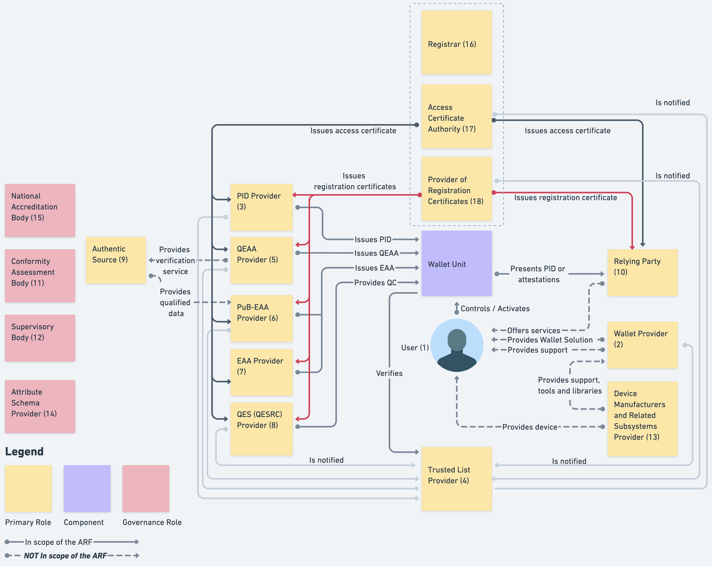
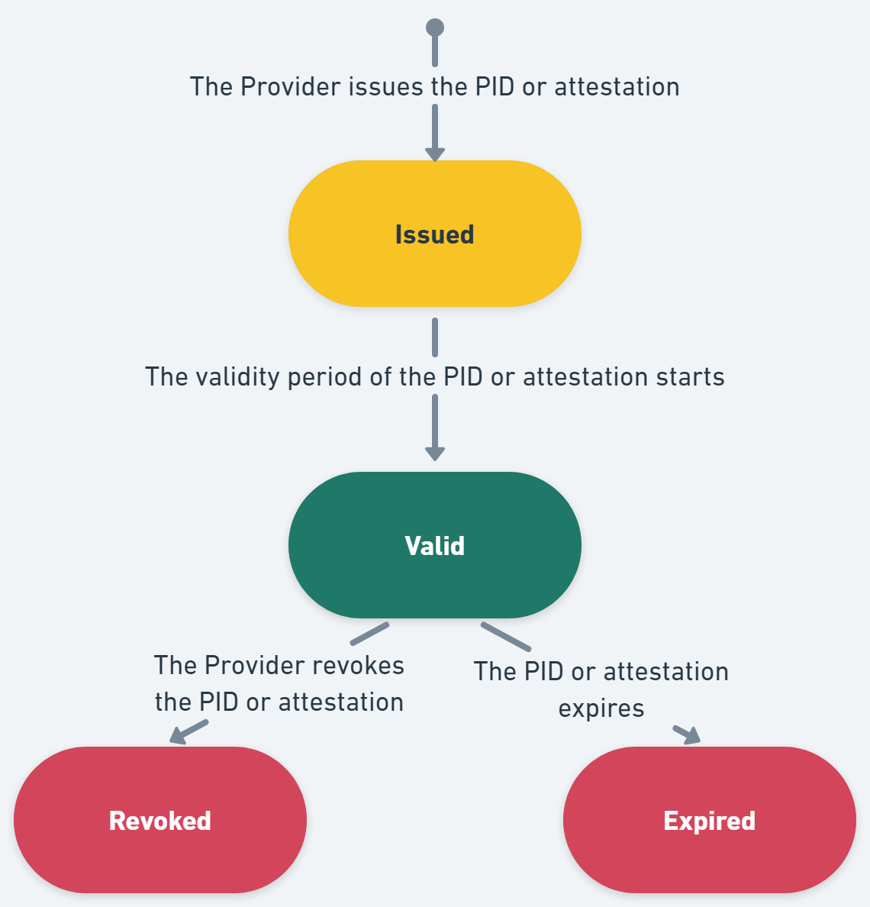
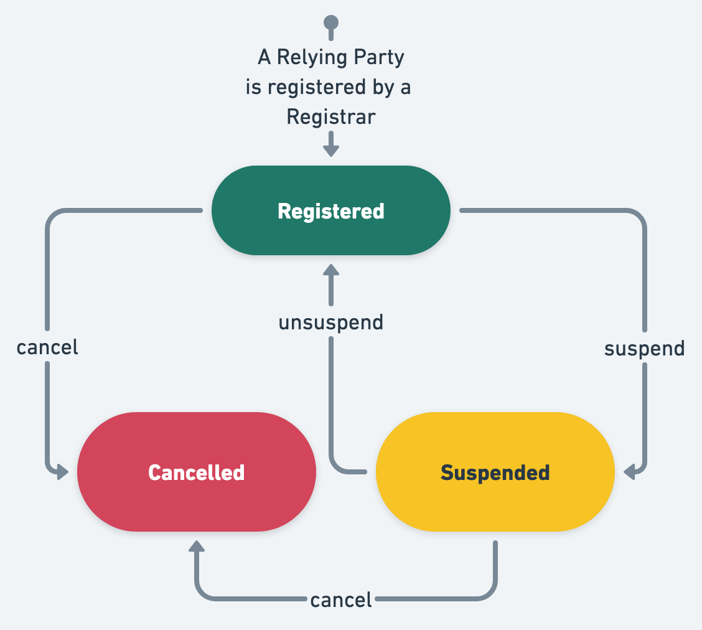

---
title: European Digital Identity Wallet
subtitle: Architecture and Reference Framework
...

# Architecture and Reference Framework

## 1 Introduction

### 1.1 Context

On 3 June 2021, the European Commission adopted a Recommendation ([COMMISSION
RECOMMENDATION (EU) 2021/946 of 3 June 2021 on a
[Common Union Toolbox](https://digital-strategy.ec.europa.eu/en/policies/eudi-wallet-toolbox)
for a coordinated approach towards a [European Digital Identity Framework](https://eur-lex.europa.eu/eli/reco/2021/946),
 [OJ L 210/51, 14.6.2021](https://eur-lex.europa.eu/legal-content/EN/TXT/HTML/?uri=OJ%3AL%3A2021%3A210%3AFULL))
calling on Member States to work closely together with the Commission towards
the development of a Toolbox including a technical Architecture and Reference
Framework (hereinafter the ARF), a set of common standards and technical
specifications and a set of common guidelines and best practices.

The Recommendation specifies that these outcomes will serve as a basis for the
implementation of the [European Digital Identity Regulation],
without the process of developing the Toolbox interfering with, or prejudging
the legislative process.

The Recommendation establishes a structured framework for cooperation between
Member States, the Commission, and, where relevant, private sector operators to
develop the Toolbox. The European Digital Identity Cooperation Group (EDICG),
formerly known as the eIDAS Expert Group, is responsible for:

- exchange best practices and cooperate with the Commission on emerging
policy initiatives in the field of digital identity wallets, electronic
identification means and trust services;
- advising the Commission in the preparation of draft implementing and delegated
acts;
- supporting Supervisory Bodies in the implementation of the [European Digital
Identity Regulation];
- organising peer reviews of electronic identification schemes;
- engaging with the Commission and other relevant stakeholders to develop a
[Common Union Toolbox](https://digital-strategy.ec.europa.eu/en/policies/eudi-wallet-toolbox);

The European Digital Identity Cooperation Group's page can be found [at the
official page](https://digital-strategy.ec.europa.eu/en/policies/european-digital-identity-cooperation-group).

The European Digital Identity Cooperation Group has since further developed the
concepts and specifications for the European Digital Identity Framework. The
current ARF version is based on the legal text adopted by the
co-legislators, including the adopted Commission Implementing Regulations:

- [CIR 2024/2977](https://eur-lex.europa.eu/legal-content/EN/TXT/?uri=CELEX:32024R2977)
regarding PID and EAA,
- [CIR 2024/2979](https://eur-lex.europa.eu/legal-content/EN/TXT/?uri=OJ:L_202402979)
regarding integrity and core functionalities,
- [CIR 2024/2980](https://eur-lex.europa.eu/legal-content/EN/TXT/?uri=OJ:L_202402980)
regarding ecosystem notifications,
- [CIR 2024/2981](https://eur-lex.europa.eu/legal-content/EN/TXT/?uri=OJ:L_202402981)
regarding certification of Wallet Solutions,
- [CIR 2024/2982](https://eur-lex.europa.eu/legal-content/EN/TXT/?uri=OJ:L_202402982)
regarding protocols and interfaces.

### 1.2 Purpose of this document

The purpose of this document is to explain the architecture of the EUDI Wallet
ecosystem and all of its components, as well as how these components will interact
to ensure the security of the ecosystem and the privacy of its Users. Also, it
serves as background information to allow a better understanding of the the
high-level requirements established in Annex 2.

Additionally, this document forms a reference to create uniform conditions for
the implementation of the [European Digital Identity Regulation] and to define
the technical specifications, standards and procedures that the Commission will
develop for the purpose of implementing this Regulation.

Finally, this document is used to develop the Wallet Solution [reference implementation](https://github.com/eu-digital-identity-wallet/.github/blob/main/profile/reference-implementation.md).

The document presents a state-of-play of ongoing work of the European Digital
Identity Cooperation Group and does not imply any formal agreement regarding its
content. This document will be complemented and updated over time through the
process of establishing the toolbox, as described in [Chapter 8](#8-document-development).

This document holds no legal value and does not prejudge the final mandatory
legal requirements for the EUDI Wallet ecosystem. Only the adopted [European
Digital Identity Regulation], and the implementing and delegated acts adopted
under that Regulation, are mandatory. This document serves as a foundation for
regularly updating the implementing acts, ensuring alignment with technological
and standards developments.

### 1.3 Relation to the Large-Scale Pilots (LSP)

To support the development of a reference implementation of a Wallet Solution
and to pilot its usage across different priority use cases, the Commission
launched a call for proposals on 22 February 2022 under the Digital Europe
Programme to pilot use cases for the EUDI Wallet ecosystem at a large scale.

The objective of the Large-Scale Pilots (LSP) call is to support the piloting of
the EUDI Wallet ecosystem around a range of use cases involving both public and
private sector stakeholders. The LSPs will test the EUDI Wallet ecosystem in
both national and cross-borders contexts and integrate with the iterative
development of the reference application.

The works of the LSPs will be aligned with the ARF, which will guide pilot
system design and architecture development together with the release of the
reference implementation.

The LSPs are expected to provide feedback on the ARF as they develop and
interact with Relying Party services, Qualified or non-qualified Electronic
Attestations of Attributes (Q)EAA Providers, Person Identification Data (PID)
Providers, Qualified and non-qualified Trust Service Providers and Users in
meaningful interactions under the proposed use cases.

### 1.4 Definitions

The definitions used in this document can be found in Annex 1 of this document.

### 1.5 Scope

The **EUDI Wallet Architecture and Reference Framework (ARF)** document defines
the structural and functional aspects of the EUDI Wallet ecosystem, detailing
its key components and their interactions. It provides a technical foundation to
ensure **interoperability, security, and privacy**, aligning with the high-level
requirements specified in **Annex 2**. The ARF serves as a reference for the
**harmonised implementation of the [European Digital Identity Regulation]**,
guiding the development of **technical specifications, standards, and operational
procedures**.

This document **only applies to EUDI Wallet ecosystems compliant with the
[European Digital Identity Regulation]**, ensuring consistency in architecture
and implementation. It is designed to support the development of the Wallet
Solution reference implementation while remaining adaptable to technological and
regulatory advancements.

### 1.6 Change log

In this version of the ARF,

- relevant text from the [Discussion Paper for Topic D](./discussion-topics/d-embedded-disclosure-policies.md)
(Embedded disclosure policies) was included in [Sections 6.6.2.7](#6627-provisioning-embedded-disclosure-policies)
and [6.6.3.4](#6634-wallet-unit-evaluates-embedded-disclosure-policy-if-present). The High-Level Requirements introduced in this discussion paper were included in Annex 2 in [Topic 43](./annexes/annex-2/annex-2-high-level-requirements.md#a2343-topic-43---embedded-disclosure-policies).
- relevant text from the [Discussion Paper for Topic C](./discussion-topics/c-wallet-unit-attestation.md)
(Wallet Unit Attestation) was included in [Section 6.5.3.4](#6534-wallet-provider-issues-one-or-more-wallet-unit-attestations-to-the-wallet-unit), as well as other sections. However, only limited changes were made. The High-Level Requirements introduced and changed in this discussion paper were included in Annex 2 in [Topic 9](./annexes/annex-2/annex-2-high-level-requirements.md#a239-topic-9---wallet-unit-attestation). Other High-Level Requirements that used to be in Topic 9 were moved elsewhere, mainly to [Topic 40](./annexes/annex-2/annex-2-high-level-requirements.md#a2340-topic-40---wallet-instance-installation-and-wallet-unit-activation-and-management).
- relevant text from the [Discussion Paper for Topic G](./discussion-topics/g-zero-knowledge-proof.md) (Zero-Knowledge Proofs) was included in [Section 7.4.3.5.3](#74353-zero-knowledge-proofs). The High-Level Requirements introduced in this discussion paper were included in Annex 2 in [Topic 53](./annexes/annex-2/annex-2-high-level-requirements.md#a2353-topic-53-zero-knowledge-proofs).
- relevant text from the [Discussion Paper for Topic V](./discussion-topics/v-pid-rulebook.md) (PID Rulebook) was included in [Section 5.4](#54-standardised-attestation-formats). Furthermore, high-level requirements and a specification of the encoding and format of [SD-JTW VC]-based PIDs were added to the [PID Rulebook](./annexes/annex-3/annex-3.01-pid-rulebook.md).

Apart from these changes, a limited number of editorial mistakes were corrected.

### 1.7 Additional topics

In this version of the ARF, several key areas still require further
exploration and refinement. These topics will be discussed in collaboration with
Member States, the European Digital Identity Cooperation Group, civil society,
industry representatives, and professionals, ensuring comprehensive feedback
from all relevant stakeholders. The outcomes of these discussions will be
incorporated into future versions of this ARF. The document will be iteratively
updated to improve its content and address emerging topics, with the process for
providing feedback and details on how updates will be managed outlined in
[Chapter 8](#8-document-development).

Among the areas identified for further discussion are:

- Relying Party registration.

Other topics that will be developed include:

- transaction logs maintained by the Wallet Unit,
- scenarios involving a natural person representing another natural person,
- Wallet-to-Wallet interactions,
- combined presentations of attestations,
- User requests for data deletion by Relying Parties,
- mechanisms for Users to report unlawful or suspicious data requests to data
protection authorities (DPAs),
- data portability.

Further discussions will explore the following topics:

- the development of catalogues for attestations,
- secure cryptographic interfaces between the Wallet Instance and the WSCA,
- User interfaces with Wallet Instances,
- authentication mechanisms for Users to access their devices,
- certificate transparency,
- support and maintenance responsibilities of Wallet Providers,
- the EUDI Wallet Trust Mark,
- transactional data needed by Wallet Units in payments and other use cases.

A detailed list of these topics and the progress of their development is
available on [GitHub](https://github.com/orgs/eu-digital-identity-wallet/projects/36).

## 2 EUDI Wallet functionalities

### 2.1 Introduction

The EUDI Wallet ecosystem is designed as a secure, User-controlled digital
environment that enables Users to use their Wallet Unit to manage and present
their person identification data (PID) and attestations across both public and
private services in the EU. Its functionalities are built around security,
privacy, and User control, ensuring seamless interactions with Relying Parties
and other entities, while adhering to data
protection principles.

This chapter outlines the core functionalities of Wallet Solutions, as defined
by the [European Digital Identity Regulation], and examines how the requirements
for its implementation align with real-world use cases where Users will use
their Wallet Unit.

The functionalities of a Wallet Unit can be grouped into the following
categories:

- **Secure identification and authentication**, ensuring that Users can present
person identification data in a trusted environment.
- **Exchanging qualified and non-qualified User attributes** through secure and
verifiable electronic attestations of attributes.
- **Electronic signing of documents or data**, allowing Users to create
legally recognised qualified electronic signatures and seals.
- **Generate and use pseudonyms** for authentication, to enhance privacy and
prevent tracking.

These functionalities are discussed in the next four sections.

### 2.2 Identification and authentication

Using their Wallet Units, Users are able to:

- **Identify and authenticate** to online and offline services, while using
**selective disclosure** of attributes as well as **User approval**. This
*ensures that only necessary and User-approved attributes are presented to
*Relying Parties, which minimises exposure of personal information.
- **Securely authenticate Relying Parties or other Wallet Units**, making sure
that attributes are only presented to trusted entities.
- **Onboard seamlessly with PID Providers or attestation Providers** by
leveraging existing electronic identification schemes, for a smooth and secure
registration process.
- **Be informed** whether a Relying Party is authorised or registered to receive
the requested attributes.
- **Access a transaction log via a dashboard**, allowing Users to:  
    - **Review past interactions** with Relying Parties and Wallet Units.  
    - **Request data erasure** under the GDPR Article 17 to maintain privacy.  
    - **Report suspicious Relying Parties** to the relevant national data
    protection authority.

### 2.3 Attribute exchange mechanism using attestations

Using their Wallet Units, Users are able to:

- **Request, store, and present** personal identification data and electronic
attestations of attributes under their sole
control, ensuring secure usage in both online and offline scenarios.
- **Backup a list of their attributes, attestations, and configurations**,
guaranteeing compliance with data portability rights.
- **Prevent tracking by Relying Parties** when using attestations,
ensuring privacy-preserving interactions.

### 2.4 Qualified electronic signatures

Using their Wallet Units, Users are able to:

- **Create qualified electronic signatures and seals** for legally binding
digital transactions.
- **Sign documents using qualified electronic signatures**, which are provided
by default and free of charge within the Wallet Unit, ensuring universal
accessibility and compliance with legal standards.

These functionalities are implemented by using the authentication and signing
capabilities of the Wallet Unit as a part of a local QSCD, or a remote QSCD
managed by a QTSP. See [Topic 16](./annexes/annex-2/annex-2-high-level-requirements.md#a2316-topic-16---signing-documents-with-a-wallet-unit)
and [Topic 37](./annexes/annex-2/annex-2-high-level-requirements.md#a2337-topic-37---qes----remote-signing---technical-requirements).

### 2.5 Pseudonyms

Pseudonyms can be used to authenticate a User when it is not necessary for a
Relying Party to learn the identity of the User. As specified in [CIR
2024/2979], [W3C WebAuthn] defines the technical specification for pseudonyms.
Passkeys are a widely used type of credential which are created and asserted
using the WebAuthn API. [Section 4.7](#47-pseudonyms) gives more information on
the architecture and message flows of Passkeys.

A User uses a pseudonym when they wish to create an account at a Relying Party
without identifying themselves. The Relying Party associates the pseudonym with
the account, such that it can be used for subsequent authentication in later
interactions with that Relying Party. The User may additionally present
attributes from a PID or attestation to the Relying Party, either during
registration of the pseudonym or at a later interaction.

See also [Topic 11](./annexes/annex-2/annex-2-high-level-requirements.md#a2311-topic-11---pseudonyms)
and the [Discussion Paper on Topic E](./discussion-topics/e-pseudonyms-including-user-authentication-mechanism.md).

### 2.6 The role of use cases in the development of the Architecture and Reference Framework

#### 2.6.1 Overview

The development of the Architecture and Reference Framework (ARF) is strategically
driven by real-world use cases, ensuring that the User experience, value
proposition, and requirements of the EUDI Wallet ecosystem are
effectively addressed. To achieve this, the European Digital Identity
Cooperation Group initially created service blueprints for each use case, which
detail service touch points, components, and processes.

These blueprints serve a dual purpose: they play a crucial role in service
design, enhancing both User experience and operational efficiency, while also
identifying areas for improvement. As a foundational element, these blueprints
shape the development of common specifications, providing comprehensive yet
flexible solutions that can accommodate alternative approaches and optional
steps.

It is important to note that User journeys may vary based on the specific
implementation approach, influencing aspects such as data retrieval and User
approval processes. The Annexes contain detailed descriptions of these
blueprints, ensuring transparency and adaptability.

The European Digital Identity Cooperation Group has outlined service blueprints
for the following key use cases:

- Identification and authentication to access online services, see [Section 2.6.2](#262-identification-and-authentication-to-access-online-services),
- Qualified Electronic Signature, see [Section 2.4](#24-qualified-electronic-signatures),
- Mobile Driving Licence, see [Section 2.6.3](#263-mobile-driving-licence),
- Additional use cases that will be introduced in the future, see [Section 2.6.4](#264-other-use-cases).

These blueprints, along with all relevant information on use cases
implementation, will be compiled in a standardised format within a dedicated
document titled the "Use Cases Manual", and distributed together with this document.

#### 2.6.2 Identification and authentication to access online services

The EUDI Wallet ecosystem is primarily designed to facilitate secure User
identification and authentication at Level of Assurance (LoA) high for various
online services, both public and private. This capability is crucial, as it
allows Relying Parties to confidently verify the identity of Users they interact
with.

In this use case, a user utilises their Wallet Unit to present specific
attributes to a Relying Party in order to access online services. Before doing
so, the Wallet Unit first authenticates the user. The user is particularly
mindful of the privacy and security implications of sharing data when accessing
online services. Their primary objective is to securely and reliably access
online services that require authentication while maintaining full control over
how their personal data is presented and shared.

#### 2.6.3 Mobile Driving Licence

A significant use case for the Wallet Unit involves allowing Users to request,
store, and present a mobile Driving Licence (mDL) as an attestation in their
Wallet Unit, allowing them mainly to prove their driving privileges. In this use
case, the User employs a Wallet Unit to present an mDL to a Relying Party, for
instance a police officer.

The use case description concentrates on proximity supervised and unsupervised
flows, which involve scenarios where the User is physically near a Relying
Party, and the mDL attribute exchange occurs using proximity technologies (e.g.,
NFC, Bluetooth). The two proximity flows have one significant difference: in the
supervised flow, the Wallet Unit presents mDL attributes to a human Relying
Party or under their supervision, whereas in the unsupervised flow, the Wallet
Unit presents mDL attributes to a machine without human oversight.

In addition, like any other attestation type, an mDL can be presented online,
over the internet.

#### 2.6.4 Other use cases

##### 2.6.4.1 Health data

Easy access to health data is crucial in both national and cross-border
contexts. A Wallet Unit may enable access to patient summary, ePrescriptions,
etc.

##### 2.6.4.2 Educational attestations and professional qualifications

Providing credentials for qualification recognition procedures can be costly and
time-consuming for Users, Relying Parties (such as companies and employers), and
Attestation Providers (such as education and training providers or academic
institutions). A Wallet Unit may be a repository for educational credentials and
a means for presenting them by the User to relevant Relying Parties.

##### 2.6.4.3 Digital finance

A Wallet Unit may facilitate complying with strong customer authentication
requirements, using the user authentication capabilities described in
[Section 2.6.2](#262-identification-and-authentication-to-access-online-services).
In line with the Commission's Retail Payments Strategy, this use case would be
developed in close coordination with Member States' advisory groups on retail
payments and the finance industry.

##### 2.6.4.4 Digital Travel Credential

Digital Travel Credential (DTC) Providers may issue DTCs to Wallet Units in a
supported format, to enable Relying Parties to identify Users, thus facilitating
a smooth travel experience and User journey. Relying Parties for a DTC may
include governments, transportation providers, hospitality agents, or any other
actors operating in a regulated environment which requires the use of a DTC.

##### 2.6.4.5 Social Security

Documents related to social security are important for many EU citizens to prove
their rights and obligations under social security legislation in the EU.
Examples include:

- **Portable Document (“PDA1”)** This is a statement of applicable legislation
which is useful to prove that a person pays social contributions in another EU
country, for example if they are a posted worker or work in several countries at
the same time.
- **Electronic Health Insurance Card ("EHIC")** This is a free card that provides
every citizen with access to medically necessary government-provided healthcare
during a temporary stay in one of the 27 EU countries, Iceland, Liechtenstein,
Norway, and Switzerland, under the same conditions and at the same cost (free in
some countries) as persons insured in that country. This includes, for example,
services related to chronic or existing illnesses, as well as in connection with
pregnancy and childbirth.

## 3. EUDI Wallet ecosystem

### 3.1 Introduction

This chapter describes the EUDI Wallet ecosystem as it is foreseen in the [European
Digital Identity Regulation]. The different roles in the EUDI Wallet ecosystem
are described in Figure 1 and detailed in the following sections.

*Figure 1: Overview of the EUDI Wallet ecosystem roles*

1. Users of Wallet Units, see [Section 3.2](#32-users-of-wallet-units),
2. Wallet Providers, see [Section 3.3](#33-wallet-providers),
3. Person Identification Data (PID) Providers, see [Section 3.4](#34-person-identification-data-pid-providers),
4. Trusted List Providers, see [Section 3.5](#35-trusted-list-provider),
5. Qualified Electronic Attestation of Attributes (QEAA) Providers,
see [Section 3.6](#36-qualified-electronic-attestation-of-attributes-qeaa-providers),
6. Electronic Attestation of Attributes issued by or on behalf of a public
sector body responsible for an authentic source (PuB-EAA) Providers, see
[Section 3.7](#37-eaa-issued-by-or-on-behalf-of-a-public-sector-body-responsible-for-an-authentic-source-pub-eaa-providers),
7. Electronic Attestation of Attributes (EAA) Providers, see [Section 3.8](#38-non-qualified-electronic-attestation-of-attributes-eaa-providers),
8. Qualified Electronic Signature Remote Creation Providers, see [Section 3.9](#39-qualified-electronic-signature-remote-creation-qesrc-providers),
9. Authentic Sources, see [Section 3.10](#310-authentic-sources),
10. Relying Parties, see [Section 3.11](#311-relying-parties-and-intermediaries),
11. Conformity Assessment Bodies (CAB), see [Section 3.12](#312-conformity-assessment-bodies-cab),
12. Supervisory Bodies, see [Section 3.13](#313-supervisory-bodies),
13. Device Manufacturers and Related Subsystems Providers, see [Section 3.14](#314-device-manufacturers-and-related-subsystems-providers),
14. Attribute Schema Providers, see [Section 3.15](#315-attribute-schema-providers-for-qeaa-pub-eaa-and-eaa),
15. National Accreditation Bodies, see [Section 3.16](#316-national-accreditation-bodies),
16. Access Certificate Authorities, see [Section 3.17](#317-access-certificate-authorities).

### 3.2 Users of Wallet Units

Users of Wallet Units use the Wallet Unit to receive, store, and present PID,
QEAA, PuB-EAA, or non-qualified EAA to Relying Parties. Users can also create
qualified electronic signatures and seals (QES) and create and present
pseudonyms.

[CIR 2024/2982](https://eur-lex.europa.eu/legal-content/EN/TXT/?uri=OJ:L_202402982)
(among others) defines 'wallet user' as 'a user who is in control of the wallet
unit'. Being in control of the Wallet Unit implies being able to present a PID
or attestation to a Relying Party. Within the use cases described in the current
version of the ARF, the User is the subject of the PID(s) in the Wallet Unit.
The User is also the subject of most of the attestations in the Wallet Unit, but
there could be attestations that have no subject, such as vouchers, or that
relate to objects owned or used by the User, such as a vehicle registration card.

Please note that this ARF assumes that a User device is a personal device, meaning that the User will not share it with other people, and that only the User can access and control the Wallet Unit.

Next versions of the ARF may include use cases for representation and
delegation, for example a parent representing their children or a CEO having the
right to sign contracts on behalf of their company. Conceivably, such use cases
may lead to situations where a Wallet Unit holds the natural-person PIDs of
multiple persons, or holds one or more legal-person PIDs in addition to a
natural-person PID. However, other solutions are possible as well. The topics of
representation and delegation will be further discussed with Member States in
the future.

The use of a Wallet Unit by citizens is not mandatory under the [European
Digital Identity Regulation]. However, each Member State will provide at least
one European Digital Identity Wallet within 24 months after the entry into force
of the implementing acts referred to in the [European Digital Identity
Regulation].

### 3.3 Wallet Providers

Wallet Providers are Member States or organisations either mandated or
recognised by Member States making a Wallet Solution available to Users. All
Wallet Solutions must be certified as described in [Chapter 7](#7-certification-and-risk-management).

A Wallet Provider makes a combination of several products and Trust Services
available to a User, which give the User sole control over the use of their
Person Identification Data (PID) and Electronic Attestations of Attributes
(QEAA, PuB-EAA or EAA), and any other personal data within their Wallet Unit.
This also implies guaranteeing a User sole control over sensitive cryptographic
material (e.g., private keys) related to their Wallet Unit.

Wallet Providers are responsible for ensuring compliance with the requirements
for Wallet Solutions.

From the viewpoint of the other actors in the EUDI Wallet ecosystem, the Wallet
Provider is responsible for all components of the Wallet Unit. These components
are described in [Section 4.3.2](#432-components-of-a-wallet-unit). In
particular, the Wallet Provider is responsible for ensuring that the Wallet
Instance can access a Wallet Secure Cryptographic Device (WSCD) that has a level
of security sufficient to ensure that the Wallet Unit can achieve Level of
Assurance "high", as required in the [European Digital Identity Regulation].
This is true even if the WSCD is not delivered by the Wallet Provider but
is integrated into the User device.
For more information, see [Section 4.5](#45-wscd-architecture-types). Other actors
in the ecosystem do not need to interact with or explicitly trust a WSCD
supplier. As explained in [Section 6.5.3](#653-wallet-unit-activation), Wallet
Providers provide Wallet Unit Attestations (WUA) to the Wallet Unit. The WUA
attests that the Wallet Unit and all of its components, including the WSCD,
comply with the relevant requirements.

### 3.4 Person Identification Data (PID) Providers

PID Providers are trusted entities responsible for:

- verifying the identity of the User in compliance with LoA high requirements,
- issuing a PID to the Wallet Unit, and
- making available, in a privacy-preserving way, information for Relying Parties
to verify the validity of the PID.

The terms and conditions of these services are for each Member State to determine.

PID Providers may be the same organisations that today issue official identity
documents, electronic identity means, etc. PID Providers may be the same
organisations as Wallet Providers. In case an organisation acts as both a PID
Provider and a Wallet Provider, it complies with all requirements for both PID
Providers and Wallet Providers.

### 3.5 Trusted List Provider

A Trusted List Provider (TLP) is a body responsible for maintaining, managing,
and publishing a Trusted List. In compliance with [Article 22](https://eur-lex.europa.eu/legal-content/EN/TXT/?uri=uriserv%3AOJ.L_.2014.257.01.0073.01.ENG#d1e2162-73-1)
of the [European Digital Identity Regulation], a Trusted List Provider is
appointed by a Member State and notified to the Commission. Within the EUDI
Wallet ecosystem, Trusted Lists exist for the following entities:

- Wallet Providers,
- PID Providers,
- QEAA Providers,
- PuB-EAA Providers,
- Access Certificate Authorities,
- Qualified Electronic Signature Remote Creation (QESRC) Providers.

Note: Trusted Lists and Trusted List Providers may also exist for non-qualified
EAA Providers, but this is out of scope of the ARF.

These Trusted Lists are described in more detail in [Sections 6.2.2](#622-wallet-provider-registration-and-notification),
[6.3.2](#632-pid-provider-or-attestation-provider-registration-and-notification)
and [6.4.2](#642-relying-party-registration). Some
Trusted Lists contain the trust anchors of the relevant entities. A trust anchor
is a combination of a public key and the identifier of the associated entity and
may be used to verify signatures created by that entity.

An entity's status as a trusted entity can be verified by checking whether they
are present on the relevant Trusted List. Trusted List Providers provide a
registration service for the relevant entities. The terms and conditions for
entities to become registered are for each Trusted List Provider to determine,
in compliance with Article 22 of the [European Digital Identity Regulation].

For more information, please refer to [Topic 27](./annexes/annex-2/annex-2-high-level-requirements.md#a2327-topic-27---registration-of-pid-providers-providers-of-qeaas-pub-eaas-and-non-qualified-eaas-and-relying-parties)
and to [Topic 31](./annexes/annex-2/annex-2-high-level-requirements.md#a2331-topic-31---pid-provider-wallet-provider-attestation-provider-and-access-certificate-authority-notification-and-publication).

### 3.6 Qualified Electronic Attestation of Attributes (QEAA) Providers

Qualified EAAs are provided by Qualified Trust Service Providers (QTSPs). The
general trust framework for QTSPs (see Chapter III, Section 3 of the [European
Digital Identity Regulation] applies also to QEAA Providers, but specific rules
for the Trust Service of issuing QEAAs may be defined as well.

QEAA Providers maintain an interface to Wallet Units to provide QEAAs upon
request. Potentially, they also maintain an
interface towards Authentic Sources to verify attributes, as specified in
[Topic 42](./annexes/annex-2/annex-2-high-level-requirements.md#a2342-topic-42---requirements-for-qtsps-to-access-authentic-sources).

It is likely that for most QEAAs, a QEAA Provider will need to verify the
identity of a User when issuing a QEAA. It is up to each QEAA Provider to
implement the necessary User authentication processes, in compliance with all
applicable national and Union legislation. Note that, when User identity
verification is necessary, it is likely that the User requesting a QEAA already
possesses a PID. This would enable the QEAA Provider to carry out User
identification and authentication at LoA high, by requesting and verifying
User attributes from the PID in the Wallet Unit.

The terms and conditions of these services are for each QEAA Provider to
determine, beyond what is specified in the [European Digital Identity Regulation].

### 3.7 EAA issued by or on behalf of a public sector body responsible for an authentic source (PuB-EAA) Providers

As specified in the [European Digital Identity Regulation], an attestation may
be issued by or on behalf of a public sector body responsible for an Authentic
Source. This ARF calls such an attestation a PuB-EAA. For a description of
Authentic Sources, see [Section 3.10](#310-authentic-sources). A public sector
body primarily is a state, regional or local authority, or a body governed by
public law.

A PuB-EAA Provider, meaning a public sector body issuing PuB-EAAs, is not a
QTSP. However, a PuB-EAA Provider has a qualified certificate, issued by a QTSP,
that allows it to sign PuB-EAAs. A Relying Party verifies a PuB-EAA by first
verifying the signature over the PuB-EAA, and subsequently verifying the
signature of the qualified PuB-EAA Provider certificate. For more details, refer
to [Section 6.6.3.6](#6636-relying-party-instance-verifies-the-authenticity-of-the-pid-or-attestation).
The [European Digital Identity Regulation] stipulates that PuB-EAAs, like QEAAs,
have the same legal effect as attestations in paper form. It is up to the Member
States to define terms and conditions for the provisioning of PuB-EAAs, but
PuB-EAA Providers will comply with the same technical specifications and
standards as Providers of PIDs and other attestations.

For the precise and legally binding definitions and obligations regarding the
issuance of PuB-EAAs, please refer to the [European Digital Identity Regulation].

### 3.8 Non-Qualified Electronic Attestation of Attributes (EAA) Providers

Non-qualified EAAs can be provided by any (non-qualified) Trust Service
Provider. While they will be supervised under the [European Digital Identity
Regulation], it can be assumed that other legal or contractual frameworks will
mostly govern the rules for provision, use and recognition of EAAs. Those other
frameworks may cover policy areas such as educational credentials, digital
payments, although they may also rely on Qualified Electronic Attestation of
Attributes Providers. For non-qualified EAAs to be used, EAA Providers offer
Users a way to request and obtain these EAAs. This implies that these
non-qualified EAA Providers comply with the Wallet Unit interface
specifications. The terms and conditions of issuing EAAs and related services
are subject to sectoral rules.

### 3.9 Qualified Electronic Signature Remote Creation (QESRC) Providers

The Wallet Unit will allow the User to create qualified electronic signatures or
seals over any data. This will also enhance the use of the Wallet Unit for
signing, in a natural and convenient way. The creation of a qualified electronic
signature or seal by means of the Wallet Unit can be achieved in several ways:

- the Wallet Unit itself could be certified as a qualified signature or seal
creation device (QSCD), or
- the Wallet Unit could implement secure authentication into an electronic
signature or electronic seal invocation capability, as part of a local QSCD or
a remote QSCD managed by a QTSP.

As part of the ecosystem, the use of common interfaces and protocols for
provisioning qualified electronic signatures and seals will create a unified
European market for QTSPs offering remote signature services. European citizens
will be able to choose any QTSP, without worrying about technical
interoperability, and this will enhance competition.

Besides providers of qualified electronic signatures and seals, also providers
of non-qualified electronic signatures or seals may exist. However, such
providers are out of scope of this ARF.

### 3.10 Authentic Sources

Authentic Sources are public or private repositories or systems, recognised or
required by law, containing attributes about natural or legal persons. Authentic
Sources are sources for attributes on, for instance, address, age, gender, civil
status, family composition, nationality, education and training qualifications
titles and licences, professional qualifications titles and licences, public
permits and licences, or financial and company data.

Authentic Sources are required to provide an interface to QEAA Providers to
verify the authenticity of the above attributes, either directly or via
designated intermediaries recognised at national level. Authentic Sources may
act as PuB-EAA Providers if they meet the requirements of the [European Digital Identity]
Regulation, see [Section 3.7](#37-eaa-issued-by-or-on-behalf-of-a-public-sector-body-responsible-for-an-authentic-source-pub-eaa-providers).
In Figure 1 this is indicated by the arrow 'provides qualified data'.

### 3.11 Relying Parties and intermediaries

Relying Parties are natural or legal persons that rely upon an electronic
identification scheme or on a Trust Service. They request attributes contained
within a PID, QEAA, PuB-EAA or EAA from the Wallet Unit, subject to the approval
of the User and within the limits of applicable legislation and rules.

The reason for reliance on the Wallet Unit may be a legal requirement, a
contractual agreement, or their own decision. In particular, the [European
Digital Identity Regulation] requires that providers of very large online
platforms must accept the EUDI Wallet for their user authentication processes.

Relying Parties maintain an interface with Wallet Units to request PIDs and
attestations, using Relying Party authentication, as described in [Section 6.6.3.2](#6632-wallet-unit-authenticates-the-relying-party-instance).
If a Wallet Unit presents attributes from a PID or attestation to a Relying Party,
the Relying Party can verify the authenticity of these attributes.

To rely on Wallet Units for the purpose of providing a service, Relying Parties
inform the Member State where they are established about their intention for
doing so, and register the attributes that they intend to request. See [Section 6.4.2](#642-relying-party-registration)
for more information on Relying Party registration. During a transaction, a
Wallet Unit will verify that the Relying Party only requests attributes that it
registered. It will warn the User if this is not the case.
This is explained in [Section 6.6.3.3](#6633-wallet-unit-allows-user-to-verify-that-relying-party-does-not-request-more-attributes-than-it-registered).

In addition, an Attestation Provider may embed a disclosure policy in an
attestation. Such a policy indicates to which Relying Parties a Wallet Unit
should (or should not) present specific attributes from that attestation. During
a transaction, the Wallet Unit evaluates the policy based on data provided by
the Relying Party, and warns the User if the outcome of that evaluation is
negative. Please refer to [Section 6.6.3.4](#6634-wallet-unit-evaluates-embedded-disclosure-policy-if-present)
for more information.

So-called intermediaries form a special class of Relying Party. Article 5b (10)
of the [European Digital Identity Regulation] states "Intermediaries acting on
behalf of relying parties shall be deemed to be relying parties and shall not
store data about the content of the transaction.". Such an intermediary is a
party that offers services to Relying Parties to, on their behalf, connect to
Wallet Units and request the User attributes that these Relying Parties need.
The intermediary then sends the presented attributes to the 'end' Relying Party.
This implies that an intermediary performs all tasks assigned to a Relying Party
in this ARF on behalf of the 'end' Relying Party. In particular:

1. The intermediary registers once as a Relying Party and obtains an access
certificate (see [Section 6.6.3.2](#6632-wallet-unit-authenticates-the-relying-party-instance))
bearing its own name and Relying Party identifier. This access certificate is not
different from an access certificate issued to a 'normal' Relying Party, since
an intermediary is, as a matter of legal fact, a Relying Party.
2. Next, the intermediary will separately register each of the 'end' Relying
Parties that uses its services, including registering the attributes the 'end'
Relying Party wants to request. The intermediary obtains a registration
certificate (see [Section 6.6.3.3](#6633-wallet-unit-allows-user-to-verify-that-relying-party-does-not-request-more-attributes-than-it-registered))
showing the name of the 'end' Relying Party. The Registrar verify, in a manner
to be decided by a Member State, that the 'end' Relying Party is indeed using
the services of the intermediary. If all is correct, the Registrar will issue a
registration certificate containing an additional attribute stating that the
'end' Relying Party is using the services of the intermediary.
3. When asked by an 'end' Relying Party, the intermediary will request the
presentation of attributes from Wallet Units, using one or more of the flows
described in [Section 4.4](#44-data-presentation-flows). For this, the
intermediary will use their own access certificate (point 1. above) and the
registration certificate of the 'end' Relying Party (point 2. above).
4. If a Wallet Unit, during a transaction, receives a registration certificate
indicating that the Relying Party uses the services of an intermediary, it
verifies that the name and the identifier of the intermediary in the
registration certificate are identical to the name and identifier in the access
certificate. If this verification fails, the Wallet Unit treats this as a
Relying Party authentication failure. If this verification succeeds, the Wallet
Unit displays to the User the name of the intermediary when asking for User
approval to present the requested attributes.
5. When a Wallet Unit presents a PID or attestation to the intermediary, the
intermediary verifies the authenticity of the PID or attestation, its revocation
status, device binding, and User binding, as well as any combined presentation
of attributes, if applicable, if it has agreed to do so with the Relying Party.
Also, the intermediary may need to verify the authenticity of the Wallet Unit
and its revocation status. (Note that a Relying Party is not obliged to carry
out all of these verifications. Therefore, the intermediary and any Relying
Party using its services must agree on what verifications the intermediary will
carry out.)
6. If these verifications are successful, the intermediary forwards the User
attributes it obtained from the Wallet Unit to the 'end' Relying Party. There
must be an interface between an intermediary and a Relying Party, over which the
'end' Relying Party can request the intermediary to request some User attributes
from a Wallet Unit and that the intermediary uses to send back the attribute
values presented by the Wallet Unit. However, specifying this interface or the
(security) requirements with which it needs to comply, is out of scope of the
ARF. In particular, it is not required that the User attributes are end-to-end
encrypted between the Wallet Unit and the 'end' Relying Party, such that an
intermediary would not be able to see them.
7. The intermediary deletes any PIDs, attestations, or WUAs it obtained from the
Wallet Unit, including any User attributes, immediately after it has sent the
User attributes to the Relying Party. If the intermediary does not send any User
attributes to the Relying Party, for example because one of the verifications in
the previous step failed, the intermediary deletes the PIDs, attestations, or
WUAs immediately after it has completed all necessary verifications.

Note that this approach implies that an intermediary (if it is acting only as an
intermediary, and never as an 'end' Relying Party in its own right) will not
need a registration certificate. Conversely, an 'end' Relying Party using the
services of an intermediary will not need an access certificate.

As discussed in [Section 6.6.3.5](#6635-wallet-unit-obtains-user-approval-for-presenting-selected-attributes),
during a transaction, a Wallet Unit requests the User for their approval to
present any User attributes to the Relying Party. In this process, the Wallet
Unit informs the User about the authenticated identity of the intermediary (from
the access certificate), and also about the identity of the 'end' Relying Party
and the fact that this Relying Party is using the services of the intermediary
(from the registration certificate).

For high-level requirements on this topic, see [Topic 52](./annexes/annex-2/annex-2-high-level-requirements.md#a2352-topic-52-relying-party-intermediaries).

### 3.12 Conformity Assessment Bodies (CAB)

Conformity Assessment Bodies (CAB) are public or private bodies that are
accredited by a national accreditation body, which itself is designated by
Member States according to [Regulation 765/2008](https://eur-lex.europa.eu/legal-content/EN/TXT/?uri=celex:32008R0765)
Article 6c (3). In particular, CABs are accredited to carry out assessments on
which Member States will rely before issuing a Wallet Solution or providing the
'qualified' status to a Trust Service Provider.

Wallet Solutions will be certified by CABs. QTSPs will be audited regularly by CABs.

The standards and schemes used by CABs to fulfil their tasks to certify Wallet
Solutions are discussed in [Chapter 7](#7-certification-and-risk-management).

### 3.13 Supervisory Bodies

Supervisory Bodies review the proper functioning of Wallet Providers and other
actors in the EUDI Wallet ecosystem. Supervisory Bodies will be created and
appointed by the Member States. The Supervisory Bodies will be notified to the
Commission by the Member States.

### 3.14 Device Manufacturers and Related Subsystems Providers

In the EUDI Wallet ecosystem, commercial actors such as device manufacturers and
related subsystems providers fulfil an important role to enable a Wallet Unit to
work smoothly and securely. Device manufacturers and related subsystem providers
provide a platform on which a Wallet Unit can be built. Wallet Providers ensure
that their Wallet Units use that platform to ensure usability, security,
stability and connectivity. The components provided by device manufacturers and
providers of related subsystems may include, among others, hardware, operating
systems, secure cryptographic hardware, libraries, and app stores.

### 3.15 Attribute Schema Providers for QEAA, PuB-EAA and EAA

Attribute Schema Providers publish attribute schemas describing the structure
of QEAAs, PuB-EAAs and EAAs, including the identifier, semantics, and encoding
of all attributes. These attribute schemas are published in Attestation
Rulebooks, see [Section 5.5](#55-attestation-rulebooks). For PIDs and mDLs, the
applicable Rulebooks are published by the Commission.

A catalogue of published Attestation Rulebooks will enable other entities such
as Relying Parties to discover which attestations exist within the EUDI Wallet
ecosystem, and how attributes from these attestations can be requested and
validated. The Commission sets out the technical specifications, standards, and
procedures for this purpose. Common schemas, including by sector-specific
organisations, are critical for widespread adoption of attestations.

### 3.16 National Accreditation Bodies

National Accreditation Bodies (NAB), under [Regulation (EC) No 765/2008](https://eur-lex.europa.eu/legal-content/EN/TXT/?uri=celex:32008R0765),
are the bodies in Member States that perform accreditation with authority
derived from the Member State. NABs accredit CABs ([Section 3.12](#312-conformity-assessment-bodies-cab))
as competent, independent, and supervised professional certification bodies in
charge of certifying Wallet Solutions against normative document(s) establishing
the relevant requirements. NABs monitor the CABs to which they have issued an
accreditation certificate.

### 3.17 Access Certificate Authorities

Access Certificate Authorities issue access certificate to all PID Providers,
QEAA Providers, PuB-EAA Providers, non-qualified EAA Providers and Relying
Parties in the EUDI Wallet ecosystem. When these entities interact with a Wallet
Unit to issue or request a PID or attestation, they will present an access
certificate to prove their authenticity and validity.

Access Certificate Authorities must be notified by a Member State to the
Commission. As part of the notification process, the trust anchors of the Access
CA must be included in a Trusted List. A trust anchor is the combination of a
public key and an identifier for the associated entity. Wallet Units need these
trust anchors to verify the signatures over the access certificates presented
to them when a new PID or attestation is issued or when they receive an
attribute presentation request from a Relying Party.

## 4 High level architecture

### 4.1 Introduction

This chapter provides a broad overview of the EUDI Wallet ecosystem's core
components, their interfaces, and the overall design principles. This chapter is
structured as follows:

- [Section 4.2](#42-design-principles) discusses the design principles that
guided the design of the EUDI Wallet ecosystem, as described in this ARF.
- [Section 4.3](#43-reference-architecture) presents an overview of the
ecosystem's architecture, focussing on the components that make up a Wallet Unit
and on the interfaces between a Wallet Unit and other entities, as well as the
protocols used on these interfaces.
- [Section 4.4](#44-data-presentation-flows) discusses the different attestation
presentation flows enabled by this architecture, and in particular the
mechanisms foreseen to enable and secure remote presentation flows in which the
Wallet Unit and the Relying Party interact over the internet.
- [Section 4.5](#45-wscd-architecture-types) briefly discusses the different
architecture types a Wallet Providers may use for implementing one or more Wallet
Secure Cryptographic Device(s) into their Wallet Solutions.
- [Section 4.6](#46-state-diagrams) presents state diagrams for all of the main
entities and components in the EUDI Wallet ecosystem, discussing all of the
states a particular component can be in, as well as the conditions triggering
state transitions.
- [Section 4.7](#47-pseudonyms) discusses how pseudonyms will be implemented and used within a Wallet Unit.

### 4.2 Design principles

To effectively translate the [European Digital Identity Regulation] into a
User-friendly, privacy-focused, and secure technical architecture, establishing
design principles is crucial. These principles, rooted in the regulatory
framework and enriched by industry best practices, will serve as fundamental
guidelines. This approach ensures compliance with requirements emphasising
User-centricity, privacy, security, and cross-border interoperability. It
demonstrates a commitment to both regulatory alignment and excellence in the
EUDI Wallet architecture's design.

#### 4.2.1 User-centricity

The EUDI Wallet ecosystem prioritises User-centricity as a core design
principle. This means placing User needs and experience at the forefront of
every design decision. The Wallet Unit should be intuitive and easy to use, with
seamless integration into existing use cases. Users should have full control
over their attributes and privacy, with transparent information about what
attributes are being presented and to whom. Additionally, the Wallet Unit should
be accessible and inclusive, catering to Users with varying technical
backgrounds and abilities. By prioritising User-centricity, the EUDI Wallet
ecosystem fosters trust and encourages widespread adoption, ultimately achieving
its goal of empowering Users with secure and convenient digital identity
management.

#### 4.2.2 Interoperability

The EUDI Wallet ecosystem prioritises interoperability as a core design
principle. This ensures a Wallet Unit functions seamlessly across borders within
the EU. Users can travel freely and confidently utilise their digital identity
wallets for various services, from e-government platforms to private online
interactions. Interoperability fosters secure data exchange through standardised
protocols, allowing trusted entities to verify credentials effortlessly. This
not only simplifies the User experience but also strengthens overall security
within the system. Moreover, interoperability prevents market fragmentation by
creating a level playing field for different Wallet Solutions. It fosters
competition and collaboration, ultimately driving innovation in the EUDI Wallet
ecosystem. By prioritising interoperability, the EUDI Wallet architecture lays
the foundation for a trusted and universally accepted EUDI Wallet ecosystem
across the EU.

#### 4.2.3 Privacy by design

The EUDI Wallet architecture embodies the principle of privacy by design. This
means that the protection of User data is a fundamental pillar of the
architecture's design. The principle of data minimisation guides the collection
of personal information, ensuring that Relying Parties gather only the
attributes they need and have registered for. By enabling selective disclosure
of attributes, the Wallet Unit empowers Users with granular control over what
data is presented and to whom. Transparency is built into the system, with clear
explanations of how data is used and protected. By making privacy a cornerstone
from the beginning, the EUDI Wallet ecosystem aims to foster trust and protect
the fundamental rights of its Users. Finally, measures are taken to prevent
Users from being tracked by Relying Parties, PID Providers, or Attestation
Providers.

For more information, please refer to [Sections 7.4.3.4](#7434-risks-and-mitigation-measures-related-to-authorisation)
and [7.4.3.5](#7435-risks-and-mitigation-measures-related-to-user-privacy).

#### 4.2.4 Security by design

The EUDI Wallet architecture embraces the principle of security by design. This
means security considerations are woven into the very fabric of the
architecture's design. Throughout the design process, potential vulnerabilities
are identified and mitigated. Secure coding practices are mandated, and the
architecture itself minimises attack surfaces by compartmentalising sensitive
data and access controls. By prioritising security from the outset, the EUDI
Wallet architecture aims to be inherently resistant to cyberattacks and data
breaches, fostering trust and User confidence in this EUDI Wallet ecosystem.

For more information, please refer to [Sections 7.4.3.2](#7432-risks-and-mitigation-measures-related-to-confidentiality-integrity-and-authenticity)
and [7.4.3.3](#7433-risks-and-mitigation-measures-related-to-tampering-of-cryptographic-keys-and-sensitive-data).

### 4.3 Reference architecture

#### 4.3.1 Overview

The figure below gives an overview of the architecture of the EUDI Wallet
ecosystem and its components. In comparison to Figure 1, this figure presents
more detail on the composition of a Wallet Unit and its interfaces to other
entities. The depicted components of a Wallet Unit are described in [Section 4.3.2](#432-components-of-a-wallet-unit),
while the interfaces are described in [Section 4.3.3](#433-wallet-unit-interfaces-and-protocols).
The other entities shown in the figure were already described in [Chapter 3](#3-eudi-wallet-ecosystem).

*Figure 2: EUDI Wallet ecosystem reference architecture*

Note that a User device can host more than one Wallet Unit, either provided by
multiple Wallet Providers or by the same one, if supported by that Wallet
Provider. If a User device hosts more than one Wallet Unit, all statements in
this ARF regarding a Wallet Unit and its components hold for each Wallet Unit
independently.

#### 4.3.2 Components of a Wallet Unit

The following have been identified as the core components of a Wallet Unit:

- **User device (UD)**: A User Device comprises the hardware, operating system,
and software environment required to host and execute the Wallet Instance. The
minimum hardware and software requirements for the User device will be
determined by the Wallet Provider.
- **Wallet Instance (WI)**: The app or application installed on a User device,
which is an instance of a Wallet Solution and belongs to and is controlled by a
User. This component implements the core business logic and interfaces as
depicted in Figure 2. It directly interacts with the WSCA/WSCD (see bullets
hereafter) to securely manage cryptographic assets and execute cryptographic
functions, ensuring a high level of assurance for authentication.
- **Wallet Secure Cryptographic Device (WSCD):** tamper-resistant device that
provides an environment that is linked to and used by the wallet secure
cryptographic application to protect critical assets and to securely execute
cryptographic functions. This includes a keystore, but
also the environment where the security-critical functions are executed. The
WSCD is tamper-proof and duplication-proof. One WSCD may be a part of multiple
Wallet Units, e.g. in case of a remote HSM. The WSCD consists of two parts: the
WSCD hardware covers the hardware issued by the WSCD vendor and the WSCD
firmware covers security-related software, such as an operating system and
cryptographic libraries provided by the WSCD vendor. Figure 2 shows four
different possible security architectures for the WSCD (for more details see
[Section 4.5](#45-wscd-architecture-types)):
    - a remote WSCD, a remote device, such as a Hardware Security Module (HSM),
    accessed over a network.
    - a local external WSCD, an external device, such as a smart card issued
    to the User specifically for this purpose,
    - a local internal WSCD, a component within the User device, such as a SIM,
    e-SIM, or embedded Secure Element,
    - a local native WSCD, a component embedded in the User device and accessed via
    an API provided by the operating system.

- **Wallet Secure Cryptographic Application (WSCA):** an application that
manages critical assets by being linked to and using the cryptographic and
non-cryptographic functions provided by the Wallet Secure Cryptographic Device.
The WSCA interfaces directly with the Wallet Instance. For more details see
[Section 4.5](#45-wscd-architecture-types).
- **Wallet Provider backend (WPB**): The Wallet Provider backend offers Users
support with their Wallet Units, performs essential maintenance, and issues
Wallet Unit Attestations through the Wallet Provider Interface (WPI).

#### 4.3.3 Wallet Unit interfaces and protocols

Figure 2 shows the following interfaces between components of a Wallet Unit, or
between the Wallet Unit and other entities in the EUDI Wallet ecosystem:

- The **Wallet Provider Interface (WPI)** is used by the Wallet Instance to
communicate with the Wallet Provider to request and issue the Wallet Unit
Attestation, as well as to provide support to the User and collect aggregated
and user-consented information in a privacy-preserving manner to provision the
Wallet Unit, in compliance with applicable legislation. Because the Wallet
Provider is responsible for both sides of this interface, it will not be
standardised in the scope of the EUDI Wallet ecosystem.
- The **User Interface (UI)** is the point of interaction and communication
between the User and the Wallet Instance. This interface will not be
standardised in the scope of the EUDI Wallet ecosystem.
- The **Presentation Interface (PI)** enables Relying Party Instances to securely
request and receive PIDs, QEAAs, PuB-EAAs and EAAs from Wallet Units. This
interface accommodates both remote and proximity interactions. For remote
presentation flows, as detailed in [Section 4.4.3](#443-remote-presentation-flows),
the Wallet Instance implements the OpenID for Verifiable Presentation protocol
[OpenID4VP] in combination with the [W3C Digital Credentials API]. In contrast,
for the proximity presentation flow, this interface adheres to the [ISO/IEC 18013-5]
standard, see [Section 4.4.2](#442-proximity-presentation-flows).
The same interface can also be used by another Wallet Unit to request User attributes,
see [Section 6.6.4](#664-pid-or-attestation-presentation-to-another-wallet-unit).
- The **Secure Cryptographic Interface (SCI)** enables the Wallet Instance to
communicate with the Wallet Secure Cryptographic Application (WSCA). This
interface is specifically designed for managing critical assets and
executing cryptographic functions. To be able to support different types of
WSCA/WSCD, Wallet Instances may need to be able to handle multiple flavours of
this interface.

- The **PID Issuance Interface (PII)** complies with the [OpenID4VCI] standard
and is used when the Wallet Unit communicates with a PID Provider to request and
receive PIDs to be stored within the Wallet Unit.
- The **Attestation Issuance Interface** **(AII)** complies with the
[OpenID4VCI] standard and is used by the Wallet Unit to request various
attestations that the User wants to include in their Wallet Unit.
- The **Remote Signing or Sealing Interface (RSI)** facilitates communication
between the Wallet Unit and a Qualified Electronic Signature or Seal Remote
Creation (QESRC) Provider. This interface is used by the Wallet Unit to generate
a qualified electronic signature or seal.

*Note that the "Attribute Deletion Request to Relying Party Interface" and the
"Reporting Relying Party to DPA Interface", which are mentioned in the
Regulation, are not depicted as interfaces in Figure 2. Functionality enabling a
User to request a Relying Party to delete personal data (i.e., User attributes)
obtained from the User's Wallet Unit is seen as a feature of the Wallet
Solution. The same applies to functionalities enabling the User to report a
Relying Party to a Data Protection Authority.

### 4.4 Data presentation flows

#### 4.4.1 Overview

This section defines four distinct communication flows that can be used when a
Wallet Unit presents a PID or attestation to a Relying Party Instance:

- **Proximity Supervised Flow**: In this flow, the User and their User
Device are physically near the Relying Part Instance. PIDs and attestations
are exchanged using proximity technology (e.g., NFC, Bluetooth) between the
Wallet Unit and the Relying Party Instance. Both devices may be with or without
internet connectivity. A human representative of the Relying Party supervises
the process.
- **Proximity Unsupervised Flow**: This flow is like the supervised flow, but
the Wallet Unit presents attestations to a machine, without human supervision.
The interfaces and protocols used in this flow are the same as for the proximity
supervised flow, and are described in [Section 4.4.2](#442-proximity-presentation-flows).
- **Remote Same-Device Flow**: In this flow, the User utilises a web browser or
another application on their User Device to access a Relying Party's a service.
If consuming the service requires the Relying Party to obtain specific
attributes from the User's Wallet Unit, the Relying Party sends a presentation
request to the Wallet Unit. As explained in [Section 4.4.3.2](#4432-same-device-remote-presentation-flows),
this request is managed by the web browser on the User's device, utilising a
solution like the [W3C Digital Credentials API] and, behind the scenes, an
inter-app API provided by the device's operating system.
- **Remote Cross-Device Flow**: In this flow, the User uses a web browser on a
device other than their Wallet Instance, for instance a desktop or laptop, to
access the Relying Party's service. If the Relying Party needs to send a
presentation request to the User's Wallet Unit, it presents this request to the
web browser on the other device. Again using the [W3C Digital Credentials API],
this web browser might set up a secure communication channel between the other device
and the User's device. [Section 4.4.3.3](#4433-cross-device-remote-presentation-flows)
explains this in more detail.

Specific use cases integrate one or more of these flows. Each of these flows is
described in more detail in one of the next sections.

#### 4.4.2 Proximity presentation flows

Figure 3 shows how attestation presentation works when the User and their User
Device are physically near the Relying Part Instance. In this case, the
[ISO/IEC 18013-5] standard specifies how a communication channel is set up and
how a presentation request and the corresponding response are exchanged.

*Figure 3: Proximity presentations*

The attribute presentation flow begins when the User opens the Wallet Instance
and instructs it to display a QR code or present an NFC tag. This QR code or
NFC tag contains the information necessary to establish an NFC, BLE, or
Wi-Fi Aware connection. The Relying Party Instance scans the QR code or the NFC
tag and set ups the connection. The QR code or NFC tag also contains the
information necessary to create an authenticated and encrypted secure channel
between both entities.

#### 4.4.3 Remote presentation flows

##### 4.4.3.1 Introduction

Remote transaction flows are use cases in which the Relying Party Instance is
remote from the User and the User device. The Relying Party Instance requests
data from the Wallet Unit over the internet, using a browser. These use cases can
be further distinguished as same-device flows, in which the browser is running
on the same device as the Wallet Unit, and cross-device flows, where the browser
is on a different device.

Remote presentation flows come with a number of challenges that are not present
for proximity flows:

1. **Secure Cross-Device Flows**: Cross-device flows are vulnerable to phishing
and relay attacks, necessitating enhanced security measures. Proximity checks,
managed by the operating system of the User device, can mitigate the risks
derived from these vulnerabilities by leveraging built-in security features to
verify the authenticity of interactions, ensuring they are both secure and
reliable.
1. **Wallet Unit Selection**: In remote flows, where interactions
do not originate from the Wallet Unit, Users may encounter difficulties in
selecting the appropriate Wallet Unit to fulfil a specific
presentation request, particularly when multiple Wallet Units are present on the
device. A unified interface provided by the web browser and the device operating
system can streamline this process, offering a seamless and intuitive User
experience.
1. **Invocation Mechanism**: Establishing a communication channel between the
Wallet Unit and the remote Relying Party Instance presents challenges due to
inconsistent invocation methods. One approach considered by standardisation
bodies involves using custom URI schemes, such as "mdoc://" or "openid4vp://".
In this approach, the device operating system would trigger the Wallet Unit when
the Relying Party Instance requests a connection via a custom URI. Another
approach is the use of domain-bound universal links (a.k.a. app links). However,
relying on custom URI schemes or universal links introduces variability in User
experiences across different browsers and operating systems, resulting in
operational inefficiencies and potential security risks. An interface provided by
the web browser and the device OS does not need custom URL schemes or universal links
for invoking a Wallet Unit.
1. **Clear Origin Verification**: Protecting against relay attacks requires precise
identification of the Relying Party Instance's origin. Including the origin
information, such as the website domain or app package name, within the
presentation request ensures the authenticity of the request and enhances trust
for both Wallet Units and Users.
1. **Session binding**: When presenting a PID or attestation to a remote Relying
Party Instance, Users have to switch contexts. Existing protocols may enable
attacks where the contexts are not bound to each other, resulting in session
hijacking. Using an interface provided by the web browser and the device OS
allows information about a session to be embedded in a presentation request. At
the same time, the browser and the operating system handle proper context
switching, preventing session hijacking.

The next sections describe how these challenges might be solved for both
same-device and cross-device remote presentation flows, by using the [W3C
Digital Credentials API]. This API is expected to establish a consistent browser
behaviour for invoking Wallet Units, addressing these challenges. When supported
by browsers, it should be considered the preferred option.

The current version of the [W3C Digital Credentials API] extends the Credential Management
Level 1 API (the same API used by WebAuthn / Passkeys, see [Section 4.7](#47-pseudonyms))
to allow websites to request an attestation. This is achieved by providing a
sequence of "presentation requests", where each presentation request includes an
"exchange protocol" and "request data". The format of the request data are
specific to the exchange protocol. The Digital Credentials API specifications
will include a registry of supported protocols. For more information see the
[Topic F: Digital Credentials API](./discussion-topics/f-digital-credential-api.md)
discussion paper.

However, the [W3C Digital Credentials API] is still under development and has
not yet been standardised. For the [W3C Digital Credentials API] to be mandated
by this ARF in the future, it will have to align with the principles and
expectations outlined in
[Chapter 3](./discussion-topics/f-digital-credential-api.md#3) of the Topic F
discussion paper. Moreover, the API has not been implemented yet by all
browsers and operating systems.

Until these three conditions (standardisation, compliance with expectations, and
broad support) are fulfilled, the use of this API by Wallet Units and Relying
Parties is optional, and custom URL schemes may continue to be used as well. If
a Wallet Unit implements a custom URL scheme, it will need to implement
mitigations for the challenges described in this section.

##### 4.4.3.2 Same-device remote presentation flows

*Figure 4: Remote same-device presentations*

Compared to Figure 2, Figure 4 shows additional detail. In particular, it shows
the browser on the User device and the relevant interfaces of this browser:

- The **Remote same-device presentation** interface establishes communication
between the web browser and a remote Relying Party Instance, which may operate
on a server managed by the Relying Party. This interface may comply with the
[Digital Credentials API], which is a browser API that is currently being
standardised within the W3C.
- The **WI-platform API** interface is an inter-app API that may implement the
Digital Credentials API mechanism at OS level. There are however no current plans
to standardise this interface on the level of the API calls. These calls will be
specified in the developer documentation for the respective OS. One of the key
elements of this API is that Wallet Unit receives reliable information regarding
the origin of the presentation request.

Obviously, the browser also has a User interface allowing the User to interact
with it. This interface will not be standardised in the context of the EUDI
Wallet ecosystem.

A remote same-device attribute presentation flow begins when the User accesses
the Relying Party's website using a browser on their device. The website may
provide an option for the User to present attributes from their Wallet Unit,
typically via a button or similar interface. When the User selects this option,
the browser prompts the User for permission to connect to the Wallet Unit. Upon
granting permission, the Relying Party Instance sends a presentation request
compliant with the OpenID4VP specification to the browser via the Digital
Credentials API. The browser, working in tandem with the device's operating
system (OS), forwards the request to the Wallet Unit using the WI-platform API.
If the device hosts multiple Wallet Units, the browser and OS will determine
which Wallet Unit should handle the request. This decision may involve
consulting the User.

The selected Wallet Unit processes the presentation request and seeks the
User's approval before returning the requested attributes in an encrypted format
to the browser. The browser then forwards this encrypted response to the remote
Relying Party Instance.

Figure 4 also illustrates an inter-app attribute presentation flow. In this
scenario, an application on the User's device, such as a banking or shopping
app, acts as the Relying Party Instance, rather than a web browser. The app can
leverage the User attributes retrieved from the Wallet Unit for various
purposes, including User authentication or automatically filling in data fields
like name and address.

In this use case, the attribute presentation flow begins when the User opens the
app and initiates a request for attributes from the Wallet Unit via the
WI-platform API. Notably, this is the same API used in remote same-device
presentation flow involving a browser. The primary difference lies in the origin
information included in the presentation request, which may vary.

##### 4.4.3.3 Cross-device remote presentation flows

Figure 5: Remote cross-device presentations

A remote cross-device attribute presentation flow begins when the User uses a
browser on a device different from their User device to visit the website of the
Relying Party. The website may offer the User the possibility to present
attributes from their Wallet Unit, for example by clicking a button. If the User
does so, the browser will ask the User for permission to connect to the Wallet
Unit. If the User allows this, the Relying Party Instance sends a presentation
request to the browser over the Digital Credentials API. The browser then
establishes a tunnel towards the User device, using the FIDO CTAP 2.2 hybrid
flow, see section 11.5 of [CTAP]. Note that this flow is also used for FIDO
Passkeys. This is done as follows:

 1. The browser presents a QR code that includes information about the tunnel
 endpoint, as well as keys that will be used for establishing a secure channel
 over this tunnel.
 2. The User scans the QR code using the camera on the User device.
 3. The User device emits a BLE advertisement, which is received by the browser.
 The advertisement includes, in an encrypted form, information required for
 establishing the secure tunnel. This advertisement is used as a proximity
 check: the tunnel cannot be established if the User device and the device on
 which the browser runs are not close to each other.
 4. A tunnel is established between the two devices.

The browser then sends the OpenID4VP-compliant presentation request to the User
device. If there are multiple Wallet Instances present on the User device, the
device OS will determine to which of these the request will be forwarded,
possibly after consulting the User. The selected Wallet Unit will process the
presentation request and, after requesting approval from the User, will return
the requested attributes in encrypted format to the browser, using the
established tunnel. The browser will forward the response to the remote Relying
Party Instance.

Note that the Wallet Instance does not see any difference between the
cross-device flow and the same-device flow. In both cases, it receives an
OpenID4VP-compliant presentation request over the WI-platform API described in
the previous section.

##### 4.4.3.4 Profiling the use of [OpenID4VP] in remote presentation flows

As mentioned above, for both same-device and cross-device remote presentation
flows, the messages used to request and present attestations comply with
[OpenID4VP]. The OpenID Foundation is standardising a profile for the W3C
Digital Credentials API, that will define how OpenID4VP will be used over this
API.

In addition, there are two other profiles that will be used by Wallet Units and
remote Relying Parties:

- [ISO/IEC 18013-7] Annex B contains a profile for OpenID4VP. Relying Parties
and Wallet Unit will comply with the requirements in this profile when the
format of the attestation complies with [ISO/IEC 18013-5].
- Otherwise, i.e. when the format of the attestation complies with [SD-JWT VC],
Relying Parties and Wallet Unit will comply with the requirements in the profile
specified in [HAIP].

### 4.5 WSCD architecture types

#### 4.5.1 Introduction

Figure 2 showed four different types of architecture for the WSCD, which are:

- Remote WSCD
- Local external WSCD
- Local internal WSCD
- Local native WSCD

In addition, this section also describes a hybrid architecture. Within the EUDI
Wallet ecosystem, a Wallet Provider is allowed to use any of these architectures.

Note that, regardless of the architecture used, the Wallet Provider is
responsible for ensuring that the Wallet Instance can access a WSCD that has a
level of security sufficient to ensure that the Wallet Unit can achieve Level of
Assurance "high", as required in the [European Digital Identity Regulation]. The
Wallet Provider remains responsible for managing cryptographic keys on the WSCD
(through the WSCA) throughout the lifetime of the Wallet Unit. The Wallet
Provider is also responsible for attesting the properties of the WSCD (including
relevant certifications) in the Wallet Unit Attestation, see [Section
6.5.3](#653-wallet-unit-activation).

#### 4.5.2 Remote WSCD

In this architecture, the Wallet Secure Cryptographic Device is situated
remotely from the User device. Typically, it will be implemented by the Wallet
Provider using an HSM running on a secure server. The Wallet Provider will also
provide the WSCA with which the Wallet Unit interacts.

This architecture is typically used if the User device lacks sufficiently secure
hardware, or if the Wallet Provider does not want to have a dependency on such
hardware.

#### 4.5.3 Local external WSCD

If the User device lacks sufficiently secure hardware, another option is to use
a local external hardware component as the WSCD. This local external WSCD is
typically a smart card or a secure token. It is connected to the User device via
NFC or another short-range connection, and is able to perform all of the
cryptographic operations required from a WSCD / WSCA in the ARF. Note that many
existing smart cards, such as identity cards, will not be able to do this.

The WSCA typically takes the form of a Java Card applet. The WSCA is installed
prior to issuance of the smart card or secure token to the User. The issuer of
the WSCD and of the WSCA is the Wallet Provider or another entity acting on
behalf of or in cooperation with the Wallet Provider.

#### 4.5.4 Local internal WSCD

In this architecture, the Wallet Secure Cryptographic Device is integrated
directly within the User's device. This includes solutions like UICCs,
e-SIM/SAMs, or embedded Secure Elements. Such solutions typically are compliant
with the GlobalPlatform Card Specifications [GP CS] or with the GSMA Secured
Applications for Mobile [GSMA SAM] specification.

The WSCA will typically be a Java Card applet, and it is remotely issued to the
WSCD by the Wallet Provider, at the moment the Wallet Unit is activated; see
[Section 6.5.3](#653-wallet-unit-activation). In order to do this, the Wallet
Provider may need to connect to and collaborate with other entities, such as a
Trusted Service Manager employed by the owner of the WSCD.

The Wallet Provider is responsible for verifying that the local internal WSCD is
compliant with all applicable requirements, prior to activating a Wallet Unit
using such a WSCD.

#### 4.5.5 Local native WSCD

A local native WSCD is integrated into the User device. However, the API to
access the WSCD is included in the operating system of the User device.
Therefore, no separate WSCA is necessary. Alternatively, the API offered by the
OS may be viewed as the WSCA.

The Wallet Provider is responsible for verifying that the local native WSCD is
compliant with all applicable requirements, prior to activating a Wallet Unit
using such a WSCD.

#### 4.5.6 Hybrid architecture

In this architecture, two or more of the different types of WSCD described above
are combined. For example, a remote HSM may manage the cryptographic keys of the
Wallet Unit and of PIDs and attestations present in the Wallet Unit, while an
embedded Secure Element is used to manage the access to the remote HSM.

### 4.6 State diagrams

#### 4.6.1 Introduction

In this section, state diagrams are presented for Wallet Solutions, Wallet
Units, PID Providers and Attestation Providers, PIDs and attestations, and
Relying Parties.

#### 4.6.2 Wallet Solution

A Wallet Solution has a state diagram of its own. The state of a Wallet Solution
affects the state of all Wallet Units of that Wallet Solution. Figure 6 below
shows the states of the Wallet Solution:

Figure 6: State diagram of Wallet Solution

The **Candidate** state is the first state of a Wallet Solution. This means it
is fully implemented and the Wallet Provider requests the solution to be
certified as a Wallet Solution as part of an EUDI Wallet eID scheme.

If all the legal and technical criteria have been met, a Member State may decide
to allow a Wallet Provider to start providing the Wallet Solution to Users. The
state of the Wallet Solution becomes **Valid**. This means the Wallet Solution
can be officially launched, and can be provided to Users. The issuing Member
State informs the Commission of each change in the certification status of their
EUDI Wallet eID schemes and the Wallet Solutions provided under that scheme.

The issuing Member State can temporarily suspend a Wallet Solution. This would
for example be the result of a critical security issue. This leads to the
**Suspended** state. The issuing Member State can unsuspend the Wallet Solution,
bringing the Solution back to the **Valid** state. The issuing Member State can
also decide to completely withdraw the Wallet Solution, which brings the Wallet
Solution in the **Withdrawn** state.

A Wallet Unit that is part of a suspended or withdrawn Wallet Solution Provider
cannot request the issuance of a PID or attestation. Nor will a PID or
attestation presented by such a Wallet Unit be accepted by a Relying Party.

#### 4.6.3 Wallet Unit

Figure 7 below shows the states of a Wallet Unit.

Figure 7: State diagram of Wallet Unit

A Wallet Unit lifecycle begins when the User installs a Wallet Instance on their
User device, see [Section 6.5.2](#652-wallet-instance-installation). The Wallet
Unit's state is then **Installed**. In this state, the User and the Wallet
Provider can perform only one action, namely activating the Wallet Unit, as
described in [Section 6.5.3](#653-wallet-unit-activation). As part of the
activation process, the Wallet Provider issues one or more Wallet Unit Attestations (WUA)
to the Wallet Unit.

Once a Wallet Unit is activated, it is in the **Operational** state. In this
state, the User and the Wallet Provider manage the Wallet Unit and can perform
the same actions as in the **Valid** state, see below. However, obviously, the
User cannot identify nor authenticate themselves by presenting a PID to a
Relying Party, nor can any other action with a PID be performed, because by
definition no valid PID is present in this state.

If, in the **Operational** state, a PID Provider issues a PID to a Wallet Unit,
it transitions to the **Valid** state. If, in either of these two states, the
Wallet Provider revokes the WUA or the WUA expires, the Wallet Unit moves back
to **Installed**.

The following actions can be performed in the **Valid** state:

- The Wallet Provider updates the Wallet Unit to a new version,
- The Wallet Provider revokes the Wallet Unit, for instance at the User's
request or if the security of the Wallet Instance is broken. Revocation of the
Wallet Unit is accomplished by revoking the Wallet Unit Attestation (see
[Topic 9](./annexes/annex-2/annex-2-high-level-requirements.md#a239-topic-9---wallet-unit-attestation)
and [Topic 38](./annexes/annex-2/annex-2-high-level-requirements.md#a2338-topic-38---wallet-unit-revocation)).
- The User requests issuance of a PID, a QEAA, a PuB-EAA, or an EAA.
- The User presents attributes from a PID, a QEAA, a PuB-EAA, or an EAA to a
Relying Party.
- The User deletes a PID, a QEAA, a PuB-EAA, or an EAA.
- A PID, a QEAA, a PuB-EAA, or an EAA is revoked by its Provider (if it is valid
for more than 24 hours).
- The User uninstalls the Wallet Instance.

If the last or only PID in the Wallet Unit expires, is revoked, or is deleted,
the Wallet Unit's state is moved back to **Operational**. Note that if there are
multiple PIDs in the Wallet Unit, it does not move to the **Operational** state
as long as at least one of them is valid.

#### 4.6.4 PID Provider or Attestation Provider

Figure 8 shows the possible states of a PID Provider or Attestation Provider.

Figure 8: State diagram of PID Provider or Attestation Provider

The **Valid** state is the first state of a PID Provider or Attestation
Provider. This means it is registered by the corresponding Trusted List Provider
and notified to the Commission, as described in [Section 6.3.2](#632-pid-provider-or-attestation-provider-registration-and-notification).

The Trusted List Provider can temporarily suspend a PID Provider or Attestation
Provider. This leads to the **Suspended** state. The Trusted List Provider can
unsuspend the PID Provider or Attestation Provider, bringing it back to the
**Valid** state. The Trusted List Provider can also decide to completely
withdraw the PID Provider or Attestation Provider, which brings it in the
**Withdrawn** state. For more information about suspension or withdrawal, please
refer to [Section 6.3.3](#633-pid-provider-or-attestation-provider-suspension-or-withdrawal).
A suspended or withdrawn PID Provider or Attestation Provider cannot issue PIDs or
attestations to Wallet Units, nor will a PID or attestation issued by such a PID
Provider or Attestation Provider be accepted by Relying Parties.

#### 4.6.5 PID or attestation

Figure 9 shows the possible states of a PID or attestation.

In the context of the EUDI Wallet ecosystem, a PID or attestation begins its
lifecycle when being issued to a Wallet Unit. Please note that this means that
the management of attributes in the Authentic Source (adhering to national
structures and attribute definitions) is outside the scope of the ARF.

For certain use cases, a PID or attestation may be pre-provisioned, meaning it
is not yet valid when issued. In that case, its state is **Issued**, and it will
transition to **Valid** when it reaches the beginning of its validity period.
However, if a PID or attestation is issued on or after the validity start date,
its state directly changes to **Valid**.

Figure 9: State diagram of PID or attestation

There are two possible transitions for a valid PID or attestation: it expires by
passing through the validity end date and transitions to the **Expired** state,
or it is revoked by its PID Provider or Attestation Provider, ending up in the
**Revoked** state. Expiration and revocation are independent transitions. Once a
PID or attestation is expired or revoked, it cannot transition back to
**Valid**.

#### 4.6.6 Relying Party

Figure 10 shows the possible states of a Relying Party.

Figure 9: State diagram of Relying Party

The **Valid** state is the first state of a Relying Party. This means it has
been registered by a Relying Party Registrar, as described in [Section 6.4.2](#642-relying-party-registration).

The Registrar can de-register a Relying Party. This leads to the **Invalid**
state. For more information about de-registration, please refer to [Section 6.4.3](#643-relying-party-de-registration).
A Wallet Unit will not present a PID or attestation to a Relying Party that is
in this state.

### 4.7 Pseudonyms

#### 4.7.1 Introduction to Passkeys

As specified in [CIR 2024/2979], [W3C WebAuthn] defines the technical
specification for pseudonyms. Passkeys are a widely used type of credential
which are created and asserted using the WebAuthn API.

Passkeys are to be seen as an alternative to passwords. The idea is that a User,
when registering a user account at a service, uses a secure device to generate a
public-private key pair, registers the public key at the service, and can then
subsequently use the private key to authenticate towards the service at later
points in time.

In a bit more detail, the flow for using Passkeys is as follows:

**Registration:**

1. The User generates a public-private key pair and stores both the public and
the private key at their secure device (referred to as an Authenticator).
2. The User registers the public key at the desired Relying Party service.

**Authentication:**

1. When the User wishes to authenticate towards a service, the service will send
them a challenge consisting of a random value.
2. The User uses the private key stored on their Authenticator to sign the
challenge and sends this back to the service.
3. The service verifies that the signature on the challenge can be verified
using the registered public key. If the signature verifies and the origin
matches the expected origin, the User is considered authenticated and thereby
granted access to the service.

#### 4.7.2 Introduction to [W3C WebAuthn]

##### 4.7.2.1 Overview

[W3C WebAuthn] defines an API for the creation and use of Passkeys.
Conceptually, in addition to the User, there are four different logical
components in this specification:

- **Relying Party Server:** The Relying Party that wishes to offer a service
based on authentication using Passkeys.
- **Relying Party Client:** The program provided by the Relying Party that runs
in the Client of the User and communicates with the Relying Party Server. The
Relying Party Client is typically some JavaScript code, provided by the Relying
Party, that runs on the Client (i.e., browser).
- **Client:** The client that the User uses to interact with the Relying Party's
server and with the User's authenticator. The Client can be thought of as the
browser that the User uses to access the Relying Party's service.
- **Authenticator:** The device controlled by the User to create, store, and use
the Passkeys. In the context of the EUDI Wallet, the Wallet Unit is the
Authenticator.

Note that the Relying Party Client and the Client are two programs that are
executed on the same physical machine.

[W3C WebAuthn] defines a model dividing the responsibilities between these
different entities and defines an interface between the Relying Party Client and
the Client. Additionally, it defines a challenge/response protocol to
authenticate with Passkeys. The interface is referred to as the *WebAuthn API*.

However, [W3C WebAuthn] does not specify how the Authenticator and the Client
must communicate.

[W3C WebAuthn] relies on several different types of identifiers, including:

- **Relying Party ID:** An identifier unique to the Relying Party, which must be
a valid domain string. This what the User will identify the Relying Party by and
let the Authenticator learn which Relying Party is asking for
registration/authentication.
- **Credential ID:** A unique identifier chosen by the Authenticator for each
Passkey.
- **User ID:** An identifier unique to each User, which is assigned by the
Relying Party. This will be provided to the Authenticator when registering a new
Passkey. Subsequently, it will be provided by the Authenticator when
authenticating towards the Relying Party. The Authenticator will keep track of
which Passkeys are available for which User IDs and Relying Party IDs. The
Relying Party keeps track of a User Name for each User ID.
- **User Name:** An alias that may be chosen by the User or the Relying Party
and assigned to a specific Passkey on the Authenticator. This allows the User to
easily distinguish and select which Passkey they want to authenticate with, if
several are present in the Authenticator for the given Relying Party.

The next sections elaborate on how the different components work together to
allow the registration and subsequent authentication using Passkeys.

##### 4.7.2.2 Registration

The flow for registering a Passkey in [W3C WebAuthn] is the following:

0. The User requests (out of band of WebAuthn) the Relying Party to create a new
Pseudonym.
1. The Relying Party Server creates a challenge and sends this along with the
User ID, the Relying Party ID, and the User Name to the Relying Party Client.
2. The Relying Party Client forwards the information to the Client using the WebAuthnAPI.
3. The Client checks that the Relying Party ID is consistent with the caller's
origin and forwards the information to the Authenticator along with other
contextual data.
4. The Authenticator authenticates the User (for example using a PIN or via
biometrics). It then generates a new key pair with a new Credential ID and set
the scope of this to the specific Relying Party ID and User ID. Finally, the
Authenticator may generate an attestation (explained in [Section
4.7.2.3](#4723-pseudonym-attestation)) and send this, as well as the public key
and its Credential ID, to the Client.
5. The Client then forwards the information to the Relying Party Client that
again forwards it to the Relying Party Server.
6. The Relying Party Server verifies the attestation (if present) and registers
the received public key for this User ID.

Note that the Authenticator stores the public key in a way such that it is
scoped uniquely to a specific Relying Party, aligning with the requirements of
[CIR 2024/2979], Article 14 (2), which states that the pseudonyms must be unique
to each Relying Party.

##### 4.7.2.3 Pseudonym attestation

The term 'attestation' is here used differently than elsewhere in the ARF. In
this context, the attestation is not about attributes of the User, but rather
about attributes of the Authenticator. The attestation serves to ensure the
Relying Party that they are talking with an Authenticator with certain
attributes. The attestation often takes the form of a signature on the challenge
as well as some other contextual data.

In [W3C WebAuthn], five different types of attestations are mentioned:

- **Basic Attestation:** The Authenticator stores a single master public and
private key. The private key is used to sign all attestations and a certificate
on the public key is included in the attestation data to allow the Relying Party
to verify the signature.

- **Attestation CA:** Similar to the above, in the sense that the Authenticator
stores a single master public and private key stored. However, instead of using
this to attest Passkeys, the Authenticator uses this to authenticate towards a
Certificate Authority (CA), which is then configured to issue certificates to
the Authenticator on multiple attestation key pairs.

- **Anonymisation CA:** Similar to the second bullet above, except that it is
explicit that the Authenticator requests a certificate for a new attestation key
pair per generated Passkey.

- **Self Attestation:** The attestation is signed with the private key of the
newly generated key pair in the Passkey. Note that this does not give any
guarantees for the Relying Party about the Authenticator they are interacting
with.

- **No Attestation Statement:** No attestation is given. Note that this does not
give any guarantees for the Relying Party about the Authenticator they are
interacting with.

Please note that Article 5a (5) a) viii) of the [European Digital Identity
Regulation] states "*European Digital Identity Wallets shall, in particular
support common protocols and interfaces: ... for relying parties to verify the
authenticity and validity of European Digital Identity Wallets;...*". The latter
two forms of attestation do not align with this requirement.
[Section 5.1 of the Discussion Paper for Topic E](./discussion-topics/e-pseudonyms-including-user-authentication-mechanism.md#51-topic-a-privacy-risks-and-mitigations)
discusses how the other three possibilities relate to privacy risks about user
surveillance identified in [Section
7.4.3.5](#7435-risks-and-mitigation-measures-related-to-user-privacy).

#### 4.7.2.4 Authentication

The flow for authentication using a Passkey following [W3C WebAuthn] is:

1. The Relying Party Server creates a challenge and sends this along with its
Relying Party ID to the Relying Party Client.
2. The Relying Party Client forwards the information to the Client using the
WebAuthn API.
3. The Client checks that the Relying Party ID is consistent with the caller's
origin and forwards the information to the Authenticator along with other
contextual data.
4. The Authenticator authenticates the User (for example using a PIN or via
biometrics). It then prompts the User to select one of the Passkeys scoped to
this Relying Party ID, if there are multiple. For this step the User Name can be
presented to the User. Finally, the Authenticator uses the private key of the
chosen key pair (= Passkey) to sign the challenge as well as some contextual
data including the User ID, Credential ID, and the Relying Party ID. The
Authenticator then sends this to the Client.
5. The Client forwards the information to the Relying Party Client, which again
forwards it to the Relying Party Server.
6. The Relying Party Server verifies the signature with the stored public key
for this User ID and Credential ID, and, depending on the outcome of this
verification, considers the User to be authenticated.

## 5 Data model

### 5.1 Introduction

Within the EUDI Wallet ecosystem, data is exchanged in the form of Electronic
Attestations of Attributes (EAA), hereafter referred to as "attestations." Apart
from EAA, the [European Digital Identity Regulation] explicitly defines another
category of data, called Person Identification Data (PID), which establishes the
identity of a natural person or a legal person. PID can only be issued by a PID
provider operating under the supervision of the Member State. Each PID and
attestation consists of the following key elements:

- A set of **attributes**, which provide information about the subject of the
attestation. The subject of the PID or attestation may be a natural person or a
legal person. A Relying Party will request one or more of these attributes to
get the reliable information they need to provide some service to the User. The
set of attributes that an attestation may contain is defined in an attribute
schema, see below.

- A set of **metadata**, meaning information about the attestation itself, such
as its attestation type (PID, mDL, diploma, etc.), its Attestation Provider, and
its administrative validity period, if applicable. This kind of metadata is also
defined in an attribute schema. In addition, metadata also includes information
that is necessary to ensure the security of the attestation. This includes at
least its technical validity period. It also includes a public key of the
attestation, which a Relying Party will use to verify that the attestation was
not copied, see [Section
6.6.3.8](#6638-relying-party-instance-verifies-device-binding). It may also
include information allowing the Relying Party to verify that the attestation
was not revoked, see [Section 6.6.3.7](#6637-relying-party-verifies-that-the-pid-or-attestation-is-not-revoked).

- A **proof**, which ensures the integrity, authenticity, and support of
selective disclosure of the attestation. The format of the proof complies with
the proof mechanism specified for this type of attestation, see below. The proof
includes information that enables a Relying Party to verify the proof, for
example a Attestation Provider certificate and a reference to a trust anchor
that can be used to verify that certificate.

An **attribute schema** defines the logical organisation of all mandatory and
optional attributes within an attestation, as well as the format of each
attribute, meaning its unique identifier, encoding, allowed values, and
serialisation. In addition, an attribute schema specifies some of the
attestation metadata, such as its attestation type and information about its
Attestation Provider, validity period, etc. Within the EUDI Wallet ecosystem,
the attribute schema for each attestation type is specified by an Attribute
Schema Provider in an Attestation Rulebook according to [Section 5.5](#55-attestation-rulebooks).

A **proof mechanism** defines the method used to create the attestation proof.
For example, a 'standard' digital signature is a proof ensuring integrity and
authenticity, but not allowing selective disclosure. Proof mechanisms are
specified in standards or technical specifications. The attestation formats
listed in [Section 5.4](#54-standardised-attestation-formats) either specify a
proof mechanism that allows for selective disclosure, or leave it to other
technical specifications to do so.

### 5.2 Attestation categories

Within the European Digital Identity Wallet ecosystem, the [European Digital
Identity Regulation] distinguishes four legal categories of attestations, which
are defined as follows:

- **Person Identification Data (PID)**: A set of data that is issued in
accordance with Union or national law and that enables the establishment of the
identity of a natural or legal person, or of a natural person representing
another natural person or a legal person.

- **Qualified Electronic Attestation of Attributes (QEAA)**: An electronic
attestation of attributes which is issued by a qualified trust service provider
(QTSP) and meets the requirements laid down in Annex V of the Regulation.

- **Electronic attestation of attributes issued by or on behalf of a public
sector body responsible for an authentic source (PuB-EAA)**: An electronic
attestation of attributes issued by a public sector body that is responsible for
an authentic source or by a public sector body that is designated by the Member
State to issue such attestations of attributes on behalf of the public sector
bodies responsible for authentic sources in accordance with Article 45f and with
Annex VII of the Regulation.

- **Non-Qualified EAA:** An EAA which is not QEAA or PuB-EAA.

Please note that the differences between these attestation categories are purely
legal. For example, a diploma may be a QEAA or a non-qualified EAA, depending on
whether it is issued by a qualified trust service provider (QTSP) or by an
unqualified one. Similarly, an mDL may be issued as a PuB-EAA, a QEAA, or a
non-qualified EAA, depending on the legal status of the party issuing mobile
driving licences in each Member State. From a technical point of view, all PIDs,
QEAAs, PuB-EAAs, and EAAs comply with one of the attestation formats listed in
[Section 5.4](#54-standardised-attestation-formats).

### 5.3 Person Identification Data

Besides the fact that the Regulation defines the PID as a category of data that
is legally different from EAAs, another difference between PID and EAA is that
the presence or absence of a valid PID determines whether a Wallet Unit is in
the Operational or the Valid state, as discussed in [Section 4.6.3](#463-wallet-unit).

As implied in that section, it is possible for a Wallet Unit to contain multiple
PIDs. If the User has multiple nationalities, they may be able to
receive a PID from multiple PID Providers in a single Wallet Unit. However,
please note that a Wallet Provider is free to decide that its Wallet Unit does
not support all PID Providers, and that, conversely, a PID Provider may decide
that it does not support all Wallet Solutions; see [Section 6.5.2.3](#6523-user-validates-that-wallet-solution-is-usable-with-relevant-pid).
Note that the subject of all PIDs in the Wallet Unit will be
the same person, namely the User of the Wallet Unit.

### 5.4 Standardised attestation formats

Within the EUDI Wallet ecosystem, the following suitable standardised formats
for electronic attestations of attributes are (potentially) used:

1. The ISO/IEC 18013-5 standard defines an attribute schema, data format and
proof mechanisms for mobile driving licences, which can be used also for other
types of attestations, see [ISO/IEC 18013-5].
2. SD-JWT-based Verifiable Credentials (SD-JWT VC) defines a proof mechanism
similar to [ISO/IEC 18013-5], but for a different data format, see [SD-JWT VC].
3. W3C Verifiable Credentials Data Model v1.1 [W3C VC DM v1.1] defines a generic
attribute schema agnostic to data formats and proof mechanisms, while v2.0
introduces requirements on format and recommendations on proof mechanisms, see
[W3C VC DM v2.0].

See [chapters 3 and 4 of the Discussion Paper for Topic V](./discussion-topics/v-pid-rulebook.md#3-attestation-formats) for more considerations regarding these formats and their interoperability within the EUDI Wallet ecosystem.

[Topic 12](./annexes/annex-2/annex-2-high-level-requirements.md#a2312-topic-12---attestation-rulebooks)
states the requirements regarding support for these specifications.

### 5.5 Attestation Rulebooks

This section specifies the concept of an Attestation Rulebook. For each type of
attestation, such as a PID, an mDL, a diploma, or an e-prescription, an
Attestation Rulebook specifies the attribute schema and proof mechanisms of that
attestation, and, when required, the trust mechanisms for authentication and
authorisation. Each attestation has an attestation type. The attribute schema
specified in the Attestation Rulebook defines the unique identifier, syntax, and
semantics of all attributes that can be part of that attestation.

An Attestation Rulebook also makes some choices regarding the protocol(s) for
presentation that must be supported by the relevant attestations. [Topic 12](./annexes/annex-2/annex-2-high-level-requirements.md#a2312-topic-12---attestation-rulebooks)
contains the requirements for Attestation Rulebooks.

Attestation Rulebooks are defined by Attribute Schema Providers, see [Section 3.15](#315-attribute-schema-providers-for-qeaa-pub-eaa-and-eaa).
This role can be assumed by different types of organisation:

- Some Rulebooks already have been defined by the European Commission, in
consultation with the European Digital Identity Cooperation Group (EDICG).
This concerns the [PID Rulebook](./annexes/annex-3/annex-3.01-pid-rulebook.md)
and the [mDL Rulebook](./annexes/annex-3/annex-3.02-mDL-rulebook.md)
in Annex 3 of the ARF.
- The Rulebook for an attestation intended to be used across organisations
and/or across borders can be defined by an organisation in which, insofar
possible, all stakeholders are represented. This will prevent multiple
Attestation Rulebooks being defined for the same type of attestation, for
example, diplomas. It will also prevent unnecessary differences in the syntax
and semantics between similar attestations. The decision on which organisation
will be responsible for a given Attestation Rulebook is out of scope for this
document. As explained in [Topic 12](./annexes/annex-2/annex-2-high-level-requirements.md#a2312-topic-12---attestation-rulebooks),
it is possible that an individual Attestation Provider needs to include
attributes in an attestation that have not been specified in the relevant
sectoral or EU-wide Rulebook. An example of this are attributes that only have a
meaning within the Member State in which the Attestation Provider resides. To
allow such domestic attributes, an Attestation Provider can define a custom
Rulebook to specify attributes that are specific to this Provider and are not
included in the EU-wide or sectoral Rulebook.
- The Rulebook for an attestation intended to be used only within an
organisation will be defined by that organisation.

### 5.6 Catalogues

Section 2 in [Article 45e](https://eur-lex.europa.eu/legal-content/EN/ALL/?uri=CELEX:32024R1183#d1e3883-1-1)
of the Regulation, sets up the direct legal basis for the Commission to "where
necessary, establish specifications and procedures for the catalogue of
attributes and schemes for the attestation of attributes and verification
procedures for qualified electronic attestations of attributes".

One of the main rationales for the ARF is to reach a high level of
interoperability. This interoperability can be achieved on different layers. On
the technical level, interoperability can be achieved by using common standards,
protocols and technical specifications, ensuring common language for Attestation
Providers, Wallet Providers and Relying Parties, enabling issuance, presentation
and processing of attestations, based on agreed common protocols interfaces and
syntax.

The other layer is the semantic one and relates to semantic schemes of
attributes. The risk is that an uncontrolled manner of implementation and usage
will create barriers and complicate the implementation, thus making the
ecosystem much more costly to create and maintain, complex, and error-sensitive,
affecting the quality of the overall system.

For the development and success of the EUDI Wallet ecosystem, re-using the
building blocks of attributes and attestations is therefore essential. Creating
and maintaining controlled vocabularies, a catalogue of attributes, and
Attestation Rulebooks enables shorter 'time-to-market' and efficient
implementation.

Building on the requirements of [Topic 12](./annexes/annex-2/annex-2-high-level-requirements.md#a2312-topic-12---attestation-rulebooks),
having in mind both the need for interoperability on the one hand and the varied
nature of attestations and organisations specifying those attestations on the
other hand, the following principles were defined:

- Attestation Rulebooks for QEAAs and PuB-EAAs used within the EUDI Wallet
ecosystem may be registered and published in a publicly accessible catalogue.
The Attestation Rulebook catalogue may also include Attestation Rulebooks for
non-qualified EAAs.
- The Commission will take measures to establish and maintain the Attestation
Rulebooks catalogue.
- The Attestation Rulebooks catalogue will enable Attestation Providers, Relying
Parties and other actors in the EUDI Wallet ecosystem to know which attestation
types exist, and what are the identifiers, syntax, and semantics of all
attributes that are part of the attestation.

Also, the following points are emphasised, to facilitate creation and adoption:

- Registration of an Attestation Rulebook in the Attestation Rulebook catalogue
is not mandatory.
- Registration does not create any obligation or automatic acceptance by any
third party, or automatically imply cross-border recognition of the type of
attestation described in the Rulebook.
- The Attestation Rulebooks catalogue can be in the same environment as the
catalogue of attributes.

Implementation of these principles will be discussed further in detail. The
ambition is to use existing efforts and tools created by the Member States, the
Commission and cross-border organisations, to connect and interact with the
stakeholders, to utilise existing data assets for updating them when needed and
add new data sets to support new use cases that will be implemented in the EUDI
Wallet ecosystem.

[Topic 25](./annexes/annex-2/annex-2-high-level-requirements.md#a2325-topic-25---unified-definition-and-controlled-vocabularies-for-attributes)
and [Topic 26](./annexes/annex-2/annex-2-high-level-requirements.md#a2326-topic-26---catalogue-of-attestations),
present the current and foreseen status of the catalogues, their creation,
distribution, discovery, management and maintenance, that will allow simple
update procedures, not burdening the process on the one hand, while ensuring
consistent and on-going mechanisms to keep the catalogues updated and accessible
to the relevant actors, both those that create the content and those that use,
consume and process the attributes and the attestations, and - last but not
least - for the general public.

## 6 Trust model

### 6.1 Scope

The trust model presented in this chapter defines how trust is established,
maintained, validated, and managed among entities within the EUDI Wallet
ecosystem. It outlines the underlying rules, assumptions, and mechanisms that
govern trust relationships, determining whether an entity (such as a Wallet
Unit, User Device, or Relying Party) can be considered trustworthy.

Figure 11 illustrates the key entities and the relationships in the trust model
of the EUDI Wallet ecosystem.

At its core is the **Wallet Unit** (top middle, blue), which interacts with
various entities throughout its lifecycle. The Wallet Unit lifecycle is detailed in [Section 6.5](#65-trust-throughout-a-wallet-unit-lifecycle) and consists of installation,
activation, management, and uninstallation.
Each Wallet Unit is a configuration of a **Wallet Solution**, comprising a
**Wallet Instance** and one or more WSCA/WSCDs, provided by a **Wallet
Provider**. The Wallet Provider oversees these components and manages their
registration, withdrawal, or suspension (see [Section 6.2](#62-trust-throughout-a-wallet-solution-lifecycle)).
The Wallet Provider ensures that a valid Wallet Unit is in possession of at least one **Wallet Unit Attestation (WUA)**, to enable other entities to
authenticate the Wallet Unit. The Wallet Provider can revoke the WUAs if needed.

The Wallet Unit handles **User PIDs** and **attestations** (QEAAs, PuB-EAAs, and
non-qualified EAAs). PIDs are issued by **PID Providers** and attestations by
**Attestation Providers**, both positioned to the left of the Wallet Unit in
Figure 11. Before interacting with a Wallet Unit these providers must be
registered with a **PID Provider Trusted List Provider (TLP)** or **Attestation
Provider TLP**. Upon registration, they receive an **access certificate** from a
**PID Provider Access CA** or **Attestation Provider Access CA**.
See [Section 6.3](#63-trust-throughout-a-pid-provider-or-an-attestation-provider-lifecycle).

Once a Wallet Unit receives a PID or attestation, it can present **User
attributes** to **Relying Party Instances** (right side of Figure 11). These
instances are hardware/software setups enabling **Relying Parties** to interact
with Wallet Units. Relying Parties register with a **Relying Party Registrar**,
receiving an **access certificate** for each Relying Party Instance, as well as
a **Relying Party Registration Certificate**.
This is discussed in [Section 6.4](#64-trust-throughout-a-relying-party-lifecycle).

[Section 6.6](#66-trust-throughout-a-pid-or-an-attestation-lifecycle) further
details the lifecycle of PIDs and attestations, including issuance,
presentation, management, and deletion.

Notes:

- This conceptual trust model may be implemented with slight variations across
Member States, such as adopting one or multiple Certification Authorities or
leveraging existing entities that already fulfil this role.
- For Access Certificates, PIDs, qualified EAAs, and PuB-EAAs, interoperability
is essential ([Section 4.2.2](#422-interoperability)) and is achieved by using
a PKI following X.509 certificate standards
([RFC5280](https://datatracker.ietf.org/doc/html/rfc5280),
[RFC3647](https://datatracker.ietf.org/doc/html/rfc3647)). Non-qualified EAAs
may adopt alternative trust model and verification mechanisms.
- The model supports both remote and proximity use cases, though technical
measures and authentication mechanisms may vary.
- This version of the ARF does not yet include trust interactions for
**qualified electronic signatures or seals**
(see [Topic 16](./annexes/annex-2/annex-2-high-level-requirements.md#a2316-topic-16---signing-documents-with-a-wallet-unit)
and [Topic 37](./annexes/annex-2/annex-2-high-level-requirements.md#a2337-topic-37---qes----remote-signing---technical-requirements)
in Annex 2).
- Besides the trust relationships described in this chapter, other trust
relations are established as well. For instance, Users, PID Providers,
Attestation Providers, and Relying Parties trust certification bodies and
Trusted List Providers. This trust is primarily rooted in authority and in
procedural measures, such as public oversight, published security and
operational policies, and audits, rather than in technical measures. To verify
that entities are indeed interacting with a trusted authority, standard
technical measures suitable for the context will be used.

### 6.2 Trust throughout a Wallet Solution lifecycle

#### 6.2.1 Wallet Solution lifecycle

[Section 4.6.2](#462-wallet-solution) presented the lifecycle of a Wallet Solution:

1. The Wallet Provider responsible for the Wallet Solution is registered by a
Trusted List Provider. As a result, the Wallet Solution enters the Valid state.
This is discussed in [Section 6.2.2](#622-wallet-provider-registration-and-notification).
2. Under specific conditions, a Trusted List Provider may decide to suspend or
withdraw a registered Wallet Provider. This is discussed in [Section 6.2.3](#623-wallet-provider-suspension-or-withdrawal).

#### 6.2.2 Wallet Provider registration and notification

Figure 11 depicts the Wallet Provider to the top of the Wallet Unit. To the left
and below of this, the figure also shows that a Wallet Provider registers itself
and its Wallet Solution with a Wallet Provider Trusted List Provider in its
Member State. Subsequently, the Member State notifies the Wallet Provider to the
European Commission.

The Wallet Solution provided by the Wallet Provider is certified as described in
[Chapter 7](#7-certification-and-risk-management).

If the registration and notification processes are successful, the trust anchors
of the Wallet Provider are included in a Wallet Provider Trusted List. During
issuance of a PID or an attestation, the PID Provider or the Attestation
Provider can use these trust anchors to verify the authenticity of a Wallet Unit
Attestation signed by the Wallet Provider, so they can be sure they are dealing
with an authentic Wallet Unit from a trusted Wallet Provider.
See [Section 6.6.2.3](#6623-pid-provider-or-attestation-provider-validates-the-wallet-unit),
[Topic 9](./annexes/annex-2/annex-2-high-level-requirements.md#a239-topic-9---wallet-unit-attestation)
and [Topic 38](./annexes/annex-2/annex-2-high-level-requirements.md#a2338-topic-38---wallet-unit-revocation).
Similarly, when the Wallet Unit presents a PID or an attestation to a Relying
Party, the Relying Party can use the Wallet Provider trust anchors to verify the
authenticity of a Wallet Unit Attestation signed by the Wallet
Provider; see [Section 6.6.3.11](#66311-relying-party-instance-authenticates-the-wallet-unit-and-the-wallet-provider),
[Topic 9](./annexes/annex-2/annex-2-high-level-requirements.md#a239-topic-9---wallet-unit-attestation)
and [Topic 38](./annexes/annex-2/annex-2-high-level-requirements.md#a2338-topic-38---wallet-unit-revocation).

If a certain entity offers multiple Wallet Solutions, they will register as a
separate Wallet Provider for each of these Wallet Solutions. This implies that
such an entity will register different trust anchors for each of their Wallet
Solutions.

More details on the Wallet Provider notification process can be found in [Topic 31](./annexes/annex-2/annex-2-high-level-requirements.md#a2331-topic-31---pid-provider-wallet-provider-attestation-provider-and-access-certificate-authority-notification-and-publication).

#### 6.2.3 Wallet Provider suspension or withdrawal

Under specific conditions, a Trusted List Provider may decide to suspend or
withdraw a Wallet Provider. This implies that the Wallet Provider's status in
the respective Trusted List will be changed to Invalid. The conditions for this
will be specified by each Trusted List Provider. As a result of this status change,
PID Providers, Attestation Providers and Relying Parties will no longer trust
the trust anchors of the Wallet Provider and will therefore refuse to interact
with any Wallet Unit provided by that Wallet Provider.

When a Trusted List Provider withdraws a Wallet Provider, the Wallet Provider
revokes all valid WUAs for all Wallet Units, as described in [Section 6.6.3.12](#66312-relying-party-verifies-that-wua-is-not-revoked).

If an entity has registered multiple Wallet Providers, each offering a different
Wallet Solution, and one of these Wallet Providers is suspended or withdrawn,
only the applicable Wallet Solution will be impacted. It may happen that the
reason for suspension or withdrawal is applicable to all Wallet Solutions
offered, in which case all of the Wallet Providers registered by that entity
will be withdrawn or suspended separately.

### 6.3 Trust throughout a PID Provider or an Attestation Provider lifecycle

#### 6.3.1 PID Provider or Attestation Provider lifecycle

[Section 4.6.4](#464-pid-provider-or-attestation-provider) presented the
lifecycle of a PID Provider or Attestation Provider:

1. A PID Provider or an Attestation Provider is registered by a Trusted List
Provider. This is discussed in [Section 6.3.2](#632-pid-provider-or-attestation-provider-registration-and-notification).
2. Under specific conditions, a Trusted List Provider may decide to suspend or
withdraw a registered PID Provider or Attestation Provider. This is discussed in
[Section 6.3.3](#633-pid-provider-or-attestation-provider-suspension-or-withdrawal).

#### 6.3.2 PID Provider or Attestation Provider registration and notification

##### 6.3.2.1 Introduction

Figure 11 depicts the PID Providers and Attestation Providers to the left of the
Wallet Unit. To the left and below of this, the figure also shows that each PID
Provider and Attestation Provider will register itself with a PID Provider
Trusted List Provider or an Attestation Provider Trusted List Provider in its
Member State. Subsequently, the Member State notifies the PID Provider or
Attestation Provider to the European Commission.

If the registration and notification processes are successful, mainly two things
happen:

- The PID Provider or Attestation Provider receives an access certificate.
- The trust anchors of the PID Provider or Attestation Provider are included in
a Trusted List.

These two processes are discussed in the next two subsections.

##### 6.3.2.2 PID Provider or Attestation Provider receives an access certificate

When a PID Provider or Attestation Provider is registered by a Member State, a
PID Provider Access Certificate Authority (CA) or Attestation Provider Access
Certificate Authority issues one or more access certificates to the PID Provider
or to the Attestation Provider. A PID Provider or an Attestation Provider needs
such a certificate to authenticate itself towards a Wallet Unit when issuing a
PID or an attestation to it, as described in [Section 6.6.2.2](#6622-wallet-unit-authenticates-the-pid-provider-or-attestation-provider).
A PID Provider access certificate indicates that its subject is a PID Provider.
Similarly, an Attestation Provider access certificate indicates that its subject
is a QEAA Provider, a PuB-EAA Provider or a non-qualified EAA Provider.

Subsequently, the Access Certificate Authority is included in a PID Provider
Access CA Trusted List or Attestation Provider Access CA Trusted List. This
Trusted List contains at least the trust anchor(s) of the CA. A Wallet Unit can
use these trust anchors to verify the authenticity of a PID Provider or an
Attestation Provider access certificate during the issuance of a PID or an
attestation. For more information, see [Topic 31](./annexes/annex-2/annex-2-high-level-requirements.md#a2331-topic-31---pid-provider-wallet-provider-attestation-provider-and-access-certificate-authority-notification-and-publication).

Note that, in case the subject is an Attestation Provider, the access
certificate does not contain further information about its authorisation or
registration to issue attestations of a specific type, for instance an mDL or
diploma. Authorisation is dealt with in the following manner:

- For QEAA Providers and PuB-EAA Providers, no authorisation is necessary, since
these kinds of Providers are trusted by other actors in the EUDI Wallet
ecosystem to not fraudulently issue attestations that they are not legally
allowed to issue. This trust is warranted since these kinds of Providers operate
within a regulated framework and are regularly audited.

- For non-qualified EAA Providers, this is different, since they are unregulated
and may not be completely trustworthy. Without additional measures, a fraudulent
EAA Provider may be technically able to issue types of QEAAs, PuB-EAAs or EAAs
that it is not legally allowed to issue. To prevent this, the applicable
Rulebook (see [Topic 12](./annexes/annex-2/annex-2-high-level-requirements.md#a2312-topic-12---attestation-rulebooks))
may define mechanisms allowing a Wallet Unit, during issuance of an EAA, to
verify that the EAA Provider is authorised or registered to issue the type of
EAA the Wallet Unit is requesting. The same mechanism may also be used by
Relying Parties during presentation of an EAA.

##### 6.3.2.3 PID Provider or Attestation Provider trust anchors are included in a Trusted List

For a PID Provider, a QEAA Provider, or a PuB-EAA Provider, successful
registration and notification also means that the Provider is notified to the
European Commission and that its trust anchors are included in a Trusted List.
Relying Parties can use these trust anchors to verify the authenticity of PIDs,
QEAAs, and PuB-EAAs they obtain from Wallet Units.

Non-qualified EAA Providers are not included in a Trusted List by a Member
State. However, if a Relying Party requests a non-qualified EAA from a Wallet
Instance, it must know how to obtain the domain-specific trust anchor it needs
to verify the signature over that EAA. To help with this, [Topic 12](./annexes/annex-2/annex-2-high-level-requirements.md#a2312-topic-12---attestation-rulebooks)
recommends that the applicable Rulebook specifies the mechanisms enabling this.
This mechanism may be similar to the one for QEAAs, namely that the relevant
non-qualified EAA Providers and their trust anchors are included in a trusted
list. However, other methods may be used as well, and even if such a trusted
list exists, it does not have to comply with the requirements in [Topic 31](./annexes/annex-2/annex-2-high-level-requirements.md#a2331-topic-31---pid-provider-wallet-provider-attestation-provider-and-access-certificate-authority-notification-and-publication).

More details on the PID Provider or Attestation Provider notification process,
as well as on the information registered and published in the PID Provider
Trusted List or Attestation Provider Trusted List, can be found in [Topic 31](./annexes/annex-2/annex-2-high-level-requirements.md#a2331-topic-31---pid-provider-wallet-provider-attestation-provider-and-access-certificate-authority-notification-and-publication).

#### 6.3.3 PID Provider or Attestation Provider suspension or withdrawal

Under specific conditions, a Trusted List Provider may decide to suspend or
withdraw a registered PID Provider or Attestation Provider. The conditions for
this will be specified by each Trusted List Provider.

Suspension or withdrawal implies that the PID Provider or Attestation Provider
access certificates are revoked. As a result, the PID Provider or Attestation
Provider will no longer be able to issue PIDs or attestations to Wallet Units.

For a PID Provider, QEAA Provider or PuB-EAA Provider, suspension or withdrawal
also implies that its status in the respective Trusted List will be changed to
Invalid. As a result, Relying Parties will no longer trust PIDs or attestations
issued by the suspended or withdrawn Provider. For non-qualified EAA Providers,
the applicable Rulebook (see [Topic 12](./annexes/annex-2/annex-2-high-level-requirements.md#a2312-topic-12---attestation-rulebooks))
may define additional mechanisms ensuring that Relying Parties will no longer
trust the trust anchors of EAA Providers that have been suspended or withdrawn.

When a Trusted List Provider suspends or withdraws a PID Provider or Attestation
Provider, the PID Provider or Attestation Provider revokes all of their PIDs or
attestations as described in [Section 6.6.3.7](#6637-relying-party-verifies-that-the-pid-or-attestation-is-not-revoked).

### 6.4 Trust throughout a Relying Party lifecycle

#### 6.4.1 Relying Party lifecycle

[Section 4.6.6](#466-relying-party) presented the lifecycle of a Relying Party:

1. A Relying Party is registered by a Registrar in the Member State where it
resides. Relying Party registration is discussed in [Section 6.4.2](#642-relying-party-registration).
2. Under specific conditions, a Registrar may decide to de-register a registered
Relying Party. This is discussed in [Section 6.4.3](#643-relying-party-de-registration).

#### 6.4.2 Relying Party registration

Figure 11 depicts the Relying Party Instance to the right of the Wallet Unit. A
Relying Party Instance is a combination of hardware and software used by a
Relying Party to interact with a Wallet Unit. A Relying Party can use multiple
Relying Party Instances, especially in case the interactions with the Wallet
Unit take place in proximity, for instance, a border control agency at an airport
employing multiple lines where arriving passengers can present their PID.

Figure 11 also shows the Relying Party. Below that, it shows that each Relying
Party will register itself with a Relying Party Registrar in its Member State.
If the registration process is successful, the Registrar includes the Relying
Party in its public registry.

As a result of successful registration,

- the Registrar issues a registration certificate to the Relying Party. The
purpose of the registration certificate is described in [Section 6.6.3.3](#6633-wallet-unit-allows-user-to-verify-that-relying-party-does-not-request-more-attributes-than-it-registered).
- a Relying Party Instance Access Certificate Authority (CA) associated with the
Registrar issues an access certificate to each Relying Party Instance of the
Relying Party. A Relying Party Instance needs such a certificate to authenticate
itself towards Wallet Units when requesting the presentation of attributes, as
described in [Section 6.6.3.2](#6632-wallet-unit-authenticates-the-relying-party-instance).

Subsequently, a Trusted List Provider in each Member State creates a Relying
Party Instance Access CA Trusted List containing the trust anchor(s) of all
associated Relying Party Instance Access CA(s). A Wallet Unit can use these
trust anchors to verify the authenticity of Relying Party Instance access
certificates. The Trusted List Provider signs and publishes the Relying Party
Instance Access CA Trusted List and makes the URL of the Trusted List available
to a common trust infrastructure maintained by the Commission, the so-called
List of Trusted Lists. Using the common infrastructure, any entity in the EUDI
Wallet ecosystem will be able to find all Trusted Lists in the ecosystem.

More details on the Relying Party registration process can be found in [Topic 27](./annexes/annex-2/annex-2-high-level-requirements.md#a2327-topic-27---registration-of-pid-providers-providers-of-qeaas-pub-eaas-and-non-qualified-eaas-and-relying-parties).

#### 6.4.3 Relying Party de-registration

Under specific conditions, a Registrar may decide to de-register a registered
Relying Party. The conditions for this will be specified by each Registrar.

De-registration involves revocation of all valid Relying Party Instance access
certificates by the relevant Access CA, such that the Relying Party is no longer
able to interact with Wallet Units.

### 6.5 Trust throughout a Wallet Unit lifecycle

#### 6.5.1 Wallet Unit lifecycle

[Section 4.6.3](#463-wallet-unit) above presented the lifecycle of a Wallet Unit:

1. The Wallet Instance that is part of the Wallet Unit is installed on a device
by a User. The required trust relationships for installation are discussed in
[Section 6.5.2](#652-wallet-instance-installation) below.
2. Next, the Wallet Unit is activated by the Wallet Provider and the User and
becomes operational. The goals and required trust relationships for activation
are discussed in [Section 6.5.3](#653-wallet-unit-activation).
3. Once in the **Operational** or **Valid** state, the Wallet Unit is managed by
the User and the Wallet Provider. This management includes at least revoking the
Wallet Unit when necessary. This is discussed in [Section
6.5.4](#654-wallet-unit-management). Management will also include regular
updates of the Wallet Instance application to ensure its continued security and
functionality. However, this is not further defined in this chapter.
4. The User may uninstall the Wallet Instance; see [Section 6.5.5](#655-wallet-instance-uninstallation).

#### 6.5.2 Wallet Instance installation

##### 6.5.2.1 Required trust relationships

The lifecycle of a Wallet Unit starts when a User decides to install a Wallet
Instance application on their device. This application in an instance of a
Wallet Solution, which is provided to the User by a Wallet Provider.

When downloading and installing the Wallet Instance, the following trust
relationships are established:

1. On behalf of the User, the OS of the User's device and the relevant app store
verify that the Wallet Instance (i.e., the application the User is installing)
is genuine and authentic and does not contain any malware or other threats.
2. The User verifies that they can obtain the PID(s) they need in an instance of
this Wallet Solution. If the relevant PID Provider does not support the Wallet
Solution, the User will not be able to use the Wallet Unit for obtaining those
PID(s).

The next two sections discuss these trust relationships.

##### 6.5.2.2 Wallet Solution authenticity is verified

To ensure that the User can trust the Wallet Solution, Wallet Providers
preferably make their certified Wallet Solutions available for installation via
the official app store of the relevant operating system (e.g., Android, iOS).
This allows the operating system of the device to perform relevant checks
regarding the authenticity of the app. It also allows Users to use the same
well-known channel for obtaining a Wallet Instance as they use for obtaining
other apps. Finally, it avoids a situation where a User must allow side-loading
of apps, which would increase the risk of unintentionally installing malicious
apps.

If a Wallet Provider makes its Wallet Solution available for installation
through other means than the official OS app store, it implements a mechanism
allowing the User to verify the authenticity of the Wallet Unit. Moreover, the
Wallet Provider provides clear instructions to the User on how to install the
Wallet Unit, including:

- instructions on how to verify the authenticity of the Wallet Instance to be
installed. This can be done, for example, by comparing the hash value of the
application downloaded by the User with a hash value published by the Wallet
Provider.
- instructions on bypassing of any operating system limitations on side-loading
of apps, if applicable, and ensuring that these limitations are restored after
the Wallet Instance has been installed.

Note: The [European Digital Identity Regulation] does not exclude the
possibility that a Wallet Instance may be installed on a non-mobile device, for
example a server. The requirements above also apply for the installation of a
Wallet Unit on a User device that is not a mobile device, and for which no
official operating system app store may exist.

##### 6.5.2.3 User validates that Wallet Solution is usable with relevant PID

A User installs a Wallet Unit because they want to obtain and use one or more
PIDs. However, PID Providers are not required to support all Wallet Solutions in
the EUDI Wallet ecosystem. 'Support' here means that the PID Provider is willing
to issue a PID to an instance of a given Wallet Solution on request of the User.
Instead, a PID Provider may choose to support only a single Wallet Solution or a
limited number of Wallet Solutions. Therefore, each PID Provider will publish a
list of Wallet Solutions that they support, such that a User that wants to
request a PID from that PID Provider knows which Wallet Unit they should
install. This list could be published, for example, on the PID Provider's
website.

Conversely, a Wallet Solution is not required to support all PID Providers,
where 'support' means that it is able to request the issuance of a PID from a
PID Provider. Each Wallet Provider will, prior to or during installation of a
Wallet Instance, let the User know which PID Providers are supported by this
Wallet Solution.

For QEAAs, PuB-EAAs, and non-qualified EAAs, the situation is different.
Providers of such attestations will support all Wallet Solutions and are not
allowed to discriminate between them when processing a request for the issuance
of an attestation. Conversely, a Wallet Solution supports all Attestation
Providers, and cannot discriminate between different Attestation Providers when
requesting the issuance of an attestation at the User's request.

#### 6.5.3 Wallet Unit activation

##### 6.5.3.1 Introduction

After installation of the Wallet Instance, the new Wallet Unit (which includes
that Wallet Instance) will contact the Wallet Provider to start the activation
process. For successful EUDI Wallet Instance activation, the following trust
relations are established:

1. The EUDI Wallet Instance authenticates the EUDI Wallet Provider, meaning that
the instance is sure that it is dealing with the genuine Wallet Provider who
provided it to the User.
2. The EUDI Wallet Provider authenticates the EUDI Wallet Instance. This means
that the EUDI Wallet Provider is sure that the instance is indeed a true
instance of their EUDI Wallet Solution, and not a fake app.

Both of these trust relationships are the responsibility of the Wallet Provider.
The ARF does not specify how these trust relationships can be satisfied.

During the activation process, at least the following steps happen:

1. The Wallet Provider requests data about the User's device from the Wallet
Instance.
2. The Wallet Provider requests the User to set up at least one User
authentication mechanism.
3. The Wallet Provider issues one or more Wallet Unit Attestations to the Wallet
Unit.
4. The Wallet Provider sets up a User account for the User.

These steps are described in the sections below.

##### 6.5.3.2 Wallet Provider requests data about the User's device from the Wallet Instance

The Wallet Instance connects to the Wallet Provider to be activated. Then, the
Wallet Provider requests data about the User's device from the Wallet Instance.
This data may include the communication technologies supported by the device and
the characteristics of the WSCD(s) available to the device for securely storing
cryptographic keys and data associated with the Wallet Unit itself and with the
attestations in that Wallet Unit.

Notes:

- As discussed in [Section 4.5](#45-wscd-architecture-types), a WSCD may be
integrated directly within the User's device. Examples of this include an e-SIM,
a UICC, an embedded Secure Element, or native secure hardware accessible via the
device's OS. If so, the Wallet Instance will discover the presence of such a
WSCD during activation and will communicate the characteristics of the WSCD to
the Wallet Provider. In some cases, the Wallet Provider will subsequently deploy
a WSCA to the WSCD to facilitate communication between the Wallet Instance and
the WSCD.
- Sometimes, the User's device does not contain a WSCD, or the WSCD does not
have the security posture necessary to enable the Wallet Unit to be an identity
means at LoA "high". In such a case, the Wallet Provider ensures the Wallet Unit
gets access to a remote HSM operated by the Wallet Provider.

##### 6.5.3.3 Wallet Provider requests User to set up at least one User authentication mechanism

User authentication will take place at several moments when a User uses their
Wallet Unit:

1. When the User opens the Wallet Instance. This is necessary to prevent anyone
except the User from accessing the Wallet Unit and inspecting the User's
attestations and attribute values. This data is personal and might be sensitive.
2. When (or before) the Wallet Unit asks the User for approval to present some
attributes to a Relying Party, see [Section
6.6.3.5](#6635-wallet-unit-obtains-user-approval-for-presenting-selected-attributes).

User authentication for opening the Wallet Instance above can be done either by
the Wallet Instance or by a WSCD. In the latter case, it is the same mechanism
employed before the presentation of any attributes, see below. In the former
case, the mechanism is Wallet Unit-specific, meaning it is independent from any
general User authentication mechanism used by the User device, such as a lock
screen.

User authentication before presenting attributes is always done by the WSCA. It
means that the User gives the WSCA permission to use the cryptographic keys
belonging to the Wallet Unit and to the PID or attestation for performing the
cryptographic operations necessary for presenting that PID or attestation. For
that reason, it is always the WSCD that performs User authentication in this
case.

During activation of the Wallet Unit, depending on the choice made by the Wallet
Provider to combine the two User authentication mechanisms or not, the Wallet
Provider will ask the User to set up one or two authentication mechanisms.

Note that, as discussed in the first bullet in [Section 6.6.3.9](#6639-relying-party-instance-verifies-or-trusts-user-binding),
the User authentication mechanisms implemented in the WSCD may also play a role
in ensuring User binding. User binding allows a Relying Party to trust that the
person presenting a PID or attestation is in fact the subject of that PID or
attestation.

##### 6.5.3.4 Wallet Provider issues one or more Wallet Unit Attestations to the Wallet Unit

During the activation of a Wallet Unit, the Wallet Provider issues one or more
Wallet Unit Attestations to the Wallet Unit. The Wallet Unit Attestation (WUA)
is described in [Topic 9](./annexes/annex-2/annex-2-high-level-requirements.md#a239-topic-9---wallet-unit-attestation). More information on the WUA can also be found in the [Discussion Paper for topic C](./discussion-topics/c-wallet-unit-attestation.md).

A WUA has three main purposes:

- It describes the capabilities and properties of the Wallet Unit, including the
Wallet Instance, the User device, and the WSCD(s). This allows a PID Provider or
an Attestation Provider to verify that the Wallet Unit complies with the
Provider's requirements and therefore is fit to receive a PID or an attestation
from the Provider. To ensure User privacy, the Wallet Unit presents its capabilities and properties only to PID Providers and Attestation Providers, but not to Relying Parties. This is because PID Providers and Attestation Providers have a valid business reason to know these properties, whereas Relying Parties do not. The [Discussion Paper for topic C](./discussion-topics/c-wallet-unit-attestation.md) refers to these as 'Use case 1' (Relying Parties) and 'Use case 2' (PID Providers and Attestation Providers).
- Moreover, the WUA contains a WUA public key. During the issuance of a PID or
an attestation (see [Section 6.6.2.3](#6623-pid-provider-or-attestation-provider-validates-the-wallet-unit)),
a PID Provider or Attestation Provider can use this public key to verify that
the Wallet Unit is in possession of the corresponding private key. Moreover, at
that time, the Wallet Unit will send another public key to the PID Provider or
Attestation Provider. The Provider will include this public key in the issued
PID or attestation. The PID Provider or Attestation Provider can optionally verify that the private key belonging to this public key is protected by the same WSCD as the private key belonging to the WUA public key, if this is supported by the WSCD. Thus, the PID Provider or Attestation Provider can trust this new public key. Note that support for such a proof is not mandatory in this version of the ARF, since no mechanism has been specified yet, let alone that this is widely supported by available WSCDs.  
- Lastly, if a WUA is valid for 24 hours or longer, it contains information
allowing a PID Provider, an Attestation Provider, or a Relying Party to verify
that the Wallet Provider did not revoke the Wallet Unit Attestation, and hence
the Wallet Unit itself. The WUA and the revocation mechanisms for Wallet Units
are described in [Topic 38](./annexes/annex-2/annex-2-high-level-requirements.md#a2338-topic-38---wallet-unit-revocation).

The detailed format of the WUA will be specified in a technical specification. There may be differences in the format for the WUAs suitable for Use case 1 and those for Use case 2. Specifically, WUAs intended for Relying Parties will probably comply with either [ISO/IEC 18013-5] or [SD-JWT VC], to avoid additional requirements on Relying Parties and Wallet Units. For WUAs intended for PID Providers or Attestation Providers, there is no such limitation, and the format of these can be simpler.

Regarding the WUA validity period, an important requirement in [CIR 2024/2977], Article 5, is that a PID Provider must revoke a PID when the Wallet Unit to which that PID was issued is revoked. This implies that a PID Provider, during the entire validity period of the PID, must be able to regularly check whether the Wallet Provider revoked the WUA the PID Provider obtained from the Wallet Unit during PID issuance. To be able to do so, the validity period of WUAs intended for PID Providers will be long, perhaps as long as the expected lifetime of the Wallet Unit. Moreover, the validity period of a PID cannot exceed the end of validity of the WUA received by the PID Provider during issuance.

The responsibilities of the Wallet Provider regarding issuance of a WUA are
similar to those of a PID Provider or Attestation Provider regarding the
issuance of a PID or an attestation. This means that after the initial issuance of
a WUA during activation, the Wallet Provider will manage the WUA and will issue
new WUAs to the Wallet Unit as needed, during the lifetime of the Wallet Unit.
In particular, the Wallet Provider will ensure that the risk of malicious
Relying Parties linking multiple presentations of the same WUA, with the goal of tracking
the User, is minimised. For example, the Wallet Provider may set up the Wallet
Unit in such a way that each Wallet Unit Attestation is presented to at most one
PID Provider, Attestation Provider, or Relying Party. Such a WUA is called a 'once-only' attestation, see [Section 7.4.3.5](#7435-risks-and-mitigation-measures-related-to-user-privacy).

##### 6.5.3.5 Wallet Provider sets up a User account for User

The User needs a User account at the Wallet Provider to ensure that they can
request the revocation of their Wallet Unit in case of theft or loss. The Wallet
Provider associates the Wallet Unit with the User account. The Wallet Provider
registers one or more backend-based User authentication methods that the Wallet
Provider will use to authenticate the User. Note that:

- The Wallet Provider does not need to know any real-world attributes of the
User. The User can use a pseudonym to register, for example an e-mail address.
If the Wallet Provider wants to request additional User attributes, for instance
to be able to provide additional services, they are free to do so if the User
consents.
- In any case, User details registered by the Wallet Provider will not be
included in the WUA. They are strictly for use by the Wallet Provider only.

#### 6.5.4 Wallet Unit management

Starting from Wallet Unit activation and until the Wallet Instance is
uninstalled by the User, a Wallet Unit is managed by the User and the Wallet
Provider. The Wallet Provider is responsible at least to:

- perform installation of a new version of the Wallet Solution as necessary.
- update the WUAs as necessary; see [Topic 9](./annexes/annex-2/annex-2-high-level-requirements.md#a239-topic-9---wallet-unit-attestation).
- revoke the Wallet Unit in case its security is compromised; see [Topic 38](./annexes/annex-2/annex-2-high-level-requirements.md#a2338-topic-38---wallet-unit-revocation).

The User will be able to request the Wallet Provider to revoke the Wallet Unit
at least in case of loss or theft of the User's device. See [Topic 38](./annexes/annex-2/annex-2-high-level-requirements.md#a2338-topic-38---wallet-unit-revocation).

If the Wallet Unit contains a PID, the PID Provider may request the Wallet
Provider to revoke the Wallet Unit in case the natural person using the Wallet
Unit has died or the legal person using the Wallet Unit has ceased operations.
See [Topic 38](./annexes/annex-2/annex-2-high-level-requirements.md#a2338-topic-38---wallet-unit-revocation).

Lastly, the Wallet Unit supports procedures for backing up and restoring the
attestations it contains, or for migrating these attestations to a different
Wallet Solution. See [Topic 33](./annexes/annex-2/annex-2-high-level-requirements.md#a2333-topic-33---wallet-unit-backup-and-restore)
and [Topic 34](./annexes/annex-2/annex-2-high-level-requirements.md#a2334-topic-34---migrate-to-a-different-wallet-solution)
respectively.

To allow Wallet Unit management, the following trust relations are established:

1. When contacting the Wallet Provider, for instance to request the revocation
of the Wallet Unit, the User authenticates the Wallet Provider. This means the
User is sure that they are visiting the website or the User portal of the
genuine Wallet Provider who is responsible for the User's Wallet Unit, and not a
spoofed website or portal. This risk can be partly mitigated by using standard
mechanisms such as TLS server authentication. However, in addition the User will
need to be vigilant as well, just as with any website on the internet.
2. When contacted by a User, the Wallet Provider authenticates the User. This
means that the Wallet Provider is sure that the User is indeed the User that was
associated with the Wallet Unit during activation. For this, the Wallet Provider
uses the authentication methods established in the User's account during
activation, see [Section 6.5.3](#653-wallet-unit-activation).
3. When the Wallet Unit and the Wallet Provider set up a communication channel,
the Wallet Unit authenticates the Wallet Provider, meaning that the Wallet Unit
is sure that it is dealing with the genuine Wallet Provider. Similarly, the
Wallet Provider authenticates the Wallet Unit. This means that the Wallet
Provider is sure that the EUDI Wallet Instance is indeed a true instance of
their Wallet Solution, and not a fake app. This will be ensured by the Wallet
Provider. The ARF does not specify how these trust relationships can be
satisfied.
4. When contacted by a PID Provider to request Wallet Unit revocation, the
Wallet Provider authenticates the PID Provider. [Section 6.6.2.2](#6622-wallet-unit-authenticates-the-pid-provider-or-attestation-provider)
below describes how a Wallet Unit can do this during PID issuance; a Wallet
Provider can use the same mechanism.
5. To identify the Wallet Unit that is to be revoked, the PID Provider uses a
Wallet Unit identifier provided by the Wallet Unit in the WUA during PID
issuance; see [Topic 9](./annexes/annex-2/annex-2-high-level-requirements.md#a239-topic-9---wallet-unit-attestation).

#### 6.5.5 Wallet Instance uninstallation

No trust relationships are required for Wallet Instance uninstallation; anybody
able to access the device of the User will be able to do this.

If the User uninstalls the Wallet Instance, the Wallet Instance ensures that the
associated WSCA(s) delete all sensitive data and cryptographic keys related to
the Wallet Unit and to all PIDs and attestations on the Wallet Unit.

If it supports the Digital Credentials API, see [Section 4.4.3](#443-remote-presentation-flows), the Wallet Instance also discloses the fact that it is uninstalled to the Digital Credentials API framework.

### 6.6 Trust throughout a PID or an attestation lifecycle

#### 6.6.1 PID or attestation lifecycle

[Section 4.6.5](#465-pid-or-attestation) above presented the lifecycle of a PID
or attestation within a Wallet Unit:

1. Using their Wallet Unit, the User requests the issuance of a PID or an
attestation from a PID Provider or an Attestation Provider. The required trust
relationships for issuance are discussed in [Section 6.6.2](#662-pid-or-attestation-issuance)
below.
2. Once the PID or attestation is issued into the Wallet Unit, the User can
present attributes from it to a Relying Party Instance, according to the User's
decision and depending on successful authentication of the Relying Party. The
required trust relationships for presenting PIDs and attestations, including
User approval and Relying Party authentication, are discussed in [Section 6.6.3](#663-pid-or-attestation-presentation-to-relying-party).
3. Instead of presenting attributes to a Relying Party, a User can also present
them to another User, meaning that their Wallet Unit is interacting with another
Wallet Unit. This is briefly discussed in [Section 6.6.4](#664-pid-or-attestation-presentation-to-another-wallet-unit).
4. The PID Provider or the Attestation Provider remains responsible for managing
the PID or attestation over its lifetime. Management may include re-issuing the
PID or attestation with the same or with different attribute values. The
Provider can also revoke the PID or the attestation, possibly based on a request
of the User. The management of PIDs and attestations is discussed in [Section 6.6.5](#665-pid-or-attestation-management).
5. Finally, [Section 6.6.6](#666-pid-or-attestation-deletion) discusses what
happens if a User decides to delete a PID or an attestation from their Wallet
Unit.

#### 6.6.2 PID or attestation issuance

##### 6.6.2.1 Required trust relationships

The lifecycle of a PID or an attestation starts when a User, using their Wallet
Unit, requests a PID Provider or an Attestation Provider to issue the PID or an
attestation to their Wallet Unit. The following trust relationships are
established during issuance:

1. The Wallet Unit authenticates the PID Provider or Attestation Provider using
the access certificate referred to in [Section 6.3](#63-trust-throughout-a-pid-provider-or-an-attestation-provider-lifecycle).
This ensures that the User can trust that the PID or attestation they are about
to receive, is issued by an authenticated PID Provider or Attestation Provider
respectively. See [Section 6.6.2.2](#6622-wallet-unit-authenticates-the-pid-provider-or-attestation-provider)
below describing how this will be done.
2. The PID Provider or Attestation Provider authenticates the User, meaning that
the Provider is sure about the identity of the User. This is necessary to enable
determination of the values of the attributes that the Provider will attest to.
For instance, a PID Provider needs to authenticate the User to ensure it
provides a PID containing the correct family name and date of birth. The method
by which the PID Provider or Attestation Provider performs User identification
and authentication is out of scope of the ARF, as these processes are specific
to each PID Provider or Attestation Provider. However, they will satisfy the
requirements for the Level of Assurance required for the PID or attestation
issued.
3. The PID Provider or Attestation Provider authenticates and validates the
Wallet Unit, see [Section 6.6.2.3](#6623-pid-provider-or-attestation-provider-validates-the-wallet-unit)
below.
4. The PID Provider or Attestation Provider verifies that the Wallet Provider
did not revoke the Wallet Unit. This is described in [Section 6.6.2.4](#6624-pid-provider-or-attestation-provider-verifies-that-wua-is-not-revoked).
5. After the PID or attestation is issued to the Wallet Unit, the Wallet Unit
verifies the authenticity of the PID or attestation; see [Section 6.6.2.5](#6625-wallet-unit-verifies-pid-or-attestation).
6. The User will activate a PID before they can use it; see [Section 6.6.2.6](#6626-user-activates-the-pid).
7. If an attestation contains an embedded disclosure policy, the Wallet Unit retrieves the policy and stores it locally, so that it can apply the policy in case a Relying Party requests attributes from the attestation. See [Section 6.6.2.7](#6627-provisioning-embedded-disclosure-policies).

More detailed requirements for the issuance process of PIDs and attestations,
for instance regarding the issuance protocol, are included in [Topic 10/23](./annexes/annex-2/annex-2-high-level-requirements.md#a2310-topic-10---issuing-a-pid-or-attestation-to-a-wallet-unit).

##### 6.6.2.2 Wallet Unit authenticates the PID Provider or Attestation Provider

As shown in Figure 11, a Wallet Unit downloads the PID Provider Access CA
Trusted List(s) it needs from the relevant Trusted List Provider(s), possibly
after having located them via the Commission common trust infrastructure. It
also downloads all Attestation Provider Access CA Trusted List(s). See [Section 6.3.2](#632-pid-provider-or-attestation-provider-registration-and-notification)
for more information on these Trusted Lists.

Note: It is not mandatory for each Wallet Unit to possess all PID Provider CA
Trusted Lists, if there are multiple. Wallet Providers will choose which Trusted
Lists they need to subscribe to, for example depending on the Member State(s)
they are operating in. It is however mandatory to possess all Attestation
Provider Access CA Trusted Lists, as Wallet Units must support all QEAA
Providers and PuB-EAA Providers in the EUDI Wallet ecosystem.

To start the process of requesting a PID or an attestation, the User directs the
Wallet Unit to contact the PID Provider or Attestation Provider. The User may
for example use the Wallet Unit to scan a QR code or tap an NFC tag to do so.
Note that no centralised service discovery mechanism for PID or attestation
issuance is foreseen.

Before requesting the issuance of a PID or an attestation, the Wallet Unit
authenticates the PID Provider or the Attestation Provider. To do so, the Wallet
Unit verifies the access certificate presented to it by the PID Provider or
Attestation Provider in its Issuer metadata according to [OpenID4VCI]. The
Wallet Unit checks that the access certificate indicates that its subject is a
PID Provider or an Attestation Provider. The Wallet Unit also verifies that the
access certificate is authentic, that it is valid at the time of validation, and
that the issuer of the certificate is a CA that is in the PID Provider or
Attestation Provider Access CA Trusted List.

##### 6.6.2.3 PID Provider or Attestation Provider validates the Wallet Unit

###### 6.6.2.3.1 Verifies the authenticity of the Wallet Unit

As shown in Figure 11, a PID Provider or an Attestation Provider downloads the
Wallet Provider Trusted List(s) it needs from the relevant Trusted List
Provider(s), possibly after having located them via the Commission common trust
infrastructure.

Note that for PID Providers it is not mandatory to possess all Wallet Provider
Trusted Lists, if there are multiple. This is because it is not mandatory for a
PID Provider to accept all certified Wallet Solutions in the EUDI Wallet
ecosystem. Each PID Provider will choose which Trusted Lists they need to
subscribe to. This is different for Attestation Providers: they must accept all
Wallet Solutions and hence must possess all Wallet Provider Trusted Lists.

[Section 6.5.3](#653-wallet-unit-activation) above described that a Wallet
Provider, during activation of a Wallet Unit, issues one or more Wallet Unit Attestations
(WUA) to the Wallet Unit. When the Wallet Unit sends a request for a PID or an
attestation to a PID Provider or to an Attestation Provider, it includes the WUA
in the request. The PID Provider or Attestation Provider verifies the signature
over the WUA, using the Wallet Provider trust anchor obtained from the Trusted
List. Next, the PID Provider or Attestation Provider verifies that the Wallet
Unit possesses the private key belonging to the public key in the WUA. This
proves that the Wallet Unit is authentic and is provided by a trusted Wallet
Provider. For more details see [Topic 9](./annexes/annex-2/annex-2-high-level-requirements.md#a239-topic-9---wallet-unit-attestation).

###### 6.6.2.3.2 Optionally, verifies that the User's Wallet Unit supports all required features

The WUA describes relevant features of the Wallet Unit, as well as the device it
is installed on. Depending on their needs, PID Providers or Attestation
Providers optionally verify that the User's Wallet Instance supports all
features they require. For example, for some PID Providers or Attestation
Providers it may be relevant to know whether the Wallet Unit supports presenting
the attestation in proximity flows using NFC.

###### 6.6.2.3.3 Optionally, validates the properties of the WSCD

The WUA describes the certifications and the other relevant properties of the
WSCD, i.e., the secure cryptographic device included in the Wallet Unit to store
and manage cryptographic keys. The security level of the WSCD is a key
determinant for the overall Level of Assurance (LoA) of the Wallet Unit. For
obtaining a PID, the Wallet Unit and the WSCD will comply with the requirements
for LoA High. For other attestations, LoA High or Substantial will be needed,
depending on the requirements of the Attestation Provider.

###### 6.6.2.3.4 Verifies that the PID key or the attestation key is protected by the WSCD

Knowing the properties of the WSCD is not very useful if the PID Provider or
Attestation Provider cannot be sure that the private key for their new PID or
attestation is indeed protected by that WSCD. [Topic 9](./annexes/annex-2/annex-2-high-level-requirements.md#a239-topic-9---wallet-unit-attestation)
describes how the PID Provider or Attestation Provider may be able obtain a proof that the WSCD described in the WUA protects both the WUA private key and the private key
of the new PID or attestation.

##### 6.6.2.4 PID Provider or Attestation Provider verifies that WUA is not revoked

[Section 6.5.3](#653-wallet-unit-activation) above described that a Wallet
Provider, during activation of a Wallet Unit, issues one or more Wallet Unit Attestation
(WUA) to the Wallet Unit. If a WUA is valid for longer than 24 hours, it
contains revocation information. During the lifetime of the Wallet Unit, the
Wallet Provider regularly verifies that the security of the Wallet Unit is not
breached or compromised. If the Wallet Unit is no longer secure, the Wallet
Provider revokes any of its WUAs that has a remaining validity period of 24
hours or longer. If the Wallet Provider uses WUAs with a validity period of less
than 24 hours, it stops issuing new WUAs to a Wallet Unit that is no longer
secure. The WUA thus allows PID Providers, Attestation Providers and Relying
Parties to verify that the Wallet Unit is not revoked.

[Topic 38](./annexes/annex-2/annex-2-high-level-requirements.md#a2338-topic-38---wallet-unit-revocation)
describes Wallet Unit revocation in more detail.

Once it has done all verifications, the PID Provider or Attestation Provider
will issue the PID or attestation to the Wallet Unit.

##### 6.6.2.5 Wallet Unit verifies PID or attestation

After the Wallet Unit receives the PID or attestation, it will

- verify that the PID or attestation it received matches the request.
- verify the signature of the PID or attestation, using the appropriate trust
anchor, in the same way as described for a Relying Party Instance in [Section 6.6.3.6](#6636-relying-party-instance-verifies-the-authenticity-of-the-pid-or-attestation).
- show the contents (i.e., attribute values) of the new PID or attestation to
the User and request the User's approval for storing the new PID or attestation.
When requesting approval, the Wallet Unit shows the contents of the PID or
attestation to the User. The Wallet Unit also informs the User about the
identity of the PID Provider or Attestation Provider, using the subject
information from the PID Provider or Attestation Provider access certificate.

If one these verifications fail, the Wallet Unit will delete the PID or
attestation, and will inform the User that issuance was not successful. Otherwise, the Wallet Unit will store the PID or attestation and will inform the User that issuance was successful. If it supports the Digital Credentials API, see [Section 4.4.3](#443-remote-presentation-flows), the Wallet Unit will also disclose the fact that it contains the new PID or attestation to the Digital Credentials API framework.

##### 6.6.2.6 User activates the PID

As documented in [Topic 9](./annexes/annex-2/annex-2-high-level-requirements.md#a239-topic-9---wallet-unit-attestation),
to achieve Level of Assurance (LoA) "high",
[Commission Implementing Regulation (EU) 2015/1502](https://eur-lex.europa.eu/legal-content/EN/TXT/?uri=CELEX:32015R1502)
requires that an activation process will be implemented to verify that a PID was
in fact delivered into the possession of the person to whom it belongs.

However, in fact no additional step is needed in the issuance process to ensure
this. This is because the User always starts the issuance process from the
Wallet Unit into which they want the PID Provider to issue the new PID. The PID
Provider sets up a secure communication channel towards this Wallet Unit, using
the flow specified in [OpenID4VCI]. Additionally, the User uses an eID means on
LoA High to authenticate towards the PID Provider. This process ensures that the
new PID can only end up on the device used by the subject of the PID.

Note that activation is formally required only for PIDs, since the [European
Digital Identity Regulation] only requires PIDs to be issued at LoA "high".
However, the above applies for QEAAs, PuB-EAAs, and non-qualified EAAs as well.

##### 6.6.2.7 Provisioning embedded disclosure policies

##### 6.6.2.7.1 Introduction

During attestation issuance, an Attestation Provider can optionally create an embedded
disclosure policy for the attestation, and provide it to Wallet Units during attestation issuance. Such an embedded disclosure policy contains rules determining which (types of) Relying Parties are allowed by the Attestation Provider to receive the attestation.

Note that the [European Digital Identity Regulation] does not contain a requirement
for PIDs to be able to contain an embedded disclosure policy, but only for QEAAs
and PuB-EAAs.

For more information regarding embedded disclosure policies, please refer to the [Discussion Paper for Topic D](./discussion-topics/d-embedded-disclosure-policies.md).

###### 6.6.2.7.2 Types of embedded disclosure policies

Annex III of [CIR 2024/2979] defines the following common embedded
disclosure policies that must be supported:

>1. 'No policy' indicating that no policy applies to the electronic attestations
of attributes.
>2. 'Authorised relying parties only policy', indicating that wallet users may only
disclose electronic attestations of attributes to authenticated relying parties
which are explicitly listed in the disclosure policies.
>3. 'Specific root of trust' indicating that wallet users should only disclose
the specific electronic attestation of attributes to authenticated wallet-relying
parties with wallet-relying party access certificates derived from a specific
root (or list of specific roots) or intermediate certificate(s).

The first of these policies is the default and will be applied if the Attestation Provider does not provide an embedded disclosure policy for an attestation.

For expressing conditions on Relying Parties, an embedded disclosure policy will refer to information included in the Relying Party registration certificate or the access certificate provided to the Wallet Unit by the Relying Party. Note that Relying Party registration certificates and access certificates are signed and hence the information they contain is authenticated.

Wallet Units, as well as the mechanisms used for defining and evaluating policies, will provide support for at least policies 2. and 3. above. The Commission will ensure a technical specification is created that specifies how these policies will be formatted.

###### 6.6.2.7.3 Distributing embedded disclosure policies

An Attestation Provider will provide an embedded disclosure policy in the Issuer metadata specified in [OpenID4VCI]. This does not require modifications to the attestation format. The Commission will ensure that a technical specification for issuing embedded disclosure policies is created.

Moreover, policies will be integrated directly into the metadata, rather than being "linked" using a URL and stored by the Attestation Provider. The approach does not require the Wallet Unit to communicate with the Attestation Provider in order to be able to obtain and evaluate a policy for an attestation requested by a Relying Party. Instead, during issuance of an attestation, the Wallet Unit retrieves any relevant disclosure policy from the metadata and stores it locally. A consequence of this approach is that an Attestation Provider will revoke an attestation if a relevant embedded disclosure policy must be updated.

##### 6.6.2.8 Batch issuance

Batch issuance means that instead of issuing a single PID or attestation to a
Wallet Unit, a PID Provider or Attestation Provider issues a batch of them. All
PIDs or attestations in a batch have the same attestation type, attribute values
and validity period. Apart from that, all of the descriptions in this section
6.6.2 apply regardless of the number of attestations issued (single or batch).

Batch issuance is discussed in more detail in the [Discussion Paper for Topic B](././discussion-topics/b-re-issuance-and-batch-issuance-of-pids-and-attestations.md).

#### 6.6.3 PID or attestation presentation to Relying Party

##### 6.6.3.1 Required trust relationships

A Relying Party can request a User to present some attributes from a PID or from
an attestation in their Wallet Unit. Figure 11 shows that a Relying Party uses a
Relying Party Instance to interact with the Wallet Unit of the User. The
relationship between the Relying Party and their Relying Party Instance is
similar to the relationship between the User and their Wallet Unit.

When processing the request, the following trust relationships are established:

1. The Wallet Unit authenticates the Relying Party Instance, ensuring the User
about the Relying Party's identity. [Section
6.6.3.2](#6632-wallet-unit-authenticates-the-relying-party-instance) explains
how this will be done.
2. The Wallet Unit verifies that the Relying Party does not request more
attributes than it has registered for, and informs the User about the outcome of
this verification. See [Section 6.6.3.3](#6633-wallet-unit-allows-user-to-verify-that-relying-party-does-not-request-more-attributes-than-it-registered)
for more information.
3. The Attestation Provider, during issuance, may optionally have embedded a
disclosure policy in the attestation. If such a policy is present for the
requested attestation, the Wallet Unit evaluates the disclosure policy and
informs the User about the outcome of this evaluation. See [Section 6.6.3.4](#6634-wallet-unit-evaluates-embedded-disclosure-policy-if-present).
4. The User approves or rejects the presentation of the requested attributes.
User approval and selective disclosure are described in [Section 6.6.3.5](#6635-wallet-unit-obtains-user-approval-for-presenting-selected-attributes).
Subsequently, after the Wallet Unit presents the selected attributes from the
PID or attestation to the Relying Party Instance by sending a response to the
request, the Relying Party validates the response. The following trust
relationships are established:
5. The Relying Party Instance verifies the signature of the PID or attestation.
This ensures that the Relying Party can trust that the PID or attestation it
receives is issued by an authentic Provider and has not been changed. This is
described in [Section 6.6.3.6](#6636-relying-party-instance-verifies-the-authenticity-of-the-pid-or-attestation).
6. The Relying Party verifies that the PID Provider or Attestation Provider did
not revoke the PID or attestation. This is described in [Section 6.6.3.7](#6637-relying-party-verifies-that-the-pid-or-attestation-is-not-revoked).
7. The Relying Party verifies that the PID Provider or Attestation Provider
issued this PID or attestation to the same Wallet Unit that presented it to the
Relying Party. In other words, it checks that the PID or attestation was not
copied or replayed. This is generally called device binding, and it is discussed
in [Section 6.6.3.8](#6638-relying-party-instance-verifies-device-binding)
8. In some use cases, the Relying Party verifies that the person presenting the
PID or attestation is the subject of the PID or attestation. This is called User
binding. In other use cases, the Relying Party trusts that Wallet Unit and the
WSCD have done this. User binding is discussed in [Section 6.6.3.9](#6639-relying-party-instance-verifies-or-trusts-user-binding).
9. The Relying Party can request attributes from two or more attestations in the
same interaction. This is called a **combined presentation of attributes**. If
so, the Relying Party verifies that these attestations belong to the same User.
This is discussed in [Section 6.6.3.10](#66310-relying-party-instance-verifies-combined-presentation-of-attributes).

Either before or after validating the PID or attestation per steps 5 - 9,

1. The Relying Party Instance authenticates the Wallet Unit and the Wallet
Provider; see [Section 6.6.3.11](#66311-relying-party-instance-authenticates-the-wallet-unit-and-the-wallet-provider).
2. The Relying Party Instance verifies that the Wallet Provider did not revoke
the Wallet Unit, see [Section 6.6.3.12](#66312-relying-party-verifies-that-wua-is-not-revoked)

Finally, after the interaction with the Relying Party Instance is over,

1. The Wallet Unit enables the User to report unlawful or suspicious requests
for personal data by a Relying Party, based on information logged by the Wallet
Unit. Similarly, the Wallet Unit enables the User to request a Relying Party to
delete personal data (i.e., User attributes) obtained from the Wallet Unit. This
is discussed in [Section 6.6.3.13](#66313-wallet-unit-enables-the-user-to-report-suspicious-requests-by-a-relying-party-and-to-request-a-relying-party-to-erase-personal-data).

##### 6.6.3.2 Wallet Unit authenticates the Relying Party Instance

Relying Party authentication is a process whereby a Relying Party proves its
identity to a Wallet Unit, in the context of an interaction in which the Relying
Party requests the Wallet Unit to present some attributes. Relying Party
authentication is discussed in [Topic 6](./annexes/annex-2/annex-2-high-level-requirements.md#a236-topic-6---relying-party-authentication-and-user-approval).

Relying Party authentication is included in the protocol used by a Wallet Unit
and a Relying Party Instance to communicate. As documented in [Topic 12](./annexes/annex-2/annex-2-high-level-requirements.md#a2312-topic-12---attestation-rulebooks),
at least two different protocols can be used within the EUDI Wallet ecosystem,
namely the ones specified in [ISO/IEC 18013-5] and [OpenID4VP]. Both protocols
include functionality allowing the Wallet Unit to authenticate the Relying Party
Instance. Although these protocols differ in the details, on a high level, they
both implement Relying Party authentication as shown in Figure 12 below.

:

A) The Relying Party registered itself as described in
[Section 6.4.2](#642-relying-party-registration)
and obtained a Relying Party Instance access certificate.

B) The Wallet Unit obtained the trust anchor of the Relying Party Instance
Access Certificate Authority.

Subsequently, during each presentation of attributes:

1. The Relying Party Instance prepares a request for some attributes to the
Wallet Unit and includes its Relying Party Instance access certificate in the
request, plus all intermediate certificates up to (but excluding) the trust
anchor.
2. The Relying Party Instance signs some data in the attribute request using its
private key.
3. The Relying Party Instance sends the request to the Wallet Unit.
4. The Wallet Unit checks the authenticity of the request by verifying the
signature over the request using the public key in the Relying Party Instance
access certificate.
5. The Wallet Unit checks the authenticity of the Relying Party by validating
the Relying Party Instance access certificate and all intermediate certificates
included in the request. For validating the last intermediate certificate, the
Wallet Unit uses the trust anchor it obtained from the Trusted List.
6. The Wallet Unit validates that none of the certificates in the trust chain
have been revoked. This includes the Relying Party Instance access certificate
as well as all other certificates in the trust chain, including the trust anchor
itself if applicable.
7. The Wallet Unit continues by requesting the User for approval.
8. The User approves the attributes that will be presented.
9. The Wallet Unit sends a response containing only the approved attributes to
the Relying Party Instance.

##### 6.6.3.3 Wallet Unit allows User to verify that Relying Party does not request more attributes than it registered

During registration, the Relying Party registered which attributes it intends to
request from Wallet Units. The Registrar listed these attributes in a Relying
Party registration certificate and sent it to the Relying Party, which
distributes it to all of its Relying Party Instances.

During a transaction, a Relying Party Instance sends this registration
certificate to the Wallet Unit in the presentation request. The Wallet Unit
displays the contents of the registration certificate to the User when asking
the User for approval, see
[Section 6.6.3.5](#6635-wallet-unit-obtains-user-approval-for-presenting-selected-attributes),
at least in case one or more of the requested attributes is not included in the
list of attributes in the registration certificate.

The format of the registration certificate, as well as the way in which the
Wallet Unit can verify that the registration certificate belongs to the
authenticated Relying Party, will be specified in a technical specification. For
more information, see [Topic 44](./annexes/annex-2/annex-2-high-level-requirements.md#a2344-topic-44---relying-party-registration-certificates).

##### 6.6.3.4 Wallet Unit evaluates embedded disclosure policy, if present

During attestation issuance, an Attestation Provider optionally created an embedded
disclosure policy for the attestation, see [Section 6.6.2.7](#6627-provisioning-embedded-disclosure-policies). If such a policy is present for the requested attestation, the Wallet Unit evaluates the policy,
together with information in the access certificate or the registration certificate presented by the Relying Party, to determine whether the
Attestation Provider allows this Relying Party to receive the requested attestation. Note that the Wallet Unit verifies the authenticity of these certificates before using any data contained in them.

The Wallet Unit presents the outcome of the disclosure policy evaluation to the
User in the form of an advice, when requesting User approval. For example, "The
issuer of your medical data does not want you to present data from \<attestation name\> to
\<Relying Party name\>. Do you want to continue?" Note that the User can
overrule the disclosure policy evaluation outcome.

For more details on the embedded disclosure policy, see [Topic 43](./annexes/annex-2/annex-2-high-level-requirements.md#a2343-topic-43---embedded-disclosure-policies).

##### 6.6.3.5 Wallet Unit obtains User approval for presenting selected attributes

**Note: In this document the term 'User approval' exclusively refers to a User's
decision to present an attribute to a Relying Party. Under no circumstances
User approval to present data from their Wallet Unit should be construed as
lawful grounds for the processing of personal data by the Relying Party or any
other entity. A Relying Party requesting or processing personal data from a
Wallet Unit must ensure that it has grounds for lawful processing of that data,
according to Article 6 of the GDPR.**

Before presenting any attribute to a Relying Party, the Wallet Unit requests the
User for their approval. This is critical for ensuring that the User remains in
control of their attributes.

A Wallet Unit requests User approval in all use cases, both in proximity flow
and remote flow, and including:

- Use cases where the Relying Party could be assumed to be trusted, for example,
when the Relying Party is part of law enforcement or another government agency.
- Use cases where the requested attributes are critical for the Relying Party to
grant access to the User or deliver the requested services.
- Use cases where there is, according to the GDPR or other legislation, no legal
need to ask for the User's approval because another legal basis exists for
requesting the attributes.

A prerequisite for requesting User approval is that the Wallet Unit is sure that
the person using the Wallet Unit is in fact the User. Therefore, the WSCA
authenticates the User prior to or during requesting User approval, on request
of the Wallet Unit. To do so, the Wallet Unit uses the User authentication
mechanisms set up during Wallet Unit activation, see
[Section 6.5.3](#653-wallet-unit-activation). More detailed requirements
regarding User approval can be found in [Topic 6](./annexes/annex-2/annex-2-high-level-requirements.md#a236-topic-6---relying-party-authentication-and-user-approval).

Another prerequisite for effective User approval is that the Wallet Unit allows
the selective disclosure of attributes. Selective disclosure implies mainly two
things. First, it enables a Relying Party to specify which of the attributes in
an attestation it wishes to receive (and which ones not). A Relying Party may
have different purposes for the requested attributes. For example, an online
liquor shop may need an age attestation to comply with its legal obligations,
and in addition would like to receive address information to be able to send the
ordered liquor to the User's home. Therefore, the Relying Party indicates the
goal of each (group of) requested attributes.

Secondly, selective disclosure implies that the Wallet Unit enables the User to
approve or deny the presentation of each (group of) attributes separately. The
User takes a decision based on at least the following information:

- The authenticated identity of the Relying Party,
- The information in the Relying Party's registration certificate regarding the
attributes that the Relying Party has registered during registration, at least
in case one or more of the requested attributes is not included in the list of
attributes in the registration certificate,
- The information in the Relying Party's registration certificate regarding an
intermediary used by the Relying Party, if any, see
[Section 3.11](#311-relying-parties-and-intermediaries).
- The outcome of the evaluation of the embedded disclosure policy, if any.

After the User gives their approval, the Wallet Unit will present the approved
User attributes to the Relying Party Instance.

##### 6.6.3.6 Relying Party Instance verifies the authenticity of the PID or attestation

The Relying Party Instance receives a PID or attestation, including some
attributes, from the Wallet Unit. Subsequently, it verifies the signature over
the PID or attestation. To do this for PIDs and QEAAs, the Relying Party
Instance uses a trust anchor of the Provider obtained from a Trusted List. Note
that the PID Provider or QEAA Provider may use an intermediate signing
certificate to sign the PID or attestation, and use the trust anchor to sign the
signing certificate, instead of signing the PID or attestation directly with the
trust anchor.

For PuB-EAAs, the Relying Party Instance verifies a PuB-EAA by first verifying
the signature of the PuB-EAA Provider over the PuB-EAA, using the PuB-EAA
Provider certificate issued by a QTSP. Subsequently, the Relying Party Instance
verifies the signature over this certificate, using the corresponding trust
anchor from the QTSP Trusted List. Note that both the PuB-EAA Provider and the
QTSP may use an intermediate signing certificate. All other things being equal,
the verification of a PuB-EAA will therefore involve one or more extra
certificates, compared to the verification of a PID or QEAA.

Finally, for non-qualified EAAs, the applicable Rulebook may describe how the
Relying Party Instance obtains the relevant trust anchor.

The above implies that a Relying Party Instance is aware whether the attestation
it is requesting from a Wallet Instance is a PID, a QEAA, a PuB-EAA, or a
non-qualified EAA. Also, the Relying Party Instance stores trust anchors in such
a way that, at the time of verification, it is able to distinguish between trust
anchors usable either for PIDs, for QEAAs, for PuB-EAAs, or for non-qualified
EAAs.

The technical implementation of the signature verification process depends on
which of the standards mentioned in [Topic 12](./annexes/annex-2/annex-2-high-level-requirements.md#a2312-topic-12---attestation-rulebooks)
is supported by the Wallet Unit. Each of these standards specifies in detail
how to carry out signature verification.

In addition, the Relying Party may want to verify that the Attestation Provider
can legally issue the type of attestation in question. As described in
[Section 6.3.2.2](#6322-pid-provider-or-attestation-provider-receives-an-access-certificate),
this is only needed for non-qualified EAA Providers, as the Relying Party trusts
a PID Provider, QEAA Provider or PuB-EAA Provider. For EAA Providers, the
applicable Rulebook may define methods that the Relying Party can use to verify
that the EAA Provider is allowed to issue this type of attestation.

Notes:

- All PIDs and attestations in the EUDI Wallet ecosystem are digitally signed by
the respective PID Provider or Attestation Provider, or by a WSCD that is part
of the Wallet Unit. If an attestation is digitally signed by a WSCD, it is
called a device-signed or self-issued attestation. Device-signed or self-issued
PIDs or attestations are allowed only if it can be shown that the WSCD signs
them at the required Level of Assurance (LoA). This implies that the level of
security offered by the WSCD is at least equivalent to the security level of the
secure infrastructure used by the PID Provider or Attestation Provider for
signing PIDs or attestations.

- The signature over the PID or attestation may or may not include the value of
the presented attributes. If the attribute values are not included in the
signature creation, the Relying Party trusts these attributes because they are
presented over an authenticated channel set up between the secure environment
(i.e., the WSCD or the secure infrastructure used by the PID Provider or
Attestation Provider, see previous bullet) and the Relying Party. One possible
way to set up such an authenticated channel is by ensuring the authenticity and
integrity (but not the non-repudiation) of the attributes by means of a Message
Authentication Code (MAC). The MAC is created by the secure environment over the
presented attribute values. The MAC key is generated from an ephemeral key of
the Relying Party (sent to the secure environment by the Wallet Instance) in
combination with an ephemeral key created by the secure environment. The latter
ephemeral key is sent to the Relying Party in such a way that the Relying Party
can verify the authenticity of this key. Such a solution, or similar ones, can
be used provided that:
    - the solution is fully compliant with the relevant standards, i.e.,
    [ISO/IEC 18013-5] or [OpenID4VP] and [SD-JWT VC].
    - the solution can be certified for security at LoA "high" according to
    [Chapter 7](#7-certification-and-risk-management)

##### 6.6.3.7 Relying Party verifies that the PID or attestation is not revoked

To allow revocation checking of a PID or attestation, the PID Provider or
Attestation Provider includes revocation information in the PID or attestation,
if it is valid for longer than 24 hours. This revocation information includes a
URL indicating the location where a Relying Party can obtain a status list or
revocation list, and an identifier or index for this specific certificate or
attestation within that list.

Notes:

- For attestations with a validity period of less than 24 hours, including
revocation information is not necessary.
- A status list is a bit string or byte string in which each bit or group of
bits denotes the current revocation status (valid or revoked) of one
attestation. To get the status of the attestation it has received from the
Wallet Unit, the Relying Party obtains the status list from the URL specified in
the attestation and verifies the value encoded at the bit position given by the
index value in the attestation.
- A revocation list is a list of PID identifiers or attestation identifiers
revoked by the PID Provider or Attestation Provider. To get the status of the
PID or attestation it has received from the Wallet Unit, the Relying Party
obtains the revocation list from the URL specified in the attestation and
verifies whether the identifier included in the attestation is on the list or
not.

For more details and requirements on revocation, see [Topic 7](./annexes/annex-2/annex-2-high-level-requirements.md#a237-topic-7---attestation-revocation-and-revocation-checking).

##### 6.6.3.8 Relying Party Instance verifies device binding

Device binding is the property that a PID or an attestation is bound to a
specific device (in fact, a WSCD) and cannot be used independent from that
device. Device binding protects the attestation against copying or cloning,
which enhances its security.

A PID Provider or an Attestation Provider implements device binding by including
a cryptographic public key in the PID or attestation and signing it. The
corresponding private key is protected by a certified WSCD in the Wallet Unit.

[Topic 9](./annexes/annex-2/annex-2-high-level-requirements.md#a239-topic-9---wallet-unit-attestation)
explains that a WSCD generates a public-private key pair for each attestation
upon request of the Wallet Unit, and that the Wallet Unit sends the public key
to the PID Provider or Attestation Provider. Furthermore, it discusses how the
PID or Attestation Provider can verify that the corresponding private key is
really protected by the WSCD.

During an interaction, the Relying Party verifies that the PID or attestation it
received from a Wallet Unit is indeed bound to the WSCD included in the Wallet
Unit. The Relying Party does so by requesting the Wallet Unit to sign some data
using the private key corresponding to the public key in the PID or attestation.
For this reason, device binding is also called 'proof of possession'. In
[ISO/IEC 18013-5] it is called 'mdoc authentication'. In [SD-JWT VC] it is
called 'key binding'.

The technical implementation of this verification depends on which of the
standards mentioned in [Topic 12](./annexes/annex-2/annex-2-high-level-requirements.md#a2312-topic-12---attestation-rulebooks)
is supported by the Wallet Unit. Each of these standards specifies in detail how
to carry out this verification.

##### 6.6.3.9 Relying Party Instance verifies or trusts User binding

User binding (sometimes also called 'holder binding') is the property that the
subject of the PID or attestation, meaning the natural or legal person described
in it, is in fact the person that presents the PID or attestation to the Relying
Party. User binding prevents an attacker from successfully presenting a PID or
an attestation that they are not legally allowed to use.

The mechanism(s) available for User binding depend on the presentation flow type
(proximity or remote, supervised or unsupervised, see also [Section
4.4](#44-data-presentation-flows)), and on the attributes issued to the User by
the PID Provider or Attestation Provider:

1. In the first place, the Relying Party can always decide to trust the User
authentication mechanisms implemented by the WSCD (see [Topic 9](./annexes/annex-2/annex-2-high-level-requirements.md#a239-topic-9---wallet-unit-attestation)).
This means that the Relying Party trusts that the the WSCD has properly
authenticated the User before allowing the User to present the attributes. Note
that:

- This trust is not based on the outcome of any verification by the Relying
 Party but on a a-priori trust in (in particular) the certified WSCD that is
 part of the Wallet Unit.
- Using this method implies that Relying Parties also trust device binding,
 as described in [Section 6.6.3.8](#6638-relying-party-instance-verifies-device-binding).
 The Relying Party Instance in fact first verifies that the PID or
 attestation is bound to a WSCD trusted by the PID Provider or Attestation
 Provider, and then trusts that the WSCD has properly authenticated the User.
- As a matter of fact, this User binding method will always be carried out,
 since the WSCD must authenticate its User when asking for User approval for
 presenting any attributes, and since device binding is also mandatory.

2. In addition, in some cases, if a Relying Party does not want to only trust
the above mechanism, it may be able to use User attributes to carry out an
additional User binding process. For example, if the PID or attestation contains
a User portrait, the Relying Party may be able to visually or biometrically
compare that portrait to the face of the person presenting the attestation or by
a photo taken of it by an automated machine or as a "selfie". This will
generally be possible in supervised proximity presentations by human inspection,
or in an unsupervised proximity flow if equipped with the appropriate equipment.
It may also be possible to do this in unsupervised remote presentations by using
face recognition technology, possibly even remotely. However, to generate
trustworthy outcomes in such situations, special conditions and dedicated
security measures are required, such as good lighting, clear instructions for
the User for positioning their face and an approved liveness detection mechanism
supporting Presentation Attacks Detection
([PAD](https://www.enisa.europa.eu/publications/remote-identity-proofing-attacks-countermeasures)),
as well as mechanisms for injection attack detection, in particular deepfake
detection.
3. Lastly, if the person presenting the PID or attestation is able to present an
identity document, the Relying Party may be able to verify User binding by
comparing attributes from the PID or attestation, such as first and last name,
to those in the identity document. However, this requires that the Relying Party
can verify that the identity document is authentic and really belongs to the
person presenting it. In practice this will often mean that the identity
document is a photo ID, and the presentation must consequently be done in
proximity and be supervised, or done remotely and supported by PAD.

Finally, note that in a combined presentation of attributes according to the
next section, if User binding is proven for one of the presented attestations,
it is proven for all of them.

##### 6.6.3.10 Relying Party Instance verifies combined presentation of attributes

According to the [European Digital Identity Regulation], a combined presentation
of attributes is a request for attributes from two or more attestations in the
same action. In this case, the Relying Party will verify that these attestations
belong to the same User, to prevent a hacked or fraudulent Wallet Unit from
presenting attributes from different Users.

A Relying Party can verify this by comparing attributes from the different
attestations. For example, the Relying Party may request the first and last name
of the User in all of the attestations, and compare the names. If they match,
the Relying Party concludes that the attestations belong to the same User.
However, this method implies that the Relying Party must request identifying
information from the User. In some use cases, requiring that information may not
be strictly necessary, and so this method may be seen as a threat to User
privacy. Moreover, this method may not be conclusive, for instance if multiple
people share the same name.

To solve these drawbacks, [Topic 18](./annexes/annex-2/annex-2-high-level-requirements.md#a2318-topic-18---combined-presentations-of-attributes)
describes how the Relying Party Instance can verify this cryptographically by
checking that the private keys paired with the public keys in the attestations are protected by the same WSCD. This is further described in [Topic 9](./annexes/annex-2/annex-2-high-level-requirements.md#a239-topic-9---wallet-unit-attestation).

##### 6.6.3.11 Relying Party Instance authenticates the Wallet Unit and the Wallet Provider

[Section 6.5.3](#653-wallet-unit-activation) above describes that a Wallet
Provider, during the lifetime of a Wallet Unit, ensures that the Wallet Unit is
always in possession of one or more valid Wallet Unit Attestations (WUAs).
Either before or after requesting one or more PIDs or attestations from a Wallet
Unit, a Relying Party Instance can:

- request a WUA from the Wallet Unit.
- verify the signature over the WUA using the Wallet Provider trust anchor
obtained from the Wallet Provider Trusted List.
- verify that the Wallet Unit is in possession of the private key belonging to
the public key in the WUA. This proves that the Wallet Unit is authentic and is
provided by the trusted Wallet Provider.

Note that requesting and verifying the WUA is not mandatory.

##### 6.6.3.12 Relying Party verifies that WUA is not revoked

[Section 6.6.2.4](#6624-pid-provider-or-attestation-provider-verifies-that-wua-is-not-revoked)
explained how a PID Provider or an Attestation Provider can verify that a WUA
(and thus the Wallet Unit) is not revoked. The same mechanism can be used by
Relying Party Instances as well.

##### 6.6.3.13 Wallet Unit enables the User to report suspicious requests by a Relying Party and to request a Relying Party to erase personal data

A Wallet Unit enables the User to report unlawful or suspicious requests for
personal data by a Relying Party to a Data Protection Authority (DPA). To allow
this, a Wallet Unit provides a dashboard allowing the User to lodge a complaint
about a suspicious Relying Party presentation request to the DPA of the Member
State that provided their Wallet Unit. For more information and requirements,
see [Topic 50](./annexes/annex-2/annex-2-high-level-requirements.md#a2350-topic-50---blueprint-to-report-unlawful-or-suspicious-request-of-data).
The User can make such a report regardless of whether any attributes were
actually presented to the Relying Party. Even if the Wallet Instance prevented
the presentation of any attributes because Relying Party authentication failed,
or if the User did not approve the presentation of any attributes, the User can
still lodge a complaint about the request with the relevant Data Protection
Authority.

The dashboard also enables the User to request a Relying Party to erase personal
data. For more information and requirements, see [Topic 48](./annexes/annex-2/annex-2-high-level-requirements.md#a2348-topic-48---blueprint-for-requesting-data-deletion-to-relying-parties).

To be able to substantiate a complaint, or to list data that must be deleted,
the User needs to be informed about which attributes were requested by which
Relying Parties. To enable this, a Wallet Unit maintains a log of all attributes
that were requested and presented. The aforementioned dashboard also enables the
User to view the log and lodge a complaint for any attribute in the log. More
details about the logging functionality can be found in [Topic 19](./annexes/annex-2/annex-2-high-level-requirements.md#a2319-topic-19---user-navigation-requirements-dashboard-logs-for-transparency).

#### 6.6.4 PID or attestation presentation to another Wallet Unit

[Section 6.6.3](#663-pid-or-attestation-presentation-to-relying-party) discussed
the trust relationships necessary when a Wallet Unit receives a request from a
Relying Party Instance and presents attributes to that Relying Party Instance.

However, the [European Digital Identity Regulation] requires that a Wallet Unit
is also able to receive such a request from another Wallet Unit, and present
attributes to that requesting Wallet Unit. For more information and
requirements, please refer to [Topic 30](./annexes/annex-2/annex-2-high-level-requirements.md#a2330-topic-30---interaction-between-wallet-units).

#### 6.6.5 PID or attestation management

##### 6.6.5.1 Overview

Starting from the issuance of a PID or attestation, the PID or attestation is
managed by the User and the Wallet Provider. Management is performed until the
PID, or attestation, is deleted or the Wallet Instance is uninstalled by the
User. Management includes at least the following processes:

1. Re-issuance of the PID or attestation when necessary.
2. Revocation of the PID or attestation when necessary.

These processes are discussed in the next subsections.

##### 6.6.5.2 PID or attestation re-issuance

###### 6.6.5.2.1 Introduction

Re-issuance means the replacement of a PID or attestation that already exists in
a Wallet Unit by a PID or attestation having the same attestation type. Re-issuance
is always performed by the same PID Provider or Attestation Provider that issued
the existing PID or attestation and it is initiated by the Wallet Unit. The
value of the attributes in the new attestation will typically be the same as in
the original attestation. However, this is not required; the PID Provider or
Attestation Provider may change one or more attribute values. Re-issuance is
only applied within the administrative validity period of a document. As an
example, a mobile driving licence (mDL) will typically be issued in the form of
attestations which have a technical validity period shorter than the
administrative validity period of the licence itself. Re-issuance is used for
obtaining fresh attestations as needed during the administrative validity
period, to ensure that the User can always share a valid mDL. However, when the
administrative validity period ends, there will be a process for obtaining a new
administrative driving licence, which is however out of scope of this document.

Note that, in general, if the original PID or attestation was issued in a batch,
then the PID Provider or Attestation Provider will re-issue that PID or
attestation in a batch as well.

There may be different reasons for re-issuing a PID or attestation, for example:

- The current PID(s) or attestation(s) are near the end of their
 technical validity period, or the Wallet Unit is running out of once-only
 attestations. This is done to mitigate the risk of Relying Party linkability. For more information, see [Section 7.4.3.5](#7435-risks-and-mitigation-measures-related-to-user-privacy).
- The value of one or more of the attributes in the PID or attestation
 has changed.
- The security architecture of the Wallet Solution may use PIDs and/or
 attestations that are issued just-in-time, at the moment that PID or
 attestation is being requested by a Relying Party. This is sometimes
 called synchronous issuing.

These reasons are discussed in the next subsections. Re-issuance is discussed in
more detail in the [Discussion Paper for Topic B](././discussion-topics/b-re-issuance-and-batch-issuance-of-pids-and-attestations.md).

###### 6.6.5.2.2 Re-issuance to limit Relying Party linkability

As specified in \[ISO/IEC 18013-5\] or \[SD-JWT VC\], each PID or
attestation contains metadata indicating its technical validity period.
Determining the length of the technical validity period is the responsibility of
the PID Provider or the Attestation Provider. The
technical validity period chosen by the PID Provider or Attestation Provider will
depend on several factors, primarily the security architecture of the
Wallet Solution and the strategy chosen to mitigate Relying Party
linkability, see [Section 7.4.3.5](#7435-risks-and-mitigation-measures-related-to-user-privacy).

Given the above factors, it can generally be assumed that the technical validity
period of a PID or attestations will be much shorter than their lifetime,
meaning the period of time that a User wants to keep that PID or attestation in
their Wallet Unit. That implies that new PIDs and attestations will need to be
re-issued periodically, to replace the ones that are reaching end of their
technical validity.

A similar reason for re-issuing PIDs and attestations occurs when the
PID Provider or Attestation Provider uses once-only attestations (see [Section 7.4.3.5](#7435-risks-and-mitigation-measures-related-to-user-privacy)),
which can be presented only once to a Relying Party. In that case, the Wallet
Unit, or rather the User, will regularly need new PIDs or attestations to avoid
running out.

Re-issuance of PIDs or attestations for these reasons is a purely technical
matter. To the maximum extent possible, the User does not notice that a PID or
attestation has been re-issued, nor do they have to take any action to ensure
that re-issuance happens in time. These conditions are very different from a
first-time issuance of a PID or attestation, where the User must take the
initiative to request the PID or attestation, and is potentially involved in the
process in other ways as well.

This implies, among other, that no User authentication can take place during
re-issuance of an existing attestation. Nevertheless, a Wallet Unit may offer
the User the option to receive a notification of re-issuance.

In the absence of User authentication, and to prevent that a re-issued PID or
attestation ends up at the wrong User, the PID Provider or Attestation Provider
ensures that the re-issued PID or attestation is bound to the same WSCD as the
PID or attestation it replaces.

Finally, since the User is not involved, it is the Wallet Unit that triggers the
re-issuance of PIDs and attestation when necessary.

###### 6.6.5.2.3 Re-issuance because of a change of attribute values

During the lifetime of a PID or attestation, the value of some of the attributes
may change. For example, at the date of birth of the User, an age attestation
attribute (i.e., an attribute indicating whether the User has reached a certain
age) may have to be changed from value False to value True. In another example,
the User of a mobile driving licence may have passed the examination for a
different vehicle category. In this case, the PID Provider or Attestation
Provider shall re-issue the PID or attestation with the correct attribute
values, and shall revoke the existing attestation.

Re-issuance of a PID or attestation for this reason will have an impact on the
User, because they will notice that their attribute values have been changed.
Therefore, in this case Users will be informed when re-issuance happens.
Additionally, an Attestation Provider may state in their terms of conditions
that re-issuance of an attestation may be used.

###### 6.6.5.2.4 Re-issuance when using synchronous issuing

A third reason for re-issuing a PID or attestation is where the PID Provider or
Attestation Provider uses synchronous issuing in their security architecture. In
such an architecture, the Wallet Unit requests the re-issuance of a new PID or
attestation after it has received a request for that PID or attestation from a
Relying Party. Such a PID or attestation is very short-lived and is used only
once.

Within the scope of this document, this reason for re-issuance is very
similar to the reasons discussed in [Section 6.6.5.2](#6652-pid-or-attestation-re-issuance).

###### 6.6.5.3 PID or attestation revocation

PID or attestation management includes ensuring that PIDs and attestations can
be revoked if necessary. Revocation is discussed in [Topic 7](./annexes/annex-2/annex-2-high-level-requirements.md#a237-topic-7---attestation-revocation-and-revocation-checking).
The User can request the PID Provider or Attestation Provider to revoke the PID
or attestation at least in case of loss or theft. In addition, a PID Provider or
Attestation Provider could regularly verify, for each of its valid PIDs or
attestations, whether the Wallet Provider revoked the Wallet Unit on which that
PID or attestation is residing. If it turns out that the Wallet Unit is revoked,
the PID Provider or Attestation Provider could revoke the respective PID or
attestation. Currently, no mechanism has been specified yet to enable a PID
Provider or Attestation Provider to verify whether a Wallet Unit is revoked.
This will be discussed for ARF 2.0.

#### 6.6.6 PID or attestation deletion

In case the User no longer wants to retain a specific PID or attestation in
their Wallet Unit, the User can delete it. If the PID Provider or Attestation
Provider issued a batch of multiple PIDs or attestations that have the same
content and are valid, the Wallet Unit deletes them all. Deleting a PID or an
attestation also means that the WSCD destroys the cryptographic key material
associated with that PID or attestation. Before deleting the PID or attestation
and the cryptographic keys, the WSCA included in the Wallet Unit will
authenticate the User.

If it supports the Digital Credentials API, see [Section 4.4.3](#443-remote-presentation-flows), the Wallet Unit also discloses the fact that it no longer contains the PID or attestation to the Digital Credentials API framework.

For high-level requirements on this topic, see [Topic 51](./annexes/annex-2/annex-2-high-level-requirements.md#a2351-topic-51---pid-or-attestation-deletion).

## 7 Certification and Risk Management

### 7.1 Introduction

This chapter briefly describes the certification of Wallet Solutions and the eID
schemes under which they are provided, covering the overall certification
approach, design principles, and key requirements outlined in the [European
Digital Identity Regulation](https://eur-lex.europa.eu/legal-content/EN/ALL/?uri=CELEX:32024R1183)
and Commission Implementing Regulation (CIR) laying down rules for on the
certification of Wallet Solution (2024/2981), or simply the [CIR 2024/2981](https://eur-lex.europa.eu/legal-content/EN/TXT/HTML/?uri=OJ:L_202402981).
Furthermore, references are made to the Annex I of the CIR, the [Risk
Register](https://eur-lex.europa.eu/legal-content/EN/TXT/HTML/?uri=OJ:L_202402981#anx_I,),
supporting the risk-based approach of the Wallet Solutions. For more detailed
requirements, please refer to the
[CIR 2024/2981](https://eur-lex.europa.eu/legal-content/EN/TXT/HTML/?uri=OJ:L_202402981)
itself.

The [European Digital Identity Regulation](https://eur-lex.europa.eu/legal-content/EN/ALL/?uri=CELEX:32024R1183)
requires certification of Wallet Solutions to ensure conformity of the Wallet
Solutions with functional, security, and privacy related requirements, to
achieve a high level of interoperability, security and trustworthiness.
Certification applies to the Wallet Solutions and the eID schemes under which
they are provided; for ease of reading this chapter only refers to Wallet
Solutions. Furthermore, the object of certification includes software
components, hardware components (in cases where they are provided directly or
indirectly by the Wallet Provider) and the processes that support the provision
and operation of a Wallet Solution, such as Wallet Unit activation, see
[Section 6.5.3](#653-wallet-unit-activation).

The aim is to harmonise the implementation of the requirements laid down by the
[European Digital Identity Regulation] and avoid divergent approaches to the
maximum extent possible. For this reason, the Commission requested ENISA to
prepare a candidate European certification scheme under the Cybersecurity Act,
the [CSA](https://eur-lex.europa.eu/eli/reg/2019/881/oj). As defining and
adopting a dedicated, harmonised certification scheme for Wallet Solutions
depends on agreements between Member States on detailed security requirements,
on the availability of underlying certification schemes, and on established good
practices in the Member States themselves, a transitory approach is foreseen by
means of national certification schemes.

In other words, the certification approach for Wallet Solutions follows two
phases. In the short-term, Member States provide national (transitory)
certification schemes. In the medium term, a harmonised CSA scheme will be
established. When the CSA-based scheme becomes available, it replaces the
national schemes as for cybersecurity requirements. The schemes may continue to
exist for functional requirements.

### 7.2. Certification of Wallet Solutions against national certification schemes

Until a dedicated Wallet Solution cybersecurity certification scheme under the
CSA is available, the [European Digital Identity Regulation] requires Member
States to establish national certification schemes. This will be done in time to
make available the Wallet Solutions before the end of 2026. The Commission has
adopted the [CIR 2024/2981](https://eur-lex.europa.eu/legal-content/EN/TXT/HTML/?uri=OJ:L_202402981)
to provide the main requirements on Member States for creation of national
certification schemes. The [CIR 2024/2981](https://eur-lex.europa.eu/legal-content/EN/TXT/HTML/?uri=OJ:L_202402981)
and resulting national certification schemes are defined around a number
of guiding principles:

First, the goal is to harmonise requirements to the extent possible. Member
States are also encouraged to work together in the design and implementation of
national schemes. Additionally, national schemes will leverage the use of
relevant and existing certification schemes and standards for Wallet Solution
certification and evaluation. Where available, relevant European CSA schemes
must be used. Currently, only the Common Criteria based European candidate
cybersecurity certification
[EUCC](https://certification.enisa.europa.eu/about-eu-certification/developing-certification-schemes_en)
scheme is available for the cybersecurity certification of ICT products, parts,
or components for products. Upcoming CSA-based schemes include
[EUCS](https://certification.enisa.europa.eu/about-eu-certification/developing-certification-schemes_en)
&
[EU5G](https://certification.enisa.europa.eu/about-eu-certification/developing-certification-schemes_en).
Additionally, other existing or upcoming schemes​ include schemes based on
FITCEM (EN 17640)​, national schemes such as on remote identity verification, or
other private schemes (e.g. for mobile devices and apps)​. For harmonisation of
functional requirements, the Commission Implementing Regulations (CIRs) adopted
under the [European Digital Identity Regulation](https://eur-lex.europa.eu/legal-content/EN/ALL/?uri=CELEX:32024R1183)
article 5(a) are referenced. For harmonisation of certification requirements,
the ISO/IEC 17065 framework under Regulation [765/2008] is used, complemented by
ISO/IEC 17067 on the definition of schemes.

Next, the [CIR 2024/2981](https://eur-lex.europa.eu/legal-content/EN/TXT/HTML/?uri=OJ:L_202402981)
refers to the composite nature of the Wallet Solutions as well as the potential
different architectures in Member States, considering that the
[European Digital Identity Regulation](https://eur-lex.europa.eu/legal-content/EN/ALL/?uri=CELEX:32024R1183)
is technology (and architecture) neutral. This means that a final ('top-level')
certification of the Wallet Solution will yield a composite certificate, built
on certification of separate components, such as EUCC certification. Wallet
Solutions are always to be certified against assurance level "high", as set out
in the [European Digital Identity Regulation](https://eur-lex.europa.eu/legal-content/EN/ALL/?uri=CELEX:32024R1183)
as well as [CIR (EU) 2015/1502](https://eur-lex.europa.eu/legal-content/EN/TXT/?uri=OJ%3AJOL_2015_235_R_0002).
That assurance level has to be reached by the overall Wallet Solution. Under
this Regulation, some components of the Wallet Solution may be certified at a
lower assurance level, provided this is duly justified and without prejudice to
the assurance level "high" reached by the overall Wallet Solution. For the use
of assurance information from other certification schemes or sources, a
dependency analysis will be performed.

Finally, in order to ensure a harmonised approach to cybersecurity and the
assessment of the most critical risks that might affect the provision and
operation of Wallet Units, a register of risks and threats is defined, see
[7.4 Risk-based approach and risk register](#74-risk-based-approach-and-risk-register).
The [Risk Register](https://eur-lex.europa.eu/legal-content/EN/TXT/HTML/?uri=OJ:L_202402981#anx_I)
contains high level risks and threats in relation to Wallet Solutions and the
ecosystem, as well as detailed threat scenarios that will be taken into
consideration when designing Wallet Solutions, independent of their specific
architecture.

As a first step towards certification of Wallet Solutions under national
schemes, Member States will assign a scheme owner, and design and roll out the
scheme. As part of this process, Certification Bodies (CBs) will be accredited
to carry out conformity assessments of Wallet Solutions against the requirements
of the [CIR 2024/2981](https://eur-lex.europa.eu/legal-content/EN/TXT/HTML/?uri=OJ:L_202402981)
and the national scheme. Wallet Providers then request one or more designated
CABs to assess and certify the conformity of their Wallet Solution. The CAB
evaluates and certifies the conformity of the Wallet Solution if they meet the
requirements.

The European Commission and ENISA support Member States in designing and
implementing national certification schemes in the Cooperation Group.

### 7.3 Certification of Wallet Solutions against a dedicated CSA-based scheme

In parallel to the work described above, ENISA is requested to draft a dedicated
European cybersecurity certification scheme for the Wallet Solutions under the
[CSA](https://eur-lex.europa.eu/eli/reg/2019/881/oj). Once available, this
CSA-based scheme will replace the national transitory schemes mentioned above
for the cybersecurity requirement it covers. This scheme will be based on
available national schemes, harmonised requirements, and identify any additional
requirements relevant for cybersecurity. The scheme will further detail the
cybersecurity requirements, identify and set normative standards and define the
target level of assurance or security for the relevant Wallet Solution
components.

The work to develop the CSA-based scheme follows the milestones set out by the
[CSA](https://eur-lex.europa.eu/eli/reg/2019/881/oj) and is supported by the Ad
Hoc Working Group or '[AHWG](https://www.enisa.europa.eu/news/call-for-experts-join-the-enisa-ad-hoc-working-group-on-eu-digital-identity-wallets-cybersecurity-certification)'.
This group is composed of selected experts from private organisations and
industry, with extensive knowledge and experience in the areas of cybersecurity
certification, digital wallets, electronic identification and trust services.
The first step is to have a candidate scheme ready for public consultation and
submitted for feedback of the European Cybersecurity Certification Group or
[ECCG](https://digital-strategy.ec.europa.eu/en/policies/cybersecurity-certification-group).
The ECCG’s opinion serves as advisory input to ensure the candidate scheme
aligns to EU cybersecurity objectives, standards and regulatory requirements.
Although the ECCG’s opinion is not binding, it will hold significant influence,
as it reflects the collective expertise of national cybersecurity authorities,
aiming to harmonise cybersecurity certification practices across Member States.
Based on this input, the candidate scheme might be updated further. After
finalisation of the ECCG opinion, the scheme will be transformed into a new
Implementing Regulation and adopted by comitology procedure.

Finally, ENISA is also asked to facilitate the transition from national
certification schemes to the dedicated cybersecurity certification scheme under
the CSA.

### 7.4 Risk-based approach and risk register

#### 7.4.1 Introduction

This section details the approach to develop harmonised guidelines for the
development of the transitory national certification schemes. In addition to the
requirements set out in the [European Digital Identity Regulation](https://eur-lex.europa.eu/legal-content/EN/ALL/?uri=CELEX:32024R1183)
article 5c, cybersecurity risks and threats associated with the Wallet Solutions
will be identified. Here, a risk-based approach is envisioned as the basis for
certification by Member States, ensuring that the Wallet Solutions uphold
confidentiality, availability and strong safeguards for User privacy and data
protection. This is inspired by known processes, such as for the General Data
Protection Regulation ([GDPR](https://eur-lex.europa.eu/eli/reg/2016/679/oj))
and related Data Protection Impact Assessments (DPIA).

The risk-based approach sets out a common [Risk Register](https://eur-lex.europa.eu/legal-content/EN/TXT/HTML/?uri=OJ:L_202402981#anx_I)
that contains a comprehensive but non-exhaustive list of risks and threats
related to the Wallet Solution. These risks and threats are
architecture-agnostic and provide a benchmark overview of the most critical
risks and threats to Wallet Solutions. By adopting this common set of risks and
threats, national transitory certification schemes will achieve a baseline level
of harmonisation.

The risk register will be applied by scheme owners, Wallet Providers, and
Certification Bodies (CBs). When establishing their certification schemes,
scheme owners will perform a risk assessment to refine and complement the risks
and threats listed in the register with those specific to their architecture,
and consider how the applicable risks and threats can be appropriately treated.
Wallet Providers will complement the scheme’s risk assessment to identify any
risks and threats specific to their implementation and propose appropriate
mitigation measures for evaluation by the certification body.

#### 7.4.2 High-level risks and threats

The following is an excerpt from [Risk Register]. To keep in line with the
continuously evolving threat landscape, the risk register will be maintained and
regularly updated in collaboration with the Cooperation Group.

High-level risks and threats

 R1 Creation or use of an existing electronic identity
 R2 Creation or use of a fake electronic identity
 R3 Creation or use of fake attributes
 R4 Identify theft
 R5 Data theft
 R6 Data disclosure
 R7 Data manipulation
 R8 Data loss
 R9 Unauthorised transaction
 R10 Transaction manipulation
 R11 Repudiation
 R12 Transaction data disclosure
 R13 Service disruption
 R14 Surveillance

System-related risks

 SR1 Wholesale surveillance
 SR2 Reputational damage
 SR3 Legal non-compliance

Technical threats

 TT1 Physical attacks

 1.1 Theft
 1.2 Information leakage
 1.3 Tampering

 TT2 Errors and misconfigurations

 2.1 Errors made when managing an IT system
 2.2 Application-level errors or usage errors
 2.3 Development-time errors and system misconfigurations

 TT3 Use of unreliable sources

 3.1 Erroneous use or configuration of wallet components

 TT4 Failure and outages

 4.1 Failure or dysfunction of equipment, devices or systems
 4.2 Loss of resources
 4.3 Loss of support services

 TT5 Malicious actions

 5.1 Interception of information
 5.2 Phishing and spoofing
 5.3 Replay of messages
 5.4 Brute-force attack
 5.5 Software vulnerabilities
 5.6 Supply chain attacks
 5.7 Malware
 5.8 Random number prediction

#### 7.4.3 Risks and mitigation measures discussed in Chapter 6 of this ARF

##### 7.4.3.1 Introduction

This section briefly discusses some of the risks that were considered when the
trust model in [Chapter 6](#6-trust-model) was created, together with the
mitigations for these risks and the residual risks that remain after these
mitigations. This section is not intended to be a comprehensive risk register
for the EUDI Wallet ecosystem as a whole; for that register, see [Risk Register]
and [Section 7.4.2](#742-high-level-risks-and-threats) above.
This section is limited to the scope of the ARF, namely, the Wallet Unit and its
interactions with other entities in the ecosystem, as depicted in Figure 11 in
Chapter 6.

##### 7.4.3.2 Risks and mitigation measures related to confidentiality, integrity, and authenticity

Within the EUDI Wallet ecosystem, many interactions take place between entities
in which one entity requests another entity to perform a task. For example, a
User may ask a PID Provider or an Attestation Provider to provide a PID or an
attestation to a Wallet Unit, or a Relying Party may ask a User to present
attributes from an attestation in their Wallet Unit.
For any of these interactions, the following risks apply:

- An attacker could impersonate one of the interacting entities. Therefore, the
receiver of a message must be able to verify the identity of the sender, and
vice versa. In other words, mutual authentication is needed. This authentication
can be performed because valid entities in the EUDI Wallet ecosystem are put on
a Trusted List by Member States. By verifying the signature over a message and
verifying the associated public key certificates with a trust anchor included in
a Trusted List, the receiver of a message can be sure about the identity of the
message's sender.
- Messages between entities could be intercepted, meaning that they could be read
by an attacker. To mitigate this risk, messages must be encrypted to ensure
confidentiality.
- Intercepted messages could be changed by an attacker. To mitigate this risk,
messages must be authenticated, so that the receiver can verify that originate
from the authenticated sender and were not changed.

##### 7.4.3.3 Risks and mitigation measures related to tampering of cryptographic keys and sensitive data

The mechanisms for authentication and confidentiality described in the previous
section rely on the security of cryptographic keys, especially private and
secret keys. If an attacker can obtain, use, or tamper with these keys, these
security mechanisms would break down. Therefore, all cryptographic keys are
managed by dedicated secure applications (WSCAs), running on secure hardware
(WSCDs), as described in [Section 4.3](#43-reference-architecture). The security
of WSCDs and WSCAs is ensured by means of an appropriate certification process.

These mitigation measures apply for all entities in the EUDI Wallet ecosystem
that use cryptographic keys, including Wallet Units, Wallet Providers, PID
Providers and Attestation Providers, Trusted List Providers, and Certificate
Authorities. For Relying Parties and Relying Party Instances, such measures are
formally not required.

WSCDs and WSCAs in a Wallet Unit may also be used to store other sensitive data
except cryptographic keys. In particular, they could be used to store User
attributes, in such a way that attackers, including malicious applications
residing on the same User device as the Wallet Instance, cannot retrieve these
attributes. This is beneficial for User privacy.

##### 7.4.3.4 Risks and mitigation measures related to authorisation

In certain cases, there is a risk that a legitimate entity within the EUDI Wallet
ecosystem may attempt to perform actions beyond its authorised scope. This risk
primarily affects two types of entities.

First, a non-qualified EAA Provider may attempt to issue attestations for which
it lacks the necessary authorisation. For example, an Attestation Provider that
has not been officially designated by a Member State or another relevant
authority to issue diplomas may still attempt to generate an attestation of the
diploma type. Within the EUDI Wallet ecosystem, this risk is limited to
non-qualified EAA Providers, as PID Providers, QEAA Providers, and PuB-EAA
Providers are assumed to be inherently trustworthy in this context.
For more information, see [Section 6.3.2.2](#6322-pid-provider-or-attestation-provider-receives-an-access-certificate).

This risk is mitigated by querying the Relying Party registry via an API. This
registry, maintained by the Member State, contains comprehensive information
about each Relying Party, allowing the system to verify the legitimacy of the
issuer and ensure compliance with regulatory requirements.

In the context of the [European Digital Identity Regulation] Regulation, the
term Relying Party encompasses both Attestation Providers and entities that
provide services relying on attestations, ensuring a broad and consistent
approach to trust and verification within the EUDI Wallet ecosystem.

Second, a Relying Party in the EUDI Wallet ecosystem may attempt to request
attributes from a Wallet Unit without being registered or authorised to
do so. This risk is mitigated mainly by three measures:

1. **Selective Disclosure and User Control** – The attestation formats and
protocols specified in [ISO/IEC 18013-5] and [SD-JWT VC] + [OpenID4VP] enable
selective disclosure of attributes. This allows a Relying Party to specify which
attributes within an attestation it wishes to receive while excluding others, a
feature known as *collection limitation*. Additionally, selective disclosure
ensures that the User retains control over their data, as they can approve or
deny the presentation of requested attributes. More details on selective
disclosure and User approval can be found in [Section 6.6.3.5](#6635-wallet-unit-obtains-user-approval-for-presenting-selected-attributes).
2. **Mandatory Relying Party Registration of Requested Attributes** – The
[European Digital Identity Regulation] mandates that each Relying Party register
the attributes it intends to request from Users. According to [CIR 2024/2982](https://eur-lex.europa.eu/legal-content/EN/TXT/?uri=OJ:L_202402982),
these registered attributes must be included in a Relying Party registration
certificate, which the Wallet Unit uses to verify the legitimacy of the request
and inform the User accordingly. This transparency ensures that Users can make
an informed decision about whether to approve or deny the presentation of the
requested attributes.
More details on this requirement can be found in [Section 6.6.3.3](#6633-wallet-unit-allows-user-to-verify-that-relying-party-does-not-request-more-attributes-than-it-registered).
3. **Attestation Provider Disclosure Policy Enforcement** – The [European
Digital Identity Regulation] also mandates that Attestation Providers can embed
a disclosure policy within their attestations. This policy may include rules
governing whether the Attestation Provider approves the presentation of this attestation to an authenticated Relying Party. The Wallet Unit evaluates this
policy —if present— alongside authenticated data from the Relying Party, and
informs the User of the outcome. This mechanism further supports the User in
making a well-informed decision on whether to approve or deny attribute
presentation. More information on disclosure
policy enforcement can be found in [Sections 6.6.2.7](#6627-provisioning-embedded-disclosure-policies) and [6.6.3.4](#6634-wallet-unit-evaluates-embedded-disclosure-policy-if-present).

##### 7.4.3.5 Risks and mitigation measures related to User privacy

###### 7.4.3.5.1 Linkability

User privacy is a key consideration in the design and implementation of the EUDI
Wallet ecosystem. An important aspect of privacy is unlinkability. Unlinkability
implies that, if a User presents attributes from an attestation multiple times,
the receiving Relying Parties cannot link these separate presentations to
conclude that they concern the same User.

Within the EUDI Wallet ecosystem, attributes are presented in electronic
attestations containing unique, fixed elements such as hash values, salts,
public keys, and signatures. Malicious Relying Parties could exploit these
values to track Users by storing and comparing them across multiple
transactions, identifying recurring patterns. This privacy threat, known as
**Relying Party linkability**, can occur within a single Relying Party or among
colluding entities.

A similar privacy threat arises when colluding Relying Parties share the unique
values they obtained from an attestation with a malicious PID Provider or
Attestation Provider. This allow the PID Provider or Attestation Provider to
track User activity across multiple services. In this case, it's called
**Attestation Provider linkability**.

This topic is discussed in more detail in the [Discussion Paper for Topic A](../../discussion-topics/a-privacy-risks-and-mitigations.md).

###### 7.4.3.5.2 Mitigating Relying Party linkability

Regarding the mitigation of Relying Party linkability: A trustworthy PID
Provider or Attestation Provider can mitigate Relying Party linkability fully by
issuing multiple PIDs or attestations to the same User. Wallet Units can use
these attestations as disposable (single-use) attestations, which ensures
attestations can never be linked by Relying Parties. [Topic 10/23 in Annex 2](./annexes/annex-2/annex-2-high-level-requirements.md#a2310-topic-10---issuing-a-pid-or-attestation-to-a-wallet-unit)
calls this 'once-only attestations', and requires Wallet Solutions to support
this method. It also specifies how a PID Provider or Attestation Provider can
indicate that they want a Wallet Unit to treat their PIDs or attestations in
this way.

However, the 'once-only' approach increases issuance complexity and management
overhead. Therefore, [Topic 10/23](./annexes/annex-2/annex-2-high-level-requirements.md#a2310-topic-10---issuing-a-pid-or-attestation-to-a-wallet-unit)
also mandates support for another solution, where PIDs and attestations are
valid for a limited time only. This limits the amount of PIDs and attestations
to be issued, but only partially mitigates Relying Party linkability. Topic
10/23 calls this 'limited-time attestations'.

Furthermore, Topic 10/23 describes two other approaches, which are optionally
supported by Wallet Solutions, namely:

- the Attestation Provider issues attestations in batches to the Wallet Unit.
The Wallet Unit then uses the attestations from a batch in a random order, until
it has presented all attestations in the batch once. Then it 'resets' the batch
and starts using them again in a random order. Topic 10/23 calls this
'rotating-batch attestations'.
- the Wallet Unit will present different attestations to different Relying
Parties. However, in case a Relying Party requests attributes from this
attestation multiple times, the Wallet Unit will present the same attestation to
this Relying Party each time. Topic 10/23 calls this 'Per-Relying Party
attestations'.

Additionally, organisational and enforcement measures can help deter Relying
Parties from colluding and tracking Users. In particular, Relying Parties found
in violation will have their access certificates revoked, preventing them from
further interactions with Wallet Units.

###### 7.4.3.5.3 Zero-Knowledge Proofs

Attestation Provider linkability cannot be fully eliminated when using
attestation formats based on salted hashes. The only viable mitigation is to
adopt Zero-Knowledge Proofs (ZKPs) as a verification mechanism instead of
relying on salted-attribute hashes. However, the integration of ZKPs in the EUDI
Wallet ecosystem is still under discussion and development due to the complexity
of implementing ZKP solutions in secure hardware and the lack of support in
currently available secure hardware (WSCDs). As with Relying Party
linkability, organisational and enforcement measures can help deter Attestation
Providers from colluding and tracking Users. Additionally, many Attestation
Providers are subject to regular audits, making it easier to detect collusion
and tracking compared to Relying Parties.

Zero-Knowledge Proof (ZKP) mechanisms for verifying personal information are
highly promising and essential for ensuring privacy in various use cases. They enable Users to prove statements such as "I am over 18" without
disclosing any personal data, offering a robust solution for privacy-preserving
authentication and verification.

One key area of development is age verification, where the European Commission
is actively exploring and testing ZKP-based solutions. The outcomes of this
initiative could pave the way for the adoption of ZKPs within the EUDI Wallet
ecosystem, further strengthening privacy protections in future implementations.

The [Discussion Paper for Topic G](./discussion-topics/g-zero-knowledge-proof.md) (Zero-Knowledge Proofs) presents the (desired) privacy properties of Zero-Knowledge Proof schemes. It introduces the main families of Zero-Knowledge Proof schemes and gives an overview of representative solutions. Finally, it discusses topics related to the integration of Zero-Knowledge Proof schemes into the EUDI Wallet ecosystem.

## 8 Document development

### 8.1 Publication

This document is made publicly available at
<https://github.com/eu-digital-identity-wallet/eudi-doc-architecture-and-reference-framework>
(GitHub repository) where it will be regularly updated.

### 8.2 Contributing

We value your feedback and encourage you to share any thoughts, suggestions, or
concerns you may have regarding this document.

#### 8.2.1 Providing Feedback

To provide feedback on this document, please visit our GitHub repository. You
can do so by navigating to the "Issues" tab and submitting a new issue or
commenting on existing ones. Whether you've spotted a typo, have a suggestion
for clarifying a section, or want to propose a new topic for inclusion, we
welcome your feedback.

##### 8.2.1.1 Guidelines for adding issues to the Github repository

When adding issues to the Github repository, please follow these general guidelines:

- Use **clear and descriptive titles** for your issues to provide a concise
summary of the problem or task. This helps others quickly understand the issue
at a glance.
- Provide a **detailed description of the issue**, including any relevant
context, background information. The description should be comprehensive enough
for others to understand the issue and take appropriate action.
- Use one or more of the following **labels** to categorise issues. Labels help
organise and prioritise issues, making it easier to manage the repository.

| **Label** | **Description** |
|-----------------------|-------------------|
| Content Clarifications| Raise issues seeking clarification on specific content within the document. This could include explanations of concepts, definitions of terms, or examples to illustrate certain points. |
| Suggestions for Improvements | Propose suggestions to enhance the clarity, completeness, or accuracy of the document. This could involve restructuring sections, adding examples, or providing additional information. |
| Errors and Corrections | Identify errors such as typos, grammatical mistakes, or factual inaccuracies within the document and suggest corrections. |
| Compatibility and Integration | Issues related to how the document integrates with other systems or technologies, ensuring compatibility with different platforms or frameworks. |
| Enhancement Requests | Request new features, sections, or content to be added to the document to improve its usefulness or relevance. |
| Formatting and Styling | Feedback regarding the visual appearance, organisation, and consistency of formatting within the document. |
| Documentation Standards | Discussions around adhering to documentation standards, conventions, or guidelines. |
| Licence and Legal Concerns | Questions or concerns related to the licensing of the document, usage rights, attribution requirements, or legal implications for contributors and Users. |
| Technical Clarification | Raise issues seeking clarification on specific technical content within the document. |

- **Attach** relevant files, screenshots, or links to additional resources that
provide context or assist in resolving the issue. This can include
**references** to related documentation or discussions.
- **Follow issue etiquette** by conducting a search to see if the issue has
already been reported before creating a new one. This helps avoid duplicate
issues.

##### 8.2.1.2 Guidelines for discussing existing issues in the GitHub repository

When discussing existing issues in the Github repository, please follow these
general guidelines:

- **Communicate with respect and courtesy** towards other contributors, maintain
a professional tone, and avoid using language that could be interpreted as
confrontational or inflammatory.
- Provide **context and background information** to help others understand your
perspective. Explain the reasoning behind your comments.
- Communicate your intentions and motivations behind your comments or
suggestions to **avoid misunderstandings**.
- Keep **discussions focused on the technical aspects of the issue** at hand.
- Provide **constructive feedback and suggestions** in a helpful and supportive
manner. Instead of simply pointing out problems, offer solutions or alternative
approaches to address the issue positively.
- Approach discussions with a **mindset of collaboration and problem-solving**.
- Be **open to different perspectives**, as contributors may have different
viewpoints, experiences, and expertise levels.
- Contribute to a **positive and welcoming community atmosphere**.

#### 8.2.2 Managing Issues and Pull Requests

Our team is committed to managing issues and pull requests related to this
document in a transparent and efficient manner to ensure that all feedback is
addressed promptly and effectively. Here's how we manage issues and pull
requests to set the right expectations:

- Issue Management: When an issue is submitted, our team will review and
prioritise it based on its relevance and impact. We'll keep you informed of the
status of your issue and provide updates as it progresses. Once resolved, we'll
close the issue and incorporate any necessary changes into the document.
- Pull Request Management: If you submit a pull request with proposed changes or
improvements to the document, our team will review it carefully and provide
feedback and suggestions for refinement. We'll work collaboratively with you to
ensure that your contribution aligns with our document's objectives and
maintains consistency and quality. Once approved, we'll merge your changes into
the document and acknowledge your contribution.

Your feedback and contributions are essential in helping us maintain the quality
and relevance of this document. We value your participation and strive to create
a collaborative environment where everyone's contributions are valued and
recognised.

### 8.3 Document Versioning

To avoid interoperability issues and changes to the ARF going unnoticed, a
version control system and the following semantic versioning scheme
(<https://semver.org>) will be used for the ARF.

The ARF document will be published under a standardised release versioning
format, *MAJOR.MINOR.PATCH*, where:

**MAJOR** version is incremented (i.e., new version), when the ARF document has
*undergone significant changes, for example introducing some breaking changes in
*the architecture,

**MINOR** version is incremented when new information has been added to the
*document or information has been removed from the document, and

**PATCH** version is incremented when minor changes have been made (e.g., fixing
*typos).

## 9 References

For undated references, the latest version available applies.

| **Item Reference** | **Standard name/details**|
|--------------------|-------------------------------------------------------------------------------------------------------------------------------------------|
| [2015/1505] | [COMMISSION IMPLEMENTING DECISION (EU) 2015/1505](https://eur-lex.europa.eu/legal-content/EN/TXT/HTML/?uri=CELEX:32015D1505) of 8 September 2015 laying down technical specifications and formats relating to trusted lists pursuant to Article 22(5) of Regulation (EU) No 910/2014 of the European Parliament and of the Council on electronic identification and trust services for electronic transactions in the internal market. |
| [European Digital Identity Regulation] | [Regulation (EU) 2024/1183](https://eur-lex.europa.eu/legal-content/EN/TXT/HTML/?uri=OJ:L_202401183) of the European Parliament and of the Council of 11 April 2024 amending Regulation (EU) No 910/2014 as regards establishing the European Digital Identity Framework |
| [Risk Register] | [Regulation (EU) 2024/2981, Annex I](https://eur-lex.europa.eu/legal-content/EN/TXT/HTML/?uri=OJ:L_202402981#anx_I) of 28 November 2024 laying down rules for the application of Regulation (EU) No 910/2014 of the European Parliament and the Council as regards the certification of European Digital Identity Wallets |
| [CIR 2024/2977] | [Commission Implementing Regulation 2024/2977](https://eur-lex.europa.eu/legal-content/EN/TXT/HTML/?uri=OJ:L_202402977) of 28 November 2024 laying down rules for the application of Regulation (EU) No 910/2014 of the European Parliament and of the Council as regards person identification data and electronic attestations of attributes issued to European Digital Identity Wallets |
| [CIR 2024/2979] | [Commission Implementing Regulation 2024/2979](https://eur-lex.europa.eu/legal-content/EN/TXT/HTML/?uri=OJ:L_202402979) of 28 November 2024 laying down rules for the application of Regulation (EU) No 910/2014 of the European Parliament and of the Council as regards the integrity and core functionalities of European Digital Identity Wallets |
| [CIR 2024/2980] | [Commission Implementing Regulation 2024/2980](https://eur-lex.europa.eu/legal-content/EN/TXT/HTML/?uri=OJ:L_202402980) of 28 November 2024 laying down rules for the application of Regulation (EU) No 910/2014 of the European Parliament and of the Council as regards notifications to the Commission concerning the European Digital Identity Wallet ecosystem |
| [CIR 2024/2981] | [Regulation (EU) 2024/2981](https://eur-lex.europa.eu/legal-content/EN/TXT/HTML/?uri=OJ:L_202402981) of 28 November 2024 laying down rules for the application of Regulation (EU) No 910/2014 of the European Parliament and the Council as regards the certification of European Digital Identity Wallets |
| [CIR 2024/2982] | [Commission Implementing Regulation 2024/2982](https://eur-lex.europa.eu/legal-content/EN/TXT/HTML/?uri=OJ:L_202402982) of 28 November 2024 laying down rules for the application of Regulation (EU) No 910/2014 of the European Parliament and of the Council as regards protocols and interfaces to be supported by the European Digital Identity Framework |
| [ISO/IEC 18013-5] | [ISO/IEC 18013-5](https://github.com/eu-digital-identity-wallet/eudi-doc-standards-and-technical-specifications/issues/84), Personal identification --- ISO-compliant driving licence - Part 5: Mobile driving licence (mDL) application |
| [ISO/IEC 18013-7] | [ISO/IEC 18013-7](https://github.com/eu-digital-identity-wallet/eudi-doc-standards-and-technical-specifications/issues/1), Personal identification --- ISO-compliant driving licence - Part 7: Mobile driving licence (mDL) add-on functions |
| [ISO 3166-1] | [ISO 3166-1](https://github.com/eu-digital-identity-wallet/eudi-doc-standards-and-technical-specifications/issues/39): Codes for the representation of names of countries and their subdivisions -- Part 1: Country codes: alpha-2 country |
| [ISO 3166-2] | [ISO 3166-2:2020](https://github.com/eu-digital-identity-wallet/eudi-doc-standards-and-technical-specifications/issues/40): Codes for the representation of names of countries and their subdivisions --- Part 2: Country subdivision code |
| [ETSI TS 119 612]| [ETSI TS 119 612](https://github.com/eu-digital-identity-wallet/eudi-doc-standards-and-technical-specifications/issues/41): Electronic Signatures and Infrastructures (ESI); Trusted Lists |
| [ETSI TS 119 431-1]| [ETSI TS 119 431-1](https://github.com/eu-digital-identity-wallet/eudi-doc-standards-and-technical-specifications/issues/66) - Electronic Signatures and Infrastructures (ESI); Policy and security requirements for trust service providers; Part 1: TSP service components operating a remote QSCD / SCDev. |
| [ETSI TS 119 431-2]| [ETSI TS 119 431-2](https://github.com/eu-digital-identity-wallet/eudi-doc-standards-and-technical-specifications/issues/67) - Electronic Signatures and Infrastructures (ESI); Policy and security requirements for trust service providers; Part 2: TSP service components supporting AdES digital signature creation |
| [ETSI TS 119 432]| [ETSI TS 119 432](https://github.com/eu-digital-identity-wallet/eudi-doc-standards-and-technical-specifications/issues/68) - Electronic Signatures and Infrastructures (ESI); Protocols for remote digital signature creation |
| [ETSI EN 319 132-1]| [ETSI EN 319 132-1](https://github.com/eu-digital-identity-wallet/eudi-doc-standards-and-technical-specifications/issues/70) - Electronic Signatures and Infrastructures (ESI); XAdES digital signatures; Part 1: Building blocks and XAdES baseline signatures (XAdES) |
| [ETSI TS 119 182-1]| [ETSI TS 119 182-1](https://github.com/eu-digital-identity-wallet/eudi-doc-standards-and-technical-specifications/issues/71) - Electronic Signatures and Infrastructures (ESI); JAdES digital signatures; Part 1: Building blocks and JAdES baseline signatures |
| [ETSI EN 319 122-1]| [ETSI EN 319 122-1](https://github.com/eu-digital-identity-wallet/eudi-doc-standards-and-technical-specifications/issues/72) - Electronic Signatures and Infrastructures (ESI); CAdES digital signatures; Part 1: Building blocks and CAdES baseline signatures |
| [ETSI EN 319 162-1]| [ETSI EN 319 162-1](https://github.com/eu-digital-identity-wallet/eudi-doc-standards-and-technical-specifications/issues/73) - Electronic Signatures and Infrastructures (ESI); Associated Signature Containers (ASiC); Part 1: Building blocks and ASiC baseline containers |
| [ETSI EN 319 142] | [ETSI EN 319 142-1](https://github.com/eu-digital-identity-wallet/eudi-doc-standards-and-technical-specifications/issues/69) - Electronic Signatures and Infrastructures (ESI); PAdES digital signatures; Part 1: Building blocks and PAdES baseline signatures |
| [CEN EN 419 241-1]| [CEN EN 419 241-1](https://github.com/eu-digital-identity-wallet/eudi-doc-standards-and-technical-specifications/issues/101) -- Trustworthy Systems Supporting Server Signing - Part 1: General System Security Requirements |
| [SD-JWT VC] | [SD-JWT-based Verifiable Credentials](https://github.com/eu-digital-identity-wallet/eudi-doc-standards-and-technical-specifications/issues/9) (SD-JWT VC). Retrievable from: <https://datatracker.ietf.org/doc/draft-ietf-oauth-sd-jwt-vc/> |
| [RFC 2119] | [RFC 2119](https://github.com/eu-digital-identity-wallet/eudi-doc-standards-and-technical-specifications/issues/74) - Key words for use in RFCs to Indicate Requirement Levels. S. Bradner, March 1997. |
| [RFC 3339] | [RFC 3339](https://github.com/eu-digital-identity-wallet/eudi-doc-standards-and-technical-specifications/issues/75) - Date and Time on the Internet: Timestamps, G. Klyne et al., July 2002 |
| [RFC 4122] | [RFC 9562](https://github.com/eu-digital-identity-wallet/eudi-doc-standards-and-technical-specifications/issues/324) - Universally Unique IDentifiers (UUIDs), P. Leach et al., May 2024 |
| [RFC 5280] | [RFC 5280](https://github.com/eu-digital-identity-wallet/eudi-doc-standards-and-technical-specifications/issues/77) - Internet X.509 Public Key Infrastructure Certificate and Certificate Revocation List (CRL) Profile, D. Kooper et al., May 2008 |
| [RFC 3647] | [RFC 3647](https://github.com/eu-digital-identity-wallet/eudi-doc-standards-and-technical-specifications/issues/78) - Internet X.509 Public Key Infrastructure Certificate Policy and Certification Practices Framework, S. Chokhani et al., November 2003 |
| [RFC 7519] | [RFC 7519](https://github.com/eu-digital-identity-wallet/eudi-doc-standards-and-technical-specifications/issues/312) - JSON Web Token (JWT), M. Jones et al., May 2015 |
| [RFC 8259] | [RFC 8259](https://github.com/eu-digital-identity-wallet/eudi-doc-standards-and-technical-specifications/issues/79) - The JavaScript Object Notation (JSON) Data Interchange Format, T. Bray, Ed., December 2017 |
| [RFC 8610] | [RFC 8610](https://github.com/eu-digital-identity-wallet/eudi-doc-standards-and-technical-specifications/issues/80) - Concise Data Definition Language (CDDL): A Notational Convention to Express Concise Binary Object Representation (CBOR) and JSON Data Structures, H. Birkholz et al., June 2019 |
| [RFC 8943] | [RFC 8943](https://github.com/eu-digital-identity-wallet/eudi-doc-standards-and-technical-specifications/issues/81) - Concise Binary Object Representation (CBOR) Tags for Date, M. Jones et al., November 2020 |
| [RFC 8949] | [RFC 8949](https://github.com/eu-digital-identity-wallet/eudi-doc-standards-and-technical-specifications/issues/82) - Concise Binary Object Representation (CBOR), C. Bormann et al., December 2020 |
| [CSC API] | [Cloud Signature Consortium API Specification v2.0](https://github.com/eu-digital-identity-wallet/eudi-doc-standards-and-technical-specifications/issues/29), 20 April 2023 |
| [GP OMAPI] | GPD_SPE_075 [Open Mobile API Specification](https://github.com/eu-digital-identity-wallet/eudi-doc-standards-and-technical-specifications/issues/248), v3.3, July 2018, GlobalPlatform |
| [GP CS] | GPC_SPE_034 [Card Specification](https://github.com/eu-digital-identity-wallet/eudi-doc-standards-and-technical-specifications/issues/243), v2.3.1, March 2018, GlobalPlatform |
| [GSMA SAM] | [GSMA Secured Applications for Mobile](https://github.com/eu-digital-identity-wallet/eudi-doc-standards-and-technical-specifications/issues/241), v1.1, 03 November 2023, GSM Association |
| [W3C VCDM v1.1] | Sporny, M., Longley, D. and D. Chadwick, "[Verifiable Credentials Data Model 1.1](https://github.com/eu-digital-identity-wallet/eudi-doc-standards-and-technical-specifications/issues/115)", W3C Recommendation, 03 March 2022 |
| [W3C VCDM v2.0] | Sporny, M. *et al,* "[Verifiable Credentials Data Model v2.0](https://github.com/eu-digital-identity-wallet/eudi-doc-standards-and-technical-specifications/issues/115)", W3C Candidate Recommendations Draft, 16 April 2024 |
| [W3C Digital Credentials API] | Caceres, M., Cappalli, T., Goto, S. *et al,* "[Digital Credentials API](https://github.com/eu-digital-identity-wallet/eudi-doc-standards-and-technical-specifications/issues/10/)" |
| [W3C WebAuthn] | [Web Authentication](https://github.com/eu-digital-identity-wallet/eudi-doc-standards-and-technical-specifications/issues/314), An API for accessing Public Key Credentials Level 2, W3C Recommendation |
| [CTAP] | Client to Authenticator Protocol (CTAP) Review Draft, March 21, 2023. Available: <https://fidoalliance.org/specs/fido-v2.2-rd-20230321/fido-client-to-authenticator-protocol-v2.2-rd-20230321.html> |
| [OpenID4VCI]| Lodderstedt, T. et al., "[OpenID for Verifiable Credential Issuance](https://github.com/eu-digital-identity-wallet/eudi-doc-standards-and-technical-specifications/issues/3)", OpenID Foundation. |
| [OpenID4VP] | Terbu, O. et al., "[OpenID Connect for Verifiable Presentations](https://github.com/eu-digital-identity-wallet/eudi-doc-standards-and-technical-specifications/issues/2)", OpenID Foundation.  |
| [OIDC] | Sakimura, N. et al., "OpenID Connect Core 1.0", OpenID Foundation. Available: <https://openid.net/specs/openid-connect-core-1_0.html> |
| [EKYC] | Lodderstedt, T. et al., "OpenID Connect for Identity Assurance Claims Registration 1.0", OpenID Foundation. Available: <https://openid.net/specs/openid-connect-4-ida-claims-1_0-final.html> |
| [EKYC Schema] | Lodderstedt, T. et al., "OpenID Identity Assurance Schema Definition 1.0", OpenID Foundation. Available: <https://openid.net/specs/openid-ida-verified-claims-1_0-final.html> |
| [HAIP] | Yasuda, K. et al, "[OpenID4VC High Assurance Interoperability Profile](https://github.com/eu-digital-identity-wallet/eudi-doc-standards-and-technical-specifications/issues/4)", OpenId Foundation. |
| [IANA-JWT-Claims] | IANA JSON Web Token Claims Registry. Available: <https://www.iana.org/assignments/jwt/jwt.xhtml> |
| [Topic 6]| Annex 2 - Relying Party authentication and User approval |
| [Topic 7] | Annex 2 - Attestation revocation and revocation checking |
| [Topic 9] | Annex 2 - Wallet Unit Attestation |
| [Topic 10] | Annex 2 -Issuing a PID or attestation to a Wallet Unit |
| [Topic 11] | Annex 2 - Pseudonyms |
| [Topic 12] | Annex 2 - Attestation Rulebooks |
| [Topic 16] | Annex 2 - Signing documents with a Wallet Unit |
| [Topic 18] | Annex 2 - Combined presentations of attributes |
| [Topic 19] | Annex 2 - User Navigation requirements (Dashboard logs for transparency) |
| [Topic 23] | Annex 2 - PID issuance and (Q)EAA issuance |
| [Topic 25] | Annex 2 - Unified definition and controlled vocabularies for attributes |
| [Topic 26] | Annex 2 - Catalogue of attestations |
| [Topic 27] | Annex 2 - Registration of PID Providers, Providers of QEAAs, PuB-EAAs, and (non-qualified) EAAs, and Relying Parties |
| [Topic 30] | Annex 2 - Interaction between Wallet Units |
| [Topic 31] | Annex 2 - PID Provider, Wallet Provider, Attestation Provider, and Access Certificate Authority notification and publication |
| [Topic 33] | Annex 2 - Wallet Unit backup and restore |
| [Topic 34] | Annex 2 - Migrate to a different Wallet solution |
| [Topic 37] | Annex 2 - QES -- Remote Signing - Technical Requirements |
| [Topic 38] | Annex 2 - Wallet Unit revocation |
| [Topic 42] | Annex 2 - Requirements for QTSPs to access Authentic Sources |
| [Topic 43] | Annex 2 - Embedded disclosure policies |
| [Topic 44] | Annex 2 - Relying Party registration certificates |
| [Topic 48] | Annex 2 - Blueprint for requesting data deletion to Relying Parties |
| [Topic 50] | Annex 2 - Blueprint to report unlawful or suspicious request of data |
| [Topic 51] | Annex 2 - PID or attestation deletion |
| [Topic 52] | Annex 2 - Relying Party intermediaries |

## 10 Annexes

- Definitions - [Annex 1](./annexes/annex-1/annex-1-definitions.md)
- High Level Technical Requirements - [Annex 2](./annexes/annex-2/annex-2-high-level-requirements.md)
- Rulebooks - Annex 3:
    - PID Rulebook - [Annex 3.1](./annexes/annex-3/annex-3.01-pid-rulebook.md)
    - mDL Rulebook - [Annex 3.2](./annexes/annex-3/annex-3.02-mDL-rulebook.md)
- Service Blueprints - Annex 4:
    - Blueprint Initialisation and activation - [Annex 4.1](./annexes/annex-4/annex-4.01-eudi-wallet-initialisation-and-activation.pdf)
    - Blueprint Online identification and authentication - [Annex 4.2](./annexes/annex-4/annex-4.02-eudi-wallet-online-identification-and-authentication.pdf)
    - Blueprint Issuing mDL - [Annex 4.3](./annexes/annex-4/annex-4.03-eudi-wallet-issuing-mdl.pdf)
    - Blueprint Presenting mDL (proximity-supervised) - [Annex 4.4](./annexes/annex-4/annex-4.04-eudi-wallet-presenting-mdl-proximity-supervised.pdf)
    - Blueprint Presenting mDL (proximity-unsupervised) - [Annex 4.5](./annexes/annex-4/annex-4.05-eudi-wallet-presenting-mdl-proximity-unsupervised.pdf)
    - Blueprint Remote QES -- Creating a signature for authentication /
    authorisation - [Annex 4.6](./annexes/annex-4/annex-4.06-Remote-qes-creating-a-signature-eudi-wallet-used-for-authentication-authorisation.pdf)
    - Blueprint Remote QES - Enrolment - [Annex 4.7](./annexes/annex-4/annex-4.07-remote-qes-enrolment.pdf)
    - Blueprint Remote QES - Creating a signature channelled by a Wallet Unit -
    [Annex 4.8](./annexes/annex-4/annex-4.08-remote-qes-creating-a-signature-channeled-by-eudi-wallet.pdf)
    - Blueprint Remote QES - Creating a signature channelled by Relying Party -
    [Annex 4.9](./annexes/annex-4/annex-4.09-remote-qes-creating-a-signature-channeled-by-relying-party.pdf)
    - Blueprint QES -- View history of signatures - [Annex 4.10](./annexes/annex-4/annex-4.10-qes-view-history-of-signatures.pdf)
    - Blueprint Local QES - Enrolment - [Annex 4.11](./annexes/annex-4/annex-4.11-local-qes-enrolment.pdf)
    - Blueprint Local QES -- Creating a signature - [Annex 4.12](./annexes/annex-4/annex-4.12-local-qes-creating-a-signature.pdf)
- Design Guides - Annex 5:
    - Wallet Unit design guide - [Annex 5.1](./annexes/annex-5/annex-5.01-design-guide.pdf)
    - Wallet Unit design guide -- data sharing scenarios - [Annex 5.2](./annexes/annex-5/annex-5.02-design-guide-data-sharing-scenarios.pdf)
