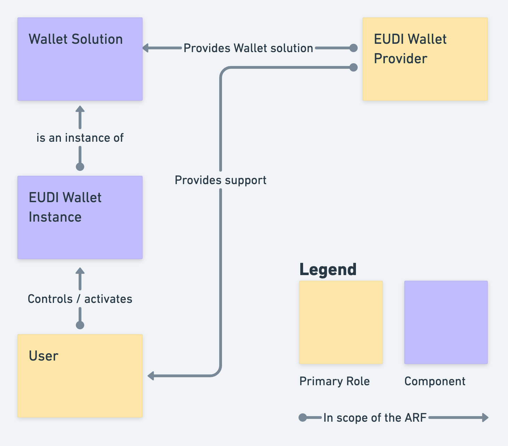
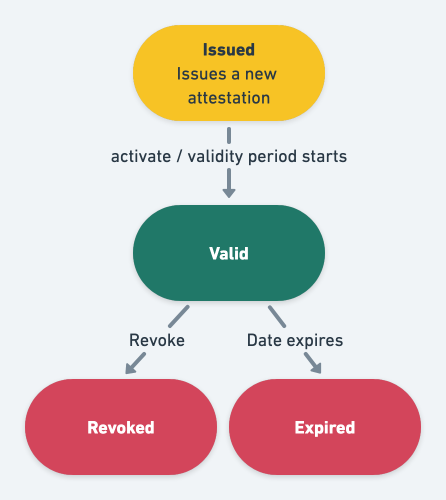
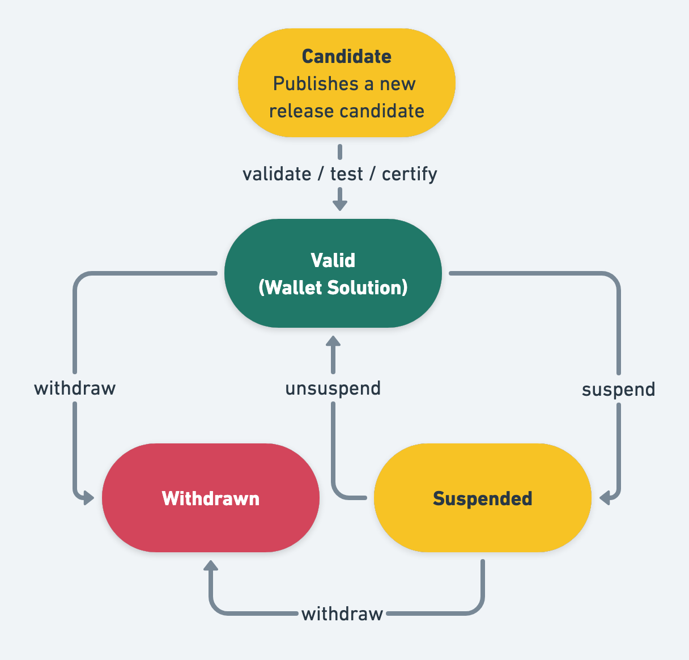
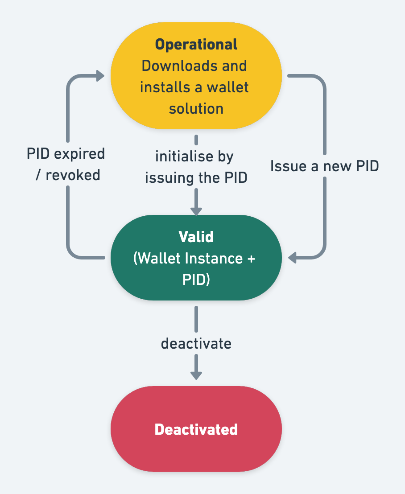
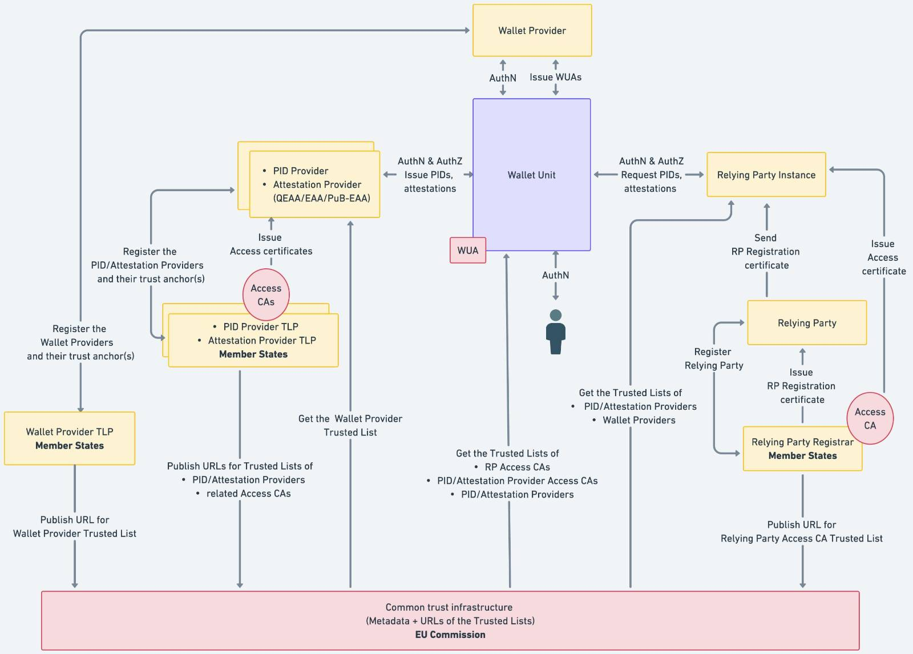
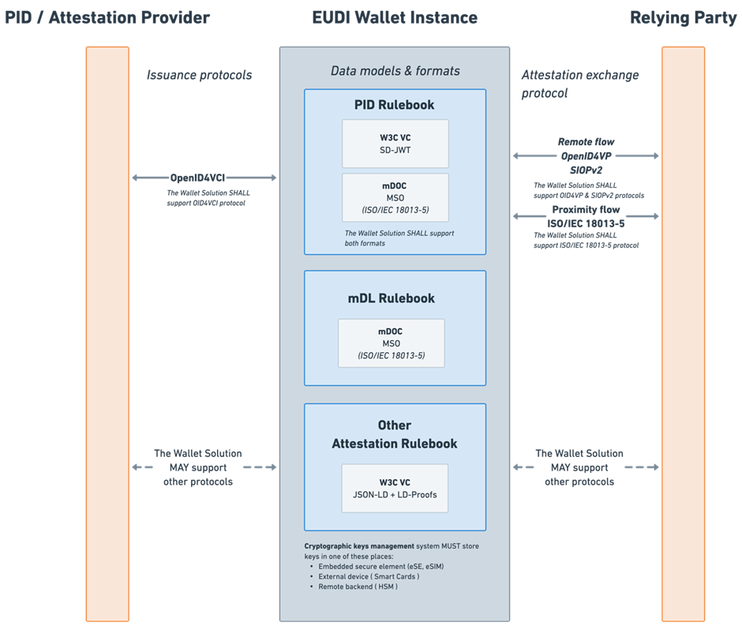

# European Digital Identity Wallet Architecture and Reference Framework

## 1 Introduction

### 1.1 Context

On 3 June 2021, the European Commission adopted a Recommendation ([COMMISSION RECOMMENDATION (EU) 2021/946 of 3 June 2021 on a common Union Toolbox for a coordinated approach towards a European Digital Identity Framework](https://eur-lex.europa.eu/legal-content/EN/TXT/?uri=uriserv:OJ.L_.2021.210.01.0051.01.ENG), [OJ L 210/51, 14.6.2021](https://eur-lex.europa.eu/legal-content/EN/TXT/HTML/?uri=OJ%3AL%3A2021%3A210%3AFULL)) calling on Member States to work towards the development of a Toolbox including a technical Architecture and Reference Framework (hereinafter the ARF), a set of common standards and technical specifications and a set of common guidelines and best practices.

The Recommendation specifies that these outcomes will serve as a basis for the implementation of the proposal for a European Digital Identity Framework, without the process of developing the Toolbox interfering with, or prejudging the legislative process.

The Recommendation sets up a structured process of cooperation between Member States, the Commission and, where relevant, private sector operators, to develop the Toolbox. The eIDAS Expert Group is tasked as main interlocutor for the purposes of implementing this Recommendation. The Expert Group's page can be found [at the official page](https://ec.europa.eu/transparency/expert-groups-register/screen/expert%20groups/consult?do=groupDetail.groupDetail&groupID=3032).

The eIDAS Expert Group has since further developed the concepts and specifications for the European Digital Identity Framework. The current ARF version 1.5.0 is based on the legal text adopted by the co-legislators, including the adopted Implementing Acts.

### 1.2 Purpose of this document

The purpose of this version of the document is to establish high level requirements as reference to create uniform conditions for the implementation of the legislative act and to define the technical specifications, standards and procedures that the Commission will develop for the purpose of implementing the [eIDAS Regulation](https://eur-lex.europa.eu/eli/reg/2024/1183/oj), and which are related to the following topics:

- Wallet Unit core functionalities ([art. 5a](https://eur-lex.europa.eu/legal-content/EN/ALL/?uri=CELEX:32024R1183#d1e1347-1-1))

- Relying parties ([art. 5b](https://eur-lex.europa.eu/legal-content/EN/ALL/?uri=CELEX:32024R1183#d1e1776-1-1))

- Requirements for QEAA ([art.45d](https://eur-lex.europa.eu/legal-content/EN/ALL/?uri=CELEX:32024R1183#d1e3849-1-1))

- Verification of attributes against authentic sources ([art.45e](https://eur-lex.europa.eu/legal-content/EN/ALL/?uri=CELEX:32024R1183#d1e3883-1-1))

- Requirements for EAA issued by/on behalf of a public sector body (PSB) ([art.45f](https://eur-lex.europa.eu/legal-content/EN/ALL/?uri=CELEX:32024R1183#d1e3902-1-1))

- Cross border identity matching ([art.11a](https://eur-lex.europa.eu/legal-content/EN/ALL/?uri=CELEX:32024R1183#d1e2220-1-1))

- Certification of the Wallet Solution ([art. 5c](https://eur-lex.europa.eu/legal-content/EN/ALL/?uri=CELEX:32024R1183#d1e1875-1-1))

- Publication of a list of certified Wallet Solutions ([art. 5d](https://eur-lex.europa.eu/legal-content/EN/ALL/?uri=CELEX:32024R1183#d1e1938-1-1))

- Security breaches of Wallet Solutions or Wallet Units ([art. 5e](https://eur-lex.europa.eu/legal-content/EN/ALL/?uri=CELEX:32024R1183#d1e2020-1-1))

- Requirements for EAA issued by/on behalf of a PSB - notification ([art.45f](https://eur-lex.europa.eu/legal-content/EN/ALL/?uri=CELEX:32024R1183#d1e3902-1-1))

The Commission intends to use this ARF to develop the Wallet Solution reference implementation.

The document presents a state-of-play of ongoing work of the eIDAS Expert Group and does not imply any formal agreement regarding its content. This document will be complemented and updated over time through the process of establishing the toolbox, as described in [Chapter 8](#8-document-development).

This document holds no legal value and does not prejudge the final mandatory legal requirements for the EUDI Wallet ecosystem. Only the final adopted European Digital Identity Framework Regulation, and the implementing and delegated acts adopted under that Regulation, will be mandatory.

### 1.3 Guidance for the Large-Scale Pilots (LSP)

To support the development of a reference implementation of a Wallet Solution and to pilot its usage across different priority use cases, the Commission launched a call for proposals on 22nd February 2022 under the Digital Europe Programme to pilot use cases for the EUDI Wallet ecosystem at a large-scale.

The objective of the Large-Scale Pilots (LSP) call is to support the piloting of the EUDI Wallet ecosystem around a range of use-cases involving both public and private sector stakeholders. The LSPs will test the EUDI Wallet ecosystem in both national and cross-borders contexts and integrate with the iterative development of the reference application.

The works of the LSPs will be aligned with the ARF, which will guide pilot system design and architecture development together with the release of the reference implementation.

The LSPs are expected to provide feedback on the ARF as they develop and interact with Relying Party services, Qualified or non-qualified Electronic Attestations of Attributes (Q)EAA Providers, Person Identification Data (PID) Providers, Qualified and non-Qualified Trust Service Providers and Users in meaningful interactions under the proposed use cases.

### 1.4 Definitions

The definitions used in this document are added in Annex 1 of this document. In Annex 1 there are two tables:

- **Table 1** includes definitions cited from the [eIDAS 2.0] Regulation, 
- **Table 2** includes technical definitions that are used in the ARF. in some cases, these definitions originated in the context of specific topics. In these cases, the topic number appears in brackets following the definition, e.g., [Topic 11], to give it the relevant context. If the definition is related to two topics, both topic numbers will appear in the brackets, e.g., [Topic 33, Topic 34]. If the technical definition is generic, that is to the ARF as a whole or to more than 2 topics, no brackets will be added. If a definition relies on an external source such as a standard or a formal publication, the source is mentioned.

### 1.5 Scope

This document only applies to the EUDI Wallet ecosystem. Attestations that are not bound to or used by Wallet Units are not included in the scope of this document.

## 2 Use Cases

### 2.1 Introduction

The development of the Architecture Reference Framework (ARF) is strategically guided by use cases that showcase the User experience, value proposition, and business requirements of the EUDI Wallet ecosystem. In this process, the eIDAS Expert Group initially created service blueprints for each use case. These blueprints meticulously detail the service delivery's touch points, components, and processes. Their role is twofold: they are instrumental in the service design and function as a tool to improve User experience and service efficiency, while simultaneously highlighting potential areas for enhancement. Serving as a foundational element, these blueprints inform the development of common specifications. Detailed in the Annexes, these blueprints offer comprehensive solutions with the flexibility to incorporate alternative approaches and optional steps. It's important to note that User journeys may differ depending on the chosen implementation approach, affecting processes like data retrieval and User consent.

The eIDAS Expert Group has described service blueprints for the following use cases:

- Identification and authentication to access online services, see [Section 2.2](#22-identification-and-authentication-to-access-online-services)

- Qualified Electronic Signature, see [Section 2.3](#23-qualified-electronic-signature)

- Mobile Driving Licence, see [Section 2.4](#24-mobile-driving-licence)

- Pseudonyms, see [Section 2.5](#25-pseudonyms).

- Several other use cases that will be detailed in subsequent versions of this document, see [Section 2.6](#26-other-use-cases).

### 2.2 Identification and authentication to access online services

The EUDI Wallet ecosystem is primarily designed to facilitate secure User identification and authentication at a high Level of Assurance (LoA) for various online services, both public and private. This capability is crucial, as it allows Relying Parties to confidently verify the identity of Users they interact with.

In this specific use case, a User employs their Wallet Unit to authenticate, in order to accessing online services. The User is particularly mindful of the privacy and security concerns associated with presenting person identification data (PID) online. Their primary goals include reliably identifying themselves to services that demand User identification while maintaining control over the presentation of their personal data.

Instead of using their PID to authenticate to online services, a User can also use a pseudonym provided by their Wallet Unit. See [Section 2.5](#25-pseudonyms).

### 2.3 Qualified electronic signature

The Wallet Unit enables Users to create qualified electronic signatures or seals. This goal can be reached by using the authentication and signature / seal capabilities of the Wallet Unit as a part of a local QSCD, or a remote QSCD managed by a QTSP [Topic16] and [Topic 37].

### 2.4 Mobile Driving Licence

A significant use case for the Wallet Unit involves allowing Users to acquire, store, and present a mobile Driving Licence (mDL) as an attestation to prove their driving privileges. In this use case, the User employs a Wallet Unit to present a mDL to a Relying Party (e.g., the Traffic Police).

The use case description concentrates on proximity supervised and unsupervised flows, which involve scenarios where the User is physically near a Relying Party, and the mDL attribute exchange and disclosure occurs using proximity technologies (e.g., NFC, Bluetooth). The two proximity flows have one significant difference: in the supervised flow, the Wallet Unit presents mDL attributes to a human Relying Party or under their supervision (who may also use a device); whereas in the unsupervised flow, the Wallet Unit presents mDL attributes to a machine without human oversight.

### 2.5 Pseudonyms

A User can potentially use a pseudonym in multiple different use cases. Wallet Units support the generation of pseudonyms for Users in compliance with the W3C WebAuthn API specification, [W3C WebAuthn].

Note: Pseudonyms were added to the list of Topics to be discussed for ARF 2.0. These discussions will include which potential use cases for using a pseudonym must be supported by Wallet Units and the way in which this support will be technically implemented. This section will be updated in ARF 2.0.

### 2.6 Other use cases

#### 2.6.1 Health

Easy access to health data is crucial in both national and cross-border contexts. A Wallet Unit may enable access to patient summary, ePrescriptions, etc.

#### 2.6.2 Educational credentials and professional qualifications

Providing documents for qualification recognition procedures can be costly and time-consuming for Users, Relying Parties such as companies and employers, and Attestation Providers such as education and training providers or other academic institutions. For example, digital diploma attestations could be presented cross-border in a verifiable, trusted, and consumable format to another education or training institution or a prospective employer. An Wallet Unit may be a repository for educational digital credentials as Electronic Attestations of Attributes and a means for exchanging them by a learner to relevant relying parties.

#### 2.6.3 Digital Finance

A Wallet Unit can facilitate complying with strong customer authentication requirements, using the strong User Authentication capabilities described in [Section 2.1](#21-identification-and-authentication-to-access-online-services). In line with the Commission's Retail Payments Strategy, this use case would be developed in close coordination with Member States' advisory groups on retail payments and the finance industry.

#### 2.6.4 Digital Travel Credential

Digital Travel Credential (DTC) Providers may issue DTCs to Wallet Units in a supported format enabling Relying Parties to identify Users and their travel, thus facilitating the travel experience and the User journey in this dynamic sector.

## 3. Ecosystem

This chapter describes the EUDI Wallet ecosystem as it is foreseen in the Regulation. The different roles in the EUDI Wallet ecosystem are described in figure 1 and detailed in the following sections.

 <!--  -->

Figure 1: Overview of the EUDI Wallet ecosystem roles

1. Users of Wallet Units

2. Wallet Providers

3. Person Identification Data (PID) Providers

4. Trusted List Providers

5. Qualified Electronic Attestation of Attributes (QEAA) Providers

6. Public Body Authentic Source Electronic Attestation of Attributes (Pub-EAA) Providers

7. Electronic Attestation of Attributes (EAA) Providers

8. Qualified Electronic signature Remote Creation Service Providers

9. Authentic Sources

10. Relying Parties

11. Conformity Assessment Bodies (CAB)

12. Supervisory Bodies

13. Device Manufacturers and Related Subsystems Providers

14. (Q)EAA Schema Providers

15. National Accreditation Bodies

### 3.1 Users of Wallet Units

Users of Wallet Units use the Wallet Unit to receive, store and present PID, QEAA, PuB-EAA, or EAA about themselves, including to prove their identity. Wallet Unit Users can also create Qualified Electronic Signatures and Seals (QES) and utilise Wallet Unit-to-Wallet Unit interactions.

Who can be a User of a Wallet Unit depends on national law. The use of a Wallet Unit by citizens is not mandatory under the legislative proposal. However, each Member State will provide at least one European Digital Identity Wallet within 24 months after the entry into force of the implementing acts referred to in the Regulation.

### 3.2 Wallet Providers

Wallet Providers are Member States or organisations either mandated or recognised by Member States making a Wallet Solution available to Users. The terms and conditions of the mandate or recognition are for each Member State to determine.

The Wallet Providers make available to a User, through an instance of their Wallet Solution, a combination of several products and Trust Services foreseen in the legal proposal, which give the User full control over the use of their Person Identification Data (PID) and Electronic Attestations of Attributes (QEAA, PuB-EAA or EAA), and any other personal data within their Wallet Unit. From a technical viewpoint, this may also imply guaranteeing a User sole control over sensitive cryptographic material (e.g., private keys) related to their PID and/or (Q)EAA, including the use cases for electronic identification and creating a signature or seal. As explained in [Section 6.5.3](#653-wallet-unit-activation), Wallet Providers also provide Wallet Unit Attestations (WUA) to the Wallet Unit.

Wallet Providers are responsible for ensuring compliance with the requirements for Wallet Solutions.

### 3.3 Person Identification Data (PID) Providers

PID Providers are trusted entities responsible to:

- verify the identity of the User in compliance with LoA high requirements,

- issue PID to the Wallet Unit in a common format, and

- make available information for Relying Parties to verify the validity of the PID.

The terms and conditions of these services are for each Member State to determine.

PID Providers may be the same organisations that today issue official identity documents, electronic identity means, etc. Wallet Providers may be the same organisations as PID Providers. In case an organisation acts as both a PID Provider and a Wallet Provider, it complies with all requirements for both PID Providers and Wallet Providers.

### 3.4 Trusted List Provider

A Trusted List Provider (TLP) is a body responsible for maintaining, managing, and publishing a Trusted List. A Trusted List Provider is appointed by a Member State and notified to the Commission. Within the EUDI Wallet ecosystem, Trusted Lists exist for the following entities:

- Wallet Providers,
- PID Providers,
- QEAA Providers,
- PuB-EAA Providers,
- non-qualified EAA Providers (not mandatory),
- Access Certificate Authorities for
  - Relying Parties,
  - PID Providers,
  - QEAA Providers,
  - PuB-EAA Providers.

These Trusted Lists are described in more detail in [Section 6.2.2](#622-wallet-provider-registration-and-notification), [6.3.2](#632-pid-provider-or-attestation-provider-registration-and-notification) and [6.4.2](#642-relying-party-registration), as well as in [Topic 31]. Some Trusted Lists contain the trust anchors of the relevant entities. A trust anchor is a combination of a public key and the identifier of the associated entity and may be used to verify signatures or seals created by that entity.

Member States will provide Trusted Lists for PID Providers, QEAA Providers and PuB-EAA Providers, in compliance with [Article 22](https://eur-lex.europa.eu/legal-content/EN/TXT/?uri=uriserv%3AOJ.L_.2014.257.01.0073.01.ENG#d1e2162-73-1). These Trusted Lists may also include non-qualified EAA Providers, but this is not mandatory. Alternatively, domain-specific trusted lists or alternative solutions for managing the trust anchors may be provided for EAA Providers. For instance, trustworthy mDL or DTC Providers are determined by other legal frameworks than [eIDAS 2.0] and published accordingly.

An entity's status as a trusted entity can be verified by checking whether they are present on a Trusted List. Trusted List Providers provide a registration service for the relevant entities. The terms and conditions for entities to become registered are for each registrar to determine unless specified elsewhere e.g., in sectoral rules.

For more information, please refer to [Topic 27] and to [Topic 31].

### 3.5 Qualified Electronic Attestation of Attributes (QEAA) Providers

Qualified EAAs are provided by Qualified Trust Service Providers (QTSPs). The general Trust Framework for QTSPs apply also to QEAA, but specific rules for this Trust Service need to be defined as well. QEAA Providers maintain an interface for requesting and providing QEAAs, including a mutual authentication interface with Wallet Units and potentially an interface towards Authentic Sources to verify attributes. QEAA Providers provide information on the location of the services that can be used to enquire about the validity status of the QEAAs, without having an ability to receive any information about the use of the attestations. The terms and conditions of these services are for each QTSP to determine, beyond what is specified in the [eIDAS 2.0] Regulation.

### 3.6 Public Body Authentic Source Electronic Attestation of Attributes (PuB-EAA) Providers

As specified in the Regulation, an attestation may be issued by or on behalf of a public sector body responsible for an authentic source. This ARF calls such an attestation a PuB-EAA. An authentic source is a repository or system that contains and provides attributes about a natural or legal person or object. An authentic source moreover is legally considered to be a primary source of those attributes. A public sector body primarily is a state, regional or local authority, or a body governed by public law.

A PuB-EAA Provider, meaning a public sector body issuing PuB-EAAs, is not a QTSP. However, it has a qualified certificate, issued by a QTSP, that allows it to sign PuB-EAAs. A Relying Party verifies a PuB-EAA by first verifying the signature over the PuB-EAA, and subsequently verifying the signature of the PuB-EAA Provider certificate. For more details, refer to [Section 6.6.3.6](#6636-relying-party-instance-verifies-the-authenticity-of-the-pid-or-attestation).

The Regulation stipulates that PuB-EAAs, like QEAAs, have the same legal effect as lawfully issued attestations in paper form.

For the precise and legally binding definitions and obligations regarding the issuance of PuB-EAAs, please refer to the Regulation.

### 3.7 Non-Qualified Electronic Attestation of Attributes (EAA) Providers

Non-qualified EAAs can be provided by any (non-qualified) Trust Service Provider. While they are supervised under [eIDAS 2.0], it can be assumed that other legal or contractual frameworks mostly govern the rules for provision, use and recognition of EAAs. Those other frameworks may cover policy areas such as educational credentials, digital payments, although they may also rely on Qualified Electronic Attestation of Attributes Providers. For non-qualified EAAs to be used, TSPs offer Users a way to request and obtain these EAA. This implies these non-qualified EAA Providers need to comply with the Wallet Unit interface specifications. Depending on the domain rules, non-qualified EAA Providers may provide validity information about EAAs, without having an ability to receive any information about the use of the EAA. The terms and conditions of issuing EAAs and related services are subject to sectoral rules.

### 3.8 QES Remote Creation Service Providers

The Wallet Unit will allow the User to create free-of-charge Qualified Electronic Signatures over any data. This will also enhance the use of the Wallet Unit for signing, in a natural and convenient way. The creation of Qualified Electronic Signature or Seal by means of the Wallet Unit can be reached by several ways:

- the Wallet Unit itself is certified as a qualified signature/seal creation device (QSCD), or

- the Wallet Unit implements secure authentication and electronic signature or an electronic seal invocation capability as a part of a local QSCD or a remote QSCD managed by a QTSP.

In figure 1 the QESRC Service Provider can be the remote QSCD. As part of the ecosystem, the use of common interfaces and protocols for provisioning Qualified Electronic Signatures and Seals will create a unified European market for QTSP offering remote signature services. European citizens will be able to choose any QTSP without worrying about technical interoperability between them and this will enhance competition and create better QTSP services.

Besides Qualified Electronic Signatures and Seals, also Non-Qualified Electronic Signatures or Seal Providers can exist. However, Non-Qualified Electronic Signature/ Seal Providers are out of scope of the ARF.

### 3.9 Authentic Sources

Authentic Sources are the public or private repositories or systems recognised or required by law containing attributes about natural and/ or legal persons. The Authentic Sources in scope of Article 45e are sources for, e.g. attributes on address, age, gender, civil status, family composition, nationality, education and training qualifications titles and licences, professional qualifications titles and licences, public permits and licences, financial and company data. Authentic Sources in scope of Article 45e are required to provide interfaces to QEAA Providers to verify the authenticity of the above attributes, either directly or via designated intermediaries recognised at national level. Authentic Sources may also issue PuB-EEAs themselves if they meet the requirements of the [eIDAS 2.0] Regulation. In figure 1 this is indicated by the arrow 'provides qualified data'.

It is up to the Member States to define terms and conditions for the provisioning of these Pub-EAAs, but according to the minimum technical specifications, standards, and procedures applicable to the verification procedures for qualified electronic attestations of attributes.

### 3.10 Relying Parties

Relying Parties are natural or legal persons that rely upon an electronic identification or a Trust Service. They request the necessary attributes contained within the PID, QEAA, Pub-EAA and EAA from Users to rely on the Wallet Unit, subject to the acceptance by the User and within the limits of applicable legislation and rules. The reason for reliance on the Wallet Unit may be a legal requirement, a contractual agreement, or their own decision. To rely on Wallet Units for the purpose of providing a service, Relying Parties need to inform the Member State where they are established and their intention for doing so. Relying Parties need to maintain an interface with the Wallet Unit to request attestations with mutual authentication. Relying Parties are responsible for authenticating PIDs and (Q)EAAs.

### 3.11 Conformity Assessment Bodies (CAB)

Conformity Assessment Bodies (CAB) are accredited public or private bodies, accredited by a national accreditation body designated by Member States according to [Regulation 765/2008](https://eur-lex.europa.eu/legal-content/EN/TXT/?uri=celex:32008R0765) Article 6c (3), as responsible for carrying out assessments on which Member States will rely before issuing a Wallet Unit or providing the qualified status to a Trust Service Provider.

The Wallet Solutions will need to be certified by CABs. QTSPs will be audited regularly by CABs.

The standards and schemes used by CABs to fulfil their tasks to certify Wallet Solutions are specified further, specifically in [Chapter 7](#7-security-and-data-protection) - Certification.

### 3.12 Supervisory Bodies

For the Regulation, the supervisory bodies are important to review and ensure proper functioning of the Wallet Providers and other relevant actors. Supervisory Bodies will be created and appointed in the Member States. The Supervisory Bodies will be notified to the Commission by the Member States.

### 3.13 Device Manufacturers and Related Subsystems Providers

In the Wallet ecosystem, commercial actors such as device manufacturers and related subsystems providers fulfil an important role to enable the Wallet Solution to work smoothly and securely in the hands of the User.

Hence, device manufacturers, and related subsystem providers need to provide a platform on which where the Wallet Solution can be built. Usability, security, stability and connectivity are key factors.

The components provided by device manufacturers and providers of related subsystems may include, among others, hardware, operating systems, secure cryptographic hardware, libraries, and app stores.

### 3.14 Qualified and Non-Qualified Electronic Attestation of Attributes Schema Providers

(Q)EAA Schema Providers publish schemas and vocabularies describing (Q)EAA structure and semantics. It may enable other entities such as Relying Parties to discover and validate (Q)EAAs. The Commission sets out the minimum technical specifications, standards, and procedures for this purpose. Common schemas, including by sector- specific organisations are critical for wide-spread adoption of (Q)EAAs.

### 3.15 National Accreditation Bodies

National Accreditation Bodies (NAB) under [Regulation (EC) No 765/2008](https://eur-lex.europa.eu/legal-content/EN/TXT/?uri=celex:32008R0765) are the bodies in Member States that perform accreditation with authority derived from the Member State. NABs accredit CABs as competent, independent, and supervised professional certification bodies in charge of certifying products/services/processes against normative document(s) establishing the requirements (e.g., legislations, specifications, protection profiles). NABs monitor the CABs to which they have issued an accreditation certificate.

## 4 High level architecture

This chapter provides a broad overview of the EUDI Wallet ecosystem's core components, their interfaces, and the overall design principles. Figure 2 visually clarifies these core components, the key entities within the EUDI Wallet architecture, and how they communicate via the primary interfaces.

### 4.1 Design principles

To effectively translate the European Digital Identity Regulation into a User-friendly, privacy-focused, and secure technical architecture, establishing design principles is crucial. These principles, rooted in the regulatory framework and enriched by industry best practices, will serve as fundamental guidelines. This approach ensures compliance with requirements emphasizing User-centricity, privacy, security, and cross-border interoperability. It demonstrates a commitment to both regulatory alignment and excellence in the EUDI Wallet architecture's design.

#### 4.1.1 User-centricity

The EUDI Wallet ecosystem prioritises User-centricity as a core design principle. This means placing User needs and experience at the forefront of every design decision. The Wallet Unit should be intuitive and easy to use, with seamless integration into existing use cases. Users should have full control over their attributes and privacy, with transparent information about what are attributes are being presented and to whom. Additionally, the Wallet Unit should be accessible and inclusive, catering to Users with varying technical backgrounds and abilities. By prioritizing User-centricity, the EUDI Wallet ecosystem fosters trust and encourages widespread adoption, ultimately achieving its goal of empowering Users with secure and convenient digital identity management.

#### 4.1.2 Interoperability

The EUDI Wallet ecosystem prioritises interoperability as a core design principle. This ensures a Wallet Unit functions seamlessly across borders within the EU. Users can travel freely and confidently utilise their digital identity wallets for various services, from e-government platforms to private online interactions. Interoperability fosters secure data exchange through standardised protocols, allowing trusted entities to verify credentials effortlessly. This not only simplifies the User experience but also strengthens overall security within the system. Moreover, interoperability prevents market fragmentation by creating a level playing field for different Wallet Solutions. It fosters competition and collaboration, ultimately driving innovation in the EUDI Wallet ecosystem. By prioritizing interoperability, the EUDI Wallet architecture lays the foundation for a trusted and universally accepted EUDI Wallet ecosystem across the EU.

#### 4.1.3 Privacy by Design

The EUDI Wallet architecture embodies the principle of privacy by design. This means that the protection of User data is a fundamental pillar of the architecture's design. The principle of data minimisation guides the collection of personal information, ensuring only what is necessary is gathered. The Wallet Unit empowers Users with granular control over what data is presented and to whom. Transparency is built into the system, with clear explanations of how data is used and protected. By making privacy a cornerstone from the beginning, the EUDI Wallet ecosystem aims to foster trust and protect the fundamental rights of its Users.

#### 4.1.4 Security by Design

The EUDI Wallet architecture embraces the principle of security by design. This means security considerations are woven into the very fabric of the architecture's design. Throughout the design process, potential vulnerabilities are identified and mitigated. Secure coding practices are mandated, and the architecture itself minimises attack surfaces by compartmentalizing sensitive data and access controls. By prioritizing security from the outset, the EUDI Wallet architecture aims to be inherently resistant to cyberattacks and data breaches, fostering trust and User confidence in this EUDI Wallet ecosystem.

### 4.2 Reference Architecture

Figure 2 below gives an overview of the architecture of the EUDI Wallet ecosystem and its components.

 <!--  -->

Figure 2: EUDI Wallet ecosystem reference architecture

The following components have been identified as the core components of a Wallet Unit:

- **User device (UD)**: A User device serves as the host for the Wallet Unit. For Wallet Units used by a natural person, the User Device will typically be a mobile device. For Wallet Units used by a legal person, the User device may for example be a cloud server. The minimum hardware and software requirements for the User device will be determined by the Wallet Solution.

- **Wallet Instance (WI)**: The app or application installed on a User device, which is part of an Wallet Solution and belongs to and is controlled by a User. This component implements the core business logic and interfaces as depicted in figure 2. It directly interacts with the WSCA/WSCD to securely manage cryptographic assets and execute cryptographic functions, ensuring a high level of assurance for authentication.

- **Wallet Secure Cryptographic Device (WSCD):** This is trusted hardware providing a secure environment and storage for cryptographic assets (such as keys) and for running the WSCA. This includes the keystore but also the environment where the security-critical functions are executed. The WSCD is tamper-proof and duplication-proof. One WSCD may be included in multiple Wallet Units, e.g. in case of an HSM. The WSCD consists of two parts: the WSCD hardware covers the hardware issued by the WSCD vendor and the WSCD firmware covers security-related software, such as operating system and cryptographic libraries provided by the WSCD vendor.

- **Wallet Secure Cryptographic Application (WSCA):** This is the secure application running on and utilizing the WSCD. A WSCA manages sensitive assets, primarily cryptograhic keys, and interfaces directly with the Wallet Instance. In some architectures, the WSCA will be provided by the WSCD vendor. In other architectures, the Wallet Provider will provide the WSCA.

- **Wallet Provider backend (WP**): The Wallet Provider backend offers Users support with their Wallet Units, performs essential maintenance, and issues Wallet Unit Attestations through the Wallet Provider Interface (WPI).

#### 4.2.1 Interfaces and protocols

The interfaces and their respective protocols, as discussed in this section and illustrated in Figure 2, comply with the specifications established by [Article 5a](https://eur-lex.europa.eu/legal-content/EN/ALL/?uri=CELEX:32024R1183#d1e1347-1-1), paragraph 5, of the regulation.

- **The Wallet Provider Interface (WPI)** is used by the Wallet Unit to communicate with the Wallet Provider to issue the Wallet Unit Attestation, as well as to provide support to the User and collect aggregated and user-consented information in a privacy-preserving manner to provision the Wallet Unit, in compliance with applicable legislation.

- **The User Interface (UI)** is the point of interaction and communication between the User and the Wallet Unit.

- **The Presentation Interface (PI)** empowers Relying Parties to securely request and receive the PID and various attestations (such as QEAAs, PuB-EAAs and EAAs) from Wallet Units, accommodating both remote and proximity interactions. For remote presentation flows, as detailed in the following section, the Wallet Unit implements the OpenID for Verifiable Presentation protocol [OpenID4VP]. Where supported, Relying Parties use the [OpenID4VP profile for the W3C Digital Credentials API] (if available) to request the PID for additional privacy, User experience, and security benefits. In contrast, for the proximity presentation flow, it adheres to the [ISO/IEC 18013-5] standard. In a remote flow, when a Relying Party requires User authentication and data access to provide a service, the process initiates through either a web browser or a mobile app.

- **The Secure Cryptographic Interface (SCI)** enables the Wallet Unit to communicate with the Wallet Secure Cryptographic Application (WSCA). This interface is specifically designed for managing cryptographic assets and executing cryptographic functions.

- **The PID Issuance Interface (PII)** is based on the [OpenID4VCI] protocol and is used when the Wallet Unit communicates with a PID Provider to request and receive PIDs to be stored within the Wallet Unit.

- **The Attestation Issuance Interfaces** **(AII)** is based on the [OpenID4VCI] protocol and is used by the Wallet Unit to request various attestations that Users wants to include in their Wallet Unit.

- **The Remote Signing Interface (RSI)** facilitates communication between the Wallet Unit and the Qualified Electronic Signature (QES) Remote Service Provider. This interface is specifically used to execute a QES remote signature.

Note the "Deletion Request Interface" and the "Reporting Interface" as mentioned in the Regulation are not depicted as *interface* in this diagram. To be able to request as a User to delete personal data and to request reporting, are seen as features of the Wallet Solution which are required to be implemented in the solution.

#### 4.2.2 Attestation presentation flows

This section defines four distinct communication flows between a Wallet Unit and a Relying Party, guiding the implementation of the presentation interface:

- **Proximity Supervised Flow**: The User is physically near the Relying Party. Attestations are exchanged using near proximity technology (e.g., NFC, Bluetooth) between the Wallet Unit and the Relying Party Instance. Both devices may be with or without internet connectivity. A human representative of the Relying Party supervises the process.

- **Proximity Unsupervised Flow**: Like the supervised flow, but the Wallet Unit presents verifiable attributes to a machine without human supervision.

- **Remote Cross-Device Flow**: The User views service information on a separate device from their Wallet Unit, which is only used to secure the session (e.g., scanning a QR code on a login page with the Wallet Unit to access online services).

- **Remote Same-Device Flow**: The User uses their EUDI Wallet device to both secure the session and consume the digital service including information exchange.

Specific use cases integrate one or more of these flows. For detailed User journeys across various use cases, please refer to the blueprints in [Annex 4](#annex-4) of the ARF.

#### 4.2.3 Mobile Apps and Web Browsers

This section examines the technical interaction between the Wallet Solution, web browsers, and mobile apps, in regards of the flows described in the previous section. This is necessary to implement the attestation presentation interface effectively, with a focus on both User experience and security.

When a Relying Party requires User authentication and some data to provide a service, the process begins within either a web browser or a mobile app. In the Remote Same-Device flow in particular, the User's browser or app should invoke their Wallet Unit through the mobile operating system where supported, whenever a Relying Party requests attributes. In contrast, a Remote Cross-Device flow and both the proximity flows (supervised or unsupervised), should invoke the Wallet Unit through the mobile operating system via an NFC tap or the scanning of a QR code.

As illustrated in figure 2, secure and streamlined interaction with other applications, both on the User's device and externally, is crucial. Key areas for discussion and improvement include:

- **Secure Cross-Device Flows**: Existing cross-device flows need stronger security measures to combat phishing and relay attacks.

- **Relying Party Authentication**: Before presenting attributes, the Wallet Unit will authenticate the Relying Party, and conversely, the Relying Party might authenticate the Wallet Unit. This can involve dynamic or static exchange of keys and metadata. Since the web browser or mobile app mediates communication between the Relying Party and Wallet Unit in the Remote Same-Device flow, it's crucial to define how this interaction works.

- **Wallet Unit Selection and Invocation**: In scenarios where Users have multiple Wallet Units, the process of selecting and activating the appropriate Wallet Unit is critical for a seamless experience. Clear application interface between the Wallet Unit and the browser/app are also essential. Current approaches relying on custom URIs can introduce User experience friction and scaling issues.

To mitigate these challenges, Relying Parties and Wallet Units should use the [OpenID4VP profile for the W3C Digital Credentials API] as opposed to custom URL schemes on web browsers and app platforms that support it. This profile utilises the [W3C Digital Credentials API], a browser API which allows websites to request the presentation of digital credentials via the mobile operating system. The API provides several advantages to Relying Parties, Wallet Units, and Users:

- **User Experience**: For Remote Same-Device flow, the presentation interface will continue in the initial context of the web browser or mobile app. 
- **Secure Cross-Device Flows**: Cross-device presentations can leverage proximity checks handled by the mobile operating system which provides added phishing resistance.
- **Multiple Wallet Unit Selection**: Users are afforded a clear interface provided by the mobile operating system that disambiguates between multiple Wallet Units for selection. -
- **Clear Origin Information**: The origin information of the Relying Party (such as the website domain or the app package name) is supplied by the system and is provided in the presentation request for Users and the Wallet Solutions to guard against replay attacks.

### 4.3 Architecture types

Building upon the high-level design described in figure 2, at least four different types of architecture for the Wallet Solution can be identified, each leveraging a different type of Wallet Secure Cryptographic Device (WSCD):

1. ***Remote Wallet Secure Cryptographic Device (Remote WSCD)***: In this architecture, the Wallet Secure Cryptographic Device is situated remotely, separate from the User device. Typically, it will be implemented by the Wallet Provider using an HSM. The Wallet Provider will then also provide the WSCA with which the Wallet Unit interacts.

2. ***Local External Wallet Secure Cryptographic Device (Local External WSCD)***: If a device lacks sufficiently secure hardware, such as a secure element, external hardware components like smartcards may be necessary to enhance security. This architecture involves an external Wallet Secure Cryptographic Device that is connected to the User device, or interacts with it, and provides the cryptographic functions needed by the Wallet Unit. In this case, the WSCD typically is a smart card or a secure token, and the WSCA is an applet running on the smart card.

3. ***Local Wallet Secure Cryptographic Device (Local WSCD)***: This architecture refers to a scenario where the Wallet Secure Cryptographic Device is integrated directly within the User's device. This includes solutions like eSIM/eUICC and eSE. In these scenarios, the WSCA (e.g., a Java Card applet) might be deployed by the Wallet Provider. Other examples native solutions, such as StrongBox (Android) and SecureEnclave (iOS). For such solutions, the API to access the WSCA is part of the operating system of the User device.

4. ***Hybrid architecture***: This architecture combines two or more of the previous three approaches.

### 4.4 State diagrams

#### 4.4.1 Introduction

In this chapter, state diagrams are presented to explain the relations between the Wallet Solution, the Wallet Unit, and the PID.

The following descriptions are not prescriptive of form factor, hence depending on the implementation an Wallet Solution may consist of a single mobile app, or a set of local and remote components available to a specific User.

#### 4.4.2 Wallet Solution

An Wallet Solution has a state of its own, as defined by Article 5d of the Regulation. The state of the Solution affects the state of all Wallet Units of that Wallet Solution. Figure 3 below shows the states of the Wallet Solution:

 <!--  -->

Figure 3: State-chart of Wallet Solution

The **Candidate** state is the first state of an Wallet Solution. This means it is fully implemented and the Wallet Provider requests the solution to be certified as a Wallet Solution as part of an EUDI Wallet eID scheme.

If all the legal and technical criteria have been met, including:

- the certification of the Wallet Solution by accredited and designated CAB(s),

- ex-ante supervisory activities by Member State supervisory bodies,

- both the Wallet Provider and the PID Providers have been published by the Commission (in accordance with Article 5d),

- the information notified by Member States for publication of lists of Wallet Solutions have been published in the Official Journal of the EU,

then a Member State may decide to allow a Wallet Provider to start providing the Wallet Solution to Users. The state of the Wallet Solution becomes **valid**.

According to Article 5d, Member States inform the Commission of each change in the certification status of their EUDI Wallet eID schemes and the Wallet Solutions provided under that scheme. This means the Wallet Solution can be officially launched, and can be provided to Users.

Under the legal conditions in [Article 5e](https://eur-lex.europa.eu/legal-content/EN/ALL/?uri=CELEX:32024R1183#d1e2020-1-1), paragraph 1, the issuing Member State can temporarily suspend an Wallet Solution. This would for example be the result of a critical security issue on that EUDI Wallet Solution. This leads to the **suspended** state. Under [Article 5d](https://eur-lex.europa.eu/legal-content/EN/ALL/?uri=CELEX:32024R1183#d1e1938-1-1), paragraph 2, the issuing Member State can unsuspend the Wallet Solution and continue issuance, bringing the Solution back to the **valid** state. Under paragraph 1, the Wallet Solution can be completely withdrawn.

#### 4.4.3 Wallet Unit

Figure 4 below shows the states of the Wallet Unit.

 <!--  -->

Figure 4: State-chart of Wallet Unit

An Wallet Unit lifecycle begins when the User installs a Wallet Instance on their User device (see [Section 6.2](#62-trust-throughout-a-wallet-solution-lifecycle); the Wallet Unit status is **installed**. Once a Wallet Unit establishes communication with other components that are part of the Wallet Solution, is activated, and is issued a Wallet Unit Attestation (WUA) by an Wallet Provider, it is in an **operational** state. In this state, the User manages the Wallet Unit, which may involve:

- The Wallet Provider updating the Wallet Unit,

- The Wallet Provider revoking the Wallet Unit, including at the User's request. Revocation of the Wallet Unit is accomplished by revoking the Wallet Unit Attestation (see [Topic 9] and [Topic 38]).

- The User uninstalling the Wallet Instance.

In the **operational** state of the Wallet Unit:

- The User can request issuance of a PID and optionally a QEAA, a PuB-EAA or an EAA.

- Once an Wallet Unit holds a valid PID, it is considered **valid**. Note that this state cannot be verified or looked upon unless PID is requested. In this state, the User can use their EUDI Wallet Unit to present PID attributes. If the PID expires or is revoked, the Wallet Unit is not automatically unusable, but rather its state is merely downgraded back to **operational**. This may affect the validity or usability of a QEAA, a PuB-EAA, an EAA or a QES certificate.

Notes:

- the above possibilities are independent from the possibility of a PID, QEAA, PuB-EAA, or EAA Provider, to revoke the attestations that they have issued to an Wallet Unit.

- The security provided by the Wallet Unit is relying on the Wallet Secure Cryptographic Device and its Wallet Secure Cryptographic Application. In the architecture overview ([Section 6.1](#61-overview), figure 6) it is explained that multiple solutions are available for implementation, such as Remote Wallet Secure Cryptographic Device, Local External Wallet Secure Cryptographic Device, Local Wallet Secure Cryptographic Device and / or a Hybrid architecture.

#### 4.4.4 Person Identification Data (PID)

In the context of the EUDI Wallet ecosystem, a PID begins its lifecycle when being issued to a Wallet Unit. Please note that this means that the management of attributes in the Authentic Source (adhering to national structures and attribute definitions) is outside of the scope of the ARF.

For certain use cases, the PID may be pre-provisioned, meaning it is not yet valid when issued. In that case, its state is Issued, and it will transition to Valid when it reaches the beginning of its validity period. However, if the PID is issued on or after the validity start date, its state directly changes to Valid.

 <!--  -->

Figure 5: State-chart of PID

There are two possible transitions from a valid PID: it automatically expires, by passage to the validity end date, or it is actively revoked by its PID Provider. Expiration and revocation are essentially independent transitions. Once a PID is expired or revoked, it cannot transition back to **valid**.

## 5 Attestations

### 5.1 Introduction

Within the European Digital Identity Wallet ecosystem, the Regulation distinguishes four legal categories of attestations, which are defined as follows:

- **Person Identification Data (PID)**: A set of data that is issued in accordance with Union or national law and that enables the establishment of the identity of a natural or legal person, or of a natural person representing another natural person or a legal person.

- **Qualified Electronic Attestation of Attributes (QEAA)**: An electronic attestation of attributes which is issued by a qualified trust service provider (QTSP) and meets the requirements laid down in Annex V of the Regulation.

- **Electronic attestation of attributes issued by or on behalf of a public sector body responsible for an authentic source (PuB-EAA)**: An electronic attestation of attributes issued by a public sector body that is responsible for an authentic source or by a public sector body that is designated by the Member State to issue such attestations of attributes on behalf of the public sector bodies responsible for authentic sources in accordance with Article 45f and with Annex VII of the Regulation.

- **Non-Qualified EAA:** An EAA which is not QEAA or PuB-EAA.

Please note that the differences between these types of attestation are purely legal. For example, a diploma may be a QEAA or a non-qualified EAA, depending on whether it is issued by a qualified trust service provider (QTSP) or by an unqualified one. Similarly, an mDL may be issued as a PuB-EAA, a QEAA, or a non-qualified EAA, depending on the legal status of the party issuing mobile driving licences in each Member State, in addition to being an authorised mDL Provider in accordance with the rules applicable for mDL Providers.

### 5.2 Available standardised formats

All attestations can be described to have the following elements:

- **Attribute schema** defines the structure, logical organisation, type and namespace(s) of the attested attributes as well as additional information such as information about the attestation, its issuer, the verification mechanisms, the underlying identity assurance, the Trust Framework to which the properties are related, and the proof of possession by the legitimate User.

- **Data formats** define the way data in an attestation is formatted, e.g. its character sets, encoding and serialisation.

- **Proof mechanisms** define the methods used to secure the attestations for integrity and authenticity, while enabling selective disclosure.

There are only a few suitable standardised formats for releasing electronic attestations of attributes currently available. These are:

1. ISO/IEC 18013-5 defines an attribute schema, data format and proof mechanisms for mDL-s, which can be used also with other attribute schemas, see [ISO/IEC 18013-5].

2. SD-JWT-based Verifiable Credentials (SD-JWT VC) defines a proof mechanism similar to [ISO/IEC 18013-5], but for a different data format, see [SD-JWT VC].

3. W3C Verifiable Credentials Data Model v1.1 [W3C VC DM v1.1] defines a generic attribute schema agnostic to data formats and proof mechanisms, while v 2.0 introduces requirements on format and recommendations on proof mechanisms, see [W3C VC DM v2.0].

[Topic 12] presents the current and foreseen status of these technical specifications and states the requirements regarding support for these specifications by attestations.

### 5.3 Attestation Rulebooks

This document specifies the concept of an Attestation Rulebook. For each type of attestation, such as a PID, an mDL, a diploma, or an e-prescription, an Attestation Rulebook specifies the attribute schema, data format and proof mechanisms of that attestation, and, when required, the trust mechanisms for authentication and authorisation. Each attestation has an attestation type and namespace(s) it uses. The namespace(s) used by an attestation define the identifier, syntax, and semantics of all attributes that can be part of that attestation.

An Attestation Rulebook also makes some choices regarding the protocol(s) for presentation that must be supported by the relevant attestations. [Topic 12] contains the requirements for Attestation Rulebooks.

Attestation Rulebooks are defined by different organisations:

- Some Rulebooks already have been defined by the European Commission, in consultation with the eIDAS Expert Group. This concerns the PID Rulebook and the mDL Rulebook. These can be found in [Annex 3](#annex-3).

- The Rulebook for an attestation intended to be used across organisations and/or across borders can be defined by an organisation in which, insofar possible, all stakeholders are represented. This will prevent multiple attestation rulebooks being defined for the same type of attestation, for example, diplomas. It will also prevent unnecessary differences in the syntax and semantics between similar attestations. The decision on which organisation will be responsible for a given attestation rulebook is out of scope for this document. As explained in [Topic 12], it is possible that an individual Attestation Provider needs to include attributes in an attestation that have not been specified in the relevant sectoral or EU-wide namespace. An example of this are attributes that only have a meaning within the Member State in which the Attestation Provider resides. To allow such domestic attributes, an Attestation Provider can define a custom namespace to specify attributes that are specific to this Provider and are not included in the EU-wide or sectoral namespace.

- The Rulebook for an attestation intended to be used only within an organisation, will be defined by that organisation.

### 5.4 Catalogues

Section 2 in [Article 45e](https://eur-lex.europa.eu/legal-content/EN/ALL/?uri=CELEX:32024R1183#d1e3883-1-1) of the regulation, sets up the direct legal basis for the Commission to \"**where necessary, establish specifications and procedures** for the catalogue of attributes and schemes for the attestation of attributes and verification procedures for qualified electronic attestations of attributes\".

One of the main rationales for the ARF is to reach a high level of interoperability. This interoperability can be achieved on different layers. On the technical level, interoperability can be achieved by using common standards, protocols and technical specifications, ensuring common language for attestation Providers, Wallet Providers and Relying Parties, enabling issuance, presentation and processing of the data involved, based on agreed common protocols interfaces and syntax.

The other layer is the semantic one and relates to semantic schemes of attributes. The risk is that an uncontrolled manner of implementation and usage, will create barriers to straight-forward approach and will complicate the implementation thus making the ecosystem much more costly to create and maintain, complex, and error-sensitive, affecting the quality of the overall system.

To re-use the building blocks of attributes and attestations, the concept of using catalogues was introduced. Creating and maintaining controlled vocabulary, catalogue of attributes and attestation rulebooks, is essential for the development and success of the EUDI Wallet ecosystem, enabling shorter "time-to-market\" and efficient implementation.

Building on the requirements of [Topic 12], having in mind both the need for interoperability on the one hand and the varied nature of attestations and organisations specifying those attestations on the other hand, the following principals were defined:

- Attestation Rulebooks for QEAAs and PuB-EAAs used within the EUDI Wallet ecosystem may be registered and published in a publicly accessible catalogue. The Attestation Rulebook catalogue MAY also include Attestation Rulebooks for non-qualified EAAs.

- The Commission will take measures to establish and maintain the Attestation Rulebooks catalogue.

- The Attestation Rulebooks catalogue will enable attestation Providers, Relying Parties and other actors in the EUDI Wallet ecosystem, to know which attestation types exist, and what are the identifiers, syntax and semantics of all attributes that are part of the attestation, that they may issue, request and receive from a Wallet Unit, according to their role in the ecosystem.

Also, the following points were emphasised, to facilitate creation, updates and adoption:

- Registration in the attestation catalogue is not mandatory.

- Registration in the attestation catalogue does not create any obligation or automatic acceptance by any third party, or automatically means cross-border recognition.

- The Attestation Rulebooks catalogue can be in the same environment as the catalogue of attributes.

Implementation of these principals will be discussed further in detail. The ambition is to use existing efforts and tools created by the Member States, the Commission and cross-border organisations, to connect and interact with the stakeholders, to utilise existing data assets for updating them when needed and add new data sets to support new use cases that will be implemented in the eco-system.

[Topic 25] and [Topic 26] (combined into one topic), present the current and foreseen status of the catalogues, their creation, distribution, discovery, management and maintenance, that will allow simple update procedures, not burdening the process on the one hand, while ensuring consistent and on-going mechanisms to keep the catalogues updated and accessible to the relevant actors, both those that create the content and those that use, consume and process the attributes and the attestations, and - last but not least - for the general public.

## 6 Trust model

### 6.1 Overview

#### 6.1.1 Scope

The Trust Model presented in this chapter describes, for all interactions between components of the EUDI Wallet ecosystem, which trust relationships are established between the interacting parties to enable these interactions.

 <!--  -->

Figure 6: EUDI Wallet trust architecture

Figure 6 above shows the parties and components that are involved in the trust architecture for the EUDI Wallet ecosystem.

In the center of this ecosystem is the **Wallet Unit**, shown in the top middle in blue. [Section 6.5](#65-trust-throughout-a-wallet-unit-lifecycle) describes the interactions between the Wallet Unit and other roles in the ecosystem in the lifecycle of a Wallet Unit, namely installation, activation, management, and de-installation.

A Wallet Unit is a unique configuration of a Wallet Solution, including a Wallet Instance and one or more WSCA/WSCDs, provided by a **Wallet Provider**. The Wallet Instance is an instance of the Wallet Provider's Wallet Solution. Figure 6 positions the Wallet Provider above the Wallet Unit and depicts the Wallet Provider Trusted List Provider (TLP) located in the lower right corner for each Member State. [Section 6.2](#62-trust-throughout-a-wallet-solution-lifecycle) elaborates on the interactions among these entities throughout the lifecycle of a Wallet Solution and Wallet Provider, including processes such as registration and potential withdrawal or suspension. The Wallet Provider manages the latter by issuing a **Wallet Unit Attestation (WUA)** to a Wallet Unit and, when necessary, revoking it.

One of the main functions of the Wallet Unit is to handle the User's PID(s) and attestations (QEAAs, PuB-EAAs and non-qualified EAAs). The PID(s) are issued by **PID Providers** and the attestations by **Attestation Providers**, shown to the left of the Wallet Unit in Figure 6. Like Wallet Providers, PID Providers and Attestation Providers are registered by a **PID Provider Trusted List Provider** (TLP) or by an **Attestation Provider Trusted List Provider** before they can interact with a Wallet Unit, and before a Relying Party can verify the PID(s) or attestation those Providers issue. As a result of the registration, a PID Provider or an Attestation Provider receives an access certificate from a **PID Provider Access Certificate Authority (CA)** or from an **Attestation Provider Access CA,** accordingly. [Section 6.3](#63-trust-throughout-a-pid-provider-or-an-attestation-provider-lifecycle) describes interactions between these roles in the lifecycle of a PID Provider or an Attestation Provider, namely registration, and possibly withdrawal and suspension.

After receiving one or more PIDs or attestations, a Wallet Unit can present User attributes from these attestations to **Relying Party Instances**. These are shown on the right-hand side of the Wallet Unit in Figure 6. A Relying Party Instance is a combination of hardware and software used by a **Relying Party** to interact with a Wallet Unit. A Relying Party can use multiple Relying Party Instances, especially in case the interactions with the Wallet Unit take place in proximity. Relying Parties are registered by a **Relying Party Registrar** in their Member State. As a result of the registration, a Relying Party receives an Access certificate from a **Relying Party Access CA**. [Section 6.4](#64-trust-throughout-a-relying-party-lifecycle) describes interactions between these roles in the lifecycle of a Relying Party, namely registration, and possibly de-registration.

Finally, [Section 6.6](#66-trust-throughout-a-pid-or-an-attestation-lifecycle) describes interactions in the lifecycle of a PID or an attestation, namely issuance, presentation to a Relying Party or to another Wallet Unit, management, and deletion.

Notes:

- This trust model is conceptual and may be implemented by Member States in different ways. For example, the different Trusted Lists may be implemented as a single list, provided that this list clearly indicates which trust anchors can be used for which purposes. Similarly, a Member State may decide to combine multiple Trusted List Providers and/or Certificate Authorities into a single entity, again provided that that entity maintains clear separations between its different roles and responsibilities. In some case, existing entities can probably be used to fulfil these roles.

- For PIDs, qualified EAAs, and PuB-EAAs, interoperability is required (see [Section 4.1.2](#412-interoperability)) and therefore, this trust model will be implemented using X509 certificates and ‘classical‘ X509-based Certificate Authorities according to [[RFC5280](https://datatracker.ietf.org/doc/html/rfc5280)] and [[RFC3647](https://datatracker.ietf.org/doc/html/rfc3647)]. The same is true for non-qualified EAAs complying with ISO/IEC 18013-5. However, for non-qualified EAAs complying with [SD-JWT VC] or [W3C VC DM v1.0 or 2.0], other trust frameworks may be used, such as [OpenID Federation].

- This trust model is valid for both remote and proximity use cases. However, technical measures taken to ensure that the requirements on trust are fulfilled may differ between these two use cases. Moreover, the authentication and authorisation mechanisms will depend on the characteristics of the interacting parties.

- In this version of the ARF, the trust model does not yet include interactions needed to enable Users to create qualified electronic signatures or seals. Please refer to [Topic 16] and [Topic 37].

#### 6.1.2 Risks and mitigation measures

##### 6.1.2.1 Introduction

This section briefly discusses some of the risks that were considered when this trust model was created, together with the mitigations for these risks and the residual risks that remain after these mitigations. This section is not intended to be a comprehensive risk register for the EUDI Wallet ecosystem as a whole; for that register, see Annex I of the 'Commission Implementing Regulation on the certification of the EUDI Wallets'. This section is limited to the scope of the ARF, namely, the Wallet Unit and its interactions with other parties in the ecosystem, as depicted in Figure 6.

##### 6.1.2.2 Risks related to confidentiality, integrity, and authentication

Within the EUDI Wallet ecosystem, many interactions take place between parties in which one party requests another party to perform a task. For example, a User may ask a PID Provider or an Attestation Provider to provide a PID or an attestation to a Wallet Instance, or a Relying Party may ask a User to present attributes from an attestation from its Wallet Instance.
For any of these interactions, the following risks apply:

- An attacker could impersonate one of the interacting parties. Therefore, the receiver of a message must be able to verify the identity of the sender. In other words, mutual authentication is needed. This authentication can be performed because valid parties in the EUDI Wallet ecosystem are put on a Trusted List by Member States. By verifying the signature over a message and verifying the associated public key certificates with a trust anchor included in a Trusted List, the receiver of a message can be sure about the identity of the message's sender.
- Messages between parties could be intercepted, meaning that they could be read by an attacker. To mitigate this risk, messages must be encrypted to ensure confidentiality.
- Intercepted messages could be changed by an attacker. To mitigate this risk, messages must be authenticated, so that the receiver can verify that originate from the authenticated sender and were not changed.

##### 6.1.2.3 Risk related to tampering of cryptographic keys and sensitive data

The mechanisms for authentication and confidentiality described in the previous section rely on the security of cryptographic keys, especially private and secret keys. If an attacker can obtain, use, or tamper with these keys, these security mechanisms would break down. Therefore, all cryptographic keys are managed by dedicated secure applications (WSCAs), running on secure hardware (WSCDs), as described in section 4.2. The security of WSCDs and WSCAs is ensured by means of an appropriate certification process.

These mitigation measures apply for all entities in the EUDI Wallet ecosystem that use cryptographic keys, including Wallet Units, Wallet Providers, PID Providers and Attestation Providers, Trusted List Providers and Certificate Authorities. For Relying Parties and Relying Party Instances, such measures are formally not required.

WSCDs and WSCAs in a Wallet Unit may also be used to store other sensitive data except cryptographic keys. In particular, they could be used to store User attributes, in such a way that attackers, including malicious applications residing on the same User device as the Wallet Unit, cannot retrieve these attributes. This is beneficial for User privacy.

##### 6.1.2.4 Risks related to authorization

In some cases, there is a risk that a valid party in the EUDI Wallet ecosystem tries to perform actions that it is not allowed to do. This risk occurs for mainly two types of parties. In the first place, a non-qualified EAA Provider may try to issue attestations it is not entitled to issue. For example, an Attestation Provider that is not officially entitled by a Member State (or by some other relevant authority) to issue diplomas may nevertheless attempt to issue an attestation having the diploma attestation type. Within the EUDI Wallet ecosystem this risk only applies to non-qualified EAA Providers. PID Providers, QEAA Providers and PuB-EAA Providers are assumed to be trustworthy in this regard. For more information, see [Section 6.3.2.2](#6322-pid-provider-or-attestation-provider-receives-an-access-certificate). That section also explains how this risk is mitigated.

A second case of a valid party in the EUDI Wallet ecosystem that may try to do things that it is not allowed to do, is a Relying Party trying to request attributes from a Wallet Unit for which they have no lawful grounds. This risk is mitigated mainly by three measures:

- First of all, the attestation formats and protocols specified in [ISO/IEC 18013-5] and [SD-JWT] + [OpenID4VP] allow selective disclosure of attributes. This means that a Relying Party can specify which of the attributes in an attestation it wishes to receive, and which ones not. This feature is sometimes called collection limitation. Next, selective disclosure also allows the User to approve or deny the presentation of each requested attribute separately. More information on selective disclosure and User approval can be found in [Section 6.6.3.5](#6635-wallet-unit-obtains-user-approval-for-presenting-selected-attributes).
- Secondly, the Regulation requires each Relying Party to register the attributes it intends to request from Users. The 'Commission Implementing Regulation on protocols and interface to be supported by the EUDI Framework' requires that these registered attributes are included in a so-called Relying Party registration certificate, and that a Wallet Unit must be able to display information from this registration certificate to the User. This allows the User to make a considered decision to approve or deny the presentation of the requested attributes. For more information, see [Section 6.6.3.3](#6633-wallet-unit-allows-user-to-verify-that-relying-party-does-not-request-more-attributes-than-it-registered).
- Lastly, the Regulation requires that an Attestation Provider is able to embed a disclosure policy into their attestations. This policy may contain rules determining whether the Attestation Provider approves of the release of one or more of the requested attributes to the authenticated Relying Party. The Wallet Unit evaluates the policy (if present in the attestation) in combination with authenticated data provided by the Relying Party, and informs the User about the outcome of the evaluation. Again, this allows the User to make a considered decision to approve or deny the presentation of the requested attributes. More information can be found in [Section 6.6.3.4](#6634-wallet-unit-evaluates-disclosure-policy-embedded-in-attestation-if-present).

##### 6.1.2.5 Risks related to User tracking

The privacy of Users is a major concern in the design and implementation of the EUDI Wallet ecosystem. Attributes are presented in the form of electronic attestations of attributes complying with the format specified in either [ISO/IEC 18013-5] or [SD-JWT VC]. A property of such attestation is that they contain a number of elements with a unique and fixed value, such as salts, hashes, public keys, and signature values. By storing and comparing these values across many transactions, malicious Relying Parties would be able to find matching values. They would then conclude that the same User was involved in these transactions. This could be done within one Relying Party, but also between multiple colluding Relying Parties. This form of tracking is called Relying Party linkability.

Another form of tracking is called Attestation Provider linkability, where Relying Parties could share the unique values they received with a colluding and malicious Attestation Provider. This would allow that Attestation Provider to track the User's behaviour across all colluding Relying Parties.

Regarding the mitigation of these risks:

- An (honest) Attestation Provider can partly or fully prevent Relying Party linkability of the attestations it issues, at the cost of issuing multiple attestations to the same User. This is a topic that will be further discussed for ARF 2.0. In addition, organisational and repressive measures can be used to discourage Relying Parties from colluding and tracking Users. In particular, Relying Parties found offending will have their access certificate revoked, after which they will not be able to interact with Wallet Units anymore.
- Attestation Provider linkability cannot be prevented for attestations in [ISO/IEC 18013-5] or [SD-JWT VC]-compliant format. The only technical way to mitigate this risk is by using Zero-Knowledge Proofs (ZKPs), instead of the salted-attribute hashes use by these formats.However, at the moment, using ZKPs is not feasible within the EUDI Wallet ecosystem, due to a lack of support for them in currently available secure hardware. This topic will be further explored for ARF 2.0. Like for Relying Party linkability, organisational and repressive measures can be used to discourage Attestation Providers from colluding and tracking Users. In addition, many Attestation Providers are subject to regular audits, which means that collusion and tracking can more easily be detected than for Relying Parties.

Additional risks of User tracking may arise from the communication protocols used between Wallet Units and Relying Party Instances, such as HTTP, TLS, NFC, or BLE. If not properly used, these protocols could use fixed identifiers and other values, which would allow Relying Parties to track Users. Typically, these communication protocols are handled by the OS of the User device. These risks are therefore out of scope of this ARF and will be dealt with in the Wallet Solution certification process.

#### 6.1.4 Other trust relations

Besides the trust relationships described in this chapter, other trust relations are established as well. For instance, Users, PID Providers and Attestation Providers, and Relying Parties trust certification bodies and Trusted List Providers. This trust is primarily rooted in authority and in procedural measures, such as public oversight, published security and operational policies, and audits, rather than in technical measures. To verify that parties are indeed interacting with a trusted authority, standard technical measures suitable for the context will need to be used.

### 6.2 Trust throughout a Wallet Solution lifecycle

#### 6.2.1 Wallet Solution lifecycle

[Section 4.4.2](#442-wallet-solution) presented the lifecycle of a Wallet Solution:

1. The Wallet Provider responsible for the Wallet Solution is registered by a Trusted List Provider. As a result, the Wallet Solution enters the Valid state. This is discussed in [Section 6.2.2](#622-wallet-provider-registration-and-notification).

2. Under specific conditions, a Trusted List Provider may decide to suspend or withdraw a registered Wallet Provider. This is discussed in [Section 6.2.3](#623-wallet-provider-suspension-or-withdrawal).

#### 6.2.2 Wallet Provider registration and notification

Figure 6 depicts the Wallet Provider to the top of the Wallet Unit. To the left and below of this, the figure also shows that a Wallet Provider registers itself and its Wallet Solution with a Wallet Provider Trusted List Provider in its Member State. Subsequently, the Member State notifies the Wallet Provider to the European Commission.

The Wallet Solution provided by the Wallet Provider is certified as described in chapter [chapter 7](#7-security-and-data-protection).

If the registration and notification processes are successful, the trust anchors of the Wallet Provider are included in a Wallet Provider Trusted List. During issuance of a PID or an attestation, the PID Provider or the Attestation Provider can use these trust anchors to verify the authenticity of a Wallet Unit Attestation signed by the Wallet Provider, so they can be sure they are dealing with an authentic Wallet Unit from a trusted Wallet Provider. See [Section 6.6.3.2](#6632-wallet-unit-authenticates-the-relying-party-instance) and [Topic 9]. Similarly, when the Wallet Unit presents a PID or an attestation to a Relying Party, the Relying Party can use the Wallet Provider trust anchors to verify the authenticity of a Wallet Unit Attestation signed by the Wallet Provider; see [Section 6.6.3.11](#66311-relying-party-instance-authenticates-the-wallet-unit-and-the-wallet-provider) and [Topic 38].

If a certain entity offers multiple Wallet Solutions, they will register as a separate Wallet Provider for each of these Wallet Solutions. This implies that such an entity will register different trust anchors for each of their Wallet Solutions.

More details on the Wallet Provider notification process can be found in [Topic 31].

#### 6.2.3 Wallet Provider suspension or withdrawal

Under specific conditions, a Trusted List Provider may decide to suspend or withdraw a Wallet Provider. This implies that the Wallet Provider's status in the respective Trusted List will be changed to Invalid. The conditions for this will be specified by each Trusted List Provider. As a result of de-registration, PID Providers, Attestation Providers and Relying Parties will no longer trust the trust anchors of the Wallet Provider and will therefore refuse to interact with any Wallet Unit provided by that Wallet Provider.

If an entity has registered multiple Wallet Providers, each offering a different Wallet Solution, and one of these Wallet Providers is suspended or withdraw, only the applicable Wallet Solution will be impacted. It may happen that the reason for suspension or withdrawal is applicable to all Wallet Solutions offered, in which case all of the Wallet Providers registered by that entity will be withdrawn or suspended separately.

### 6.3 Trust throughout a PID Provider or an Attestation Provider lifecycle

#### 6.3.1 PID Provider or Attestation Provider lifecycle

[Section 4.4.4](#444-person-identification-data-pid) presented the lifecycle of a PID Provider:

1. A PID Provider or an Attestation Provider is registered by a Trusted List Provider. This is discussed in [Section 6.3.2](#632-pid-provider-or-attestation-provider-registration-and-notification).

2. Under specific conditions, a Trusted List Provider may decide to suspend or withdraw a registered PID Provider or Attestation Provider. This is discussed in [Section 6.3.3](#633-pid-provider-or-attestation-provider-suspension-or-withdrawal).

#### 6.3.2 PID Provider or Attestation Provider registration and notification

##### 6.3.2.1 Introduction

Figure 6 depicts the PID Providers and Attestation Providers to the left of the Wallet Unit. To the left and below of this, the figure also shows that each PID Provider and Attestation Provider will register itself with a PID Provider Trusted List Provider or an Attestation Provider Trusted List Provider in its Member State. Subsequently, the Member State notifies the PID Provider or Attestation Provider to the European Commission.

If the registration and notification processes are successful, mainly two things happen:

- The PID Provider or Attestation Provider receives an access certificate.

- The trust anchors of the PID Provider or Attestation Provider are included in a Trusted List.

These two aspects are discussed in the next two subsections.

##### 6.3.2.2 PID Provider or Attestation Provider receives an access certificate

When a PID Provider or Attestation Provider is registered by a Member State, a PID Provider Access Certificate Authority (CA) or Attestation Provider Access Certificate Authority issues one or more access certificates to the PID Provider or to the Attestation Provider. A PID Provider or an Attestation Provider needs such a certificate to authenticate itself towards a Wallet Unit when issuing a PID or an attestation to it, as described in [Section 6.6.2.2](#6622-wallet-unit-authenticates-the-pid-provider-or-attestation-provider). A PID Provider access certificate indicates that its subject is a PID Provider. Similarly, an Attestation Provider access certificate indicates that its subject is a QEEA Provider, a PuB-EAA Provider or a non-qualified EAA Provider.

Subsequently, the Access Certificate Authority is included in a PID Provider Access CA Trusted List or Attestation Provider Access CA Trusted List. This Trusted List contains at least the trust anchor(s) of the CA. A Wallet Unit can use these trust anchors to verify the authenticity of a PID Provider or an Attestation Provider access certificate during the issuance of a PID or an attestation. For more information, see [Topic 31].

Note that, in case the subject is an Attestation Provider, the access certificate does not contain further information about its authorization or registration to issue attestations of a specific type, for instance an mDL or diploma. Authorization is dealt with in the following manner:

- For QEAA Providers and Pub-EAA Providers, no authorization is necessary, since these kinds of Providers are trusted by other actors in the EUDI Wallet ecosystem to not fraudulently issue attestations that they are not legally allowed to issue. This trust is warranted since these kinds of Providers operate within a regulated framework and are regularly audited.

- For non-qualified EAA Providers, this is different, since they are unregulated and may not be completely trustworthy. Without additional measures, a fraudulent EAA Provider may be technically able to issue types of QEAAs, PuB-EAAs or EAAs that it is not legally allowed to issue. To prevent this, the applicable Rulebook (see [Topic 12]) may define mechanisms allowing a Wallet Unit, during issuance of an EAA, to verify that the EAA Provider is authorised or registered to issue the type of EAA the Wallet Unit is requesting. The same mechanism may also be used by Relying Parties during presentation of an EAA.

##### 6.3.2.3 PID Provider or Attestation Provider trust anchors are included in a Trusted List

For a PID Provider, a QEAA Provider, or a PuB-EAA Provider, successful registration and notification also means that the Provider and its trust anchors are included in a Trusted List. This Trusted List contains at least the trust anchor(s) of the PID Provider, QEAA Provider or PuB-EAA Provider. Relying Parties can use these trust anchors to verify the authenticity of PIDs, QEAAs, and PuB-EAAs they obtain from Wallet Units.

Non-qualified EAA Providers are not included in a Trusted List by a Member State. However, if a Relying Party requests a non-qualified EAA from a Wallet Instance, it must know how to obtain the domain-specific trust anchor it needs to verify the signature over that EAA. To help with this, [Topic 12] recommends that the applicable Rulebook specifies the mechanisms enabling this. This mechanism may be similar to the one for QEAAs, namely that the relevant non-qualified EAA Providers and their trust anchors are included in a trusted list. However, other methods may be used as well, and even if such a trusted list exists, it does not have to comply with the requirements in [Topic 31].

More details on the PID Provider or Attestation Provider notification process, as well as on the information registered and published in the PID Provider Trusted List or Attestation Provider Trusted List, can be found in [Topic 31].

#### 6.3.3 PID Provider or Attestation Provider suspension or withdrawal

Under specific conditions, a Trusted List Provider may decide to suspend or withdraw a registered PID Provider or Attestation Provider. The conditions for this will be specified by each Trusted List Provider.

Suspension or withdrawal implies that the PID Provider or Attestation Provider access certificates are revoked. As a result, the PID Provider or Attestation Provider will no longer be able to issue PIDs or attestations to Wallet Units.

For a PID Provider, QEAA Provider or PuB-EAA Provider, suspension or withdrawal also implies that its status in the respective Trusted List will be changed to Invalid. As a result, Relying Parties will no longer trust PIDs or attestations issued by the suspended or withdrawn Provider. The applicable Rulebook (see [Topic 12]) may define additional mechanisms ensuring that Relying Parties will no longer trust the trust anchors of EAA Providers that have been suspended or withdrawn.

### 6.4 Trust throughout a Relying Party lifecycle

#### 6.4.1 Relying Party lifecycle

The lifecycle of a Relying Party is described in this paragraph:

1. A Relying Party is registered by a Registrar in the Member State where it resides. Relying Party registration and the Relying Party Access CA Trusted List are discussed in [Section 6.4.2](#642-relying-party-registration).

2. Under specific conditions, a Registrar may decide to de-register a registered Relying Party. This is discussed in [Section 6.4.3](#643-relying-party-de-registration).

#### 6.4.2 Relying Party registration

Figure 6 depicts the Relying Party to the right of the Wallet Unit. To the right and below of this, the figure also shows that each Relying Party will register itself with a Relying Party Registrar in its Member State. If the registration process is successful, the Registrar includes the Relying Party in its public registry.

As a result of successful registration, a Relying Party Access Certificate Authority (CA) issues one or more access certificates to the Relying Party. A Relying Party Instance needs such a certificate to authenticate itself towards Wallet Units when requesting the presentation of attributes, as described in [Section 6.6.3.2](#6632-wallet-unit-authenticates-the-relying-party-instance).

Subsequently, a Trusted List Provider in each Member State creates a Relying Party Instance Access CA Trusted List containing the trust anchor(s) of all associated Relying Party Instance Access CA(s). A Wallet Unit can use these trust anchors to verify the authenticity of Relying Party Instance access certificates. The Trusted List Provider signs and publishes the Relying Party Access CA Trusted List and makes the URL of the Trusted List available to a common trust infrastructure maintained by the Commission, the so-called List of Trusted Lists. Using the common infrastructure, any party in the EUDI Wallet ecosystem will be able to find all Trusted Lists in the ecosystem.

More details on the Relying Party registration process can be found in [Topic 27].

#### 6.4.3 Relying Party de-registration

Under specific conditions, a Registrar may decide to de-register a registered Relying Party. The conditions for this will be specified by each Registrar.

De-registration involves revocation of all valid Relying Party Instance access certificates by the relevant Access CA, such that the Relying Party is no longer able to interact with Wallet Units.

### 6.5 Trust throughout a Wallet Unit lifecycle

#### 6.5.1 Wallet Unit lifecycle

Section 4.4.3 above presented the lifecycle of a Wallet Unit:

1. The Wallet Instance that is part of the Wallet Unit is installed on a device by a User. The required trust relationships for installation are discussed in [Section 6.5.2](#652-wallet-instance-installation) below.

2. Next, the Wallet Unit is activated by the Wallet Provider and becomes operational. The goals and required trust relationships for activation are discussed in [Section 6.5.3](#653-wallet-unit-activation.

3. Once in the **Operational** or **Valid** state, the Wallet Unit is managed by the User and the Wallet Provider. This management includes at least revoking the Wallet Unit when necessary. This is discussed in [Section 6.5.4](#654-wallet-unit-management). Management will also include regular updates of the Wallet Instance application to ensure its continued security and functionality. However, this is not further defined in this chapter.

4. The User may de-install the Wallet Instance; see [Section 6.5.5](#655-wallet-instance-de-installation).

#### 6.5.2 Wallet Instance installation

##### 6.5.2.1 Required trust relationships

The lifecycle of a Wallet Unit starts when a User decides to install an Wallet Instance application on their device. This application in an instance of a Wallet Solution, which is provided to the User by a Wallet Provider.

When downloading and installing the Wallet Instance, the following trust relationships are established:

1. On behalf of the User, the OS of the User's device and the relevant app store verify that the Wallet Instance (i.e., the application the User is installing) is genuine and authentic and does not contain any malware or other threats.

2. The User verifies that they can obtain the PID(s) they need in an instance of this Wallet Solution. If the relevant PID Provider does not support the Wallet Solution, the User would not be able to use the Wallet Unit for obtaining those PID(s).

The next two sections discuss these trust relationships.

##### 6.5.2.2 Wallet Solution authenticity is verified

To ensure that the User can trust the Wallet Solution, Wallet Providers preferably make their certified Wallet Solutions available for installation via the official app store of the relevant operating system (e.g., Android, iOS). This allows the operating system of the device to perform relevant checks regarding the authenticity of the app. It also allows Users to use the same well-known channel for obtaining a Wallet Instance as they use for obtaining other apps. Finally, it prevents the User must allow side-loading of apps, which can increase the risk of installing malicious apps.

If a Wallet Provider makes its Wallet Solution available for installation through other means than the official OS app store, it implements a mechanism allowing the User to verify the authenticity of the Wallet Unit. Moreover, the Wallet Provider provides clear instructions to the User on how to install the Wallet Unit, including:

- instructions on how to verify the authenticity of the Wallet Instance to be installed. This can be done, for example, by comparing the hash value of the application downloaded by the User with a hash value published by the Wallet Provider.
- instructions on bypassing of any operating system limitations on side-loading of apps, if applicable, and ensuring that these limitations are restored after the Wallet Instance has been installed.

Note: The Regulation does not exclude the possibility that a Wallet Instance may be installed on a non-mobile device, for example a server. The requirements above also apply for the installation of a Wallet Unit on a user device that is not a mobile device, and for which no official operating system app store may exist.

##### 6.5.2.3 User validates that Wallet Solution is usable with relevant PIDs

A User installs a Wallet Unit because they want to obtain and use one or more PIDs. However, PID Providers are not required to support all Wallet Solutions in the EUDI Wallet ecosystem. 'Support' here means that the PID Provider is willing to issue a PID to an instance of a given Wallet Solution on request of the User. Instead, a PID Provider may choose to support only a single Wallet Solution or a limited number of Wallet Solutions. Therefore, each PID Provider will publish a list of Wallet Solutions that they support, such that a User that wants or needs to request a PID from that PID Provider know which Wallet Unit they should install. This list could be published, for example, on the PID Provider's website.

Conversely, a Wallet Solution is not required to support all PID Providers, where 'support' means that it is able to request the issuance of a PID from a PID Provider. Each Wallet Provider will, prior to or during installation of a Wallet Unit, let the User know which PID Providers are supported by this Wallet Unit.

For QEAAs and Pub-EAAs, the situation is different. Providers of such attestations will support all Wallet Solutions and are not allowed to discriminate between them when processing a request for the issuance of an attestation. Conversely, a Wallet Solution supports all Providers of QEAAs and Pub-EAAs, and cannot discriminate between different QEAA or PuB-EAA Providers when requesting the issuance of an attestations at the User's request.

Regarding non-qualified EAAs, Providers of such attestations do not necessarily support all Wallet Solutions, nor vice versa.

#### 6.5.3 Wallet Unit activation

After installation of the Wallet Instance, the new Wallet Unit (which includes that Wallet Instance) will contact the Wallet Provider to start the activation process. For successful EUDI Wallet Instance activation, the following trust relations are established:

1.	The EUDI Wallet Instance authenticates the EUDI Wallet Provider, meaning that the instance is sure that it is dealing with the genuine Wallet Provider who provided it to the User.
2.	The EUDI Wallet Provider authenticates the EUDI Wallet Instance. This means that the EUDI Wallet Provider is sure that the instance is indeed a true instance of their EUDI Wallet Solution, and not a fake app.

Both of these trust relationships are the responsibility of the Wallet Provider. The ARF does not specify how these trust relationships can be satisfied.

During the activation process, at least the following steps happen:

1. The Wallet Provider requests data about the User's device from the Wallet Instance.
2. The Wallet Provider issues one or more Wallet Unit Attestations to the Wallet Unit.
3. The Wallet Provider requests the User to set up at least one User authentication mechanism.
4. The Wallet Provider sets up a User account for the User.

These steps are described below.

**1. Wallet Provider requests data about the User's device from the Wallet Instance**

The Wallet Unit connects to the Wallet Provider to be activated.

This data may include the communication technologies supported by the device and the characteristics of the WSCD(s) available to the device for securely storing cryptographic keys and data associated with the Wallet Unit itself and with the attestations in that Wallet Unit.

Note: As discussed in [Section 4.3](#43-architecture-types), a WSCD may be integrated directly within the User's device. Examples of this include an eSIM/eUICC, an embedded Secure Element, or native secure hardware accessible via the device's OS. If so, the Wallet Instance will discover the presence of such a WSCD during activation and will communicate the characteristics of the WSCD to the Wallet Provider. In some cases, the Wallet Provider will subsequently deploy a WSCA to the WSCD to facilitate communication between the Wallet Instance and the WSCD.

**2. Wallet Provider issues one or more Wallet Unit Attestations to the Wallet Unit**

The Wallet Unit Attestation (WUA) is described in [Topic 9]. A WUA has three main purposes:

- It describes the capabilities and properties of the Wallet Unit, including the Wallet Instance, the User device and the WSCD(s). This allows a PID Provider or an Attestation Provider to verify that the Wallet Unit complies with the Provider's requirements and therefore is fit to receive a PID or an attestation from the Provider.
- Moreover, the WUA contains a WUA public key. During the issuance of a PID or an attestation (see [Section 6.6.2.3](#6623-pid-provider-or-attestation-provider-validates-the-wallet-unit), a PID Provider or Attestation Provider can use this public key to verify that the Wallet Unit is in possession of the corresponding private key. Moreover, at that time, the Wallet Unit will send another public key to the PID Provider or Attestation Provider. The Provider will include this public key in the issued PID or attestation. By using a concept called public key association, described in [Topic 9], the PID Provider or Attestation Provider can verify that the private key belonging to this public key is protected by the same WSCD as the private key belonging to the WUA public key. Thus, the PID Provider or Attestation Provider can trust this new public key.
- The WUA contains information allowing a PID Provider, an Attestation Provider, or a Relying Party, to verify that the Wallet Provider did not revoke the Wallet Unit Attestation, and hence the Wallet Unit itself. The WUA and the revocation mechanisms for Wallet Units are described in [Topic 38].

The detailed format of the WUA will be discussed with Member States for ARF 2.0. However, it will be an attestation allowing selective disclosure of attributes. This is necessary because Relying Parties do not need to know the properties of the Wallet Unit described in the first bullet above. Consequently, the Wallet Unit must be able to release a WUA without releasing these attributes.

The responsibilities of the Wallet Provider regarding issuance of a WUA are similar to those of a PID Provider or Attestation Provider regarding the issuance of a PID or attestation. This means that after the initial issuance of a WUA during activation, the Wallet Provider will manage the WUA and will issue new WUAs to the Wallet Unit as needed, during the lifetime of the Wallet Unit. In particular, the Wallet Provider must ensure that the risk of malicious Relying Parties using the WUA to track the User is minimised. For example, the Wallet Provider may set up the Wallet Unit in such a way that each Wallet Unit Attestation is presented to at most one PID Provider, Attestation Provider or Relying Party.

**3. Wallet Provider requests User to set up at least one User authentication mechanism.**

User authentication will take place at several moments when a User uses their Wallet Unit:<ol><li>When the User opens the Wallet Instance. This is necessary to prevent anyone except the User from accessing the Wallet Unit and inspecting the User's attestations and attribute values. This data is personal and might be sensitive.</li><li>When (or before) the Wallet Unit asks the User for approval to present some attributes to a Relying Party, see [Section 6.6.3.5](#6635-wallet-unit-obtains-user-approval-for-presenting-selected-attributes).</li></ol>

User authentication for point 1 above can be done either by the Wallet Instance or by a WSCD. In the latter case, it is the same mechanism employed for point 2, see below. In the former case, the mechanism is Wallet Unit-specific, meaning it is independent from any general User authentication mechanism used by the User device, such as a lock screen.

User authentication for point 2 effectively means that the User gives the WSCA permission to use the cryptographic keys belonging to the Wallet Unit and to the PID or attestation for performing the cryptographic operations necessary for releasing that PID or attestation. For that reason, it is always the WSCD that performs User authentication in this case.

Depending on the choice made by the Wallet Provider to combinet the two User authentication mechanisms or not, the Wallet Provider will ask the User to set up one or two authentication mechanisms.

**4. Wallet Provider sets up a User account for User**
The User needs a User account at the Wallet Provider to ensure that they can request the revocation of their Wallet Unit in case of theft or loss. The Wallet Provider associates the Wallet Unit with the User account. The Wallet Provider registers one or more backend-based User authentication methods that the Wallet Provider will use to authenticate the User. Note that:

- The Wallet Provider does not need to know any real-world attributes of the User. The User can use a pseudonym to register for example an e-mail address. If the Wallet Provider wants to request additional User attributes, for instance to be able to provide additional services, they are free to do so if the User consents.
- In any case, User details registered by the Wallet Provider will not be included in the WUA. They are strictly for use by the Wallet Provider only.

#### 6.5.4 Wallet Unit management

Starting from Wallet Unit activation and until the Wallet Instance is de-installed by the User, a Wallet Unit is managed by the User and the Wallet Provider. The Wallet Provider is responsible at least to:

- perform installation of a new version of the Wallet Solution as necessary.

- update the WUAs as necessary; see [Topic 9].

- suspend or revoke the Wallet Unit in case its security is compromised; see [Topic 38].

The User will be able to request the Wallet Provider to revoke the Wallet Unit at least in case of loss or theft of the User's device. See [Topic 38].

In case the Wallet Unit contains a PID, the PID Provider may request the Wallet Provider to revoke the Wallet Unit in case the natural person using the Wallet Unit has died or the legal person using the Wallet Unit has ceased operations. See [Topic 38].

Lastly, the Wallet Unit supports procedures for backing up and restoring the attestations it contains, or for migrating these attestations to a different Wallet Solution. See [Topic 33] and [Topic 34] respectively.

To allow Wallet Unit management, the following trust relations are established:

1. When contacting the Wallet Provider, for instance to request the revocation of the Wallet Unit, the User authenticates the Wallet Provider. This means the User is sure that they are visiting the website or the User portal of the genuine Wallet Provider who is responsible for the User's Wallet Unit, and not a spoofed website or portal. This risk can be partly mitigated by using standard mechanisms such as TLS server authentication. However, in addition the User will need to be vigilant as well, just as with any website on the internet.

2. When contacted by a User, the Wallet Provider authenticates the User. This means that the Wallet Provider is sure that the User is indeed the User that was associated with the Wallet Unit during activation. For this, the Wallet Provider uses the authentication methods established in the User's account during activation, see [Section 6.5.3](#653-wallet-unit-activation).

3. When the Wallet Unit and the Wallet Provider set up a communication channel, the Wallet Unit authenticates the Wallet Provider, meaning that the Wallet Unit is sure that it is dealing with the genuine Wallet Provider. Similarly, the Wallet Provider authenticates the Wallet Unit. This means that the Wallet Provider is sure that the EUDI Wallet Instance is indeed a true instance of their allet Solution, and not a fake app. This must be ensured by the Wallet Provider. The ARF does not specify how these trust relationships can be satisfied.

Specifically for the functionality allowing a PID Provider to request Wallet Unit revocation:

4. When contacted by a PID Provider, the Wallet Provider authenticates the PID Provider. [Section 6.6.2.2](#6622-wallet-unit-authenticates-the-pid-provider-or-attestation-provider) below describes how a Wallet Unit can do this during PID issuance; a Wallet Provider can use the same mechanism.

5. To identify the Wallet Unit that is to be revoked, the PID Provider uses a Wallet Unit identifier provided by the Wallet Provider in the WUA during PID issuance; see [Topic 9].

#### 6.5.5 Wallet Instance de-installation

No trust relationships are required for Wallet Instance de-installation; anybody able to access the device of the User will be able to do this.

### 6.6 Trust throughout a PID or an attestation lifecycle

#### 6.6.1 PID or attestation lifecycle

[Section 4.4.4](#444-person-identification-data-pid) above presented the lifecycle of a PID within an Wallet Unit:

1. Using their Wallet Unit, the User requests the issuance of a PID or an attestation from a PID Provider or an Attestation Provider. The required trust relationships for issuance are discussed in [Section 6.6.2](#662-pid-or-attestation-issuance) below.

2. Once the attestation is issued into the Wallet Unit, the User can then present attributes from this attestation to a Relying Party Instance, according to the User's decision and depending on successful authentication of the Relying Party. The required trust relationships for presenting PIDs and attestations, including User approval and Relying Party authentication, are discussed in [Section 6.6.3](#663-pid-or-attestation-presentation-to-relying-party).

3. Instead of presenting attributes to a Relying Party, a User can also present them to another User, meaning the Wallet Unit is interacting with another Wallet Unit. This is briefly discussed in [Section 6.6.4](#664-pid-or-attestation-presentation-to-another-wallet-unit).

4. The PID Provider or the Attestation Provider respectively, remains responsible for managing the attestation over its lifetime. Management may include re-issuing the PID or attestation with the same or with different attribute values. The Provider can also revoke the PID or the attestation, possibly based on a request of the User. The required trust relationships for managing PIDs and attestations are discussed in [Section 6.6.5](#665-pid-or-attestation-management).

5. Finally, [Section 6.6.6](#666-pid-or-attestation-deletion) discusses the scenario that a User decides to delete the PID or an attestation from their Wallet Unit.

#### 6.6.2 PID or attestation issuance

##### 6.6.2.1 Required trust relationships

The lifecycle of a PID or an attestation starts when a User, using their Wallet Unit, requests a PID Provider or an Attestation Provider to issue the PID or an attestation to their Wallet Unit. The following trust relationships are established during issuance:

1. The Wallet Unit authenticates the PID Provider or Attestation Provider using the access certificate referred to in [Section 6.3](#63-trust-throughout-a-pid-provider-or-an-attestation-provider-lifecycle). This ensures that the User can trust that the PID or attestation they are about to receive, is issued by an authenticated PID Provider or Attestation Provider respectively. See [Section 6.6.2.2](#6622-wallet-unit-authenticates-the-pid-provider-or-attestation-provider) below describing how this will be done.

2. The PID Provider or Attestation Provider authenticates the User, meaning that the Provider is sure about the identity of the User. This is necessary to enable determination of the values of the attributes that the Provider will attest to. For instance, a PID Provider needs to authenticate the User to ensure it provides a PID containing the correct family name and date of birth. The method by which the PID Provider or Attestation Provider performs User identification and authentication is out of scope of the ARF, as these processes are specific to each PID Provider or Attestation Provider.

3. The PID Provider or Attestation Provider authenticates and validates the Wallet Unit, see [Section 6.6.2.3](#6623-pid-provider-or-attestation-provider-validates-the-wallet-unit) below.

4. The PID Provider or Attestation Provider verifies that the Wallet Provider did not revoke the Wallet Unit. This is described in [Section 6.6.2.4](#6624-pid-provider-or-attestation-provider-verifies-that-wallet-unit-is-not-suspended-or-revoked).
   
5. After the PID or attestation is issued to the Wallet Unit, the Wallet Unit verifies the authenticity of the PID or attestation; see [Section 6.6.2.6](#6625-wallet-unit-verifies-pid-or-attestation).

6. Finally, the User will activate a PID before they can use it; see [Section 6.6.2.6](#6626-user-activates-the-pid).

More detailed requirements for the issuance process of PIDs and attestations, for instance regarding the issuance protocol, are included in [Topic 10] and [Topic 23].

##### 6.6.2.2 Wallet Unit authenticates the PID Provider or Attestation Provider

As shown in figure 6, a Wallet Unit downloads the PID Provider Access CA Trusted List(s) it needs from the relevant Trusted List Provider(s), possibly after having located them via the Commission common trust infrastructure. It also downloads all Attestation Provider Access CA Trusted List(s)See [Section 6.3.2](#632-pid-provider-or-attestation-provider-registration-and-notification) for more information on these Trusted Lists.

Note: It is not mandatory for each Wallet Unit to possess all PID Provider CA Trusted Lists, if there are multiple. Wallet Providers will choose which Trusted Lists they need to subscribe to, for example depending on the Member State(s) they are operating in. It is however mandatory to possess all Attestation Provider CA Trusted Lists, as Wallet Units must support all QEAA Providers and PuB-EAA Providers in the EUDI Wallet ecosystem.

To start the process of requesting a PID or an attestation, the User directs the Wallet Unit to contact the PID Provider or Attestation Provider. The User may for example use the Wallet Unit to scan a QR code or tap an NFC tag to do so. Note that no centralised service discovery mechanism for PID or attestation issuance is foreseen.

Before requesting the issuance of a PID or an attestation, the Wallet Unit authenticates the PID Provider or the Attestation Provider. To do so, the Wallet Unit verifies the access certificate presented to it by the PID Provider or Attestation Provider in its Issuer metadata according to [OpenID4VCI]. The Wallet Unit checks that the access certificate indicates that its subject is a PID Provider or an Attestation Provider. The Wallet Unit also verifies that the access certificate is authentic, that it is valid at the time of validation, and that the issuer of the certificate is a CA that is in the PID Provider or Attestation Provider Access CA Trusted List.

##### 6.6.2.3 PID Provider or Attestation Provider validates the Wallet Unit

**Verifies the authenticity of the Wallet Unit**

As shown in figure 6, a PID Provider or an Attestation Provider downloads the Wallet Provider Trusted List(s) it needs from the relevant Trusted List Provider(s), possibly after having located them via the Commission common trust infrastructure.

Note:

- It is not mandatory for PID Providers or Attestation Providers to possess all Wallet Provider Trusted Lists, if there are multiple. This is because it is not mandatory for a PID Provider or an Attestation Provider to accept all certified Wallet Solutions in the EUDI Wallet ecosystem. Each PID Provider or Attestation Provider will choose which Trusted Lists they need to subscribe to.

[Section 6.5.3](#653-wallet-unit-activation) above described that a Wallet Provider, during activation of a Wallet Unit, issues a Wallet Unit Attestation (WUA) to the Wallet Unit. When the Wallet Unit sends a request for a PID or an attestation to a PID Provider or to an Attestation Provider, it includes the WUA in the request. The PID Provider or Attestation Provider verifies the signature over the WUA, using the Wallet Provider trust anchor obtained from the Trusted List. Next, the PID Provider or Attestation Provider verifies that the Wallet Unit possesses the private key belonging to the public key in the WUA. This proves that the Wallet Unit is authentic and is provided by a trusted Wallet Provider. For more details see [Topic 9].

**Optionally, verifies that the User's Wallet Unit supports all required features**

The WUA describes relevant features of the Wallet Unit, as well as the device it is installed on. Depending on their needs, PID Providers or Attestation Providers optionally verify that the User's Wallet Instance supports all features they require. For example, for some PID Providers or Attestation Providers it may be relevant to know whether the Wallet Unit supports presenting the attestation in proximity flows using NFC.

**Optionally, validates the properties of the WSCD**

The WUA describes the certifications and the other relevant properties of the WSCD, i.e., the secure cryptographic device included in the Wallet Unit to store and manage cryptographic keys. The security level of the WSCD is a key determinant for the overall Level of Assurance (LoA) of the Wallet Unit. For obtaining a PID, the Wallet Unit and the WSCD will need to comply with the requirements for LoA High. For other attestations, LoA High or Substantial will be needed, depending on the requirements of the Attestation Provider.

**Verifies that the PID key or the attestation key is protected by the WSCD**

Knowing the properties of the WSCD is not very useful if the PID Provider or Attestation Provider cannot be sure that the private key for the PID or their new attestation is indeed protected by that WSCD. [Topic 9] describes how the PID Provider or Attestation Provider can obtain a so-called proof of association from the WSCD. This proof of association proves that the WSCD described in the WUA protects both the WUA public key and the public key of the PID or the new attestation.

##### 6.6.2.4 PID Provider or Attestation Provider verifies that Wallet Unit is not suspended or revoked

[Section 6.5.3](#653-wallet-unit-activation above described that a Wallet Provider, during activation of a Wallet Unit, issues a Wallet Unit Attestation (WUA) to the Wallet Unit. The WUA allows PID Providers, Attestation Providers and Relying Parties to verify that the Wallet Unit is not suspended or revoked. [Topic 38] describes how this is done.

Once it has done all verifications, the PID Provider or Attestation Provider will issue the PID or attestation to the Wallet Unit.

##### 6.6.2.5 Wallet Unit verifies PID or attestation

After the Wallet Unit receives the PID or attestation, it will
+ verify that the PID or attestation it received matches the request.
+ verify the signature of the PID or attestation, using the appropriate trust anchor, in the same way as described for a Relying Party Instance in [Section 6.6.3.6](#6636-relying-party-instance-verifies-the-authenticity-of-the-pid-or-attestation).
+ show the contents (i.e., attribute values) of the new PID or attestation to the User and request the User's approval for storing the new PID or attestation. When requesting approval, the Wallet Unit shows the contents of the PID or attestation to the User. The Wallet Unit also informs the User about the identity of the PID Provider or Attestation Provider, using the subject information from the PID Provider or Attestation Provider access certificate.

If one these verifications fail, the Wallet Unit will delete the PID or attestation, and will inform the User that issuance was not successful.

##### 6.6.2.6 User activates the PID

As documented in [Topic 9], to achieve Level of Assurance (LoA) "high", [Commission Implementing Regulation (EU) 2015/1502](https://eur-lex.europa.eu/legal-content/EN/TXT/?uri=CELEX:32015R1502) requires that an activation process will be implemented to verify that a PID was in fact delivered into the possession of the person to whom it belongs.

However, in fact no additional step is needed in the issuance process to ensure this. This is because the User always starts the issuance process from the Wallet Unit into which they want the PID Provider to issue the new PID. The PID Provider sets up a secure communication channel towards this Wallet Unit, using the flow specified in [OpenID4VCI]. Additionally, the User uses an eID means on LoA High to authenticate towards the PID Provider. This process ensures that the new PID can only end up on the mobile device of the User, i.e., the subject of the PID.

Note that activation is formally required only for PIDs, since the [eIDAS 2.0] Regulation only requires PIDs to be issued at LoA "high". However, the above applies for QEAAs, PuB-EAAs, and non-qualified EAAs as well.

#### 6.6.3 PID or attestation presentation to Relying Party

##### 6.6.3.1 Required trust relationships

A Relying Party can request a User to present some attributes from a PID or from an attestation in their Wallet Unit. Figure 6 shows that a Relying Party uses a Relying Party Instance to interact with the Wallet Unit of the User. The relationship between the Relying Party and their Relying Party Instance is equivalent to the relationship between the User and their Wallet Unit.

When processing the request, the following trust relationships are established:

1. The Wallet Unit authenticates the Relying Party Instance, ensuring the User about the Relying Party's identity. [Section 6.6.3.2](#6632-wallet-unit-authenticates-the-relying-party-instance) explains how this will be done.

2. The Wallet Unit enables the User to verify that the Relying Party does not request more attributes than it registered. See [Section 6.6.3.3](#6633-wallet-unit-allows-user-to-verify-that-relying-party-does-not-request-more-attributes-than-it-registered) for more information.

3. The Attestation Provider, during issuance, may optionally have embedded a disclosure policy in the attestation. If such a policy is present for the requested attestation, the Wallet Unit evaluates the disclosure policy and informs the User about the outcome of this evaluation. See [Section 6.6.3.4](#6634-wallet-unit-evaluates-disclosure-policy-embedded-in-attestation-if-present).

4. The User approves or rejects the presentation of the requested attributes, or some of them. User approval and selective disclosure are described in [Section 6.6.3.5](#6635-wallet-unit-obtains-user-approval-for-presenting-selected-attributes).

Subsequently, after the Wallet Unit presents the selected attributes from the PID or attestation to the Relying Party Instance by sending a response to the request, the Relying Party validates the response. The following trust relationships are established:

5. The Relying Party Instance verifies the electronic signature or seal of the PID or attestation. This ensures that the Relying Party can trust that the PID or attestation it receives is issued by an authentic Provider and has not been changed. This is described in [Section 6.6.3.6](#6636-relying-party-instance-verifies-the-authenticity-of-the-pid-or-attestation).

6. The Relying Party verifies that the PID Provider or Attestation Provider did not revoke or suspend the PID or attestation. This is described in [Section 6.6.3.7](#6637-relying-party-verifies-that-the-pid-or-attestation-is-not-revoked).

7. The Relying Party verifies that the PID Provider or Attestation Provider issued this attestation to the same Wallet Unit that provided it to the Relying Party. In other words, it checks that the attestation was not copied or replayed. This is generally called device binding, and it is discussed in [Section 6.6.3.8](#6638-relying-party-instance-verifies-device-binding)

8. In some use cases, the Relying Party verifies that the person presenting the attestation is the User, meaning the subject of the PID or attestation. This is called User binding. In other use cases, the Relying Party trusts that Wallet Unit and the WSCD have done this. User binding is discussed in [Section 6.6.3.9](#6639-relying-party-instance-verifies-or-trusts-user-binding).

9. The Relying Party can request attributes from two or more attestations in the same interaction. This is called a **combined presentation of attributes**. If so, the Relying Party verifies that these attestations belong to the same User. This is discussed in [Section 6.6.3.10](#66310-relying-party-instance-verifies-combined-presentation-of-attributes).

Either before or after validating the PID or attestation per steps 5 - 9,

10. The Relying Party Instance authenticates the Wallet Unit and the Wallet Provider; see [Section 6.6.3.11](#66311-relying-party-instance-authenticates-the-wallet-unit-and-the-wallet-provider).

11. The Relying Party Instance verifies that the Wallet Provider did not suspend or revoke the Wallet Unit, see [Section 6.6.3.12](#66312-relying-party-verifies-that-wallet-unit-is-not-suspended-or-revoked).

Finally, after the interaction with the Relying Party Instance is over,

12.  The Wallet Unit enables the User to report unlawful or suspicious requests for personal data by a Relying Party, based on information logged by the Wallet Unit. Similarly, the Wallet Unit enables the User to request a Relying Party to delete personal data (i.e., User attributes) obtained from the Wallet Unit. This is discussed in [Section 6.6.3.13](#66313-wallet-unit-enables-the-user-to-report-suspicious-requests-by-a-relying-party-and-to-request-a-relying-party-to-erase-personal-data).

##### 6.6.3.2 Wallet Unit authenticates the Relying Party Instance

Relying Party authentication is a process whereby a Relying Party proves its identity to a Wallet Unit, in the context of an interaction in which the Relying Party requests the Wallet Unit to present some attributes. Relying Party authentication is discussed in [Topic 6].

Relying Party authentication is included in the protocol used by a Wallet Unit and a Relying Party Instance to communicate. As documented in [Topic 12], at least two different protocols can be used within the EUDI Wallet ecosystem, namely the ones specified in [ISO/IEC 18013-5] and [OpenID4VP]. Both protocols include functionality allowing the Wallet Unit to authenticate the Relying Party Instance. Although these protocols differ in the details, on a high level, they both implement Relying Party authentication as shown in figure 7 below.

 <!--  -->

Figure 7 High-level overview of Relying Party authentication process

The figure shows the following:

First, there are two preconditions that need to be fulfilled before the Relying Party authentication process can begin. Note that these actions are not carried out for every presentation, but only once (excluding possible updates).

A) The Relying Party registered itself as described in [Section 6.3.2](#632-pid-provider-or-attestation-provider-registration-and-notification) and obtained a Relying Party Instance access certificate.

B) The Wallet Unit obtained the trust anchor of the Relying Party Access Certificate Authority.

Subsequently, during each presentation of attributes:

1. The Relying Party Instance prepares a request for some attributes to the Wallet Unit and includes its Relying Party Instance access certificate in the request, plus all intermediate certificates up to (but excluding) the trust anchor.

2. The Relying Party Instance signs some data in the attribute request using its private key.

3. The Relying Party Instance sends the request to the Wallet Unit.

4. The Wallet Unit checks the authenticity of the request by verifying the signature over the request using the public key in the Relying Party Instance access certificate.

5. The Wallet Unit checks the authenticity of the Relying Party by validating the Relying Party Instance access certificate and all intermediate certificates included in the request. For validating the last intermediate certificate, the Wallet Unit uses the trust anchor it obtained from the Trusted List.

6. The Wallet Unit validates that none of the certificates in the trust chain have been revoked. This includes the Relying Party Instance access certificate as well as all other certificates in the trust chain, including the trust anchor itself if applicable.

7. The Wallet Unit continues by requesting the User for approval.

8. The User selects the attributes that will be presented.

9. The Wallet Unit sends a response containing only the approved attributes to the Relying Party Instance.

##### 6.6.3.3 Wallet Unit allows User to verify that Relying Party does not request more attributes than it registered

During registration, the Relying Party registered which attributes it intends to request from Wallet Units. The Registrar listed these attributes in a Relying Party registration certificate. The Relying Party Instance sends this registration certificate to the Wallet Unit in the presentation request. The Wallet Unit displays the contents of the registration certificate to the User, at least in case the requested attribute do not conform to the list of attributes in the presentation certificate.

##### 6.6.3.4 Wallet Unit evaluates disclosure policy embedded in attestation, if present

During attestation issuance, an Attestation Provider optionally has embedded a disclosure policy in the attestation. Such an embedded disclosure policy contains rules determining which (types of) Relying Party are allowed by the Attestation Provider to receive which attributes from the attestation. Note that the Regulation does not contain a requirement for PIDs to be able to contain an embedded disclosure policy, but only for QEAAs and PuB-EAAs.

If a policy is present in the attestation, the Wallet Unit evaluates the policy, together with data obtained from the Relying Party, to determine whether the Attestation Provider allows this Relying Party to receive the requested attributes. Data obtained from the Relying Party may be included in an attribute certificate comparable to the registration certificate discussed in the previous section. Such an attribute certificate may have been issued to the Relying Party by the Attestation Provider itself. In any case, the Wallet Unit authenticates any data obtained from the Relying Party before using it.

The Wallet Unit presents the outcome of the disclosure policy evaluation to the User in the form of advice, when requesting User approval. For example, "The issuer of your medical data does not want you to present \<attribute names\> to \<Relying Party name\>. Do you want to continue?" Note that the User can overrule the disclosure policy evaluation outcome.

For more details on the embedded disclosure policy, see [Topic 43].

##### 6.6.3.5 Wallet Unit obtains User approval for presenting selected attributes

**Note: In this document the term 'User approval' exclusively refers to a User's decision to present an attribute to a Relying Party. Under no circumstances User approval to present data from their Wallet Unit should be construed as lawful grounds for the processing of personal data by the Relying Party or any other party. A Relying Party requesting or processing personal data from an Wallet Unit must ensure that it has grounds for lawful processing of that data, according to Article 6 of the GDPR.**

Before presenting any attribute to a Relying Party, the Wallet Unit requests the User for their approval. This is critical for ensuring that the User remains in control of their attributes.

A Wallet Unit requests User approval in all use cases, both in proximity flow and remote flow, and including:

- Use cases where the Relying Party could be assumed to be trusted, for example, when the Relying Party is part of law enforcement or another government agency.

- Use cases where the requested attributes are critical for the Relying Party to grant access to the User or deliver the requested services.

- Use cases where there is, according to the GDPR or other legislation, no legal need to ask for the User's approval because another legal basis exists for requesting the attributes.

A prerequisite for requesting User approval is that the Wallet Unit is sure that the person using the Wallet Unit is in fact the User. Therefore, the WSCA authenticates the User prior to or during requesting User approval, on request of the Wallet Unit. To do so, the Wallet Unit uses the User authentication mechanisms set up during Wallet Unit activation, see [Section 6.5.3](#653-wallet-unit-activation). More detailed requirements regarding User approval can be found in [Topic 6].

Another prerequisite for effective User approval is that the Wallet Unit allows the selective disclosure of attributes. Selective disclosure implies mainly two thing. First, it enables a Relying Party to specify which of the attributes in an attestation it wishes to receive (and which ones not). A Relying Party may have different purposes for the requested attributes. For example, an online liquor shop may need an age attestation to comply with its legal obligations, and in addition would like to receive address information to be able to send the ordered liquor to the User's home. Therefore, the Relying Party indicates the goal of each (group of) requested attributes.

Secondly, selective disclosure implies that the Wallet Unit enables the User to approve or deny the presentation of each (group of) attributes separately. The User takes a decision based on (at least) the following information:

- The authenticated identity of the Relying Party,
- The information in the Relying Party's prsentation certificate regarding the attributes that the Relying Party has registered during registration,
- The outcome of the evaluation of the embedded disclosure policy.

After the User gives their approval, the Wallet Unit will present the approved User attributes to the Relying Party Instance.

##### 6.6.3.6 Relying Party Instance verifies the authenticity of the PID or attestation

The Relying Party Instance receives a PID or attestation, including some attributes, from the Wallet Unit. Subsequently, it verifies the electronic signature or seal over the PID or attestation. To do this for PIDs and QEAAs, the Relying Party Instance uses a trust anchor of the Provider obtained from a Trusted List. Note that the PID Provider or QEAA Provider may use an intermediate signing certificate to sign the PID or attestation, and use the trust anchor to sign the signing certificate, instead of signing the PID or attestation directly with the trust anchor.

For PuB-EAAs, the Relying Party Instance verifies a PuB-EAA by first verifying the signature of the PuB-EAA Provider over the PuB-EAA, using the PuB-EAA Provider certificate issued by a QTSP. Subsequently, the Relying Party Instance verifies the signature over this certificate, using the corresponding trust anchor from the QTSP Trusted List. Note that both the PuB-EAA Provider and the QTSP may use an intermediate signing certificate. All other things being equal, the verification of a PuB-EAA will therefore involve one or more extra certificates, compared to the verification of a PID or QEAA.

Finally, for non-qualified EAAs, the applicable Rulebook may describe how the Relying Party Instance should obtain the relevant trust anchor.

The above implies that a Relying Party Instance is aware whether the attestation it is requesting from a Wallet Instance is a PID, a QEAA, a PuB-EAA, or a non-qualified EAA. Also, the Relying Party Instance stores trust anchors in such a way that, at the time of verification, it is able to distinguish between trust anchors usable either for PIDs, for QEAAs, for PuB-EAAs, or for non-qualified EAAs.

The technical implementation of the signature verification process depends on which of the standards mentioned in [Topic 12] is supported by the Wallet Unit. Each of these standards specifies in detail how to carry out electronic signature or seal verification.

In addition, the Relying Party may want to verify that the Attestation Provider can legally issue the type of attestation in question. As described in [Section 6.6.3.3](#6633-wallet-unit-allows-user-to-verify-that-relying-party-does-not-request-more-attributes-than-it-registered), this is only needed for non-qualified EAA Providers, as the Relying Party trusts a PID Provider, QEAA Provider or PuB-EAA Provider by default. For EAA Providers, the applicable Rulebook may define methods that the Relying Party can use to verify that the EAA Provider is allowed to issue this type of attestation.

Notes:

- All PIDs and attestations in the EUDI Wallet ecosystem are digitally signed or sealed by the respective PID Provider or Attestation Provider, or by a WSCD that is part of the Wallet Unit. If an attestation is digitally signed or sealed by a WSCD, it is called a device-signed or self-issued attestation. Device-signed or self-issued attestations are allowed only if it can be shown that the WSCD signs or seals them at Level of Assurance (LoA) “high”, meaning that the level of security offered by the WSCD is at least equivalent to the security level of the secure infrastructure used by the PID Provider or Attestation Provider for signing or sealing PIDs or attestations.

- The signature or seal over the PID or attestation may or may not include the value of the presented attributes. If the attribute values are not included in the signature creation, the Relying Party trusts these attributes because they are presented over an authenticated channel set up between the secure environment (i.e., the WSCD or the secure infrastructure used by the PID Provider or Attestation Provider, see previous bullet) and the Relying Party. One possible way to set up such an authenticated channel is by ensuring the authenticity and integrity (but not the non-repudiation) of the attributes by means of a Message Authentication Code (MAC). The MAC is created by the secure environment over the presented attribute values. The MAC key is generated from an ephemeral key of the Relying Party (sent to the secure environment by the Wallet Instance) in combination with an ephemeral key created by the secure environment. The latter ephemeral key is sent to the Relying Party in such a way that the Relying Party can verify the authenticity of this key. Such a solution, or similar ones, can be used provided that:
   - the solution is fully compliant with the relevant standards, i.e., [ISO/IEC 18013-5] or [OpenID4VP] and [SD-JWT VC].
   - the solution can be certified for security at LoA "high" according to [chapter 7](#7-security-and-data-protection)

- A Relying Party typically has a list of attestations that it accepts for a certain use case. For example, a Relying Party could accept a mobile Driving Licence (mDL) issued by a national driving licence Provider as proof of identity. If a Relying Party decides to accept a specific type of attestation issued by a specific Attestation Provider, the Relying Party must accept any valid and authentic attestation issued by that Attestation Provider, regardless of the User device it is installed on. In other words, the Relying Party trusts the PID Provider or Attestation Provider to have verified, during PID or attestation issuance, that the User device is fit to receive a PID or attestation, as described in [Section 6.6.2.3](#6623-pid-provider-or-attestation-provider-validates-the-wallet-unit). The Relying Party therefore does not assess the technical properties of the User device and WSCD during the attestation presentation process. If the Relying Party were to make its own independent assessment of the security of the User device, there is a possibility that it would not accept a User's attestation even though it is perfectly valid. That would be confusing to Users and might diminish their trust in their attestations and in the EUDI Wallet ecosystem as a whole.

##### 6.6.3.7 Relying Party verifies that the PID or attestation is not revoked

To allow revocation checking of a PID or attestation, the PID Provider or Attestation Provider must include revocation information in the PID or attestation, respectively. This revocation information must include a URL indicating the location where a Relying Party can obtain a status list or revocation list, and an identifier or index for this specific certificate or attestation within that list.

Notes:

- A status list is a bit string or byte string in which each bit or group of bits denotes the current revocation status (valid, suspended, or revoked) of one attestation. To get the status of the attestation it has received from the Wallet Unit, the Relying Party obtains the status list from the URL specified in the attestation and verifies the value encoded at the bit position given by the index value in the attestation.

- A revocation list is a list of PID identifiers or attestations identifiers revoked by the PID Provider or Attestation Provider. To get the status of the PID or attestation it has received from the Wallet Unit, the Relying Party obtains the revocation list from the URL specified in the attestation and verifies whether the identifier included in the attestation is on the list or not.

For more details and requirements, see [Topic 7].

##### 6.6.3.8 Relying Party Instance verifies device binding

Device binding is the property that an attestation is bound to a specific device (in fact, a WSCD) and cannot be used independent from that device. Device binding protects the attestation against copying or cloning, which enhances its security.

A PID Provider or an Attestation Provider implements device binding by including a cryptographic public key in the attestation and signing it. The corresponding private key is protected by a certified WSCD in the Wallet Unit.

[Topic 9] explains that a WSCD generates a public-private key pair for each attestation upon request of the Wallet Unit, and that the Wallet Unit sends the public key to the PID Provider or Attestation Provider. Furthermore, it discusses how the PID or Attestation Provider can verify that the corresponding private key is really protected by the WSCD.

During an interaction, the Relying Party verifies that the PID or attestation it received from a Wallet Unit is indeed bound to the WSCD included in the Wallet Unit. The Relying Party does so by requesting the Wallet Unit to sign some data using the private key corresponding to the public key in the PID or attestation. For this reason, device binding is also called 'proof of possession'. In [ISO/IEC 18013-5] it is called 'mdoc authentication'. In [SD-JWT VC] it is called 'key binding'.

The technical implementation of this verification depends on which of the standards mentioned in [Topic 12] is supported by the Wallet Unit. Each of these standards specifies in detail how to carry out this verification.

##### 6.6.3.9 Relying Party Instance verifies or trusts User binding

User binding (sometimes also called 'holder binding') is the property that the subject of the PID or attestation, meaning the natural or legal person described in the PID or attestation, is in fact the person that presents the PID or attestation to the Relying Party. User binding prevents an attacker from successfully presenting a PID or an attestation that they are not legally allowed to use.

The mechanism(s) available for User binding depend on the presentation flow type (proximity or remote, supervised or unsupervised, see also [Section 4.2.3](#423-mobile-apps-and-web-browsers)), and on the attributes issued to the User by the PID Provider or Attestation Provider: <ol><li>In the first place, the Relying Party can always decide to trust the User authentication mechanisms implemented by the WSCD (see [Topic 9]). This means that the Relying Party trusts that the the WSCD has properly authenticated the User before allowing the User to present the attributes. Note that:<ul><li>This trust is not based on the outcome of any verification by the Relying Party but is a-priori trust in (in particular) the certified WSCD that is part of the Wallet Unit.</li><li>Using this method implies that Relying Parties also trust device binding, as described in Section [6.5.3](#653-wallet-unit-activation. The Relying Party Instance in fact first verifies that the PID or attestation is bound to a WSCD trusted by the PID Provider or Attestation Provider, and then trusts that the WSCD has properly authenticated the User.</li><li>As a matter of fact, this User authentication method will always be carried out, since the WSCD must authenticate its User when asking for User approval for presenting any attributes, and since device binding is also mandatory.</li></ul></li> <li>In addition, in some cases, if a Relying Party does not want to only trust the above mechanism, it may be able to use User attributes to carry out User authentication. For example, if the PID or attestation contains a User portrait, the Relying Party may be able to visually or biometrically compare that portrait to the face of the person presenting the attestation or by a photo taken of it (by an automated machine or by a "selfie"). This will generally be possible in supervised proximity presentations by human inspection, or in an unsupervised proximity flow if equipped with the appropriate equipment. It may also be possible to do this in unsupervised remote presentations by using face recognition technology, possibly even remotely. However, to generate trustworthy outcomes in such situations, special conditions and dedicated security measures are required, such as good lighting, clear instructions for the User for positioning their face and an approved liveness detection mechanism supporting Presentation Attacks Detection (PAD), as well as mechanisms for injection attack detection, in particular deepfake detection.</li> <li>Lastly, if the person presenting the PID or attestation is able to present an identity document, the Relying Party may be able to verify User binding by comparing attributes from the PID or attestation, such as first and last name, to those in the identity document. However, this requires that the Relying Party can verify that the identity document is authentic and really belongs to the person presenting it. In practice this will often mean that the identity document is a photo ID, and the presentation must consequently be done in proximity and be supervised, or done remotely and supported by PAD.</li></ol>

##### 6.6.3.10 Relying Party Instance verifies combined presentation of attributes

According to the Regulation, a combined presentation of attributes is a request for attributes from two or more attestations in the same action. In this case, the Relying Party will verify that these attestations belong to the same User, to prevent a hacked or fraudulent Wallet Unit from presenting attributes from different Users. [Topic 18] describes how the Relying Party Instance can verify this by checking that the public keys in the attestations are associated. Key association is described in [Topic 9].

##### 6.6.3.11 Relying Party Instance authenticates the Wallet Unit and the Wallet Provider

[Section 6.5.3](#653-wallet-unit-activation) above describes that a Wallet Provider, during activation of a Wallet Unit, issues a Wallet Unit Attestation (WUA) to the Wallet Unit. Either before or after receiving attributes from a Wallet Unit, a Relying Party Instance:

- ensures it obtains the WUA from the Wallet Unit. The technical way this will be done is yet to be determined, see [Section 6.5.3](#653-wallet-unit-activation).

- verifies the signature over the WUA using the Wallet Provider trust anchor obtained from the Wallet Provider Trusted List.

- verifies that the Wallet Unit is in possession of the private key belonging to the public key in the WUA. This proves that the Wallet Unit is authentic and is provided by the trusted Wallet Provider.

##### 6.6.3.12 Relying Party verifies that Wallet Unit is not suspended or revoked

[Section 6.6.2.4](#6624-pid-provider-or-attestation-provider-verifies-that-wallet-unit-is-not-suspended-or-revoked) explained how a PID Provider, or an Attestation Provider, can verify that a Wallet Unit is not suspended or revoked. The same mechanism is used by Relying Party Instances as well.

##### 6.6.3.13 Wallet Unit enables the User to report suspicious requests by a Relying Party and to request a Relying Party to erase personal data

A Wallet Unit enables the User to report unlawful or suspicious requests for personal data by a Relying Party to a Data Protection Authority (DPA). To allow this, a Wallet Unit provides a dashboard allowing the User to lodge a complaint about a suspicious Relying Party presentation request to the DPA of the Member State that provided their Wallet Unit. For more information and requirements, see [Topic 50]. The User can make such a report regardless of whether any attributes were actually presented to the Relying Party. Even if the Wallet Instance prevented the presentation of any attributes because relying party authentication failed, or if the User did not approve the presentation of any attributes, the User can still lodge a complaint about the request with the relevant Data Protection Authority.

The dashboard also enables the User to request a Relying Party to immediately erase personal data. For more information and requirements, see [Topic 48].

To be able to substantiate a complaint, or to list data that must be erased, the User needs to be informed about which attributes were requested by which Relying Parties. To enable this, a Wallet Unit maintains a log of all attributes that were requested and presented. The abovementioned dashboard also enables the User to view the log and lodge a complaint for any attribute in the log. More details about the logging functionality can be found in [Topic 19].

#### 6.6.4 PID or attestation presentation to another Wallet Unit

[Section 6.6.3](#663-pid-or-attestation-presentation-to-relying-party) discussed the trust relationships necessary when a Wallet Unit receives a request from a Relying Party Instance and presents attributes to that Relying Party Instance.

However, the Regulation requires that a Wallet Unit is also able to receive such a request from another Wallet Unit, and present attributes to that requesting Wallet Unit. For more information and requirements, please refer to [Topic 30].

#### 6.6.5 PID or attestation management

Starting from the issuance of a PID or attestation, the PID or attestation is managed by the User and the Wallet Provider. Management is performed until the PID, or attestation, is deleted or the Wallet Instance is de-installed by the User.

For PID and attestation revocation, see [Topic 7]. The User can request the PID Provider or Attestation Provider to revoke the PID or attestation at least in case of loss or theft. 

In addition, a PID Provider or Attestation Provider could regularly verify, for each of its valid PIDs or attestations, whether the Wallet Provider revoked the Wallet Unit on which that PID or attestation is residing. If it turns out that the Wallet Unit is revoked, the PID Provider or Attestation Provider could revoke the respective PID or attestation. Currently, no mechanism has been specified yet to enable a PID Provider or Attestation Provider to verify whether a Wallet Unit is revoked. This will be discussed for ARF 2.0.

#### 6.6.6 PID or attestation deletion

In case the User no longer wants to retain a specific PID or attestation in their Wallet Unit, the User can delete it. If the PID Provider or Attestation Provider issued multiple attestations that have the same content and are valid, the Wallet Unit deletes them all. Deleting a PID or an attestation also means that the WSCD destroys the cryptographic key material associated with that PID or attestation. Before deleting the PID or attestation and the cryptographic keys, the WSCA included in the Wallet Unit will authenticate the User.

## 7 Security and Data Protection

### 7.1 Introduction

This chapter is dedicated to the certification of Wallet Solutions, covering the legal foundation outlined in the amending Regulation (the Regulation), the overall certification approach, and its accompanying design principles. In addition, the main two supporting documents, the High-Level requirements (HLR) and the Risk assessment (RA) are described. Furthermore, supporting documents regarding certification of Wallet Solutions are provided in appendix 6 and will be expanded upon in following releases of the ARF.

#### 7.1.1 Legal basis and requirements

The Regulation requires certification of Wallet Solutions to ensure conformity of the wallets with functional, security, and privacy related requirements, to achieve a high level of interoperability, security and trustworthiness. The use of relevant and available cybersecurity certification schemes under the Cybersecurity Act (CSA)[^1] referenced in the Regulation implementing act (IA) should avoid divergent approaches and harmonise the implementation of the cybersecurity requirements laid down by the Regulation.

Member States, according to Article 5c(3) of the Regulation, designate accredited conformity assessment bodies (CABs) which will carry out conformity assessment of Wallet Solutions against the Regulation requirements. Once this designation has been made, Member States communicate to the European Commission the names and addresses of these public or private bodies under [Article 5c](https://eur-lex.europa.eu/legal-content/EN/ALL/?uri=CELEX:32024R1183#d1e1875-1-1)(7) of the Regulation.

Wallet Providers request (select, contract) one or more designated CABs to assess and certify the conformity of their Wallet Solution against the requirements of the Regulation.

Wallet Solution certification is then conducted by the CAB to evaluate and certify the conformity of the Wallet Solution (target of the certification) against requirements which will be established by:

- [Art. 5a](https://eur-lex.europa.eu/legal-content/EN/ALL/?uri=CELEX:32024R1183#d1e1347-1-1)(23) - Implementing act(s) on technical and operational specifications and reference standards, for the requirements laid down in [Article 5a](https://eur-lex.europa.eu/legal-content/EN/ALL/?uri=CELEX:32024R1183#d1e1347-1-1)(4), (5), (8);

- [Art. 5a](https://eur-lex.europa.eu/legal-content/EN/ALL/?uri=CELEX:32024R1183#d1e1347-1-1)(14) - Logical separation between data relating to the provision of the Wallet Unit and any other data held by the Wallet Provider;

- [Art. 5a](https://eur-lex.europa.eu/legal-content/EN/ALL/?uri=CELEX:32024R1183#d1e1347-1-1)(24) -- Where applicable, implementing act(s) on specifications, procedures and reference standards, in order to facilitate the onboarding of Users to the Wallet Unit either by electronic identification means conforming to level of assurance (LoA) 'high' or by electronic identification means conforming to LoA 'substantial' in conjunction with additional remote onboarding procedures that together meet the requirements of LoA 'high'.

The Wallet Solution is certified to ensure conformity assessments but also security robustness assessment of conformance to a high level of security.

In addition, [Article 5c](https://eur-lex.europa.eu/legal-content/EN/ALL/?uri=CELEX:32024R1183#d1e1875-1-1)(5) provides for an optional certification of the personal data processing operations against [Regulation (EU) 2016/679](https://eur-lex.europa.eu/eli/reg/2016/679/oj)[^2]. While this certification is not mandatory, the [Regulation (EU) 2016/679](https://eur-lex.europa.eu/eli/reg/2016/679/oj) requirements fully apply to Wallet Solutions and consequently to their providers.

[Article 5c](https://eur-lex.europa.eu/legal-content/EN/ALL/?uri=CELEX:32024R1183#d1e1875-1-1)(6) specifies that the Commission will, by means of Implementing Acts, establish a list of reference standards and, where necessary, establish specifications and procedures for the certification of Wallet Solutions.

The certification process of Wallet Solutions should leverage, rely on, and mandate the use of relevant and existing CSA certification schemes, or parts thereof, to certify the compliance of wallets or parts thereof, with the applicable cybersecurity requirements.

For requirements that are not relevant for cybersecurity, and to the extent that cybersecurity certification schemes do not, or only partially, cover those cybersecurity requirements, Member States will establish national certification schemes following the harmonised requirements set out in the IA. Member States will transmit their draft national certification schemes to the European Digital Identity Cooperation Group established pursuant to [Article 46e](https://eur-lex.europa.eu/legal-content/EN/ALL/?uri=CELEX:32024R1183#d1e4536-1-1)(1) (the 'Cooperation Group') which may issue opinions and recommendations.

Certification will be valid for up to five years, provided that a vulnerability assessment is carried out every two years. Where a vulnerability is identified and not remedied in a timely manner, certification will be cancelled.

### 7.2 Overall approach to Certification of Wallet Solutions

#### 7.2.1 Introduction

The certification of Wallet Solutions is of the utmost importance in ensuring their interoperability, security, trustworthiness, and robustness. Therefore, the overarching goal is the development of a dedicated CSA cybersecurity certification scheme. The scope of the scheme should cover both the Wallet Solutions and the underlying eID scheme. The Regulation allows the use of national certification schemes only for those parts that cannot be covered by European cybersecurity certification schemes and only until such appropriate European cybersecurity certification schemes are available.

As defining and adopting a dedicated European CSA certification scheme for Wallet Solutions depends on the complex certification of different components and requires the full technical specification of the Wallet Solutions, the certification approach is structured in two phases: a short-term approach and a long-term approach. In the short-term, the IA of [Article 5c](https://eur-lex.europa.eu/legal-content/EN/ALL/?uri=CELEX:32024R1183#d1e1875-1-1)(6) will be established, laying the groundwork for the creation of transitory national certification schemes. Consequently, building upon the foundation of the IA and transitory schemes, a dedicated CSA certification scheme for the Wallet Solutions will be established by ENISA.

#### 7.2.2 Certification of Wallet Solutions in the short term

Until a dedicated Wallet Solution cybersecurity certification scheme under the CSA is available, the Regulation allows Member States to establish national certification schemes (following [Article 5c](https://eur-lex.europa.eu/legal-content/EN/ALL/?uri=CELEX:32024R1183#d1e1875-1-1)(3)). Following [Article 5c](https://eur-lex.europa.eu/legal-content/EN/ALL/?uri=CELEX:32024R1183#d1e1875-1-1)(6) of the Amending Regulation, an IA should be established which will serve as a harmonised guideline for the development of these transitory national certification schemes. It will leverage the use of relevant and existing CSA certification schemes by establishing specifications, procedures and reference technical standards for certification. This can include procedures and methods on how to derive evaluation activities from an architecture analysis, as well as a reference certification or a minimum set of risks to be mitigated.

The guiding principles will take into consideration the composite nature of the Wallet Solution, as well as the potential different architectures considering that the amending Regulation is technology and architecture neutral. Guidance on certification will allow for various proposed architecture models (including components, security functions, threats, mitigations), evaluation of their individual components (design, implementation, and effectiveness), and related risks as reflected through a common risk registry defined by the RA (see also [Section 7.4](#74-risk-based-approach-and-risk-registry)).

The IA will refer to standards, and where available, relevant European CSA schemes will be used. Currently, only the EUCC scheme for the cybersecurity certification of the ICT products, parts, or components for products[^3] is available. For those cybersecurity requirements not covered by the EUCC, its supporting documents or an extended version of the EUCC, and for the non-cybersecurity requirements, the use of the ISO/IEC 17065[^4] framework under Regulation (EC) 765/2008[^5] is foreseen as the harmonised standard for certification. This may be complemented by ISO/IEC 17067[^6] on the definition of schemes, which is like ENISA's previous work in the definition of other candidate EU certification schemes.

In order to prepare the content on the IA, the transitory national certification schemes, and eventually a dedicated cybersecurity certification scheme under the CSA, the following key documents are prepared; a Risk and Cybersecurity Assessment, a HLR, and a mapping of relevant existing certification schemes (the latter two documents prepared by ENISA). In addition, an architecture survey has been conducted in the Toolbox Expert Group to gain insights into potential Wallet Solution implementations and architectural possibilities.

First, the RA aims to identify initial security and privacy threats (potential attacks carried out by different actors) and provide a list of assets which will be protected against the identified threats (critical, non-critical). The risks will provide input to a common risk registry, listing the minimum set of risks that should be addressed by Member States' implementations (see also [Section 7.4](#74-risk-based-approach-and-risk-registry)). This common risk registry will serve as input to the IA, and later on to the detailed definition of privacy and security requirements to mitigate identified threats, at the relevant Level of Assurance.

Second, the HLR document provides recommendations for the certification of Wallet Solutions in the short term. It outlines the high-level process requirements for certification, in addition to high-level statements on the functional components of the Wallet Solution. In essence, it defines 'what' will need to be certified and what the process steps will be. The identified requirements in this document form the skeleton of the IA \[appendix 6\]).

Third, a mapping of existing certification schemes is performed to support the requirements of [Article 5c](https://eur-lex.europa.eu/legal-content/EN/ALL/?uri=CELEX:32024R1183#d1e1875-1-1)(2) of the Regulation, mandating the use of relevant and existing European cybersecurity certification schemes. This mapping can include European, national, and other global schemes, in relation to the defined certification requirements (i.e., functional, process, privacy and security certification requirements).

Fourth, once the mapping has been performed, it will be used as a basis for the development of certification schemes for Wallet Solutions, both at the national and European levels. The schemes will rely on the identified certification schemes to provide assurance, either in a composite approach, or through the establishment of assumptions on external components, such as the Wallet Users' devices.

Finally, non-cybersecurity requirements should ensure functional interoperability of the Wallet Solution. To this end, the IA aims to define a requirement to CABs for functional testing, for example supported by test-suites or test cases.

#### 7.2.3 Certification of Wallet Solutions in the long term

In parallel to the work described above, ENISA is requested to draft a dedicated European cybersecurity certification scheme for the Wallet Solution under the CSA. Once available, this CSA scheme should replace the national transitory schemes mentioned above for the cybersecurity requirement it will cover. This scheme should be based on harmonised requirements, and identify any additional requirements relevant for cybersecurity. The scheme should further detail the cybersecurity requirements, identify and set normative standards and define the target level of assurance or security for the relevant Wallet Solution components.

The scheme should also take into account the inputs of the ARF as part of the Toolbox process, and the input from the Certification subgroup (CSG), including deliverables mentioned above.

Finally, ENISA is asked to also facilitate the transition from national certification schemes to the dedicated cybersecurity certification scheme under the CSA.

A visual description of the overall Wallet Solution certification process can be found in \[[annex 6](./annexes/annex-6/annex-6-certification-requirements.pdf)\].

### 7.3 High-Level Requirements (HLR)

The main goal of the HLR document is to provide recommendations for the certification of Wallet Solutions in the short term. It outlines the high-level process requirements for certification. It also provides functional and process-related requirements derived from the Regulation, to facilitate certification.

- **Process-related:** Related to the 'how' rather than the 'what' of certification, such as process to define or obtain a certification.

- **Functional:** Describes functional requirements (i.e. what the Wallet Solution should be able to do, such as provisioning of attributes). Most functional requirements are derived in the other sections of the ARF coming from the Toolbox process.

To provide recommendations on certification, the document describes 121 requirements across five sections: legal requirements, scheme requirements, general scheme content, other scheme content and annexes.

- **Legal requirements:** Describes the certification requirements, certification scope stemming from the Regulation.

- **Scheme requirements:** Describes the Wallet Solutions, how to organise certification, and the content of a scheme and the accompanying IA.

- **General scheme content:** Describes HLR related to content of the scheme, such as accreditation, non-conformities, vulnerability management, and peer assessment.

- **Other scheme content:** Describes supporting requirements, such as licensing, surveillance, marketing, review and Wallet versioning.

- **Annexes:** Describes methods and procedures, dependency analysis, acceptance criteria for assurance information and surveillance and compliance monitoring.

Detailed information outlining the HLR certification requirements can be found in \[[annex 6](./annexes/annex-6/annex-6-certification-requirements.pdf)\].

### 7.4 Risk-based approach and risk registry

#### 7.4.1 Introduction

This chapter details the approach to develop harmonised guidelines for the development of the transitory national certification schemes. In addition to the process-based requirements in the HLR, security and privacy risks associated with the Wallet Solutions should be identified. Here, a risk-based approach is envisioned as the basis for certification by Member States. This is inspired by known processes such as for the General Data Protection Regulation (GDPR) and related Data Protection Impact Assessments (DPIA).

The risk-based approach proposes that a common risk register will be developed that contains a comprehensive but non-exhaustive list of security and privacy risks. These risks are architecture-agnostic and provide a benchmark overview of the most critical risks. As a minimum, Member States schemes should require Wallet Providers to evaluate these risks and propose appropriate mitigations in a dedicated risk assessment that will be evaluated by CABs. The methodology to perform the individual RA will be up to the Member States, as long as it demonstrates taking into account the risks identified in the common risk register.

This chapter will define, through iterative publications of the ARF, the rationale and approach to derive and categorise these identified risks and provide the iterative output of this exercise as a starting point of relevant privacy and security risks.

#### 7.4.2 Rationale and approach

Threats and risks play pivotal roles in the Wallet Solution certification process as they are fundamental in achieving the security objectives described in the Regulation, such as privacy, confidentiality, integrity, availability, authenticity and non-repudiation of a Wallet Unit and the data contained in it. Importantly, understanding the threats and risks in relation to the separate assets involved allows to determine the mitigation (and related certification requirements or standards).

A simplified overview of this approach is shown below. In short, threats may cause risks to assets. These assets are the components and elements listed in the reference architecture, including the Wallet Secure Cryptographic Application (WSCA) and Wallet Secure Cryptographic Device (WSCD).

Threats can be defined according to different threat models, such as the STRIDE approach for security threat risks, and the LINDDUN framework for privacy threat modelling. Such models allow to inspire and categorise threats such as spoofing, tampering, information disclosure, or linking. While security and privacy are closely related, they do start from a different mindset. Both security threat modelling and privacy threat modelling aim to create a system model, identify threats systematically for each system component and rely on threat categories to drive the analysis. This helps to eventually mitigate threats, for example through certification requirements. However, the security mindset is to protect assets, whereas the privacy mindset is to protect personal data of the User.

 <!--  -->

Figure 8: Relation between threats, risks, vulnerabilities, and assets

A threat modelling approach will support deriving privacy and security risks and gain insights into potential risks within the system. The outcome of the threat model exercise will be a list of security and privacy risks, which in turn allows to identify the appropriate treatment, such as mitigation or acceptance. A common, minimum set of risks will form the foundation for the risk registry, which will be used by Member States as a benchmark to assess the security of their national transitory certification schemes.

### 7.5 Design principles and assumptions

In the approach to Wallet Solution certification described above, a few design principles can be identified and will be further expanded upon through work in the CSG:

- The amending Regulation requires the Wallet Solutions to be certified at LoA 'high'. However, not all Wallet Solution components may need to individually meet LoA 'high' or be certified, for the overall Wallet Solution to reach that level of assurance.

- The transitory schemes are defined by the Member States which may tailor them to their specific Wallet architectures. However, the aim is to harmonise the underlying principles through the IA and provide guidance or common requirements where relevant as no mutual recognition of the national certification schemes is provided.

- The certification scheme will be a composite scheme. The object certification will be the entire system (eID scheme, Wallet Solution, management thereof). It will therefore have to align with and rely on other available international standards, certification schemes, and conformity assessments.

- Certification should cover both cross-functional requirements, including security and privacy, as well as functional requirements in order to ensure European interoperability.

- The final Wallet Solution certification implies a multitude of certificates, however, the aim is to minimise this number to the extent possible.

- The certification scheme should support a variety of different known and unknown architectures.

### 7.6 Supporting documents

Supporting documents applicable to the certification of the Wallet Solution have been assembled in \[[annex 6](./annexes/annex-6/annex-6-certification-requirements.pdf)\].

## 8 Document development

### 8.1 Publication

This document is made publicly available at <https://github.com/eu-digital-identity-wallet/eudi-doc-architecture-and-reference-framework> (GitHub repository) where it will be regularly updated.

### 8.2 Contributing

We value your feedback and encourage you to share any thoughts, suggestions, or concerns you may have regarding this document.

#### 8.2.1 Providing Feedback

To provide feedback on this document, please visit our GitHub repository. You can do so by navigating to the "Issues" tab and submitting a new issue or commenting on existing ones. Whether you've spotted a typo, have a suggestion for clarifying a section, or want to propose a new topic for inclusion, we welcome your feedback.

##### 8.2.1.1 Guidelines for adding issues to the Github repository

When adding issues to the Github repository, please follow these general guidelines:

- Use **clear and descriptive titles** for your issues to provide a concise summary of the problem or task. This helps others quickly understand the issue at a glance.

- Provide a **detailed description of the issue**, including any relevant context, background information. The description should be comprehensive enough for others to understand the issue and take appropriate action.

- Use one or more of the following **labels** to categorise issues. Labels help organise and prioritise issues, making it easier to manage the repository.

| **Label** | **Description** |
|-----------------------|---------------------------------------------------------------------------------| 
| Content Clarifications| Raise issues seeking clarification on specific content within the document. This could include explanations of concepts, definitions of terms, or examples to illustrate certain points. |
| Suggestions for Improvements | Propose suggestions to enhance the clarity, completeness, or accuracy of the document. This could involve restructuring sections, adding examples, or providing additional information. |
| Errors and Corrections | Identify errors such as typos, grammatical mistakes, or factual inaccuracies within the document and suggest corrections. |
| Compatibility and Integration | Issues related to how the document integrates with other systems or technologies, ensuring compatibility with different platforms or frameworks. | 
| Enhancement Requests | Request new features, sections, or content to be added to the document to improve its usefulness or relevance. |
| Formatting and Styling | Feedback regarding the visual appearance, organization, and consistency of formatting within the document. |
| Documentation Standards | Discussions around adhering to documentation standards, conventions, or guidelines. |
| Licence and Legal Concerns | Questions or concerns related to the licensing of the document, usage rights, attribution requirements, or legal implications for contributors and Users. | 
| Technical Clarification | Raise issues seeking clarification on specific technical content within the document. |

- **Attach** relevant files, screenshots, or links to additional resources that provide context or assist in resolving the issue. This can include **references** to related documentation or discussions.

- **Follow issue etiquette** by conducting a search to see if the issue has already been reported before creating a new one. This helps avoid duplicate issues.

##### 8.2.1.2 Guidelines for discussing existing issues in the GitHub repository

When discussing existing issues in the Github repository, please follow these general guidelines:

- **Communicate with respect and courtesy** towards other contributors, maintain a professional tone, and avoid using language that could be interpreted as confrontational or inflammatory.

- Provide **context and background information** to help others understand your perspective. Explain the reasoning behind your comments.

- Communicate your intentions and motivations behind your comments or suggestions to **avoid misunderstandings**.

- Keep **discussions focused on the technical aspects of the issue** at hand.

- Provide **constructive feedback and suggestions** in a helpful and supportive manner. Instead of simply pointing out problems, offer solutions or alternative approaches to address the issue positively.

- Approach discussions with a **mindset of collaboration and problem-solving**.

- Be **open to different perspectives**, as contributors may have different viewpoints, experiences, and expertise levels.

- Contribute to a **positive and welcoming community atmosphere**.

#### 8.2.2 Managing Issues and Pull Requests

Our team is committed to managing issues and pull requests related to this document in a transparent and efficient manner to ensure that all feedback is addressed promptly and effectively. Here's how we manage issues and pull requests to set the right expectations:

- Issue Management: When an issue is submitted, our team will review and prioritise it based on its relevance and impact. We'll keep you informed of the status of your issue and provide updates as it progresses. Once resolved, we'll close the issue and incorporate any necessary changes into the document.

- Pull Request Management: If you submit a pull request with proposed changes or improvements to the document, our team will review it carefully and provide feedback and suggestions for refinement. We'll work collaboratively with you to ensure that your contribution aligns with our document's objectives and maintains consistency and quality. Once approved, we'll merge your changes into the document and acknowledge your contribution.

Your feedback and contributions are essential in helping us maintain the quality and relevance of this document. We value your participation and strive to create a collaborative environment where everyone's contributions are valued and recognised.

### 8.3 Document Versioning

To avoid interoperability issues and changes to the ARF going unnoticed, a version control system and the following semantic versioning scheme (<https://semver.org>) will be used for the ARF.

The ARF document will be published under a standardised release versioning format, *MAJOR.MINOR.PATCH*, where:

**MAJOR** version is incremented (i.e., new version), when the ARF document has undergone significant changes, for example introducing some breaking changes in the architecture,

**MINOR** version is incremented when new information has been added to the document or information has been removed from the document, and

**PATCH** version is incremented when minor changes have been made (e.g., fixing typos).

## 9 References

For undated references, the latest version available applies.

| **Item Reference** | **Standard name/details**| 
|--------------------|-------------------------------------------------------------------------------------------------------------------------------------------| 
| [2015/1505] | [COMMISSION IMPLEMENTING DECISION (EU) 2015/1505](https://eur-lex.europa.eu/legal-content/EN/TXT/?uri=CELEX:32015D1505) of 8 September 2015 laying down technical specifications and formats relating to trusted lists pursuant to Article 22(5) of Regulation (EU) No 910/2014 of the European Parliament and of the Council on electronic identification and trust services for electronic transactions in the internal market. | 
| [eIDAS 2.0] | [Regulation (EU) 2024/1183](https://eur-lex.europa.eu/legal-content/EN/ALL/?uri=CELEX:32024R1183) of the European Parliament and of the Council of 11 April 2024 amending Regulation (EU) No 910/2014 as regards establishing the European Digital Identity Framework | 
| [ISO/IEC 18013-5]| [ISO/IEC 18013-5](https://www.iso.org/standard/69084.html), Personal identification --- ISO-compliant driving licence - Part 5: Mobile driving licence (mDL) application, First edition, 2021-09. | 
| [ISO 3166-1] | [ISO 3166-1](https://www.iso.org/standard/72482.html): Codes for the representation of names of countries and their subdivisions -- Part 1: Country codes: alpha-2 country | 
| [ISO 3166-2] | [ISO 3166-2:2020](https://www.iso.org/standard/72483.html): Codes for the representation of names of countries and their subdivisions --- Part 2: Country subdivision code | 
| [ETSI TS 119 612]| Electronic Signatures and Infrastructures (ESI); Trusted Lists | 
| [ETSI TS 119 431-1]| [ETSI TS 119 431-1](https://www.etsi.org/deliver/etsi_ts/119400_119499/11943101/01.02.01_60/ts_11943101v010201p.pdf) - Electronic Signatures and Infrastructures (ESI); Policy and security requirements for trust service providers; Part 1: TSP service components operating a remote QSCD / SCDev. | 
| [ETSI TS 119 431-2]| [ETSI TS 119 431-2](https://www.etsi.org/deliver/etsi_ts/119400_119499/11943102/01.02.01_60/ts_11943102v010201p.pdf) - Electronic Signatures and Infrastructures (ESI); Policy and security requirements for trust service providers; Part 2: TSP service components supporting AdES digital signature creation | 
| [ETSI TS 119 432]| [ETSI TS 119 432](https://www.etsi.org/deliver/etsi_ts/119400_119499/119432/01.02.01_60/ts_119432v010201p.pdf) - Electronic Signatures and Infrastructures (ESI); Protocols for remote digital signature creation | 
| [ETSI EN 319 132-1]| [ETSI EN 319 132-1](https://www.etsi.org/deliver/etsi_en/319100_319199/31913201/01.03.00_20/en_31913201v010300a.pdf) - Electronic Signatures and Infrastructures (ESI); XAdES digital signatures; Part 1: Building blocks and XAdES baseline signatures (XAdES) | 
| [ETSI TS 119 182-1]| [ETSI TS 119 182-1](https://www.etsi.org/deliver/etsi_ts/119100_119199/11918201/01.01.01_60/ts_11918201v010101p.pdf) - Electronic Signatures and Infrastructures (ESI); JAdES digital signatures; Part 1: Building blocks and JAdES baseline signatures | 
| [ETSI EN 319 122-1]| [ETSI EN 319 122-1](https://www.etsi.org/deliver/etsi_en/319100_319199/31912201/01.03.01_60/en_31912201v010301p.pdf) - Electronic Signatures and Infrastructures (ESI); CAdES digital signatures; Part 1: Building blocks and CAdES baseline signatures |
|
 [ETSI EN 319 162-1]| [ETSI EN 319 162-1](https://www.etsi.org/deliver/etsi_en/319100_319199/31916201/01.01.01_60/en_31916201v010101p.pdf) - Electronic Signatures and Infrastructures (ESI); Associated Signature Containers (ASiC); Part 1: Building blocks and ASiC baseline containers | 
 | [ETSI EN 319 142] | [ETSI EN 319 142](https://www.etsi.org/deliver/etsi_en/319100_319199/31914202/01.01.01_60/en_31914202v010101p.pdf) - Electronic Signatures and Infrastructures (ESI); PAdES digital signatures; Part 1: Building blocks and PAdES baseline signatures |
| [CEN EN 419 241-1]| [CEN EN 419 241-1](https://www.en-standard.eu/csn-en-419241-1-trustworthy-systems-supporting-server-signing-part-1-general-system-security-requirements/) -- Trustworthy Systems Supporting Server Signing - Part 1: General System Security Requirements | 
 | [SD-JWT VC] | SD-JWT-based Verifiable Credentials (SD-JWT VC). Retrievable from: <https://datatracker.ietf.org/doc/draft-ietf-oauth-sd-jwt-vc/> | 
 | [RFC 2119] | [RFC 2119](https://datatracker.ietf.org/doc/html/rfc2119) - Key words for use in RFCs to Indicate Requirement Levels. S. Bradner, March 1997. | 
 | [RFC 3339] | [RFC 3339](https://datatracker.ietf.org/doc/html/rfc3339) - Date and Time on the Internet: Timestamps, G. Klyne et al., July 2002 | 
 | [RFC 4122] | [RFC 4122](https://datatracker.ietf.org/doc/html/rfc4122) - A Universally Unique Identifier (UUID) URN Namespace, P. Leach et al., July 2005 | 
 | [RFC 5280] | [RFC 5280](https://datatracker.ietf.org/doc/html/rfc5280) - Internet X.509 Public Key Infrastructure Certificate and Certificate Revocation List (CRL) Profile, D. Kooper et al., May 2008 | 
 | [RFC 3647] | [RFC 3647](https://datatracker.ietf.org/doc/html/rfc3647) - Internet X.509 Public Key Infrastructure Certificate Policy and Certification Practices Framework, S. Chokhani et al., November 2003 | 
 | [RFC 8259] | [RFC 8259](https://datatracker.ietf.org/doc/html/rfc8259) - The JavaScript Object Notation (JSON) Data Interchange Format, T. Bray, Ed., December 2017 | 
 | [RFC 8610] | [RFC 8610](https://datatracker.ietf.org/doc/html/rfc8610) - Concise Data Definition Language (CDDL): A Notational Convention to Express Concise Binary Object Representation (CBOR) and JSON Data Structures, H. Birkholz et al., June 2019 | 
 | [RFC 8943] | [RFC 8943](https://datatracker.ietf.org/doc/html/rfc8943) - Concise Binary Object Representation (CBOR) Tags for Date, M. Jones et al., November 2020 | 
 | [RFC 8949] | [RFC 8949](https://datatracker.ietf.org/doc/html/rfc8949) - Concise Binary Object Representation (CBOR), C. Bormann et al., December 2020 | 
 | [W3C VCDM v1.1] | Sporny, M., Longley, D. and D. Chadwick, "[Verifiable Credentials Data Model 1.1](https://www.w3.org/TR/vc-data-model/)", W3C Recommendation, 03 March 2022 | 
 | [W3C VCDM v2.0] | Sporny, M. *et al,* "[Verifiable Credentials Data Model v2.0](https://www.w3.org/TR/vc-data-model-2.0/)", W3C Candidate Recommendations Draft, 16 April 2024 |
 | [W3C Digital Credentials API] | Caceres, M., Cappalli, T., Goto, S. *et al,* "[Digital Credentials API](https://wicg.github.io/digital-credentials/)", TBD | 
 | [W3C WebAuthn] | [Web Authentication](https://www.w3.org/TR/2021/REC-webauthn-2-20210408/)", An API for accessing Public Key Credentials Level 2, W3C Recommendation, 8 April 2021 | 
 | [OpenID4VCI]| Lodderstedt, T. et al., "OpenID for Verifiable Credential Issuance", OpenID Foundation. Available: <https://openid.net/specs/openid-4-verifiable-credential-issuance-1_0.html> | 
 | [OpenID4VP] | Terbu O. et al., "OpenID Connect for Verifiable Presentations", OpenID Foundation. Available: <https://openid.net/specs/openid-4-verifiable-presentations-1_0.html> 
 |[OpenID4VP profile for the W3C Digital Credentials API] | TBD, "OpenID Connect for Verifiable Presentations", OpenID Foundation. Available: <https://openid.net/specs/openid-4-verifiable-presentations-1_0.html> |
 | [Topic 6]| Annex 2 - Relying Party authentication and User Approval |
| [Topic 7] | Annex 2 - Attestation validity checks and revocation |
| [Topic 9] | Annex 2 - Wallet Unit Attestation |
| [Topic 10] | Annex 2 - Issuing a (Q)EAA to the Wallet Unit |
| [Topic 11] | Annex 2 - Pseudonyms |
| [Topic 12] | Annex 2 - (Q)EAA Rulebook |
| [Topic 16] | Annex 2 - Signing documents with Wallet Unit|
| [Topic 18] | Annex 2 - Relying Party handling Wallet Unit attribute combined presentation |
| [Topic 19] | Annex 2 - User Navigation requirements (Dashboard logs for transparency) |
| [Topic 23] | Annex 2 - PID issuance and (Q)EAA issuance |
| [Topic 25] | Annex 2 - Unified definition and controlled vocabulary for attestation attributes|
| [Topic 26] | Annex 2 - Attestations Catalogue|
| [Topic 27] | Annex 2 - Relying Party registry |
| [Topic 30] | Annex 2 - Interaction between Wallet Units |
| [Topic 31] | Annex 2 - PID, Wallet and Attestation Providers registration |
| [Topic 34] | Annex 2 - Migrate to a different Wallet solution |
| [Topic 37] | Annex 2 - QES -- Remote Signing - Technical Requirements |
| [Topic 38] | Annex 2 - Wallet Unit Revocation |
| [Topic 43] | Annex 2 - Embedded disclosure policy |
| [Topic 50] | Annex 2 - Blueprint to report unlawful or suspicious request of data

## 10 Annexes

- [Annex 1](./annexes/annex-1/annex-1-definitions.md) - Definitions

- [Annex 2](./annexes/annex-2/annex-2-high-level-requirements.md) - High Level Requirements

- [Annex 3] - Rulebooks 

  - [Annex 3.1](./annexes/annex-3/annex-3.01-pid-rulebook.md) - PID rulebook

  - [Annex 3.2](./annexes/annex-3/annex-3.02-mDL-rulebook.md) - mDL rulebook

- Annex 4 - Service Blueprints 

  - [Annex 4.1](./annexes/annex-4/annex-4.01-eudi-wallet-initialisation-and-activation.pdf) - Blueprint Initialization and activation

  - [Annex 4.2](./annexes/annex-4/annex-4.02-eudi-wallet-online-identification-and-authentication.pdf) - Blueprint Online identification and authentication

  - [Annex 4.3](./annexes/annex-4/annex-4.03-eudi-wallet-issuing-mdl.pdf) - Blueprint Issuing mDL

  - [Annex 4.4](./annexes/annex-4/annex-4.04-eudi-wallet-presenting-mdl-proximity-supervised.pdf) - Blueprint Presenting mDL (proximity-supervised)

  - [Annex 4.5](./annexes/annex-4/annex-4.05-eudi-wallet-presenting-mdl-proximity-unsupervised.pdf) - Blueprint Presenting mDL (proximity-unsupervised)

  - [Annex 4.6](./annexes/annex-4/annex-4.06-Remote-qes-creating-a-signature-eudi-wallet-used-for-authentication-authorisation.pdf) - Blueprint Remote QES -- Creating a signature for authentication / authorisation

  - [Annex 4.7](./annexes/annex-4/annex-4.07-remote-qes-enrolment.pdf) - Blueprint Remote QES - Enrolment

  - [Annex 4.8](./annexes/annex-4/annex-4.08-remote-qes-creating-a-signature-channeled-by-eudi-wallet.pdf) - Blueprint Remote QES - Creating a signature channelled by a Wallet Unit

  - [Annex 4.9](./annexes/annex-4/annex-4.09-remote-qes-creating-a-signature-channeled-by-relying-party.pdf) - Blueprint Remote QES - Creating a signature channelled by Relying Party

  - [Annex 4.10](./annexes/annex-4/annex-4.10-qes-view-history-of-signatures.pdf) - Blueprint QES -- View history of signatures

  - [Annex 4.11](./annexes/annex-4/annex-4.11-local-qes-enrolment.pdf) - Blueprint Local QES - Enrolment

  - [Annex 4.12](./annexes/annex-4/annex-4.12-local-qes-creating-a-signature.pdf) - Blueprint Local QES -- Creating a signature.

- Annex 5 - Design guides

  - [Annex 5.1](./annexes/annex-5/annex-5.01-design-guide.pdf) - Wallet Unit design guide

  - [Annex 5.2](./annexes/annex-5/annex-5.02-design-guide-data-sharing-scenarios.pdf) - Wallet Unit design guide -- data sharing scenarios

- [Annex 6](./annexes/annex-6/annex-6-certification-requirements.pdf) - Certification high level requirements

[^1]: Regulation (EU) 2019/881 on ENISA (the European Union Agency for Cybersecurity) and on information and communications technology cybersecurity certification (Cybersecurity Act). Available online at: [Regulation - 2019/881 - EN - EUR-Lex (europa.eu)](https://eur-lex.europa.eu/legal-content/EN/TXT/?uri=celex%3A32019R0881)

[^2]: **Regulation (EU) 2016/679 of the European Parliament and of the Council of 27 April 2016 on the protection of natural persons regarding the processing of personal data and on the free movement of such data, and repealing Directive 95/46/EC (General Data Protection Regulation)**

[^3]: Commission Implementing Regulation (EU) 2024/482 of 31 January 2024 laying down rules for the application of Regulation (EU) 2019/881 of the European Parliament and of the Council as regards the adoption of the European Common Criteria-based cybersecurity certification scheme (EUCC). Available online at: [Implementing regulation - EU - 2024/482 - EN - EUR-Lex (europa.eu)](https://eur-lex.europa.eu/legal-content/EN/TXT/?uri=CELEX%3A32024R0482)

[^4]: ISO/IEC 17065:2012, 'Conformity assessment -- Requirements for bodies certifying products, processes and services'.

[^5]: Regulation (EC) No 765/2008 of the European Parliament and of the Council of 9 July 2008 setting out the requirements for accreditation and market surveillance relating to the marketing of products and repealing Regulation (EEC) No 339/93. Available online at: [Regulation - 765/2008 - EN - EUR-Lex (europa.eu)](https://eur-lex.europa.eu/legal-content/EN/TXT/?uri=CELEX:32008R0765).

[^6]: ISO/IEC 17067:2013, 'Conformity assessment -- Fundamentals of product certification and guidelines for product certification schemes'. 
