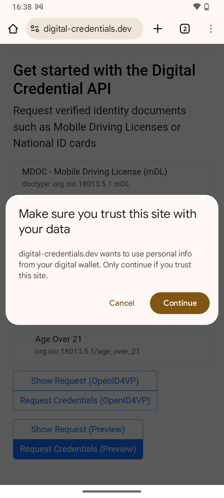
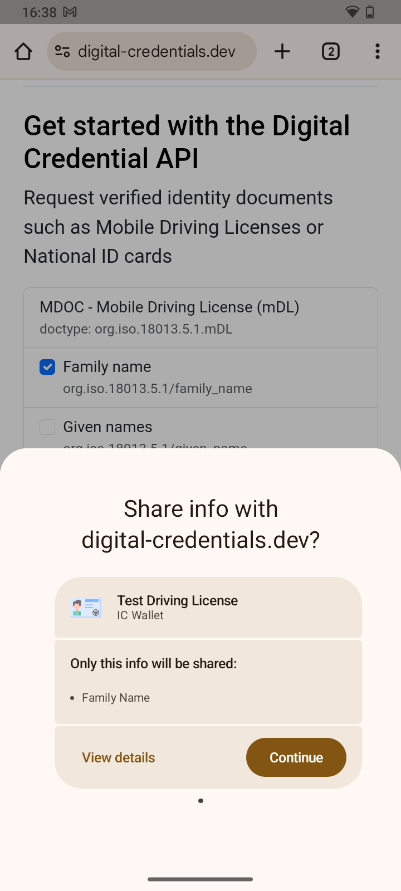
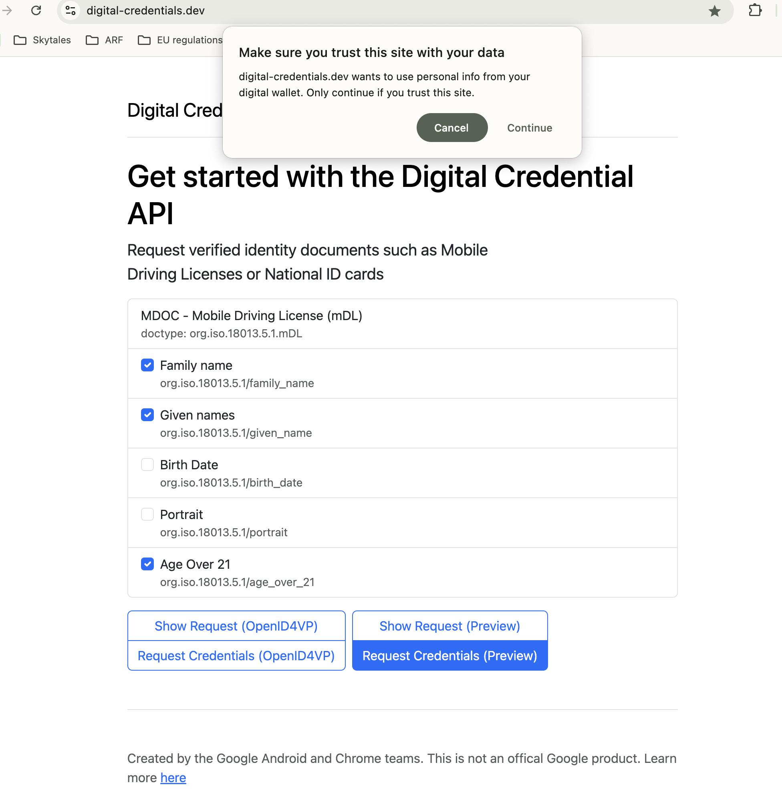
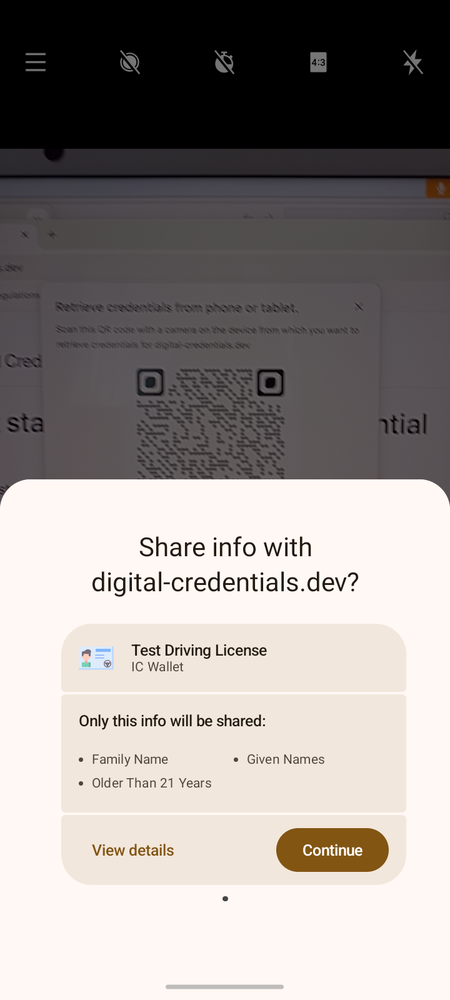

# F - Digital Credentials API

Version 1.1, updated 20 February 2025

## 1. Introduction

### 1.1 Discussion Paper topic description

This document is the Discussion Paper for the European Digital Identity Cooperation Group regarding Topic F: Digital Credentials API (formerly known as 'the browser API').

The ARF Development Plan [ARF_DevPlan] describes this Topic as follows:

*Define high-level requirements for the interface between the wallet and browsers and/or
the operating system. These requirements are currently under discussion and being
standardised through the Digital Credentials API at W3C. The protocols to be used with
this API, including message structures and contents, are being standardised by ISO and
the OpenID Foundation.*

### 1.2 Related risks in the Risk Register

The risk register for European Digital Identity Wallets [RiskRegister]
contains the following risks that are related to the use of the Digital
Credentials API:

|Risk type | Risk id | Related risk titles|
|-------------|-------|-------------------|
|High-level risks to the wallets | R5 | Data theft |
|High-level risks to the wallets | R6 | Data disclosure|
|High-level risks to the wallets | R9 | Unauthorised transaction|
|High-level risks to the wallets | R10 | Transaction manipulation|
|High-level risks to the wallets | R13 | Service disruption |
|High-level risks to the wallets | R14 | Surveillance|
|System-related risks | SR3 | Legal non-compliance|

|R5 Data theft |
|---|
| Data theft is defined as the unauthorised extraction of data. Data theft is also associated to threats, such as data interception (unauthorised capture of data in transit) and data decryption (unauthorised decoding of encrypted data), which are likely to lead in some cases to Data disclosure (R6). |

| R6 Data disclosure |
|---|
|Data disclosure is defined as the unauthorised exposure of personal data including special categories of personal data. The privacy breach risk is very similar when considered from a privacy rather than security viewpoint. |

|R9 Unauthorised transaction |
|---|
| Unauthorised transactions are defined as operational activities conducted without the permission or knowledge of the wallet user. In many cases, an unauthorised transaction can lead to Identity theft (R4) or Data disclosure (R6). It is also related to unauthorised transactions, such as the misuse of cryptographic keys. |

|R10 Transaction manipulation|
|---|
| Transaction manipulation is defined as the unauthorised alteration of operations in the wallet. Transaction manipulation is an attack on integrity, and it is related to a data integrity breach. |

|R13 Service disruption|
|---|
|Service disruption is defined as an interruption or degradation in the normal operation of the wallet. A specific kind of service disruption is user lock-out, defined as the inability of a user to access their account or their wallet. |

|R14 Surveillance|
|---|
|Surveillance, or monitoring, is defined as the unauthorised tracking or observation of a wallet user's activities, communication, or data. Surveillance is often related to inference, which is defined as the deduction of sensitive or personal information from seemingly innocuous data. |

|SR3 Legal non-compliance|
|---|
|Legal non-compliance is defined as a situation when relevant laws, regulations or standards cannot be adhered to. In the context of the wallet, as security and privacy of the solution are legal requirements, all threats are likely to lead to some kind of legal non-compliance. |

More specifically, [RiskRegister]  describes the following threats to a Wallet:

|ID | Threat description | Related risks |
|---------|-------|-------------------|
|TR25 | The wallet can present attributes to a relying party without the approval of a user. | Data disclosure (R6) |
|TR28 | An attacker can get a user into wrongfully approving a request for electronic attestations of attributes (phishing or other). | Data disclosure (R6)|
|TR29 | An attacker can leak attributes from the wallet and identify the wallet user where identification is not required/allowed. | Data disclosure (R6)|
|TR31| A request can be leaked to an attacker. | Data disclosure (R6)|
|TR34| An attacker can know whether a wallet is installed on the same device he is using, or on another one, and get information on it. | Data disclosure (R6)|
|TR50| An attacker can eavesdrop during the connection from the wallet to relying parties. | Data theft (R5) / Data disclosure (R6)|
|TR50| An attacker can convince a user to share personal data (i.e. PID, EAA-s, pseudonyms, electronic signatures, logs and other data) with the attacker or with a third party that the user did not intend to do so.| Data theft (R5) / Data disclosure (R6)|
|TR76| A relying party can send multiple invalid requests. | Service disruption (R13)|
|TR80| An attacker can block transactions by relying parties, users and/or PID provider. | Service disruption (R13)|
|TR88| Attackers can make changes to a request's metadata (service name, usages, etc.).| Transaction manipulation (R10)|
|TR93|An attacker can replace or modify the PID during its transfer from the wallet unit to the online relying party. | Transaction manipulation (R10)|
|TR103|The user behind the relying party - browser connection can be different from the user behind the relying party - wallet connection. | Unauthorised transaction (R9) / Data disclosure (R6) / Identity theft (R4)|
|TR105| An attacker can perform man-in-the-middle attacks | Unauthorised transaction (R9) / Data disclosure (R6) / Surveillance (R14)|

## 1.3 Key words

This document uses the capitalised key words 'SHALL', 'SHOULD' and 'MAY' as
specified in RFC 2119, i.e., to indicate requirements, recommendations and
options specified in this document.

In addition, 'must' (non-capitalised) is used to indicate an external
constraint, for instance a self-evident necessity or a requirement that is
mandated by an external document. The word 'can' indicates a capability, whereas
other words, such as 'will' and 'is' or 'are' are intended as statements of
fact.

## 1.4 Document structure

This document is structured as follows:

- Chapter 2 introduces the Digital Credentials API
- Chapter 3 presents the functionality expected from the Digital Credentials API so
it can be used in the context of ARF.
- Chapter 4 lists the additions and changes that will be made to the ARF
as a result of discussing this topic with Member States.

## 2. Digital Credentials API

### 2.1 Overview

### Problem Statement

Remote transaction flows are use cases in which the Relying Party Instance
is remote from the User and the User device. The Relying Party Instance accesses
the Wallet Instance over the internet, using a browser. These use cases can be
further distinguished in same-device flows, in which the browser is running on
the same device as the Wallet Unit, and cross-device flows, where the browser is
on a different device.

Remote presentation flows come with a number of challenges:

- **1. Secure Cross-Device Flows**: Cross-device flows are vulnerable to
phishing and relay attacks, necessitating enhanced security measures.
- **2. Wallet Unit Selection and Invocation**:  In remote flows, where interactions do
not originate from the Wallet Unit, Users may encounter difficulties in selecting and
invoking the appropriate Wallet Instance to fulfill a specific presentation request,
particularly when multiple Wallet Units are present on the device.
- **3. Invocation Mechanism**: Establishing a communication channel between the Wallet Unit
and the remote Relying Party Instance presents challenges due to inconsistent invocation methods.
One approach considered by standardization bodies involves using custom URI schemes, such as "mdoc://"
or "openid4vp://". In this approach, the operating system would trigger the Wallet Unit
when the Relying Party Instance requests a connection via a custom URI. However, relying on custom
URI schemes introduces variability in user experiences across different browsers and operating systems,
resulting in operational inefficiencies and potential security risks.
- **4. Clear Origin Verification**: Protecting against relay attacks requires precise
identification of the Relying Party Instance's origin.
- **5. Session binding**: When presenting a PID or attestation to a remote Relying Party,
users have to switch contexts. Existing protocols may enable attacks where the contexts are not
"bound" to each other resulting in session "hijacking".

### Proposed solution

Digital Credentials API [Cred_API] is a possible solution to the identified
challenges. Digital Credentials API has the potential to enhance usability, scalability,
and security while providing a consistent and reliable user experience.

Digital Credentials API is a Draft Community Group report of the
Web Platform Incubator Community Group (WICG) that builds upon Credential
Management Level 1 API W3C Working Draft [Cred_Man]. The goal of the Digital
Credentials API is to enable user agents (i.e., browsers) to mediate access to,
and presentation of, attestations. Currently, attestation issuance is not in the
scope of this API, but future versions [will consider it](
https://github.com/WICG/digital-credentials/issues/167). The Digital Credentials
API can be used, for example, by a Relying Party website to request a PID or
(Q)EAA stored in a Wallet Unit through the User's browser. The browser and the
Wallet Unit may be in the same device (same-device flow) or in separate devices
but in proximity (cross-device flow).

The Digital Credentials API can address the challenges related to remote presentation
flows as follows:

- **1. Secure Cross-Device Flows**: The Digital Credentials API enables  a secure transport with
proximity checks for cross-device requests
- **2. Wallet Unit Selection and Invocation**: The Digital Credentials API enables a unified interface
provided by the web browser and the operating system, which can streamline this
process, offering a seamless and intuitive user experience.
- **3. Invocation Mechanism**: The Digital Credentials API does not need custom URL schemes
for invoking a Wallet Unit.
- **4. Clear Origin Verification**: The Digital Credentials API enables including the origin
information, such as the website domain or app package name, within the presentation request
ensuring the authenticity of the request and enhancing trust for both Wallet Units and Users.
- **5. Session binding**: The Digital Credentials API allows information about a session
to be embedded in a presentation request. At the same time the browser and the operating
system handles context switching preventing session hijacking.

### 2.2 Relying Party - Wallet Unit interaction

Using the Digital Credentials API, a Relying Party can interact with a Wallet
Unit using a website and through a browser.

The current version of Digital Credentials API extends Credential Management
Level 1 API (the same API used by WebAuthn/passkeys) to allow websites to request
an attestation. This is achieved by providing a sequence of `presentation
requests`, where each presentation request includes an `exchange protocol` and
`request data`. The format of the request data are specific to the exchange
protocol. The Digital Credentials API specifications will include a registry of
supported protocols.

As a next step, the browser sends the request to the operating system which
searches matching attestations in installed Wallet Units. The cross-device
flow can be used to search for matching attestations in Wallet Units installed
in a different device, located in close proximity to the browser. If more than
one matching attestation is found, the browser prompts the User to select one.
As a next step, request data is sent to the corresponding
Wallet Unit. Then, the Wallet Unit asks user consent and generates a
presentation based on the selected exchange protocol. The presentation is
relayed back to the Relying Party's website.

As of January 2025, Digital Credentials API support is provided only by the Chrome
browser and the Android mobile operating system. In this experimental implementation there
exists a method for Wallet Units to indicate to a component, which is part of
the Wallet Solution and it is referred to as the "matcher" in the current Android-specific
implementation, the availability of attestations and,
optionally, attributes included in the attestation. An example [can be found here](
https://digitalcredentials.dev/docs/wallets/android/#the-provider-api). This
Android-specific documentation mentions that the information provided by the Wallet Unit is used
by the Android operating system to render a selector, allowing Users to make an
informed choice about which attestation to proceed with.

#### 2.2.1 Same-device flow

As of January 2025, the same-device flow is
implemented using the following steps:

- The User visits the website of the Relying Party and indicates that they want to present some attributes from installed Wallet Units.
- The browser asks permission from the User to allow Digital Credentials API invocation from this particular website.

- The Relying Party indicates to the browser which attributes they want to request by creating a `presentation request`.
- The operating system searches for attestations that satisfy the requested attributes.
- The browser presents to the User a selector that includes a list of potentially suitable attestations.

- The User selects an attestation. The operating system invokes the Wallet Unit providing as input the selected attestation and the request data.
- The Wallet Unit processes the request according to the relevant specification (e.g., OpenID4VP) and returns the requested
attributes through the browser, provided that the Wallet Unit contains the attributes, all required verifications pass and the User consents.

#### 2.2.2 Cross-device flow

The cross-device flow is implemented using the following steps:

- The User visits the website of the Relying Party and indicates that they want to present some attributes from installed Wallet Units.
- The browser asks permission from the User to allow Digital Credentials API invocation from this particular website.

- The Relying Party  indicates to the browser which attributes they want to request by
creating a `presentation request`.
- The browser uses CTAP 2.2 hybrid flow (section 11.5 of [Ctap]) to establish a tunnel between the
browser and the device where the Wallet Unit is installed (this is the same flow used by WebAuthn/passkeys).
From a high level this is implemented as follows: (i) The browser presents a QR code which
includes information about the tunnel endpoint and keys that can be used for establishing
a secure session, (ii) the user scans the QR code using the device camera, (iii) the device
where the Wallet Unit is installed emits a BLE advertisement which is received by the
browser. The advertisement includes in an encrypted form information required for
establishing the secure tunnel. This advertisement is used as a proximity check,
(iv) The tunnel is established.

- The presentation request is transferred through the tunnel to the device operating system.
- The device operating system presents to the User a selector that includes a list of potentially suitable attestations.

## 3. Expectations from the Digital Credentials API

This section presents the functionality expected from the Digital Credentials API so
it can be used in the context of ARF

### 3.1 Expected functionality

1. **Wallet Selection and Invocation for attestation presentation**: The Digital Credentials API should
 enable a browser or OS to search for Wallet Units containing attestations
 that potentially match the request of the Relying Party, addressing user
 experience and scaling concerns caused by custom URI-based or universal link
(a.k.a. app link)-based approaches.​

2. **Wallet Selection and Invocation for attestation issuance**: The Digital Credentials API should
 enable a browser or OS to search for Wallet Units that can handle an attestation offer
 from a specific Attestation Provider, addressing user
 experience and scaling concerns caused by custom URI-based or universal link
(a.k.a. app link)-based approaches.​​

3. **Secure Cross-Device Flows**: The Digital Credentials API should enable
APIs and protocols (e.g., CTAP2) that ensure secure cross-device engagement, mitigating
threats such as phishing and relay attacks.

4. **Protocol support**: The Digital Credentials API should support the protocols
specified in the Implementing Acts as remote presentation protocols for attestations
and attestation issuance.

### 3.2 Responsibilities

The Digital Credentials API should operate as a secure transport layer, allowing all parties
to fulfill their requirements as specified in Annex 2 of ARF. Browsers and operating systems
facilitating remote transaction flows should not act on behalf of Attestation Providers, Relying Parties or Wallet
Units. Particularly:

1. **Consent**: Wallet Units and Relying Parties should handle user consent for attribute requests
and presentations. The Digital Credentials API should not add an additional consent layer to the
workflow for presenting attributes stored in a Wallet Unit.

2. **Relying Party Authentication**: Wallets Units are responsible for authenticating Relying Parties before delivering
attribute payloads. The Digital Credentials API should provide sufficient information to Wallet Units about the
presentation request origin and other necessary context information, allowing Wallet Units to
identify and authenticate Relying Parties, as well as to verify that the request from the Relying Party
was not copied and replayed.

3. **Attestation Provider and Relying Party Authorisation**: Although browsers and operating systems implementing
the Digital Credentials API should verify the web origin of Attestation Providers and Relying Parties, as well as that
the credential offers and presentation requests are transferred over TLS from the Attestation Provider or
the Relying Party to the browser, they should not decide which Attestation Providers or Relying Parties are authorised to
issue attestations or request attributes as this responsibility
lies with national issuers and regulators, including Relying Party registrars.

4. **Wallet Unit sovereignty**. When the Digital Credentials API is used, the operating
system should not override or remove control from the Wallet Unit. The User's Wallet Unit
should retain full authority over attestation management, including issuance, storage, and
presentation. This ensures that the Wallet Unit remains the trusted component for safeguarding
user data and interactions. The operating system and browser should not disrupt the Wallet Unit's
security functions.

### 3.3 Technological Neutrality and Cross-Platform Interoperability

The Digital Credentials API should preserve technological neutrality and avoid
any reliance on vendor-specific extensions. Particularly:

1. **Attestation format neutrality**: The Digital Credentials API should be neutral
and open with respect to the format of attestations to be used. For example, if a
"Registry of Protocols for Requesting Digital Credentials" is utilised, adding or
removing protocols to the registry should follow established criteria and processes,
and involve multiple stakeholders. Adding or removing protocols to the registry
should follow established criteria and processes, and involve multiple stakeholders.
The criteria and processes should be transparent, objective and non-discriminatory;
in other words well-governed.

2. **Cross-platform compatibility and interoperability**. The Digital Credentials
API should be compatible with most browsers and operating systems, and should
provide cross-platform interoperability, ensuring users are not locked into a
specific vendor's browser or operating system

3. **Wallet Solution neutrality**.  Any approved Wallet Solution should be able
to use the Digital Credentials API. Usage of the API should not require additional
vetting processes by vendors or impose constraints on Wallet Providers other than
those required by the EU.

### 3.4 Privacy preservation

The use of the Digital Credentials API should not compromise User privacy. In more detail:

1. **Privacy preserving searching**: Wallet Units may have to "indicate" to the Digital Credentials
API framework the availability of attestations, to facilitate their discovery and use.
However, this process should be designed and implemented in a way that it does not introduce
privacy threats, such as exposing attribute values to any other party, including the OS/browser
vendor, other applications on the same device, other users of the same device, or Relying Parties.
Similarly, the OS should have access only to the bare minimum information required to
implement the search functionality and must ensure that no third party can access this information.

2. **Privacy preserving attestation relay**:  The use of a browser as an intermediary in the attestation
issuance and presentation process should not create privacy risks, such as those arising from malicious add-ons
or unauthorised tracking mechanisms. Browsers should maintain strict privacy controls to ensure
that attestation-related data is neither exposed nor accessible to unauthorised third parties.
This principle also extends to any tunneling services used to facilitate cross-device flow.

3. **Protection against data theft**: Browsers and operating systems providing support for
the Digital Credentials API should minimise the threat of data theft and disclosure through
eavesdropping on the communication between the Wallet Unit and the Attestation Provider or
Relying Party's website.

### 3.5 Availability preservation

The use of the Digital Credentials API should not enable Denial-of-Service
attacks against Wallet Units. Particularly:

1. **DoS protection**. The use of the Digital Credentials API should not facilitate Attestation Provider or Relying
Parties to perform Denial of Service attacks against Wallet Units, e.g., by enabling an Attestation Provider or Relying Party
to send multiple invalid requests. Similarly, the use of the Digital Credentials API should not enable
attackers to block transactions by Relying Parties and Wallet Units.

## 4 Additions and changes to the ARF

### 4.1 High-Level Requirements to be added to Annex 2

The following High-Level Requirements will be added to Annex 2 of the ARF:

#### 4.1.1 Requirements to be added (likely) to Topic 1

##### REQUIREMENT 1

A Wallet Unit and a Relying Party Instance receiving an attestation from the Wallet
Unit SHALL ensure that the attributes included in the presented attestation are
accessible only to the Relying Party, by encrypting the presentation response.
This SHALL include preventing decryption of the presentation response or Man-in-the-Middle
attacks by the browser, the operating system, or other components between the Wallet
Unit and the Relying Party.

##### Conditional Requirements

Providing that the expectations set in chapter 3 are met, the following two
High-Level Requirements will be added (likely) to Topic 1:

###### REQUIREMENT 2 (conditional)

Wallet Units and Relying Party Instances SHALL support the Digital Credentials API for remote
presentation flows.

###### REQUIREMENT 3 (conditional)

A Wallet Unit SHALL disclose the presence of all stored attestations and attributes to the Digital
Credentials API framework, but SHALL NOT disclose the value of the attributes in
these attestations.

Note: This restriction applies even if such disclosure would enhance the services
provided by the operating system to the Wallet Unit, for example, attestation selection
in the context of the Digital Credentials API.

###### REQUIREMENT 4 (conditional)

A Relying Party's request MAY be processed by the browser for searching available
attestations, for preventing fraud targeting the user, or for troubleshooting purposes.
It SHOULD be processed by the browser for user security purposes. It SHALL NOT be
processed by the browser for market analysis purposes (including as a secondary
purpose) or the browser’s own purposes.

#### 4.1.2 Requirements to be added (likely) to Topic 10/23

##### Conditional Requirements

Providing that the expectations set in chapter 3 are met, the following
High-Level Requirement will be added (likely) to Topic 10/23:

###### REQUIREMENT 5  (conditional)

Wallet Units and Attestation Providers SHALL support the Digital Credentials API
for attestation issuance.

### 4.2 High-Level Requirements to be changed

#### RPA_01

The following text will be appended to RPA_01 "The Wallet Unit SHALL retain full authority over
this process, for example, this process SHALL NOT be handled by a third party, including the
browser and the operating system."

#### RPA_07

The following text will be appended to RPA_07 "The Wallet Unit SHALL retain full authority over
this process, for example, this process SHALL NOT be handled by a third party, including the
browser and the operating system."

## 6 References

| Reference | Description |
| --- | --- |
| [RiskRegister] | Annex 1 to the Commission Implementing Regulation laying down rules for the application of Regulation (EU) No 910/2014 of the European Parliament and of the Council as regards the certification of the European Digital Identity Wallets, European Commission, October 2024, draft |
| [ARF_DevPlan] | Architecture and Reference Framework Development plan 2025, European Commission, v1.0, final |
| [Cred_API] | Digital Credentials, Draft Community Group Report, 20 February 2025, available at [https://wicg.github.io/digital-credentials/](https://wicg.github.io/digital-credentials/)|
| [Cred_Man] | Credential Management Level 1, 13 August 2024, available at [https://www.w3.org/TR/credential-management-1/](https://www.w3.org/TR/credential-management-1/)|
| [Ctap] | Client to Authenticator Protocol (CTAP) Review Draft, March 21, 2023, available at [https://fidoalliance.org/specs/fido-v2.2-rd-20230321/fido-client-to-authenticator-protocol-v2.2-rd-20230321.html](https://fidoalliance.org/specs/fido-v2.2-rd-20230321/fido-client-to-authenticator-protocol-v2.2-rd-20230321.html)|
