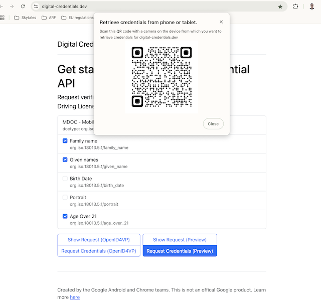
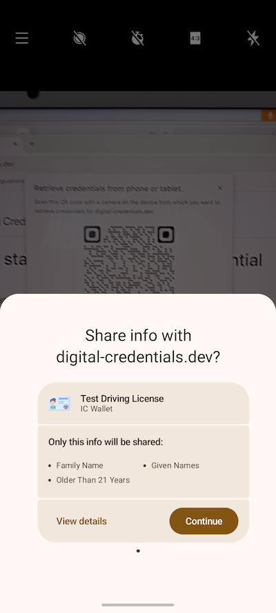

Version 0.2, updated 18 December 2024

# F - Digital Credentials API (former known as browser API)

## 1. Introduction 

### 1.1 Discussion Paper topic description
This document is the Discussion Paper for eIDAS Coordination Group regarding Topic F: Digital Credential API (former known as browser API). 

The ARF Development Plan \[ARF\_DevPlan\] describes this Topic as follows:

*Define high-level requirements for the interface between the wallet and browsers and/or
the operating system. These requirements are currently under discussion and being
standardized through the Digital Credential API at W3C. The protocols to be used with
this API, including message structures and contents, are being standardized by ISO and
the OpenID Foundation.*

### 1.2 Related risks in the Risk Register
The risk register for European Digital Identity Wallets \[RiskRegister\] contains the following risks that are related to the use of the Digital Credentials API:

|Risk type | Risk id | Related risk titles|
|-------------|-------|-------------------|
|High-level risks to the wallets | R5 | Data theft |
|High-level risks to the wallets | R6 | Data disclosure|
|High-level risks to the wallets | R9 | Unauthorised transaction|
|High-level risks to the wallets | R10 | Transaction manipulation|
|High-level risks to the wallets | R13 | Service disruption |
|High-level risks to the wallets | R14 | Surveillance|
|System-related risks | SR3 | Legal non-compliance|

|R5 Data theft |
|---|
| Data theft is defined as the unauthorised extraction of data. Data theft is also associated to threats, such as data interception (unauthorised capture of data in transit) and data decryption (unauthorised decoding of encrypted data), which are likely to lead in some cases to Data disclosure (R6). |

|R6 Data disclosure |
|---|
|Data disclosure is defined as the unauthorised exposure of personal data including special categories of personal data. The privacy breach risk is very similar when considered from a privacy rather than security viewpoint. |

|R9 Unauthorised transaction |
|---|
| Unauthorised transactions are defined as operational activities conducted without the permission or knowledge of the wallet user. In many cases, an unauthorised transaction can lead to Identity theft (R4) or Data disclosure (R6). It is also related to unauthorised transactions, such as the misuse of cryptographic keys. |

|R10 Transaction manipulation|
|---|
| Transaction manipulation is defined as the unauthorised alteration of operations in the wallet. Transaction manipulation is an attack on integrity, and it is related to a data integrity breach. |

|R13 Service disruption|
|---|
|Service disruption is defined as an interruption or degradation in the normal operation of the wallet. A specific kind of service disruption is user lock-out, defined as the inability of a user to access their account or their wallet. |

|R14 Surveillance|
|---|
|Surveillance, or monitoring, is defined as the unauthorised tracking or observation of a wallet user’s activities, communication, or data. Surveillance is often related to inference, which is defined as the deduction of sensitive or personal information from seemingly innocuous data. |

|SR3 Legal non-compliance|
|---|
|Legal non-compliance is defined as a situation when relevant laws, regulations or standards cannot be adhered to. In the context of the wallet, as security and privacy of the solution are legal requirements, all threats are likely to lead to some kind of legal non-compliance. |

More specifically, \[RiskRegister\]  describes the following threats to a Wallet: 

|ID | Threat description | Related risks |
|---------|-------|-------------------|
|TR25 | The wallet can present attributes to a relying party without the approval of a user. |  Data disclosure (R6)  |
|TR28 | An attacker can get a user into wrongfully approving a request for electronic attestations of attributes (phishing or other). | Data disclosure (R6)|
|TR29 | An attacker can leak attributes from the wallet and identify the wallet user where identification is not required/allowed. | Data disclosure (R6)|
|TR31|	A request can be leaked to an attacker. | Data disclosure (R6)|
|TR34|	An attacker can know whether a wallet is installed on the same device he is using, or on another one, and get information on it. | Data disclosure (R6)|
|TR50|	An attacker can eavesdrop during the connection from the wallet to relying parties. | Data theft (R5) / Data disclosure (R6)|
|TR50|	An attacker can convince a user to share personal data (i.e. PID, EAA-s, pseudonyms, electronic signatures, logs and other data) with the attacker or with a third party that the user did not intend to do so.| Data theft (R5) / Data disclosure (R6)|
|TR76| A relying party can send multiple invalid requests. | Service disruption (R13)|
|TR80| An attacker can block transactions by relying parties, users and/or PID provider. | Service disruption (R13)|
|TR88| Attackers can make changes to a request’s metadata (service name, usages, etc.).|  Transaction manipulation (R10)|
|TR93|An attacker can replace or modify the PID during its transfer from the wallet unit to the online relying party. | Transaction manipulation (R10)| 
|TR103|The user behind the relying party – browser connection can be different from the user behind the relying party – wallet connection. | Unauthorised transaction (R9) / Data disclosure (R6) / Identity theft (R4)|
|TR105|	An attacker can perform man-in-the-middle attacks | Unauthorised transaction (R9) / Data disclosure (R6) / Surveillance (R14)

## 1.3 Key words
This document uses the capitalized key words ‘SHALL’, ‘SHOULD’ and ‘MAY’ as specified in RFC 2119, i.e., to indicate requirements, recommendations and options specified in this document. 

In addition, ‘must’ (non-capitalized) is used to indicate an external constraint, for instance a self-evident necessity or a requirement that is mandated by an external document. The word ‘can’ indicates a capability, whereas other words, such as ‘will’ and ‘is’ or ‘are’ are intended as statements of fact.
## 1.4 Document structure
This document is structured as follows:
 - Chapter 2 introduces Digital Credentials API
 - Chapter 3 proposes High Level Requirements
 - Chapter 4 discusses potential changes to the ARF

## 2. Digital Credentials API 
### 2.1 Overview
Digital Credentials API \[Cred_API\] is a Draft Community Group report of the Web Platform Incubator Community Group (WICG) that builds upon Credential Management Level 1 API W3C Working Draft \[Cred_Man\]. The goal of the Digital Credentials API is to enable user agents (i.e., browsers) to mediate access to, and presentation of, attestations. Currently, attestation issuance is not in the scope of this API, but future versions [may consider it]( https://github.com/WICG/digital-credentials/issues/167). The Digital Credentials API can be used, for example, by a Relying Party website to request a PID or (Q)EEA stored in a Wallet Unit through the User’s browser. The browser and the Wallet Unit may be in the same device (same-device flow) or in separate devices but in proximity (cross-device flow). 

The Digital Credentials API offers three main advantages:
 * It removes the need for custom URL schemes for invoking a Wallet Unit
 * It provides a secure transport with proximity checks for cross-device requests
 * In case multiple Wallet Units are present on the device, it enables Wallet Unit selection by the browser/OS, either on the basis of data registered for each Wallet Unit or through User interaction.

### 2.2 RP- Wallet Unit interaction
Using the Digital Credential API, a Relying Party can interact with a Wallet Unit using a website and through a browser.

The current version of Digital Credentials API extends Credential Management Level 1 API (the same API used by Passkey/WebAuthN) to allow websites to request an attestation. This is achieved by providing a sequence of `presentation requests`,  where each presentation request includes an `exchange protocol` and `request data`. The format of the request data are specific to the exchange protocol. The Digital Credentials API specifications will include a registry of supported protocols. 

As a next step, the browser sends the request to the operating system which searches matching attestations in installed Wallet Units. The cross-device flow can be used for searching in a remote device. If any attestation is found, the user is prompted to select one and the request data is sent to the corresponding Wallet Unit. Then, the Wallet Unit asks user concent and generates a presentation based on the selected exchange protocol. The presentation is relayed back to the Relying Party's website.

Currently, Digital Credentials API support is provided only by the Chrome browser and the Android mobile operating system. In this implementation there exists a method for Wallet Units to indicate to a "matcher", which is a module provided by the Wallet Provider, the availability of attestations and, optionally, attributes included in the attestation. For instance, [this is how this can be done in Android]( https://digitalcredentials.dev/docs/wallets/android/#the-provider-api). According to the provided documentation: 

> All Android requires is that the wallet (via the matcher) provides enough information about the credential and the requested attributes that we can render a selector. This information allows the user to make an informed choice about which document to proceed with.

#### 2.2.1 Same-device flow
The same-device flow is currently implemented using the following steps:

1. The User visits the website of the Relying Party and indicates that they want to present some attributes from their Wallet Unit
1.	The browser asks consent from the User to allow Digital Credentials API invocation from this particular website.

1. The Relying Party website indicates to the browser which attributes they want to request by creating a `presentation request`. 
1. The operating system searches for attestations that satisfy the requested attributes. 
1.	The browser presents to the User a selector that includes a list of potentially suitable attestations.

1.	The User selects an attestation. The operating system invokes the Wallet Unit providing as input the selected attestation and the request data 
1.	The Wallet Unit processes the request according to the relevant specification (e.g., OpenID4VP) and returns the requested attributes through the browser, provided that the Wallet Unit contains the attributes, all required verifications pass and the User consents

 

#### 2.2.2 Cross-device flow 
The cross-device flow is implemented using the following steps:
1. The User visits the website of the Relying Party and indicates that they want to present some attributes from their Wallet Unit
1.	The browser asks consent from the User to allow Digital Credentials API invocation from this particular website.

1. The Relying Party website indicates to the browser which attributes they want to request by creating a `presentation request`. 
1.	The browser uses CTAP 2.2 hybrid flow (section 11.5 of \[Ctap\]) to establish a tunnel between the browser and the device where the Wallet Unit is installed (this is the same flow used by Passkey). From a high level this is implemented as follows:
    *	The browser presents a QR code which includes information about the tunnel endpoint and keys that can be used for establishing a secure session
    *	The device where the Wallet Unit is installed emits a BLE advertisement which is received by the browser. The advertisement includes in an encrypted form information required for establishing the secure tunnel. This advertisement is used as a proximity check.
    *	The user scans the QR code using the device camera and a tunnel is established

1. The presentation request is transferred through the tunnel to the device operating system    
1.	The device operating system presents to the User a selector that includes a list of potentially suitable Wallet Units.

1.	The User selects an attestation. The operating system invokes the Wallet Unit providing as input the selected attestation and the request data 
1.	The Wallet Unit sends through the tunnel to the browser a suitable presentation

## 3. High level requirements for Digital Credentials API 

### Technological Neutrality and Cross-Platform Interoperability 
The Digital Credentials API SHALL preserve technological neutrality and avoid any reliance on vendor-specific extensions. 

*	Furthermore, the use of the Digital Credentials API SHALL provide  cross-platform interoperability, ensuring users are not locked into a specific vendor’s browser or operating system. 
*	Similarly, the use of the API SHALL only be considered if it can be used by any approved EUDI wallets (e.g., without requiring additional vendor vetting process or imposing constraints on Wallet Providers other than those required by the EU). 

### Security preservation
The use of the Digital Credentials API SHALL not compromise the security of User. To achieve this:
*	The API inherently requires an active role from both the browser and the operating system to facilitate interactions with Wallet Units. This SHALL not result in decreased security. 
*	Similarly, the use of the Digital Credentials API SHALL not interfere with or undermine the wallet’s ability to properly authenticate Relying Parties. 
*	Furthermore, when leveraging the Digital Credentials API, the operating system SHALL not override or remove control from the Wallet Unit. The User’s Wallet Unit SHALL retain full authority over attestation management, including issuance, storage, and presentation. This ensures that the wallet remains the trusted component for safeguarding user data and interactions. The operating system and browser SHALL not disrupt the wallet’s security functions. 
*	The use of the Digital Credentials API SHALL not facilitate phishing attacks

### Privacy preservation
The use of the Digital Credentials API SHALL not compromise User privacy. To achieve this:

*	Wallet Units SHALL “register” the available attestations and attributes to the operating system to facilitate their discovery and use. However, this process SHALL be designed and implemented in a way that it does not introduce privacy threats, such as exposing metadata about the User’s attestations to uto any other party, including the OS/browser vendor, other applications on the same device, other users of the same device, or Relying Parties.
*	Similarly, the use of a browser as an intermediary in the attestation exchange process SHALL not create privacy risks, such as those arising from malicious add-ons or unauthorized tracking mechanisms. Browsers SHALL maintain strict privacy controls to ensure that attestation-related data is neither exposed nor accessible to unauthorized third parties. This principle also extends to any tunneling services used to facilitate cross-device flow.
*	Browsers and operating systems providing support for the Digital Credentials API SHALL minimize the threat of data theft and disclosure through eavesdropping the communication between the Wallet Unit and the RP’s website

### Availability preservation
The use of the Digital Credentials API SHALL account for failures in the process of relaying request presentations and responses, and  SHALL not enable Denial-of-Service attacks against Wallet Units. Particularly: 

*	Within the API’s architecture, the Wallet Unit and the Relying Party do not communicate directly; instead, attestation exchanges are relayed through intermediaries, such as the browser, operating system, or tunneling services. This indirect communication model introduces potential points of failure, and solutions SHALL account for these risks to ensure uninterrupted availability. To address such risks, fallback mechanisms SHALL be provided to maintain service continuity
*	The use of the Digital Credentials API SHALL not facilitate Relying Parties to perform Denial of Service attacks against Wallet Units, e.g., by enabling a Relying Party to send multiple invalid requests
*	The use of the Digital Credentials API SHALL not enable attackers to block transactions by Relying Parties and Wallet Units

## 4 Additions and changes to the ARF

## 5 References
<table>
<colgroup>
<col style="width: 19%" />
<col style="width: 80%" />
</colgroup>
<thead>
<tr>
<th>Reference</th>
<th>Description</th>
</tr>
</thead>
<tbody>
<tr>
<td>[RiskRegister]</td>
<td>Annex 1 to the Commission Implementing Regulation laying down rules
for the application of Regulation (EU) No 910/2014 of the European
Parliament and of the Council as regards the certification of the
European Digital Identity Wallets, European Commission, October 2024,
draft</td>
</tr>
<tr>
<td>[ARF_DevPlan]</td>
<td>Architecture and Reference Framework Development plan 2025, European
Commission, v0.91, final draft</td>
</tr>
<tr>
<td>[Cred_API]</td>
<td>Digital Credentials, Draft Community Group Report, 05 December 2024, available at <a href="https://wicg.github.io/digital-credentials/">https://wicg.github.io/digital-credentials/</a></td>
</tr>
<tr>
<td>[Cred_Man]	</td>
<td>Credential Management Level 1, 13 August 2024, available at <a href="https://www.w3.org/TR/credential-management-1/">https://www.w3.org/TR/credential-management-1/</a></td>
</tr>
<tr>
<td>[Ctap]</td>
<td> Client to Authenticator Protocol (CTAP) Review Draft, March 21, 2023, available at <a href="https://fidoalliance.org/specs/fido-v2.2-rd-20230321/fido-client-to-authenticator-protocol-v2.2-rd-20230321.html">https://fidoalliance.org/specs/fido-v2.2-rd-20230321/fido-client-to-authenticator-protocol-v2.2-rd-20230321.html</a>
</td>

</tr>
</tbody>
</table>