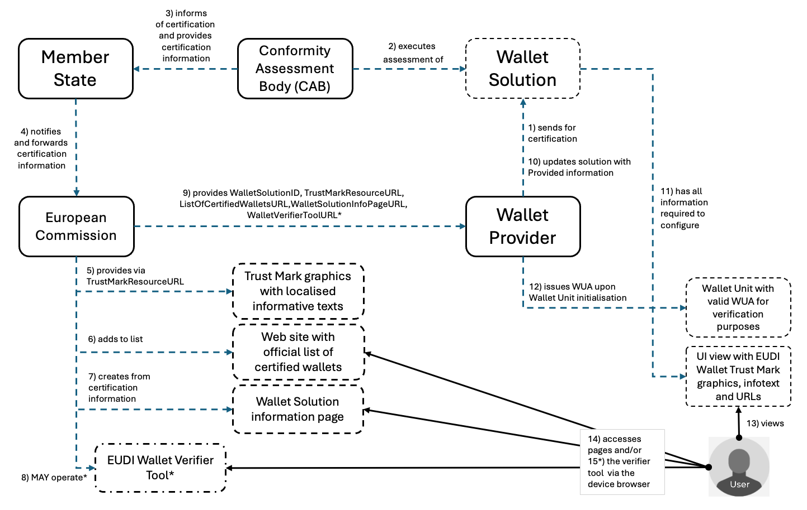

# Topic U - EUDI Wallet Trust Mark

| Version | Date       | Description                                                                |
|---------|------------|----------------------------------------------------------------------------|
| `0.1`   | 21.05.2025 | Initial version                                                            |
| `0.2`   | 03.06.2025 | Updated version after the first session                                    |
| `0.3`   | 05.06.2025 | Updated version after the second session                                   |
| `1.0`   | 02.07.2025 | Final version for publication and inclusion in ARF Release 2.4             |

[GitHub discussion](https://github.com/eu-digital-identity-wallet/eudi-doc-architecture-and-reference-framework/discussions/536)

## 1. Introduction

### 1.1 Discussion Paper topic description

This document is the Discussion Paper for European Digital Identity Cooperation Group regarding Topic U: EUDI Wallet Trust Mark.

The European Commission has released a technical specification on the topic, [Specification of EUDI wallet Trust Mark](https://github.com/eu-digital-identity-wallet/eudi-doc-standards-and-technical-specifications/blob/main/docs/technical-specifications/ts1-eudi-wallet-trust-mark.md), hereafter the [Trust Mark Specification].

### 1.2 Related risks in the Risk Register

The risk register for European Digital Identity Wallets \[RiskRegister\]
contains the following risks that are related to the EUDI Wallet Trust Mark:

|Risk type | Risk id | Related risk titles|
|-------------|-------|-------------------|
|High-level risks to the wallets | R4 | Identity theft |
|High-level risks to the wallets | R5 | Data theft     |
|High-level risks to the wallets | R6 | Data disclosure|

| R4 Identity theft |
|---|
|Identity theft is defined as the unauthorised acquisition of the wallet unit or loss of authentication factors enabling to impersonate a person. |

| R5 Data theft |
|---|
| Data theft is defined as the unauthorised extraction of data. Data theft is also associated to threats, such as data interception (unauthorised capture of data in transit) and data decryption (unauthorised decoding of encrypted data), which are likely to lead in some cases to Data disclosure (R6). |

| R6 Data disclosure |
|---|
|Data disclosure is defined as the unauthorised exposure of personal data including special categories of personal data. The privacy breach risk is very similar when considered from a privacy rather than security viewpoint. |

More specifically, \[RiskRegister\]  describes the following threats to a Wallet:

|ID | Threat description | Related risks |
|---------|-------|-------------------|
| TR51 | An attacker can convince a user to share personal data (i.e. PID, EAA-s, pseudonyms, electronic signatures, logs and other data) with the attacker or with a third party that the user did not intend to do so. | Data theft (R5) / Data disclosure (R6) |
| TR56 | An attacker can propose an application that mimics a specific legitimate wallet to users. | Identity theft (R4) |
| TR107 | An attacker can steal information from a user by spoofing a wallet. |  Effect on various risks  |
| TR124 | An attacker can use phishing to get users to a fake wallet and PID management web application. |  Effect on various risks  |

### 1.3 Key words

This document uses the capitalised key words 'SHALL', 'SHOULD' and 'MAY' as
specified in RFC 2119, i.e., to indicate requirements, recommendations and
options specified in this document.

In addition, 'must' (non-capitalised) is used to indicate an external
constraint, for instance a self-evident necessity or a requirement that is
mandated by an external document. The word 'can' indicates a capability, whereas
other words, such as 'will' and 'is' or 'are' are intended as statements of
fact.

### 1.4 Document structure

- Chapter 2 introduces the legal requirements for EUDI Wallet Trust Mark.
- Chapter 3 describes the problem and objectives of this paper, and the existing HLRs on the topic.
- Chapter 4 presents the agreed technical specification for the EUDI Wallet Trust Mark.
- Chapter 5 discusses introduction of new, or update of existing HLRs in the ARF Annex 2 for realisation of the EUDI Wallet Trust Mark UI views in the Wallet Instances.
- Chapter 6 lists the additions and changes that will be made to the ARF as a result of discussing this topic with Member States.

## 2 Legal requirements for EUDI Wallet Trust Mark in Regulation EU 2024/1183
 - According to Article 3 (50), the EUDI Wallet Trust Mark is defined as **"a verifiable, simple and recognisable indication which is communicated in a clear manner that a European Digital Identity Wallet has been provided in accordance with this Regulation.”**
 - According to Article 5a (5)(a) (iv), **the Trust Mark must be displayed to the User**.
 - According to Article 5a (8)(a), **the Member States shall provide validation mechanisms free-of-charge, in order to: (a) ensure that the authenticity and validity of European Digital Identity Wallets can be verified;**
- According to the Article 5d, the European Commission publishes the list of certified EUDI Wallets as an official list in the Official Journal of the European Union, thus acting as a reference for which Wallet Solutions are certified. **Removal from the list means certification is no longer valid**.

## 3. Problem statement

The purpose of a visible and recognisable trust mark on the EUDI Wallet is to add trust in the EUDI Wallet ecosystem and help the Users to recognise and validate the certification status of the EUDI Wallet Solutions of their EUDI Wallet Provider.

A technical solution exists to verify the certification status of each Wallet Unit before any digital transaction is carried out between the Wallet Unit and its counterparts - the **Wallet Unit Attestation**. As a technical and non-visible attestation towards the Wallet Users it doesn't provide the visibility and recognisability emphasised in the Regulation. A means to deliver a visible trust mark to the Wallet Unit needs therefore to be arranged, and the Users shall be provided means to personally verify the status of the Wallet Solution they depend on.

Neither this discussion paper nor the technical specification is responsible for the visual elements of the EUDI Wallet Trust Mark realisation - responsible entity is a parallel European Commission project that takes input from the Member States and [Trust Mark Specification]. It is stated in the [Trust Mark Specification] that the European Commission is responsible for the EUDI Wallet Trust Mark in terms of graphic design, ownership of the logo registration process and takes responsibility for drafting rules and usage guidelines, and distribution to the designated actors within the ecosystem.

The specification work, which is usually carried out once the HLRs have been defined in the ARF, has already been completed. The Section 3 of the [Trust Mark Specification] specifies the mandatory action-oriented high-level requirements for a simple solution that

* focuses on providing the EUDI Trust Mark logo only to valid Wallet Instances, and
* enables the Wallet Provider to equip each Wallet Instance with links to the EU list of certified EUDI Wallets and the individual (certified) Wallet Solution information page underneath the main list.

The European Commission will provide the EUDI Wallet Trust Mark graphics elements and will host the Wallet Solution specific content that will be displayed to Wallet Users through a browser window opened from the Wallet Instance upon the User making an deliberate action (e.g. a tap/click of a provided link). Two types of URLs are defined; one to open the page containing the general list of certified EUDI Wallets at the time of reviewing the page, the other that contains information specific to the certified Wallet Solution.

**The purpose of this discussion paper is to clarify which additional high-level requirements, if any, should be brought in as new, or updated in the Annex 2 of the Architecture Reference Framework and what should be stated about the EUDI Wallet Trust Mark in the main text of the ARF** based on what has already been agreed to be implemented by the responsible actors in the EUDI ecosystem.

### 3.1 Existing high-level requirements in the ARF

In the current ARF main text, there is no elaboration on the EUDI Wallet Trust Mark. It is marked as item for future discussion - purpose of this discussion paper.

Regarding Annex 2 of the ARF, a requirement to render the trust mark is covered in High Level Requirement DASH_09 in [[Topic 19]](https://github.com/eu-digital-identity-wallet/eudi-doc-architecture-and-reference-framework/blob/main/docs/annexes/annex-2/annex-2.02-high-level-requirements-by-topic.md#a2319-topic-19---user-navigation-requirements-dashboard-logs-for-transparency) on **User navigation requirements**. DASH_08 provided below just to bring in the full context, the Dashboard User Interface:

| **Index** | **Requirement specification** |
|-----------|-----------------|
| DASH_08 | For a natural-person User, a Wallet Instance SHALL provide a User interface. |
| DASH_09 | The User interface referred to in DASH_08 SHALL display an EU Digital Identity Wallet Trust Mark complying with technical specifications. *Note: The Commission will develop technical specifications for this Trust Mark.* |

## 4 Technical specification of the EUDI Wallet Trust Mark

Section 2.1 the [Trust Mark Specification] covers the mandatory part of the EUDI Wallet Trust Mark solution, and the respective requirements for realisation of the solution are covered in Section 3 of the [Trust Mark Specification]. This section covers requirements from the perspectives of the EUDI Wallet Users, the Wallet Providers, the European Commission and the Member States. A few of those requirements may be worth raising in the ARF style of high-level requirements after they have been discussed with the Member States. Section 5 of this discussion paper will cover for this purpose, prior to that a few relevant pieces of the specification are discussed here.

### 4.1 Solution's actors and expected outcomes

The system architecture for delivery of the specified solution is visualised in the [Section 4.2.1](https://github.com/eu-digital-identity-wallet/eudi-doc-standards-and-technical-specifications/blob/main/docs/technical-specifications/ts1-eudi-wallet-trust-mark.md#421-system-architecture) of the [Trust Mark Specification], provided here as a copy for reference:

Figure 1. EUDI Wallet Trust Mark System Architecture

Similarly, a copy of the EU Commission and Wallet Provider -side actor descriptions  #5-7, #9-11 and #13-14 accompanying the system architecture picture (for complete listing see [Section 4.2.2](https://github.com/eu-digital-identity-wallet/eudi-doc-standards-and-technical-specifications/blob/main/docs/technical-specifications/ts1-eudi-wallet-trust-mark.md#422) of the [Trust Mark Specification]) is provided below for convenience:

"The **European Commission's** responsible unit for the Trust Mark information and listing of certified EUDI Wallets manages that
- (5) the EUDI Wallet Trust Mark materials are available online as required behind a web resource (TrustMarkResourceURL)
- (6) the certified Wallet Solution is given a WalletSolutionID, information of the Wallet Solution is added to the official list of certified wallets
- (7) a Wallet Solution specific information page is created and published online

   ...

- (9) the Wallet Provider is sent information required for configuring the certified Wallet Solution and issuing the Wallet Unit Attestation: the assigned _WalletSolutionID_, the _TrustMarkResourceURL_, the _ListOfCertifiedWalletsURL_, the _WalletSolutionInfoPageURL_, and (OPTIONALLY) the _WalletVerifierToolURL_.

...

The **Wallet Provider**, after receiving the information,  
- updates the Wallet Solution asset where needed (10) in order to
- (11) be able to render the Wallet Solution specific EUDI Wallet UI view with expected graphics and other information of the Trust Mark.

...

The **User** can at their discretion
- view (13) the official EUDI Trust Mark information from the UI view of the EUDI Wallet, and 
- (14) access the EUDI Wallet listing and individual Wallet Solution pages."

As such, with these guidelines present the technical specification is clear on how the solution is realised on the system level. It leaves out the definition required for providing 'standard' UI views towards the certification information on a Wallet Unit, as such information (with logo/trust mark graphics and readily localised pieces of information to render) is set for the European Commission to design and release.

## 5 High-Level Requirements for arranging the EUDI Wallet Trust Mark view in the Wallet Instance User Interface

The Wallet User related requirements EWTM-U4 - EWTM-U10 of the [Trust Mark Specification] contain action oriented requirements that bring in a few implementation aspects (for arranging the Wallet UI views, mostly). These requirements are collected to a table below, and a respective new ARF High-Level Requirement text is proposed on the right column, where such makes sense.

The proposed locations for EUDI Wallet Trust Mark related HLRs in the ARF Annex 2, unless a totally new Topic # is wished for, are [Topic 19](https://github.com/eu-digital-identity-wallet/eudi-doc-architecture-and-reference-framework/blob/main/docs/annexes/annex-2/annex-2.02-high-level-requirements-by-topic.md#a2319-topic-19---user-navigation-requirements-dashboard-logs-for-transparency) on User navigation requirements & transport logs, and [Topic 40](https://github.com/eu-digital-identity-wallet/eudi-doc-architecture-and-reference-framework/blob/main/docs/annexes/annex-2/annex-2.02-high-level-requirements-by-topic.md#a2340-topic-40---wallet-instance-installation-and-wallet-unit-activation-and-management) on Wallet Instance installation and Wallet Unit activation and management.

The below table was evolved via discussions in the focus group meetings, the **Bolded text** are suggested modifications to existing HLRs.

| **TS Index** | TS Requirement | **Proposed ARF Index** | **Proposed ARF Requirement specification** |
|--------------|----------------|------------------------|-------------------------------|
| **EWTM-U4**  | As a user of a EUDI Wallet, after installation, I want a means to check that the EUDI Wallet Solution certification is legitimate as part of the EUDI Wallet Instance activation. *Note: Certification related information is made available to the EUDI Wallet Unit via the WUA issuance.*| WIAM_04  | During the activation process of a new Wallet Unit, the Wallet Provider SHALL verify that the new Wallet Instance is a genuine instance of its Wallet Solution **and as part of the User onboarding offer the User a means to check the formal certification information of their Wallet Solution**.                  |
| **EWTM-U5** | As a User of a EUDI Wallet, I want a means to check on demand if the EUDI Wallet Unit that I am currently using is a Certified EUDI Wallet. | DASH_09  | The User interface referred to in DASH_08 SHALL ~~display~~ provide a view with the ~~an~~ EU Digital Identity Wallet Trust Mark **and accompanying information of the certification status of the Wallet Solution** complying with technical specification **provided on the EUDI Wallet Trust Mark**. (Original note to be removed.)    |
| **EWTM-U6** | As a User of a EUDI Wallet, I want to be able to read fresh high-level information of the Certification status when I select (click or tap) a visual indicator (logo) of the EUDI Wallet Trust Mark in the EUDI Wallet Unit. | DASH_13 (New) | The view of DASH_09 SHALL in addition to the Trust Mark provide links to the certification information defined in the technical specification provided on the EUDI Wallet Trust Mark. |
| **EWTM-U7** | As a User of a EUDI Wallet, I want the EUDI Wallet Trust Mark to be always positioned in a standard location (such as UI view or menu item) in the EUDI Wallet Unit. | DASH_14 (New)  | Positioning of the view of DASH_09 in the Wallet UI navigation should follow provided design guidelines from the European Commission. *Note: The information/UI view should probably be offered to the User at first upon Wallet Unit activation (see WIAM_05 in Topic 40) and be located under the 'Settings' or 'About' view or similar of the Wallet Instance. Guidance from the European Commission is expected to the Wallet Providers.* |
| **EWTM-U10** | As a physically impaired User of a EUDI Wallet, I want to have accessibility support within realisation of the requirements set in **EWTM-U4** - **EWTM-U9**. *Note: Accessibility considerations from [WCAG 2.1](https://www.w3.org/TR/WCAG21/) such as screen reader compatibility, color contrast, or keyboard navigation must to be addressed in the end-user implementation and guidelines to be provided. Users with visual impairments, cognitive disabilities, or low digital literacy may face challenges in: - perceiving the Trust Mark (e.g., reliance on visual-only indicators), - understanding certification status (e.g., clarity of meaning in B1-level local language) or - Reacting to certification changes (e.g., what actions should be taken if revoked?)* | (N/A) | *Note: Expecting a separate future discussion topic on Accessibility within the ARF, suggestion is NOT to define particular accessibility HLR/s for the EUDI Wallet Trust Mark.*  |

## 6 Additions and changes to the ARF

### 6.1 High-Level Requirements to be added to Annex 2

#### 6.1.1 New requirements to be added to Topic 19

The following High-Level Requirements will be added in Annex 2 Topic *19* of the ARF:

**REQUIREMENT 1** (**DASH_013**, mandatory)

Positioning of the view of DASH_09 in the Wallet UI navigation SHALL follow provided design guidelines from the European Commission.

#### 6.1.2 New requirements to be added to Topic 40

The following High-Level Requirements will be added in Annex 2 Topic *40* of the ARF:

**REQUIREMENT 2** (**WIAM_10a**, mandatory)

During the activation process of a new Wallet Unit, the Wallet Provider SHALL as part of the User onboarding offer the User a means to check the formal certification information of their Wallet Solution.

### 6.2 High-Level Requirements to be changed in Annex 2

The following requirement is modified in Topic *19* (deletions in strikethrough, changes in bold):

**DASH_09**

The User interface referred to in DASH_08 SHALL ~~display~~ provide a view with the ~~an~~ EU Digital Identity Wallet Trust Mark **, the accompanying general text information on certification of Wallet Solutions, and provide the links to the certification status information as defined in the [Specification of EUDI Wallet Trust Mark](https://github.com/eu-digital-identity-wallet/eudi-doc-standards-and-technical-specifications/blob/main/docs/technical-specifications/ts1-eudi-wallet-trust-mark.md)**.

Original note in DASH_09 is to be removed.

### 6.3 Descriptions to be added to the ARF main document

Proposed draft text for the description on the utility of EUDI Wallet Trust Mark:

"According to the [European Digital Identity Regulation] the User needs to be provided a means to verify that they are installing or (after initialisation) are indeed using a trusted, certified EUDI Wallet Solution. The simple solution to arrange the requirement is a Trust Mark UI view. When invoked in the Wallet Instance, it
* renders the official trust mark graphics/logo,
* an informational text about certification localised for User's device language, and 
* provides web links to trusted list of EUDI Wallets and the Wallet certification information page of User's Wallet Solution.

The latter two are hosted and managed dynamically by the European Commission, therefore the use case depends on certain metadata that will be known to the Wallet Provider only when the Wallet certification process has been completed. That is, the Wallet needs to bypass certification with incomplete - or a test version of the - EUDI Wallet Trust Mark UI view.

The [Specification of EUDI Wallet Trust Mark](https://github.com/eu-digital-identity-wallet/eudi-doc-standards-and-technical-specifications/blob/main/docs/technical-specifications/ts1-eudi-wallet-trust-mark.md) concentrates on defining the exact technical contents and the provisioning process to enable the UI view rendering at the Wallet Instance. The Annex 2 Topics 19 and 40 set the broad requirements as part of the EUDI Wallet Dashboard function and what is required upon Wallet Unit activation and maintenance phases."

## 7 References

| Reference      | Description |
|-------------------------------------------|----------------------------------------------|
|[Risk Register]                            | [Annex 1 to the Commission Implementing Regulation laying down rules for the application of Regulation (EU) No 910/2014 of the European Parliament and of the Council as regards the certification of the European Digital Identity Wallets, European Commission, October 2024](https://eur-lex.europa.eu/legal-content/EN/TXT/HTML/?uri=OJ:L_202402981#anx_I), draft |
| [WCAG 2.1]                                | [Web Content Accessibility Guide version 2.1](https://www.w3.org/TR/WCAG21/) |
| [Trust Mark Specification]                | [Specification of EUDI Wallet Trust Mark](https://github.com/eu-digital-identity-wallet/eudi-doc-standards-and-technical-specifications/blob/main/docs/technical-specifications/ts1-eudi-wallet-trust-mark.md)             |
| [Issuance WUA Specification]              | [Specification of Wallet Unit Attestations (WUA) used in issuance of PID and Attestations](https://github.com/eu-digital-identity-wallet/eudi-doc-standards-and-technical-specifications/blob/main/docs/technical-specifications/ts3-wallet-unit-attestation.md)                                     |
