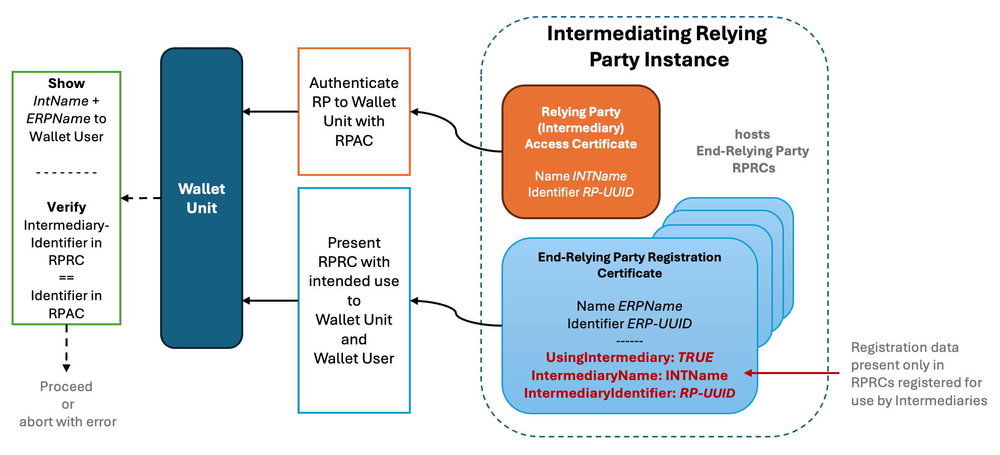

Version 0.3, updated 25 March 2025

[Link to GitHub discussion](https://www.github.com/eu-digital-identity-wallet/eudi-doc-architecture-and-reference-framework/discussions/431)

# Topic X - Relying Party Registration

### Legal notice: All legal information and excerpts documented in Section 2 is based on the European Digital Identity Regulation (EU) 2024/1183 and the current public consultation draft of the Commission Implementing Regulation for Relying Party registration. The latter is undergoing changes due to consultation process, and thus this document may need modification after the publication and approval of the final CIR.

## 1 Introduction

### 1.1 Discussion Paper Topic Description

This document is the Discussion Paper for the European Digital Identity Cooperation Group regarding Topic X: Relying Party registration.
The ARF Development Plan [ARF_DevPlan] describes this Topic as follows:

_This topic is to gather High level Requirements (HLR) for Relying Party registration. The HLR relate to information necessary for authentication to access European Digital Identity Wallets, and to relying parties’ contact details and their intended use of wallets, including what data relying parties may ask users for_.

### 1.2 Key Words

This document uses the capitalised key words 'SHALL', 'SHOULD' and 'MAY' as specified in RFC 2119, i.e., to indicate requirements, recommendations and options specified in this document.
In addition, 'must' (non-capitalised) is used to indicate an external constraint, for instance a self-evident necessity or a requirement that is mandated by an external document. The word 'can' indicates a capability, whereas other words, such as 'will', 'is' or 'are' are intended as statements of fact.

### 1.3 Document Structure

The document is structured as follows:

- Chapter 2 presents the legal requirements for functionality related to the Relying Party registration.

- Chapter 3 presents and discusses a list of identified issues, with suggested changes and/or new High-Level Requirements related to this topic.

- Chapter 4 presents a log of the additions and changes that will be made to High Level Requirements in the ARF as a result of discussing this topic with Member States.

- Chapter 5 refers to other topics related to Relying Party registration.

- Chapter 6 presents the additions and changes that will be made to the ARF main document as a result of discussions.

## 2 Legal Requirements for Relying Party registration

Two legal texts impose direct requirements on the Relying Party registration: The evolving [Draft of the CIR for RP-Registration](https://tinyurl.com/IA-5b-draft) and the [European Digital Identity Regulation]. This section recaps the respective legal requirements from these sources.

### 2.1 [European Digital Identity Regulation] about Relying Party registration

The [European Digital Identity Regulation] requires the Relying Parties to be registered. It specifies the following requirements related to Relying Party registration:

1. Setting up national registers of registered wallet-relying parties in each Member State
2. Registering Relying Party needs to provide at minimum, a definite set of information necessary to authenticate to EUDI Wallets including the intended use and indication of data requested for this use from the user
3. Relying Parties shall only request data that is registered for the intended use
4. Member States shall make the Relying Party register information available to the public in a manner that is both human and machine-readable
5. Member States shall provide a common mechanism for authenticating the Relying Parties in the European Digital Identity ecosystem
6. An Intermediary that is acting on behalf of relying parties is deemed to be a Relying Party, but shall not store data exchanged between the EUDI Wallet user and intermediated Relying Party
7. The European Commission shall establish technical specifications and procedures to support the registration process, publication of the registries, updates of registration information by means of implementing acts.

Below are the actual excerpts from the Regulation, including the recitals and the Articles that establish these requirements.

**Recital (17)**

_For the purposes of registration, relying parties should provide the information necessary to allow for their electronic identification and authentication towards European Digital Identity Wallets. When declaring their intended use of the European Digital Identity Wallet, relying parties should provide information regarding the data that they will request, if any, in order to provide their services and the reason for the request.
Relying party registration facilitates the verification by Member States with regard to the lawfulness of the activities of the relying parties in accordance with Union law. The obligation to register provided for in this Regulation should be without prejudice to obligations laid down in other Union or national law, such as the information to be provided to the data subjects pursuant to the Regulation (EU) 2016/679. Relying parties should comply with the safeguards offered by Articles 35 and 36 of that Regulation, in particular by performing data protection impact assessments and by consulting the competent data protection authorities prior to data processing where data protection impact assessments indicate that the processing would result in a high risk. Such safeguards should support the lawful processing of personal data by relying parties, in particular with regard to special categories of data, such as health data. The registration of relying parties is intended to enhance transparency and trust in the use of European Digital Identity Wallets.
Registration should be cost-effective and proportionate to the related risks in order to ensure uptake by service providers. In that context, registration should provide for the use of automated procedures, including the reliance on and the use of existing registers by Member States, and should not entail a pre-authorisation process.
The registration process should enable a variety of use-cases that can differ in terms of mode of operation, whether online or in offline mode, or in terms of the requirement to authenticate devices for the purposes of interfacing with the European Digital Identity Wallet.
Registration should apply exclusively to relying parties providing services by means of digital interaction._

**Recital (18)**

_Safeguarding Union citizens and residents in the Union against the unauthorised or fraudulent use of European Digital Identity Wallets is of high importance for ensuring trust in and for the wide uptake of European Digital Identity Wallets. Users should be provided with effective protection against such misuse. In particular, when facts that form the basis for fraudulent or otherwise illegal use of a European Digital Identity Wallet are established by a national judicial authority in the context of another procedure, supervisory bodies that are responsible for European Digital Identity Wallet issuers should, upon notification, take the necessary measures to ensure that the registration of the relying party and the inclusion of relying parties in the authentication mechanism are withdrawn or suspended until the notifying authority confirms that the irregularities identified have been remedied._

**Article 3**

Definitions

_‘relying party’ means a natural or legal person that relies upon electronic identification, European Digital Identity Wallets or other electronic identification means, or upon a trust service;_

**Article 5b - European Digital Identity Wallet-Relying Parties**

1. _Where a relying party intends to rely upon European Digital Identity Wallets_
_for the provision of public or private services by means of digital_
_interaction, the relying party shall register in the Member State where it is_
_established._
2. _The registration process shall be cost-effective and proportionate-to-risk._
_The relying party shall provide at least:_
_(a) the information necessary to authenticate to European Digital Identity Wallets, which as a minimum includes:_
_(i) the Member State in which the relying party is established; and_
_(ii) the name of the relying party and, where applicable, its registration number as stated in an official record together with identification data of that official record;_
_(b) the contact details of the relying party;_
_(c) the intended use of European Digital Identity Wallets, including a indication of the data to be requested by the relying party from users._
3. _Relying parties shall not request users to provide any data other than that_
_indicated pursuant to paragraph 2, point (c)._
4. _Paragraphs 1 and 2 shall be without prejudice to Union or national law that_
_is applicable to the provision of specific services._
5. _Member States shall make the information referred to in paragraph 2_
_publicly available online in electronically signed or sealed form suitable for_
_automated processing._
6. _Relying parties registered in accordance with this Article shall inform_
_Member States without delay about any changes to the information provided_
_in the registration pursuant to paragraph 2._
7. _Member States shall provide a common mechanism for allowing the_
_identification and authentication of relying parties, as referred to in Article_
_5a(5), point (c)._
_…_
8. _Intermediaries acting on behalf of relying parties shall be deemed to be_
_relying parties and shall not store data about the content of the transaction._
9. _By ... [6 months from the date of entry into force of this amending_
_Regulation], the Commission shall establish technical specifications and_
_procedures for the requirements referred to in paragraphs 2, 5 and 6 to 9 of this_
_Article by means of implementing acts on the implementation of European_
_Digital Identity Wallets as referred to in Article 5a(23). Those implementing_
_acts shall be adopted in accordance with the examination procedure referred_
_to in Article 48(2)._
_..._

### 2.2 Draft CIR on Relying Party registration

The public consultation version of the \[Draft of the CIR for RP-Registration\] specifies the following requirements related to Relying Party registration:

1. The roles:

- wallet-relying party - a type of the relying party; includes: service providers, PID providers, attestation providers, trust service providers and intermediaries;
- registrar

1. Setting up at each Member State one or more national registers of registered wallet-relying parties.
2. Make this information available to the public in a manner that is both human and machine-readable - via an API and website. The information made available shall be signed or sealed.
3. Member States should set out and publish one or more registration policies applicable to national registers set up in their territory
4. Wallet-relying parties should provide the necessary information (during registration process), including their entitlement(s), for inclusion in the national registers
5. Registrars should set up online and, where applicable, automated registration processes and shall verify registration information provided by the wallet-relying party in an automated manner where possible.
6. The registrant receives:

- one or more ‘Wallet-Relying Party Access Certificates’, and
- one or more 'Wallet-Relying Party Registration Certificates'

7. Wallets authenticate wallet-relying parties with use of the Wallet-Relying Party Access Certificates.
8. In a transaction, a wallet solution shall inform the wallet user whenever the wallet-relying party is asking for more information than what they have registered as intended use and the user will have possibility to reject the transaction (as well as to make a claim or report the case to a competent authority).
9. The registrar may suspend or cancel the registration with or without prior notice to the affected wallet-relying party based on proportionality assessment, taking into account the impact on the fundamental rights, privacy, security and confidentiality of the users in the eco-system, as well as the severity of the disruption caused by the suspension or cancellation and the associated costs, both for the wallet-relying party and the user.

The list of information to be provided by a wallet-relying party during registration (as per Annex I):

- official name of the wallet-relying party
- one or more official identifiers of the wallet-relying party (EORI, LEI, VAT number...)
- physical address and member state if not present in official identifier
- URL belonging to the wallet-relying party where applicable
- Detailed contact information
- description of the type of services provided
- a list of the attributes that the relying party intends to request
- a description of intended use of the data
- indication whether the wallet-relying party is a public sector body
- applicable entitlement(s) of the wallet-relying party

The list of possible entitlements (as per Annex I):

- Service_Provider
- QEAA_Provider
- Non_Q_EAA_Provider
- PUB_EAA_Provider
- PID_Provider
- QCert_for_ESeal_Provider
- QCert_for_ESig_Provider
- rQSigCDs_Provider
- rQSealCDs_Provider
- ESig_ESeal_Creation_Provider
- WAC_Provider

Requirements for electronic signatures or seals applied to the information made available on registered wallet-relying parties (as per Annex II):

- shall be JSON advanced electronic signatures at conformance level B-B, B-T or B-LT, and comply with ETSI TS 119 182-1 (JAdES baseline signatures)

Requirements on the API for the register (as per Annex II):

- be a REST API, supporting JSON as format with JAdES or ASIC signature format
- allow any requestor, without prior authentication, to make (search/read) requests to the register, for information about a wallet-relying party
- be published and documented using OpenAPI version 3 

Requirements for wallet-relying party access certificates (as per Annex IV):

- issued under certificate policy and certificate practice statement compliant with IETF RFC 3647
- certificate to include: a clear description of the public key infrastructure hierarchy and certification
paths from the end-entity wallet-relying party access certificates up to the top of the hierarchy used for issuing them, while indicating the expected trust anchor(s) in such hierarchy and paths; - a machine processable reference to the applicable certificate policy and certificate practice statement; and - the information referred to in Annex I, points 1, 2, 3, 5(b) and 5(d)

Requirements for wallet-relying party registration certificates (as per ANNEX V):

- issued under certificate policy and certificate practice statement compliant with IETF RFC 3647 and
IETF RFC 5755
- certificate to include: - the location where the certificate supporting the advanced
electronic signature or advanced electronic seal on that certificate is
available, for the entire certification path to be built up to the expected
trust anchor in the public key infrastructure hierarchy used by the
provider; - machine processable reference to the applicable certificate policy and certificate practice statement; - registration information referred to in Annex I (points 1, 2 and 8; and - to comply with IETF RFC 5755 to express attributes in relation to wallet-relying party registration certificates

Below are selected excerpts from the public consultation \[Draft of the CIR for RP-Registration\], including the recitals and the Articles that establish these requirements.

**Recital (1)**

_Member States should establish and maintain registers of registered wallet-relying parties established in their territory._

**Recital (4)**

_In order to facilitate the consultation of the information on registered wallet-relying parties across the Union, Member States should make this information available to the public in a manner that is both human and machine-readable._

**Recital (6)**

_As registration policies are a useful tool for providing clear guidance to the wallet-relying parties on the registration process, Member States should set out and publish the registration policies applicable to registers set up in their territory._

**Recital (7)**

_[...] another objective of the relying party registration is to facilitate the verification by Member States of the lawfulness of the activities of the wallet-relying parties. Therefore, wallet-relying parties should provide, for inclusion in the registers the necessary information, including their entitlement(s)._

**Recital (8)**

_In order to ensure that the registration process is cost-effective and proportionate-to risk, and to strike an appropriate balance between meeting a high level of transparency and safety on the one hand and ensuring uptake by service providers on the other hand, registrars should set up online and, where applicable, automated registration processes for wallet-relying parties that are easy to use and they should verify applications for registration without undue delay._

**Recital (10)**

_[...] wallet-relying parties should use wallet-relying party access certificates when they identify themselves to wallet units. To guarantee interoperability of those certificates across all wallets provided within the Union, wallet-relying parties access certificates should adhere to common requirements set-out in the Annex to this Regulation_

**Recital (11)**

_[...] wallet-relying parties are not to request users to provide any data other than those indicated for the intended use of wallets during the registration process. Wallet users should be enabled to verify the registration data of wallet-relying parties. To enable wallet users to verify that the attributes being requested by the wallet-relying party are within the scope of their registered attributes, Member States may require the issuance of wallet-relying party registration certificates to registered wallet-relying parties. To ensure the interoperability of the wallet-relying party registration certificates, Member States should ensure that those certificates meet the requirements and standards set out in the Annex of this Implementing Regulation._

**Recital (12)**
_[...] registrars should be able to suspend or cancel the registration of any wallet-relying party without prior notice where the registrars have reason to believe that the registration contains information which is not accurate, not up to date or misleading, the wallet-relying party is not compliant with the registration policy or the wallet-relying party is otherwise acting in breach of Union or national law in a way that relates to their role as a wallet-relying party. In order to safeguard the stability of the wallet ecosystem, the decision to suspend or cancel a registration should be proportionate to the service disruption caused by the suspension or cancellation and the associated cost and inconvenience for the service provider and the user. For the same reason, supervisory bodies are to be enabled to suspend and cancel the registration required pursuant to Article 46a(4), point (f) of Regulation (EU) No 910/2014._

**Article 2**

Key definitions

_‘wallet-relying party’ means a relying party that intends to rely upon wallet units for the provision of public or private services by means of digital interaction;_

_‘register of wallet-relying parties’ means an electronic register used by a Member State to make information on wallet-relying parties registered in that Member State publicly available as set out in Article 5b(5) of Regulation (EU) No 910/2014;_

_‘provider of wallet-relying party access certificates’ means a natural or legal person mandated by a Member State to issue wallet-relying party access certificates to wallet-relying parties registered in that Member State;_

_‘wallet-relying party access certificate’ means a certificate for electronic seals or signatures authenticating and validating the wallet-relying party issued by a provider of wallet-relying party access certificates;_

_‘registrar of wallet-relying parties’ means a body responsible for establishing and maintaining a list of registered wallet-relying parties established in their territory who has been designated by a Member State;_

_‘wallet-relying party registration certificate’ means a data object that indicates the attributes the relying party has registered to intend to request from users;_

_‘provider of wallet-relying party registration certificates’ means a natural or legal person mandated by a Member State to issue wallet-relying party registration certificates to wallet-relying parties registered in that Member State._

**Article 3**

National registers

_2 Member States shall make the information set out in Annex I on registered wallet-relying parties from all national registers publicly available online, both in human readable form and in a form suitable for automated processing_

_3. The information shall be available through a single national application programming interface (‘API’) and through a national website. It shall be electronically signed or sealed by or on behalf of the registrar, in accordance with the requirements set out in Section 1 of Annex II._

**Article 4**

Registration policies

_1. Member States shall lay down and publish one or more national registration policies applicable to national registers._

_3. The registration policy shall cover at least the following points:_

 _(a) the identification and authentication procedures applicable to wallet-relying parties during the registration process;_

 _(b) the supporting documentation to be provided by the wallet-relying party to establish their identity, business registration, any applicable entitlement(s), and other relevant information that is required under the registration policy;_

 _(c) where applicable, the description of the authentic sources or other official electronic records in the Member State where the register is set up, that can be relied upon to provide accurate data, information or other evidence required as part of the registration process;_

 _(d) where applicable, the automated means supported to enable wallet-relying parties to register or to update an existing registration;_

 _(e) the means of redress available to wallet-relying parties under the law of the Member State where the register is set up;_

 _(f) the rules and procedures for the verification of the identity of the registered wallet-relying party and of any other relevant information provided by that party._

**Article 6**

The registration process

_3. Registrars shall verify, where applicable, in an automated manner:_

 _(a) the accuracy and validity of the information required under Article 5;_

 _(b) where applicable, the power of attorney of a representative of the wallet-relying party in accordance with the laws and procedures of the Member State where the register is set up;_

 _(c) the type of entitlement(s) of the wallet-relying party as set out in **Annex I.**_

_4. The verification of the information referred to in paragraph 3 shall include an authenticity and validity assessment of the provided information against the supporting documentation provided by the wallet-relying parties and against any authentic sources or other official electronic records in the Member State where the register is set up and to which the registrars have access in accordance with national law. The verification of entitlements of wallet-relying parties shall be carried out in accordance with **Annex III**._

_5. When a wallet-relying party no longer intends to rely upon wallet units for the provision of public or private services under a specific registration, it shall notify the relevant registrar without undue delay and request the cancellation of that registration._

**Article 7**

Wallet-relying party access certificates

_1. Member States shall ensure that providers of wallet-relying party access certificates issue wallet-relying party access certificates to wallet-relying parties registered in accordance with the requirements set out in Article 4 to Article 6 of this Regulation._

_2. Member States shall set up dedicated certificate policies and certificate practice statements in accordance with the requirements set out in Annex IV. Member States shall ensure that wallet-relying party access certificates meet the requirements set out in **Annex IV**._

**Article 8**

Wallet-relying party registration certificates

_1. Member States may require providers of wallet-relying party registration certificates to issue wallet-relying party registration certificates to wallet-relying parties registered in accordance with the requirements set out in Article 4 to Article 6 of this Regulation._

_2. Where Member States require the provision of wallet-relying party registration certificates, Member States shall ensure that these certificates meet the requirements set out in **Annex V**._

**Article 9**
Suspension and cancellation

_1. Registrars may suspend or cancel a registration of a wallet-relying party where such a suspension or cancellation is requested by a supervisory body pursuant to Article 46a(4), point (f) of Regulation (EU) No 910/2014 or where the registrars have reasons to believe that:_
_(a) the registration contains information which is not accurate, not up to date or misleading;_
_(b) the wallet-relying party is not compliant with the registration policy;_
_(c) the wallet-relying party is requesting more attributes than what they have registered in accordance with Article 5 and Article 6 of this Regulation;_
_(d) the wallet-relying party is otherwise acting in breach of Union or law of that Member State in a way that relates to their role as a wallet-relying party;_

_4. When considering the suspension or cancellation in accordance with Article 9 paragraph 2, the registrar shall conduct a proportionality assessment, taking into account the impact on the fundamental rights privacy, security and confidentiality of the users in the eco-system, as well as the severity of the disruption caused by the suspension or cancellation and the associated costs, both for the wallet-relying party and the user. Based on the result of this assessment, the registrar may suspend or cancel the registration with or without prior notice to the affected wallet-relying party._

**ANNEX I**

(summary)

Information regarding wallet-relying parties

- name of the wallet-relying party as stated in official record
- one or more identifiers of the wallet-relying party (EORI, LEI, VAT number...)
- physical address
- Detailed contact information
- a description of the type of services provided
- a list of the attributes, that the relying party intends to request
- description of intended use of the attributes
- indication whether the wallet-relying party is a public sector body
- applicable entitlement(s) of the wallet-relying party

The possible entitlements of the wallet-relying party:

- Service_Provider
- QEAA_Provider
- Non_Q_EAA_Provider
- PUB_EAA_Provider
- PID_Provider
- QCert_for_ESeal_Provider
- QCert_for_ESig_Provider
- rQSigCDs_Provider
- rQSealCDs_Provider
- ESig_ESeal_Creation_Provider
- WAC_Provider

_5. Detailed contact information of the wallet-relying party, one or more, including:_
_(a) a website for providing helpdesk and support;_
_(b) a phone number where the wallet-relying party can be contacted for matters pertaining to its registration and intended use of the wallet units;_
_(c) a digital address where the wallet-relying party can be contacted for matters pertaining to its registration and intended use of the wallet units;_
_(d) an e-mail address where the wallet-relying party can be contacted for matters pertaining to its registration and intended use of the wallet units;_

_7. A list of the attributes that the relying party intends to request, expressed as a friendly name and a technical name including the namespace that the attributes are grouped under in a machine-readable format for automated processing, with an indication if they are mandatory or optional._

**ANNEX II**

(summary)

_1. REQUIREMENTS ON ELECTRONIC SIGNATURES OR SEALS APPLIED TO THE INFORMATION MADE AVAILABLE ON REGISTERED WALLET-RELYING PARTIES_

- The file format used by the API: be JavaScript Object Notation (JSON)
- electronic signatures and electronic seals - JSON advanced electronic signatures at conformance level B-B, B-T or B-LT, comply with ETSI TS 119 182-1 V1.2.1 (JAdES baseline signatures)

_2. REQUIREMENTS ON THE SINGLE API_

- REST API, supporting JSON data format
- published as OpenAPI version 3
- allow any requestor, without prior authentication, to make (search/read) requests to the register
- provide security functions in order to ensure the availability and integrity of the API and the information available through it. The API shall be secure by default and by design.

**ANNEX III**

(summary)

_Source of documentary evidence for the verification of entitlements of wallet-relying parties_

- verification of qualified trust service providers - shall be based on the national trusted lists
- verification of non-qualified trust service providers - shall be based on the national trusted lists or on national MS verification procedures (set out in their registration policies)
- verification of providers of person identification data - shall be based on the list of providers of person identification data published by the Commission in accordance with Article 5a(18) of Regulation (EU) No 910/2014
- verification of providers of electronic attestations of attributes issued by or on behalf of a public sector body responsible for an authentic source - shall be based on the list published by the Commission in accordance with Article 45f(3) of Regulation (EU) No 910/2014

**ANNEX IV**

(summary)

_Requirements for wallet-relying party access certificates_

- X.509 certificate with certificate policy and certificate practice statement
- shall comply with IETF RFC 3647
- plus additional requirements set out in the Annex IV

**ANNEX V**

(summary)

_Requirements for wallet-relying party registration certificates_

- certificate policy and certificate practice statement shall comply with IETF RFC 3647 and IETF RFC 5755
- includes the information referred to in Annex I, points 1, 2 and 8;
- expresses attributes in way compliant with IETF RFC 5755;
- plus additional requirements set out in the Annex V.

## 3 Discussion 

The Relying Party registration covers from functional perspective of the ARF and the European Digital Identity ecosystem the following aspects: 

1) the **Registrar function** for which the Member States are responsible to organise this function, register and a publicly accessible API at a national level (based on the future technical specifications and the CIR provided by the European Commission),
2) the registration process mandated to be be followed by all Relying Parties resulting in issuance of one or more **Wallet-Relying Party Access Certificates** (RPAC) and as many **Wallet-Relying Party Registration Certificates** (RPRC) as the Relying Party has dedicated intended uses (use cases, services provided to the EUDI Wallet Users),
3) the **operational use of aforementioned certificates** in Relying Party transactions with the EUDI Wallet Units and their Users,
4) **handling the functional revocation of Relying Party certificates** as necessitated by the legal requirements, 
5) how the registration and operational use of the RP registration certificates shall be done when **the Relying Party relies upon another Relying Party that is acting on its behalf (an intermediary)** to provide its intended use towards the Wallet Units.

Having analysed the combined legal requirements, the current ARF (release 1.8), as well as recent German architecture concept proposals (\[German non-paper on RP Authn\], \[German non-paper on WRP with attestations\], that together contain considerable amount of technical detail and that were discussed indirectly in the context of topic D already), this section raises the following topics for discussion at level of High-Level Requirements relevant for the ARF:

+ Requirements needed to support registrar issuance of RP registration certificates for proximity use cases, not just remote (specifically, support of both JWT and CWT formats of the RP registration certificates, support of both JOSE and COSE signature)
+ Requirements impacted from the fact that the Relying Party has an access certificate per Relying Party Instance (either in remote or proximity scenarios)
+ Requirements impacted from the fact that registration certificates are issued per each registered intended use of the Relying Party
+ Changes needed in the ARF due to earlier assumption that PID or Attestation Providers did not need a Relying Party registration certificate
+ Identified HLR changes due to clarification of the role of intermediaries (adaptation of the certificate usage to the role  of intermediaries and the related processes, e.g. registration process and RP registration certificate content if issued to an intermediary, and binding association between the access certificate of the intermediary and the registration certificates of its End-Relying Parties)  
+ Modification related to distinguishing between lifecycle of the RP registration and the lifecycle of RPRC itself, as well as the relation between them (e.g. adapt the HLRs to the fact that certificates can only be revoked (no suspension), while the registration can be cancelled or suspended)  
+ Other terminology mismatches that need alignment between the draft IA and the ARF (eg. registration 'withdrawal' to be replaced with 'cancellation').
+ Necessary adaptation of registration policy, certification policy and certification policy statement requirements in line with conclusions on the above issues
+ Impacts on the HLRs under other Topics of ARF Annex 2 (Topic 6 & Topic 31, at least)

This document is ONLY intended to clarify the high-level requirements related to the Relying Party registration topic. The necessary technical specifications (including any policy documents) will be developed by the European Commission after agreement over the requirements has been reached.

### 3.1 Proximity use case support

The Annex IV and V of the \[Draft CIR on Relying Party registration\] will bind legally what certificate standards are applicable for the RPAC and RPRC to be issued by the registrar. Use of the RPRC in context of proximity use case is mentioned in the ARF indirectly in (6.6.3.5), but necessary technical requirements for RPRC issuance are pointing at use of JOSE for signing/sealing the certificate, and the data format of the certificate contents being JSON (Annex V of the draft CIR). Requirement for the Registrar to support provisioning of registration certificates in both JWT and CWT format was agreed to be added to the requirements.

A new HLR is proposed to extend the scope of registration to apply over both online and proximity use cases:

| **Index** | **Requirement specification** | **Proposal** |
|-----------|--------------------------------------------------------------|--------------|
| Reg_30    | During registration, the Relying Party SHALL be provided both JWT and CWT format registration certificates by the Registrar. *Note: This gives the Relying Party freedom to provide their intended use for both remote and proximity use cases, as necessary - without requesting use case implementation approach upon the registration event.* | New | 

### 3.2 Access certificates with multiple Relying Party instances
When addressing the RPACs, the Regulation does not recognise the need for multiple instances of Relying Party services in modern IT architectures (replication of RP servers and common dependance on multiple geographical cloud provider regions to ensure availability and continuity of RP services). Multi-instance Relying Parties will also be commonplace in proximity use cases with handheld or mounted verification devices interacting with the Wallet Units. The fact that multiple access certificates with individual private keys can be requested and issued by the Access Certificate Authorities should be clarified in the ARF requirements on registering access certificates, and in the policy documents to be created based on the ARF high-level requirements.

The HLR Reg_15 on policy for revocation is revised to mention multiple RPACs (_all_ RPACS of a Relying Party), and a new HLR Reg_15b is brought to clarify the need for controlled revocation of individual instance RPACs (when the Relying Party still has at least one or more valid RPACs after revoking one or more RPACs assigned to its Relying Party Instances). Related to the existing HLRs on relying party access certificates Reg_31 and Reg_32, the requirements with their contextual notes should be moved under Topic 44 with rewording to mean RPRCs. To ensure binding of the RPAC and RPRC with the unique identifier of the Relying Party, a new HLR Reg_33 is introduced.

| **Index** | **Requirement specification**                                | **Proposal** |
|-----------|--------------------------------------------------------------|--------------|
| Reg_15    | The common Certificate Policy mentioned in Reg_12 SHALL include a policy for revocation, which SHALL require that an Access Certificate Authority revokes all access certificates of the certificate subject at least when: - the certificate subject which is a Relying Party is cancelled or suspended by the respective Registrar,  - on request of the certificate subject, or - on request of a national supervisory body.| Keep with proposed changes |
| Reg_15b   | The common Certificate Policy mentioned in Reg_12 SHALL include a policy for Relying Party Instance-specific revocation, which SHALL require that an Access Certificate Authority revokes one or more of the access certificates of the certificate subject at least when: - the corresponding Relying Party Instance is cancelled by the respective Registrar, - on request of the certificate subject. or - on request of a a national supervisory body. *Note: This policy is required for needs of executing partial revocation of access certificates, e.g. for situations when a Relying Party has issues not reaching to all of its instances.*|  New  |
| Reg_31	| The common Relying Party Registration Certificate Policy SHALL require that a Relying Party registration certificate contains a name for the Relying Party, in a format suitable for presenting to a User. *Note: A Wallet Unit needs such a name when requesting User approval according to [Topic 6].* | Move modified HLR text under Topic 44 (new RPRC_03a) |
| Reg_32	| The common Relying Party Registration Certificate Policy SHALL require that a Relying Party registration certificate contains an EU-wide unique identifier for the Relying Party, and SHALL specify a method for deriving such identifiers. *Note: - The Wallet Instance needs such an identifier at least to lodge a complaint of suspicious Relying Party presentation requests to a data protection authority according to Topic 50. - The EU-wide unique identifier could, for example, be a concatenated list of one or more registered official wallet-relying party identifiers listed in Annex I(3) of the \[Draft of the CIR for RP-Registration\], expressed in semantic form defined in \[ETSI EN319 412-1\] Sections 5.1.4 or 5.1.5 and used as the Distinquished Name (DN) of the Certificate subject in both access and registration certificates of the Relying Party*   | Move modified HLR text under Topic 44 (new RPRC_03b). *Note: Identicality is covered in new HLR RPRC_09 - see Section 3.3*|
| Reg_33    | All Relying Party Instance access certificates of a Relying Party SHALL include the user-friendly (common) name of Relying Party service and unique identifier identical to the ones defined in requirements RPRC_03a and RPRC_03b, respectively. |  New  |

### 3.3 Registration certificate per intended use

The Relying Party registration requires Relying Parties to provide information necessary for authentication, their contact details, and the intended use of the European Digital Identity Wallets, including the specific data they will request from users. The RPAC (wallet Relying Party Access Certificate) authenticates who the Relying Party is, while the RPRC (wallet-Relying Party Registration Certificate) specifies what data that authenticated the Relying Party is entitled to request for a particular registered purpose (intended use). Crucially, Relying Parties are explicitly prohibited from requesting any data beyond what is indicated in their registration. This is a key mechanism for enforcing data minimisation and purpose limitation.

According to the \[Draft CIR on Relying Party registration\] a Relying Party will get issued a unique RPRC for each of its registered intended uses, and these registration certificates may be revoked independent of each other or of the associated RPAC. The access certificates are the Relying Party's 'master switches' to the EUDI ecosystem, whilst registration certificates are used to register and document the use case/s provided to the Wallet User. The registration certificate will not be a X.509 certificate, and thus the required certificate policies for RPRCs should be clarified both in the IA draft and the ARF. 

Current RPRC_2 and RPC_3 in the ARF should be updated to reflect the text of the draft CIR on RPR, a new requirement on use of unique RP identifier across the RPRCs, and a new HLR on creating applicable certificate policies is suggested for Topic 44 as follows:

| **Index** | **Requirement specification** | **Proposal** |
|-----------|--------------------------------------------------------------|--------------|
| RPRC_01	| During the registration process for Relying Parties, as specified in [Topic 27](#a2327-topic-27---registration-of-pid-providers-providers-of-qeaas-pub-eaas-and-non-qualified-eaas-and-relying-parties), the Member State Registrar SHALL create and sign or seal a registration certificate and issue it to the Relying Party for each intended use requested to be registered by the Relying Party. The registration certificate SHALL comply with the applicable requirements in the technical specification mentioned in RPRC_02. Note: See [Topic 52](#a2352-topic-52-relying-party-intermediaries). | Keep with proposed changes |
| RPRC_02   | The Commission SHALL ensure that a technical specification is created, describing at least 1. the contents and format of registration certificates, 2. the signing method(s) used to ensure the authenticity of the registration certificates. 3. the trust infrastructure necessary for signing registration certificates and for verifying these signatures, including, if necessary, the use of Trusted Lists to establish trust in Member States Registrars and to distribute their trust anchors to Wallet Units. 4. the method used for binding each registration certificate to the Relying Party Instance access certificate that will be used during the same transaction. This binding method SHALL enable a Wallet Unit to verify that the registration certificate was in fact issued to the Relying Party that authenticated itself using the access certificate. The binding method SHALL consider situations in which the Relying Party uses the services of an intermediary (see [Topic 52](#a2352-topic-52-relying-party-intermediaries)) to connect to the Wallet Unit. 5. whether or not a registration certificate must have a validity period. 6. the method to be used for revocation of registration certificates. Moreover, the technical specification SHALL describe the impact of revocation, especially compared to the impact of revocation of the Relying Party Instance access certificates. |     Keep with proposed changes    |
| RPRC_03    | The contents of a registration certificate issued per registered intended use of the Relying Party SHALL include at least information required in Annex V of the CIR for Relying Party Registration. If the Relying Party uses the services of an intermediary (see [Topic 52](#a2352-topic-52-relying-party-intermediaries)): the fact that this is the case, plus the user-friendly (common) name and unique identifier (as meant in RPRC_03a and RPRC_03b) of this intermediary. |      Keep with proposed changes        |
| RPRC_09    | The EU-wide unique identifier SHALL be identical in all registration certificates issued for a given Relying Party.|  New  |
| RPRC_10    | The Commission SHALL provide technical specifications establishing common Certificate Policy for registration certificates, covering at least management and selection of signing keys, revocation and lifecycle maganagement of RPRCs on individual intended use level. *Note: The TS could set the provider of RPRCs to follow applicable parts of technical standards such as EN 319 401 (for General Policy Requirements for TSPs) and TS 119 461 (for identity proofing of Relying Party representatives).* |  New  |
 |RPRC_11 | There SHALL be only one valid registration certificate present in a presentation request for given intended use of a Relying Party. An error SHALL be reported by the Wallet Unit if it receives multiple registration certificates for the same intended use. |  New  |

> Note: The modifications suggested for RPRC_01 and RPRC_03 above include also the changes required from discussion on intermediaries at Section 3.5.

### 3.4 Addressing the PID Providers and Attestation Providers on RPRCs

The \[Draft of the CIR for RP-Registration\] implies that among all other roles defined in the ARF also the PID Providers and Attestation Providers will receive registration certificates, with the role registered as part of the registration and reflected in the certificate information (the specific entitlement being one or more of the set PID_Provider, QEAA_Provider, Non_Q_EAA_Provider or PUB_EAA_Provider). This needs to be reflected in the ARF, which so far has separated these roles from the Relying Parties (per definition of the ARF).

 Section 6.3.2.2 of the ARF says that "_A PID Provider access certificate indicates that its subject is a PID Provider. Similarly, an Attestation Provider access certificate indicates that its subject is a QEAA Provider, a PuB-EAA Provider or a non-qualified EAA Provider._"

This is not the case per the draft CIR, the entitlements indicating the registered role are only present in the Relying Party registration certificate.

Therefore, the definition set in the ARF needs to be adapted or extended accordingly, and Reg_17 on list of HLRs for the issuance of access certificates should be removed (entitlements not being present in access certificates):

| **Index** | **Requirement specification** | **Proposal** |
|-----------|--------------------------------------------------------------|--------------|
|Reg_17	| The common Certificate Policy mentioned in Reg_12 SHALL require that an access certificate indicates whether its subject is a PID Provider, a QEAA Provider, a PuB-EAA Provider, a (non-qualified) EAA Provider, or a Relying Party Instance. | Delete |

### 3.5 Registration certificate for intermediaries

#### 3.5.1 Registration on-behalf of the End-Relying Parties
The intention reflected in the \[Draft of the CIR for RP-Registration\] is that the intermediaries are to receive the RPRC of their End-Relying Parties. If an End-Relying Party uses an intermediary, it (the End-RP) will not need to itself apply or receive its Wallet-Relying Party certificate from the Registrar, if the intermediary (as part of their service towards the End-Relying Parties) registers for it and possesses the RPRCs for all of its customers. This will simplify the process of End-Relying Parties, who can This model is not mandated by the ARF, the processes how registration will be organised in Member States is left for national discretion.

> Note: The means to indicate to the national registry/ies that an entity is registering as an Intermediary is left for national discretion (see RPI_04), there is no such role/entitlement recognised in the Regulation.

A pure intermediary will upon its registration receive only RPACs listing its own unique Relying Party identifier and (common) name. The intermediated End-Relying Parties are not provided RPACs, and their set of issued RPRCs are hosted by their intermediary. It is not in the scope of the ARF to cover how the intended use specific RPRCs are to be managed between the End-Relying Party and the Intermediary.

As the intermediaries are acting on behalf of the End-Relying Parties, and will remain liable towards the Registrar on accuracy of the information to be registered, they must carry same identity proofing and data verification checks for their customers as the Registrar would do for the End-Relying Party in case of direct registration path. The Registrar shall also not trust blindly the Intermediary but execute the identity verification of both the Intermediary and the End-Relying Parties to be registered.

> Note: Attention must be paid towards compliance of principles such as lawfulness, fairness, transparency, storage limitation or accountability, and of requirements such as those related to data subject rights when using an Intermediary. The compliance against requirements of RPI_10 are therefore essential to be audited when defining the national registration and security policies for Intermediaries. There is no such intention from the Commission, as this (no EU-level policy setting) is already the case for the proxying TSPs since enforcement of (EU) 2014/910.

#### 3.5.2 Use of certificates upon on-behalf operation towards Wallet Units
When operating on behalf of its End-Relying Parties, the intermediary will possess as many RPRCs as number of its intermediated End-RPs entities (multiplied by the number of services/intended uses for each entity possibly). The ARF describes already how the certificates are to be used by the Intermediary and the Wallet Unit in RPI_06 to RPI_10. For clarity, the process of presenting the Intermediary RPAC and the End-Relying Party RPRC with necessary technical level binding is illustrated in Figure 1 below.

Figure 1 - Validation of identifiers between Intermediary RPAC and End-Relying Party RPRC.

The ARF (1.8) contains requirement RPI_02, assuming the intermediary does not receive registration certificates of its own, and this assumption remains valid unless the Relying Party acting as an intermediary has other wallet-relying party services with intended uses that invoke the duty to register an RPRC. 

As summary, the ARF needs to be adapted to the intended role of the intermediaries as per the \[Draft of the CIR for RP-Registration\], which implies modifications of multiple HLRs. Below are the proposed changes to the key HRLs in this respect (other HLRs might need to be updated accordingly). 

| **Index** | **Requirement specification** | **Proposal** |
|-----------|--------------------------------------------------------------|--------------|
| RPI_02 | An intermediary is acting only as an intermediary for other (End-) Relying Parties, but from the Registrar point of view is considered as a Relying Party and obtains a registration certificate according to [Topic 44](#a2344-topic-44---relying-party-registration-certificates), containing Intermediary name and Relying Party identifier. |  Keep with proposed changes     |
| RPI_03 | For each of the End-Relying Parties that uses its services, an intermediary SHALL possess a registration certificate for each registered intended use of the said End-Relying Party, according to the requirements in [Topic 44](#a2344-topic-44---relying-party-registration-certificates). This registration certificate SHALL contain that End-Relying Party's name and unique identifier, as well as the list of attributes registered for that Relying Party's intended use. |   Keep with proposed changes      |
| RPI_05 | When issuing a registration certificate for an intermediary, the Registrar SHALL include in the registration certificate the attributes meant in RPRC_03a and RPRC_03b containing the name and unique identifier of the intermediated End-Relying Party. |         Keep with proposed changes    |
| RPI_06 | When requested for an intended use by an intermediated End-Relying Party, an intermediary SHALL request the presentation of attributes from a specific Wallet Unit, using the intermediary's access certificate meant in requirement RPI_01, and the registration certificate possessed by the intermediary in relation to the intermediated End-Relying Party and the intended use, as meant in RPI_03. |  Keep with proposed changes       |
| RPRC_01	| During the registration process for Relying Parties, as specified in [Topic 27](#a2327-topic-27---registration-of-pid-providers-providers-of-qeaas-pub-eaas-and-non-qualified-eaas-and-relying-parties), the Member State Registrar SHALL create and sign or seal a registration certificate and issue it to the Relying Party for each intended use requested to be registered by the Relying Party. The registration certificate SHALL comply with the applicable requirements in the technical specification mentioned in RPRC_02. *Note: See Topic 52.* | Keep with proposed changes | 

### 3.6 Registration and Registration Certificate life cycles 

The Article 9 of \[Draft of the CIR for RP-Registration\]  envisions 'suspension' and 'cancellation' of the registration (apart from the non-specified "active" state after the registration). 
At the same time the RP registration certificate has its own life cycle, which envisions only 'revocation' (apart from the "valid" state after issuance).

In addition, the IA draft text lists the following reasons of suspension/cancellation:
+ the registration contains information which is inaccurate, out of date or misleading;
+ the wallet-relying party is not complying with the registration policy;
+ the wallet-relying party is requesting more attributes than they have registered; 
+ the wallet-relying party is otherwise acting in breach of Union or national law in a manner related to their role as wallet-relying party;
+ by a supervisory body European Digital Identity Wallet Framework in the case of illegal or fraudulent use of the European Digital Identity Wallet.

The technical specifications and policy documents that base their requirements on the ARF must specify the RPRC specific policies on lifecycle management (e.g., updates for and revocation of the existing RPRCs as indended uses and their data requirements change over time) and policies for eventual multi-registration (per intended use, per Member State) and cross-border registration. 

Defined policies should also address how to execute post-registration analysis and audits against the registered intended uses, unless the audits are to be left entirely for the EUDI Wallet Unit level functions - such as already introduced in the ARF [Section 6.6.3.13](https://github.com/eu-digital-identity-wallet/eudi-doc-architecture-and-reference-framework/blob/main/docs/architecture-and-reference-framework-main.md#66313-wallet-unit-enables-the-user-to-report-suspicious-requests-by-a-relying-party-and-to-request-a-relying-party-to-erase-personal-data), and the functionalities to be defined via Topic M - User reporting unlawful or suspicious request of data to DPAs.

| **Index** | **Requirement specification** | **Proposal** |
|-----------|--------------------------------------------------------------|--------------|
| Reg_15 | The common Certificate Policy mentioned in Reg_12 SHALL include a policy for revocation, which SHALL require that an Access Certificate Authority revokes an access certificate at least when: the certificate subject's registration is cancelled by the respective Registrar, on request of the certificate subject, or on request of a national supervisory body. | Keep with proposed changes |
| Reg_22a | A Registrar SHALL provide a method to suspend or cancel the registration of a registered Attestation Provider. | Keep with proposed changes |
| Reg_22b | A Registrar SHALL have a policy for the suspension or cancellation of a registered Attestation Provider, which SHALL specify that an Attestation Provider's registration is suspended or cancelled at least on request of the PID Provider,Registrar or of a national supervisory body. | Keep with proposed changes |
| REG_28 | A Member State's Registry SHALL log all changes made on the information regarding a Relying Party, including at least initial registration, updates, deletion of information, and suspension or cancellation. | Keep with proposed changes |
| REG_29 | A Registrar SHALL have a policy for the cancellation and suspension of the registration of a registered Relying Party, which SHALL specify that the Relying Party's registration is cancelled or suspended at least on request of the Relying Party, Registrar or a national supervisory body. | Keep with proposed changes |

## 4 Current HLRs and Proposals of Changes

The ARF, Annex 2, Topic 27, Topic 44 and Topic 52, contains a number of High-Level Requirements related to the topic.

The Topic 27 requirements cover general requirements for Member State registration processes and specific requirements for the registration of Relying Parties, whereas Topic 44 covers issuance of Relying Party registration certificates. Topic 52 focuses on the intermediaries.

The existing HLRs are listed in the tables below, along with a proposal to keep, change, add, or remove the HLR.

### 4.1 Topic 27 - Registration of PID Providers, Providers of QEAAs, PuB-EAAs, and (non-qualified) EAAs, and Relying Parties

A.  General requirements for Member State registration processes

| **Index** | **Requirement specification** | **Proposal** |
|-----------|--------------------------------------------------------------|--------------|
| Reg_01    | Member States SHALL provide processes and mechanisms for PID Providers, QEAA Providers, PuB-EAA Providers, (non-qualified) EAA Providers, and other Relying Parties to register in a registry. *Note: Member States may choose to implement a single registry for all these roles, or a separate registry for each of these roles, or organise registries e.g. per applicable sector.* |       Keep with proposed change       |
| Reg_02    | Member States SHALL make publicly available all necessary details and documentation about the registration processes for their registry. |        Keep      |
| Reg_03    | Member States SHALL publish the registry entries online, in a sealed or signed machine-readable common format suitable for automated processing, according to the [European Digital Identity Regulation] Article 5b 5, for the purpose of transparency to Users and other stakeholders. |      Keep        |
| Reg_04    | Member States SHALL make the registry available online, in a common human-readable format. |      Keep        |
| Reg_05    | The Commission SHALL establish a technical specification for the common formats mentioned in Reg_03 and Reg_04. |          Keep    |
| Reg_06    | The Commission SHALL provide specifications for a common API for retrieving registry entries from the Member States registries per Reg_03, defining the minimum requirements for interoperability. *Note: Requirements for this API are defined in Reg_08 and Reg_09.* |      Keep     |
| Reg_07    | The Commission SHALL provide specifications for a common user interface for accessing the Member State registries per Reg_04. *Note: Requirements for this user interface are defined in Reg_08 and Reg_09.* |      Keep        |
| Reg_08    | The API mentioned in Reg_06 and the user interface mentioned in Reg_07 SHALL use a secure channel protecting the authenticity and integrity of the information in the registry during transport. |    Keep      |
| Reg_09    | The API mentioned in Reg_06 and the user interface mentioned in Reg_07 SHALL NOT require authentication or prior registration and authorisation of any entity wishing to retrieve the information in the registry. |      Keep    | 

B. *General requirements for the issuance of access certificates*

| **Index** | **Requirement specification**                                | **Proposal** |
|-----------|--------------------------------------------------------------|--------------|
| Reg_10    | A Member State SHALL ensure that an Access Certificate Authority notified according to [[Topic 31](#a2331-topic-31---pid-provider-wallet-provider-attestation-provider-and-access-certificate-authority-notification-and-publication)] issues access certificates on request to Relying Parties, including the PID Providers, QEAA Providers, PuB-EAA Providers and (non-qualified) EAA Providers registered in one of the Member State's registries.| Keep with proposed changes |
| Reg_11    | A Member State SHALL ensure that the issuance process of access certificates by their notified Access Certificate Authority(s) complies with a common Certificate Policy for Access Certificate Authority. |  Keep    |
| Reg_12    | The Commission SHALL provide technical specifications establishing the common Access Certificate Authority Certificate Policy mentioned in Reg_11. |    Keep   |
| Reg_13    | The common Certificate Policy mentioned in Reg_12 SHALL require that an Access Certificate Authority logs all issued certificates for Certificate Transparency (CT). *Note: This requirement is still under discussion and might be changed or removed in a future version of this ARF.*| Keep  |
| Reg_14    | The common Certificate Policy mentioned in Reg_12 SHALL require that an Access Certificate Authority provides one or more method(s) to revoke the access certificates it issued. | Keep  |
| Reg_15    | The common Certificate Policy mentioned in Reg_12 SHALL include a policy for revocation, which SHALL require that an Access Certificate Authority revokes all access certificates of the certificate subject at least when: - the certificate subject which is a Relying Party is cancelled by the respective Registrar,  - on request of the certificate subject, or - on request of a national supervisory body.| Keep with proposed changes |
| Reg_15b   | The common Certificate Policy mentioned in Reg_12 SHALL include a policy for Relying Party Instance-specific revocation, which SHALL require that an Access Certificate Authority revokes one or more of the access certificates of the certificate subject at least when: - the corresponding Relying Party Instance is cancelled by the respective Registrar, - on request of the certificate subject, or - on request of a national supervisory body. *Note: This policy is required for needs of executing partial revocation of access certificates, e.g. for situations when a Relying Party has issues not reaching to all of its instances.*|  New  |
| Reg_16    | The common Certificate Policy mentioned in Reg_12 SHALL specify the profile of access certificates in detail. |  Keep  |
|Reg_17	    | The common Certificate Policy mentioned in Reg_12 SHALL require that an access certificate indicates whether its subject is a PID Provider, a QEAA Provider, a PuB-EAA Provider, a (non-qualified) EAA Provider, or a Relying Party Instance. | Delete |
| Reg_18    | The common Certificate Policy mentioned in Reg_12 SHALL define the minimum change history information to be stored for resolving possible disputes regarding registration. | Keep |

C. *Requirements for the registration of PID Providers*

| **Index** | **Requirement specification**                                | **Proposal** |
|-----------|--------------------------------------------------------------|--------------|
| Reg_19  | A Member State SHALL approve a PID Provider according to a well-defined policy before including it in its PID Provider Registry. To that end, a Member State SHALL define specific vetting processes and rules of acceptance for inclusion of PID Providers in its Registry. |  Delete   |
| Reg_20  | A Member State SHALL identify PID Providers at a level of confidence proportionate to the risk arising from the potential harm a fraudulent PID Provider could cause to Users and other stakeholders in the EUDI Wallet ecosystem. |  Delete   |
| Reg_20a | A Registrar SHALL provide a method to suspend or cancel a registered PID Provider. |  Delete  |
| Reg_20b | A Registrar SHALL have a policy for the suspension or cancellation of a registered PID Provider, which SHALL specify that a PID Provider is suspended or cancelled at least on request of the PID Provider or of a national supervisory body. |   Delete  |

D. *Requirements for the registration of Attestation Providers*

| **Index** | **Requirement specification**                                | **Proposal** |
|-----------|--------------------------------------------------------------|--------------|
| Reg_21 | A Member State SHALL approve an Attestation Provider according to a well-defined policy before including it in its Attestation Provider Registry. To that end, a Member State SHALL define specific vetting processes and rules of acceptance for inclusion of Attestation Providers in its Registry. These processes and rules SHOULD consider any relevant differences between QEAA Providers, PuB-EAA Providers and (non-qualified) EAA Providers. |     Delete         |
| Reg_22 | A Member State SHALL identify Attestation Providers (i.e., QEAA Providers, PuB-EAA Providers and non-qualified EAA Providers) at a level of confidence proportionate to the risk arising from the potential harm a fraudulent Attestation Provider could cause to Users and other stakeholders in the EUDI Wallet ecosystem. |     Delete         |
| Reg_22a | A Registrar SHALL provide a method to suspend or cancel a registered Attestation Provider. | Delete  |
| Reg_22b | A Registrar SHALL have a policy for the suspension or cancellation of a registered Attestation Provider, which SHALL specify that an Attestation Provider is suspended or cancelled at least on request of the PID Provider or of a national supervisory body. |  Delete  |

E. Requirements for the registration of Relying Parties

| **Index** | **Requirement specification** | **Proposal** |
|-----------|--------------------------------------------------------------|--------------|
| Reg_23    | The Commission SHALL establish a technical specification for a common set of Relying Party information to be registered in Member State registries. This set SHALL include at least the information defined in [European Digital Identity Regulation] article 5b 2 (c). |     Keep         |
| Reg_24    | A Member State SHALL enable a Relying Party to register remotely, using an API or user interface. |       Keep       |
| Reg_25    | A Member State SHALL identify a Relying Party at a level of confidence proportionate to the risk arising from the potential harm a fraudulent Relying Party could cause to Users and other stakeholders in the EUDI Wallet ecosystem. |      Delete        |
| Reg_26    | A Member State SHALL enable a Relying Party to update the information registered on it using a process comparable to the original registration process, and using the API or user interface mentioned in Reg_24. |       Keep       |
| Reg_27    | Relying Parties SHALL make any updates necessary to ensure the continued correctness of the registered information without undue delay. |      Keep    |
| Reg_28    | A Member State's Registry SHALL log all changes made on the information regarding a Relying Party, including at least initial registration, updates, deletion of information, and suspension or cancellation. |     Keep with proposed changes       |
| Reg_29    | A Registrar SHALL have a policy for the cancellation of a registered Relying Party, which SHALL specify that a Relying Party is cancelled at least on request of the Relying Party or of a national supervisory body. |      Keep with proposed changes       |
| Reg_30    | During registration, the Relying Party SHALL be provided both JWT and CWT format registration certificates by the Registrar. *Note: This gives the Relying Party freedom to provide their intended use for both remote and proximity use cases, as necessary - without requesting use case implementation approach upon the registration event.* |    New    | 

F.  *Requirements for the issuance of Relying Party Instance access certificates*

| **Index** | **Requirement specification**                                | **Proposal** |
|-----------|--------------------------------------------------------------|--------------|
| Reg_31	| The common Relying Party Registration Certificate Policy SHALL require that a Relying Party registration certificate contains a name for the Relying Party, in a format suitable for presenting to a User. *Note: A Wallet Unit needs such a name when requesting User approval according to [Topic 6].*| Move modified HLR text under Topic 44 (**new RPRC_03a**) |
| Reg_32	| The common Relying Party Registration Certificate Policy SHALL require that a Relying Party registration certificate contains an EU-wide unique identifier for the Relying Party, and SHALL specify a method for deriving such identifiers. *Note: - The Wallet Instance needs such an identifier at least to lodge a complaint of suspicious Relying Party presentation requests to a data protection authority according to Topic 50. - The EU-wide unique identifier could, for example, be a concatenated list of one or more registered official wallet-relying party identifiers listed in Annex I(3) of the \[Draft of the CIR for RP-Registration\], expressed in semantic form defined in \[ETSI EN319 412-1\] Sections 5.1.4 or 5.1.5 and used as the Distinquished Name (DN) of the Certificate subject in both access and registration certificates of the Relying Party*   | Move modified HLR text under Topic 44 (**new RPRC_03b**). |
| Reg_33    | All Relying Party Instance access certificates of a Relying Party SHALL include the user-friendly (common) name of Relying Party service and unique identifier identical to the ones defined in requirements RPRC_03a and RPRC_03b, respectively. | New |

### 4.2 Topic 44 - Relying Party Registration Certificates

A. Issuance of Relying Party registration certificates

| **Index** | **Requirement specification** | **Proposal** |
|-----------|--------------------------------------------------------------|--------------|
| RPRC_01	| During the registration process for Relying Parties, as specified in Topic 27, the Member State Registrar SHALL create and sign or seal a registration certificate and issue it to the Relying Party for each intended use requested to be registered by the Relying Party. The registration certificate SHALL comply with the applicable requirements in the technical specification mentioned in RPRC_02. *Note: See Topic 52.* | Keep with proposed changes |
| RPRC_02   | The Commission SHALL ensure that a technical specification is created, describing at least 1. the contents and format of registration certificates, 2. the signing method(s) used to ensure the authenticity of the registration certificates. 3. the trust infrastructure necessary for signing registration certificates and for verifying these signatures, including, if necessary, the use of Trusted Lists to establish trust in Member States Registrars and to distribute their trust anchors to Wallet Units. 4. the method used for binding each registration certificate to the Relying Party Instance access certificate that will be used during the same transaction. This binding method SHALL enable a Wallet Unit to verify that the registration certificate is bound to the Relying Party that authenticated itself using the access certificate. The binding method SHALL consider situations in which the Relying Party uses the services of an intermediary (see Topic 52) to connect to the Wallet Unit. 5. whether or not a registration certificate must have a validity period. 6. the method to be used for revocation of registration certificates. Moreover, the technical specification SHALL describe the impact of revocation, especially compared to the impact of revocation of the Relying Party Instance access certificates. |     Keep with proposed changes    |
| RPRC_03    | The contents of a registration certificate issued per registered intended use of the Relying Party SHALL include at least information required in Annex V of the CIR for Relying Party Registration. If the Relying Party uses the services of an intermediary (see Topic 52): the fact that this is the case, plus the user-friendly (common) name and unique identifier (as meant in RPRC_03a and RPRC_03b) of this intermediary. |      Keep with proposed changes        |
| RPRC_03a	| The common Relying Party Registration Certificate Policy SHALL require that a Relying Party registration instance certificate contains a common name for the Relying Party instance, in a format suitable for presenting to a User. *Notes: - A Wallet Unit needs such a name when requesting User approval according to [Topic 6], - If Relying Party uses an Intermediary, both Intermediary and End-Relying Party common names need to be shown when requesting User approval and the User should be informed that the Intermediary is representing/acting on behalf of the End-Relying Party*.  |  New  |
| RPRC_03b	| The common Relying Party Registration Certificate Policy SHALL require that a Relying Party registration certificate contains an EU-wide unique identifier for the Relying Party, and SHALL specify a method for deriving such identifiers. *Notes: - The Wallet Instance needs such an identifier at least to lodge a complaint of suspicious Relying Party presentation requests to a data protection authority according to Topic 50. - The EU-wide unique identifier could, for example, be a concatenated list of one or more registered official wallet-relying party identifiers listed in Annex I(3) of the \[Draft of the CIR for RP-Registration\], expressed in semantic form defined in \[ETSI EN319 412-1\] Sections 5.1.4 or 5.1.5 and used as the Distinguished Name (DN) of the certificate subject in both access and registration certificates of the Relying Party. Exact specification is left for the technical specifications to be developed by the European Commission.* |  New  |
| RPRC_04   | In both proximity and remote presentation flows, the Relying Party Instance SHALL transfer a Relying Party registration certificate to the Wallet Unit in the presentation request, according to the applicable standard's extension mentioned in RPRC_05. The registration certificate SHALL be included in the request by value, not by reference. *Note: This ensures that no external requests are necessary to validate the request, and that transactions are atomic and self-contained.* | Keep |
| RPRC_05   | The Commission SHALL ensure that extensions are specified for [ISO/IEC 18013-5] and for \[OpenID4VP\], allowing a Relying Party to transfer a Relying Party registration certificate to a Wallet Unit. These extensions SHALL comply with applicable requirements in these standards. | Keep  |
| RPRC_06   | The Wallet Unit SHALL verify the authenticity and validity of the registration certificate according to the technical specification meant in RPRC_02. If the outcome of the verification is negative, the Wallet Unit SHALL, when asking for User approval according to RPA_07 and subject to the User preference set according to RPRC_08, notify the User that it could not verify whether the Relying Party registered the requested attributes with the competent authorities. |  Keep |
| RPRC_07   | The Wallet Unit SHALL verify that all attributes requested in the presentation request are included in the list of attributes in the registration certificate. If the outcome of the verification is negative, the Wallet Unit SHALL, when asking for User approval according to RPA_07 and subject to the User preference set according to RPRC_08, notify the User about the requested attributes that the Relying Party did not register. | Keep |
| RPRC_08   | A Wallet Unit SHOULD enable its User to set their preference for showing or hiding the notifications meant in RPRC_06 and RPRC_07. By default, the Wallet Unit SHALL show the notifications. |  Keep  |
| RPRC_09   | The EU-wide unique identifier SHALL be identical in all registration certificates issued for a given Relying Party. *Note: In case the registration certificates issued to an End-Relying Party are held and presented by an Intermediary (Relying Party), the given Relying Party meant in the text is the End-Relying Party. An Intermediary will obtain and hold registration certificates with non-identical unique identifiers.* |  New  |
| RPRC_10   | The Commission SHALL provide technical specifications establishing common Certificate Policy for registration certificates, covering at least management and selection of signing keys, revocation and lifecycle management of RPRCs on individual intended use level. *Note: The TS could set the provider of RPRCs to follow applicable parts of technical standards such as EN 319 401 (for General Policy Requirements for TSPs) and TS 119 461 (for identity proofing of Relying Party representatives).* |  New  |
| RPRC_11   | There SHALL be only one valid registration certificate present in a presentation request for given intended use of a Relying Party. An error SHALL be reported (logged and shown for the User) by the Wallet Unit if it receives multiple registration certificates for the same intended use within same presentation request. |  New  |

### 4.3 Topic 52 - Relying Party Intermediaries

| **Index** | **Requirement specification** | **Proposal** |
|-----------|-------------------------------|--------------|
| RPI_01 | An intermediary SHALL register as a Relying Party, in accordance with all requirements in [Topic 27](#a2327-topic-27---registration-of-pid-providers-providers-of-qeaas-pub-eaas-and-non-qualified-eaas-and-relying-parties). *Note: This implies that an intermediary obtains an access certificate containing its own name and unique Relying Party identifier.* |       Keep        |
| RPI_02 | An intermediary is acting only as an intermediary for other (End-) Relying Parties, but from the Registrar and the regulation's point of view is considered as a Relying Party and obtains a registration certificate according to [Topic 44](#a2344-topic-44---relying-party-registration-certificates), containing Intermediary name and Relying Party identifier. |  Keep with proposed changes     |
| RPI_03 | For each of the End-Relying Parties that uses its services, an intermediary SHALL be the holder of the registration certificate for each registered intended use of the said End-Relying Party, according to the requirements in [Topic 44](#a2344-topic-44---relying-party-registration-certificates). This registration certificate SHALL contain that End-Relying Party's name and unique identifier, as well as the list of attributes registered for that Relying Party's intended use. |   Keep with proposed changes      |
| RPI_04 | When issuing a registration certificate for a Relying Party to an intermediary, the Registrar SHALL verify, in a manner to be decided by a Member State, that the Relying Party will indeed use the services of the intermediary to interact with Wallet Units. |    Keep        |
| RPI_05 | When issuing a registration certificate for an intermediary, the Registrar SHALL include in the registration certificate the attributes meant in RPRC_03a and RPRC_03b containing the name and unique identifier of the intermediated End-Relying Party. |         Keep with proposed changes    |
| RPI_06 | When requested for an intended use by an intermediated End-Relying Party, an intermediary SHALL request the presentation of attributes from a specific Wallet Unit, using the intermediary's access certificate meant in requirement RPI_01, and the registration certificate accessible to the intermediary in relation to the intermediated End-Relying Party and the intended use, as meant in RPI_03. |  Keep with proposed changes       |
| RPI_07 | In case a Wallet Unit receives a presentation request from an intermediary, on behalf of a Relying Party, it SHALL verify the name of the intermediary during Relying Party authentication and display this name to the User when asking for User approval, as described in requirement RPA_06a. |       Keep        |
| RPI_08 | When a Wallet Unit presents any User attributes to an intermediary, the intermediary SHALL forward these attributes only to the Relying Party that requested the intermediary to request these attributes from the Wallet Unit. |         Keep      |

## 5 Relation to Other Topics

Below we discuss how Relying Party registration relates to the other topics being discussed.

As indicated in the chapter 3, several changes are proposed in the context of the Relying Party registration. The changes introduced in the respective HLRs are to be also reflected in the remaining topics/HLRs, at least in reference to Topic 6 and Topic 31. Note that term **Registration Certificate Authority** has been introduced, aside the formerly used Access Certificate Authority.

In result, the following modification are therefore proposed:

> Note: only affected HLRs are listed, not exhaustive lists as in Section 4.

### 5.1 Topic 6 - Relying Party authentication and User approval

| **Index** | **Requirement specification** | **Proposal** |
|-----------|-------------------------------|--------------|
| RPA_06a | If the registration certificate indicates that an intermediary, as described in [Topic 52](#a2352-topic-52-relying-party-intermediaries), the Wallet Unit SHALL verify that the name and the unique identifier of the intermediary included in the registration certificate are identical to the name and unique identifier included in the Relying Party Instance access certificate. If this verification fails, the Wallet Unit SHALL treat this as a Relying Party authentication failure. If this verification succeeds, the Wallet Instance SHALL display to the User the names of the intermediary and the intermediated End-Relying Party. |     Keep with proposed changes      |

### 5.2 Topic 31 - PID Provider, Wallet Provider, Attestation Provider, and Access Certificate Authority notification and publication

| **Index** | **Requirement specification** | **Proposal** |
|-----------|-------------------------------|--------------|
| GenNot_01 | The European Commission SHALL establish technical specifications for a common system enabling the notification of PID Providers, PuB-EAA Providers, Wallet Providers, Access Certificate Authorities and Registrars of Registration Certificates by Member States to the Commission. *Note: Notification does not apply to QEAA Providers and (non-qualified) EAA Providers, as explained in Sections D and F below, respectively.*  |  Keep with proposed changes   |
| GenNot_02 |  As part of the specifications referred to in GenNot_01, the European Commission SHALL establish standard operating procedures for the notification of a PID Provider, PuB-EAA Provider, Wallet Provider, Access Certificate Authorities or Registration Certificate Authorities to the Commission. *Note: The outcome of the notification procedure is the publication of the information notified by the Member State according to [Article 5a](https://eur-lex.europa.eu/legal-content/EN/ALL/?uri=CELEX:32024R1183#d1e1347-1-1) (18) in a machine and human readable manner using the common system mentioned in Section H, TLPub_01.* |   Keep with proposed changes   |
| GenNot_05 |  As part of the specifications referred to in GenNot_01, the European Commission SHALL establish standard operating procedures for the suspension or cancellation of a PID Provider, PuB-EAA Provider, Wallet Provider, Access Certificate Authority or Registration Certificate Authority. These operating procedures SHALL include unambiguous conditions for suspension or cancellation. As an outcome of the suspension or cancellation procedure, the status of the suspended or cancelled PID Provider, PuB-EAA Provider, Wallet Provider, Access Certificate Authority or Registration Certificate Authority in the Trusted List SHALL be changed to Invalid. | Keep with proposed changes    |
| PPNot_02 |  The common set of information to be notified about a PID Provider SHALL include at least: 1. Identification data: i. MS/Country of establishment, ii. Name as registered in an official record, iii. Where applicable: a. A business registration number from an official record, b. Identification data from that official record. 2. PID Provider trust anchors, i.e., public keys and name as per point 1) ii) above, supporting the authentication of PIDs issued by the PID Provider, 3. PID Provider Access Certificate Authority trust anchors, i.e., public keys and CA name, supporting the authentication of the PID Provider by Wallet Units at the service supply point(s) listed per point 4. below. 4. Service supply point(s), i.e., the URL(s) at which a Wallet Unit can start the process of requesting and obtaining a PID. *Notes: - Relating to point 3. above: PID Provider Access Certificate Authority trust anchors are notified separately from the ~~Relying Party~~ Access Certificate Authority (see Section G below), since PID Providers are -legally speaking- not Relying Parties. - For the concept of an  Access Certificate Authority, see also [[Topic 27](#a2327-topic-27---registration-of-pid-providers-providers-of-qeaas-pub-eaas-and-non-qualified-eaas-and-relying-parties)] and [Section 6.3.2 of the ARF main document](../../architecture-and-reference-framework-main.md#632-pid-provider-or-attestation-provider-registration-and-notification).*  |  Keep with proposed changes   |
| RPACANot_01  |  The European Commission SHALL establish technical specifications for the common set of information to be notified about Access Certificate Authorities and Registrars of Registration Certificates. |   Keep with proposed changes   |
| RPACANot_02  | The common set of information to be notified about an Access Certificate Authority and Registrars of Registration Certificates SHALL include: 1. Identification data: i) MS/Country of establishment, ii) Name as registered in an official record, iii) Where applicable: - A business registration number from an official record, - Identification data from that official record. 2. Access Certificate Authority or Registration Certificate Authority trust anchors, i.e., public keys and name as per point 1) ii), supporting the authentication of Relying Parties by Wallet Units. |   Keep with proposed changes  |
| RPACANot_04 | Access Certificate Authority and Registration Certificate Authority trust anchors SHALL be accepted because of their secure notification by the Member States to the Commission and by their publication in the corresponding Commission-compiled Access Certificate Authority and Registration Certificate Authority Trusted Lists which are signed or sealed by the Commission. *Note: The adopted version of the CIR for Relying Party registration will clarify how the Trusted List for Registrars of Registration Certificates are to be arranged, the certificates not being PKI/X.509 certificates as is the case with standard EU Trusted Lists. It is also to be clarified in the related technical specification if Access Certificate Authorities can sign other certificates than access certificates. * |  Keep with proposed changes  |
| RPACANot_06 | If an Access Certificate Authority is suspended or cancelled (see requirement GenNot_05 above), that Access Certificate Authority SHALL immediately revoke all of its valid access certificates. *Note: When the access certificates of an Intermediary that has its RPACs issued by said suspended or cancelled Access Certificate Authority are revoked, the End-Relying Parties depending on said Intermediary, while having valid registration certificates from a Registrar will have no access to transact with EUDI Wallet Users until the End-Relying Parties a) transit to another Intermediary that has RPAC issued by an active Access Certification Authority or b)the original Access Certificate Authority can continue its operations and re-issue earlier revoked certificates for the original Intermediary.* |   New   |
| RPACANot_07 | If a Registrar of Relying Party Registration Certificates is suspended or cancelled (see requirement GenNot_05 above), that Registrar of Relying Party Registration Certificates SHALL immediately revoke all of its valid registration certificates.  |   New   |
| TLPub_01 | The European Commission SHALL establish technical specifications for the system enabling the publication by the Commission of the information notified by the Member States regarding PID Providers, Wallet Providers, PuB-EAA Providers, Access Certificate Authorities and Registrars of Registration Certificates. |  Keep with proposed changes  |
| TLPub_02 | The European Commission SHALL establish technical specifications for the set of information to be published about: PID Providers, Wallet Providers,PuB-EAA Providers, Access Certificate Authorities and Registrars of Registration Certificates based on the information notified by the Member States. *Note: The information to be published MAY be different from the information to be notified per requirements PPNot_01, WPNot_01, PuBPNot_01, and RPACANot_01 above, respectively.* |  Keep with proposed changes  |
| TLPub_08  | As part of the specifications referred to in TLPub_01, the European Commission SHALL establish technical specifications for ensuring the availability and authenticity of the full history regarding the information notified about PID Providers, Wallet Providers, PuB EAA Providers, Access  Certificate Authorities and Registrars of Registration Certificates.  |   New   |

### 5.3 Use of Certificate Transparency

[Topic S] refers to use of Certificate Transparencey (CT) in the context of access certificates. There is no decision yet whether CT will be used at all, as the initial intention of CT use was the context of browsers/QWACs. Regulation has no requirement for use of Certificate Transparency with registration certificates.

### 5.4 User requesting data deletion to relying parties

[Topic L] will discuss requirements related to the EUDI Wallet User's means to request data deletion from any Relying Parties that they've provided with attestation data. This will be using the contact details which are required to be registered as part of the registration data set.

### 5.5 User reporting unlawful or suspicious request of data to DPAs

[Topic M] will cover requirements on EUDI Wallet Users means to report evidently or potentially unlawful presentation requests by a Relying Party to relevant data protection authority/-ies (DPAs). This reporting would be actuated if a Relying Party is trying to ask attestations or attributes beyond its reported Intended Use -specific data set that is present in the related Registration Certificate. 

If found in breach and not corrected promptly by the Relying Party, the DPA and national authorities are allowed to request revocation of the access and registration certificates of the Relying Party in breach of their registration data.

### 5.6 Relation to Risk Register

The risk register for European Digital Identity Wallets \[RiskRegister\]
contains the following risks that are related to the Relying Party registration:

|Risk type | Risk id | Related risk titles|
|-------------|-------|-------------------|
|High-level risks to the wallets | R6 | Data disclosure|
|High-level risks to the wallets |R9 | Unauthorised transaction|

| R6 Data disclosure |
|---|
|Data disclosure is defined as the unauthorised exposure of personal data including special categories of personal data. The privacy breach risk is very similar when considered from a privacy rather than security viewpoint. |

| R9 DUnauthorised transaction |
|---|
|Unauthorised transactions are defined as operational activities conducted without the permission or knowledge of the wallet user. In many cases, an unauthorised transaction can lead to Identity theft (R4) or Data disclosure (R6). It is also related to unauthorised transactions, such as the misuse of cryptographic keys. |

More specifically, \[RiskRegister\] describes the following threats to a Wallet:

|ID | Threat description | Related risks |
|---------|-------|-------------------|
|TR25 | The wallet can present attributes to a relying party without the approval of a user. | Data disclosure (R6) |
|TR29 | An attacker can leak attributes from the wallet and identify the wallet user where identification is not required/allowed. | Data disclosure (R6) |
|TR38 | Not being able to prove user’s consent for shared attributes, relying parties can affect the integrity of logs. | Data disclosure (R6) |
|TR40 | A relying party that consists of multiple units/entities that each have a different scope of what they are allowed to request/process, can request and process data for which they do not have lawful grounds for. | Data disclosure (R6) / Unauthorised transaction (R9) |

## 6 Additions and Changes to the ARF (TBD)

The agreed Annex 2 HLR changes are listed in Section 4 and Section 5.1-5.2 above. In addition, discussions of the Relying Party registration in the main part of the ARF will be updated accordingly.

## 7 References

| Reference | Description |
|----------------------------------------|--------------------------------------------------------------|
| [ARF_DevPlan]                          | Architecture and Reference Framework Development plan 2025, European Commission, v1.0 |
| [Topic S]                              | Topic S - Certificate transparency                           |
| [Topic 6]                              | Topic 6 - Relying Party authentication and User approval     |
| [Topic 27]                             | Topic 27 - Registration of PID Providers, Providers of QEAAs, PuB-EAAs, and (non-qualified) EAAs, and Relying Parties |
| [Topic 31]                             | Topic 31 - PID Provider, Wallet Provider, Attestation Provider, and Access Certificate Authority notification and publication          |
| [Topic 44]                             | Topic 44 - Relying Party registration certificates           |
| [Topic 52]                             | Topic 52 - Relying Party intermediaries                      |
| [RiskRegister]                         | [Annex 1 to the Commission Implementing Regulation laying down rules for the application of Regulation (EU) No 910/2014 of the European Parliament and of the Council as regards the certification of the European Digital Identity Wallets, European Commission, October 2024, draft](https://eur-lex.europa.eu/legal-content/EN/TXT/HTML/?uri=OJ:L_202402981#anx_I) |
| [European Digital Identity Regulation] | Regulation (EU) 2024/1183 of the European Parliament and of the Council of 11 April 2024 amending Regulation (EU) No 910/2014 as regards establishing the European Digital Identity Framework |
| [Draft of the CIR for RP-Registration] | [Commission Implementing Regulation (EU) 2025/xxxx laying down rules for the application of Regulation (EU) No 910/2014 of the European Parliament and of the Council as regards the registration of wallet-relying parties*, draft](https://ec.europa.eu/info/law/better-regulation/have-your-say/initiatives/14399-European-Digital-Identity-Wallets-registration-of-relying-parties_en) |
| [OID4VP]                               | [OpenID for Verifiable Presentations - draft 24](https://openid.net/specs/openid-4-verifiable-presentations-1_0-24.html) |
| [German non-paper on RP Authn]         | DE non-paper on Wallet-Relying Party Authentication, outlining a proposed solution for implementing the Wallet-Relying Party authentication requirements from IA 5b |
| [German non-paper on WRP with attestations]        | DE non-paper on use fo OID4VC with Wallet-Relying Party Attestations (architecture concept) |
| [ETSI EN 319 401]                      | [ETSI Electronic Signatures and Infrastructures; General Policy Requirements for Trust Service Providers](https://www.etsi.org/deliver/etsi_en/319400_319499/319401/02.03.01_60/en_319401v020301p.pdf)                                                          |
| [ETSI TS 119 461]                      | [ETSI Electronic Signatures and Infrastructures; Policy and security requirements for trust service components providing identity proofing of trust service subjects](https://www.etsi.org/deliver/etsi_ts/119400_119499/119461/01.01.01_60/ts_119461v010101p.pdf)                                                          |
| [ETSI EN 319 412-1]                    | [ETSI Electronic Signatures and Infrastructures; Certificate Profiles, Part 1: Overview and common data structures](https://www.etsi.org/deliver/etsi_en/319400_319499/31941201/01.06.00_20/en_31941201v010600a.pdf)                                                          |

