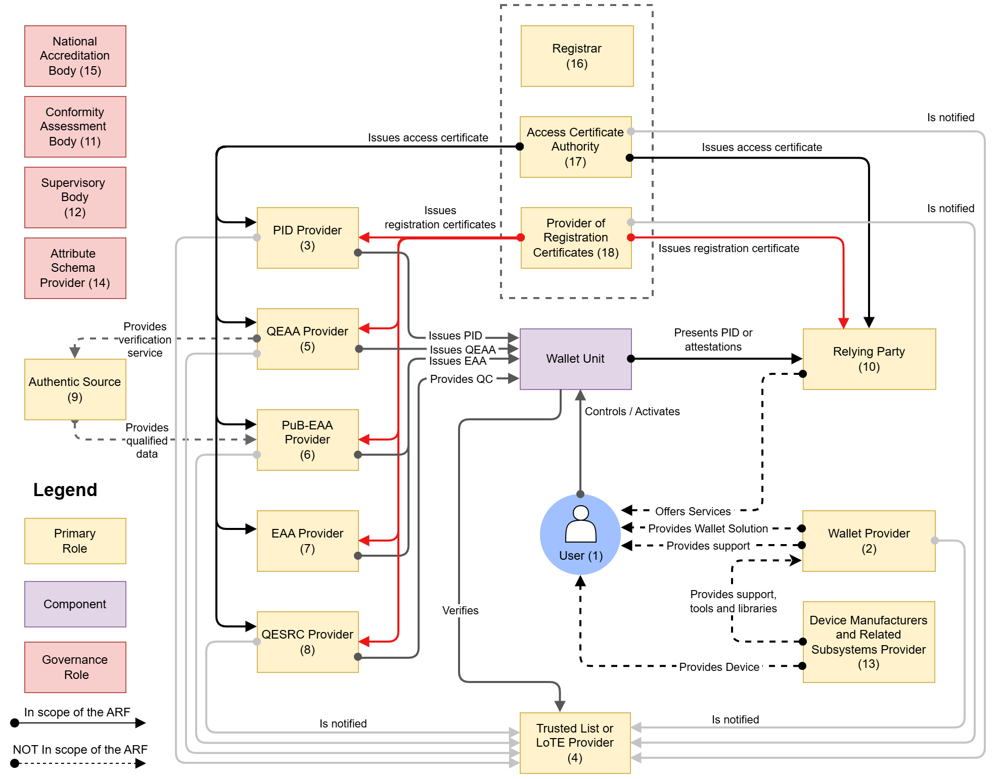

## 3 Roles within the EUDI Wallet ecosystem

### 3.1 Introduction { #roles-introduction }

This chapter describes the EUDI Wallet ecosystem as it is foreseen in the [European
Digital Identity Regulation]. The main roles and components in the EUDI Wallet ecosystem
are depicted in Figure 1 and described in the following sections.

Note that a single entity may combine multiple of the roles depicted in
the figure, as long as that entity complies with all requirements, both legal
and technical, for each of the roles. In addition, potential conflicts of
interest are to be avoided, but this issue is outside the scope of this ARF.

*Figure 1: Overview of the EUDI Wallet ecosystem roles and components*

The table below summarizes the main roles in the EUDI Wallet ecosystem, as shown in Figure 1. Each role
is detailed in the corresponding referenced section.

| Role | Primary Responsibility | Section |
| ------------------------------ | ------------------------------------ | --------------------- |
| **User of Wallet Unit** | Manage, store, and present PIDs/attestations. | [Section 3.2][32-users-of-wallet-units] |
| **Wallet Provider** | Make the certified Wallet Solution available to Users. | [Section 3.3][33-wallet-providers] |
| **PID Provider** | Issue Person Identification Data (PID) to Users. | [Section 3.4][34-person-identification-data-pid-providers] |
| **Trusted List Provider or LoTE Provider** | Maintain, manage, and publish Trusted Lists or Lists of Trusted Entities (LoTE). | [Section 3.5][35-trusted-list-provider-or-lote-provider] |
| **QEAA Provider** | Issue Qualified Electronic Attestations of Attributes (QEAAs). | [Section 3.6][36-qualified-electronic-attestation-of-attributes-qeaa-providers] |
| **PuB-EAA Provider** | Issue EAAs on behalf of a public sector body. | [Section 3.7][37-eaa-issued-by-or-on-behalf-of-a-public-sector-body-responsible-for-an-authentic-source-pub-eaa-providers] |
| **EAA Provider** | Issue Non-Qualified Electronic Attestations of Attributes (EAAs). | [Section 3.8][38-non-qualified-electronic-attestation-of-attributes-eaa-providers] |
| **Qualified Electronic Signature Remote Creation (QESRC) Provider** | Provide Qualified Electronic Signature Remote Creation services. | [Section 3.9][39-qualified-electronic-signature-remote-creation-qesrc-providers] |
| **Authentic Source** | Act as the definitive repository for specific attributes. | [Section 3.10][310-authentic-sources] |
| **Relying Party (RP) / Intermediary** | Request and receive attributes from a Wallet Unit. | [Section 3.11][311-relying-parties-relying-party-services-relying-party-instances-and-intermediaries] |
| **Conformity Assessment Body (CAB)** | Certify Wallet Solutions and audit Trust Service Providers. | [Section 3.12][312-conformity-assessment-bodies-cab] |
| **Supervisory Body** | Review the proper functioning of ecosystem actors. | [Section 3.13][313-supervisory-bodies] |
| **Device Manufacturers / Subsystems** | Provide the underlying platform (hardware, OS, secure elements). | [Section 3.14][314-device-manufacturers-and-related-subsystems-providers] |
| **Attestation Scheme Provider** | Define and publish the Attestation Rulebooks and schemes. | [Section 3.15][315-attestation-scheme-providers-for-qeaas-pub-eaas-and-eaas] |
| **National Accreditation Body (NAB)** | Accredit CABs according to EU regulations. | [Section 3.16][316-national-accreditation-bodies] |
| **Registrar** | Manages the registration of Providers and Relying Parties. | [Section 3.17][317-registrars] |
| **Access Certificate Authority (Access CA)** | Issue access certificates for authentication. | [Section 3.18][318-access-certificate-authorities] |
| **Provider of Registration Certificates** | Issue certificates detailing registration status and scope. | [Section 3.19][319-providers-of-registration-certificates] |

### 3.2 Users of Wallet Units

Users of Wallet Units use the Wallet Unit to receive, store, and present PIDs,
QEAAs, PuB-EAAs, or non-qualified EAAs to Relying Parties. Users can also create
qualified electronic signatures and seals (QES) and create and present
pseudonyms.

[CIR 2024/2982](https://eur-lex.europa.eu/legal-content/EN/TXT/?uri=OJ:L_202402982)
(among others) defines 'wallet user' as 'a user who is in control of the wallet
unit'. Being in control of the Wallet Unit implies being able to present a PID
or attestation to a Relying Party. Within the use cases described in the current
version of the ARF, the User is the subject of the PID(s) in the Wallet Unit.
The User is also the subject of most of the attestations in the Wallet Unit, but
there could be attestations related to objects owned or used by the User, such as a vehicle registration card. Additionally, the Wallet Unit could contain attestations that have no subject, such as vouchers. Such attestations will be valid for any User that can present it
to a Relying Party.

Please note that:

- the topic of Wallet Units for legal persons, possibly containing a legal-person PID, has been removed from this ARF in view of the development of a separate business wallet.
- this ARF assumes that a User device is a personal device,
meaning that the User will not share it with other people, and that only the
User can access and control the Wallet Unit. This also implies that all PIDs and
attestations on the Wallet Unit pertain to that User (or to entities represented
by, or objects owned by or linked to, that User).

The use of a Wallet Unit by citizens is not mandatory under the [European
Digital Identity Regulation]. However, each Member State will provide at least
one European Digital Identity Wallet within 24 months after the entry into force
of the Implementing Acts referred to in the [European Digital Identity
Regulation].

### 3.3 Wallet Providers

Wallet Providers are Member States or organisations either mandated or
recognised by Member States making a Wallet Solution available to Users. All
Wallet Solutions must be certified as described in [Chapter 7][7-wallet-solution-certification-and-risk-management].

A Wallet Provider makes a combination of several products and Trust Services
available to a User, which give the User sole control over the use of their
Person Identification Data (PID) and Electronic Attestations of Attributes
(QEAA, PuB-EAA or EAA), and any other personal data within their Wallet Unit.
This also implies guaranteeing a User sole control over sensitive cryptographic
material (e.g., private keys) related to their Wallet Unit.

Wallet Providers are responsible for ensuring compliance with the requirements
for Wallet Solutions.

From the viewpoint of the other actors in the EUDI Wallet ecosystem, the Wallet
Provider is responsible for all components of the Wallet Unit. These components
are described in [Section 4.3.2][432-components-of-a-wallet-unit]. In
particular, the Wallet Provider is responsible for ensuring that the Wallet
Instance can access a Wallet Secure Cryptographic Device (WSCD) that has a level
of security sufficient to ensure that the Wallet Unit can achieve Level of
Assurance High, as required in the [European Digital Identity Regulation] for the PID.
This is true even if the WSCD is not delivered by the Wallet Provider but
is integrated into the User device.
For more information, see [Section 4.5][45-wscd-architecture-types]. Other actors
in the ecosystem do not need to interact with or explicitly trust a WSCA or WSCD
supplier. As explained in [Section 6.5.3.4][6534-wallet-provider-issues-one-or-more-key-attestations-to-the-wallet-unit],
Wallet Providers sign Wallet Instance Attestations (WIA) and Key Attestations (KA), and issue them to the Wallet Unit:

- A Key Attestation (KA) attests that a WSCA/WSCD or keystore used by the Wallet Unit complies with the relevant requirements. A Key Attestation contains public keys whose corresponding private keys are managed by that WSCA/WSCD or keystore. Finally, it carries a revocation reference for that WSCA/WSCD or keystore.
- A Wallet Instance Attestation (WIA) attests the integrity and authenticity of the Wallet Instance (i.e., the app installed on the User device), and carries a revocation reference for the Wallet Instance.

### 3.4 Person Identification Data (PID) Providers

PID Providers are trusted entities responsible for:

- verifying the identity of the User in compliance with LoA high requirements,
- issuing a PID to the Wallet Unit, and
- making available, in a privacy-preserving way, information for Relying Parties
to verify the validity of the PID.

The terms and conditions of these services are for each Member State to determine.

PID Providers may be the same organisations that today issue official identity
documents, electronic identity means, etc. PID Providers may be the same
organisations as Wallet Providers. In case an organisation acts as both a PID
Provider and a Wallet Provider, it complies with all requirements for both PID
Providers and Wallet Providers.

### 3.5 Trusted List Provider or LoTE Provider

A Trusted List Provider is a body responsible for maintaining, managing,
and publishing Trusted Lists. Similarly, a LoTE Provider is responsible for maintaining, managing,
and publishing Lists of Trusted Entities (LoTE). An entity's status as a trusted entity can be verified by checking whether they are present on the relevant Trusted List or LoTE. 

Within the EUDI Wallet ecosystem, Trusted Lists exist only for QEAA Providers, see [Section 3.6][36-qualified-electronic-attestation-of-attributes-qeaa-providers], since these are QTSPs in the sense of [Art. 22 of the European Digital Identity Regulation](https://eur-lex.europa.eu/legal-content/EN/TXT/?uri=uriserv%3AOJ.L_.2014.257.01.0073.01.ENG#d1e2162-73-1). This Article requires Member States to list QTSPs and the qualified trust service they provide in national Trusted Lists. Each Member States signs and publishes its Trusted Lists and makes the URL of the Trusted Lists available to a common trust infrastructure ("List of Trusted Lists", LOTL) maintained by the Commission. Using the common infrastructure, any entity in the EUDI Wallet ecosystem will be able to
find all Trusted Lists in the ecosystem.

On the other hand, Lists of Trusted Entities exist within the EUDI Wallet ecosystem for:

- Wallet Providers, see [Section 3.3][33-wallet-providers],
- PID Providers, see [Section 3.4][34-person-identification-data-pid-providers],
- PuB-EAA Providers, see [Section 3.7][37-eaa-issued-by-or-on-behalf-of-a-public-sector-body-responsible-for-an-authentic-source-pub-eaa-providers].
- Access Certificate Authorities, see [Section 3.18][318-access-certificate-authorities],
- Providers of registration certificates, see [Section 3.19][319-providers-of-registration-certificates].

These LoTEs are signed and published by the Commission. In order to be put on a LoTE, relevant entities must be notified to the Commission by a Member State. For all mentioned entities except Wallet Providers, this happens after the entity has been registered by a Registrar in the Member State, see [Section 3.17][317-registrars]. The Commission publishes the locations of the LoTEs in the Official Journal of the EU (OJEU). 

Notes:

- Trusted Lists comply with [ETSI TS 119 612]; LoTEs comply with [ETSI TS 119 602];
- There is no Trusted List or LoTE for Relying Parties. The expected number of Relying
Parties in the Union would make this infeasible. Instead, a Relying Party
receives one or more access certificate(s) from an Access Certificate Authority (see [Section 3.18][318-access-certificate-authorities]), and these
certificates allow a Wallet Unit to authenticate the Relying Party.
- Wallet Providers, PID Providers, PuB-EAA Providers, Access Certificate Authorities, and Providers
of registration certificates are not trust service providers in the sense of the
[European Digital Identity Regulation]. For that reason, they are included in a LoTE, not in a Trusted List in the sense of [Article 22](https://eur-lex.europa.eu/legal-content/EN/TXT/?uri=uriserv%3AOJ.L_.2014.257.01.0073.01.ENG#d1e2162-73-1).
- Non-qualified EAA Providers are trust service providers in the sense of the
[European Digital Identity Regulation]. Therefore, Trusted Lists and Trusted
List Providers may also exist for non-qualified EAA Providers. However, this is
out of scope of the ARF.
- If an entity is put on a Trusted List or LoTE, it is never removed from it. However, its status can be set to Invalid to indicate that the entity is no longer trusted.

The use of Trusted Lists and LoTEs is described in more detail in [Section 6.2.2][622-wallet-provider-notification] for Wallet Providers,
[Section 6.3.2][632-pid-provider-or-attestation-provider-registration-and-notification] for PID Providers and Attestation Providers
and [Section 6.4.2][642-relying-party-registration] for Access Certificate Authorities and Providers of registration certificates. 

For more information and high-level requirements, please refer to [Topic 27][topic-27]
and to [Topic 31][topic-31].

### 3.6 Qualified Electronic Attestation of Attributes (QEAA) Providers

Qualified EAAs are provided by Qualified Trust Service Providers (QTSPs). The
general trust framework for QTSPs (see Chapter III, Section 3 of the [European
Digital Identity Regulation] applies also to QEAA Providers, but specific rules
for the Trust Service of issuing QEAAs may be defined as well.

QEAA Providers maintain an interface to Wallet Units to provide QEAAs upon
request. Potentially, they also maintain an interface towards Authentic Sources
to verify the value of User attributes, as specified in
[Topic 42][topic-42].

It is likely that for most QEAAs, a QEAA Provider will need to verify the
identity of a User when issuing a QEAA. The reference standards and procedures
for this verification are laid down in [CIR 2025/1566]. Within those
constraints, it is up to each QEAA Provider to implement the necessary User
authentication processes, in compliance with all applicable national and Union
legislation. Note that, when User identity verification is necessary, it is
likely that the User requesting a QEAA already possesses a PID. This would
enable the QEAA Provider to carry out User identification and authentication at
LoA high, by requesting and verifying User attributes from the PID in the Wallet
Unit. See also [Section 6.6.2.1][6621-required-trust-relationships].

The terms and conditions of these services are for each QEAA Provider to
determine, beyond what is specified in the [European Digital Identity Regulation].

### 3.7 EAA issued by or on behalf of a public sector body responsible for an authentic source (PuB-EAA) Providers

As specified in the [European Digital Identity Regulation], an attestation may
be issued by or on behalf of a public sector body responsible for an Authentic
Source. This ARF calls such an attestation a PuB-EAA. For a description of
Authentic Sources, see [Section 3.10][310-authentic-sources]. A public sector
body is a state, regional or local authority, or a body governed by
public law.

A PuB-EAA Provider, meaning a public sector body issuing PuB-EAAs, is not a
QTSP. Rather, a PuB-EAA Provider is notified to the Commission by a Member State, in a manner similar to the notification of PID Providers. A Relying Party verifies a PuB-EAA by
verifying the signature over the PuB-EAA using a trust anchor from the PuB-EAA Provider LoTE. For more details, refer
to [Section 6.6.3.6][6636-relying-party-instance-verifies-the-authenticity-of-the-pid-or-attestation].
The [European Digital Identity Regulation] stipulates that PuB-EAAs, like QEAAs,
have the same legal effect as attestations in paper form. It is up to the Member
States to define terms and conditions for the provisioning of PuB-EAAs, but
PuB-EAA Providers will comply with the same technical specifications and
standards as Providers of PIDs and other attestations.

For the precise and legally binding definitions and obligations regarding the
issuance of PuB-EAAs, please refer to the [European Digital Identity Regulation] and to [CIR 2025/1569], particularly Article 5 and 6.

### 3.8 Non-Qualified Electronic Attestation of Attributes (EAA) Providers

Non-qualified EAAs can be provided by any (non-qualified) Trust Service
Provider. While they will be supervised under the [European Digital Identity
Regulation], it can be assumed that other legal or contractual frameworks will
mostly govern the rules for provision, use and recognition of EAAs. Those other
frameworks may cover policy areas such as educational credentials, digital
payments, although they may also rely on Qualified Electronic Attestation of
Attributes Providers. For non-qualified EAAs to be used, EAA Providers offer
Users a way to request and obtain these EAAs. This implies that these
non-qualified EAA Providers comply with the Wallet Unit interface
specifications. The terms and conditions of issuing EAAs and related services
are subject to sectoral rules.

### 3.9 Qualified Electronic Signature Remote Creation (QESRC) Providers

The Wallet Unit will allow the User to create qualified electronic signatures or
seals over any data. This will also enhance the use of the Wallet Unit for
signing, in a natural and convenient way. The creation of a qualified electronic
signature or seal by the Wallet Unit can be achieved by means of a local QSCD, as discussed in [Section 4.3.2][432-components-of-a-wallet-unit].

However, the Wallet Unit can also connect to a remote QSCD, managed by a QTSP called a Qualified Electronic Signature Remote Creation (QESRC) Provider. As part of the EUDI Wallet ecosystem, the use of common interfaces and protocols for provisioning qualified electronic signatures and seals will create a unified European market for QESRC Providers.

Besides providers for the remote creation of qualified electronic signatures and seals, also providers for the remote creation of non-qualified electronic signatures or seals may exist. However, such providers are out of scope of this ARF.

### 3.10 Authentic Sources

Authentic Sources are public or private repositories or systems, recognised or
required by law, containing attributes about natural or legal persons. Authentic
Sources are sources for attributes on, for instance, address, age, gender, civil
status, family composition, nationality, education and training qualifications
titles and licences, professional qualifications titles and licences, public
permits and licences, or financial and company data.

Authentic Sources are required to provide an interface to QEAA Providers to
verify the authenticity of the above attributes, either directly or via
designated intermediaries recognised at national level. Authentic Sources may
act as PuB-EAA Providers if they meet the requirements of the [European Digital Identity Regulation], see [Section 3.7][37-eaa-issued-by-or-on-behalf-of-a-public-sector-body-responsible-for-an-authentic-source-pub-eaa-providers].
In [Figure 1][roles-introduction] this is indicated by the arrow 'provides
qualified data'.

### 3.11 Relying Parties, Relying Party Services, Relying Party Instances, and intermediaries

#### 3.11.1 Relying Parties

A Relying Party is a service provider requesting User attributes contained within a
PID, QEAA, PuB-EAA, or EAA from the Wallet Unit, subject to the approval of the
User and within the limits of applicable legislation and rules.

> Note: As specified in the [European Digital Identity Regulation], legally
speaking, the term 'wallet-relying party' includes Attestation Providers (i.e., QEAA
Providers, PuB-EAA Providers, and non-qualified EAA Providers), as well as
service providers. However, technically speaking the responsibilities of
Attestation Providers are quite different from those of service providers, as is
the way they interact with Wallet Units. Therefore, for clarity the term
'Relying Party' is used in all parts of the ARF exclusively to mean a service
provider interacting with a Wallet Unit to request and receive User attributes.

The reason for a Relying Party to rely on the Wallet Unit may be a legal
requirement, a contractual agreement, or their own decision. In particular, the
[European Digital Identity Regulation], Article 5f(3), requires that providers of very large
online platforms accept the EUDI Wallet for user authentication only upon the voluntary request
of the User and in respect of the minimum data necessary for the specific online service.

To rely on Wallet Units for the purpose of providing a service, Relying Parties
register at a Registrar in the Member State where they are established. During registration, the Registrar assigns an EU-wide unique Relying Party identifier to each Relying Party. This identifier could, for example, be a concatenated list of one or more registered official Relying Party identifiers listed in Annex I(3) of the [CIR 2025/848] regarding registration of Wallet Relying Parties, expressed in the semantic form defined in [ETSI EN 319 412-1] sections 5.1.4 or 5.1.5. The Relying Party provides a user-friendly trade name and Service trade name, which will be used by a Wallet Unit to identify the Relying Party towards its User during a presentation of attributes.

During registration, a Relying Party receives one or more access certificates and one or more registration certificates. Its Relying Party identifier and trade name, as well as its Service identifier and trade name, are included in both types of certificate. See [Section 6.4.2][642-relying-party-registration] and [Technical Specification 5](../technical-specifications/ts5-common-formats-and-api-for-rp-registration-information.md) for more information on Relying Party registration, access certificates, and registration certificates.

#### 3.11.2 Relying Party Services

A Relying Party may be a big organisation that offers multiple services that have (partly or wholly) different intended uses, and therefore will request different sets of attributes from a Wallet Unit. Moreover, the Relying Party may want to ensure that its different services cannot access each other's data, or use each other's access certificates or registration certificates towards Wallet Units. To enable such a separation of concerns between Relying Party services, [Technical Specification 5](../technical-specifications/ts5-common-formats-and-api-for-rp-registration-information.md) introduces the concept of a Relying Party Service. During registration, a Relying Party registers at least one Service. For every Service, it specifies a Relying Party Service identifier. This identifier can be freely chosen by the Relying Party, as long as it is unique for the given Relying Party. It could, for example, be an existing OAuth ``client_id`` for the given service. Note that if the Relying Party registers only one service (for example because it is a small business), the Service identifier could be an empty string, or "N/A", or similar. It is up to each Registrar to set applicable rules if needed.

As specified in [Technical Specification 5], the Relying Party also registers one or more intended uses. The identifiers of these intended uses are generated by the Registrar, not the Relying Party. The Relying Party also indicates which of its Service(s) has which intended use(s), and it provides a user-friendly trade name and description of the Service, as well as a user-friendly description of the intended use(s).

EXAMPLE: If a Relying Party registers Services A, B, and C, and also registers intended uses 1, 2, 3, 4, and 5, it may subsequently register that

- Service A has intended uses 1 and 2,
- Service B has intended uses 2, 3, 4, and 5,
- Service C has intended use 4.

In this example the Registrar would issue seven registration certificates to this Relying Party, two for service A, four for service B, and one for service C. Each registration certificate contains precisely one intended use, as well as the (Registrar-assigned, EU-wide unique) Relying Party identifier and the (Relying Party-chosen, Relying Party-unique) Relying Party Service identifier.

#### 3.11.3 Relying Party Instances

A Relying Party uses a system consisting of software and hardware to interact
with Wallet Units. The ARF calls such a system a Relying Party Instance. A
Relying Party Instance maintains an interface with Wallet Units to request PIDs and attestations. It implements Relying Party authentication, using an access
certificate obtained by the Relying Party, as described in
[Section 6.6.3.2][6632-wallet-unit-authenticates-the-relying-party-instance].
Note that a Relying Party can operate multiple Relying Party Instances.

To bind a Relying Party Instance to a Relying Party Service (as introduced in the previous section), the Registrar includes the Relying Party Service identifier also in the access certificate, next to the Relying Party identifier. Note that an access certificate is bound to a specific Relying Party Instance, because the public key in the certificate corresponds to a private key that is securely stored in the hardware of the Relying Party Instance.

To obtain an access certificate for a given Relying Party Instance, a Relying Party requests that Relying Party Instance to generate a key pair. The Relying Party Instance securely stores the private key, and returns the public key to the Relying Party. The Relying Party then sends the public key to the Access CA (see [Section 3.18][318-access-certificate-authorities]) in a certificate signing request, together with a Relying Party identifier and a Relying Party Service identifier. The Access CA returns a signed access certificate that includes (and thus binds together) the public key and both identifiers.

Note that if a single Relying Party Instance is used by multiple Services of the same Relying Party, the Relying Party can request multiple access certificates for that Relying Party Instance, each bearing a different Service identifier. Of course, to prevent misuse, the Relying Party should carefully control access to its certificate-requesting functions.

#### 3.11.4 Intermediaries

So-called intermediaries form a special class of Relying Party. Article 5b (10)
of the [European Digital Identity Regulation] states "Intermediaries acting on
behalf of relying parties shall be deemed to be relying parties and shall not
store data about the content of the transaction". Such an intermediary is a
party that offers services to Relying Parties to, on their behalf, connect to
Wallet Units and request the User attributes that these Relying Parties need.
The intermediary then sends the presented attributes to the intermediated
Relying Party. This implies that an intermediary performs all tasks assigned to
a Relying Party in this ARF on behalf of the intermediated Relying Party.

For a more detailed description of the interactions between an intermediated Relying Party, an intermediary, and a Wallet Unit, see [Section 6.6.5][665-pid-or-attestation-presentation-to-an-intermediary].

### 3.12 Conformity Assessment Bodies (CAB)

Conformity Assessment Bodies (CAB) are public or private bodies that are
accredited by a national accreditation body, which itself is designated by
a Member State according to [Regulation 765/2008](https://eur-lex.europa.eu/eli/reg/2008/765/2021-07-16)
Article 4. In particular, CABs are accredited to carry out assessments on
which Member States will rely before issuing a Wallet Solution or providing the
'qualified' status to a Trust Service Provider.

Wallet Solutions will be certified by CABs. QTSPs will be audited regularly by CABs.

The standards and schemes used by CABs to fulfil their tasks to certify Wallet
Solutions are discussed in [Chapter 7][7-wallet-solution-certification-and-risk-management].

### 3.13 Supervisory Bodies

Supervisory Bodies review the proper functioning of Wallet Providers and other
actors in the EUDI Wallet ecosystem. Supervisory Bodies will be created and
appointed by the Member States. The Supervisory Bodies will be notified to the
Commission by the Member States.

### 3.14 Device Manufacturers and Related Subsystems Providers

In the EUDI Wallet ecosystem, commercial actors such as device manufacturers and
related subsystems providers fulfil an important role to enable a Wallet Unit to
work smoothly and securely. Device manufacturers and related subsystem providers
provide a platform on which a Wallet Unit can be built. Wallet Providers ensure
that their Wallet Units use that platform to ensure usability, security,
stability and connectivity. The components provided by device manufacturers and
providers of related subsystems may include, among others, hardware, operating
systems, secure cryptographic hardware, libraries, and app stores.

### 3.15 Attestation Scheme Providers for QEAAs, PuB-EAAs and EAAs

An Attestation Scheme Provider defines a specific attestation type (e.g., QEAA,
PuB-EAA, or EAA) and publishes two complementary artefacts:

1. A human-readable Attestation Rulebook; see [Section 5.5][55-attestation-rulebooks-and-attestation-schemes],
the authoritative documentation that explains what the attestation represents
and how it works, detailing identifiers, semantics, encodings, constraints, and
processing rules, trust model;
2. A machine-readable attestation scheme that
mirrors the Rulebook so software can build requests to Wallet Units and validate
responses at runtime.

Relying Parties use the Rulebook to decide whether and how to adopt an
attestation and to prepare their systems, while their Relying Party Instances
rely on the attestation scheme in production.

For PID, the European Commission publishes the applicable
Rulebook.

Moreover, the Commission operates a catalogue of schemes and Rulebooks, setting
the related technical specifications, standards, and procedures, so ecosystem
participants can discover available attestations and understand how to request
and verify their attributes; A broad array of attestation schemes, including
sector-specific ones, is critical for interoperability and uptake. For more
information see [Section 5.6][56-catalogue-of-attributes-and-catalogue-of-attestation-schemes].

### 3.16 National Accreditation Bodies

National Accreditation Bodies (NAB), under [Regulation (EC) No 765/2008](https://eur-lex.europa.eu/legal-content/EN/TXT/?uri=celex:32008R0765),
are the bodies in Member States that perform accreditation with authority
derived from the Member State. NABs accredit CABs ([Section 3.12][312-conformity-assessment-bodies-cab])
as competent, independent, and supervised professional entities in
charge of certifying Wallet Solutions against normative document(s) establishing
the relevant requirements. NABs monitor the CABs to which they have issued an
accreditation certificate.

### 3.17 Registrars

All PID Providers, QEAA Providers, PuB-EAA Providers, non-qualified EAA
Providers, and Relying Parties in the EUDI Wallet ecosystem are registered by a
Registrar in the Member State where they reside under [CIR 2025/848]. As a result of registering an
entity,

- Data about the entity is registered by the Registrar and made available online
in human-readable and machine-readable format to any interested party. In
particular,
    - For a Relying Party, the Registrar mainly registers which attributes the
    Relying Party intends to request from Wallet Units, and for what purpose.
    The Registrar also registers if the Relying Party intends to use the
    services of an intermediary (see [Section 3.11.4][3114-intermediaries]) to
    interact with Wallet
    Units, and if so, which one. Conversely, if the Relying Party is an intermediary, the Registrar registers which Relying Parties use its services to connect to Wallet Units.
    - For a PID Provider, QEAA Provider, PuB-EAA Provider, or non-qualified EAA
    Provider, the Registrar registers the attestation type(s) this entity wants
    to issue to Wallet Units, for example, diplomas, driving licences, or vehicle
    registration cards.
- Registered entities receive one or more access certificate(s) from an Access Certificate
Authority, as described in [Section 3.18][318-access-certificate-authorities].
- Registered entities also receive a
registration certificate, as discussed in [Section 3.19][319-providers-of-registration-certificates].

The process and terms and conditions for registering will be determined by each
Member State.

Note: PID and Attestation Providers are, in addition to registration at their applicable Registrar, subject to notification under [CIR 2024/2980]. This is a separate legal flow which is not to be mixed with registration by a Registrar.

### 3.18 Access Certificate Authorities

Access Certificate Authorities issue an access certificate to all PID Providers,
QEAA Providers, PuB-EAA Providers, and non-qualified EAA Providers in the EUDI Wallet ecosystem. In addition, each Relying Party in the ecosystem also receives one or more access certificates, one for each of its Relying Party Instances. When these entities interact with a Wallet Unit to issue or request a PID or attestation, they will present an access
certificate to prove their authenticity and validity. In order to receive an
access certificate, an entity must be registered by a Registrar as described in
[Section 3.17][317-registrars].

> Note: In the Implementing Acts, the term 'wallet-relying party access certificate' refers to the certificate used by Relying Parties to authenticate towards Wallet Units. The ARF further clarifies that a Relying Party may operate multiple technical systems ('Relying Party Instances', see [Section 3.11.3][3113-relying-party-instances]) to interact with Wallet Units, and that each of these needs at least one separate access certificate to do so. However, the legal subject of all of these access certificates is the wallet-relying party.

An access certificate is a public key certificate, complying with [RFC 5280] and [ETSI TS 119 411-8].

Access Certificate Authorities are notified by a Member State to the Commission.
As part of the notification process, the trust anchors of the Access CA are
included in a List of Trusted Entities (LoTE) by the Commission. A trust anchor is the
combination of a public key and an identifier for the associated entity. Wallet
Units need these trust anchors to verify the signatures over the access
certificates presented to them when a new PID or attestation is issued or when
they receive an attribute presentation request from a Relying Party.

The Commission signs and publishes the Access CA LoTE and
publishes the URL of the LoTE in the OJEU. Any entity in the EUDI Wallet ecosystem will be able to
find the LoTE.

In order to enable detection of any event in which an access certificate was
issued erroneously or fraudulently, an
Access Certificate Authority logs all access certificates in a Certificate
Transparency log, once such a log is available for access certificates. For
more information, see the [Discussion Paper for Topic S](../discussion-topics/s-certificate-transparancy.md).
For high-level requirements on Certificate Transparency, see [Topic 55][topic-55].

An Access Certificate Authority operates a root CA, whose public keys act as the Authority's trust anchors in the LoTE. Moreover, it operates at least one signing CA, whose private keys are used to sign access certificates. In addition, it may operate one or more intermediate CAs, for example to achieve a separation of concerns between access certificates for PID Providers and Attestations Providers on the one hand and Relying Parties on the other hand. It is up to each Access Certificate Authority to decide on the number and nature of intermediate CAs.

### 3.19 Providers of registration certificates

A Registrar has one or
more associated Provider(s) of registration certificates. Such a Provider issues
one or more registration certificates to each registered Relying Party, PID
Provider, QEAA Provider, PuB-EAA Provider, and non-qualified EAA Provider. Each
registration certificate contains (a subset of) the data registered for that
entity, as described in [Section 3.17][317-registrars].

A registration certificate is signed by the Provider of registration
certificates that issued it. A registration certificate is a JSON Web Token (JWT) complying with [RFC 7519], not a X.509 public key certificate complying with [RFC 5280]. However, it is bound to the X.509-compliant access certificates issued to the same entity by an Access CA (see [Section 3.18][318-access-certificate-authorities]): both the access certificates and the registration certificate contain that entity's unique identifier and Service identifier. This enables a Wallet Unit to verify that a registration certificate it receives during attestation issuance (see [Section 6.6.2.3][6623-wallet-unit-verifies-providers-entitlements-and-registered-attestation-types]) or attestation presentation (see [Section 6.6.3.3][6633-wallet-unit-verifies-that-relying-party-does-not-request-more-attributes-than-it-registered]) belongs to the same entity as the access certificate that the Wallet Unit used to authenticate that entity.

>Note: The concept of a Service identifier is explained in [Section 3.11.2][3112-relying-party-services] in the context of Relying Parties. However, exactly the same logic can be applied to PID Providers and Attestation Providers, which can similarly have multiple services and service supply points. For example, a single entity within a Member State may issue both PIDs and photoIDs, and may wish to prevent that a service supply point used for issuing photoIDs can present a registration certificate showing an entitlement to issue PIDs.

Commission Implementing Regulation 2024/2982 
requires a Wallet Unit to verify and validate the registration
certificate. This enables Users:

- for a Relying Party they are interacting with, to verify that the attributes
being requested by the Relying Party are within the scope of their registered
attributes. This provides assurance that the request is legitimate and
trustworthy.
- for a PID Provider or Attestation Provider they are interacting with, to
verify that the issued attestation is within the scope of their registered
attestations. This provides assurance that the attestation is legitimate and
trustworthy.

> Note: The requirement for Wallet Units to verify and validate registration certificates only applies as of 24 months after entry into force of the Regulation amending [CIR 2024/2982].

Like Access Certificate Authorities (see previous section), Providers of
registration certificates are notified by a Member State to the Commission.
Their trust anchors are put on a List of Trusted Entities, such that they can be found by
Wallet Units and used to verify a registration certificate received from a
Relying Party.

A Provider of registration certificates operates a root CA, whose public keys act as the Provider's trust anchors in the LoTE. Moreover, it operates at least one signing CA, whose private keys are used to sign registration certificates. In addition, it may operate one or more intermediate CAs, for example to achieve a separation of concerns between registration certificates for PID Providers and Attestations Providers on the one hand and Relying Parties on the other hand. It is up to each Provider of registration certificates to decide on the number and nature of intermediate CAs.

