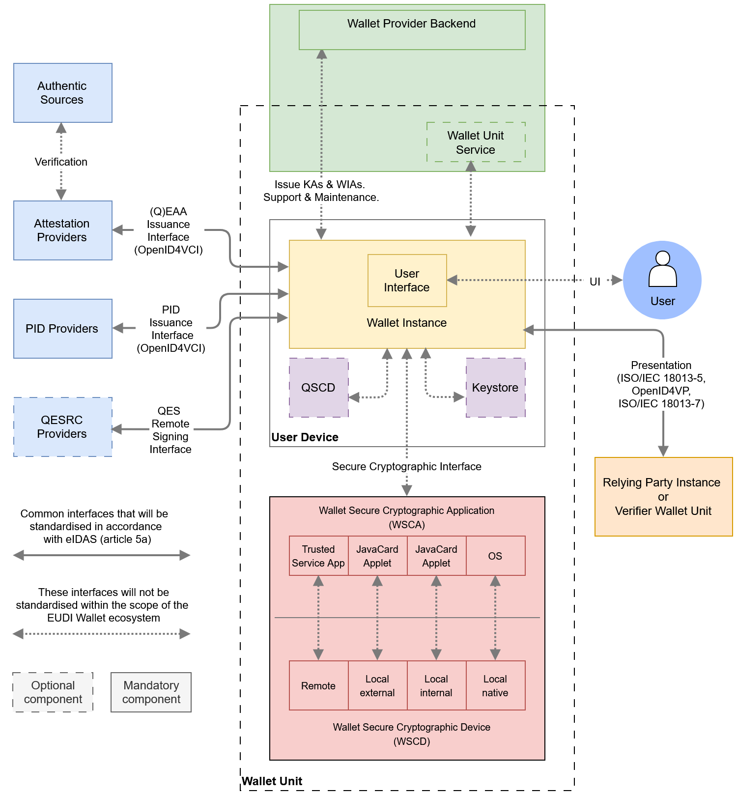
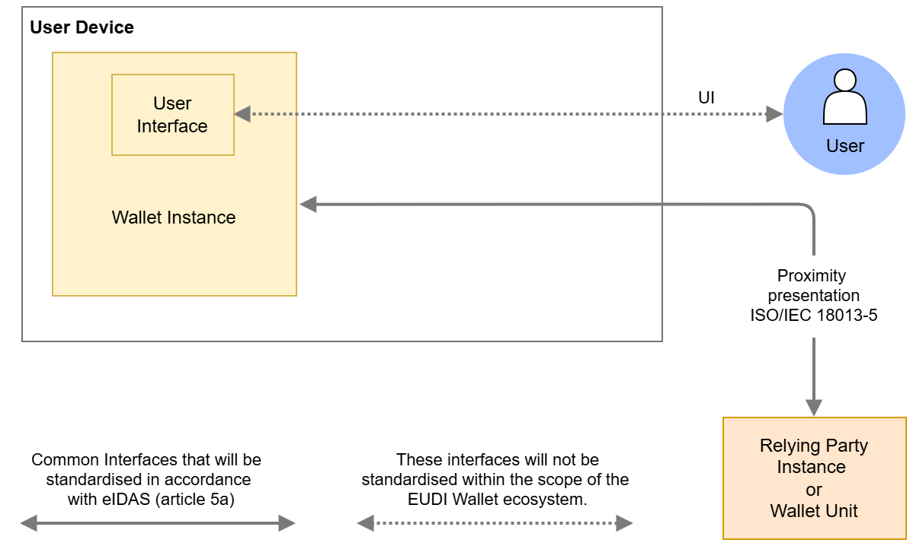
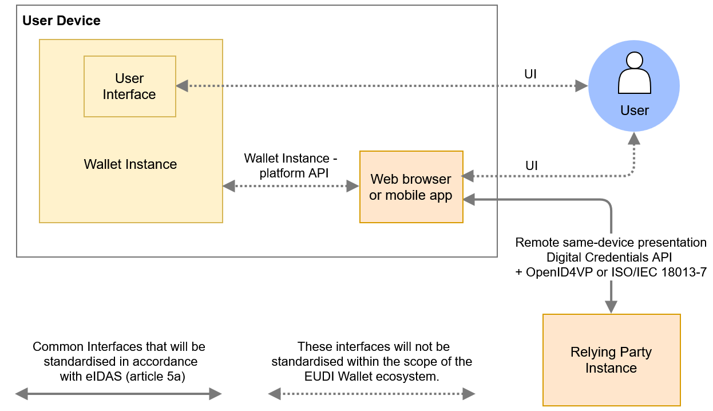
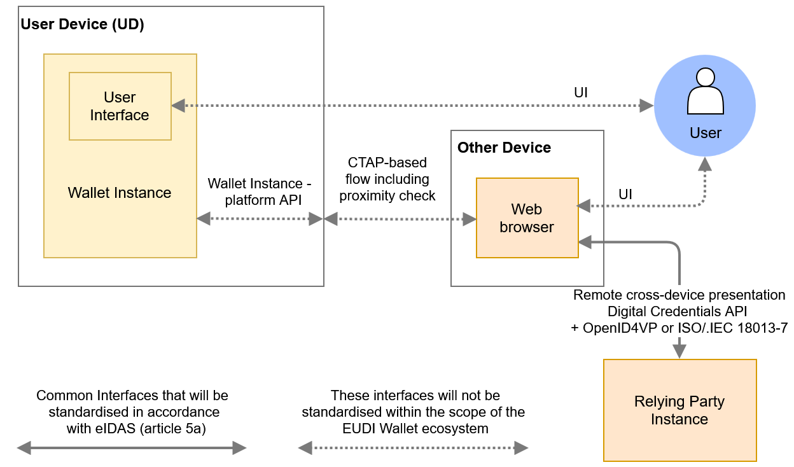
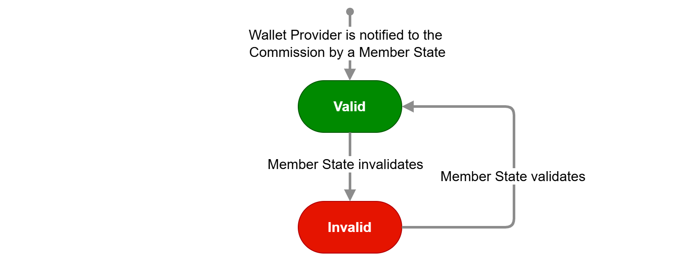
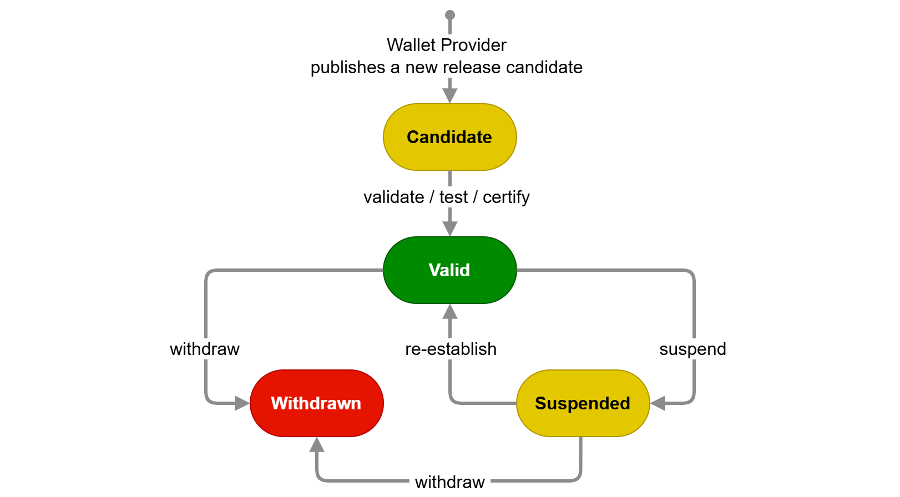
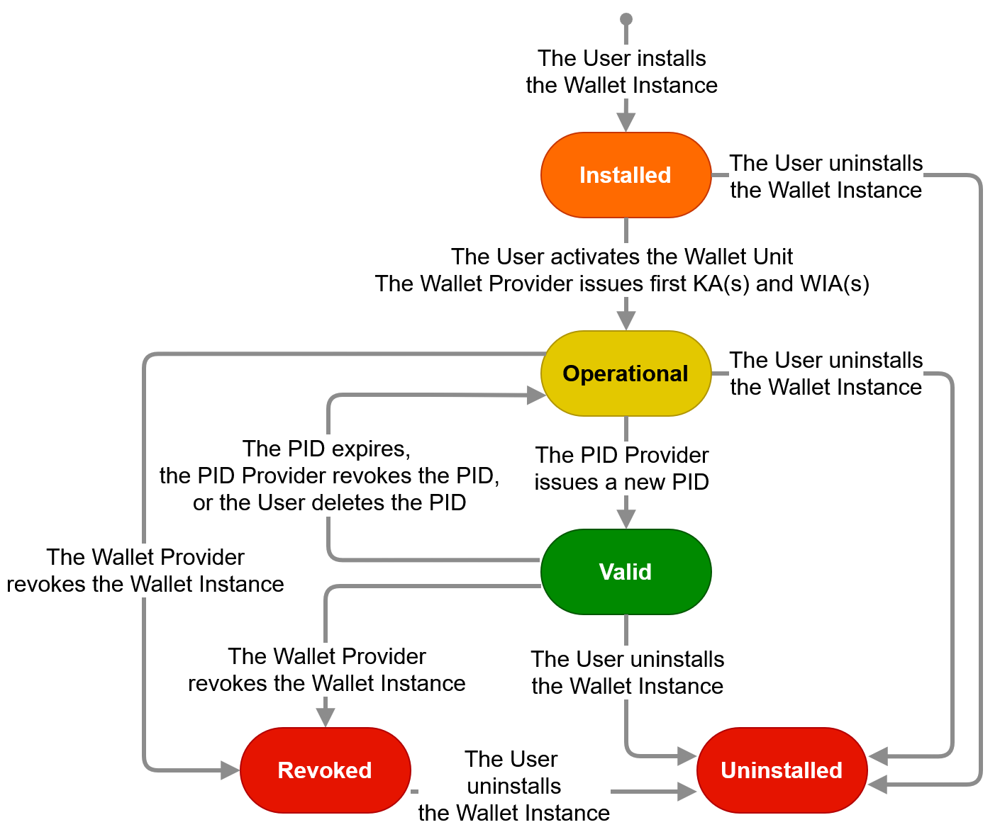
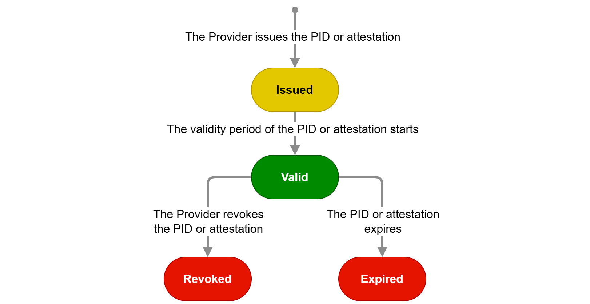
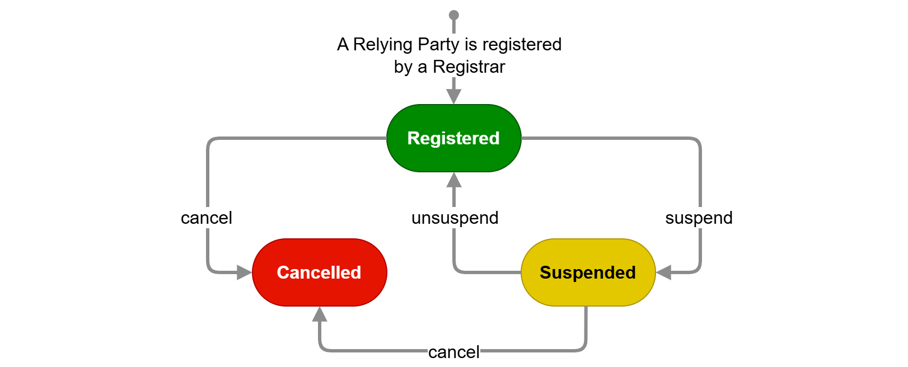

## 4 High-level architecture

### 4.1 Introduction

This chapter provides a broad overview of the EUDI Wallet ecosystem's core
components, their interfaces, and the overall design principles. This chapter is
structured as follows:

- [Section 4.2][42-design-principles] discusses the design principles that
guided the design of the EUDI Wallet ecosystem, as described in this ARF.
- [Section 4.3][43-reference-architecture] presents an overview of the
ecosystem's architecture, focussing on the components that make up a Wallet Unit
and on the interfaces between a Wallet Unit and other entities, as well as the
protocols used on these interfaces.
- [Section 4.4][44-data-presentation-flows] discusses the different attestation
presentation flows enabled by this architecture, and in particular the
mechanisms foreseen to enable and secure remote presentation flows in which the
Wallet Unit and the Relying Party interact over the internet.
- [Section 4.5][45-wscd-architecture-types] briefly discusses the different
architecture types a Wallet Providers may use for implementing a Wallet
Secure Cryptographic Device into their Wallet Solutions.
- [Section 4.6][46-state-diagrams] presents state diagrams for all of the main
entities and components in the EUDI Wallet ecosystem, discussing all of the
states a particular component can be in, as well as the conditions triggering
state transitions.
- [Section 4.7][47-possible-implementations-of-pseudonyms] discusses how pseudonyms can be implemented and used within a Wallet Unit.

### 4.2 Design principles

To effectively translate the [European Digital Identity Regulation] into a
User-friendly, privacy-focused, and secure technical architecture, establishing
design principles is crucial. These principles, rooted in the regulatory
framework and enriched by industry best practices, will serve as fundamental
guidelines. This approach ensures compliance with requirements emphasising
User-centricity, accessibility, privacy, security, and cross-border
interoperability. It demonstrates a commitment to both regulatory alignment and
excellence in the EUDI Wallet architecture's design.

#### 4.2.1 User-centricity

The EUDI Wallet ecosystem prioritises User-centricity as a core design
principle. This means placing User needs and experience at the forefront of
every design decision. The Wallet Unit should be intuitive and easy to use, with
seamless integration into existing use cases. Wallet Units make it easy for
Users to exercise their legal rights to full control over their attributes and
privacy, with transparent information about what attributes are being presented
and to whom. Additionally, the Wallet Unit should be accessible and inclusive,
catering to Users with varying technical backgrounds and abilities. By
prioritising User-centricity, the EUDI Wallet ecosystem fosters trust and
encourages widespread adoption, ultimately achieving its goal of empowering
Users with secure and convenient digital identity management.

#### 4.2.2 Accessibility

Regarding the accessibility of Wallet Units for Users, it is essential to ensure
that Wallet Units are inclusive by design and fully aligned with the
applicable European legal and technical frameworks on accessibility. The same
applies to any other User-facing component of the EUDI Wallet ecosystem, such as
websites and User authentication methods of PID Providers and Attestation
Providers, registries (see [Section 3.17][317-registrars]), et cetera. This is
not only a matter of legal compliance but also a fundamental component of
ensuring equal access, User trust, and widespread adoption across all segments
of the population, including persons with disabilities.

For more information, please refer to [Chapter 8][8-accessibility].

#### 4.2.3 Interoperability

The EUDI Wallet ecosystem prioritises interoperability as a core design
principle. This ensures a Wallet Unit functions seamlessly across borders within
the EU. Users can travel freely and confidently utilise their digital identity
wallets for various services, from e-government platforms to private online
interactions. Interoperability fosters secure data exchange through standardised
protocols, allowing trusted entities to verify credentials effortlessly. This
not only simplifies the User experience but also strengthens overall security
within the system. Moreover, interoperability prevents market fragmentation by
creating a level playing field for different Wallet Solutions. It fosters
competition and collaboration, ultimately driving innovation in the EUDI Wallet
ecosystem. By prioritising interoperability, the EUDI Wallet architecture lays
the foundation for a trusted and universally accepted EUDI Wallet ecosystem
across the EU.

#### 4.2.4 Privacy by design

The EUDI Wallet architecture embodies the principle of privacy by design. This
means that the protection of User data is a fundamental pillar of the
architecture's design. The principle of data minimisation guides the collection
of personal information, ensuring that Relying Parties gather only the
attributes they need and have registered for. By enabling selective disclosure
of attributes, the Wallet Unit empowers Users with granular control over what
data is presented and to whom. Transparency is built into the system, with clear
explanations of how data is used and protected. By making privacy a cornerstone
from the beginning, the EUDI Wallet ecosystem aims to foster trust and protect
the fundamental rights of its Users. Finally, measures are taken to prevent
Users from being tracked by Relying Parties, PID Providers, or Attestation
Providers.

For more information, please refer to [Sections 7.4.3.4][7434-risks-and-mitigation-measures-related-to-authorisation]
and [7.4.3.5][7435-risks-and-mitigation-measures-related-to-user-privacy].

#### 4.2.5 Security by design

The EUDI Wallet architecture embraces the principle of security by design. This
means security considerations are woven into the very fabric of the
architecture's design. Throughout the design process, potential vulnerabilities
are identified and mitigated. Secure coding practices are mandated, and the
architecture itself minimises attack surfaces by compartmentalising sensitive
data and access controls. By prioritising security from the outset, the EUDI
Wallet architecture aims to be inherently resistant to cyberattacks and data
breaches, fostering trust and User confidence in this EUDI Wallet ecosystem.

For more information, please refer to [Sections 7.4.3.2][7432-risks-and-mitigation-measures-related-to-confidentiality-integrity-and-authenticity]
and [7.4.3.3][7433-risks-and-mitigation-measures-related-to-tampering-of-cryptographic-keys-and-sensitive-data].

### 4.3 Reference architecture

#### 4.3.1 Overview

The figure below gives an overview of the architecture of the EUDI Wallet
ecosystem and its components. In comparison to [Figure 1][roles-introduction],
this figure presents more detail on the composition of a Wallet Unit and its
interfaces to other entities. The depicted components of a Wallet Unit are
described in [Section 4.3.2][432-components-of-a-wallet-unit],
while the interfaces are described in [Section 4.3.3][433-wallet-unit-interfaces-and-protocols].
The other entities shown in the figure were already described in [Chapter 3][3-roles-within-the-eudi-wallet-ecosystem].

*Figure 2: EUDI Wallet ecosystem reference architecture*

Figure 2 shows the high-level components and interfaces of the EUDI Wallet
ecosystem. The **Wallet Unit** is shown interacting with external entities through standardized
protocols for its entire lifecycle. The components of the Wallet Unit are
detailed in [Section 4.3.2][432-components-of-a-wallet-unit].

#### 4.3.2 Components of a Wallet Unit

The following have been identified as the core components of a Wallet Unit:

- **User device**: A User Device comprises the hardware, operating system,
and software environment required to host and execute the Wallet Instance. The
minimum hardware and software requirements for the User device will be
determined by the Wallet Provider.

- **Wallet Instance**: The app or application installed on a User device,
which is an instance of the corresponding software that is part of the Wallet Solution and belongs to and is controlled by a
User. This component implements the core business logic and interfaces as
depicted in Figure 2. It directly interacts with the WSCA (which is interacting
with the WSCD, see bullets hereafter) to securely manage critical assets and
execute cryptographic functions. It optionally interfaces with one or more keystores for
the management of non-critical cryptographic assets. Regarding the possible implementations of a Wallet Instance, please note the following:

    - The wordings used above and in the remainder of this and the following sections assume that a Wallet Instance is an app installed on a User device. However, a Wallet Instance can also be a web application. If this is the case, instead of opening the app, the User would log in to their web wallet using the browser on their User device. In such an architecture, typically no data is stored locally. Apart from UI aspects and short-range interfaces, all functions of the Wallet Unit are executed by the Wallet Unit Service running on the Wallet Provider backend depicted in Figure 2 and briefly discussed in the next section. Also, this implies that the WSCD will be a remote HSM, as discussed in [Section 4.5.2][452-remote-wscd]. All requirements in the ARF are applicable regardless of whether the Wallet Instance is a mobile app or a web app, except where explicitly indicated.
    - Similarly, the [European Digital Identity Regulation] does not exclude the possibility that a Wallet Instance may be installed on a non-mobile device, for example a server. The requirements in this ARF also apply for the installation of a Wallet Unit on a User device that is not a mobile device.
    - A User device can host more than one Wallet Instance, either provided by multiple Wallet Providers or by the same one, if supported by that Wallet Provider. If a User device hosts multiple Wallet Instances, it is part of multiple Wallet Units. In such a case, all requirements in this ARF for a single Wallet Unit and its components apply to each one independently.
    - The exact functionalities of the Wallet Instance depend on whether the Wallet Provider chooses to use a Wallet Unit Service (running on the Wallet Provider backend) as part of the Wallet Unit, see below. If a Wallet Unit Service is present, some tasks and responsibilities will be divided between the Wallet Instance and the Wallet Unit Service.

- **Wallet Secure Cryptographic Device (WSCD)**: A tamper-resistant device that
provides an environment that is linked to and used by the Wallet Secure
Cryptographic Application (WSCA) to protect critical assets and to securely
execute cryptographic functions. This includes a hardware-backed repository for storing and managing cryptographic keys and other critical assets, but also the
environment where related security-critical functions are executed. The WSCD is
tamper-proof and duplication-proof. In fact, [CIR 2024/2981], Annex IV, section
2 (3) states "As a prerequisite to the certification under national
certification schemes, the WSCD shall be assessed against the requirements of
assurance level high as set out in Implementing Regulation (EU) 2015/1502".
Therefore, a WSCD by legal definition complies with requirements of LoA High.
One WSCD may be a part of multiple Wallet Units, e.g. in case of a remote HSM.
The WSCD consists of two parts: the WSCD hardware covers the hardware issued by
the WSCD vendor and the WSCD firmware covers security-related software, such as
an operating system and cryptographic libraries provided by the WSCD vendor.
Figure 2 shows four different possible security architectures for the WSCD (for
more details see [Section 4.5][45-wscd-architecture-types]):
    - a remote WSCD, which is a remote device, such as a Hardware Security
    Module (HSM), accessed over a network.
    - a local external WSCD, which is an external device, such as a smart card issued
    to the User specifically for this purpose,
    - a local internal WSCD, which is a component within the User device, such
    as a SIM, e-SIM, or embedded Secure Element,
    - a local native WSCD, which is a component embedded in the User device and
    accessed via an API provided by the operating system.

- **Wallet Secure Cryptographic Application (WSCA)**: an application that
manages critical assets by being linked to and using the cryptographic and
non-cryptographic functions provided by the Wallet Secure Cryptographic Device.
Different types of WSCD generally use different types of WSCA. For example, if
the WSCD is a remote HSM, the WSCA may be (but does not have to be) a dedicated
firmware module. If the WSCD is a external smartcard or an internal e-SIM or
embedded Secure Element, the WSCA takes the form of a dedicated Java Card applet
running on the smart card, e-SIM, or SE. If the WSCD is a local native WSCD, the
WSCA is integrated into the OS of the User device. In all cases, the WSCA
interfaces directly with the Wallet Instance. For more details see [Section 4.5][45-wscd-architecture-types]. Note that the WSCA is dedicated firmware and/or software implementing specific functions needed within the EUDI Wallet ecosystem. A WSCD may offer additional functionalities through native firmware or software, for generic purposes. A good example of this is that some WSCDs will offer functionalities for synchronising (backing up and restoring) private keys, for instance to enable the creation of fallback or load balancing systems. However, within the scope of the EUDI Wallet ecosystem, private key export is not necessary and therefore it is not supported by a WSCA.

- **Keystore**: In addition to a WSCA/WSCD, a Wallet Unit may also have
available one or more other keystores. A keystore is a hardware-backed
repository and service in which non-critical cryptographic assets are generated,
stored, and used exclusively inside a dedicated hardware security boundary.
Examples of a keystore include a Secure Element, a TPM, TEE, or secure enclave,
or a remote HSM. Depending on its implementation, a keystore is associated with
a certain level of security, classified, for example, according to [ISO/IEC 18045]; see also [OpenID4VCI] Appendix D.2.
A keystore cannot be used for PID private keys, since these must be managed on
Level of Assurance High, which can only be done using a WSCA/WSCD. See [Section 2.2][22-identification-and-authentication]
for the distinction between 'Level of Assurance' and 'level of security'.

- **Local QSCD**: The Wallet Unit may contain a local QSCD. In principle, a
local QSCD can be the same component as the WSCD. Or, to put it differently,
a single component can implement both the QSCD and the WSCD functionality.
However, in such case that component must be certified both as QSCD and as WSCD.
Alternatively, a local QSCD can also be a separate component, for example a
dedicated smart card, that is connected to the Wallet Unit. If a local QSCD is
available to the Wallet Unit, it is provided by the Wallet Provider, and the
Wallet Provider is responsible for ensuring the correct functioning of the
Wallet Instance and the local QSCD when creating a signature.

- **Wallet Provider backend**: The Wallet Provider backend offers Users support
with their Wallet Units, performs essential maintenance, and issues Wallet Unit
Attestations and Wallet Instance Attestations to the Wallet Unit. Maintenance provided by the
Wallet Provider is discussed in more detail in the [discussion paper for Topic
T](../discussion-topics/t-support-and-maintenance-by-the-wallet-provider.md) and
in [Section
6.5.3.2][6532-wallet-provider-requests-data-about-the-users-device-from-the-wallet-instance].
High-level requirements are in included in [Topic
56](../annexes/annex-2/annex-2.02-high-level-requirements-by-topic.md#a2334-topic-56-wallet-provider-support-and-maintenance)
in Annex 2.

- **Wallet Unit Service**: Depending on the implementation chosen by the Wallet Provider, some parts of a Wallet Unit may run on the Wallet Provider backend rather than being part of the Wallet Instance. These parts are called the Wallet Unit Service. If a Wallet Unit Service is present, some tasks and responsibilities will be divided between the Wallet Instance and the Wallet Unit Service.

#### 4.3.3 Wallet Unit interfaces and protocols

Figure 2 shows the following interfaces between components of a Wallet Unit, or
between the Wallet Unit and other entities in the EUDI Wallet ecosystem:

- The **Wallet Provider Interface** is used by the Wallet Instance to
communicate with the Wallet Provider to request and issue Wallet Unit
Attestations and Wallet Instance Attestations, as well as to provide support to the User and collect aggregated
and User-consented information in a privacy-preserving manner to provision the
Wallet Unit, in compliance with applicable legislation. Because the Wallet
Provider is responsible for both sides of this interface, it will not be
standardised in the scope of the EUDI Wallet ecosystem. Moreover, the exact location of this interface may depend on the implementation of the Wallet Unit. If management of KAs and WIAs by the Wallet Unit is implemented within a Wallet Unit Service, then part of the Wallet Provider Interface will be internal to the Wallet Provider backend. This is depicted in Figure 2.

- The **User Interface** is the point of interaction and communication
between the User and the Wallet Instance. This interface will not be
standardised in the scope of the EUDI Wallet ecosystem.

- The **Presentation Interface** enables Relying Party Instances to securely
request and receive PIDs, QEAAs, PuB-EAAs, and EAAs from Wallet Units. This
interface accommodates both remote and proximity interactions.  

  For proximity presentation flows to a Relying Party Instance, the Wallet Instance implements the the protocol specified in [ISO/IEC 18013-5], see [Section 5.7.2][572-proximity-attestation-presentation-using-isoiec-18013-5]. This interface can, with some extensions, also be used by a Wallet Unit to request User attributes from another Wallet Unit, see [Section 6.6.4][664-pid-or-attestation-presentation-to-another-wallet-unit].

  For remote presentation flows to a Relying Party Instance, the Wallet Instance implements the following (see [Sections 5.7.3][573-remote-attestation-presentation-using-isoiec-18013-7] and [5.7.4][574-remote-attestation-presentation-using-openid4vp-and-haip]):

    - the protocol specified in [OpenID4VP] in combination with a custom URI scheme,
    - the [OpenID4VP] protocol in combination with the [W3C Digital Credentials API],
    - the protocol specified in [ISO/IEC 18013-7], in combination with the [W3C Digital Credentials API],
    - optionally, the [ISO/IEC 18013-7] protocol in combination with a custom URI scheme.
  
  Proximity presentation flows are discussed in [Section 4.4.2][442-proximity-presentation-flows]. Remote presentation flows, including the role of URI schemes and the [W3C Digital Credentials API], are discussed in [Section 4.4.3][443-remote-presentation-transaction-flows].

- The **Secure Cryptographic Interface** enables the Wallet Unit to
communicate with the Wallet Secure Cryptographic Application (WSCA). This
interface is specifically designed for managing cryptographic assets and
executing cryptographic functions. In case the WSCA is delivered by the Wallet
Provider, the Wallet Provider is responsible for both sides of this interface,
and hence standardisation is not needed within the scope of the EUDI Wallet
ecosystem. In case the WSCA is delivered by the provider of the WSCD, this
interface will comply with an existing specification that is not specifically
designed for the EUDI Wallet ecosystem. Rather, each type of WSCA/WSCD will
expose a provider-defined interface to the Wallet Units. For example, in case
the WSCD is a secure element, [CIR 2024/2979] requires support for the [GP
OMAPI] interface specification (or an equivalent one). To be able to support
different types of WSCA/WSCD, Wallet Units may therefore need to be able to
handle multiple flavours of this interface.

- The **WSCA - WSCD Interface** enables the WSCA to communicate with the
WSCD. This interface is not specifically designed for the EUDI Wallet ecosystem.
Rather, each type of WSCD will expose a manufacturer-defined interface to the
WSCA making use of it, for example syscalls of the operating system. In case the
WSCA is delivered by the Wallet Provider, the Wallet Provider is responsible for
correctly implementing this interface.

- The **PID Issuance Interface** complies with the [OpenID4VCI] standard (see [Section 5.8][58-protocols-and-transmission-mechanisms-for-attestation-issuance])
and is used when the Wallet Unit communicates with a PID Provider to request and
receive PIDs to be stored within the Wallet Unit. 
  > Note: In addition to supporting [OpenID4VCI], PID Providers are allowed to support other protocols for issuing PIDs to (national) Wallet Units, provided these protocols comply with all relevant requirements in the Implementing Acts and the standards referenced therein. In many Member States, the PID Provider and the Wallet Provider are closely related, and can therefore bilaterally agree to support a different protocol for PID issuance. 

- The **Attestation Issuance Interface** also complies with the
[OpenID4VCI] standard and is used by the Wallet Unit to request various
attestations that the User wants to include in their Wallet Unit.

- The **Remote Signing or Sealing Interface** facilitates communication
between the Wallet Unit and a Qualified Electronic Signature Remote
Creation (QESRC) Provider. This interface is used by the Wallet Unit to generate
a qualified electronic signature or seal.

*Note that the "Attribute Deletion Request to Relying Party Interface" and the
"Reporting Relying Party to DPA Interface", which are mentioned in the
Regulation, are not depicted as interfaces in Figure 2. Functionality enabling a
User to request a Relying Party to delete personal data (i.e., User attributes)
obtained from the User's Wallet Unit is seen as a feature of the Wallet
Solution. The same applies to functionalities enabling the User to report a
Relying Party to a Data Protection Authority.*

### 4.4 Data presentation flows

#### 4.4.1 Overview

This section defines four distinct communication flows that can be used when a
Wallet Unit presents a PID or attestation to a Relying Party Instance:

- **Proximity Supervised Flow**: In this flow, the User and their User
device are physically near the Relying Party Instance. PIDs and attestations
are exchanged using proximity technology (e.g., NFC or Bluetooth) between the
Wallet Unit and the Relying Party Instance. Both devices may be with or without
internet connectivity. A human representative of the Relying Party supervises
the process.
- **Proximity Unsupervised Flow**: This flow is like the supervised flow, but
the Wallet Unit presents attestations to a machine, without human supervision.
The interfaces and protocols used in this flow are the same as for the proximity
supervised flow, and are described in [Section 4.4.2][442-proximity-presentation-flows].
- **Remote Same-Device Flow**: In this flow, the User uses a web browser or
another application on their User device to access a Relying Party's service.
The service requires the Relying Party to obtain specific
attributes from the User's Wallet Unit, and therefore the Relying Party sends a presentation request to the Wallet Unit. As explained in [Section 4.4.3.1][4431-introduction], the transmission channel to send the request and the response are set up either using custom URIs, or via the web browser on the User's device, using the [W3C Digital Credentials API]. [Section 4.4.3.4][4434-same-device-remote-presentation-flows-using-the-digital-credentials-api] explains the latter option in more detail.
- **Remote Cross-Device Flow**: In this flow, the User uses a web browser on a
device other than the User device on which their Wallet Unit is installed to
access the Relying Party's service. This other device could be a
desktop, laptop, or another mobile device. Like with same-device flows, the communication channel between the other device
and the User's device is set up either by using custom URIs, or by using the [W3C Digital Credentials API]. [Section 4.4.3.5][4435-cross-device-remote-presentation-flows-using-the-digital-credentials-api] explains the latter option in more detail.

Specific use cases integrate one or more of these flows. Each of these flows is
described in more detail in one of the next sections.

#### 4.4.2 Proximity presentation flows

Figure 3 shows how attestation presentation works when the User and their User
Device are physically near the Relying Party Instance and do not have (or do not
want to use) an internet connection between them. In this case, the [ISO/IEC
18013-5] standard specifies how a communication channel is set up and how a
presentation request and the corresponding response are exchanged using
short-range communication technologies.

*Figure 3: Proximity presentations*

An attribute presentation flow according to [ISO/IEC 18013-5] begins when the User
opens the Wallet Instance and instructs it to display a QR code or present an
NFC tag. This QR code or NFC tag contains the information necessary to establish
an NFC, BLE, or Wi-Fi Aware connection. The Relying Party Instance scans the QR
code or the NFC tag and sets up a connection towards the Wallet Unit. The QR
code or NFC tag also contains the information necessary to create an
authenticated and encrypted secure channel on top of the NFC, BLE, or Wi-Fi
Aware connection between both entities.

For more information about the protocol and transmission mechanism specified in [ISO/IEC 18013-5], please see [Section 5.7.2][572-proximity-attestation-presentation-using-isoiec-18013-5]. For high-level requirements, see [Topic 24][topic-24].

Note that a Wallet Unit and a Relying Party do not necessarily use proximity
technologies if they are close together. They are free to use a remote
flow according to [Section 4.4.3][443-remote-presentation-transaction-flows].
However, there may be situations where either the Wallet Unit or the Relying
Party Instance does not have an internet connection. In such cases, Wallet Units
must be able to use a proximity presentation flow, if it is close to a Relying
Party Instance supporting the [ISO/IEC 18013-5] standard.

#### 4.4.3 Remote presentation transaction flows

##### 4.4.3.1 Introduction

Remote presentation transaction flows are use cases in which the Relying Party
Instance is remote from the User and the User device. The Relying Party Instance
requests data from the Wallet Unit over the internet. There are two main mechanisms that can be used to set up a transmission channel between a Wallet Unit and a remote Relying Party Instance:

- Using a custom URI.
- Using a mediating API implemented in the browser and/or the OS of the User device. The only specification of such an API that is currently available is the [W3C Digital Credentials API].

Wallet Units support both mechanisms, although the use of custom URI schemes is not recommended for cross-device flows, due to the challenges described in the next section. Moreover, support for the custom URI scheme specified in [ISO/IEC 18013-7] is optional. For detailed high-level requirements, please refer to [Topic 1][topic-1].

A remote **same-device** attribute presentation flow using **custom URIs** begins when the User accesses the Relying Party's website using a browser on their device. The website may provide an option for the User to present attributes from their Wallet Unit, typically via a button or similar interface. When the User selects this option, the browser sends a URI using a custom URI scheme, such as openid4vp:// or mdoc://, to the OS of the User device. The URI contains the URL of the remote Relying Party Instance. The Wallet Unit has registered for receiving URIs of these custom schemes. Therefore, the OS will invoke the Wallet Unit and send it the URI. The Wallet Unit connects to the remote Relying Party Instance at the URL in the custom URI.

Note: A similar approach is to use domain-bound universal links, also known as app links. This has the drawback that such a link can be used only for a specific Wallet Solution. In other words, a Relying Party Instance, when trying to set up a connection to a Wallet Unit, must know upfront who is the Wallet Provider of that Wallet Unit.

A **cross-device** attribute presentation flow using **custom URIs** begins when the User uses a browser on a device different from their User device to visit the website of the Relying Party. The website may offer the User the possibility to present
attributes from their Wallet Unit, for example by presenting a QR code. If the User scans this QR code using an app on their User device, that app sends a URI using a custom URI scheme to the OS of the User device. The remainder of the flow is identical to the same-device flow, as described in the previous paragraph.

Remote **same-device** presentation flows using the **[W3C Digital Credentials API]** are described in [Section 4.4.3.4][4434-same-device-remote-presentation-flows-using-the-digital-credentials-api].

Remote **cross-device** presentation flows using the **[W3C Digital Credentials API]** are described in [Section 4.4.3.5][4435-cross-device-remote-presentation-flows-using-the-digital-credentials-api].

##### 4.4.3.2 Challenges for remote presentation flows using custom URIs

Remote presentation flows, when implemented over transmission channels set up using custom URIs (as described in the previous section) come with a number of challenges that are not present for proximity flows:

1. **Secure Cross-Device Flows**: Cross-device flows are vulnerable to phishing
and relay attacks, necessitating enhanced security measures. Proximity checks
managed by the operating system of the User device can mitigate the risks
derived from these vulnerabilities, ensuring they are both secure and
reliable.
1. **Wallet Unit Selection**: In remote flows, interactions
do not originate from the Wallet Unit but from the remote Relying Party Instance. Users may encounter difficulties in
selecting the appropriate Wallet Unit to fulfil a specific
presentation request, particularly when multiple Wallet Units are present on the
device. A unified interface provided by the web browser and the device operating
system can streamline this process, offering a seamless and intuitive User
experience.
1. **Invocation Mechanism**: Establishing a communication channel between the
Wallet Unit and the remote Relying Party Instance using custom URI schemes presents challenges due to
inconsistent invocation methods. User
experiences across different browsers and operating systems may be different, resulting in
operational inefficiencies and potential security risks.
1. **Clear Origin Verification**: Protecting against relay attacks requires the Wallet Unit to have precise
identification of the Relying Party Instance's origin. Including the origin
information, such as the website domain or app package name, within the
presentation request ensures the authenticity of the request and enhances trust
for both Wallet Units and Users.
1. **Session binding**: When presenting a PID or attestation to a remote Relying
Party Instance, Users have to switch contexts. Using custom URIs to set up the connection to the Wallet Unit may enable
attacks where the contexts are not bound to each other, resulting in session
hijacking. Using an interface provided by the web browser and the device OS
allows information about a session to be embedded in a presentation request. This enables the browser and the operating system to handle context
switching properly, preventing session hijacking.

The next sections describe how these challenges might be solved for both
same-device and cross-device remote presentation flows by using the [W3C
Digital Credentials API].

##### 4.4.3.3 The [W3C Digital Credentials API]

###### 4.4.3.3.1 Overview

The current version of the [W3C Digital Credentials API] extends the Credential Management
Level 1 API (the same API used by WebAuthn / Passkeys (see [Section 4.7][47-possible-implementations-of-pseudonyms]))
to allow websites to request an attestation. This is achieved by providing a
sequence of "presentation requests", where each presentation request includes an
"exchange protocol" and "request data". The format of the request data is
specific to the exchange protocol. The [W3C Digital Credentials API] specifications
will include a registry of supported protocols. For more information see the
[Topic F: Digital Credentials API](../discussion-topics/f-digital-credential-api.md)
discussion paper.

The [W3C Digital Credentials API] is still under development and
has not yet been released as a W3C Recommendation. It is currently a W3C Working Draft. Moreover, the API has not been implemented yet by all browsers and operating
systems. Although support of this API by
Wallet Units is mandatory, Relying Parties may choose to use custom URL schemes to set up remote connections.
If a Wallet Unit implements a custom URL scheme, it will need to implement
mitigations for the challenges described in this section.

Implementations of the [W3C Digital Credentials API] by browsers and operating systems will have to align with the expectations outlined in [Section 4.4.3.3.2][44332-expectations-for-implementations-of-the-digital-credentials-api]. Similarly, implementations of the underlying CTAP protocol will have to align with the expectations outlined in [Section 4.4.3.3.3][44333-expectations-for-implementations-of-the-ctap-protocol-in-cross-device-flows].

###### 4.4.3.3.2 Expectations for implementations of the Digital Credentials API

If the transmission channel between the Relying Party Instance and the Wallet Unit is set up via the operating system and/or the browser using the [W3C Digital Credentials API], the Relying Party's presentation request will be processed by the browser and/or the operating system for searching available attestations, for preventing fraud targeting the User, or for troubleshooting purposes. Moreover, the request may be processed for User security purposes. However, the request will not be processed by the browser and/or the operating system for market analysis purposes (including as a secondary purpose) or for the browser's and/or the operating system's own purposes.

In particular, implementations of the [W3C Digital Credentials API] must meet critical expectations regarding functionality, neutrality, privacy, and availability.

- **Functionality**: Implementations support both Wallet Unit selection and invocation for attestation presentation and issuance. They support the protocols specified in the Implementing Acts for remote
presentation and issuance. They also enable secure cross-device flows
to mitigate phishing and relay attacks.
- **Technological neutrality**: Implementations preserve neutrality, avoiding
vendor-specific extensions. Implementations do not restrict, block, or
discriminate against specific protocols, credential formats, or attestation
types. Any EUDI Wallet Solution will be able to use a Digital Credentials API implementation, without additional vendor vetting.
- **Privacy and responsibility**: Implementations do not compromise User privacy. The
Wallet Unit remains solely responsible for requesting User approval. The Wallet
Unit retains full responsibility over attestation management, ensuring the
operating system does not override or disrupt the Wallet Unit's security functions. The
attestation matching mechanism used by the operating system are
privacy-preserving, only accessing the minimum necessary information without
disclosing attributes or values.
- **Availability**: Implementations prevent Denial-of-Service attacks against Wallet
Units by ensuring Attestation Providers or Relying Parties cannot send multiple
invalid requests.

###### 4.4.3.3.3 Expectations for implementations of the CTAP protocol in cross-device flows

For cross-device flows, implementations of the CTAP protocol underlying the Digital Credentials API also meet specific requirements:

- **Mandatory proximity check**: The Wallet Unit verifies that the device interacting with the Wallet Unit is in close physical proximity to the User's device, using a secure, direct, and user-mediated local communication channel (such as a short-range wireless technology). In [CTAP] terms, this proximity check is the BLE proximity engagement, present in both the Hybrid transport in [CTAP] v2.2 and in [CTAP] v2.3. The Wallet Unit does not continue the transaction if the proximity check does not succeed. 
- **Transport preference**: Where both devices support it, the underlying operating systems, browsers, mediating APIs, or any other technical layer outside the control of the Wallet Unit, should prefer performing both the proximity check and the data transfer over a local short-range channel (as enabled by [CTAP] v2.3) over the use of a Hybrid tunnel service first defined in [CTAP] v2.2. Where the fully-local path is not supported by both devices, CTAP-Hybrid with a tunnel server remains an acceptable fallback for the data transfer. However, this is out of scope of the ARF.

##### 4.4.3.4 Same-device remote presentation flows using the Digital Credentials API

###### 4.4.3.4.1 Using a web browser

*Figure 4: Remote same-device presentations*

Compared to Figure 2, Figure 4 shows additional detail. In particular, it shows
the browser on the User device and the relevant interfaces of this browser:

- The **Remote same-device presentation** interface establishes communication
between the web browser and a remote Relying Party Instance, which may operate
on a server managed by the Relying Party. This interface complies with the
[W3C Digital Credentials API].
- The **Wallet Instance-platform API** interface is a mechanism provided by the device's
operating system that may implement the [W3C Digital Credentials API] mechanism at OS
level. There are however no current plans to standardise this interface on the
level of the API calls. These calls will be specified in the developer
documentation for the respective OS. One of the main properties of this API is
that a Wallet Unit receives reliable information regarding the origin of the
presentation request.

Obviously, the browser also has a User interface allowing the User to interact
with it. This interface will not be standardised in the context of the EUDI
Wallet ecosystem.

A remote same-device attribute presentation flow using the Digital Credentials API begins when the User accesses
the Relying Party's website using a browser on their device. The website may
provide an option for the User to present attributes from their Wallet Unit,
typically via a button or similar interface. When the User selects this option,
the browser may ask the User for permission to initiate the presentation flow. Upon
granting permission, the Relying Party Instance sends a presentation request
compliant with the [OpenID4VP] specification to the browser via the Digital
Credentials API. The browser, working in tandem with the device's operating
system (OS), forwards the request to the Wallet Unit using the Wallet Instance-platform API.
If the device hosts multiple Wallet Units, the browser and OS will determine
which Wallet Unit handles the request. To enable the browser and the OS to do this, the request is unencrypted. The selection decision may involve
consulting the User.

The selected Wallet Unit processes the presentation request and seeks the
User's approval before returning the requested attributes in an encrypted format
to the browser. The browser then forwards this encrypted response to the remote
Relying Party Instance.

###### 4.4.3.4.2 Using a mobile app

Figure 4 also illustrates an inter-app attribute presentation flow. In this
scenario, an application on the User's device, such as a banking or shopping
app, interacts with the Wallet Unit over the Wallet Instance-platform API. This app acts as
the Relying Party Instance, possibly in cooperation with a remote server of the
entity that provisioned the app. The app can use the User attributes retrieved
from the Wallet Unit itself, for example for User authentication or to
automatically fill in data fields like User name and address. Alternatively, the
app can send these User attributes to the remote server. All requirements on
Relying Parties in this ARF, such as those regarding Relying Party registration
and authentication, User approval, and other aspects, are applicable in this use
case as well.

In this use case, the attribute presentation flow begins when the User opens the
app and initiates a request for attributes from the Wallet Unit via the
WI-platform API. Notably, this is the same API used in remote same-device
presentation flow involving a browser. The primary difference lies in the origin
information included in the presentation request, which may vary.

##### 4.4.3.5 Cross-device remote presentation flows using the Digital Credentials API

Figure 5: Remote cross-device presentations

A remote cross-device attribute presentation flow using the Digital Credentials API begins when the User uses a
browser on a device different from their User device to visit the website of the
Relying Party. The website may offer the User the possibility to present
attributes from their Wallet Unit, for example by clicking a button. If the User
does so, the browser may ask the User for permission to initiate the
presentation flow. If the User allows this, the Relying Party Instance sends a
presentation request to the browser over the [W3C Digital Credentials API]. The
browser then establishes a tunnel towards the User device, using the FIDO CTAP
hybrid flow, see section 11.5 of [CTAP]. Note that this flow is also used
for FIDO Passkeys. This is done as follows:

 1. The browser presents a QR code that includes information about the tunnel
 endpoint, as well as keys that will be used for establishing a secure channel
 over this tunnel.
 2. The User scans the QR code using the camera on the User device.
 3. The User device emits a BLE advertisement, which is received by the browser.
 The advertisement includes, in an encrypted form, information required for
 establishing the secure tunnel. This advertisement is used as a proximity
 check: the tunnel cannot be established if the User device and the device on
 which the browser runs are not close to each other.
 4. A tunnel is established between the two devices.

The browser then sends the [OpenID4VP]-compliant presentation request to the User
device. If there are multiple Wallet Instances present on the User device, the
device OS will determine to which of these the request will be forwarded,
possibly after consulting the User. The selected Wallet Unit will process the
presentation request and, after requesting approval from the User, will return
the requested attributes in encrypted format to the browser, using the
established tunnel. The browser will forward the response to the remote Relying
Party Instance.

Note that the Wallet Instance does not see any difference between the
cross-device flow and the same-device flow. In both cases, it receives an
OpenID4VP-compliant presentation request over the Wallet Instance-platform API described in
the previous section.

The proximity check in step 3 is mandatory for cross-device flows (see [Section 4.4.3.3.3][44333-expectations-for-implementations-of-the-ctap-protocol-in-cross-device-flows]). The flow described above carries the presentation request and response
over the CTAP-Hybrid tunnel. Where both devices support [CTAP] v2.3, the proximity
check and the data transfer may instead both be carried over a local short-range
channel without a tunnel server. This fully-local option should be preferred over
the CTAP-Hybrid tunnel services, which however remain an acceptable fallback.

### 4.5 WSCD architecture types

#### 4.5.1 Introduction

[Figure 2][431-overview] shows four different types of architecture for the
WSCD, which are:

- Remote WSCD, see [Section 4.5.2][452-remote-wscd]
- Local external WSCD, see [Section 4.5.3][453-local-external-wscd]
- Local internal WSCD, see [Section 4.5.4][454-local-internal-wscd]
- Local native WSCD, see [Section 4.5.5][455-local-native-wscd]

Within the EUDI Wallet ecosystem, a Wallet Provider is allowed to
use any of these architectures.

For more information, please refer to the [Discussion Paper for Topic P](../discussion-topics/p-secure-cryptographic-interface-between-the-Wallet-Instance-and-WSCA.md).

Notes:

- Regardless of the chosen architecture, the Wallet Provider is responsible for
ensuring that the Wallet Instance can access a WSCA/WSCD with a security level
sufficient to meet **Level of Assurance High**, as required by the [European
Digital Identity Regulation] for PIDs. Although this section discusses a few
specific WSCD architectures and technologies, this does not necessarily imply
that a given implementation of these architectures or technologies will be able
to pass the required security certification.
- The Wallet Provider manages the
cryptographic keys on the WSCD (through the WSCA) throughout the lifetime of the
Wallet Unit, and attest the properties of the WSCD, including relevant
certifications, in a Key Attestation (KA). See [Section 6.5.3.4][6534-wallet-provider-issues-one-or-more-key-attestations-to-the-wallet-unit].
- User access to the WSCA/WSCD always requires **two User authentication
mechanisms**, one implemented by the User's device OS (possibly augmented by a Wallet Instance-specific PIN), and the other by the
WSCA/WSCD, irrespective of the architecture used. See [Section 6.5.3.3][6533-wallet-unit-requests-user-to-set-up-two-user-authentication-mechanisms].
  
#### 4.5.2 Remote WSCD

In this architecture, the Wallet Secure Cryptographic Device is situated
remotely from the User device. Typically, it will be implemented by the Wallet
Provider using an HSM running on a secure server. The Wallet Provider will also
provide the WSCA with which the Wallet Unit interacts. The WSCA does not
necessary run (fully) on the HSM hardware.

This architecture is typically used if the User device lacks sufficiently secure
hardware, or if the Wallet Provider does not want to have a dependency on such
hardware.

If a remote HSM is used as the WSCA/WSCD, the Wallet Provider takes appropriate measures to ensure that only the legitimate Wallet Instance can access the remote HSM and use the critical assets of the Wallet Unit. The Wallet Provider may do so, for example, by using a split-key architecture, where the keys at the side of Wallet Instance are stored and managed in an embedded Secure Element or other keystore. During the certification process, the security of the HSM access control solution will be evaluated.

#### 4.5.3 Local external WSCD

If the User device lacks sufficiently secure hardware, another option is to use
a local external hardware component as the WSCD. This local external WSCD is
typically a smart card or a secure token. It is connected to the User device via
NFC or another short-range connection, and is able to perform all of the
cryptographic operations required from a WSCA/WSCD in the ARF. Note that many
existing smart cards, such as identity cards, will not be able to do this.

The WSCA typically takes the form of a Java Card applet. The WSCA is installed
prior to issuance of the smart card or secure token to the User. The issuer of
the WSCD and of the WSCA is the Wallet Provider or another entity acting on
behalf of or in cooperation with the Wallet Provider.

#### 4.5.4 Local internal WSCD

In this architecture, the Wallet Secure Cryptographic Device is integrated
directly within the User's device. This includes solutions like UICCs,
e-SIM/SAMs, or embedded Secure Elements. Such solutions typically are compliant
with the GlobalPlatform Card Specifications [GP CS] or with the GSMA Secured
Applications for Mobile [GSMA SAM] specification.

The WSCA will typically be a Java Card applet, and it is remotely issued to the
WSCD by the Wallet Provider, at the moment the Wallet Unit is activated; see
[Section 6.5.3][653-wallet-unit-activation]. In order to do this, the Wallet
Provider may need to connect to and collaborate with other entities, such as a
Trusted Service Manager employed by the owner of the WSCD.

A local internal WSCD is typically not provided by the Wallet Provider. However,
the Wallet Provider is responsible for verifying that the local internal WSCD is
compliant with all applicable requirements, in particular regarding security
certification. In this regard, [CIR 2024/2981], Annex IV, (3) states:
  > When the WSCA is not provided by the wallet provider, national certification
  schemes shall formulate assumptions for this evaluation of the WSCA under
  which resistance against attackers with high attack potential in accordance
  with Implementing Regulation (EU) 2015/1502 [...]
  
  This implies that a local internal WSCD may be covered by an assumption
  regarding its resistance against attackers with high attack potential. This
  assumption can be based, for instance, on a security evaluation of the local
  internal WSCD by a third party.

#### 4.5.5 Local native WSCD

A local native WSCD is integrated into the User device, just like the local
internal WSCD discussed in the previous section. However, the API to access the
WSCD is included in the operating system of the User device. Therefore, no
separate WSCA is necessary. Alternatively, the API offered by the OS may be
viewed as the WSCA.

The Wallet Provider is responsible for verifying that the local native WSCD is
compliant with all applicable requirements, in particular regarding security
certification. In this regard, the statements regarding certification of local
internal WSCDs in the previous section apply to local native WSCDs as well.

### 4.6 State diagrams

#### 4.6.1 Introduction

In this section, state diagrams are presented for Wallet Solutions, Wallet
Units, PID Providers and Attestation Providers, PIDs and attestations, and
Relying Parties.

#### 4.6.2 Wallet Provider

Figure 6 shows the possible states of a Wallet Provider.

Figure 6: State diagram of Wallet Provider

The **Valid** state is the first state of a Wallet Provider. This means it has
been notified by a Member State to the Commission, as described in [Section 6.2.2][622-wallet-provider-notification])
and in [CIR 2024/2980] Annex II, 2.
This notification includes the certified Wallet Solution(s) provided by the
Wallet Provider.

If the Member State notifies the Commission that the notified entity is no longer a valid Wallet Provider, the Wallet Provider moves to the state **Invalid**.

#### 4.6.3 Wallet Solution

A Wallet Solution has a state diagram of its own, independent of the lifecycle of the associated Wallet Provider. The state of a Wallet Solution
affects the state of all Wallet Units of that Wallet Solution. Figure 7 below
shows the states of the Wallet Solution:

Figure 7: State diagram of Wallet Solution

The **Candidate** state is the first state of a Wallet Solution. This means it
is fully implemented and the Wallet Provider requests the solution to be
certified as a Wallet Solution as part of an EUDI Wallet eID scheme.

If all the legal and technical criteria have been met, a Member State may decide
to allow a Wallet Provider to start providing the Wallet Solution to Users. The
Member State notifies its Supervisory Body of the issuance of a certificate of
conformity of the Wallet Solution (see [CIR 2024/2981]). The state of the Wallet
Solution becomes **Valid**. This means the Wallet Solution can be officially
launched, and can be provided to Users. The issuing Member State informs the
Commission of each change in the certification status of their EUDI Wallet eID
scheme and the Wallet Solutions provided under that scheme.

The issuing Member State can temporarily suspend a Wallet Solution. This would
for example be the result of a critical security issue. This leads to the
**Suspended** state. The issuing Member State can re-establish the Wallet Solution,
bringing the Solution back to the **Valid** state. The issuing Member State can
also decide to withdraw the Wallet Solution, which brings the Wallet
Solution in the **Withdrawn** state. This state change cannot be undone.

Article 5e of the [European Digital Identity Regulation] requires Wallet
Providers, in case of a security issue, to first "suspend the provision and the
use of European Digital Identity Wallets" and to "withdraw [them] and revoke
their validity" only if the issue cannot be solved within three months. [CIR
2025/847] interprets this as applying to Wallet Solutions, not Wallet Units.
Wallet Units can only be revoked. When a Wallet Solution is suspended, according to [CIR 2025/847] Article 4, point 2, the
Member State decides whether it is necessary to revoke the corresponding
Wallet Units. If it decides not to, the Wallet Units continue functioning
normally. If it decides to revoke its Wallet Units, these Wallet Units cannot
request the issuance of a PID or attestation any more. Also, PID Providers will
revoke their PIDs on such Wallet Units, and other Attestation Providers may
similarly revoke their attestations. If a Wallet Solution is withdrawn, the
Wallet Provider revokes all associated Wallet Units.

#### 4.6.4 Wallet Unit

Figure 8 below shows the states of a Wallet Unit.

Figure 8: State diagram of Wallet Unit

A Wallet Unit lifecycle begins when the User installs a Wallet Instance on their
User device, see [Section 6.5.2][652-wallet-instance-installation]. The Wallet
Unit's state is then **Installed**. In this state, the User and the Wallet
Provider can perform only one action, namely activating the Wallet Unit, as
described in [Section 6.5.3][653-wallet-unit-activation]. As part of the
activation process, the Wallet Provider issues one or more Key Attestations (KA, see [Section 6.5.3.4][6534-wallet-provider-issues-one-or-more-key-attestations-to-the-wallet-unit]) and Wallet Instance Attestations (WIA, see [Section 6.5.3.5][6535-wallet-provider-issues-one-or-more-wias-to-the-wallet-unit]) to the Wallet Unit.

Once a Wallet Unit is activated, it is in the **Operational** state. If, in the
**Operational** state, a PID Provider issues a PID to a Wallet Unit, it
transitions to the **Valid** state. If, in either of these two states, the
Wallet Provider revokes the Wallet Instance or revokes the WSCD or a keystore of the Wallet Unit, the Wallet Unit moves to the **Revoked** state. Revocation cannot be undone.

If, in the **Valid** state the last or only PID in the Wallet Unit expires, is
revoked, or is deleted, the Wallet Unit's state is moved back to
**Operational**. Note that if there are multiple PIDs in the Wallet Unit, it
does not move to the **Operational** state as long as at least one of them is
valid.

In the **Valid** state, the following actions can be performed:

- The Wallet Provider updates the Wallet Unit to a new version,
- The User requests issuance of a PID, a QEAA, a PuB-EAA, or an EAA.
- The User views the PID(s) and attestation(s) in their Wallet Unit, including their attribute values.
- The User views the transaction log (see [Section 6.6.3.13][66313-wallet-unit-enables-the-user-to-report-suspicious-requests-by-a-relying-party-and-to-request-a-relying-party-to-erase-personal-data]) and optionally report suspicious requests by a Relying Party to a Data Protection Agency, or requests a Relying Party to erase personal data.
- The User presents attributes from a PID, a QEAA, a PuB-EAA, or an EAA to a
Relying Party.
- The User deletes a PID, a QEAA, a PuB-EAA, or an EAA.
- The Wallet Provider revokes the Wallet Unit, for instance at the User's
request or if the security of the Wallet Instance is broken. Revocation of the
Wallet Unit is accomplished by revoking the Wallet Instance, using a status list referenced  in the WIA. The Wallet Provider can also revoke the WSCD or a keystore that is part of the Wallet Unit, using a status list referenced in the corresponding Key Attestation; see
[Topic 9][topic-9]
and [Topic 38][topic-38].
- A PID, a QEAA, a PuB-EAA, or an EAA is revoked by its Provider (if it is valid
for more than 24 hours).
- The User uninstalls the Wallet Instance.

In the **Operational** state, the same actions can be performed as in the
**Valid** state. However, obviously, the User cannot present a PID to a Relying
Party, nor can any other action with a PID be performed, because by definition
no valid PID is present in this state.

Note that in the **Operational** and **Valid** states, the Wallet Provider ensures that the Wallet Unit can always present a valid WIA and KA to a PID Provider or Attestation Provider. For that reason, Figure 8 does not contain an **Expired** state. However, if the Wallet Provider fails to ensure this, all of the actions listed above can still be performed, except for the User requesting the issuance of a PID or attestation.

In the **Revoked** state, the same actions can be performed as in the
**Operational** state, except:

- the User cannot request issuance of a PID or attestation.
- the User cannot present a valid PID, since PID Providers will revoke any PIDs that
reside on a revoked Wallet Unit.
- the User cannot present any valid attestation for which the Attestation Providers
similarly decides to revoke any attestations that reside on a revoked Wallet
Unit.

#### 4.6.5 PID Provider or Attestation Provider

Figure 9 shows the possible states of a PID Provider or Attestation Provider.

Figure 9: State diagram of PID Provider or Attestation Provider

The **Registered** state is the first state of a PID Provider or Attestation
Provider. This means it is registered by a Member State Registrar and notified
to the Commission, as described in [Section 6.3.2][632-pid-provider-or-attestation-provider-registration-and-notification].

The Registrar can temporarily suspend a PID Provider or Attestation Provider.
This leads to the **Suspended** state. The Registrar can unsuspend the PID
Provider or Attestation Provider, bringing it back to the
**Registered** state. The Registrar can also decide to completely
cancel registration of the PID Provider or Attestation Provider, which brings it
in the **Cancelled** state. For more information about suspension or
cancellation, please refer to [Section 6.3.3][633-suspension-or-cancellation-of-the-registration-of-a-pid-provider-or-attestation-provider]).
A PID Provider or Attestation Provider with suspended or cancelled registration
cannot issue PIDs or attestations to Wallet Units, nor will a PID or attestation
issued by such a PID Provider or Attestation Provider be accepted by Relying
Parties.

#### 4.6.6 PID or attestation

Figure 10 shows the possible states of a PID or attestation.

In the context of the EUDI Wallet ecosystem, a PID or attestation begins its
lifecycle when being issued to a Wallet Unit. Please note that this means that
the management of attributes in the Authentic Source (adhering to national
structures and attribute definitions) is outside the scope of the ARF.

For certain use cases, a PID or attestation may be pre-provisioned, meaning it
is not yet valid when issued. In that case, its state is **Issued**, and it will
transition to **Valid** when it reaches the beginning of its validity period.
However, if a PID or attestation is issued on or after the validity start date,
its state directly changes to **Valid**.

Figure 10: State diagram of PID or attestation

There are two possible transitions for a valid PID or attestation: it expires by
passing through the validity end date and transitions to the **Expired** state,
or it is revoked by its PID Provider or Attestation Provider, ending up in the
**Revoked** state. Expiration and revocation are independent transitions. Once a
PID or attestation is expired or revoked, it cannot transition back to
**Valid**.

#### 4.6.7 Relying Party

Figure 11 shows the possible states of a Relying Party.

Figure 11: State diagram of Relying Party

The **Registered** state is the first state of a Relying Party. This means it has
been registered by a Registrar, as described in [Section 6.4.2][642-relying-party-registration].

The Registrar can suspend registration of a Relying Party. This leads to the
**Suspended** state. The Registrar can unsuspend the Relying Party, bringing it
back to the **Registered** state. The Registrar can also decide to completely
cancel registration of the Relying Party, which brings it
in the **Cancelled** state. For more information about suspension or cancellation,
please refer to [Section 6.4.3][643-relying-party-suspension-or-cancellation].
A Wallet Unit will not present a PID or attestation to a Relying Party that has its
registration suspended or cancelled.

### 4.7 Possible implementations of pseudonyms

#### 4.7.1 Introduction: types of pseudonyms

[Section 2.5][25-pseudonyms] discussed four different use cases for pseudonyms, which can potentially be supported in the EUDI Wallet ecosystem. This section introduces three different types of pseudonyms that could potentially be used in the EUDI Wallet ecosystem to achieve these use cases:

- **Verifiable pseudonym:** A verifiable pseudonym is a pseudonym that allows a User to prove possession over the pseudonym and thereby authenticate as the pseudonym. [Section 4.7.2][472-verifiable-pseudonyms] discusses how a Wallet Unit could support a specific type of verifiable pseudonyms called Passkeys.
- **Attested pseudonym:** An attested pseudonym is a subtype of a verifiable pseudonym, allowing Relying Parties to verify that a third party has attested that a pseudonym is owned by a User. Within the EUDI Wallet ecosystem, this third party would be an Attestation Provider, who issues pseudonym attestations in the form of a (Q)EAA or PuB-EAA. [Section 4.7.3][473-attested-pseudonyms] discusses how attested pseudonyms can be issued within the EUDI Wallet ecosystem.
- **Scope rate-limited pseudonym:** A scope rate-limited pseudonym is a subtype of a verifiable pseudonym guaranteeing that the User is limited to control only a certain number of pseudonyms (called the rate) for a given scope. A special case occurs when the rate is set to 1. In that case, each User is guaranteed to have at most one valid pseudonym within the relevant scope, for example, in an electronic voting system. This is often referred to as a scope-unique or scope-exclusive pseudonym. [Section 4.7.4][474-scope-rate-limited-pseudonyms] contains more details.

Verifiable pseudonyms can support use cases A (Pseudonymous authentication) and B (Presentation of attributes with subsequent authentication using pseudonyms).

Attested pseudonyms can similarly support use cases A and B, although the Relying Party cannot determine the value of the pseudonym used for each User, unless it also can acts as a Pseudonym Attestation Provider. By default (meaning without special rules on how a Wallet Unit handles a pseudonym attestation), attested pseudonyms also support use case D (Linkable pseudonymous authentication).

Scope rate-limited pseudonyms can support use case C (Rate-limited participation).

#### 4.7.2 Verifiable pseudonyms

##### 4.7.2.1 Introduction to Passkeys

[W3C WebAuthn] defines the technical specification for a type of verifiable
pseudonyms called Passkeys. Passkeys are a widely used type of credential which
are created and asserted using the WebAuthn API. Within the EUDI Wallet
ecosystem, one option for Wallet Providers to support verifiable pseudonyms is
to let their Wallet Units perform the role of a WebAuthn authenticator as
defined in the [W3C WebAuthn] specification.

Passkeys can be seen as an alternative to passwords. The idea is that a User,
when registering a user account at a service, uses a secure device to generate a
public-private key pair, registers the public key at the service, and can then
subsequently use the private key to authenticate towards the service at later
points in time.

In a bit more detail, the flow for using Passkeys is as follows:

**Registration:**

1. The User generates a public-private key pair and stores both the public and
the private key at their secure device (referred to as an Authenticator).
2. The User registers the public key at the desired Relying Party service.

**Authentication:**

1. When the User wishes to authenticate towards a service, the service will send
them a challenge consisting of a random value.
2. The User uses the private key stored on their Authenticator to sign the
challenge and sends this back to the service.
3. The service verifies that the signature on the challenge can be verified
using the registered public key. If the signature verifies and the origin
matches the expected origin, the User is considered authenticated and thereby
granted access to the service.

##### 4.7.2.2 Introduction to [W3C WebAuthn]

###### 4.7.2.2.1 Overview

[W3C WebAuthn] defines an API for the creation and use of Passkeys.
Conceptually, in addition to the User, there are four different logical
components in this specification:

- **Relying Party Server:** The Relying Party that wishes to offer a service
based on User authentication using Passkeys.
- **Relying Party Client:** The program provided by the Relying Party that runs
in the Client of the User and communicates with the Relying Party Server. The
Relying Party Client is typically some JavaScript code, provided by the Relying
Party, that runs on the Client (i.e., browser).
- **Client:** The client that the User uses to interact with the Relying Party's
server and with the User's authenticator. The Client can be thought of as the
browser that the User uses to access the Relying Party's service. Note that the
Relying Party Client and the Client are two programs that are executed on the
same physical machine.
- **Authenticator:** The device controlled by the User to create, store, and use
the Passkeys. If a Wallet Provider decides to implement pseudonyms in the form of
Passkeys, the Wallet Unit will be the Authenticator.

[W3C WebAuthn] defines a model dividing the responsibilities between these
different entities and defines an interface between the Relying Party Client and
the Client. Additionally, it defines a challenge/response protocol to
authenticate with Passkeys. The interface is referred to as the *WebAuthn API*.
However, [W3C WebAuthn] does not specify how the Authenticator and the Client
must communicate.

[W3C WebAuthn] relies on several different types of identifiers, including:

- **Relying Party ID:** An identifier unique to the Relying Party, which must be
a valid domain string. This what the User will identify the Relying Party by and
let the Authenticator learn which Relying Party is asking for
registration/authentication.
- **Credential ID:** A unique identifier chosen by the Authenticator for each
Passkey.
- **User ID:** An identifier unique to each User, which is assigned by the
Relying Party. This will be provided to the Authenticator when registering a new
Passkey. Subsequently, it will be provided by the Authenticator when
authenticating towards the Relying Party. The Authenticator will keep track of
which Passkeys are available for which User IDs and Relying Party IDs. The
Relying Party keeps track of a User Name for each User ID.
- **User Name:** An alias that may be chosen by the User or the Relying Party
and assigned to a specific Passkey on the Authenticator. This allows the User to
easily distinguish and select which Passkey they want to authenticate with, if
several are present in the Authenticator for the given Relying Party.

The next sections explain how the different components work together to
allow User registration and subsequent authentication using Passkeys.

###### 4.7.2.2.2 Registration

The flow for registering a Passkey in [W3C WebAuthn] is the following:

0. The User requests (out of band of WebAuthn) the Relying Party to create a new
Pseudonym.
1. The Relying Party Server creates a challenge and sends this along with the
User ID, the Relying Party ID, and the User Name to the Relying Party Client.
2. The Relying Party Client forwards the information to the Client using the WebAuthn API.
3. The Client checks that the Relying Party ID is consistent with the caller's
origin and forwards the information to the Authenticator along with other
contextual data.
4. The Authenticator authenticates the User (for example using a PIN or via
biometrics). It then generates a new key pair with a new Credential ID and set
the scope of this to the specific Relying Party ID and User ID. Finally, the
Authenticator may generate an attestation (explained in [Section
4.7.2.2.3][47223-pseudonym-attestation]) and send this, as well as the public key
and its Credential ID, to the Client.
5. The Client then forwards the information to the Relying Party Client that
again forwards it to the Relying Party Server.
6. The Relying Party Server verifies the attestation (if present) and registers
the received public key for this User ID.

Note that the Authenticator stores the public key in a way such that it is
scoped uniquely to a specific Relying Party, aligning with the requirements of
[CIR 2024/2979], Article 14 (2), which states that the pseudonyms must be unique
to each Relying Party.

###### 4.7.2.2.3 Pseudonym attestation

The term 'attestation' is used differently in this section than elsewhere in the ARF. In
the context of Passkeys, the attestation is not about attributes of the User, but rather
about attributes of the Authenticator. The attestation serves to ensure the
Relying Party that they are talking with an Authenticator with certain
attributes. The attestation often takes the form of a signature on the challenge
as well as some other contextual data.

In [W3C WebAuthn], five different types of attestations are mentioned:

- **Basic Attestation:** The Authenticator stores a single master public and
private key. The private key is used to sign all attestations and a certificate
on the public key is included in the attestation data to allow the Relying Party
to verify the signature.

- **Attestation CA:** Similar to the above, in the sense that the Authenticator
stores a single master public and private key. However, instead of using this to
attest Passkeys, the Authenticator uses this to authenticate towards a
Certificate Authority (CA), which is configured to issue certificates to the
Authenticator on multiple attestation key pairs. The Authenticator then uses
these attestation private keys to sign attestations.

- **Anonymisation CA:** Similar to the second bullet above, except that it is
explicit that the Authenticator requests a certificate for a new attestation key
pair per generated Passkey.

- **Self Attestation:** The attestation is signed with the private key of the
newly generated key pair in the Passkey. Note that this does not give any
guarantees for the Relying Party about the Authenticator they are interacting
with.

- **No Attestation Statement:** No attestation is given. Note that this does not
give any guarantees for the Relying Party about the Authenticator they are
interacting with.

Please note that Article 5a (5) a) viii) of the [European Digital Identity
Regulation] states "*European Digital Identity Wallets shall, in particular
support common protocols and interfaces: ... for relying parties to verify the
authenticity and validity of European Digital Identity Wallets;...*". The latter
two forms of attestation do not align with this requirement.
[Section 6.1 of the Discussion Paper for Topic E](../discussion-topics/e-pseudonyms-including-user-authentication-mechanism.md#61-topic-a-privacy-risks-and-mitigations)
discusses how the other three possibilities relate to privacy risks about User
surveillance identified in [Section
7.4.3.5][7435-risks-and-mitigation-measures-related-to-user-privacy].

###### 4.7.2.2.4 Authentication

The flow for authentication using a Passkey following [W3C WebAuthn] is:

1. The Relying Party Server creates a challenge and sends this along with its
Relying Party ID to the Relying Party Client.
2. The Relying Party Client forwards the information to the Client using the
WebAuthn API.
3. The Client checks that the Relying Party ID is consistent with the caller's
origin and forwards the information to the Authenticator along with other
contextual data.
4. The Authenticator authenticates the User (for example using a PIN or via
biometrics). It then prompts the User to select one of the Passkeys scoped to
this Relying Party ID, if there are multiple. For this step the User Name can be
presented to the User. Finally, the Authenticator uses the private key of the
chosen key pair (= Passkey) to sign the challenge as well as some contextual
data including the User ID, Credential ID, and the Relying Party ID. The
Authenticator then sends this to the Client.
5. The Client forwards the information to the Relying Party Client, which again
forwards it to the Relying Party Server.
6. The Relying Party Server verifies the signature with the stored public key
for this User ID and Credential ID, and, depending on the outcome of this
verification, considers the User to be authenticated.

#### 4.7.3 Attested pseudonyms

Within the EUDI Wallet ecosystem, attested pseudonyms can be issued by an
Attestation Provider, in the form of a (device-bound) attestation that contains
one or multiple pseudonym values as attributes. A User can subsequently
authenticate  pseudonymously by presenting that attestation to Relying Parties.

The pseudonym values in a pseudonym attestation can have different properties,
to serve different use cases. A simple case is where each pseudonym is just a
(pseudo-)random number. However, pseudonym values can also be generated by the
Attestation Provider using some cryptographic algorithm that takes the identity
of the User and/or the identity of the Relying Party as input.

There is no EU-wide definition of such an attestation type. Schema Providers are
free to define a type of pseudonym Attestation in an Attestation Rulebook.

#### 4.7.4 Scope rate-limited pseudonyms

This version of the ARF does not specify or reference a protocol and
cryptographic mechanisms to implement scope rate-limited pseudonyms. However,
section E of [Topic 11][topic-11]
contains a set of requirements that such a protocol and cryptographic mechanisms
are expected to comply with.

