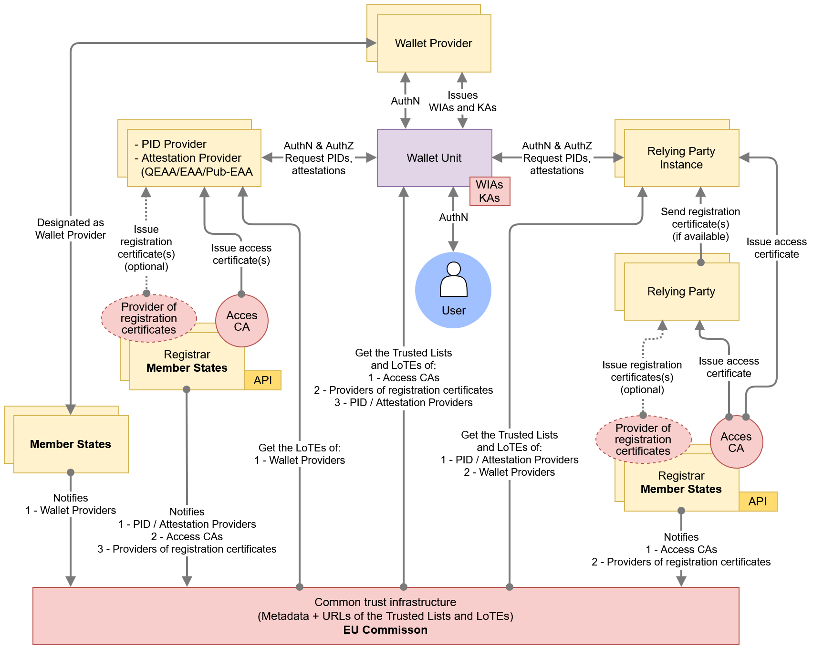
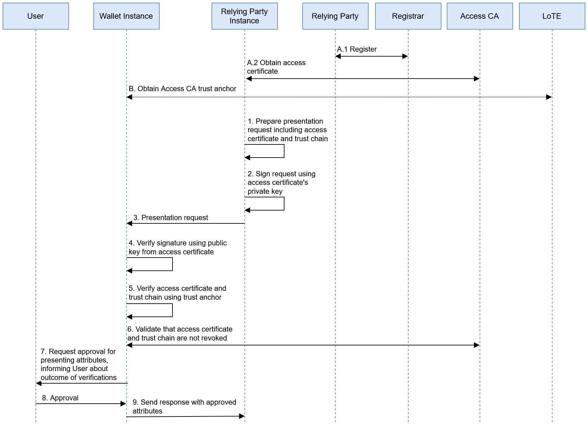
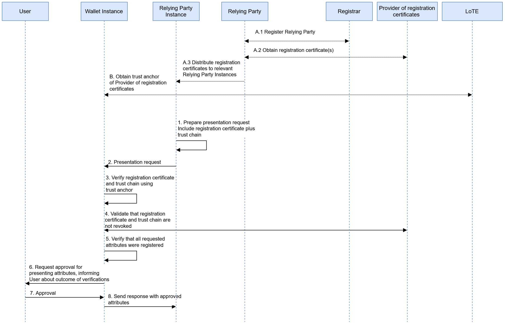
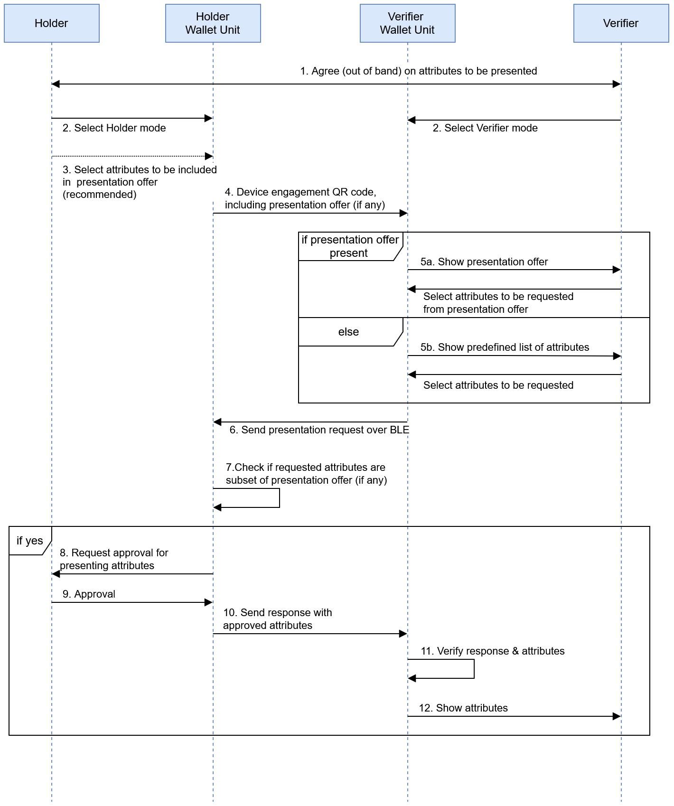

## 6 Trust model

### 6.1 Scope

This chapter explains how trust works in the EUDI Wallet system, how it is established,
maintained, validated, and managed. It describes the rules and assumptions that decide
whether different parts of the system, like a wallet app, a user's device, or a
service provider, can be trusted.

Figure 12 illustrates the main entities and their relationships in the trust model
of the EUDI Wallet ecosystem.

At its core is the **Wallet Unit** (top middle, blue), which interacts with
various entities throughout its lifecycle. The Wallet Unit lifecycle is described
in [Section 6.5][65-trust-throughout-a-wallet-unit-lifecycle] and consists of
installation, activation, management, and uninstallation. Each Wallet Unit is a
configuration of a **Wallet Solution**, comprising a
**Wallet Instance**, a **WSCA/WSCD**, and one or more **keystores**, provided by
a **Wallet
Provider** or by the **User's device**. The User installs a Wallet Instance on their device, which leads to the activation of the Wallet Unit by the Wallet Provider. The Wallet Provider manages a Wallet Unit until it is uninstalled by the User.
The Wallet Provider ensures that a valid Wallet Unit is in possession of at
least one **Key Attestation (KA)** for each WSCA/WSCD or keystore, and at least one **Wallet Instance Attestation (WIA)**. A KA attests the properties of a WSCA/WSCD or keystore and contains public keys for cryptographic binding. A WIA attests the integrity and revocation status of the Wallet Instance and describes the associated Wallet Solution. The Wallet Provider can revoke the Wallet Instance via the WIA revocation status to revoke the Wallet Unit. The Wallet Provider can revoke a WSCA/WSCD or keystore via the KA revocation status. See [Section 6.5][65-trust-throughout-a-wallet-unit-lifecycle].

The Wallet Unit handles User **PIDs** and **attestations** (QEAAs, PuB-EAAs, and
non-qualified EAAs). PIDs are issued by **PID Providers** and attestations by
**Attestation Providers**, both positioned to the left of the Wallet Unit in
[Figure 12][61-scope]. Before interacting with a Wallet Unit, these Providers
must be registered by a **Registrar**. Upon registration, they receive one or more
**access certificates** from an
**Access Certificate Authority** associated with the Registrar. They also obtain one or more **registration certificates** from an associated
**Provider of registration certificates**.
See [Section 6.3][63-trust-throughout-a-pid-provider-or-an-attestation-provider-lifecycle].

After a Wallet Unit has received a PID or attestation, it can present **User
attributes** to **Relying Party Instances** (right side of [Figure
12][61-scope]). These instances are hardware/software setups enabling
**Relying Parties** to interact with Wallet Units. Like a PID Provider or
Attestation Providers, Relying Parties register with a
**Registrar** in their Member State, and receive one or more **access certificates** for
each of their Relying Party Instances.
In addition, a Relying Party obtains one or more
**registration certificates** from a Provider of registration certificates
associated with the Registrar. This is discussed in [Section 6.4][64-trust-throughout-a-relying-party-lifecycle].

Notes:

- This conceptual trust model may be implemented with slight variations across
Member States, such as adopting one or multiple Certification Authorities or
leveraging existing entities that already fulfil this role.
- For PIDs, qualified EAAs, and PuB-EAAs, interoperability is essential ([Section
4.2.3][423-interoperability]). Interoperability is achieved by using a PKI
following X.509 certificate standards
([RFC 5280](https://datatracker.ietf.org/doc/html/rfc5280),
[RFC 3647](https://datatracker.ietf.org/doc/html/rfc3647)) for signing PIDs, QEAAs, and PuB-EAAs. Non-qualified EAAs
may adopt alternative trust models and verification mechanisms.
- The model supports both remote (see [Section 4.4.2][442-proximity-presentation-flows]) and proximity (see [Section 4.4.3][443-remote-presentation-transaction-flows] use cases.
- This version of the ARF does not yet include trust interactions for
qualified electronic signatures or seals; see [Topic 16][topic-16].
- Besides the trust relationships described in this chapter, other trust
relations are established as well. For instance, Users, PID Providers,
Attestation Providers, and Relying Parties trust Conformity Assessment Bodies and
Trusted List Providers (i.e., Member States) or LoTE Providers (i.e., the Commission). This trust is primarily rooted in authority and in
procedural measures, such as public oversight, published security and
operational policies, and audits, rather than in technical measures. To verify
that entities are indeed interacting with a trusted authority, standard
technical measures suitable for the context will be used.

### 6.2 Trust throughout a Wallet Provider lifecycle

#### 6.2.1 Wallet Provider lifecycle

[Section 4.6.2][462-wallet-provider] presented the lifecycle of a Wallet Provider:

1. The Wallet Provider is notified to the
Commission by a Member State. This is discussed in [Section 6.2.2][622-wallet-provider-notification].
1. Under specific conditions, a Member State may decide to change the status of a
registered Wallet Provider to Invalid. This is discussed in [Section 6.2.3][623-wallet-provider-invalidation].

#### 6.2.2 Wallet Provider notification

[Figure 12][61-scope] depicts the Wallet Provider to the top of the Wallet
Unit. To the left and below of this, the figure also shows that a Member State notifies the Wallet Provider and its (certified) Wallet Solution(s) to the European Commission. Note that Wallet Providers are not registered according to [CIR 2025/848], like Relying Parties, PID Providers, and Attestation Providers are. Wallet Providers consequently do not receive access certificates or registration certificates. This is because there is no need for interoperability between Wallet Providers and Wallet Units; each Wallet Provider only needs to communicate with its own Wallet Units.

Instead, the Wallet Solution provided by the Wallet Provider is certified as described in
[Chapter 7][7-wallet-solution-certification-and-risk-management], and then registered in accordance with [CIR 2024/2980]. In that process, information about the corresponding Wallet Provider, including its trust anchors, is notified by the Member State. If the notification process is successful, the Commission includes the trust anchors
of the Wallet Provider in the Wallet Provider LoTE. 

During issuance of a PID or attestation, a PID Provider or Attestation Provider can use these trust anchors for two purposes:

- to verify the authenticity of WIAs and KAs they obtain from Wallet Units, so they can be sure they are dealing with an authentic Wallet Unit from a trusted Wallet Provider.
- to verify the authenticity of Attestation Status Lists they use to verify the revocation status of received WIAs and KAs.

Note that the trust anchors for these two purposes may be the same. However, they also may be different, because a Wallet Provider can outsource the responsibility of providing revocation lists to a third party. However, if so, the Wallet Provider ensures that the relevant trust anchors are included in the Wallet Provider LoTE.

See [Section 6.6.2.4][6624-pid-provider-or-attestation-provider-validates-the-wallet-unit] and [Topic 9][topic-9].

More details on the Wallet Provider notification process can be found in [Topic 31][topic-31].

#### 6.2.3 Wallet Provider invalidation

The Member State may decide to notify the Commission that the Wallet Provider's status in the
corresponding LoTE should be changed to Invalid. As a result of this status
change, PID Providers and Attestation Providers will no longer
trust the trust anchors of the Wallet Provider, which they need to verify the KAs and WIAs they receive from Wallet Units. They will therefore refuse to issue PIDs and attestations to any Wallet Unit provided by that Wallet Provider. The Member State can subsequently notify the Commission that the Wallet Provider's status should be changed to Valid again. The notification of the status change and its reflection in the Wallet Provider LoTE follow the procedures laid down in [CIR 2024/2980].

As a result of being invalidated, the Wallet Provider will revoke its valid Wallet Units, see [Section 6.5.4.2][6542-wallet-unit-revocation]. 

>Note that independently of the status of the Wallet Provider, its Wallet Solution may be suspended or withdrawn, see [Section 4.6.3][463-wallet-solution]. In that case, the Wallet Provider revokes all associated Wallet Units if necessary, see [Section 6.5.4.2][6542-wallet-unit-revocation]. The result is the same: PID Providers and Attestation Providers will stop issuing PIDs and attestations to these Wallet Units.

### 6.3 Trust throughout a PID Provider or an Attestation Provider lifecycle

#### 6.3.1 PID Provider or Attestation Provider lifecycle

[Section 4.6.5][465-pid-provider-or-attestation-provider] presented the
lifecycle of a PID Provider or Attestation Provider:

1. A PID Provider or an Attestation Provider is registered by a Registrar in its Member State. This is discussed in [Section 6.3.2][632-pid-provider-or-attestation-provider-registration-and-notification].
2. Under specific conditions, the Registrar may decide to suspend or
cancel registration of a registered PID Provider or Attestation Provider. This
is discussed in [Section 6.3.3][633-suspension-or-cancellation-of-the-registration-of-a-pid-provider-or-attestation-provider].

#### 6.3.2 PID Provider or Attestation Provider registration and notification

##### 6.3.2.1 Introduction

[Figure 12][61-scope] depicts the PID Providers and Attestation Providers to
the left of the Wallet Unit. To the left and below of this, the figure also
shows that each PID Provider and Attestation Provider will register itself with
a Registrar in its Member
State. The Member State conditionally notifies a PID Provider or Attestation Provider to the
European Commission:

- **PID Providers** are notified to the Commission.
- **QEAA Providers** are not notified to the Commission, except for establishing the [Art. 22](https://eur-lex.europa.eu/legal-content/EN/TXT/?uri=uriserv%3AOJ.L_.2014.257.01.0073.01.ENG#d1e2162-73-1) Trusted List once a qualified status is granted.
- **PuB-EAA Providers** are notified to the Commission.
- **Non-qualified EAA Providers** are not notified to the Commission.

If the registration and notification processes are successful, at least the
following happens:

- Data about the PID Provider or Attestation Provider is included in the
registry of the relevant Registrar.
- The PID Provider or Attestation Provider receives one or more access certificates and
one or more registration certificates.
- The trust anchors of the PID Provider or Attestation Provider are conditionally included in
a Trusted List or LoTE.

These processes are discussed in the next subsections.

##### 6.3.2.2 Data about the PID Provider or Attestation Provider is included in the registry

When a PID Provider or Attestation Provider is registered, the Registrar
registers a set of data about the PID Provider or Attestation Provider in its
register. The Registrar makes the contents of the register available to the
general public, both in machine-readable and human-readable format. High-level
requirements on the registration process can be found in [Topic 27][topic-27].

The data to be registered about a PID Provider, QEAA Provider, PuB-EAA Provider,
or EAA Provider includes the PID or attestation type(s) that the Provider intends to
issue to Wallet Units. This enables Wallet Units and Relying Parties to verify
that a given PID Provider or Attestation Provider registered its intent to issue
a specific PID or attestation type. For example, a PuB-EAA Provider may have registered
for issuing mDLs, but not to issue diplomas.

Regarding PID Providers or QEAA Providers, it may be argued that Wallet Units do
not have to do this verification, since these are trusted parties. Nevertheless,
it is beneficial if a Wallet Unit verifies if a PID Provider or QEAA Provider is
registered for issuing a PID or a particular type of QEAA, prior to requesting
the issuance of such a PID or QEAA. Doing this helps to prevent attempts to
issue a PID or attestation while not being entitled to do so, either
fraudulently or as a result of an error.

Note that the Registrar collects the following information only for the purpose of transparency and does not apply any pre-authorisation process on it:

- Contact information of the registering PID Provider or Attestation Provider, 
- Description of the services of the PID Provider or Attestation Provider, 
- Types of attestation registered.

In particular, registration of a specific attestation type for a specific PID Provider or Attestation Provider does not imply that the Registrar (or any other entity in the EUDI Wallet ecosystem) authorises the Provider to issue attestations of that type. If authorisation is necessary for issuing a specific attestation type, it takes place out of scope of the EUDI Wallet ecosystem.

##### 6.3.2.3 PID Provider or Attestation Provider receives access certificate(s) and registration certificate(s)

When a PID Provider or Attestation Provider is registered by a Member State, an
Access Certificate Authority (see [Section 3.18][318-access-certificate-authorities])
issues one or more access certificates to the PID Provider or to the Attestation
Provider. A PID Provider or an Attestation Provider needs such a certificate to
authenticate itself towards a Wallet Unit when issuing a PID or an attestation
to it, as described in [Section 6.6.2.2][6622-wallet-unit-authenticates-the-pid-provider-or-attestation-provider].

A PID Provider access certificate does not indicate that its subject is a PID
Provider. Similarly, an Attestation Provider access certificate does not
indicate that its subject is a QEAA Provider, a PuB-EAA Provider, or a
non-qualified EAA Provider. Furthermore, the access certificate of a PID
Provider or Attestation Provider does not contain the Provider's registration to
issue attestations of a specific type, for instance an mDL or diploma. Such
information is instead included in registration certificates. Upon registration, the PID Provider or Attestation Provider receives one or more registration certificates from a Provider of registration certificates, see [Section 3.19][319-providers-of-registration-certificates].

A Wallet Unit can use the information in the registration
certificate to verify that an Attestation Provider it is contacting to issue a specific type of attestation is
in fact registered for that type of attestation.  The information in a registration certificate is also available in human-readable and machine-readable format via the Registrar's online service. The API and interfaces for that are specified in [Technical Specification 5](../technical-specifications/ts5-common-formats-and-api-for-rp-registration-information.md). 

The PID Provider or Attestation Provider includes an access certificate and a registration certificate in its Credential Issuer metadata, specified per [OpenID4VCI] and [ETSI TS 119 472-3], to make them available to Wallet Units. 

Note that an Attestation Provider may simultaneously be a Relying Party, for
instance in case it intends to request data from the User's PID during issuance
of an attestation. Such an Attestation Provider would then register both as a
Relying Party (which is called a Service Provider in [Technical Specification 5](../technical-specifications/ts5-common-formats-and-api-for-rp-registration-information.md))
and as a QEAA Provider, PuB-EAA Provider, or non-qualified EAA Provider. In that
case, the registration certificate(s) issued to the Attestation Provider will include both roles. Registration certificates for Relying Parties are
discussed in [Section 6.4.2][642-relying-party-registration].

See [Sections 6.6.2.2][6622-wallet-unit-authenticates-the-pid-provider-or-attestation-provider] and [6.6.2.3][6623-wallet-unit-verifies-providers-entitlements-and-registered-attestation-types] to learn more about how Wallet Units use a PID Provider's or Attestation Provider's access certificates and registration certificates. 

##### 6.3.2.4 PID Provider or Attestation Provider trust anchors are conditionally included in a Trusted List or LoTE

For a PID Provider or a PuB-EAA Provider, successful
registration and notification also means that the Provider is notified to the
European Commission and that its trust anchors are included in the respective LoTE by the Commission. The trust anchors of a QEAA Provider are included in a Trusted List once it gets the qualified status.

Relying Parties can use these trust anchors for two purposes:

- to verify the authenticity of PIDs, QEAAs, and PuB-EAAs they obtain from Wallet Units.
- to verify the authenticity of Attestation Status Lists or Attestation Revocation Lists they use to verify the revocation status of received PIDs, QEAAs, and PuB-EAAs, if any.

Note that the trust anchors for these two purposes may be the same. However, they also may be different, because a PID Provider or Attestation Provider can outsource the responsibility of providing revocation lists to a third party. However, if so, the PID Provider or Attestation Provider ensures that the relevant trust anchors are included in the relevant Trusted List or LoTE.

Non-qualified EAA Providers are not notified by a Member State and their trust anchors are not
included in a LoTE by the Commission. However, if a Relying Party
requests a non-qualified EAA from a Wallet Instance, it must know how to obtain
the trust anchor it needs to verify the signature over that EAA.
To help with this, [Topic 12][topic-12]
recommends that the applicable Rulebook specifies the mechanisms enabling this.
This mechanism may be a LoTE complying with [ETSI TS 119 602]. However, other methods may be used as well, and even
if such a LoTE exists, it does not have to comply with the requirements
in [Topic 31][topic-31].

High-level requirements on the PID Provider or Attestation Provider notification
process, as well as on the information registered and published in the respective Trusted List or LoTE, can be found in
[Topic 31][topic-31].

#### 6.3.3 Suspension or cancellation of the registration of a PID Provider or Attestation Provider

Under specific conditions, a Registrar may decide to suspend or cancel the
registration of a PID Provider or Attestation Provider. The conditions for this
will be specified by each Registrar.

Suspension or cancellation implies that the PID Provider's or Attestation Provider's
access certificates are revoked. As a result, the PID Provider or Attestation
Provider will no longer be able to issue PIDs or attestations to Wallet Units.

For a PID Provider, QEAA Provider, or PuB-EAA Provider, suspension or
cancellation also implies that its status in the respective Trusted List or LoTE will be
changed to Invalid. As a result, Relying Parties will no longer trust PIDs or
attestations issued by that Provider. For non-qualified EAA Providers, the
applicable Rulebook (see [Topic 12][topic-12])
may define similar mechanisms ensuring that Relying Parties will no longer
trust the trust anchors of EAA Providers of which the registration was suspended
or cancelled.

When a Registrar suspends or cancels the registration of a PID Provider or Attestation
Provider, the PID Provider or Attestation Provider revokes all of their PIDs or
attestations as described in [Section 6.6.6.4][6664-pid-or-attestation-revocation].

### 6.4 Trust throughout a Relying Party lifecycle

#### 6.4.1 Relying Party lifecycle

[Section 4.6.7][467-relying-party] presented the lifecycle of a Relying Party:

1. A Relying Party is registered by a Registrar in the Member State where it
resides. Relying Party registration is discussed in [Section 6.4.2][642-relying-party-registration].
2. Under specific conditions, a Registrar may decide to suspend or cancel the
registration of a Relying Party. This is discussed in [Section 6.4.3][643-relying-party-suspension-or-cancellation].

#### 6.4.2 Relying Party registration

[Figure 12][61-scope] depicts the Relying Party Instance to the right of the
Wallet Unit. A Relying Party Instance is a combination of hardware and software
used by a Relying Party to interact with a Wallet Unit. A Relying Party can operate
multiple Relying Party Instances. This will happen especially in case the
interactions with the Wallet Unit take place in proximity; for instance, a
border control agency at an airport employing multiple lines (each operated by
an agency employee) where arriving passengers can present their PID. However, a
single Relying Party operating multiple Relying Party Instances can also happen
in a remote context, for example if there is an operational system (including a
remote Relying Party Instance) next to a fallback system used for business
continuity purposes. A Relying Party may also use multiple remote Relying Party
Instances for load distribution.

[Figure 12][61-scope] also shows the Relying Party. Below that, it shows that
each Relying Party will register itself with a Registrar in its Member State.
If the registration process is successful, the Registrar includes the Relying
Party in its public registry.

A Relying Party may register in the context of several services, having different
intended uses. Each intended use will require a different set of attributes to be
obtained from a Wallet Unit. As a result, a single Relying Party may register
multiple times and may be issued more than one registration certificate.

Note that the Registrar collects the following information only for the purpose of transparency and does not apply any pre-authorisation process on it:

- Contact information of the registering Relying Party, 
- Description of the services of the Relying Party, 
- Attributes registered for each intended use,
- Description of each intended use.

In particular, registration of a specific set of attributes for a specific intended use of a specific Relying Party does not imply that the Registrar (or any other entity in the EUDI Wallet ecosystem) authorises the Provider to request those attributes for that intended use. If authorisation is necessary for requesting specific attributes, it takes place out of scope of the EUDI Wallet ecosystem.

As a result of successful registration,

- a Provider of registration certificates (see [Section 3.19][319-providers-of-registration-certificates])
associated with the Registrar issues one or more registration certificates
to the Relying Party. The purpose of the registration certificate is described in
[Section 6.6.3.3][6633-wallet-unit-verifies-that-relying-party-does-not-request-more-attributes-than-it-registered]. The Provider of registration certificates complies with the requirements in [CIR 2025/848], including those for the associated policy and practice statement in Annex V. Issuance of registration certificates takes places in an automated manner and without undue delay.
- an Access Certificate Authority (see [Section 3.18][318-access-certificate-authorities])
associated with the Registrar issues an access certificate to each Relying Party
Instance of the Relying Party. A Relying Party Instance needs such a certificate
to authenticate itself towards Wallet Units when requesting the presentation of
attributes, as described in [Section 6.6.3.2][6632-wallet-unit-authenticates-the-relying-party-instance].
Issuing access certificates to a registered Relying Party is mandatory.

See [Sections 6.6.3.2][6632-wallet-unit-authenticates-the-relying-party-instance] and [6.6.3.3][6633-wallet-unit-verifies-that-relying-party-does-not-request-more-attributes-than-it-registered] to learn more about how Wallet Units use a Relying Party's access certificates and registration certificates. 

High-level requirements on the Relying Party registration process can be found
in [Topic 27][topic-27].

#### 6.4.3 Relying Party suspension or cancellation

Under specific conditions, a Registrar may decide to suspend or cancel the
registration of a registered Relying Party. The conditions for this will be
specified by each Registrar.

Suspension or cancellation involves revocation of all valid access certificates of the Relying Party by the relevant Access CA, such that the Relying Party is no longer able to interact with Wallet Units. It also implies that all of the Relying Party's registration certificates are revoked. The Provider of registration certificates publishes revocation information (in the form of a status list) in accordance with [ETSI TS 119 475].

### 6.5 Trust throughout a Wallet Unit lifecycle

#### 6.5.1 Wallet Unit lifecycle

[Section 4.6.4][464-wallet-unit] above presented the lifecycle of a Wallet Unit:

1. The Wallet Instance that is part of the Wallet Unit is installed on a device
by a User. The required trust relationships for installation are discussed in
[Section 6.5.2][652-wallet-instance-installation] below.
2. Next, the Wallet Unit is activated by the Wallet Provider and the User and
becomes operational. The goals and required trust relationships for activation
are discussed in [Section 6.5.3][653-wallet-unit-activation].
3. Once in the **Operational** or **Valid** state, the Wallet Unit is managed by
the User and the Wallet Provider. This management includes at least revoking the
Wallet Unit when necessary. This is discussed in [Section
6.5.4][654-wallet-unit-management]. Management will also include regular
updates of the Wallet Instance application to ensure its continued security and
functionality. However, this is not further defined in this chapter.
4. The User may uninstall the Wallet Instance; see [Section 6.5.5][655-wallet-instance-uninstallation].

#### 6.5.2 Wallet Instance installation

##### 6.5.2.1 Required trust relationships

**Note: This section assumes that the Wallet Instance is an app installed on the User's device. As explained in [Section 4.3.2][432-components-of-a-wallet-unit], a Wallet Instance can also be implemented as a web application. In that case, installation of the app is not necessary. Instead, the User will create an account at the Wallet Provider, see [Section 6.5.3.6][6536-wallet-provider-sets-up-a-user-account-for-user], and all attestations and other data in the Wallet Instance will be associated with that account. The descriptions in this section and the associated requirements in [Topic 40, section A](../annexes/annex-2/annex-2.02-high-level-requirements-by-topic.md#a2323-topic-40-wallet-instance-installation-and-wallet-unit-activation-and-management), do no apply to web wallets.**

The lifecycle of a Wallet Unit starts when a User decides to install a Wallet
Instance application on their device. This application in an instance of a
Wallet Solution, which is provided to the User by a Wallet Provider.

When downloading and installing the Wallet Instance, the following trust
relationships are established:

1. On behalf of the User, the OS of the User's device and the relevant app store
verify that the Wallet Instance (i.e., the application the User is installing)
is genuine and authentic and does not contain any malware or other threats.
2. The User verifies that they can obtain the PID(s) they need in an instance of
this Wallet Solution. If the relevant PID Provider does not support the Wallet
Solution, the User will not be able to use the Wallet Unit for obtaining those
PID(s).

The next two sections discuss these trust relationships. For high-level
requirements regarding Wallet Instance installation, see [Topic 40][topic-40],
section A.

##### 6.5.2.2 Wallet Solution authenticity is verified

To ensure that the User can trust the Wallet Solution, Wallet Providers
preferably make their certified Wallet Solutions available for installation via
the official app store of the relevant operating system (e.g., Android, iOS).
This allows the operating system of the device to perform relevant checks
regarding the authenticity of the app. It also allows Users to use the same
well-known channel for obtaining a Wallet Instance as they use for obtaining
other apps. Finally, it avoids a situation where a User must allow side-loading
of apps, which would increase the risk of unintentionally installing malicious
apps.

If a Wallet Provider makes its Wallet Solution available for installation
through other means than the official OS app store, it implements a mechanism
allowing the User to verify the authenticity of the Wallet Unit. Moreover, the
Wallet Provider provides clear instructions to the User on how to install the
Wallet Unit, including:

- instructions on how to verify the authenticity of the Wallet Instance to be
installed. This can be done, for example, by comparing the hash value of the
application downloaded by the User with a hash value published by the Wallet
Provider.
- instructions on bypassing of any operating system limitations on side-loading
of apps, if applicable, and ensuring that these limitations are restored after
the Wallet Instance has been installed.

##### 6.5.2.3 User validates that Wallet Solution is usable with relevant PID

A User installs a Wallet Unit because they want to obtain and use one or more
PIDs. However, PID Providers are not required to support all Wallet Solutions in
the EUDI Wallet ecosystem. 'Support' here means that the PID Provider is willing
to issue a PID to an instance of a given Wallet Solution on request of the User.
Instead, a PID Provider may choose to support only a single Wallet Solution or a
limited number of Wallet Solutions. Therefore, each PID Provider will publish a
list of Wallet Solutions that they support, such that a User that wants to
request a PID from that PID Provider knows which Wallet Unit they should
install. This list could be published, for example, on the PID Provider's
website.

Conversely, a Wallet Solution is not required to support all PID Providers,
where 'support' means that it is able to request the issuance of a PID from a
PID Provider. Each Wallet Provider will, prior to or during installation of a
Wallet Instance, let the User know which PID Providers are supported by this
Wallet Solution.

For QEAAs, PuB-EAAs, and non-qualified EAAs, the situation is different.
Providers of such attestations will support all Wallet Solutions and are not
allowed to discriminate between them when processing a request for the issuance
of an attestation. Conversely, a Wallet Solution supports all Attestation
Providers, and cannot discriminate between different Attestation Providers when
requesting the issuance of an attestation at the User's request.

#### 6.5.3 Wallet Unit activation

##### 6.5.3.1 Introduction

After installation of the Wallet Instance, the new Wallet Instance will contact
the Wallet Provider to start the activation process. For successful Wallet Unit
activation, the following trust relations are established:

1. The Wallet Instance authenticates the Wallet Provider, meaning that
the instance is sure that it is dealing with the genuine Wallet Provider who
provided it to the User.
2. The Wallet Provider authenticates the Wallet Instance. This means
that the Wallet Provider is sure that the instance is indeed a true
instance of their Wallet Solution, and not a fake app.

Both of these trust relationships are the responsibility of the Wallet Provider.
The ARF does not specify how these trust relationships can be satisfied.

During the activation process, at least the following steps happen:

1. The Wallet Provider requests data about the User's device from the Wallet
Instance.
2. The Wallet Provider requests the User to set up two User
authentication mechanisms.
3. The Wallet Provider issues one or more Key Attestations (KA) to the Wallet Unit.
4. The Wallet Provider issues one or more Wallet Instance Attestations (WIA) to the Wallet Unit.
5. The Wallet Provider sets up a User account for the User.

These steps are described in the sections below. For high-level requirements
regarding Wallet Unit activation, see [Topic 40][topic-40],
section B.

##### 6.5.3.2 Wallet Provider requests data about the User's device from the Wallet Instance

###### 6.5.3.2.1 Data collection for WSCA/WSCD and keystore deployment

The Wallet Instance connects to the Wallet Provider to be activated. Then, the
Wallet Provider requests data about the User's device from the Wallet Instance.
This data includes the characteristics of the local WSCD(s) and keystores available to the device for securely storing cryptographic keys and data. The Wallet Provider needs this information to deploy a WSCA/WSCD and optionally one or more keystores in the Wallet Unit, and to be able to issue one or more Key Attestations for each WSCA/WSCD or keystore to the Wallet Unit, see [Section 6.5.3.4][6534-wallet-provider-issues-one-or-more-key-attestations-to-the-wallet-unit].

Notes:

- As discussed in [Section 4.5][45-wscd-architecture-types], a WSCD may be
integrated directly within the User's device. Examples of this include an e-SIM,
a UICC, an embedded Secure Element, or native secure hardware accessible via the
device's OS. If so, the Wallet Instance will discover the presence of such a
WSCD during activation and will communicate the characteristics of the WSCD to
the Wallet Provider. In some cases, the Wallet Provider will subsequently deploy
a WSCA to the WSCD to facilitate communication between the Wallet Instance and
the WSCD.
- Sometimes, the User's device does not contain a local WSCD, or the local WSCD
does not have the security posture necessary to enable the Wallet Unit to be an
identity means at LoA High, or the Wallet Provider does not want to use a local
WSCD. In such cases, the Wallet Provider ensures the Wallet Unit gets access to
a remote HSM operated by the Wallet Provider.

###### 6.5.3.2.2 Data collection for Wallet Solution maintenance

In addition, the need for Wallet Solution maintenance may require the Wallet
Provider to monitor its operational Wallet Instances. It is customary for mobile
application developers to collect limited bug and error reports at runtime for
improvement purposes. Error logs collected are minimised and, as a rule, do not contain personal data of the
User. Where the monitoring described below nevertheless collects data that may constitute personal data under Regulation (EU) 2016/679 (for example device identifiers or locale), the Wallet Provider ensures an appropriate legal basis and privacy safeguards for that processing. A list of possible data types to be collected, reasons for collection, and
how the Wallet Instance monitoring occurs (frequency, mechanisms, does the
collection require Wallet User's approval beyond standard app vendor practices)
is collected in the following table:

| Data type | Reason for monitoring (if applicable, regulation) | Monitoring frequency etc. |
| --- | --- | --- |
| Runtime errors | Uncaught errors in production code | runtime and crash logs |
| UX and telemetry information | UX field analysis, may not be used to obtain behavioural data | runtime logs - *user consent preferred* |
| OS version and health data | OS vulnerabilities | At Wallet Unit activation or OS update/upgrade and at continuous security posture monitoring |
| Wallet SDK and SW library versions | Wallet Instance code vulnerabilities | At Wallet Unit roll out (as part of CI/CD process), at continuous security posture monitoring |
| User locale/localisation data | Catching localisation related errors | runtime and crash logs - *user consent preferred* |
| Wallet Instance version | Old version related vulnerabilities or errors | At Wallet Unit activation, at continuous security posture monitoring |
| Supported WSCA/WSCDs and keystores | Cryptography-related incompatibilities | At Wallet Unit activation, at continuous security posture monitoring |
| WSCx capabilities supported | Cryptography configuration for EUDI Wallet use cases | At Wallet Unit activation |
| Unique device identifier such as IDFV or persisted UUID (iOS) or AndroidID (Android) | Up-to-date list of Wallet Instance related device installations, potential malicious use (unrecognised identifier) | At Wallet Unit activation |
| Sensor identifiers and patch levels | Up-to-date sensor hardware | At Wallet Unit activation, at continuous security posture monitoring |
| Hardware-level details on device | Identify known hardware-based problems or vulnerabilities | At Wallet Unit activation |
| BLE radio presence | Security of proximity use cases | At Wallet Unit activation |
| NFC support | Security of proximity use cases | At Wallet Unit activation |

###### 6.5.3.2.3 Data collection for fraud or risk signal monitoring

Although complete fraud or risk signal collection is not in scope of the ARF,
Wallet Providers keep an active understanding of each individual Wallet
Instance's security posture, provided this can be done in a privacy-preserving
way. A list of information related to fraud or risk signals that is often
collected in context of mobile devices, is presented in the table below, with an
indication whether the data is collected by the Wallet Provider.

| Data or tool type | Reason for security posture monitoring (if applicable, regulation) | Monitoring at Wallet Instance |
| --- | --- | --- |
| Device OS | Detect potential OS vulnerabilities | OK - see previous table |
| Device type | Detect potential type-specific vulnerabilities | OK - see previous table |
| Behavioural data | Detect unusual transaction detection, including possible account takeovers (ATO) | Not OK (privacy preservation) |
| Device fingerprinting | Flag logins from unfamiliar devices, ATO | Not relevant - Wallet Provider has list of devices with an active Wallet Instance |
| Geolocation (IP address) | Network-layer anomaly detection, ATO | Not OK (privacy preservation) |
| Geolocation (GNSS) | Geospatial anomaly detection, ATO | Not OK (privacy preservation) |
| Active phone call detection | Detect authorised push payment fraud / phishing / social engineering | Not OK (privacy preservation) |
| VPN detection | Detect attempted identity or location masking through VPN | Not OK |
| Incognito mode detection | Detect attempts at hiding malicious activity or multiple login attempts | Not relevant |
| Device rooting/jailbreaking detection | Detect compromised device security as a whole | OK |
| Emulator detection | Detect emulation of User device by fraudsters | OK |
| Malware detection | Identify and neutralise malicious software | OK |

For high-level requirements on Wallet Solution maintenance and the collection of
fraud and risk signals by Wallet Provider, see [Topic 56][topic-56].

##### 6.5.3.3 Wallet Unit requests User to set up two User authentication mechanisms

###### 6.5.3.3.1 Introduction

During Wallet Unit activation, the Wallet Unit ensures that the Users sets up
two User authentication mechanisms. The first of these mechanisms is implemented
by the OS of the User's device, optionally combined with a Wallet Instance-specific PIN, and will be used before any operation of the
Wallet Unit. The second mechanism is implemented by the WSCA/WSCD and will be
used additionally when a PID or an attestation bound to the WSCA/WSCD is issued,
presented, or deleted.

These two mechanisms are described in the next two subsections. See also the
requirements on User authentication in [Topic 40][topic-40],
Section C.

###### 6.5.3.3.2 OS-level User authentication before any operation

During Wallet Unit activation, the Wallet Instance forces the operating system
of the User's device to activate a multi-factor User authentication mechanism,
if this is not already active. One of the authentication factors for this
mechanism is the possession of the device and the other is knowledge-based or
inherence-based. The Wallet Instance ensures that the authentication mechanism
has security policies that are adequate for any operation of the Wallet Unit,
excluding the issuance or presentation of PIDs, KAs describing the WSCA/WSCD,
and attestations bound to the WSCA/WSCD. As described in the next section, for
these actions User authentication by the WSCA/WSCD is necessary.

Actions for which OS-level authentication is sufficient include generating and
presenting pseudonyms, accessing the transaction log via the dashboard, data
export and migration, requesting the erasure of personal data by a Relying
Party, and reporting a Relying Party to a Data Protection Authority. It also
includes issuing, presenting, and deleting of attestations that are either not
device-bound or bound to a keystore rather than the WSCA/WSCD. This implies that
it must be possible to unlock the keystore(s) available to the Wallet Unit using
this User authentication mechanism.

The User can optionally decide to use a Wallet Instance-specific PIN in addition
to the OS-level User authentication mechanism.

User authentication to the Wallet Unit using the OS-level mechanism (plus
optional PIN) will take place whenever the User opens the Wallet Instance,
before the Wallet Unit performs any operation. This is necessary to prevent
anyone except the User from accessing the Wallet Unit and inspecting the User's
attestations and attribute values, as this data is personal and might be
sensitive.

###### 6.5.3.3.3 WSCA/WSCD-level User authentication before cryptographic operations

An additional User authentication, performed by the WSCA/WSCD, happens when the
Wallet Unit performs any cryptographic operation involving cryptographic
assets in the WSCA/WSCD. This will happen at least when:

- The User instructs the Wallet Unit to request the issuance of a new PID, see
[Section 6.6.2][662-pid-or-attestation-issuance],
- The Wallet Unit asks the User for approval to present some attributes from a
PID to a Relying Party, see [Section 6.6.3.5][6635-wallet-unit-obtains-user-approval-for-presenting-selected-attributes],
- The User deletes a PID in their Wallet Unit, see [Section 6.6.7][667-pid-or-attestation-deletion].

In addition, if an Attestation Provider requested during issuance that the
cryptographic assets of their attestation are stored and managed in the
WSCA/WSCD, the WSCA/WSCD will also perform User authentication before such an
attestation is issued, presented, or deleted.

Note that, as discussed in the first bullet in [Section 6.6.3.9][6639-relying-party-instance-verifies-or-trusts-user-binding],
these User authentication mechanisms can also play a
role in ensuring User binding for PIDs or device-bound attestations. User
binding allows a Relying Party to trust that the person presenting a PID or
attestation is the User to whom the PID or the attestation was issued.

##### 6.5.3.4 Wallet Provider issues one or more Key Attestations to the Wallet Unit

During the activation of a Wallet Unit, the Wallet Provider issues one or more
Key Attestations (KA) to the Wallet Unit. A KA is a signed information object
that has three main purposes:

- It describes the certification and properties of the WSCA/WSCD or a keystore
that is part of the Wallet Unit. This allows a PID Provider or an Attestation
Provider to verify that the WSCA/WSCD or keystore complies with the Provider's
requirements and therefore is fit to protect the private keys for a PID or a
device-bound attestation from the Provider.
- Moreover, a KA contains one or more public keys. The Wallet Provider attests
that the private keys corresponding to these public keys are generated by and
stored in the WSCA/WSCD or keystore described in the KA. During the issuance of
a PID or a device-bound attestation (see
[Section 6.6.2.4][6624-pid-provider-or-attestation-provider-validates-the-wallet-unit]),
a PID Provider or Attestation Provider can use each of these public keys to bind
a new PID or attestation to.
- Lastly, a KA contains a revocation reference allowing a PID Provider or an
Attestation Provider to verify that the Wallet Provider did not revoke the
WSCD or keystore described in the KA. The Wallet Provider selects either a
type-shared index approach or a per-KA index approach for managing the
revocation status of the WSCD or keystore; see
[Technical Specification 3](../technical-specifications/ts3-wallet-unit-attestation.md).
The revocation mechanisms for Wallet Units are described in
[Topic 38][topic-38].

High-level requirements for KAs can be found in
[Topic 9][topic-9].
The detailed format of a KA, as well as the way in which it is used, is
specified in
[Technical Specification 3](../technical-specifications/ts3-wallet-unit-attestation.md).

A Wallet Unit does not send a KA to an Attestation Provider if the attestation
it is requesting is not device-bound. For non-device-bound attestations, the
Attestation Provider does not need to receive public keys to include in the
attestations, and neither does it need information about the WSCA/WSCD or a
keystore.

To ensure User privacy, the Wallet Unit presents KAs only to PID Providers and
Attestation Providers, but not to Relying Parties. This is because PID
Providers and Attestation Providers have a valid business reason to know these
properties, whereas Relying Parties do not. Moreover, a Wallet Unit will
present each KA only once. Apart from preventing linkability, this is also to
prevent that the public keys in the KA are used in multiple PIDs or
attestations.

Regarding the KA revocation maintenance period, an important requirement in
[CIR 2024/2977], Article 5, 4.(b) is that a PID Provider must revoke a PID
when the Wallet Unit to which that PID was issued is revoked. Therefore, a PID
Provider must be able to regularly check whether the Wallet Provider revoked
the WSCD or keystore described in the KA the PID Provider received from the
Wallet Unit during PID issuance, during the entire validity period of the PID.
This implies that

- the technical validity period of a PID cannot exceed the end of the
revocation maintenance period indicated in the KA received by the PID Provider
during issuance. The same applies to the WIA; see
[Section 6.5.3.5][6535-wallet-provider-issues-one-or-more-wias-to-the-wallet-unit].
The Wallet Provider commits to maintaining the revocation status of the WSCD or
keystore during the entire revocation maintenance period indicated in its KAs.
- a KA contains the information necessary to enable the PID Provider to
check the revocation status of the WSCD or keystore. See also
[Section 6.6.2.5][6625-pid-provider-or-attestation-provider-verifies-that-wallet-unit-is-not-revoked].

The responsibilities of the Wallet Provider regarding issuance of a KA are
similar to those of a PID Provider or Attestation Provider regarding the
issuance of a PID or an attestation. This means that after the initial issuance
of KAs during activation, the Wallet Provider will manage the KAs and will
issue new KAs to the Wallet Unit as needed, during the lifetime of the Wallet
Unit.

##### 6.5.3.5 Wallet Provider issues one or more WIAs to the Wallet Unit

During the activation of a Wallet Unit, the Wallet Provider also issues one or
more Wallet Instance Attestations (WIA) to the Wallet Unit. Similar to KAs,
WIAs are information objects signed by the Wallet Provider, and they contain a
public key. However, a WIA differs from a KA in a few aspects:

- A WIA contains information about the Wallet Instance, including the Wallet
Solution name, version, and certification of the Wallet Solution. This allows PID Providers and
Attestation Providers to verify that the Wallet Instance belongs to a trusted
and certified Wallet Solution, as registered in the Wallet Provider Trusted
List.
- A WIA carries a revocation reference for the Wallet Instance, enabling PID
Providers and Attestation Providers to check whether the Wallet Instance has
been revoked.
- A WIA has a short technical validity period (less than 24 hours), ensuring
that it reflects a recent integrity check of the Wallet Instance. In addition, a
WIA specifies a revocation maintenance period, which may be considerably longer
than the technical validity period. The Wallet Provider commits to maintaining
the revocation status of the Wallet Instance during this entire period, enabling
PID Providers to verify the revocation status of the Wallet Instance throughout
the lifetime of the PID.
- The private key corresponding to the public key in the WIA is managed by the
Wallet Instance; it does not have to be managed by the WSCA/WSCD or a keystore.
- A Wallet Unit sends a WIA to a PID Provider or Attestation Provider for both
device-bound and non-device-bound attestations.

Similar to KAs, the Wallet Unit presents WIAs only to PID Providers and
Attestation Providers, but not to Relying Parties.

[Technical Specification 3](../technical-specifications/ts3-wallet-unit-attestation.md)
contains more information and requirements on the WIA.

##### 6.5.3.6 Wallet Provider sets up a User account for User

The User needs a User account at the Wallet Provider to ensure that they can
request the revocation of their Wallet Unit in case of theft or loss. The Wallet
Provider associates the Wallet Unit with the User account. The Wallet Provider
registers one or more backend-based User authentication methods that the Wallet
Provider will use to authenticate the User. Note that:

- The Wallet Provider does not need to know any real-world attributes of the
User, unless this is deemed necessary for PID activation, see [Section 6.6.2.7][6627-user-activates-the-pid].
Otherwise, the User can use a pseudonym to register, for example an e-mail address.
If the Wallet Provider wants to request additional User attributes, for instance
to be able to provide additional services, they are free to do so if the User
consents.
- In any case, User details registered by the Wallet Provider will not be
included in a KA or a WIA. They are strictly for use by the Wallet Provider only.
- If the User already has an account with the Wallet Provider, the Wallet Provider can ask the User to log in to that account, rather than create a new account. Such a situation will primarily occur when the User migrates to a new Wallet Unit, for example in case they are moving to a new device. See [Section 6.5.4.3][6543-migrating-the-pids-and-attestations-in-a-wallet-unit-to-a-different-wallet-solution]. 

##### 6.5.3.7 Wallet Provider ensures User can verify they are using a trusted, certified Wallet Solution

According to the [European Digital Identity Regulation], the User needs to be
provided with a means to verify that they are installing or (after activation)
are indeed using a trusted, certified Wallet Solution. The solution specified in
this ARF to comply with this requirement is a Trust Mark view in the User
interface of the Wallet Instance. When the User invokes this Trust Mark, it:

- renders the official Trust Mark graphics and/or logo,
- shows an informational text about Wallet Solution certification, localised for
the User's device language, and
- provides web links to a list of certified Wallet Solutions, as well as to a
web page containing certification information of User's Wallet Solution.

The information in the third bullet is hosted and managed dynamically by the
European Commission. The [Technical Specification 1](../technical-specifications/ts1-eudi-wallet-trust-mark.md)
on the EUDI Wallet Trust Mark concentrates on defining the exact technical
contents and the provisioning process to enable the User interface view rendering at the
Wallet Instance.
[Topic 19][topic-19]
sets the high-level requirements for the Trust Mark as part of the Wallet Unit
dashboard functionality. [Topic 40][topic-40]
specifies what is required regarding the Trust Mark upon Wallet Unit activation
and maintenance. Finally, Article 14a of [CIR 2024/2979] and the Annexes mentioned therein specify detailed requirements for the formatting of the Trust Mark.

#### 6.5.4 Wallet Unit management

##### 6.5.4.1 Introduction

Starting from Wallet Unit activation and until the Wallet Instance is
uninstalled by the User, a Wallet Unit is managed by the User and the Wallet
Provider. The Wallet Provider is responsible at least to:

- update the Wallet Unit by installing new versions of the Wallet Solution on
the User's device as necessary;
- update the KAs and WIAs in the Wallet Unit as necessary; see [Sections 6.5.3.4][6534-wallet-provider-issues-one-or-more-key-attestations-to-the-wallet-unit] and [6.5.3.5][6535-wallet-provider-issues-one-or-more-wias-to-the-wallet-unit].
- revoke the Wallet Unit when needed; see [Section 6.5.4.2][6542-wallet-unit-revocation].
- ensure that the Wallet Provider cannot access the contents of
the Wallet Unit, in particular to learn the value of any User attestations or
attributes, as well as the contents of the transaction log kept by the Wallet
Unit.
- support procedures for migrating the PIDs and attestations it contains to a different
Wallet Solution. See [Section 6.5.4.3][6543-migrating-the-pids-and-attestations-in-a-wallet-unit-to-a-different-wallet-solution]

To allow Wallet Unit management, the following trust relations are established:

1. When contacting the Wallet Provider, for instance to request the revocation
of the Wallet Unit, the User authenticates the Wallet Provider. This means the
User is sure that they are visiting the website or the User portal of the
genuine Wallet Provider who is responsible for the User's Wallet Unit, and not a
spoofed website or portal. This risk can be partly mitigated by using standard
mechanisms such as TLS server authentication. However, in addition the User will
need to be vigilant as well, just as with any website on the internet.
1. When contacted by a User, the Wallet Provider authenticates the User. This
means that the Wallet Provider is sure that the User is indeed the User that was
associated with the Wallet Unit during activation. For this, the Wallet Provider
uses the authentication methods established in the User's account during
activation, see [Section 6.5.3][653-wallet-unit-activation].
1. When the Wallet Unit and the Wallet Provider set up a communication channel,
the Wallet Unit authenticates the Wallet Provider, meaning that the Wallet Unit
is sure that it is dealing with the genuine Wallet Provider. Similarly, the
Wallet Provider authenticates the Wallet Unit. This means that the Wallet
Provider is sure that the EUDI Wallet Instance is indeed a true instance of
their Wallet Solution, and not a fake app. This will be ensured by the Wallet
Provider. The ARF does not specify how these trust relationships can be
satisfied.
1. When contacted by a PID Provider to request Wallet Unit revocation, the
Wallet Provider authenticates the PID Provider. [Section 6.6.2.2][6622-wallet-unit-authenticates-the-pid-provider-or-attestation-provider]
below describes how a Wallet Unit can do this during PID issuance; a Wallet
Provider can use the same mechanism.

For high-level requirements regarding Wallet Instance management, see [Topic 40][topic-40],
section C.

##### 6.5.4.2 Wallet Unit revocation

The Wallet Provider will revoke the Wallet Unit at least in the following circumstances:

- If the User requests the Wallet Provider to revoke the Wallet Unit,
for example in case of loss or theft of the User's device.
- If the Wallet Unit contains a PID, and the PID Provider requests the Wallet
Provider to revoke the Wallet Unit because the natural person using the Wallet
Unit has died. To identify the Wallet Unit that is to be revoked, the PID
Provider uses a Wallet Instance identifier provided by the Wallet Unit in the
WIA during PID issuance; see
[Topic 9][topic-9].
Note: This identifier is the URI and index to the Attestation Status List for WIAs;
see [Topic 7][topic-7].
- If the security of the Wallet Unit is breached or compromised.
- If the Wallet Solution is suspended (optionally) or when it is withdrawn
(mandatorily), see [Section 4.6.3][463-wallet-solution].
- If the Wallet Provider is invalidated by its Member State and (consequently) its status in the Wallet Provider LoTE is changed to Invalid. See [Section 6.2.3][623-wallet-provider-invalidation]

Regarding the detection of a security breach or compromise in an individual
Wallet Unit, the Wallet Provider can use analysis mechanisms that allow
continuous detection of changes in signals relevant to the security posture of
the Wallet Instances it has deployed. These signals are discussed in [Section
6.5.3.2.3][65323-data-collection-for-fraud-or-risk-signal-monitoring]. The
Wallet Provider can potentially use a 4-level security posture framework as
introduced in the table below.

| Level | Posture status | Key indicators & checks | Wallet Provider policy response |
| ----- | -------------- | ----------------------- | ------------------------------- |
| **Level 4** | **Critical** | Confirmed Root/Jailbreak, Active Debugger/Emulator Detected, Private Key Compromised, Critical OS Vulnerability (unpatched) exploited, Wallet Instance integrity check failed (tampering detected), Use of a compromised WSCD-protected private key detected (**see also Note 1**). | Revoke Wallet Instance; revoke corresponding WSCD(s)/keystore(s). Force reinstallation of Wallet Instance on a vulnerability-free device before re-issuing KAs and WIAs. |
| **Level 3** | **High Risk** | High-risk, unpatched OS version detected, Failed biometric attempts exceeding high threshold, Unavailability of a local WSCA/WSCD due to repeated connection error or other errors. | Revoke Wallet Instance; revoke corresponding WSCD(s)/keystore(s). Require step-up authentication (e.g., PIN re-entry), or force re-activation of the Wallet Unit before re-issuing KAs and WIAs. |
| **Level 2** | **Moderate Risk** | Minor integrity checks failed (e.g., non-critical file modification), Wallet Instance running in background with high resource usage, Failed PIN attempts (low threshold). | **Allow use, but limit scope** (e.g., restrict high-value presentations), force User re-authentication after inactivity. |
| **Level 1** | **Low Risk** | Successful device attestation, Wallet Instance integrity check passed, Current OS patch level. | **Full functionality** allowed, including presentation of high-value attestations (PID/QEAA). |

The Wallet Provider revokes a Wallet Unit by setting all indices of WIAs issued to the corresponding Wallet Instance in the relevant status list. In addition, depending on the cause, the Wallet Provider revokes a corresponding WSCD or
keystore(s) by setting all indices of KAs describing that WSCA/WSCD or keystore in the relevant status list:

- If the Wallet Provider must revoke the entire Wallet Unit (for example by
request of the User or a PID Provider, or because there is a security breach of
the Wallet Instance or the OS of the User's device), then the Wallet Provider
revokes the Wallet Instance.
- If there is a security breach of a (type of) WSCD, then the Wallet Provider
revokes that WSCD. If only a single WSCD is breached, the Wallet Provider also revokes the Wallet Instance using it. If a type of WSCD is breached, the Wallet Provider also revokes all Wallet Instances using a WSCD of that type.
- If there is a security breach of a (type of) keystore, then the Wallet Provider revokes that keystore. The Wallet Provider also revokes the Wallet Instance(s) using that (type of) keystore, unless the Wallet Provider creates a risk analysis showing that not revoking these does not lead to unacceptable risks to the User, PID Providers and Attestation
Providers, Relying Parties, or the Wallet Provider itself. If the Wallet
Provider does not revoke the Wallet Instance(s), only the attestations bound to the
revoked (type of) keystore will be impacted. Other functionalities of the Wallet Unit,
including the presentation of a PID, will remain available to the User.

See [Section 4.6.4][464-wallet-unit] for the full state diagram of the Wallet
Unit. See
[Section 6.6.2.5][6625-pid-provider-or-attestation-provider-verifies-that-wallet-unit-is-not-revoked]
and sections referenced there for explanations of how PID Providers, Attestation
Providers, and Relying Parties deal with Wallet Unit revocation. See
[Topic 38][topic-38]
for high-level requirements on Wallet Unit revocation.

##### 6.5.4.3 Migrating the PIDs and attestations in a Wallet Unit to a different Wallet Solution

Article 5a 4 (g) of the [European Digital Identity Regulation] ensures the
User's rights to data portability. Data portability means that a User can
migrate to a different Wallet Solution. The User installs an instance of the new
Wallet Solution, and then wants to restore the PIDs and attestations in their
existing Wallet Unit to their new Wallet Unit. This should be possible with as
minimal an effort as possible, and independent of whether the User still has
access to their existing Wallet Unit.

This section introduces a Migration Object in each Wallet Unit. This object is a
list of PIDs and attestations contained in the Wallet Unit, together with the
information needed to request (re-)issuance of that PID or attestation. In
addition, the Migration Object also contains the transaction log kept by the
Wallet Unit, see [Section 6.6.3.13][66313-wallet-unit-enables-the-user-to-report-suspicious-requests-by-a-relying-party-and-to-request-a-relying-party-to-erase-personal-data].
The Migration Object does not contain any private keys of PIDs or device-bound
attestations. In most security architectures for a Wallet Solution described in
[Section 4.5][45-wscd-architecture-types], this is
impossible at least for PIDs, since the WSCA/WSCD that contains the PID private
keys does not allow their extraction under any circumstances. An exception may
be architectures in which PID private keys are managed in a remote HSM and the
migration is to a new Wallet Unit of the same Wallet Provider. However, in such
cases, restoring functionality of the PIDs in a new Wallet Unit does not
necessitate that private keys are exported to another HSM. Rather, it
implies the User must be able to authenticate towards the existing HSM from the
new Wallet Unit, and be recognised as an existing User. For attestations bound
to a keystore (rather than a WSCA/WSCD), the properties of the keystore
determine if it's possible to export the attestation private keys to a location
of the User's choosing. Most keystores will not allow this.

The fact that the Migration Object does not contain private keys means that PIDs
and device-bound attestations cannot be backed up and restored from the object
in such a way that they are usable in a new Wallet Unit without involvement of
the PID Provider or Attestation Provider. Instead, the User must ask the
respective PID Provider(s) or Attestation Provider(s) to issue the PID(s) or
device-bound attestation(s) existing on the User's old Wallet Unit once again to
the new Wallet Unit. The only function of the Migration Object is to simplify
this process by listing the PIDs and attestations present in the existing Wallet
Unit, together with the information needed by the new Wallet Unit to start the
issuance process. For PIDs and device-bound attestations, the Migration Object
does not contain attribute values or attribute identifiers, as that data is
considered sensitive and is not useful anyway because of the limitations
explained above. Instead, the object contains a list of attestation types and
the related Attestation Providers.

For a non-device-bound attestation, there are no private keys stored in a
WSCA/WSCD or keystore and hence it is in principle possible to back up such an
attestation and restore it in a different Wallet Unit without involvement of the
Attestation Provider. For non-device-bound attestations, the Migration Object
therefore either contains the same data as for device-bound attestations, or it
contains all data including attribute identifiers.

The Migration Object is stored in such a way that its confidentiality is ensured
and that it can be used only by the User.

See [Topic 34][topic-34]
for high-level requirements regarding migration.

The migration functionality of a Wallet Unit also enables backup and restore.
Backup and restore is needed in case the User has lost access to their current
Wallet Unit, for example in case of loss, theft, or breakdown. It is also needed
if the User wants to start using another Wallet Unit, for example because they
have bought a new device, need to factory-reset their existing device, or want
to migrate to another Wallet Solution. In all of these cases, the User wants to
restore the PIDs and attestations in their existing Wallet Unit on their new
Wallet Unit, with as minimal an effort as possible.

The [European Digital Identity Regulation] does not contain a requirement
mandating backup and restore functionality in the Wallet. However, Wallet
Providers will implement backup and restore functionality nevertheless,
because it will be expected by Users. In fact, the requirements in [Topic 34][topic-34]
also ensure the possibility of backup and restore.

#### 6.5.5 Wallet Instance uninstallation

No trust relationships are required for Wallet Instance uninstallation; anybody
able to access the device of the User will be able to do this.

If the User uninstalls the Wallet Instance while it still contains PID(s) or attestation(s), the corresponding private keys will remain present in the respective WSCA/WSCD or keystore. This is because deletion of these private keys would require the Wallet Unit to authenticate the User, which is impossible if the Wallet Unit is being deleted by the device OS.

To partly solve this challenge, the Wallet Unit enables the User to 'factory reset' the Wallet Unit, which causes the deletion of all attestations, the log, and all other personal data, settings, and configurations from the Wallet Unit. If the User resets the Wallet Unit, the Wallet Instance request the associated WSCA/WSCD and keystore(s) to delete all cryptographic assets related to the Wallet Unit and to all PIDs and device-bound attestations on the Wallet Unit, if the WSCA/WSCD and keystore(s) are connected to the User device. The User can use this option, for instance, in preparation to the planned uninstallation of the Wallet Instance.

Notes:

- The Wallet Unit does not necessarily inform the Wallet Provider about the factory reset.
- It may happen there is no connection to the WSCA/WSCD or to a keystore at the moment the User resets the Wallet Unit. For instance, in case the WSCA/WSCD is an external smart card and the User does not present that card to the User device. Another example occurs when the WSCA/WSCD is a remote HSM and the User device is offline at that moment. In such cases, the cryptographic assets will  remain present in the WSCA/WSCD or in the keystore, even though they will never be used again. If needed, it is up to the Wallet Provider to define how the Wallet Unit should handle such situations. For example, an HSM manager could address such cases by deciding to delete cryptographic keys in the HSM that are too old or haven't been used for too long, while being aware of the risks in doing so.

If the User resets the Wallet Unit, the Wallet Unit also discloses the fact that it no longer stores any previously disclosed PID(s) or attestation(s) to the [W3C Digital Credentials API] framework.

### 6.6 Trust throughout a PID or an attestation lifecycle

#### 6.6.1 PID or attestation lifecycle

[Section 4.6.6][466-pid-or-attestation] above presented the lifecycle of a PID
or attestation within a Wallet Unit:

1. Using their Wallet Unit, the User requests the **issuance** of a logical PID or attestation from a PID Provider or an Attestation Provider. This results in the Wallet Unit requesting one or multiple technical PIDs or attestations from that Provider. The required trust
relationships for issuance are discussed in [Section 6.6.2][662-pid-or-attestation-issuance]
below.
1. Once one or more technical PIDs or attestations are issued into the Wallet Unit, the User can
**present** attributes from it to the following entities: 
    - First of all, to a Relying Party Instance. Presentation happens according to the User's
decision and depending on successful authentication of the Relying Party. The
required trust relationships for presenting PIDs and attestations, including
User approval and Relying Party authentication, are discussed in [Section 6.6.3][663-pid-or-attestation-presentation-to-a-relying-party].
    - Instead of presenting attributes to a Relying Party, a User can also present
them to another User, meaning that their Wallet Unit is interacting with another
Wallet Unit. This is discussed in [Section 6.6.4][664-pid-or-attestation-presentation-to-another-wallet-unit].
    - Finally, the User can also present attributes to an intermediary, who interacts with the Wallet Unit on behalf of a Relying Party. [Section 6.6.5][665-pid-or-attestation-presentation-to-an-intermediary] discusses how presentation to an intermediary is different from presentation to a 'normal' Relying Party.
1. The PID Provider or the Attestation Provider remains responsible for **management** of
the logical PID or attestation over its lifetime. Management may include re-issuing the corresponding technical PIDs or attestations with the same or different attribute values. The
Provider can also revoke the PID or the attestation, possibly based on a request
of the User. The management of PIDs and attestations is discussed in [Section 6.6.6][666-pid-or-attestation-management].
1. Finally, [Section 6.6.7][667-pid-or-attestation-deletion] discusses what
happens if a User decides to **delete** a logical PID or attestation from their Wallet
Unit.

#### 6.6.2 PID or attestation issuance

##### 6.6.2.1 Required trust relationships

The lifecycle of a PID or an attestation starts when a User, using their Wallet
Unit, requests a PID Provider or an Attestation Provider to issue the PID or an
attestation to their Wallet Unit. The following trust relationships are
established during issuance:

1. The Wallet Unit authenticates the PID Provider or Attestation Provider using
the access certificate referred to in [Section 6.3][63-trust-throughout-a-pid-provider-or-an-attestation-provider-lifecycle].
This ensures that the User can trust that the PID or attestation they are about
to receive, is issued by an authenticated PID Provider or Attestation Provider
respectively. See [Section 6.6.2.2][6622-wallet-unit-authenticates-the-pid-provider-or-attestation-provider]
below describing how this will be done.
1. The Wallet Unit verifies the PID Provider's or Attestation Provider's entitlements and registered attestation types. This ensure that the Provider has registered itself as either a PID Provider, a QEAA Provider, a PuB-EAA Provider, or a non-qualified EAA Provider, and has also registered the type(s) of attestations it issues. See [Section 6.6.2.3][6623-wallet-unit-verifies-providers-entitlements-and-registered-attestation-types] for more information.
1. If the above verifications pass, the Wallet Units sends an authorization request to the PID Provider or Attestation Provider. Subsequently, the PID Provider or Attestation Provider authenticates the
Wallet Unit, see [Section 6.6.2.4][6624-pid-provider-or-attestation-provider-validates-the-wallet-unit]
below.
1. The PID Provider or Attestation Provider verifies that the Wallet Provider
did not revoke the Wallet Unit. This is described in [Section 6.6.2.5][6625-pid-provider-or-attestation-provider-verifies-that-wallet-unit-is-not-revoked].
1. If necessary, the PID Provider or Attestation Provider authenticates the User, meaning that the Provider is sure about the identity of the User. In most use cases, this is necessary to enable determination of the values of the attributes that the Provider will attest to. For instance, a PID Provider needs to authenticate the User to ensure it provides a PID containing the correct family name and date of birth. In some use cases User authentication is not necessary; for example, when a shop owner issues a voucher or a receipt to a customer, the shop owner does not need to know who the customer is. The method
by which the PID Provider or Attestation Provider performs User identification
and authentication is out of scope of the ARF, as these processes are specific
to each PID Provider or Attestation Provider. However, for a PID, these
processes will satisfy the requirements for Level of Assurance High in
[Commission Implementing Regulation (EU) 2015/1502](https://eur-lex.europa.eu/legal-content/EN/TXT/?uri=CELEX:32015R1502).
For a QEAA, the User identification process will satisfy the reference standards laid down in [CIR 2025/1566] on verification of the identity and attributes of the person to whom a qualified certificate or qualified electronic attestation of attributes is to be issued.
For other attestations, user authentication is performed on a security level
commensurate with the required level of security for the attestation issued.
1. After the PID or attestation is issued to the Wallet Unit, the Wallet Unit
verifies the authenticity of the PID or attestation; see [Section 6.6.2.6][6626-wallet-unit-verifies-pid-or-attestation].
1. The User will activate a PID before they can use it; see [Section 6.6.2.7][6627-user-activates-the-pid].
1. If the [OpenID4VCI] Credential Issuer metadata for an attestation contains an
embedded disclosure policy, the Wallet Unit
retrieves the policy and stores it locally, so that it can apply the policy in
case a Relying Party requests attributes from the attestation. See [Section 6.6.2.8][6628-provisioning-embedded-disclosure-policies].

More detailed requirements for the issuance process of PIDs and attestations,
for instance regarding the issuance protocol, are included in [Topic 10][topic-10].

##### 6.6.2.2 Wallet Unit authenticates the PID Provider or Attestation Provider

To start the process of requesting a PID or an attestation, the User directs the
Wallet Unit to contact the PID Provider or Attestation Provider at a service supply point. A service supply point is a system at which a Wallet Unit can start the process of requesting and obtaining a PID or attestation. The User may
for example use the Wallet Unit to scan a QR code or tap an NFC tag to do so, or the Wallet Provider may configure each Wallet Unit with a pre-defined list of PID Providers and Attestation Providers, including the URLs of their service supply points and associated attestation type(s). Note that no centralised service discovery mechanism for PID or attestation issuance is foreseen.

Before requesting the issuance of a PID or an attestation, the Wallet Unit
authenticates the PID Provider or the Attestation Provider. To do so, the Wallet
Unit follows the same process as for authenticating a Relying Party, see [Section 6.6.3.2][6632-wallet-unit-authenticates-the-relying-party-instance], with the following differences:

- A PID Provider or Attestation Provider does not send it access certificate to the Wallet Unit in a request, but makes it available in its Credential Issuer metadata according to [OpenID4VCI] and [ETSI TS 119 472-3].
- The PID Provider or Attestation Provider does not sign a request, but rather its Credential Issuer metadata.

The Wallet Unit verifies that the access certificate of the PID Provider or Attestation Provider is valid and authentic, and the signature over the metadata is valid. If this is not the case, the Wallet Unit warns the User that it could not verify the identity of the PID Provider or Attestation Provider, and does not request the issuance of a PID or attestation.

##### 6.6.2.3 Wallet Unit verifies Provider's entitlements and registered attestation types

During registration, the PID Provider or Attestation Provider registered its entitlements, meaning whether it is a PID Provider, QEAA Provider, PuB-EAA Provider, or non-qualified EAA Provider; see [Section 6.3.2][632-pid-provider-or-attestation-provider-registration-and-notification]. It also registered the type(s) of PID or attestation it intends to issue to Wallet Units. A Provider of registration certificates listed this information in one or more registration certificate(s) and sent these to the
PID Provider or Attestation Provider. Subsequently, the PID Provider or Attestation Provider distributed the registration certificate(s) to its
service supply points.  Note that it is up to the PID Provider or Attestation Provider to determine if all of its supply points need all of the registration certificates, or that some supply points are used only for a subset of the attestation type(s) that this Provider issues, and consequently only need the registration certificates describing those attestation type(s). Each service supply point includes it registration certificate in its Credential Issuer metadata, similar to its access certificate; see the previous section.

The Wallet Unit obtains the registration certificate from the Credential Issuer metadata and verifies it. The Wallet Unit verifies that:

- the registration certificate is present and well-formed,
- the signature over the registration certificate can be verified using a trust anchor from the LoTE of Providers of registration certificates,
- the registration certificate has not expired and is not revoked,
- the registration certificate contains the same PID Provider or Attestation Provider identifier and the same Service identifier as the access certificate contained in the same Credential Issuer metadata. If that is not the case, a fraudulent entity could be using a registration certificate that was issued to a genuine PID Provider or Attestation Provider. 
  
If any of these checks fail, the Wallet Unit warns the User that it could not obtain or validate the information registered about the PID Provider or Attestation Provider, and does not request the issuance of a PID or attestation.

If all of the above checks pass, the Wallet Unit retrieves from the registration certificate the entitlements and the list of attestations registered by the PID Provider or Attestation Provider. The Wallet Unit verifies that the entitlement (i.e.,  PID Provider, QEAA Provider, PuB-EAA Provider, or non-qualified EAA Provider) matches with its expectations, for example based on the the type of PID or attestation it wants to receive. Next, the Wallet Unit verifies that the type of attestation it wants to receive is included in the list of attestation types in the registration certificate. If one of these verifications comes out negative, the Wallet Unit warns the User and does not request the issuance of a PID or attestation.

> Note: The requirement for Wallet Units to verify and validate registration certificates only applies as of 24 months after entry into force of the Regulation amending [CIR 2024/2982].

For more information, see [Topic 44][topic-44].

##### 6.6.2.4 PID Provider or Attestation Provider validates the Wallet Unit

###### 6.6.2.4.1 Verifies the authenticity of the Wallet Unit

As shown in [Figure 12][61-scope], a PID Provider or an Attestation Provider
downloads the Wallet Provider LoTE from the location published by the Commission. Note that for PID Providers it is not mandatory to possess the trust anchors of all Wallet Providers in the ecosystem. This is because it is not mandatory for a
PID Provider to accept all certified Wallet Solutions. Each PID Provider will choose which trust anchors they need to
trust. This is different for Attestation Providers: they must accept all
Wallet Solutions and hence must possess all Wallet Provider trust anchors.

[Section 6.5.3][653-wallet-unit-activation] above described that a Wallet
Provider issues KAs and WIAs to the Wallet Unit. When the Wallet Unit requests the issuance of a PID or an attestation, it sends a WIA, and in most cases also a KA, to the PID Provider or the Attestation Provider. The PID Provider or Attestation Provider verifies the signature
over the WIA and the KA, using the Wallet Provider trust anchor obtained from the Trusted
List. This proves that the Wallet Unit is authentic and is provided by a trusted Wallet
Provider. For more details see [Topic 9][topic-9] and [Technical Specification 3](../technical-specifications/ts3-wallet-unit-attestation.md).

###### 6.6.2.4.2 Optionally, validates the properties of the WSCA/WSCD or the keystore

A key attestation (KA)  describes the certifications and the other relevant properties of the
WSCA/WSCD or a keystore. Because the WSCA/WSCD contains the private keys of the PID, the security level of the WSCA/WSCD is a key determinant for reaching
the overall Level of Assurance (LoA) High, as required for the PID in the Wallet
Unit. PID Providers therefore may want to validate a KA describing the WSCA/WSCD to verify that the WSCA/WSCD indeed complies with the requirements for Level of Assurance High.

For other device-bound attestations, the security of the attestation private keys is similarly important for guaranteeing the overall security of the attestation. The Attestation Provider decides on the
required level of security for the keystore and indicates this in the Credential Issuer metadata specified in [OpenID4VCI]. The Wallet Unit selects the WSCA/WSCD or a keystore that complies with the required level of security, and sends a KA describing this WSCA/WSCD or keystore to the Attestation Provider. The Attestation Provider can validate the KA to verify that the WSCA/WSCD or keystore indeed complies with its security requirements.

For non-device-bound attestations, the Wallet Unit does not send a key attestation to the Attestation Provider.

###### 6.6.2.4.3 Verifies that key for new PID or device-bound attestation is protected by the WSCD or keystore

Knowing the properties of the WSCA/WSCD or keystore is not very useful if the PID Provider or
Attestation Provider cannot be sure that the private key for their new PID or device-bound
attestation is indeed protected by that WSCA/WSCD or keystore. To enable this, each KA contains one or more public keys. By including these keys into a KA, the Wallet Provider attests that all of the associated private keys are indeed generated by and stored in the WSCA/WSCD or keystore described in the KA. The PID Provider or Attestation Provider can use each of these keys to bind a new PID or attestation to.

Apart from verifying the authenticity of the KA, the PID Provider or Attestation Provider also verifies that the KA is bound to the context of the PID or attestation issuance process. In other words, that it was not copied and replayed by an attacker. [OpenID4VCI] and [Technical Specification 3](../technical-specifications/ts3-wallet-unit-attestation.md) describe two methods for doing so. In both methods, during the issuance process, the PID Provider or Attestation Provider sends a nonce to the Wallet Unit. Subsequently it verifies that either

- The key attestation contains this nonce, meaning that the Wallet Provider signed it during the issuance process, or
- The Wallet Unit signed this nonce using the private key corresponding to one of the public keys in the key attestation, thereby proving possession of that key.

##### 6.6.2.5 PID Provider or Attestation Provider verifies that Wallet Unit is not revoked

[Section 6.5.3.4][6534-wallet-provider-issues-one-or-more-key-attestations-to-the-wallet-unit]
and [Section 6.5.3.5][6535-wallet-provider-issues-one-or-more-wias-to-the-wallet-unit]
above described that a Wallet Provider issues Key Attestations (KA) and Wallet
Instance Attestations (WIA) to the Wallet Unit. Both a KA and a WIA contain
revocation information. During the lifetime of the Wallet Unit, the Wallet
Provider regularly verifies that the security of the Wallet Unit is not breached
or compromised. If the Wallet Unit is no longer secure, the Wallet Provider
revokes the Wallet Instance and, if the breach involves a WSCA/WSCD or
keystore, revokes the corresponding KAs. The WIA and KA thus
allow PID Providers and Attestation Providers to verify that the Wallet Unit is
not revoked.

[CIR 2024/2977] requires that PID Providers must verify regularly, during the
entire lifetime of the PID, whether the Wallet Instance has been revoked (using
the revocation information in the WIA received during PID issuance) and whether
the WSCD or keystore has been revoked (using the revocation information in the
KA received during PID issuance). If either the Wallet Instance or the WSCD or
keystore has been revoked, the PID Provider must revoke the PID. This is
possible because both the WIA and the KA have a revocation maintenance period, which
is at least as long as the validity period of the PID. PID Providers 
also verify regularly whether the Wallet Provider has been suspended or
cancelled in the associated LoTE. If any of these events happens, the PID
Provider revokes the PID. Therefore, by verifying the revocation status of
the PID, the Relying Party Instance implicitly verifies the revocation status of
the Wallet Unit. See
[Technical Specification 3](../technical-specifications/ts3-wallet-unit-attestation.md)
for more information.

Attestation Providers can use the same mechanism as well, to provide the same
assurance to Relying Parties, although this is not required by the CIR. See also
[Section 6.6.3.12][66312-relying-party-optionally-trusts-issuer-to-regularly-verify-that-wallet-unit-is-not-revoked].

[Topic 38][topic-38]
describes Wallet Unit revocation in more detail.

Once it has done all verifications, the PID Provider or Attestation Provider
will issue the PID or attestation to the Wallet Unit.

##### 6.6.2.6 Wallet Unit verifies PID or attestation

After the Wallet Unit receives the PID or attestation, it will

- verify that the PID or attestation it received matches the request.
- verify the signature of the PID or attestation, using the appropriate trust
anchor if available, in the same way as described for a Relying Party Instance in [Section 6.6.3.6][6636-relying-party-instance-verifies-the-authenticity-of-the-pid-or-attestation]. Note that for a non-qualified attestation, the Wallet Unit may not be in possession of the necessary trust anchor.
- display the contents (i.e., attribute values) of the new PID or attestation to
the User and request the User's approval for storing the new PID or attestation.
When requesting approval, the Wallet Unit displays the contents of the PID or
attestation to the User. The Wallet Unit also informs the User about the
identity of the PID Provider or Attestation Provider, using the subject
information from the PID Provider's or Attestation Provider's access certificate.

If any of these verifications fail, the Wallet Unit will delete the PID or
attestation, and will inform the User that issuance was not successful.
Otherwise, the Wallet Unit will store the PID or attestation and will inform the
User that issuance was successful. The Wallet Unit
will also disclose the fact that it contains the new PID or attestation to the [W3C Digital Credentials API] framework, see [Section 4.4.3][443-remote-presentation-transaction-flows], unless the User has disabled such disclosure.

##### 6.6.2.7 User activates the PID

[Commission Implementing Regulation (EU) 2015/1502](https://eur-lex.europa.eu/legal-content/EN/TXT/?uri=CELEX:32015R1502)
requires that for an eID means on Level of Assurance High, an activation process
is implemented to verify that the eID means was delivered only into the
possession of the person to whom it belongs. In the context of the EUDI Wallet,
this means that it must be verified that a PID is issued into the Wallet Unit of
the PID subject. Note that activation is required only for PIDs, since the
[European Digital Identity Regulation] only requires PIDs to be issued at LoA
High.

PID Providers, in combination with Wallet Providers, have to ensure that the PID
issuing process complies with this requirement, see also requirement ISSU_05 in
Annex 2. During certification the responsible CAB decides whether the
implemented process is indeed compliant.

The ARF does not specify a process or mechanism for PID activation. PID
Providers and Wallet Providers are free to specify a suitable mechanism. Several
options have been suggested, but others may be used as well:

1. Wallet Providers, PID Providers, and CABs could decide that no additional
mechanism for PID activation is needed, if they conclude that existing
mechanisms are sufficient to ensure that the new PID can only end up on the
device used by the subject of the PID:
    - User authentication to the Wallet Unit that starts the request for PID issuance,
    - Mutual authentication and secure communication between the Wallet Unit and
    the PID Provider (as specified in [OpenID4VCI]), and
    - User authentication to the PID Provider as part of the PID issuance process, using an eID means on LoA High (or an eID means on LoA Substantial in conjunction with additional remote onboarding procedures, in accordance with article 5a.24 of the [European Digital Identity Regulation]).
2. Another option is to let the WSCA/WSCD perform identity matching during PID
issuance. This would require that the Wallet Provider identifies the Wallet
User and puts some identifying data, for instance User first and last name, in
the WSCA/WSCD. Then, during PID issuance, the WSCA verifies that the data in the
new PID match the data stored in the WSCA/WSCD.
3. A third option is to perform activation by using an activation code shared
via a trusted channel. In this setup, the Wallet Provider would identify the
Wallet User and store a random activation code in the WSCA/WSCD. The Wallet
Provider would share the activation code with the relevant PID Provider,
indicating the Wallet User's identity. During PID issuance, the PID Provider
would retrieve the correct activation code and send the code to the PID
subject's known address. To activate the PID, the PID subject (who is also the
Wallet User) enters the code in the Wallet Instance.

Note that options 2 and 3 introduce a need for the Wallet Provider to identify
the Wallet User. As explained in [Section 6.5.3.6][6536-wallet-provider-sets-up-a-user-account-for-user],
this is not needed for any other purpose, and any implications for the privacy
of the User need to be assessed. Also, these options require additional
functionality of the Wallet Instance and the WSCA/WSCD, which would probably
mean that PID activation can be done only for specific combinations of a Wallet
Provider and a PID Provider. However, as pointed out in [Section 6.5.2.3][6523-user-validates-that-wallet-solution-is-usable-with-relevant-pid],
this is allowed.

##### 6.6.2.8 Provisioning embedded disclosure policies

##### 6.6.2.8.1 Introduction

During attestation issuance, an Attestation Provider can optionally create an
embedded disclosure policy for the attestation. If so, the Attestation Provider
will provide it to Wallet Units during attestation issuance, by including it in
the Credential Issuer metadata (defined in [OpenID4VCI]) for that attestation. Such an
embedded disclosure policy contains rules determining which (types of) Relying
Parties are allowed by the Attestation Provider to receive the attestation.

Note that the [European Digital Identity Regulation] does not contain a requirement
for PIDs to be able to contain an embedded disclosure policy, but only for QEAAs
and PuB-EAAs.

For more information regarding embedded disclosure policies, please refer to the
[Discussion Paper for Topic D](../discussion-topics/d-embedded-disclosure-policies.md).

###### 6.6.2.8.2 Types of embedded disclosure policies

Annex III of [CIR 2024/2979] defines the following common embedded
disclosure policies that must be supported:

1. 'No policy' indicating that no policy applies to the electronic attestations
of attributes.
2. 'Authorised relying parties only policy', indicating that wallet users may only
disclose electronic attestations of attributes to authenticated relying parties
which are explicitly listed in the disclosure policies.
3. 'Specific root of trust' indicating that wallet users should only disclose
the specific electronic attestation of attributes to authenticated wallet-relying
parties with wallet-relying party access certificates derived from a specific
root (or list of specific roots) or intermediate certificate(s).

The first of these policies is the default and will be applied if the
Attestation Provider does not provide an embedded disclosure policy for an
attestation.

For expressing conditions on Relying Parties, an embedded disclosure policy will
refer to information included in the registration certificate provided to the Wallet
Unit by the Relying Party. Note that registration certificates are signed and hence
the information they contain is authenticated. Moreover, each registration certificate is bound to the access certificate used by the Relying Party to authenticate itself towards the Wallet Unit. Therefore, the Wallet Unit can trust that the information in the registration certificate applies to the Relying Party that sends the presentation request.

Wallet Units will provide support for at least policies 2. and 3. above. Note that these policies apply on the level of attestations, not individual attributes.

###### 6.6.2.8.3 Distributing embedded disclosure policies

An Attestation Provider will provide an embedded disclosure policy, if any, in
the Credential Issuer metadata specified in [OpenID4VCI]. This does not require
modifications to the attestation format. Embedded disclosure policies will be
integrated directly into the metadata, rather than being "linked" using a URL
and stored by the Attestation Provider. [ETSI TS 119 472-3] specifies how these policies are expressed and how an Attestation Provider includes them in the Credential Issuer metadata.

The approach ensures that the Wallet
Unit is not required to communicate with the Attestation Provider in order to be
able to obtain and evaluate a policy for an attestation requested by a Relying
Party. Instead, during issuance of an attestation, the Wallet Unit retrieves any
relevant disclosure policy from the Credential Issuer metadata and stores it
locally. A consequence of this approach is that an Attestation Provider will
revoke an attestation if a relevant embedded disclosure policy is updated.

##### 6.6.2.9 Batch issuance

Batch issuance means that instead of issuing a single technical PID or attestation to a
Wallet Unit, a PID Provider or Attestation Provider issues a batch of them. All
PIDs or attestations in a batch represent the same logical PID or attestation and have the same attestation type, attribute values
and technical validity period. Apart from that, all of the descriptions in this section
6.6.2 apply regardless of the number of attestations issued (single or batch).

Batch issuance is discussed in more detail in the [Discussion Paper for Topic B](../discussion-topics/b-re-issuance-and-batch-issuance-of-pids-and-attestations.md).

#### 6.6.3 PID or attestation presentation to a Relying Party

##### 6.6.3.1 Required trust relationships

A Relying Party can request a User to present some attributes from a PID or from
an attestation in their Wallet Unit. [Figure 12][61-scope] shows that a Relying
Party uses a Relying Party Instance to interact with the Wallet Unit of the
User. The relationship between the Relying Party and their Relying Party
Instance is similar to the relationship between the User and their Wallet Unit.

When processing the request, the following trust relationships are established:

1. The Wallet Unit authenticates the Relying Party Instance, ensuring the User
about the Relying Party's identity. [Section
6.6.3.2][6632-wallet-unit-authenticates-the-relying-party-instance] explains
how this will be done.
2. The Wallet Unit verifies that the Relying Party does not request more
attributes than it has registered for, and informs the User about the outcome of
this verification. See [Section 6.6.3.3][6633-wallet-unit-verifies-that-relying-party-does-not-request-more-attributes-than-it-registered]
for more information.
3. The Attestation Provider, during issuance, may optionally embedded a
disclosure policy in the attestation. If such a policy is present for the
requested attestation, the Wallet Unit evaluates the disclosure policy and
informs the User about the outcome of this evaluation. See [Section 6.6.3.4][6634-wallet-unit-evaluates-embedded-disclosure-policy-if-present].
4. The User approves or rejects the presentation of the requested attributes.
User approval and selective disclosure are described in [Section 6.6.3.5][6635-wallet-unit-obtains-user-approval-for-presenting-selected-attributes].
Subsequently, after the Wallet Unit presents the selected attributes from the
PID or attestation to the Relying Party Instance by sending a response to the
request, the Relying Party validates the response. The following trust
relationships are established:
5. The Relying Party Instance verifies the signature of the PID or attestation.
This ensures that the Relying Party can trust that the PID or attestation it
receives is issued by an authentic Provider and has not been changed. This is
described in [Section 6.6.3.6][6636-relying-party-instance-verifies-the-authenticity-of-the-pid-or-attestation].
6. The Relying Party verifies that the PID Provider or Attestation Provider did
not revoke the PID or attestation. This is described in [Section 6.6.3.7][6637-relying-party-verifies-that-the-pid-or-attestation-is-not-revoked].
7. For PIDs and device-bound attestations, the Relying Party verifies that the
PID Provider or Attestation Provider issued this PID or attestation to the same
Wallet Unit that presented it to the Relying Party. In other words, it checks
that the PID or attestation was not copied or replayed. This is generally called
device binding, and it is discussed in [Section 6.6.3.8][6638-relying-party-instance-verifies-device-binding].
8. In some use cases, the Relying Party verifies that the person presenting the
PID or attestation is the User to whom the PID or the attestation was issued.
This is called User binding. In other use cases, the Relying Party trusts that
the Wallet Unit and/or the WSCA/WSCD have done this check. User binding is
discussed in [Section 6.6.3.9][6639-relying-party-instance-verifies-or-trusts-user-binding].
9. The Relying Party can request attributes from two or more attestations in the
same interaction. This is called a **combined presentation of attributes**. If
so, the Relying Party verifies that these attestations belong to the same User.
This is discussed in [Section 6.6.3.10][66310-relying-party-instance-verifies-combined-presentation-of-attributes].
10. Finally, after the interaction with the Relying Party Instance is over, the
Wallet Unit enables the User to report unlawful or suspicious requests for
personal data by a Relying Party, based on information logged by the Wallet
Unit. In addition, the Wallet Unit enables the User to send a request to a
Relying Party to delete personal data (i.e., User attributes) obtained from the
Wallet Unit. This is discussed in [Section 6.6.3.13][66313-wallet-unit-enables-the-user-to-report-suspicious-requests-by-a-relying-party-and-to-request-a-relying-party-to-erase-personal-data].

##### 6.6.3.2 Wallet Unit authenticates the Relying Party Instance

Relying Party authentication is a process whereby a Relying Party proves its
identity to a Wallet Unit, in the context of an interaction in which the Relying
Party requests the Wallet Unit to present some attributes.

Relying Party authentication is included in the protocol used by a Wallet Unit
and a Relying Party Instance to communicate. As documented in [Topic 12][topic-12],
at least two different protocols can be used within the EUDI Wallet ecosystem,
namely the ones specified in [ISO/IEC 18013-5] and [OpenID4VP]. Both protocols
include functionality allowing the Wallet Unit to authenticate the Relying Party
Instance. Although these protocols differ in the details, on a high level, they
both implement Relying Party authentication as shown in Figure 13 below.

Figure 13 High-level overview of Relying Party authentication process

The figure shows the following:

First, there are two preconditions that need to be fulfilled before the Relying
Party authentication process can begin. Note that these actions are not carried
out for every presentation, but only once (excluding possible updates):

A) The Relying Party registered itself with a Registrar in its Member State, as described in
[Section 6.4.2][642-relying-party-registration],
and obtained one or more access certificate for each of its Relying Party Instances from an Access Certificate Authority (See [Section 3.18][318-access-certificate-authorities]) associated with the Registrar.

B) The Wallet Unit obtained the trust anchor of the Access Certificate Authority from the respective List of Trusted Entities (LoTE, see [Section 3.5][35-trusted-list-provider-or-lote-provider]).

Subsequently, during each presentation of attributes:

1. The Relying Party Instance prepares a request for some attributes to the
Wallet Unit and includes its access certificate in the
request, plus all intermediate certificates up to (but excluding) the trust anchor.
1. The Relying Party Instance signs some data in the attribute request using its
private key.
1. The Relying Party Instance sends the request to the Wallet Unit.
1. The Wallet Unit checks the authenticity of the request by verifying the
signature over the request using the public key in the access certificate.
1. The Wallet Unit checks the authenticity of the Relying Party by validating
the access certificate and all intermediate certificates
included in the request. For validating the last intermediate certificate, the
Wallet Unit uses the trust anchor it obtained from the LoTE in step B above.
1. The Wallet Unit validates that none of the certificates in the trust chain
have been revoked. This includes the access certificate
as well as all other certificates in the trust chain, including the trust anchor
itself if applicable. For revocation checking, the Wallet Unit uses the standard CRL or OCSP mechanisms, as specified in [RFC 5280], [ETSI TS 119 411-8], and in the Certification Practices Statement of the Access CA. For offline revocation checking, a Wallet Unit caches the CRLs of all Access Certificate Authorities.
1. The Wallet Unit continues by requesting the User for approval.
1. The User approves the attributes that will be presented.
1. The Wallet Unit sends a response containing only the approved attributes to
the Relying Party Instance.

If Relying Party authentication fails for any reason (in steps 4. - 6.), the Wallet Unit notifies the User. In addition, the Wallet Unit either does not present the requested attributes to the Relying Party, or gives the User the choice to present the requested attributes or not. It is up to the Wallet Provider to make a choice for one of these two options, considering the precise reason for which authentication failed. To give some examples:

- If the signature over the request is not valid, the Wallet Unit will likely stop the transaction, since this may point to a man-in-the-middle attack or another serious security issue.
- Similarly, if the access certificate chain cannot be verified using a trust anchor from the Access Certificate Authority LoTE, the Wallet Unit will stop the transaction, because the Relying Party may be using a fake access certificate.
- If the Wallet Unit cannot verify the revocation status of the access certificate or another certificate because no sufficiently fresh revocation information is available, it is up to the Wallet Provider to decide to continue the transaction (by asking for User approval) or to stop it, perhaps taking into account the sensitivity of the requested attributes.
- If there is some minor error in the format of the (properly signed) access certificate, the Wallet Unit will continue the transaction, if there are no associated security risks.  

For more information on Relying Party authentication, please refer to [Topic 6][topic-6].

##### 6.6.3.3 Wallet Unit verifies that Relying Party does not request more attributes than it registered

Figure 14 shows how a Wallet Unit verifies that the Relying Party properly registered all attributes it request in the presentation request.

Figure 14 High-level overview of registration certificate verification process

First, there are two preconditions that need to be fulfilled before the verification process can begin. Note that these actions are not carried
out for every presentation, but only once (excluding possible updates):

A) During registration, the Relying Party registered which attributes it intends to
request from Wallet Units for each of the services (intended uses) it has; see [Section 6.4.2][642-relying-party-registration]. The Registrar ensured that an associated Provider of registration certificates listed these
attributes in a separate registration certificate for each intended use and sent it to the
Relying Party. Subsequently, the Relying Party distributed the registration certificates it received to its
Relying Party Instances. Note that it is up to the Relying Party to determine if all of its Relying Party Instances need all of the registration certificates, or that some Relying Party Instances are used only for a subset of the Relying Party's intended uses, and consequently only need the registration certificates describing those intended uses. 

B) The Wallet Unit obtained the trust anchor of the Provider of registration certificates from the respective List of Trusted Entities (LoTE, see [Section 3.5][35-trusted-list-provider-or-lote-provider]).

Subsequently, during each presentation of attributes:

1. The Relying Party Instance prepares a presentation request and includes a single
registration certificate pertaining to the intended use of the request. Note that a single intended use may cover multiple attributes from multiple
attestations. For example, a Relying Party selling alcoholic beverages online
may register that for this intended use they will request an age verification
attribute from the PID and a User address from some other attestation. However,
if a Relying Party really has multiple intended uses for interacting with a
Wallet Unit, it needs to send multiple presentation requests, each including the
relevant registration certificate.
to the Wallet Unit
1. The Relying Party Instance sends the request to the Wallet Unit.
1. The Wallet Unit verifies the registration certificate. The Wallet Unit verifies that:

    - the registration certificate is present and well-formed,
    - the signature over the registration certificate can be verified using a trust anchor from the LoTE of Providers of registration certificates,
    - the registration certificate contains the same Relying Party identifier and Service identifier as the access certificate contained in the same presentation request. If that is not the case, a fraudulent Relying Party could be using a registration certificate that was issued to another Relying Party. Note that there two different ways in which this condition can be fulfilled:
      - Either the access certificate and the registration certificate were issued to the same Relying Party, in which the subject fields of both certificates contain the same set of identifiers,
      - Or the access certificate was issued to an intermediary (see [Section 6.6.5][665-pid-or-attestation-presentation-to-an-intermediary]), and the registration certificate indicates that the intermediated Relying Party uses the services of this intermediary, by including the Relying Party identifier and Service identifier of the intermediary in a `usesIntermediary` field according to [Technical Specification 5](../technical-specifications/ts5-common-formats-and-api-for-rp-registration-information.md).
1. The Wallet Unit verifies that the registration certificate has not expired and is not revoked.  

    In case any of the checks in point 3. and 4. fail, the Wallet Unit warns the User, when asking the User for approval, see [Section 6.6.3.5][6635-wallet-unit-obtains-user-approval-for-presenting-selected-attributes], that it could not obtain or validate the information registered about the Relying Party. In addition, it is up to the Wallet Provider to determine, based on its risk analysis and security policy, whether and under which conditions the User may approve (or reject) the presentation of attributes despite specific failed validation checks. Moreover, any User approval must be explicit; silence or pre-ticked boxes do not suffice.

1. If all of the above checks pass, the Wallet Unit retrieves from the registration certificate the list of attributes registered by the Relying Party. The Wallet Unit compares this list to the attributes that the Relying Party requests in the presentation request. In case the Relying Party requested some attributes that are not included in the registration certificate, the Wallet Unit warns the User that the Relying Party is requesting more information than it has registered. The Wallet Unit does so when asking the User for approval, see step 6. and [Section 6.6.3.5][6635-wallet-unit-obtains-user-approval-for-presenting-selected-attributes]. In addition, it is up to the Wallet Provider to determine, based on its risk analysis, security policy, and applicable law, whether the Wallet Unit must 

    - enable the User to approve (or reject) the presentation of all requested attributes, including the non-registered ones,
    - enable the User to approve (or reject) the presentation of the registered attributes only, or 
    - reject the presentation of all requested attributes.

    Moreover, any User approval must be explicit; silence or pre-ticked boxes do not suffice.
1. The Wallet Unit informs the User about the outcome of the above verifications and requests approval for presenting the requested attributes.
1. The User approves the attributes that will be presented.
1. The Wallet Unit sends a response containing only the approved attributes to
the Relying Party Instance.

> Notes: 
> - The requirement for Wallet Units to verify and validate registration certificates only applies as of 24 months after entry into force of the Regulation amending [CIR 2024/2982].
> - The process and verifications describe above ensure that Wallet Providers comply with the 'general access policy' described in [CIR 2025/848].

For
more information, see [Topic 44][topic-44].

##### 6.6.3.4 Wallet Unit evaluates embedded disclosure policy, if present

During attestation issuance, an Attestation Provider optionally created an embedded
disclosure policy for the attestation, see [Section 6.6.2.8][6628-provisioning-embedded-disclosure-policies].
If such a policy is present for the requested attestation, the Wallet Unit
evaluates the policy, together with information in the registration certificate, to
determine whether the Attestation Provider allows this Relying Party to receive
the requested attestation. Note that the Wallet Unit verifies the authenticity
of the registration certificate before using any data contained in it.

The Wallet Unit presents the outcome of the disclosure policy evaluation to the
User when requesting User approval, see [Section 6.6.3.5.7][66357-wallet-unit-informs-the-user-about-the-outcome-of-the-evaluation-of-the-embedded-disclosure-policy].

For more details on the embedded disclosure policy, see [Topic 43][topic-43].

##### 6.6.3.5 Wallet Unit obtains User approval for presenting selected attributes

###### 6.6.3.5.1 Introduction

**Note: In this document the term 'User approval' exclusively refers to a User's
decision to present an attribute to a Relying Party. Under no circumstances
User approval to present data from their Wallet Unit should be construed as
lawful grounds for the processing of personal data by the Relying Party or any
other entity. A Relying Party requesting or processing personal data from a
Wallet Unit must ensure that it has grounds for lawful processing of that data,
according to Article 6 of Regulation (EU) 2016/679 (the GDPR).**

Before presenting any attribute to a Relying Party, the Wallet Unit requests the
User for their approval. This is critical for ensuring that the User remains in
control of their attributes.

A Wallet Unit requests User approval in all use cases, both in proximity flow
and remote flow, and including:

- Use cases where the Relying Party could be assumed to be trusted, for example,
when the Relying Party is part of law enforcement or another government agency.
- Use cases where the requested attributes are critical for the Relying Party to
grant access to the User or deliver the requested services.
- Use cases where there is, according to the GDPR or other legislation, no legal
need to ask for the User's approval because another legal basis exists for
requesting the attributes.

A number of conditions must be fulfilled for effective User approval:

1. The Wallet Unit authenticated the User; see [Section 6.6.3.5.2][66352-wallet-unit-authenticates-the-user],
1. The Wallet Unit informed the User about the identity of the Relying Party and
about the identity of the intermediary, if applicable; see [Section 6.6.3.5.3][66353-wallet-unit-informs-the-user-about-the-identity-of-the-relying-party],
1. The Wallet Unit informed the User about the attributes the Relying Party requested; see [Section 6.6.3.5.4][66354-wallet-unit-informs-the-user-about-the-attributes-the-relying-party-requested],
1. The Wallet Unit informed the User about the Relying Party's intended use and
privacy policy for these attributes; see [Section 6.6.3.5.5][66355-wallet-unit-informs-the-user-about-the-relying-partys-intended-use-and-privacy-policy],
1. The Wallet Unit informed the User about the outcome of the evaluation of the
requested attributes; see [Section 6.6.3.5.6][66356-wallet-unit-informs-the-user-about-the-outcome-of-the-evaluation-of-the-requested-attributes],
1. The Wallet Unit informed the User about the outcome of the evaluation of the
embedded disclosure policy, if any; see [Section 6.6.3.5.7][66357-wallet-unit-informs-the-user-about-the-outcome-of-the-evaluation-of-the-embedded-disclosure-policy],
1. The Wallet Unit enables the User to approve or deny the requested attributes; see [Section 6.6.3.5.8][66358-wallet-unit-enables-the-user-to-approve-or-deny-the-requested-attributes].

These conditions are further discussed in the next subsections. After the User
gives their approval, the Wallet Unit will present the approved User attributes
to the Relying Party Instance.

High-level requirements regarding User approval can be found in [Topic 6][topic-6]

###### 6.6.3.5.2 Wallet Unit authenticates the User

A prerequisite for requesting User approval is that the Wallet Unit is sure that
the person using the Wallet Unit (and giving the approval) is in fact the User.
Therefore, the Wallet Unit authenticates the User prior to or during requesting
User approval, on request of the Wallet Unit. To do so, the Wallet Unit uses one
of the User authentication mechanisms set up during Wallet Unit activation, see
[Section 6.5.3.3][6533-wallet-unit-requests-user-to-set-up-two-user-authentication-mechanisms].

###### 6.6.3.5.3 Wallet Unit informs the User about the identity of the Relying Party

In order to be able to give approval, a User needs to be informed about the
identity of the Relying Party. The Wallet Unit displays to the User the
User-friendly Relying Party trade name and Service trade name. The Wallet Unit obtains this information from the registration certificate presented by the Relying Party Instance.

If the Relying Party uses an intermediary,
the Wallet Unit does not inform the User about the trade names of the intermediary and its Service during the transaction; see [Section 6.6.5][665-pid-or-attestation-presentation-to-an-intermediary]. However, it does log the intermediary's trade names in the transaction log. The Wallet Unit finds the trade names of the intermediary
in the access certificate presented by the Relying Party Instance,
whereas it obtains the trade names of the intermediated Relying Party from the registration certificate.

###### 6.6.3.5.4 Wallet Unit informs the User about the attributes the Relying Party requested

In order to be able to give approval, a User also needs to know which attributes
the Relying Party wishes to receive. Note that a Relying Party may request
attributes from multiple attestations in a single request; for example
information from a diploma and from a PID.

In case a Relying Party requests the presentation of the portrait in a PID, the Wallet Unit warns the User that the request involves the presentation of biometric data. The Wallet Unit then ensures that User approval for presenting the portrait is explicit; silence or a pre-ticked box do not suffice.

###### 6.6.3.5.5 Wallet Unit informs the User about the Relying Party's intended use and privacy policy

According to the GDPR, a User must be informed about the Relying Party's
intended use for the requested attributes. For each presentation request, the
Relying Party can have only one intended use. If the Relying Party has multiple
intended uses for requesting attributes from a Wallet Unit, it needs to send
multiple presentation requests. In such a case, the Wallet Unit will request the
User for their approval multiple times.

The registration certificate sent by the Relying Party Instance to the Wallet
Unit contains a User-friendly
description of the Relying Party's intended use, as well as a URL to the
applicable privacy policy of the Relying Party. The Wallet Unit displays this
information to the User.

###### 6.6.3.5.6 Wallet Unit informs the User about the outcome of the evaluation of the requested attributes

[Section 6.6.3.3][6633-wallet-unit-verifies-that-relying-party-does-not-request-more-attributes-than-it-registered]
above described how the Wallet Unit can verify the attributes requested by the
Relying Party against the attributes that the Relying Party registered for the
given intended use. If the
outcome is negative, the Wallet Unit will inform the User that this is the case.
For example, "\<Relying Party name\> requested \<attribute1\>, but it did not
register this attribute. Do you want to continue?" Note that it is up to the Wallet Provider to decide if the User can
overrule a negative outcome of this verification and decide to approve the
request.

###### 6.6.3.5.7 Wallet Unit informs the User about the outcome of the evaluation of the embedded disclosure policy

[Section 6.6.3.4][6634-wallet-unit-evaluates-embedded-disclosure-policy-if-present]
above described that an Attestation Provider can add an embedded disclosure
policy for an attestation. It also described how a Wallet Unit can evaluate such
a policy. The Wallet Unit presents the outcome of the disclosure policy
evaluation to the User when asking for User approval. For example, "The issuer
of your \<attestation name\> does not want you to present data to \<Relying
Party name\>. Do you want to continue?" Note that the User can overrule a
negative outcome of the disclosure policy evaluation and decide to approve the
request.

###### 6.6.3.5.8 Wallet Unit enables the User to approve or deny the requested attributes

After presenting all of the above information to the User, the Wallet Unit
enables the User to approve or deny the requested attributes. Preferably, the
User gives approval either to present all attributes requested, or none of them.
This is because partial approval would mean that the Relying Party cannot
deliver the service, but nevertheless receives some User attributes. This would
be a violation of the User's privacy. Note that a Relying Party is not allowed
to request more data than is justified for the intended use. Therefore, if the
User feels that the Relying Party is actually requesting more data than needed,
that implies that the Relying Party is not trustworthy. The User will probably not
approve the presentation of any data in that case.

The Wallet Unit will present all approved User attributes, and only these,
to the Relying Party Instance.

##### 6.6.3.6 Relying Party Instance verifies the authenticity of the PID or attestation

The Relying Party Instance receives a PID or attestation, including some
attributes, from the Wallet Unit. Subsequently, it verifies the signature over
the PID or attestation. To do this for PIDs, QEAAs, and PuB-EAAs, the Relying Party
Instance uses a trust anchor of the Provider obtained from a LoTE or Trusted List. Note
that the Provider may use an intermediate signing
certificate to sign the PID or attestation, and use the trust anchor to sign the
signing certificate, instead of signing the PID or attestation directly with the
trust anchor.

For non-qualified EAAs, the applicable Rulebook may describe how the
Relying Party Instance obtains the relevant trust anchor.

The above implies that a Relying Party Instance is aware whether the attestation
it is requesting from a Wallet Instance is a PID, a QEAA, a PuB-EAA, or a
non-qualified EAA. Also, the Relying Party Instance stores trust anchors in such
a way that, at the time of verification, it is able to distinguish between trust
anchors usable either for PIDs, for QEAAs, for PuB-EAAs, or for non-qualified
EAAs.

A Relying Party performs regular trust anchor management. It downloads the latest version of all applicable Trusted Lists and LoTEs. If if finds that new trusted entities have been added, or that new trust anchors have been added for existing trusted entities, it ensures that these trust anchors are properly stored in all relevant Relying Party Instances. Conversely, if the Relying Party finds that an existing trusted entity has been invalidated in the Trusted List or LoTE, or that some of the trust anchors of existing trusted entities have expired, been revoked, or otherwise been invalidated, it ensures that these trust anchors are removed from all Relying Party Instances. 

The technical implementation of the signature verification process depends on
which of the standards mentioned in [Topic 12][topic-12]
is supported by the Wallet Unit. Each of these standards specifies in detail
how to carry out signature verification.

In addition, the Relying Party may want to verify that the Attestation Provider
is registered to issue the type of attestation in question, as described in
[Section 6.3.2.3][6323-pid-provider-or-attestation-provider-receives-access-certificates-and-registration-certificates].

Notes:

- All PIDs and attestations in the EUDI Wallet ecosystem are digitally signed by
the respective PID Provider or Attestation Provider. All attributes in a PID will be included in that signature; these are called issuer-signed attributes. In addition, Attestation Providers can enable the WSCA/WSCD or a keystore in the Wallet Unit to sign attributes itself, using the private key associated with the public key in an attestation. Such attributes are called device-signed or self-issued attributes. This possibility is used primarily by SUA attestations for signing transactional data; see [Section 2.6.4][264-strong-user-authentication-for-electronic-payments]. The Attestation Rulebook for a specific type of attestation specifies the device-signed (self-issued) attributes that may be present in that attestation, if any. PIDs are not allowed to contain device-signed attributes; this implies that PIDs cannot be used to sign transactional data.

##### 6.6.3.7 Relying Party verifies that the PID or attestation is not revoked

To allow revocation checking of a PID or attestation, the PID Provider or
Attestation Provider includes revocation information in the PID or attestation,
if it is valid for longer than 24 hours. This revocation information includes a
URL indicating the location where a Relying Party can obtain a status list or
revocation list, and an identifier or index for this specific certificate or
attestation within that list.

Notes:

- For attestations with a validity period of less than 24 hours, including
revocation information is not necessary.
- A status list is a bit string or byte string in which each bit or group of
bits denotes the current revocation status (valid or revoked) of one
attestation. To get the status of the attestation it has received from the
Wallet Unit, the Relying Party obtains the status list from the URL specified in
the attestation and verifies the value encoded at the bit position given by the
index value in the attestation. For more information, see [Token Status List].
- A revocation list is a list of PID identifiers or attestation identifiers
revoked by the PID Provider or Attestation Provider. To get the status of the
PID or attestation it has received from the Wallet Unit, the Relying Party
obtains the revocation list from the URL specified in the attestation and
verifies whether the identifier included in the attestation is on the list or
not. For more information, see the (draft) second edition of [ISO/IEC 18013-5], available on [the GitHub repository of the responsible ISO Working Group](https://github.com/ISOWG10/ISO-18013/tree/main/Working%20Documents).
- In some cases, no reliable information regarding the revocation status of a
PID or attestation will be available, for example in case a Relying Party
Instance is offline and does not have access to a cached status list or
revocation list, or if the requested attestation is non-qualified and the
responsible Attestation Provider choose to not have a revocation service for the
attestation. In such a case, a Relying Party performs a risk analysis
considering all relevant factors for the use case, before taking a decision to
accept or refuse the PID or attestation.
- It is recommended but not mandatory for a Relying Party Instance to verify the
revocation status of a PID or attestation.

For more details and requirements on revocation, see [Topic 7][topic-7]. See also [Section 6.6.6.4][6664-pid-or-attestation-revocation].

##### 6.6.3.8 Relying Party Instance verifies device binding

Device binding is the cryptographic link that ensures a PID or attestation
belongs exclusively to the WSCD or to a keystore in the
User's Wallet Unit. This key property prevents copying or cloning,
significantly boosting the attestation's security. Device binding is also a
prerequisite for User binding, allowing the Relying Party to trust the Wallet
Unit's internal User authentication mechanisms to verify the presenter is the
rightful User.

Within the EUDI Wallet ecosystem, implementing device binding is mandatory for
PIDs, since PIDs must be managed at Level of Assurance High, which is impossible
without device binding to a WSCA/WSCD. It is also mandatory for attestations complying with
[ISO/IEC 18013-5], due to the fact that this is required in that standard. For
[SD-JWT VC]-compliant attestations, implementing device binding is recommended
but not mandatory. However, note that [OpenID4VP] enables the Relying Party to
indicate if it wants to receive a proof of device binding for a requested
attestations, via the ``require_cryptographic_holder_binding`` parameter in the
request. It also stipulates that a Wallet Unit cannot return a non-device-bound
attestation in case the Relying Party requests such a proof.

A PID Provider or an Attestation Provider can implement device binding by including
a cryptographic public key in the PID or attestation and signing it. The
corresponding private key is protected by the WSCA/WSCD or keystore in the Wallet Unit.

A WSCA/WSCD or keystore generates a public-private key pair for each PID and
device-bound attestation upon request of the Wallet Unit. The Wallet Unit sends
the public key to the PID Provider or Attestation Provider.

After receiving a presentation response, the Relying Party Instance may verify
that a PID or device-bound attestation it received from a Wallet Unit is indeed
bound to the WSCA/WSCD or keystore included in the Wallet Unit. The Relying
Party Instance does so by requesting the Wallet Unit to sign some
(pseudo-)random data provided by the Relying Party, using the private key
corresponding to the public key in the PID or attestation. For this reason,
device binding is also called 'proof of possession'. In [ISO/IEC 18013-5] it is
called 'mdoc authentication'. In [SD-JWT VC] it is called 'key binding'. Note
that it is recommended but not mandatory for a Relying Party Instance to verify
the device binding signature in the presentation response, if present.

The technical implementation of this verification depends on which of the
standards mentioned in [Topic 12][topic-12]
is supported by the Wallet Unit. Each of these standards specifies in detail how
to carry out this verification.

The data signed by the Wallet Unit may include (a representation of) some
transactional data which the Relying Party included in the presentation request,
see [Section 5.7.5][575-transactional-data-using-isoiec-18013-5-and-openid4vp].
Note that neither [ISO/IEC 18013-5] nor [OpenID4VP] or [SD-JWT VC] specify the
full syntax and semantics of the transactional data. Nor do these standards specify
how a Wallet Unit processes this data, or how it is presented to the
User prior to being signed. All of these aspects will need to be specified in
the Attestation Rulebook or Technical Specification for the type of attestation
that is being requested in the presentation request.

##### 6.6.3.9 Relying Party Instance verifies or trusts User binding

User binding (sometimes also called 'holder binding') is the property that the
person that presents the PID or attestation to the Relying Party is in fact the
User to whom the PID or the attestation was issued. User binding prevents an
attacker from successfully presenting a PID or an attestation that they are not
legally allowed to use.

The mechanism(s) available for User binding depend on the presentation flow type
(proximity or remote, supervised or unsupervised, see also [Section
4.4][44-data-presentation-flows]), and on the attributes issued to the User by
the PID Provider or Attestation Provider:

1. In the first place, for PIDs and device-bound attestations the Relying Party
can always decide to trust the User authentication mechanisms implemented by the
Wallet Unit (see [Section 6.5.3.3][6533-wallet-unit-requests-user-to-set-up-two-user-authentication-mechanisms]).
This means that the Relying Party trusts that the User device or the WSCA/WSCD
has properly authenticated the User before allowing the User to present the
attributes. Note that:

    - This trust is not based on the outcome of any verification by the Relying
    Party itself, but on a a-priori trust in the certified Wallet Unit and (for PIDs and
    attestations with a security level High) the certified WSCA/WSCD.
    - Using this method implies that Relying Parties must verify device binding,
    as described in [Section 6.6.3.8][6638-relying-party-instance-verifies-device-binding].
    The Relying Party Instance in fact first verifies that the PID or
    attestation is bound to the Wallet Unit (i.e., to a WSCA/WSCD or keystore attested in a KA), and then trusts that the Wallet Unit has authenticated the User.
    - As a matter of fact, this User binding method will always be carried out,
    since the Wallet Unit (and for PIDs additionally the WSCA/WSCD) must
    authenticate the User before it can present a PID or attestation, see
    [Section 6.5.3.3][6533-wallet-unit-requests-user-to-set-up-two-user-authentication-mechanisms].

1. In addition, in some cases, if a Relying Party does not want to only trust
the User authentication mechanisms of the Wallet Unit, it may be able to use
User attributes to carry out an additional User binding process. For example, if
the PID or attestation contains a User portrait, the Relying Party may be able
to visually compare that portrait to the face of the person
presenting the attestation, or do a biometrical matching to a photo taken of that face by an automated machine or
as a "selfie". This will generally be possible in supervised proximity
presentations by human inspection, or in an unsupervised proximity flow if
equipped with the appropriate equipment. It may also be possible to do this in
unsupervised remote presentations by using face recognition technology, possibly
even remotely. However, to generate trustworthy outcomes in such situations,
special conditions and dedicated security measures are required, such as good
lighting, clear instructions for the User for positioning their face and an
approved liveness detection mechanism supporting Presentation Attacks Detection
([PAD](https://www.enisa.europa.eu/publications/remote-identity-proofing-attacks-countermeasures)),
as well as mechanisms for injection attack detection, in particular deepfake
detection.
1. Lastly, if the person presenting the PID or attestation is able to present an
identity document, the Relying Party may be able to verify User binding by
comparing attributes from the PID or attestation, such as first and last name,
to those in the identity document. However, this requires that the Relying Party
can verify that the identity document is authentic and really belongs to the
person presenting it. In practice this will often mean that the identity
document is a photo ID, and the presentation must consequently be done in
proximity and be supervised, or done remotely and supported by PAD.

##### 6.6.3.10 Relying Party Instance verifies combined presentation of attributes

###### 6.6.3.10.1 Introduction

According to the [European Digital Identity Regulation], a combined presentation
of attributes is a request for attributes from two or more attestations in the
same action. Scenarios where a User is asked to present different attributes
from various physical documents are common in the real world, and are also
relevant in the digital domain. Several examples, including university
admissions, professional licencing, and rental or loan applications, are
discussed in the [Discussion Paper for Topic K](../discussion-topics/k-combined-presentation-of-attestations.md).
These scenarios can be addressed more efficiently through combined presentation,
allowing a Relying Party to receive a consolidated set of attributes from
different attestations.

In such cases, the Relying Party will need to verify that these attestations
belong to the same User. This can be done in different ways, including (but not
necessarily limited to):

- **Presentation-Based Binding**: A Relying Party may assume that attributes
presented in a single presentation response belong to the same User.
However, this means that the Relying Party trusts that the Wallet Instance that created the response is not
hacked or fraudulent. In some high-security use cases, such trust may not be
warranted.
- **Attribute-Based Binding**: Multiple attestations may include a shared unique
identifier (e.g., a PID number), which can then serve as a binding reference
across different attestations. Another possibility is the use of the same
identifying data, such as full name and date of birth, in multiple attestations,
which can be used to relate attestations to each other and to a User. This is
analogous to many present-day processes using paper documents, which may be seen
as an advantage. However, this method implies that identifying data of the User
must be presented even in use cases where this is not necessary for the purposes
of the use case itself. Moreover, this method may not be conclusive, for
instance if multiple people share the same name.
- **Cryptographic Binding**: The WSCA/WSCD or a keystore in the Wallet Unit may
generate a cryptographic proof demonstrating that it manages the private keys
associated with all of the involved PIDs and device-bound attestations. Since
the WSCA/WSCD or keystore complies with (much) higher security requirements than the device OS does, such a solution is more secure than presentation-based binding. To a lesser
extent, this also applies for keystores. Cryptographic binding is more
privacy-preserving than attribute-based binding, since no attributes other than
those strictly necessary for the use case have to be presented.

Cryptographic binding of attestations is discussed in the next section.

###### 6.6.3.10.2 Cryptographic binding between attestations

Cryptographic binding between attestations is an envisioned cryptographic
mechanism that enables a WSCA/WSCD or keystore to prove that it manages the
private keys corresponding to two (or more) public keys. A proof of
cryptographic binding between attestations can be used during attestation
presentation, e.g., to prove that the public keys associated with two (or more)
device-bound attestations are managed by the same WSCA/WSCD or keystore and
that, therefore, these attestations belong to the same User.

When designed with privacy in mind, cryptographic binding between attestations
becomes a powerful tool for protecting individuals from unnecessary exposure.
Rather than relying on full User identification for each presented attestation,
for instance by requesting the User's name from each of them, a Relying Party
can instead implement solutions that enable Users to prove only what is strictly
necessary — without revealing who they are. This aligns directly with the
commitments laid out in the [European Digital Identity Regulation]: access to
digital services must be privacy-protective by design (recital 4), supported by
privacy-enhancing technologies (recital 14), and uphold the principle of
unobservability (recital 32).

In this light, Article 5a(16)(b) provides a clear obligation: when attributes
are presented together, this must be done in a way that avoids unnecessary
identification of the User. Instead, a privacy-preserving cryptographic binding
between attestations opens the door to new possibilities. It enables the
transition of many real-world processes — currently performed under full User
identification — into more private digital equivalents.

Consider, for example, eligibility checks for educational programs. A student
should be able to prove they reside in a particular city (as attested in their
PID) and have qualifying grades (from a diploma) without revealing their name,
gender, or exact address. With the right cryptographic mechanisms in place, we
can minimize data exposure while maintaining trust in the combination of
presented attributes.

Note that:

- By definition, cryptographic binding between attestations can only be used for
PIDs and device-bound attestations.
- This version of the ARF does not specify or reference a specific cryptographic
mechanism to implement cryptographic binding between attestations. However,
[Topic 18][topic-18]
specifies high-level requirements for a cryptographic binding between
attestations scheme.
- This ARF assumes that each Wallet Unit (and therefore
each WSCA/WSCD and keystore) contains attestations for only one User (see also
[Section 3.2][32-users-of-wallet-units]). Therefore, a proof of cryptographic
binding between two attestations proves that these attestations belong to the
same User. However, some additional actions must be done to use such a mechanism
in practice:
    - During attestation issuance, an Attestation Provider must request the
    Wallet Unit to bind the new attestation to an existing PID or attestation.
    For this, the Attestation Provider must verify that the existing PID or
    attestation refers to the same User to whom the new attestation refers. How
    the Attestation Provider does this is out of scope of the ARF. For example,
    the Attestation Provider could request the User name and birth date from a
    PID on the Wallet Unit, verify that this information matches a record in its
    database, issue an attestation corresponding to the information in that
    record, and then request the Wallet Unit to bind the public key in that
    attestation to the public key in the PID.
    - A Relying Party that has verified a proof of cryptographic binding between
    two attestations needs to verify that these attestations belong to the User
    presenting them. This is User binding, as discussed in [Section 6.6.3.9][6639-relying-party-instance-verifies-or-trusts-user-binding].
    Note that, if User binding is proven for one of the bound attestations, it is
    proven for all of them.

##### 6.6.3.11 Relying Party Instance trusts issuer to have authenticated the Wallet Unit and the Wallet Provider

The Relying Party Instance does not have a way to directly verify the
authenticity of the Wallet Unit and the Wallet Provider. Rather, the Relying
Party trusts the PID Provider or the Attestation Provider to have done this
during issuance of the PID or attestation.

##### 6.6.3.12 Relying Party optionally trusts issuer to regularly verify that Wallet Unit is not revoked

[Section 6.6.2.5][6625-pid-provider-or-attestation-provider-verifies-that-wallet-unit-is-not-revoked]
explained how a PID Provider or an Attestation Provider can verify that a Wallet
Unit is not revoked, using the revocation information in the WIA and KA. That section also noted that the [CIR
2024/2977] requires PID Providers to verify regularly, during the entire
lifetime of the PID, whether the Wallet Unit on which that PID is residing is
revoked by the Wallet Provider. If that happens, the PID Provider must revoke
the PID. Therefore, by verifying the revocation status of the PID, the Relying
Party Instance can also trust the revocation status of the Wallet Unit.
Consequently, there is no need for a separate mechanism that would allow the
Relying Party to verify the revocation status of a Wallet Unit directly with the
Wallet Provider.

Attestation Providers can use the same mechanism to provide the same assurance
to Relying Parties, although this is not required by the CIR. If an Attestation
Provider does not support this, a Relying Party obtaining an attestation issued
by that Attestation Provider has no way of knowing whether the Wallet Unit is
revoked. It is up to a Relying Party to check, before requesting a particular
type of attestation from Wallet Units to fulfil a particular use case, if the
Attestation Provider provides this assurance. If not, the Relying Party must
decide whether the associated risk is acceptable.

##### 6.6.3.13 Wallet Unit enables the User to report suspicious requests by a Relying Party and to request a Relying Party to erase personal data

A Wallet Unit enables the User to report unlawful or suspicious requests for
personal data by a Relying Party to a Data Protection Authority (DPA). To allow
this, a Wallet Unit provides a dashboard displaying a log of all attestation
presentation transactions (as well as all other types of transaction) performed
by the Wallet Unit. For presentation transactions, this log includes the
identifiers of the attributes that were requested and presented, but not their
values. For high-level requirements on this transaction log, see [Topic 19][topic-19].

The Wallet Unit enables the User to easily report a suspicious presentation
request in the transaction log to a DPA. By default, this is the DPA that
supervises the Relying Party, but if the Wallet Unit does not know which DPA
this is (because this information was not available during the transaction), it
will present the User with the contact details of at least the DPA of the region
in which the Wallet Provider resides. The User can make such a report regardless
of whether any attributes were actually presented to the Relying Party. Even if
the Wallet Instance prevented the presentation of any attributes, for instance
because Relying Party authentication failed, or if the User did not approve the
presentation of any attributes, the User can still report the request to a Data
Protection Authority.

For more information and requirements on reporting presentation requests to a DPA,
see [Topic 50][topic-50].

The dashboard and the transaction log kept by the Wallet Unit also enable the
User to request a Relying Party to delete personal data in accordance with
Regulation (EU) 2016/679 (the GDPR). In the context of EUDI Wallet, this
personal data consists of attributes that were presented to the Relying Party by
the User, using their Wallet Unit. Relying parties, which act as data processors
or controllers, already have procedures, protocols, and interfaces in place to
handle data deletion requests in accordance with the GDPR. Wallet Units re-use
these already existing interfaces. As there are no standardised protocols and
interfaces for this purpose, this implies that a Wallet Unit can either

- open a specific URL with an external browser to ask for the deletion of data
in a web form provided by the Relying Party,
- open an external mail client with a suitable template text, or
- open an external phone client to enable the User to call the Relying Party.
  
The registration certificate of the Relying Party (see [Section 6.4.2][642-relying-party-registration])
contains the necessary contact information, including the URL of a web form for
privacy-related enquiries, an e-mail address, and/or a phone number.

A Relying Party may use the services of an intermediary to request data
from a Wallet Unit, see [Topic 52][topic-52].
However, such intermediaries are required to delete any data they obtain from a
Wallet Unit immediately after sending it to the Relying Party. Data deletion
requests are therefore always sent to the Relying Party, not the intermediary.

For more information and requirements on requesting a Relying Party to delete
personal data, see [Topic 48][topic-48].

#### 6.6.4 PID or attestation presentation to another Wallet Unit

##### 6.6.4.1 Introduction

[Section 6.6.3][663-pid-or-attestation-presentation-to-a-relying-party] discussed
the trust relationships necessary when a Wallet Unit receives a request from a
Relying Party Instance and presents attributes to that Relying Party Instance.
However, the [European Digital Identity Regulation] requires that a Wallet Unit
is also able to receive such a request from another Wallet Unit, and present
attributes to that requesting Wallet Unit. In this context, the ARF calls the
requesting Wallet Unit the Verifier Wallet Unit, and the presenting Wallet Unit
the Holder Wallet Unit. The User of a Holder Wallet Unit is called a Holder, and
the User of a Verifier Wallet Unit is called a Verifier.

Wallet-to-Wallet interactions cover use cases where a natural person, the
Holder, wishes to present a PID or attestation to another natural person, the
Verifier, where both are using their Wallet Units. As an example, the use case
could occur in a setting where one private person (the Verifier) wants to rent
out their car to another private person (the Holder), provided the Holder has a
valid driving licence.

Note that legal entities are not allowed to bypass the processes and rules
governing Relying Parties, in particular regarding the obligation to register, by
using Wallet-to-Wallet interactions. Therefore,

- **Wallet-to-Wallet interactions will only take place in proximity, not
remotely.** This ensures that both Users are aware of the device they are
connecting to, because they have to present and scan a QR code or NFC tag. Being
in proximity also allows for out-of-band communication and authentication
possibilities between Holder and Verifier.
- **Wallet Units will be restricted in the number of times they can act as a
Verifier per unit of time.** Since many Relying Parties will need to have
frequent interactions with multiple Wallet Units, this ensures that it will not
be feasible for a Relying Party to use a Wallet Unit for all of these
interactions.
- **A User will need to select a dedicated 'Holder Wallet Unit' mode to start
using Wallet-to-Wallet interactions.** If this mode is selected, a Holder Wallet
Unit will clearly indicate to its User that they are presenting attributes to
another natural person, and that they should not proceed if they are in fact
interacting with a legal entity.

For more information and high-level requirements, please refer to
[Technical Specification 9](../technical-specifications/ts9-wallet-to-wallet-interactions.md)
and [Topic 30][topic-30].
The next section describes a Wallet-to-Wallet transaction flow on a high level.

##### 6.6.4.2 General transaction flow

Figure 15 shows the transaction flow for Wallet-to-Wallet interactions.

Figure 15 Wallet-to-Wallet transaction flow

The transaction flow can be described as follows:

1. The two EUDI Wallet Users meet in physical proximity and agree that one (the Holder) will present specific attributes from a PID or attestation to the other (the Verifier). This agreement takes place out of band of the EUDI Wallet ecosystem; typically, it will be done orally.
2. Both Users select a dedicated 'Wallet-to-Wallet mode' in their respective
Wallet Unit and are asked to specify their role (Holder or Verifier).
1. The Holder Wallet Unit gives the Holder an option to suggest to the Verifier
which PID or attestation, and which attributes, the Verifier should request. This suggestion is called a presentation offer.
1. A handshake protocol (called device engagement in [ISO/IEC 18013-5]) is
performed and a data connection is established between the two devices as
specified [ISO/IEC 18013-5]. This protocol also sends the presentation offer to
the Verifier, if the User specified such an offer.
1. The Verifier tells the Verifier Wallet Unit what attributes
should be included in the presentation request:
   - If the Holder specified a presentation offer in step 3, the Verifier Wallet
   Unit displays the offer to the Verifier. The Verifier selects all or a subset
   of the offered attributes, but is not allowed to add additional attributes.
   - If there is no presentation offer in the handshake, the Verifier Wallet
   Unit assists the Verifier in creating a presentation request from scratch, by
   allowing the Verifier to select attributes from a pre-defined list populated
   by the Wallet Provider.
1. The Verifier Wallet Unit sends the presentation request to the Holder Wallet Unit.
2. The Holder Wallet Unit checks if the presentation request matches the
presentation offer created in step 3 (if any), and aborts the transaction in
case the request contains attributes that were not present in the offer. The
Holder Wallet Unit informs the Holder about the reason for aborting. If no
presentation offer was sent in step 4, then this check is omitted.
8. The Holder Wallet Unit prompts the Holder for approval to present the
requested attributes to the Verifier.
9. The Holder approves the presentation.
10. The Holder Wallet Unit sends a presentation to the Verifier Wallet Unit.
11. The Verifier Wallet Unit verifies the received presentation.
12. The Verifier Wallet Unit presents the received attributes to the
Verifier.

Notes:

- Step 2 ensures that both parties actively accept that a local data connection
towards a natural-person Wallet Unit will be established. For the Holder this
is very important, because many (if not all) of the verifications usually done on
a presentation request from a Relying Party will not be performed when a Wallet
Unit acts as a Holder Wallet Unit; see the note to step 6 below. For the
Verifier, this is necessary as well, since the functionality offered by a
Verifier Wallet Unit is completely different then when acting a 'normal' Wallet
Unit.
- In step 3, if the Holder wishes to let the Verifier specify the requested
information, the presentation offer is left empty. However, the use of a
presentation offer is recommended, as this increases the chance of success of
the use case.
- Step 4 establishes a local data connection. [ISO/IEC 18013-5] requires that an
mdoc reader (i.e., a Verifier Wallet Unit) must support both a QR code and NFC for
device engagement, and both BLE and NFC for data retrieval. An mdoc (i.e., a Holder Wallet Unit) then chooses to use either a QR code or NFC for device engagement, and either BLE or
NFC for data retrieval. The requirements regarding supported technologies are
therefore more stringent for an mdoc than for an mdoc reader. Depending on the device it's installed on and the technologies chosen by
the Holder, this may mean that a Wallet Unit is not able to act as a Verifier Wallet Unit. For example, if
a Holder Wallet Unit uses only NFC for device engagement, then a Wallet Unit on
a device that does not have NFC will be not be able to act as a Verifier Wallet Unit towards
that Holder Wallet Unit. [Technical Specification 9](../technical-specifications/ts9-wallet-to-wallet-interactions.md) therefore limits the choice offered by [ISO/IEC 18013-5] and stipulates that in Wallet-to-Wallet interactions, device engagement always uses a QR code and data retrieval always uses BLE. 
- In step 5, if the offered attributes do not fulfil the needs of the Verifier
for the use case, the Verifier may decide to stop the transaction and return to
step 1 to communicate (out of band) to the Holder which attributes the Holder
should offer.
- In step 5, if there is no presentation offer, the Verifier Wallet Unit will
present the Verifier with a list of 'frequently used' attributes to include in
the presentation request. Conceivably, the Verifier Wallet Unit may limit the
number of attributes in the list by asking the Verifier a set of pre-defined
questions about the purpose of the use case. However, there is no guarantee that
the Holder Wallet Unit contains these attributes. For the success of the use case, the presence of a presentation offer is very helpful.
- A user-friendly User interface is important in steps 3 and 5 (when Users select what
attributes to offer cq. request).
- In step 6, a presentation request from a Verifier Wallet Unit does not contain
an access certificate (see [Section 6.6.3.2][6632-wallet-unit-authenticates-the-relying-party-instance])
or a registration certificate (see [Section 6.6.3.3][6633-wallet-unit-verifies-that-relying-party-does-not-request-more-attributes-than-it-registered]).
The Holder therefore cannot be certain about the Verifier's identity, nor is
there any check regarding the Verifier's reasonable need to request these User
attributes. This is because a Verifier is a User, and is not required to
register as a Relying Party. Additionally, because there is no registration certificate in the presentation request, the Holder Wallet Unit is
not able to evaluate an embedded disclosure policy, if existing, see [Section 6.6.3.4][6634-wallet-unit-evaluates-embedded-disclosure-policy-if-present].
- However, the presentation request in step 6 will include a cryptographic proof that the Verifier Wallet Unit is a genuine, non-revoked EUDI Wallet Unit operated by a recognised Wallet Provider, once a common method to provide such a proof will be available. ETSI is preparing a technical specification of such a common method, which will probably use a WIA of the Verifier Wallet Unit. If such a proof is available in the request, the Holder Wallet Unit will verify it.
- In step 11, the Verifier Wallet Unit verifies the authenticity of the presented
PID or attestation in the same way a Relying Party Instance does, as specified in [Section 6.6.3.6][6636-relying-party-instance-verifies-the-authenticity-of-the-pid-or-attestation].
This implies that the Verifier Wallet Unit needs to obtain the trust anchors of
the relevant PID Provider or Attestation Provider from the respective Trusted
List or LoTE. Additionally, the Verifier Wallet Unit optionally also verifies the revocation status
of the presented PID or attestation as specified in [Section 6.6.3.7][6637-relying-party-verifies-that-the-pid-or-attestation-is-not-revoked].

#### 6.6.5 PID or attestation presentation to an intermediary

[Section 3.11.4][3114-intermediaries] introduced intermediaries, which are a special category of Relying Party. An intermediary interacts with a Wallet Unit to request User attributes on behalf of another (intermediated) Relying Party. The current section explains the interactions between the intermediated Relying Party, the intermediary, and the Wallet Unit in the course of such an interaction.

1. The intermediary registers once as a Relying Party with a Registrar (see
[Section 3.17][317-registrars]) and obtains one or more access certificate(s) (see
[Section 3.18][318-access-certificate-authorities]) bearing its own Relying Party identifier and trade name and Relying Party Service identifier and trade name. These access certificates are not different from an
access certificate issued to a 'normal' Relying Party, since an intermediary is,
as a matter of legal fact, a Relying Party. As explained in [Section 3.11.3][3113-relying-party-instances], an intermediary needs a separate access certificate for each of its Relying Party Instances.

    Moreover, according to the (amended) [CIR 2025/848], Annex IV, point 3(k), an access certificate for an intermediary contains "an association to the wallet-relying party that is relying upon the intermediary to whom the wallet-relying party access certificate has been issued and that is acting on behalf of the relying party who intends to rely upon the wallet." This implies that an intermediary receives a separate set of access certificates for each of its intermediated Relying Parties. For example, if an intermediary has 100 Relying Party Instances and 1000 customers (intermediated Relying Parties), it will need to request and manage 100.000 access certificates.

 
    In addition, the intermediary
receives one or more registration certificate (see [Section 3.19][319-providers-of-registration-certificates]). However, these registration
certificates will not be used in intermediated transactions.
1. Next, the intermediary tries to find customers, meaning Relying Parties that want to use the intermediary's services to connect to Wallet Units and request User attributes on their behalf. If Relying Parties signs up with them, the intermediary ensures that they are registered in the Member State where they are established; as described in [Section 6.4.2][642-relying-party-registration]. The intermediary also ensures that it receives a registration certificate for each of the registered intended uses of the intermediated Relying Party. Finally, the intermedia also registers the new intermediated Relying Party with its own Registrar, see the (amended) [CIR 2025/848], Annex I, point 16.

    Note that it is up to each Registrar to design a suitable process to achieve these goals. For example, it may decide an intermediary can register the intermediated Relying Parties at the Registrar, and receive the registration certificates in return. Alternatively, the Registrar could request the intermediated Relying Parties register themselves and indicate the intermediary they will be using, in which case they will receive the registration certificates and must send them to the intermediary. Alternative processes can be used as well.

    The registration certificates of the intermediated Relying Party show that it uses the services of the intermediary; both entities are identified by their unique Relying Party identifier and Service identifier. Before registering this relationship between an intermediary and an intermediated Relying Party and issuing a registration certificate attesting to this, a Registrar ensures it obtains legally valid evidence that this particular Relying Party will indeed use the services of this particular intermediary to interact with Wallet Units. A Registrar is free to decide which evidence it needs and how it obtains this evidence. For example, the Registrar could require either the intermediary or the Relying Party to provide a signed copy of the contract between both parties. Alternatively, the Registrar could ask an authorised representative of the Relying Party to sign off on a registration that was done by the intermediary, or could ask for a legally valid mandate from the intermediated Relying Party to the intermediary to register the Relying Party.
1. When asked by an intermediated Relying Party, the intermediary will request a
presentation of attributes from a Wallet Unit, using one of the flows described
in [Section 4.4][44-data-presentation-flows]. For this, the intermediary will
use its own access certificate (containing the association to the intermediated Relying Party, see point 1. above) and the registration
certificate of the intermediated Relying Party (point 2. above).
1. If the Wallet Unit sees in the registration certificate that the Relying Party uses
the services of an intermediary, it verifies that the identifier and Service identifier of the intermediary listed in the `usesIntermediary` field of the
registration certificate are identical to the identifier and Service identifier listed in the access
certificate. If this verification is not
successful, the Wallet Unit informs the User and, depending on the Wallet Provider's security policy, may stop the transaction. If the verification is successful, the Wallet Unit displays only the trade name of the intermediated Relying Party, together with the trade names of its Service, to the User when asking for User approval to present the requested attributes.
    >Note: The Wallet Unit does not display the trade names of the intermediary and its Service to the User, because the intermediary operates on behalf of the intermediated Relying Party and is not a party in the use case taking place between the User and the Relying Party. The User would probably not expect or recognise the name of the intermediary or its Service, and may be confused if the Wallet Unit would show these names. However, the intermediary name and service are logged by the Wallet Unit, see [Section 6.6.3.13][66313-wallet-unit-enables-the-user-to-report-suspicious-requests-by-a-relying-party-and-to-request-a-relying-party-to-erase-personal-data], so the fact that an intermediary was used in the transaction is visible to the User.  
1. When a Wallet Unit presents a PID or attestation to the intermediary, the
intermediary carries out the verifications described in [Section 6.6.3][663-pid-or-attestation-presentation-to-a-relying-party], if the intermediary has agreed to do
so with the intermediated Relying Party. This means it may verify the authenticity of the PID or attestation, its revocation
status, device binding (if expected), and User binding, as well as any combined
presentation of attributes, if applicable. Note that a Relying
Party is not obliged to carry out all of these verifications. Therefore, the
intermediary and any Relying Party using its services must agree on what
verifications the intermediary will carry out.
1. If these verifications are successful, the intermediary forwards the User
attributes it obtained from the Wallet Unit to the intermediated Relying Party.
There must be an interface between an intermediary and a Relying Party, over
which the intermediated Relying Party can request the intermediary to request
some User attributes from a Wallet Unit and that the intermediary uses to send
back the attribute values presented by the Wallet Unit. However, specifying this
interface or the (security) requirements with which it needs to comply, is out
of scope of the ARF. In particular, it is not required that the User attributes
are end-to-end encrypted between the Wallet Unit and the intermediated Relying
Party, such that an intermediary would not be able to see them.
1. The intermediary deletes any PIDs or attestations it obtained from the Wallet
Unit, including any User attributes, immediately after it has sent the User
attributes to the Relying Party. If the intermediary does not send any User
attributes to the Relying Party, for example because one of the verifications in
the previous step failed, the intermediary deletes the PIDs or attestations
immediately after it has completed all necessary verifications.

Note that this approach implies that an intermediated Relying Party using the
services of an intermediary will not need an access certificate.

For high-level requirements on intermediaries, see [Topic 52][topic-52].

#### 6.6.6 PID or attestation management

##### 6.6.6.1 Overview

Starting from the issuance of a logical PID or attestation, the PID or attestation is
managed by the User and the PID Provider or Attestation Provider. Management is performed until the PID or attestation is deleted by the User (see [Section 6.6.7][667-pid-or-attestation-deletion]) or the Wallet Instance is uninstalled by the User (see [Section 6.5.5][655-wallet-instance-uninstallation]). Management includes at least the following processes:

1. Re-issuance of technical PIDs or attestations when necessary.
2. Deletion of an unusable technical PID or attestation, typically after it has been
replaced in a re-issuance process.
3. Revocation of the PID or attestation when necessary.

These processes are discussed in the next subsections.

##### 6.6.6.2 PID or attestation re-issuance

###### 6.6.6.2.1 Introduction

Re-issuance means the replacement of a technical PID or attestation that already exists in
a Wallet Unit by a technical PID or attestation having the same attestation type. Moreover, the existing and the new technical PID or attestation represent the same logical PID or attestation, see [Section 5.3][53-logical-versus-technical-pids-and-attestations].Re-issuance is therefore always performed by the same PID Provider or Attestation Provider
that issued the existing PID or attestation. Re-issuance is always initiated by the Wallet
Unit, although the User may prompt the Wallet Unit to start the process, and the PID Provider or Attestation Provider may tell the User that re-issuance is necessary.

The value of the attributes in the new PID or attestation will typically be the
same as in the original PID or attestation. However, this is not required; the PID
Provider or Attestation Provider may change one or more attribute values, and this may actually be the reason for re-issuance.

Note that, in general, if the logical PID or attestation was originally issued in the form of a batch of technical PIDs or attestations, then the PID Provider or Attestation Provider will re-issue a batch of technical PIDs or attestations as well.

Re-issuance is only applied within the administrative validity period of a logical PID or attestation, if applicable. As an example, a mobile driving licence (mDL) will be issued
in the form of technical attestations which typically have a technical validity period shorter than
the administrative validity period of the licence itself. Re-issuance is used
for obtaining fresh technical attestations as needed during the administrative validity
period, to ensure that the User can always present a valid mDL. When the
administrative validity period ends, there will be an administrative process for
obtaining a new driving licence, which is however out of scope of this document. Note that not all logical PIDs and attestations have an administrative validity period. For example, a diploma often has no expiry date, nor will a voucher (since it will typically be usable only once).

There may be different reasons for re-issuing a PID or attestation, for example:

- The current technical PID(s) or attestation(s) are near the end of their
 technical validity period, or the Wallet Unit is running out of once-only
 attestations. A short technical validity period or a requirement that an attestation can be presented only once are used to mitigate the risk of Relying Party linkability.
 For more information, see [Section 7.4.3.5][7435-risks-and-mitigation-measures-related-to-user-privacy].
- The value of one or more of the attributes in the logical PID or attestation
 has changed.
- The security architecture of the Wallet Solution uses PIDs and/or
 attestations that are issued just-in-time, at the moment that PID or
 attestation is being requested by a Relying Party. This is sometimes
 called synchronous issuing.

These reasons are discussed in the next subsections. Re-issuance is discussed in
more detail in the [Discussion Paper for Topic B](../discussion-topics/b-re-issuance-and-batch-issuance-of-pids-and-attestations.md).

###### 6.6.6.2.2 Re-issuance to limit Relying Party linkability

As specified in [ISO/IEC 18013-5] or [SD-JWT VC], each technical PID or
attestation contains metadata indicating its technical validity period.
Determining the length of the technical validity period is the responsibility of
the PID Provider or the Attestation Provider. The
technical validity period chosen by the PID Provider or Attestation Provider will
depend on several factors, primarily the security architecture of the
Wallet Solution and the strategy chosen to mitigate Relying Party
linkability, see [Section 7.4.3.5][7435-risks-and-mitigation-measures-related-to-user-privacy].

Given the above factors, it can generally be assumed that the technical validity
period of a PID or attestations will be much shorter than the lifetime of the corresponding logical PID or attestation,
meaning the period of time that a User wants to keep that PID or attestation in
their Wallet Unit. That implies that new technical PIDs and attestations will need to be
re-issued periodically, to replace the ones that are reaching end of their
technical validity.

A similar reason for re-issuing PIDs and attestations occurs when the
PID Provider or Attestation Provider uses once-only attestations (see [Section 7.4.3.5][7435-risks-and-mitigation-measures-related-to-user-privacy]),
which can be presented only once to a Relying Party. In that case, the Wallet
Unit, or rather the User, will regularly need new technical PIDs or attestations to avoid
running out and to remain able to use the logical PID or attestation.

Re-issuance of PIDs or attestations for these reasons is a purely technical
matter. To the maximum extent possible, the User does not notice that new technical
attestations have been issued for their logical PID or attestation, nor do they have to take any action to ensure
that re-issuance happens in time. These conditions are very different from a
first-time issuance of a PID or attestation, where the User must take the
initiative to request the PID or attestation, and is potentially involved in the
process in other ways as well.

This implies, among other, that no User authentication takes place during
re-issuance for an existing logical PID or attestation. Nevertheless, a Wallet Unit may offer
the User the option to receive a notification of re-issuance.

In the absence of User authentication, and to prevent that a re-issued technical PID or
attestation ends up at the wrong User, the PID Provider or Attestation Provider
ensures that a re-issued PID or attestation is issued to same Wallet
Unit as the technical PID or attestation it replaces. This can be done by
the use of device-bound refresh tokens, see [OpenID4VCI].

Finally, since the User is not involved, it is the Wallet Unit itself that triggers the
re-issuance of PIDs and attestations when necessary.

###### 6.6.6.2.3 Re-issuance because of a change of attribute values

During the lifetime of a logical PID or attestation, the value of some of the attributes
may change. For example, at the date of birth of the User, an age attestation
attribute (i.e., an attribute indicating whether the User has reached a certain
age) may have to be changed from value False to value True. In another example,
the User of a mobile driving licence may have passed the examination for a
different vehicle category. In this case, the PID Provider or Attestation
Provider re-issues technical PID(s) or attestation(s) with the correct attribute
values, and revokes the existing technical attestation(s).

Re-issuance of a PID or attestation for this reason will have an impact on the
User, because they will notice that their attribute values have been changed.
Therefore, in this case Users will be informed when re-issuance happens.
Additionally, an Attestation Provider may state in their terms of conditions
that re-issuance of an attestation may be used.

###### 6.6.6.2.4 Re-issuance when using synchronous issuing

A third reason for re-issuing a technical PID or attestation is where the PID Provider or
Attestation Provider uses synchronous issuing in their security architecture. In
such an architecture, the Wallet Unit requests the re-issuance of a new technical PID or
attestation **after** it has received a request for presentation of the corresponding logical PID or attestation from a
Relying Party. Such a technical PID or attestation is very short-lived and is used only
once.

The conditions on User awareness and authentication discussed in [Section 6.6.6.2.2][66622-re-issuance-to-limit-relying-party-linkability]
are also valid for a synchronous re-issuance process.

##### 6.6.6.3 Deletion of unusable technical PIDs or attestations

Some time after it is issued, a technical PID or attestation will become unusable, in the
sense that the User cannot present it any longer to a Relying Party. For
example, it expires, or a once-only PID or attestation (see
[Section 7.4.3.5][7435-risks-and-mitigation-measures-related-to-user-privacy])
has been presented to a Relying Party already. Typically (but not always), such a technical PID
or attestation will already have been replaced in a re-issuance process as
described in [Section 6.6.6.2.2][66622-re-issuance-to-limit-relying-party-linkability].

Wallet Providers need to decide what to do with unusable technical PIDs or attestations.
Non-device-bound attestation can be simply deleted, but for PIDs and
device-bound attestations this is more complicated, as the Wallet Provider needs
to manage the associated private keys in the WSCA/WSCD or keystore of the Wallet
Unit. Typically, the amount of storage space available in a WSCA/WSCD or
keystore is limited, and Wallet Providers will want to delete these keys to
prevent an accumulation of unused private keys. Deletion of cryptographic assets
in the WSCA/WSCD in particular is a cryptographic key operation and cannot be
done without User authentication by the WSCA/WSCD; see [Section 6.5.3.3][6533-wallet-unit-requests-user-to-set-up-two-user-authentication-mechanisms].
At the same time, for usability reasons the User should not be involved in such
'cleaning up' processes, just like the User does not have to take any action for
re-issuance processes ([Section 6.6.6.2.2][66622-re-issuance-to-limit-relying-party-linkability]).

The recommended solution for this challenge is to ensure that, whenever the
WSCA/WSCD successfully authenticates the User, the Wallet Unit checks if there
are any technical PIDs or device-bound attestations that cannot be presented any longer to
Relying Parties. The Wallet Unit then requests the WSCA/WSCD to destroy all
cryptographic key material in the WSCA/WSCD related to these PIDs or
attestations. Thus, the Wallet Unit takes advantage of the fact that the User
authenticates for another purpose, for example because they want to present a
PID, to also carry out any necessary key deletion operations. A last aspect of this to be mentioned here is that the Wallet Unit will not delete the last technical PID or attestation corresponding to a logical PID or attestation, even when it is no longer usable. This is because that would mean the corresponding logical PID or attestation is deleted from the Wallet Unit. Instead, the Wallet Unit keeps such a last technical PID or attestation and keeps trying to trigger the re-issuance of new ones. See also [Topic 40][topic-40]
in Annex 2.

##### 6.6.6.4 PID or attestation revocation

PID or attestation management includes ensuring that PIDs and attestations can
be revoked if necessary. The User can request the PID Provider or Attestation Provider to revoke the logical PID
or attestation at least in case of loss or theft. The PID Provider or
Attestation Provider can also decide itself to revoke a logical PID or attestation, for example
in case the Wallet Unit on which the associated technical PIDs or attestations are residing is revoked;
see [Section 6.5.3.4][6534-wallet-provider-issues-one-or-more-key-attestations-to-the-wallet-unit], or for any other valid reason outside the scope of the EUDI Wallet ecosystem.

Revoking a logical PID or attestation implies that all technical PIDs or attestations associated with that logical PID or attestation will be revoked if they are still valid for more than 24 hours. Revocation of technical PIDs and attestations is discussed in
[Topic 7][topic-7].

In addition to revoking a technical PID or attestation, a PID Provider or Attestation Provider can revoke the certificate that it used for signing that PID or attestation, or any intermediate certificate between that signing certificate and the corresponding trust anchor. In all of these cases, a Relying Party that performs revocation checking will not accept the technical PID or attestation.

#### 6.6.7 PID or attestation deletion

In case the User no longer wants to retain a specific logical PID or attestation in
their Wallet Unit, the User can delete it. If the PID Provider or Attestation
Provider issued a batch of multiple technical PIDs or attestations corresponding to the logical attestation, the Wallet Unit deletes them all. Deleting a technical PID or a
device-bound attestation also means that the WSCA/WSCD or keystore destroys the
cryptographic key material associated with that PID or attestation. Before
deleting critical assets of a PID, the WSCA/WSCD included in the Wallet Unit
will authenticate the User.

The Wallet Unit also discloses the fact that it no longer contains the PID or
attestation to the [W3C Digital Credentials API] framework, see [Section 4.4.3][443-remote-presentation-transaction-flows].

For high-level requirements on this topic, see [Topic 51][topic-51].

