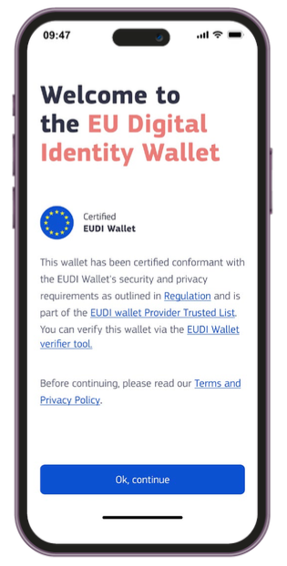

 

# Specification of EUDI Wallet Trust Mark

## Abstract

The present document specifies the technical specification and requirements for EUDI Wallet Trust Mark.

### [GitHub discussion](https://github.com/eu-digital-identity-wallet/eudi-doc-architecture-and-reference-framework/discussions/425)

## Versioning

| Version | Date | Description |
|---------|------------|------------|
| `0.1` | 20.01.2025 | Initial version for discussion |
| `0.2` | 18.02.2025 | Version with first internal feedback and improved scoping |
| `0.3` | 03.03.2025 | Version for public discussion with the Member States |

## 1 Introduction and Overview

The present document specifies technical and procedural aspects related to use of the **EU Digital Identity Wallet Trust Mark** (also referred as **EUDI Wallet Trust Mark** in this document) in the context of the EUDI Wallet, having regard to the [European Digital Identity Regulation], and in particular Articles 5a(5) and 3(50) thereof.

The purpose of a visible and recognisable trust mark is to add trust in the EUDI Wallet ecosystem and help the Users to recognise and validate the certification status of the EUDI Wallet Providers and their EUDI Wallet services.

### 1.1 Requirements in the European Digital Identity Regulation

- According to Article 3 (50), the EUDI Wallet Trust Mark is defined as **"a verifiable, simple and recognisable indication which is communicated in a clear manner that a European Digital Identity Wallet has been provided in accordance with this Regulation.”**
- According to Article 5a (5)(a) (iv), **the Trust Mark must be displayed to the User**.
- According to Article 5a (8)(a), **the Member States shall provide validation mechanisms free-of-charge, in order to: (a) ensure that the authenticity and validity of European Digital Identity Wallets can be verified;**

### 1.2 Scope for the Trust Mark Requirements and Design

The EUDI Wallet Trust Mark must be designed and copyright protected, as a kind of label, which is only allowed to be displayed if the EUDI Wallet of the User both complies to the requirements of EUDI Wallet Solutions while being recognised by at least one Member State. If either of the aforementioned base requirements become non-applicable, the Wallet Provider must remove the visible trust mark and any references to it.

As the European Digital Identity Regulation does not specify what 'verifiable' means, or where the Trust Mark shall be displayed, the realisation of the EUDI Wallet Trust Mark should be done via collecting the business requirements, identifying any complexity limitations if any, and considering the priorities of the involved stakeholders (Member States). Only after this can the work of deriving a technical specification that enables the European Commission to manage such trust marks be carried out.

 This early version of the document contains in several aspects proposals (not yet facts) and plans to facilitate the selection of desired technical complexity and process around the EUDI Wallet Trust Mark. It starts with collecting, primarily for discussion and prioritisation purposes, the proposed high-level requirements in an actor-oriented requirement format: **"As an *actor* I shall/should *verb* to achieve *my required goal*"**. This document does not address the visual or user experience related design elements related to the Trust Mark; these are provided separately and may be derived from the final requirements listed in this specification.

NOTE: Any possible requirements for trust indicators unrelated to the EUDI Wallet Solution are out of scope of this document. **The scope is the trust mark visible in the EUDI Wallet, not the Relying Party services and/or the Attestation Provider qualifications**.

### 1.3 Background: Existing European trust marks as a reference

To our knowledge, the European Commission has launched a few business-to-consumer type trust mark programmes related to EU Regulations: the earlier being the EU Trust Mark for Qualified Trust Services (launched as an Implementing Act for the [eIDAS Regulation]((https://eur-lex.europa.eu/legal-content/EN/TXT/HTML/?uri=CELEX:32014R0910)) and the newer Ecommerce Europe Trustmark for safe and ethical cross-border ecommerce. These trust marks are both bound to an EU Regulation, but are probably facing very different types of end customers and their awareness among EU Member State citizens is probably not actively studied. These are included here to provide a comparison/starting point for the topical EUDI Wallet trust mark specification work ahead.

#### 1.3.1 EU Trust Mark for Qualified Trust Services

[Commission Implementing Regulation (EU) 2015/806 of 22 May 2015 laying down specifications relating to the form of the EU trust mark for qualified trust services](http://data.europa.eu/eli/reg_impl/2015/806/oj) specifies a trust mark for QTSPs. Use of the trust mark is optional and it is not verifiable according to Article 23 (1) of Regulation 910/2014 (the eIDAS Regulation), therefore the way this trust mark is implemented may not meet the needs of EUDI Wallet Trust Mark.

Some visible uses of the QTSP trust mark for reference:

- [**TrustPro Web Page**](https://www.trustpro.eu/): Interactive logo, test this by browsing to the home page section just before the page footer area. Clicking on the EU Trust Mark links to the [EU/EEA Trusted List Browser](https://eidas.ec.europa.eu/efda/trust-services/browse/eidas/tls) page.
- [**Penneo QTSP page (blog)**](https://penneo.com/blog/qualified-trust-service-providers/): Passive use of the logo on the informative QTSP related blog page. The logo is in no way related to validation, the available validation means (checking from the EU LTL via the eIDAS Dashboard) are explained separately in the main text.

This overview of samples is in no way exhaustive as there may be well-hidden trust mark appearances among the EU QTSP web pages.

#### 1.3.2 Ecommerce Europe

The European Regulation on online dispute resolution for consumer disputes [EU 524/2013](http://data.europa.eu/eli/reg/2013/524/oj) states that "traders established within the European Union engaging in online sales or service contracts shall provide on their websites an electronic link to the European Online Dispute Resolution (ODR) platform (<http://ec.europa.eu/odr>)". Consumers who have a problem with an online purchase can file complaints on the European ODR platform.

When present on an online shop, the Ecommerce Europe Trustmark shows that the online shop is nationally certified for safe e-commerce by the respective national e-commerce association, and that it complies with European laws and regulations. This is done via a visual trust mark which is available for online shops only via the Member State's associations that are formally affiliated to the Ecommerce Europe scheme. Most EU countries have joined it, but some are notably missing, whilst others are closing their safe e-commerce activities (e.g. Norway from 1 February 2025). National associations typically have defined their own national graphic trust mark logo, use of which happens ahead or in parallel with the Ecommerce Europe equivalent.

It seems that the Qualified Trust Service trust mark is just a logo specified by the Regulation 524/2013, whose usage is granted for QTSPs present on the EU list of trusted lists, whereas the Ecommerce Europe trust mark is usually accompanied with a Member State specific trusted e-shop certificate, which can in the best case be verified through simple user-familiar means, such as linking the trust mark icon to the national association's trust mark verification page which shows key information of the online shop provider. A good example is the Swedish trygg E-handel certificate; it is implemented as a web site script provided for the company by the association upon accomplishing the registration and checks.

National certificates are commercial and incur often both an onboarding fee and an annual maintenance fee. The "issuer" of the E-commerce certificate (the local member association) must check the applicant's compliance against safe e-commerce rules set by Regulation 524/2013, available via [The Ecommerce Europe Trustmark Code of Conduct](https://ecommercetrustmark.eu/the-code-of-conduct/), prior to certificate issuance.

Some examples of national associations and their trust mark onboarding processes and list of certified e-shops:

- **Trygg E-handel (Sweden Ecommerce)**: Onboarding page [Om Trygg E-handel](https://tryggehandel.svenskhandel.se/om-trygg-e-handel/), member list page [Certifierade e-handlare](https://tryggehandel.svenskhandel.se/certifierade-e-handlare/)
- **Shopping Secure trust mark (Thuiswinkel.org)**: Onboarding page [Shopping Secure Trust Mark](https://www.thuiswinkel.org/en/trust/trustmarks/shopping-secure/), member list page [Member Search Page](https://www.thuiswinkel.org/en/member-search/)

### 1.4 Trust Mark as a verifiable attestation

The technical means to make a trust mark digitally verifiable (as required by the Regulation) could be very similar to use of certificate authorities and existing PKI infrastructure. The European Commission could not rule out issuing or guiding a Member State to issue the EUDI Wallet trust mark as a QEAA for a particular Wallet Provider's audited and certified Wallet Solution.

In theory, at logical level a viable approach would be to link the EUDI Wallet Trust Mark to existence of the Wallet Unit Attestation (WUA) of the User's EUDI Wallet. An EUDI Wallet unit needs this attestation to work in the EUDI ecosystem to start with. Additionally WUA will not be issued to non-certified Wallet instances by law, so a logical link can be associated easily. However, the intended purpose of the WUA is to be verified by Attestation Providers only, not by the Users of the EUDI Wallet, the Relying Parties attempting verification, or the EUDI Wallet unit independent of the User. Thus, WUA does not really work in context of a generally verifiable trust mark.

Thus, a means left to provide technical validation would be a separate Trust Mark attestation, which the EUDI Wallet User could verify against an EU-wide EUDI Wallet Trust Mark Verifier service (a Relying Party), likely to be hosted by the European Commission. This digitally signed attestation could be used to carry the agreed logo of the EUDI Wallet Trust Mark or link to an URI which contains this image, with additional links to detailed information of the EUDI Wallet certification status. In practice, the User would click or tap a button or link on the Wallet unit that opens the browser and initiates verification of the Trust Mark attestation by the back-end of a dedicated verification service (Relying Party). Upon user approving the presentation request, the verification service verifies the authenticity of the Trust Mark attestation, and displays a confirmation status message on the web page.

### 1.5 Alternative routes for meeting criteria of verifiability (for discussion)

As a conclusion on the overview section, the overall approach for introducing the EUDI Wallet Trust Mark should be kept simple-enough to ensure it can serve its intended (business) function without creating an overly complicated governance or technical framework for the Wallet Providers or other actors in the EUDI ecosystem to deploy in parallel to their main goal - provisioning and maintaining secure wallet solutions for the Member State citizens. The key is how the verifiability requirement of Art 3(50) is approached keeping the desired simplicity in mind. Below two alternative routes are described to receive initial feedback from the stakeholders.

#### 1.5.1 Logo and link to trusted list of EUDI Wallets (simple)

The most lightweight solution would be arrange a technical link from the UI view showing the EUDI Wallet logo to the eIDAS Dashboard's respective view listing certified EUDI Wallets per Member State. Verification of the EUDI Wallet certification is here left for the user (via browsing the linked view on EC web site and finding his/her EUDI Wallet in the list) without underlying technical verification means. A potential UI view sample of this approach captured from the European Commission's design team working on UX and graphics for the Trust Mark is shown in Figure 1 - the User would click the 'EUDI Wallet Provider List link' and be transitioned to EC's public web site).

Figure 1. Welcome view of an EUDI Wallet (concept image only)

#### 1.5.2 Verifiable EUDI Wallet Trust Mark attestation

The other approach, following the legal expectation for verifiability of the Trust Mark, would be linking of the visibility/visual showing of the EUDI Wallet Trust Mark to successful, User-requested verification of a new **verifiable attestation** based on reasoning in Section 1.4 above. This QEAA, EUDI Wallet Trust Mark Attestation, is provided for each operational EUDI Wallet in conjunction with the provisioning of the Wallet Unit Attestation (WUA), so that the User can actually verify their EUDI Wallet with a dedicated 'EUDI Wallet verifier tool' service (verifying the EUDI Wallet Trust Mark Attestation as User e.g. clicks/taps the other link on the UI view of Figure 1). Validy/invalidy indication view details would be up to the official verifier service (a single EU-wide service).

In this scenario, the preferred Attestation Providers for EUDI Wallet Trust Mark Attestation would be the Member States, and the attestation would be provided to each individual Wallet Unit belonging to a Wallet Provider's given certified Wallet Solution. EUDI Wallet Trust Mark Attestation could be requested automatically (without interaction required by the onboarding User, as will be with the Wallet Unit Attestation as well) by the Wallet Unit, after having received its Wallet Unit Attestation from the Wallet Provider.

A Wallet Provider could, in theory, obtain and showcase in the EUDI Wallet multiple EUDI Wallet Trust Marks for a given EUDI Wallet Solution's Wallet Units, corresponding to the number of EUDI Wallet certifications it has received from individual Member States. Essentially, this means a Wallet Provider could hold certifications from all EU Member States where the given EUDI Wallet Solution is recognised as a Certified EUDI Wallet. The EUDI Wallet Trust Mark Attestation could thus carry also some national approval related indicator along the EUDI Wallet Trust Mark logo, such as a small national flag suitable for display on a mobile device.

This implies in the EUDI trust framework that Member States would register as Attestation Providers for the aforementioned EUDI Wallet Trust Mark Attestation, and their trust anchors would be included in the Attestation Provider Trusted List published by the European Commission.

Another possibility is that the Attestation Provider for the EUDI Wallet Trust Mark is the Conformity Assessment Body (CAB) that certified the Wallet Solution, not the Member State. If so, there would be only one Trust Mark per Wallet Solution (and Wallet Unit). CABs would need in this case be ready to handle the role of a Qualified Trust Service Provider which is not currently the case.

> Note: This early version of the specification doesn't provide full technical design of this second solution. A dedicated Attestation Rulebook ([Topic 12](../annexes/annex-2/annex-2-high-level-requirements.md#a2312-topic-12---attestation-rulebooks) in the ARF) with suitable attributes and UX guidelines for this approach need to be agreed if EUDI Wallet Trust Mark attestation is selected as the realisation route after consultation with the stakeholders.

## 2 Actor-Oriented Requirements

Initial set of EUDI Wallet Trust Mark specific requirements are presented below, separated per actor/role in the EUDI ecosystem:

> Note: Some of the requirements in this section should be understood as alternative approaches (marked with ALTx), i.e. either/or selections are encouraged when evaluating/discussing the listed items with the stakeholders. There will be less or more requirements based on the agreed solution goal and complexity allowed for the Trust Mark verification solution.

### 2.1 (EUDI Wallet) User Requirements

**EWTM-U1**: As a future potential user of a EUDI Wallet, I want to have a clear understanding of how to distinguish real from fake EUDI Wallet Solutions.

**EWTM-U2**: As a a potential User of a EUDI Wallet, I want to see if I’m about to install a Certified EUDI Wallet Solution issued, recognised or mandated by a Member State.

> **Note: Member State could be an attribute in the EUDI Wallet Trust Mark Attestation. Upon verification, the verification service would show the list of Member States supporting PID issuance to this Wallet Solution.

**EWTM-U3**: As a potential User of a EUDI Wallet, I want to see which Member States support PID issuance to given Certified EUDI Wallet Solution.

**EWTM-U4**:  As a User of a Wallet Unit, after installation, I want a means to check that the EUDI Wallet Solution certification is legitimate (ALT1) before I proceed to the actual EUDI Wallet Instance activation (see [ARF section 6.5.3](https://github.com/eu-digital-identity-wallet/eudi-doc-architecture-and-reference-framework/blob/main/docs/architecture-and-reference-framework-main.md#653-wallet-unit-activation)) or (ALT2) as part of the Wallet Unit activation.

**EWTM-U5**:  As a User of a Wallet Unit, I want a means to check if the EUDI Wallet Unit that I am currently using is a Certified EUDI Wallet.

**EWTM-U6**:  As a User of a Wallet Unit, I want a visual but non-intrusive means to check if the EUDI Wallet certification is still valid, or certification status has changed since I last time visited my EUDI Wallet Unit.

**EWTM-U7**:  As a User of a Wallet Unit, I want to be able to read fresh high-level information of the Certification status when I select (click or tap) a visual indicator (logo) of the EUDI Wallet Trust Mark in the EUDI Wallet Unit.

**EWTM-U8**:  As a User of a Wallet Unit, I want to get an out-of-band indication (e.g. push message or e-mail message) if the certification status and thus the linked EUDI Wallet Trust Mark status of the EUDI Wallet Solution I use is revoked.

**EWTM-U9**:  As a User of a Wallet Unit, I want the EUDI Wallet Trust Mark to be always positioned in a standard location (such as UI view or menu item) in the EUDI Wallet Unit.

### 2.2 Wallet Provider Requirements

**EWTM-WP1**: As a Wallet Provider, I want a single centralised online process to apply for the EUDI Wallet Trust Mark (ALT1), unless issuance and my right to use of the EUDI Wallet Trust Mark is handled as one outcome of the Wallet Solution certification process at the Member State level (ALT2).

**EWTM-WP2**: As a Wallet Provider, I want a logo/logos with graphical guidelines for proper use of the EUDI Wallet Trust Mark in EUDI Wallet Solution implementation.

**EWTM-WP3**: As a Wallet Provider, I need early developer access to formal graphical element (with all of its potential variations, if they exist) of the EUDI Wallet Trust Mark for my development flow for embedding this element onto the well-defined user interface view in my EUDI Wallet Solution.

**EWTM-WP4**: As a Wallet Provider, I need EUDI Wallet Trust Mark deployment guidelines online (when allowed to show, where to show, how to deal with applicable mobile app store deployment and distribution rules if they impact the deployment of the Trust Mark) from a responsible organisation (the European Commission (ALT1) or Member State (ALT2)).

**EWTM-WP5**: As a Wallet Provider I want to link the EUDI Wallet Trust Mark logo on the Wallet Unit to the European Commission-provided link to the eIDAS Dashboard (ALT1), or directly to a EUDI Wallet Solution -specific link provided to me (ALT2).

### 2.3 European Commission Requirements

**EWTM-EC1**: As the European Commission, I want a specific site path to the list of certified, EUDI Trust Mark-eligible Wallet Solutions on the eIDAS Dashboard (as exists today for the existing Trust Services).

**EWTM-EC2**: As the European Commission, I want a direct link to an individual, EUDI Trust Mark-eligible Wallet Solution listed on the eIDAS Dashboard, so that I can provide this link to the Wallet Provider if they wish to connect their EUDI Wallet Trust Mark directly to the individual item on the eIDAS Dashboard.

**EWTM-EC3**: As the European Commission, I want to issue each certified EUDI Wallet Solution a verifiable EUDI Wallet Trust Mark Attestation (ALT1).

**EWTM-EC4**: As European Commission, I want a Member State certifying an EUDI Wallet Solution to issue an EUDI Wallet Trust Mark Attestation for each operational Wallet Unit of a Wallet Solution it certifies (ALT2).

### 2.4 Member State Requirements

> **EWTM-MS1**: Not available yet - to be added once desired solution approach is agreed with the Member States.

## 3 System Architecture and Functional Description

> Not available yet - to be added once desired solution approach is agreed with the Member States.

## 4 Annex A - EUDI Wallet Trust Mark Attestation Rulebook

> > Not available yet - to be added once desired solution approach is agreed with the Member States.
