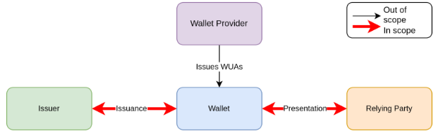

 

# Specification of Wallet Unit Attestations (WUA) used in issuance of PID and Attestations

## Abstract
The present document specifies how WUA is used in connection with PID Providers and Attestation Providers.

#### [GitHub discussion](https://github.com/eu-digital-identity-wallet/eudi-doc-architecture-and-reference-framework/discussions/450)

## Versioning

| Version | Date        | Description                                                  | 
|---------|-------------|--------------------------------------------------------------|
| `0.1`   | 28.03.2025  | Initial version for first discussions.                       | 

## 1. Introduction and Overview
The WUA (Wallet Unit Attestation) topic has been discussed in the European Digital Identity Cooperation Group. As a result a number of High Level Requirements (HLRs) have been proposed. The present document is set to enable actors in the EUDIW ecosystem to follow the HLRs while ensuring the interoperability of the ecosystem. The HLRs are available in the [ARF ANNEX 2 Topic 9](https://eu-digital-identity-wallet.github.io/eudi-doc-architecture-and-reference-framework/latest/annexes/annex-2/annex-2-high-level-requirements/#a239-topic-9---wallet-unit-attestation). 

### 1.1. WUA Use Cases (from ARF HLRs)
From the HLRs of the ARF it is clear that the WUA functionality must support a certain set of information to be transferred from the Wallet Provider (via the Wallet Unit) to the Issuing entities (i.e., PID Provider or Attestation Provider) and another set of information to the Relying Parties. That is the content of the WUA differs based upon which party receives the information. Additionally, the WUA functionality will be used as part of separate protocols for respective issuance and presentations. We therefore distinguish between these parts of the functionality using the following terminology: 

* Issuance WUA: A Wallet Unit Attestation which information will be transferred from a Wallet Provider to the Issuer via the Wallet during issuance. Issuance WUAs must allow Issuers to determine the security level of the wallet, authenticate the wallet and check that it has not been revoked for the lifetime of the attestation they are issuing. 
* Presentation WUA: A Wallet Unit Attestation which information will be transferred from a Wallet Provider to a Relying Party via the Wallet during presentation. Presentation WUAs must enable a Relying Party to authenticate the wallet and check that it has not been revoked at the time of presentation.

In order to ensure interoperability, it is critical that this specification is aligned with other standards, i.e., ISO 18013-5, OpenID4VCI and OpenID4VP. This collaboration has identified several issues in relation to Presentation WUA that needs to be further discussed. To meet the current deadlines of this STS, **this version of the technical specification will only address the Issuance WUA**. An extension to this specification (or a second specification) addressing the Presentation WUA will be added at a later point. Note: This split is done to allow time for alignment with other protocols and standards used in the EUDIW ecosystem, e.g. OpenID4VP and ISO 18013-5. 

In the forthcoming sections, we will use this terminology when discussing the technical implementations of the respective parts of the WUA functionality.

Note that the Issuance WUA corresponds closely with the functionality of what was previously dubbed a Wallet Trust Evidence (WTE) and the functionality of a presentation WUA corresponds closely with what was previously dubbed a Wallet Instance Activation (WIA).

### 1.2. Scope of the WUA STS
The WUA STS must specify the following things:

* How WUAs are transferred between parties for the different use cases. 
* The format of the WUA including its encoding and integrity protection mechanism. 
* The revocation mechanism for WUAs.
* The mechanism for ensuring keys in the WUA and keys issuers attest are stored in the same WSCD. 
* The content of the WUAs for the individual use-cases. 

Note that how Wallet Providers issue WUAs to the wallet are out of scope for the technical specification as this will only be done by the wallet providers themselves and does therefore not require any standard to achieve interoperability. 

**We also highlight that the implementing act CIR [(EU) 2024/2977](https://eur-lex.europa.eu/eli/reg_impl/2024/2977/oj) Article 5, mandates that PID Providers can verify the revocation status of the WUA used in issuance of PID**. Hence revocation must be supported, at the very least in the context of PID issuance.
How and why revocation is triggered is, however, out of scope of this specification.

Below is a simple depiction of which parts of interactions involving WUAs between different actors in the EUDIW ecosystem are in scope of the WUA specifications:

  

## 1.3. Design Constraints

The first and foremost design constraint is that the technical specification must enable the high level requirements defined in the ARF. Additionally it should be strived that the WUA mechanism is compatible with the existing technical specifications for the EUDIW ecosystem. I.e., the mechanism must be compatible with ISO18013-5 as well as OID4VCI, OID4VP. The goal is that the solution is technically simple and should not introduce unnecessary complexity.

## 1.4. Current Solution Sketch

Below we sketch the solution which we at the time of writing see as the best way forward and could be used as a basis for further development.

* **Issuance WUAs**:  
  * Lifetime and format: Will be long-lived use-only-once attestation in JWT format signed by the Wallet Provider.   
  * Content: Will contain information about the security level of the Wallet’s WSCA/WSCD, a public key corresponding to a private key that the Wallet Provider guarantees is stored in the corresponding WSCA/WSCD, and a revocation ID. The public key and revocation ID will be different between any two WUAs.  
  * Transport: Will be transferred on the protocol level of OID4VCI using the existing mechanism for this.  
  * Revocation: The Wallet Provider will keep a revocation status list for these issuance WUAs which PID providers must check regularly for the duration of the validity period of the attestation they issue after having received this.

# 2\. Proposed solution

## 2.1. Lifetime and format of WUAs
The lifetime of the WUA is specified by the Wallet Provider, taking security, privacy and interoperability into consideration. The Wallet provider must also consider that the ARF specifies that *The expiration date of the issued PID or Attestation SHALL be no later than the expiration date of the WUA presented as part of the issuance process.*, hence the lifetime of the WUA should be as long-lived as possible. 

>Question: Should we specify a concrete lifetime? It could be a "SHOULD" requirement, e.g. "The lifetime of the issued WUA SHOULD be 2 years.".

The ARF specifies that OID4VCI is to be used to transport the WUA used for issuance, hence the format of the WUA shall be supported by OID4VCI. The OID4VCI protocol allows to transfer key attestations (which is a common term for a data item similar to the WUA). They do so by allowing proofs to be transferred alongside a credential request from a wallet. 

In particular, three  proof types are defined: 
* *jwt:* Proofs of possessions on a specific key (i.e., signatures on challenge from context). This may also carry a key attestation within the header of the JWT.
* *ldp_vp:* A W3C Verifiable Presentation used for proof of possession. 
* *attestation:* A JWT representing a key attestation without using a proof of possession. 

>Note, that the proofs described in OID4VCI are focused on key attestation and do not appear to address other attributes relevant to the WUA, e.g. hardware properties. The protocol does specify *key_storage* and *user_authentication* elements (in Appendix D.1 and D.2) that can be used to indicate *Attack Potential Resistance*. These elements can be extended to transfer WUA relevant information and only requires the attribute names to be collision-resistant values.

>We propose the *jwt* type of proof is used to handle the WUA, as this would allow for proof of possessions. We also propose to map the attributes listed in Appendix 1, to a collision-resistant naming-scheme, e.g. *eudi_wallet_device_supported_features_device_engagement_qrcode*  

## 2.2. Content of WUAs
Each WUA shall contain a unique public key and revocation ID.

In addition, other relevant information, that allows a PID Provider or Attestation Provider to make well-grounded decisions, should also be included. During the previous WTE discussions, a preliminary list of attributes has been identified. This list can be found in Appendix 1, and could be used as a baseline for what should be included in this STS. These attributes will be mapped to the collision-resistant naming-scheme mentioned in Section 2.1.
**The attributes listed in Appendix 1 have not been updated for some time and we welcome any comments in that regard.** 

>Note that some of the information/fields listed in Appendix 1, may already covered by the OID4VCI specification, e.g., the public key of the WUA, validity period and signature. 

## 2.3. Transport of WUAs
The WUA shall be transported to the PID Provider or Attestation Provider, using the OID4VCI protocol, in the *proof* element of an *Credential Request*. 

## 2.4. Revocation of WUAs
Revocation status list should be used as everywhere else in the ARF. 

>We note that this is supported by the *key_attestation* element in OID4VCI.

# 3\. Open Topics To Discuss

## 3.1. Scalability of Issuance WUAs
Issuance WUAs will be one-time only and the issuers (at least PID Providers) must be able to check the revocation status for the entire life-time of the attestation they intend to issue, this approach will create huge revocation checking lists. Can we do anything to mitigate this?

## 3.2. Ensuring Keys are Stored in the Same WSCD
When an issuer receives a WUA with a public key, it is recommended that the issuer checks that the corresponding private key to the public key which they attest to (which is different from the WUA public key), resides on the same WSCD as the WUA private key. 

At least two options exists:

1. Proof of Association (PoA) by Eric Verheul   
2. Asynchronous Remote Key Generation (ARKG)

How should such additional proofs be forwarded in the OID4VCI protocol and which WSCDs supports the above solution?

## 3.3. Privacy Risks

A concern regarding the privacy of having Wallet Providers issue WUAs were raised:
When presenting an Issuance-WUA, the issuer (PID Provider or Attestation Provider) can learn the identity of the Wallet Provider. Is this problematic?
Are there any overlooked privacy risks in the solution sketched above?

## 3.4. Alternatives to the Above Solution Sketch

The above solution sketch reflects an initial proposal for a technical solution to the problem. Are there any overlooked drawbacks/alternatives solutions that were overlooked with nicer properties?  

# Appendix

## Appendix 1
**The attributes listed in Appendix 1 have not been updated for some time and we welcome any comments in that regard.**

Table 1:
| Name of data object | Description        | Encoding                                  | 
|---------|-------------|--------------------------------------------------------------|
| WUAVersion  | Version number of the WUA  | TBD                       | 
| WalletInstance GeneralInfo | General information about the Wallet Instance. | See Table 2. |
| WalletInstance SupportedStandards | Standards supported by the Wallet Instance for the format and releasing of attestations. | See Table 3. |
| DeviceSupported Features | Technical features supported by the Wallet Instance and the User device on which it is installed. | See Table 4. | 
| WSCDInformation | Information on (one of) the WSCD(s) available to the Wallet Instance, as well as on the key pair protected by that WSCD and attested by this WUA. | See Table 5. |
| WUAValidityPeriod | Starting and ending date of the validity period of the WUA. | Date(s) / time(s) | 
| Signature | Value of the WUA signature by the Wallet Provider, including algorithm parameters if needed. | Bitstring | 

Table 2:
| Name of data object | Description        | Encoding                                  | 
|---------|-------------|--------------------------------------------------------------|
| WalletProviderName | Name of Wallet Provider, as listed on the Trusted List of Wallet Providers | Text string | 
| WalletSolutionID | Identifier of the Wallet Solution, as listed on the Trusted List of Wallet Providers | Depending on Trusted List implementation |
| WalletSolutionVersion | Version of the Wallet Solution | Depending on Wallet Provider | 
| WalletInstanceID | Identifier for the Wallet Instance. unique within the context of the Wallet Provider. To be used for example when a PID Provider requests the revocation of the Wallet Instance; see Epic 38 section 2.5. | Depending on Wallet Provider |
| WalletSolution CertificationInformation | Which conformity assessment body certified the Wallet Solution, the applicable certification number, etc. | Depending on certification process |
| WalletTrustMarkInformation | URLs and QR codes to the EUDI Wallet Trust Mark logo, eIDAS Dashboard page of certified Wallets, etc. This information is carried in the WUA to enable the EUDI Wallet Trust Mark function as specified in the [EUDI Wallet Trust Mark Technical Specification](https://github.com/eu-digital-identity-wallet/eudi-doc-architecture-and-reference-framework/blob/main/docs/technical-specifications/ts1-eudi-wallet-trust-mark.md). | See Table 6. |

Table 3:
| Name of data object | Description        | Encoding                                  | 
|---------|-------------|--------------------------------------------------------------|
| SD-JWT-VC FormattedAttestations | Wallet Instance supports attestations in the format specified in [SD-JWT-VC]. | Boolean |
| ISO18013-5 FormattedAttestations | Wallet Instance supports attestations in the format specified in [ISO/IEC 18013-5]. | Boolean |
| OpenID4VPProtocol | Wallet Instance supports the protocol specified in [OpenID4VP] to release attestations. | Boolean |
| ISO18013-5Protocol | Wallet Instance supports the device retrieval protocol specified in [ISO/IEC 18013-5] to release attestations. Further details are given in Table 4. | Boolean |
| ISO18013-7Protocol | Wallet Instance supports the ‘device retrieval to a website’ protocol specified in [ISO/IEC 18013-7] to release attestations. | Boolean | 

Table 4:
| Name of data object | Description        | Encoding                                  | 
|---------|-------------|--------------------------------------------------------------|
| DeviceEngagement QRCode | Wallet Instance and User device support device engagement using QR code, as specified in [ISO/IEC 18013-5]. | Boolean | 
| DeviceEngagement NFC | Wallet Instance and User device support device engagement using NFC, as specified in [ISO/IEC 18013-5]. | Boolean |
| DeviceRetrievalBLE | Wallet Instance and User device support device retrieval using BLE, as specified in [ISO/IEC 18013-5]. | Boolean |
| DeviceRetrievalNFC | Wallet Instance and User device support device retrieval using NFC, as specified in [ISO/IEC 18013-5]. | Boolean |
| DeviceRetrieval WiFiAware | Wallet Instance and User device support device retrieval using Wi-Fi Aware, as specified in [ISO/IEC 18013-5]. | Boolean |
| OfflineSupport | Wallet Instance is able to perform device engagement and device retrieval when User device is offline. Please also refer to WSCDType in Table 5. | Boolean |

Table 5:
| Name of data object | Description        | Encoding                                  | 
|---------|-------------|--------------------------------------------------------------|
| WSCDID | Unique (e.g., sequential) identifier for this WSCD within the context of the Wallet Instance, to be used for referencing this WSCD in the OpenID4VCI protocol;| Number |
| WSCDType | Technical implementation of the WSCD, for instance:<ul><li> remote HSM </li><li>external smart card  </li><li>embedded UICC </li><li>internal native cryptographic hardware </li><li>embedded SE </li><li>‘classical’ removable UICC </li><li>internal TEE </li><li>… </li></ul>Notes: <ul><li>Currently, there is no agreed list of technical implementations of a WSCD. Once such a list is specified, it may be used here.</li><li>As the attestation Provider does not directly interface with the WSCD, and the security level of the WSCD is attested to by the Wallet Provider, in principle an attestation Provider does not need to know the WSCD type. However, different WSCD types may lead to different behaviour of the attestation in some use cases. For example, if an attestation is bound to a remote HSM, this means that it will not work if the User device is offline. As another example, If the attestation is bound to a removable UICC, in principle the User could easily swap the attestation from one device to another. Therefore, Providers may be interested in knowing this. A decision on including this information will be taken later.</li></ul> | Number| 
| WSCDSupported Algorithms | Cryptographic algorithms supported by the WSCD, for instance <ul><li>AES (+ key lengths)</li><li>RSA (+ key lengths)</li><li>DSA (+ key lengths)</li><li>ECDSA (+ hash lengths)</li><li>Ed25519</li><li>Ed448</li><li>ECDH</li><li>...</li></ul>| Bitmap |
| WSCDSupported EllipticCurves | Elliptic curves supported by the WSCD for ECDSA and/or ECDH, for instance:<ul><li>Curve P-256</li><li>Curve P-384</li><li>Curve P-521</li><li>brainpoolP256r1</li><li>brainpoolP320r1</li><li>brainpoolP384r1</li><li>brainpoolP512r1</li><li>…</li></ul> |Bitmap |
| WSCDCertification Information | Information about the certification achieved by the WSCD, such as under which scheme (for instance, Common Criteria, GlobalPlatform), the requirements that were evaluated (for example, the Protection Profile used), the evaluation level, and perhaps other applicable information. | Depending on certification process and need of Providers |
| WSCDLoA | Level of Assurance for all functions offered by the WSCD:<ul><li>High</li><li>Substantial</li><li>Low</li></ul>| Number|
| PublicKey| The value of the public key of which the corresponding private key is protected by this WSCD, plus other key parameters if needed. | Bit string |

Table 6:
| Name of data object | Description        | Encoding                                  | 
|---------|-------------|--------------------------------------------------------------|
| TrustMarkResourceURL | URL of the official EUDI Wallet Trust Mark logo and User Info resources for rendering in the Wallet user interface; contents provided and hosted by the EC. | URL | 
| ListOfCerfifiedWalletsURL |  URL of the public list of certified EUDI Wallet Solutions in EU; provided and hosted by the EC. | URL |
| ListOfCerfifiedWalletsQRCode |  QR Code containing the information of ListOfCertifiedWalletsURL | ISO-8859-1 Byte mode QR code |
| WalletSolutionInfoPageURL | URL to the certified Wallet Solution's own information page under the list of certified EUDI Wallet Solutions page. Constructed from the ListOfCertifiedWalletsURL URL appended with a '?'+ the WalletSolutionID Identifier of the Wallet Solution (see Table 2). *Note: This allows, as necessary, a direct search query from the Wallet user interface to open the individual Wallet Solution page from the list behind the top level of certified Wallets list page*. | URL |
| WalletSolutionInfoPageQRCode |  QR Code containing the information of DirectWalletSolutionInfoURL | ISO-8859-1 Byte mode QR code |
